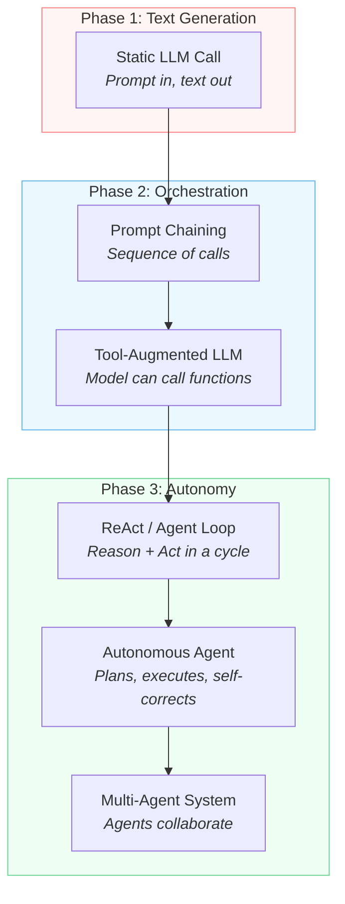
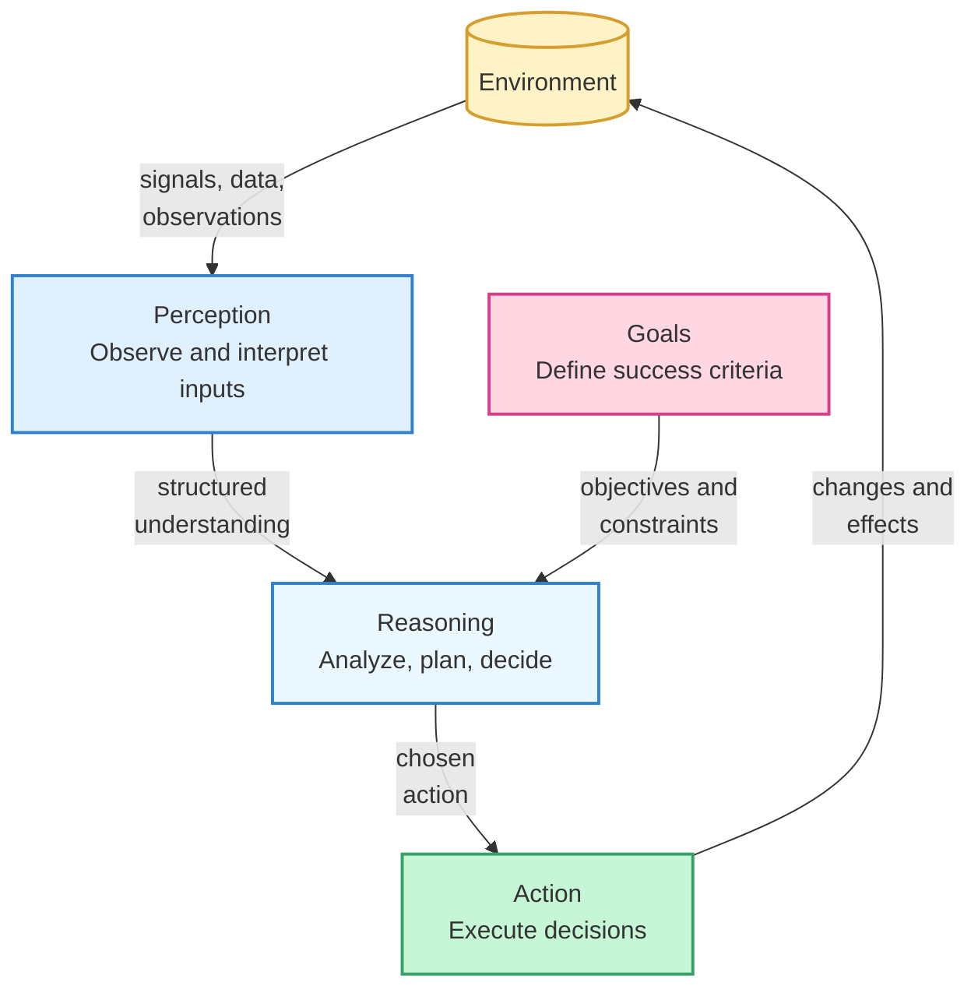
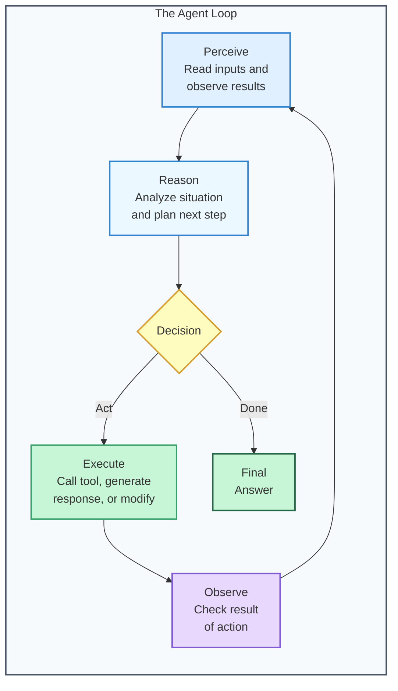
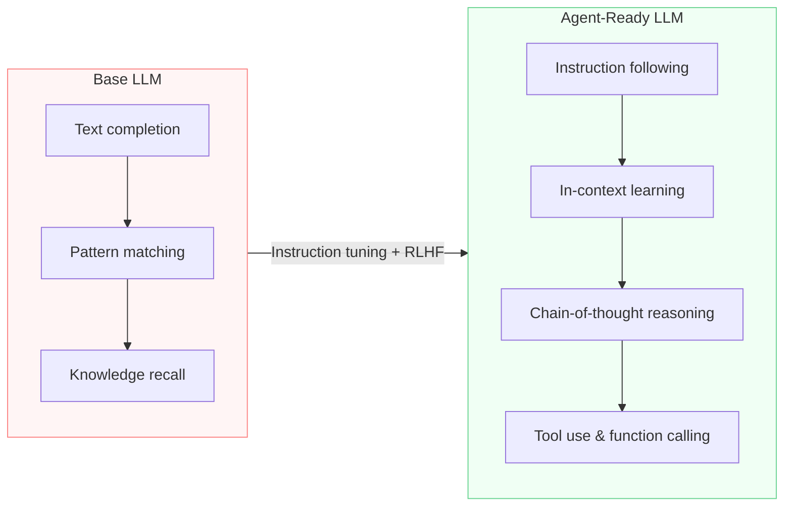
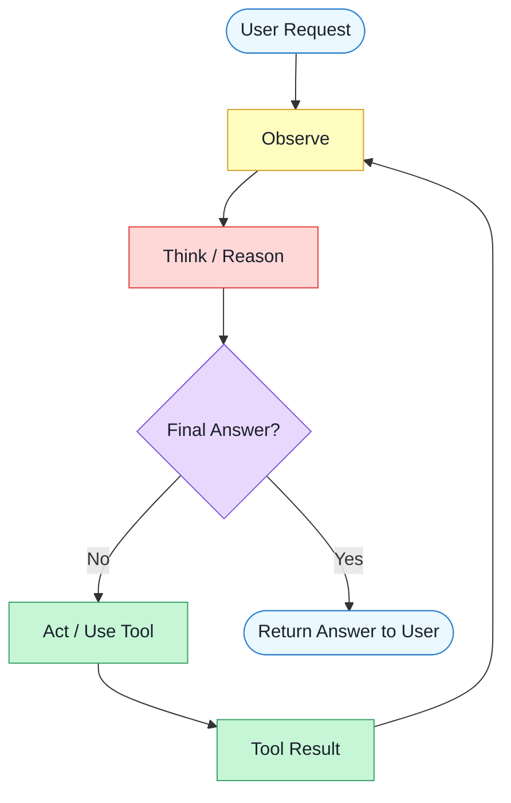
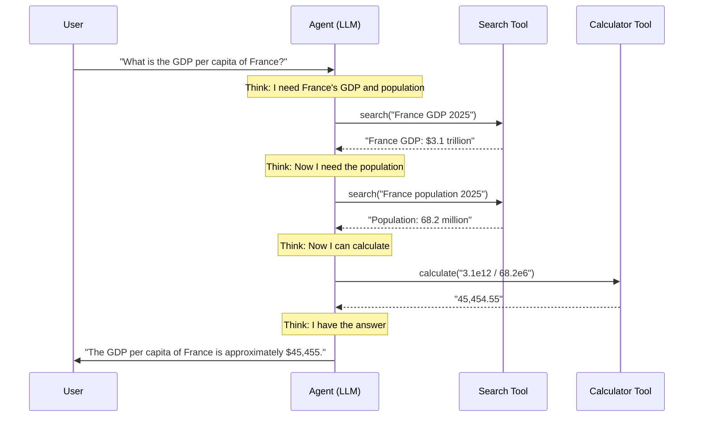
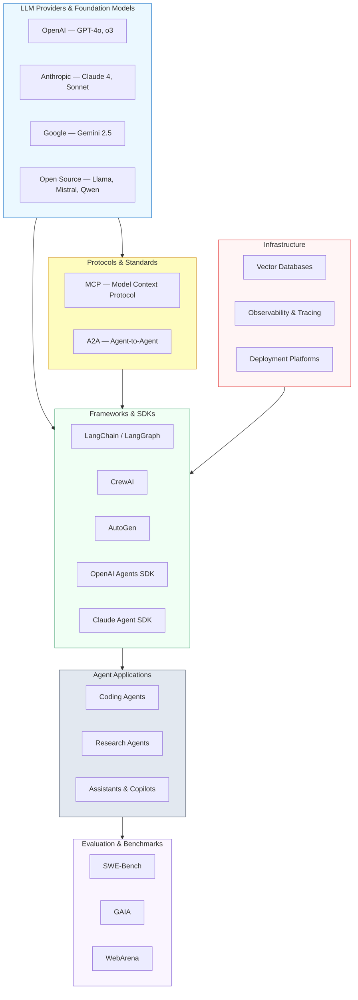
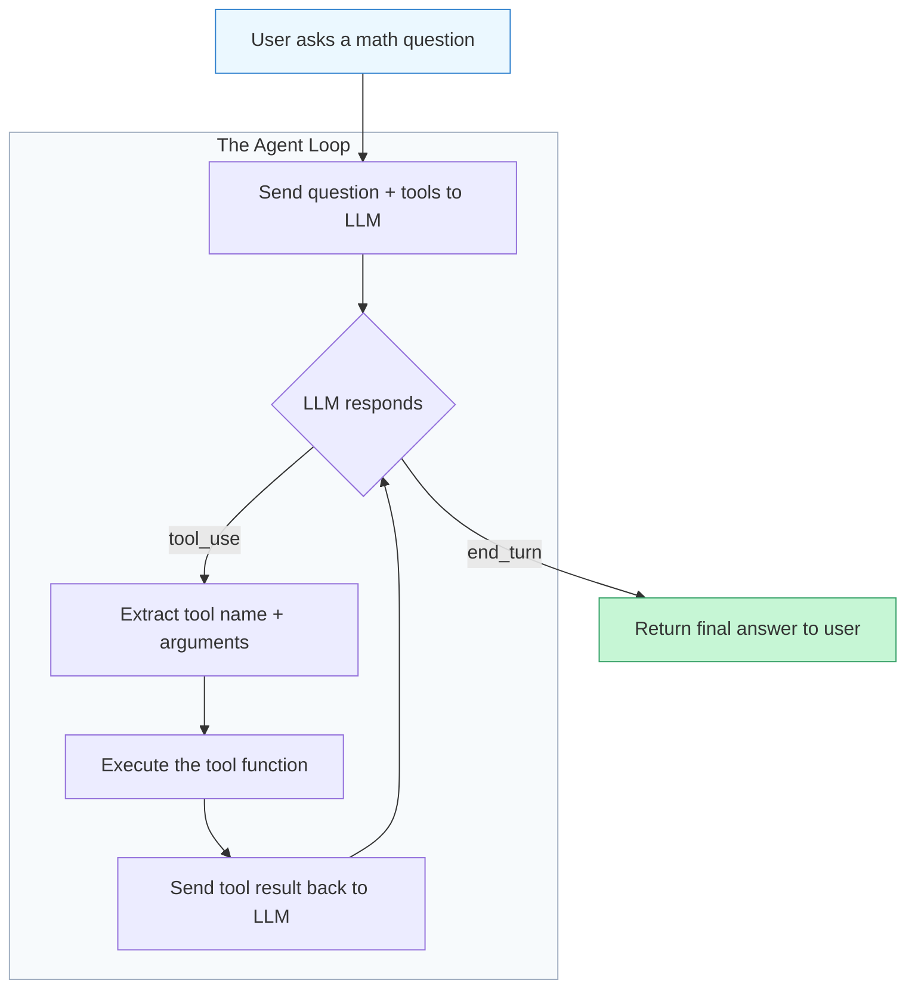
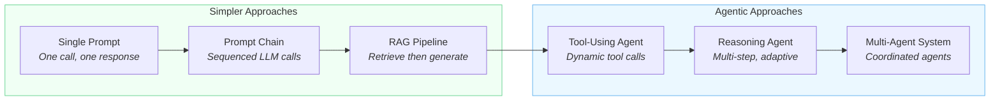
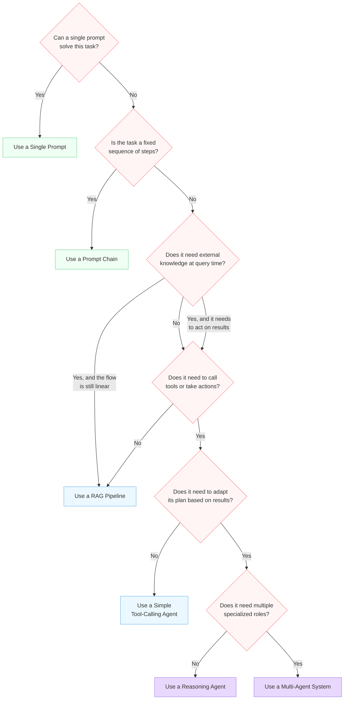

# Foundations of LLM Agents

*What agents are, why they matter, and the core loop that powers every agentic system*

    Section 1.1: Why Agents Matter


## 1.1 Overview

Large Language Models are remarkable. They can draft essays, explain quantum physics, write code, and translate between languages -- all from a single prompt. Yet for all their power, a raw LLM call is fundamentally **stateless** and **passive**. You send a prompt, you get a response, and the interaction ends. The model cannot check whether its answer was correct, look up today's stock price, run the code it just wrote, or remember what you discussed yesterday.

This lesson explores why that limitation matters and how the field is moving beyond it. We will trace the evolution from simple prompt-and-response interactions to **agentic systems** -- autonomous, goal-driven architectures where the LLM acts as a reasoning engine embedded in a loop of perception, thought, and action.

> This is the opening lesson of the entire academy. Everything you learn here sets the stage for the twelve modules ahead.

## 1.1 The World Before Agents

To appreciate why agents matter, consider how most applications used LLMs circa 2023. The pattern was straightforward:

1. A user (or application) constructs a **prompt**
2. The prompt is sent to an LLM via an API call
3. The LLM returns a **completion** -- a block of generated text
4. The application displays the result

This is the **single-turn, stateless paradigm**. Think of it like asking a brilliant colleague a question in a hallway: you get a thoughtful answer, but they immediately forget the conversation, have no access to your company's databases, and cannot go run an experiment to verify their response.

This pattern works well for many tasks -- summarization, translation, brainstorming, simple Q&A. But it breaks down the moment a task requires any of the following:

- **Multi-step reasoning** -- solving a problem that takes several dependent steps, where later steps depend on the results of earlier ones
- **External knowledge** -- accessing information that was not in the training data, such as live databases, APIs, or private documents
- **Verification** -- checking whether the generated output is actually correct or useful
- **Action** -- doing something in the real world: sending an email, writing a file, deploying code
- **Persistence** -- remembering context across interactions to build on prior work

These are not edge cases. They describe most real-world work.

## 1.1 The Gap: What Static LLMs Cannot Do

Imagine you ask an LLM to "research the top five competitors in our market and produce a comparison report." A static LLM call will generate something that *looks* like a report. But it cannot actually browse the web to find current competitors. It cannot access your company's internal data to compare features. It cannot verify that the companies it names still exist. And it cannot refine its analysis based on your feedback without you manually re-prompting it with all the prior context.

The gap is not intelligence -- the model may reason brilliantly. The gap is **agency**: the ability to perceive an environment, form a plan, take actions, observe results, and adapt.

This is the fundamental insight that launched the agentic AI movement:

> An LLM is a powerful reasoning engine, but reasoning alone is not enough. To solve real problems, the model needs a body -- tools, memory, and a loop.

## 1.1 From Calls to Agents: The Evolution

The shift from static LLM calls to agents did not happen overnight. It followed a natural progression, with each step adding a new capability:



Let us walk through each stage:

**Static LLM Call** -- The baseline. One prompt, one response. No memory, no tools, no follow-up. Useful but limited.

**Prompt Chaining** -- Developers realized they could break complex tasks into multiple LLM calls, feeding the output of one into the next. This added structure but was rigid -- the chain was predetermined, not adaptive.

**Tool-Augmented LLM** -- The LLM gained the ability to call external functions: search the web, query a database, run code, call an API. This was a critical leap. The model was no longer limited to its training data. You will explore this in depth in Module 3 (Tool Use & Function Calling).

**ReAct / Agent Loop** -- Instead of a fixed chain, the LLM operates in a dynamic loop: **Reason** about what to do next, **Act** by calling a tool, **Observe** the result, and repeat until the goal is met. This is the core pattern you will study in Lesson 4 of this module (The Agent Loop).

**Autonomous Agent** -- The loop gains planning, memory, and self-correction. The agent can break a goal into subtasks, track progress, recover from errors, and persist knowledge across sessions. Module 6 (Memory & Knowledge) and Module 4 (Agent Architectures) cover these capabilities.

**Multi-Agent System** -- Multiple specialized agents collaborate, each handling a different aspect of a complex task. A planner agent delegates to a researcher agent, a coder agent, and a reviewer agent. Module 9 (Multi-Agent Systems) dives deep into this pattern.

## 1.1 Why Now? The Convergence

Agents are not a new idea. The concept of autonomous goal-driven software has existed in AI research for decades. What changed is that three capabilities converged simultaneously:

1. **Powerful foundation models** -- Modern LLMs are strong enough to follow complex instructions, reason through multi-step problems, and generate structured outputs (like JSON or function calls) reliably. They serve as a capable "brain" for an agent.

2. **Tool-use protocols** -- Standards and APIs for letting LLMs invoke external tools have matured. Function calling, the Model Context Protocol (MCP), and tool-use schemas allow models to interact with the outside world in a structured, predictable way.

3. **Orchestration frameworks** -- Libraries and platforms (LangGraph, CrewAI, OpenAI Agents SDK, Google ADK, and others) provide the scaffolding to build, run, and manage agents without reinventing the wheel. You will survey these in Module 7 (Agent Frameworks & SDKs).

The result is that building an agent went from a research project to a weekend project. But building a *reliable, safe, production-grade* agent -- that still takes deep understanding. Which is why this academy exists.

## 1.1 The Analogy: From Calculator to Employee

One way to understand the shift is through a workplace analogy:

A **static LLM call** is like handing a brilliant employee a question on a sticky note and getting a written answer back. They are smart, but they have no desk, no computer, no access to your systems, and no memory of prior conversations.

An **LLM agent** is like onboarding that same employee fully. They get a desk (persistent state), a computer (tools), access to company systems (APIs and databases), a task tracker (planning), the ability to ask follow-up questions (perception), and the judgment to know when to escalate (self-correction). Now they can own a project end-to-end.

The underlying intelligence is the same. The difference is the **scaffolding** around it -- the tools, the memory, the loop, the environment. That scaffolding is what turns a language model into an agent.

## 1.1 Real-World Impact

Why should you care? Because agents unlock categories of applications that were previously impossible or impractical with static LLM calls:

- **Software engineering agents** that can read a codebase, plan changes across multiple files, write code, run tests, fix failures, and submit pull requests
- **Research agents** that search the web, read papers, cross-reference claims, and synthesize cited reports
- **Customer support agents** that access account data, diagnose issues, take corrective actions, and follow up
- **Data analysis agents** that connect to databases, write and run queries, generate visualizations, and iterate based on what they find
- **DevOps agents** that monitor systems, diagnose incidents, execute runbooks, and escalate when needed

In each case, the agent does not just *suggest* an answer -- it *does the work*. It closes the gap between knowing what to do and actually doing it.

> The shift from "AI that advises" to "AI that acts" is the defining transition of this era. Agents are the mechanism.

## 1.1 What This Academy Will Cover

This lesson is your entry point into a twelve-module journey through the entire landscape of LLM agents. Here is a preview of the road ahead:

- **This module (Foundations)** builds your mental model: what agents are, how the agent loop works, and when to use them
- **Module 2 (Prompting & Reasoning)** covers how to craft prompts that unlock reliable reasoning, the cognitive engine of every agent
- **Module 3 (Tool Use)** teaches how agents interact with the outside world through function calling and tool protocols
- **Module 4 (Architectures)** surveys the major architectural patterns: ReAct, Plan-and-Execute, LLMCompiler, and more
- **Module 6 (Memory & Knowledge)** addresses how agents persist and retrieve information across interactions
- **Module 9 (Multi-Agent Systems)** explores how multiple agents collaborate to tackle complex workflows
- **Module 11 (Production & Safety)** covers the hard problems of deploying agents reliably: guardrails, observability, cost control, and safety

Each module builds on the ones before it, so take them in order when possible.

## 1.1 Summary

Static LLM calls are powerful but fundamentally limited -- they cannot take actions, remember context, or pursue multi-step goals. The shift to **agentic systems** addresses these limitations by embedding the LLM in a loop of reasoning and action, augmenting it with tools, and giving it memory.

This is not just a technical evolution -- it is a paradigm shift in how we build software with AI. The LLM stops being a text-generation endpoint and becomes a reasoning engine at the center of an autonomous system.

In the next lesson, we will formalize this intuition. **What Is an Agent?** will give you a precise definition, breaking agents down into their core components: perception, reasoning, action, and the environment.

---

    Section 1.2: What Is an Agent?


## 1.2 Overview

As we saw in *Why Agents Matter*, static LLM calls have fundamental limitations — they respond to a single prompt, produce a single output, and have no ability to observe results, adapt, or take further action. But what exactly transforms an LLM from a passive text generator into an **agent** capable of solving complex, multi-step problems?

In this lesson, we will formally define what an agent is, trace the concept from classical AI through to modern LLM-powered systems, and break down the core components that every agent shares. By the end, you will have a precise mental model for what makes something an agent — and what does not.

## 1.2 The Classical Definition of an Agent

The concept of an **agent** has deep roots in artificial intelligence. Stuart Russell and Peter Norvig, in their foundational textbook *Artificial Intelligence: A Modern Approach*, define an agent as:

> **An agent is anything that can be viewed as perceiving its environment through sensors and acting upon that environment through actuators.**

This definition is deliberately broad. It applies to humans (eyes as sensors, hands as actuators), robots (cameras and motors), and software systems (API inputs and function calls). The key insight is the **perception-action loop**: an agent does not simply execute a script — it observes, decides, and acts.

Three properties distinguish an agent from ordinary software:

- **Autonomy** — the agent operates without constant human direction, making its own decisions about what to do next
- **Reactivity** — the agent perceives changes in its environment and responds to them
- **Goal-directedness** — the agent's actions are oriented toward achieving a specific objective, not just following a predetermined sequence

## 1.2 The Five Core Components

Every agent, from the simplest thermostat to the most sophisticated AI system, is built from five fundamental components. Understanding these components gives you a framework for analyzing and designing any agent.



### 1. Environment

The **environment** is everything external to the agent that it can observe or influence. For a robot, the environment is the physical world. For an LLM agent, the environment might include:

- A user's conversation and requests
- Files on a filesystem
- APIs and web services
- Databases and knowledge bases
- The outputs of other agents or tools

Environments vary in complexity. They can be **fully observable** (the agent can see everything relevant) or **partially observable** (the agent works with incomplete information). They can be **deterministic** (actions have predictable outcomes) or **stochastic** (outcomes involve uncertainty). Most real-world environments that LLM agents operate in are both partially observable and stochastic — which is precisely what makes agents valuable.

### 2. Perception

**Perception** is the agent's ability to observe and interpret signals from its environment. In classical AI, this might involve processing camera images or sensor readings. For an LLM agent, perception includes:

- Reading and understanding user messages in natural language
- Parsing structured data returned from tool calls or APIs
- Interpreting error messages and system feedback
- Understanding the context of a multi-turn conversation

The LLM's natural language understanding is what makes its perception so powerful — it can interpret ambiguous, informal, and context-dependent inputs that would break a traditional rule-based system.

### 3. Reasoning

**Reasoning** is the cognitive core of the agent — the process of analyzing perceived information, considering goals, evaluating options, and deciding what to do next. This is where LLM agents truly differentiate themselves. Their reasoning capabilities include:

- **Planning** — breaking complex goals into manageable steps
- **Analysis** — evaluating information and identifying patterns
- **Decision-making** — choosing among alternative actions
- **Self-reflection** — assessing whether the current approach is working and adjusting strategy

In an LLM agent, reasoning happens through the model's text generation process, often enhanced by techniques like chain-of-thought prompting and structured deliberation frameworks.

### 4. Action

**Action** is how the agent affects its environment. Without the ability to act, an agent is just an observer. For LLM agents, actions typically include:

- Generating text responses to users
- Calling external tools and APIs (searching the web, running code, querying databases)
- Reading and writing files
- Sending messages to other systems or agents
- Deciding to stop and return a final answer

The range of available actions defines the agent's **action space** — what it can potentially do. A well-designed agent has actions that are powerful enough to accomplish its goals but constrained enough to remain safe and predictable.

### 5. Goals

**Goals** define what success looks like for the agent. They give the reasoning component something to optimize toward. Goals can be:

- **Explicit** — directly stated by the user ("find me the cheapest flight to Tokyo")
- **Implicit** — embedded in the system prompt or agent design ("be helpful and accurate")
- **Hierarchical** — a high-level goal decomposed into sub-goals ("build a web app" → "design the schema" → "create the database" → "write the API")

Without clear goals, an agent has no basis for choosing one action over another. Goals are what transform a sequence of actions into purposeful behavior.

## 1.2 The Perception-Reasoning-Action Loop

These components do not operate in isolation — they form a continuous loop. The agent perceives, reasons, acts, and then perceives again to see the result of its action. This **feedback loop** is what gives agents their power.



Consider what happens when you ask an LLM agent to research a topic and write a summary:

1. **Perceive** — the agent reads your request and understands the topic
2. **Reason** — it decides it needs to search for information before writing
3. **Act** — it calls a web search tool with relevant queries
4. **Perceive** — it reads the search results returned by the tool
5. **Reason** — it evaluates which results are relevant and identifies gaps
6. **Act** — it performs additional searches to fill those gaps
7. **Perceive** — it reads the new results
8. **Reason** — it determines it now has enough information and plans the summary structure
9. **Act** — it generates the final summary and returns it to you

This iterative cycle — where each action produces new information that feeds back into reasoning — is fundamentally different from a single prompt-response exchange. The agent is *adapting* based on what it discovers.

## 1.2 Agents Through the Ages: A Spectrum

Not all agents are created equal. It helps to see them on a spectrum of complexity, from the simplest reactive systems to fully autonomous LLM agents.

### Simple Reflex Agents

A **simple reflex agent** maps percepts directly to actions using fixed rules. The classic example is a **thermostat**: it perceives the temperature, and if the temperature is below the set point, it turns on the heater. No memory, no planning, no learning.

- **Perception**: Read current temperature
- **Reasoning**: Compare to threshold (a single if-then rule)
- **Action**: Toggle heater on or off

Thermostats work well in simple, fully observable environments. They fail when the environment is complex or ambiguous.

### Rule-Based Software Agents

Traditional **rule-based agents** extend simple reflex agents with more sophisticated rule sets, state tracking, and conditional logic. Think of a fraud detection system that evaluates transactions against hundreds of rules, or a workflow automation tool that routes documents through an approval chain.

These agents can handle moderately complex environments, but they are brittle — every scenario must be anticipated and encoded in advance. When they encounter a situation not covered by their rules, they fail or produce incorrect results.

### Classical AI Agents

**Classical AI agents** introduce genuine planning and search capabilities. They can reason about sequences of actions, evaluate trade-offs, and find optimal solutions. A chess engine is a canonical example — it searches through millions of possible game states to select the best move.

These agents are powerful within well-defined problem domains, but they struggle with open-ended tasks, natural language understanding, and environments that cannot be formally modeled.

### LLM Agents

**LLM agents** represent a qualitative leap. By using a large language model as the reasoning engine, they combine:

- **Natural language perception** — understanding human intent from informal, ambiguous inputs
- **Flexible reasoning** — adapting to novel situations without explicitly programmed rules
- **General knowledge** — drawing on vast training data to inform decisions
- **Tool use** — extending their capabilities by calling external APIs, running code, and accessing databases

The trade-off is that LLM agents are less precise and predictable than rule-based or classical AI agents within narrow domains. But for open-ended tasks that require understanding context, handling ambiguity, and integrating diverse sources of information, they are unmatched.

| Property | Reflex Agent | Rule-Based Agent | Classical AI Agent | LLM Agent |
|---|---|---|---|---|
| Handles ambiguity | No | Limited | No | **Yes** |
| Novel situations | No | No | Limited | **Yes** |
| Natural language | No | No | No | **Yes** |
| Predictability | High | High | High | Moderate |
| Domain specificity | Very narrow | Narrow | Narrow | **Broad** |
| Planning ability | None | Limited | **Strong** | Moderate |

## 1.2 A Self-Driving Car Analogy

To solidify these ideas, consider a **self-driving car** — one of the most complex agent systems ever built. It illustrates all five components at a sophisticated level:

- **Environment** — roads, traffic, weather, pedestrians, traffic signals, and other vehicles
- **Perception** — cameras, LIDAR, radar, and GPS providing a continuous stream of environmental data
- **Reasoning** — fusing sensor data into a world model, predicting other vehicles' trajectories, planning a safe path, and deciding when to accelerate, brake, or steer
- **Action** — controlling the steering wheel, accelerator, and brakes
- **Goals** — reach the destination safely, obey traffic laws, maximize passenger comfort

Now compare this to an LLM agent helping a developer debug a production issue:

- **Environment** — logs, source code, error messages, documentation, and monitoring dashboards
- **Perception** — reading and understanding error messages, log patterns, and code structure
- **Reasoning** — forming hypotheses about the root cause, deciding which logs to examine next, planning a debugging strategy
- **Action** — searching logs, reading files, running diagnostic commands, suggesting fixes
- **Goals** — identify the root cause and provide an actionable fix

The domains are completely different, but the agent architecture is the same. This is the power of the agent abstraction — it provides a universal framework for building systems that can perceive, reason, and act.

## 1.2 What Makes Something Not an Agent?

It is equally important to understand what falls outside the definition of an agent. Here are common systems that are sometimes called agents but do not meet the criteria:

- **A single LLM API call** — there is no loop, no perception of results, no adaptation. It is a function call, not an agent.
- **A static pipeline** — even if it chains multiple LLM calls together, a fixed pipeline with no conditional branching or feedback is not agentic. The sequence of steps is predetermined.
- **A CRUD application** — a web app that creates, reads, updates, and deletes records is reactive to user input but does not autonomously reason about goals or decide on actions.
- **A cron job** — scheduled scripts execute on a timer, not in response to perceived environmental changes with goal-directed reasoning.

The essential test is this: **does the system observe the results of its actions and autonomously decide what to do next in pursuit of a goal?** If the answer is no, it is not an agent.

## 1.2 Summary

In this lesson, we established a precise definition of an agent: an entity that **perceives** its environment, **reasons** about what it observes in light of its **goals**, and takes **actions** that affect the environment — in a continuous feedback loop. We traced agents from simple thermostats through rule-based systems to modern LLM-powered agents, and we identified the five core components (environment, perception, reasoning, action, goals) that every agent shares.

The key insight is that LLM agents are not a fundamentally new concept — they are the latest and most flexible instantiation of an idea that has been central to AI since its inception. What makes them special is the LLM's ability to reason in natural language, handle ambiguity, and adapt to novel situations.

But what specific capabilities of large language models make this possible? Why can an LLM serve as the reasoning engine for an agent when earlier language models could not? In the next lesson, *LLM Capabilities That Enable Agents*, we will explore exactly that.

---

    Section 1.3: LLM Capabilities That Enable Agents


## 1.3 Overview

In the previous lesson, we defined an agent as a system that perceives its environment, reasons about what to do, and takes actions to achieve goals. But what makes a large language model -- a system originally trained to predict the next token -- capable of serving as the "brain" of an agent?

Not all LLMs are equally suited for agentic tasks. The capabilities that separate a general-purpose text generator from an **agent-ready foundation model** have emerged through advances in training, alignment, and architecture. In this lesson, we examine four critical capabilities that enable LLMs to power agents: **instruction following**, **in-context learning**, **reasoning**, and **tool use**.

Understanding these capabilities will help you choose the right model for your agent and design prompts that leverage each capability effectively -- topics we will explore in depth in Module 2 (Prompting & Reasoning) and Module 3 (Tool Use & Function Calling).

## 1.3 From Text Prediction to Agent Foundations

A **base LLM** -- one trained only on next-token prediction -- can generate fluent text, but it struggles to follow precise instructions, reason through multi-step problems, or interact with external systems. The journey from base model to agent-ready model involves several stages of capability development.



A base model can recall facts and complete text patterns, but those abilities alone do not make an agent. The four capabilities on the right side of this diagram are what close the gap. Let us examine each one.

## 1.3 Capability 1: Instruction Following

**Instruction following** is the ability to understand and execute complex, multi-step directives expressed in natural language. This is the most fundamental capability an agent needs -- without it, the LLM cannot reliably carry out the tasks assigned to it.

Base models generate plausible continuations of text, but they do not reliably *do what you ask*. Through **instruction tuning** (training on input-output pairs where the input is an instruction and the output is the desired response) and **reinforcement learning from human feedback (RLHF)**, models learn to treat prompts as directives rather than text to continue.

For agents, instruction following means the model can:

- Parse a **system prompt** that defines the agent's role, constraints, and goals
- Follow multi-step procedures: "First check the database, then validate the result, then format the response"
- Respect constraints: "Always respond in JSON" or "Never execute destructive actions without confirmation"
- Handle conditional logic: "If the user provides a file path, read the file; otherwise, ask for one"

> **Key insight:** The quality of instruction following directly determines how reliably your agent behaves. A model with weak instruction following will drift off-task, ignore constraints, and produce inconsistent outputs -- no amount of clever prompting can fully compensate.

## 1.3 Capability 2: In-Context Learning

**In-context learning (ICL)** is the ability to learn new tasks or adapt behavior based on examples provided in the prompt -- without any updates to the model's weights. This is fundamentally different from traditional machine learning, where learning requires a training phase.

When you provide an LLM with a few examples of input-output pairs (known as **few-shot prompting**), the model generalizes the pattern and applies it to new inputs. This is enormously valuable for agents because it means you can teach the agent new behaviors at runtime, just by changing the prompt.

**in_context_learning.py**

```python
# In-context learning: teaching the model a custom classification
# schema by providing examples directly in the prompt

messages = [
    {
        "role": "system",
        "content": "You are a task classifier for an agent system."
    },
    {
        "role": "user",
        "content": """Classify each task into a category and identify required tools.
Follow the format shown in the examples exactly.

Examples:
Task: "Send an email to the team about the meeting"
Category: communication
Confidence: high
Tools: [email]

Task: "What's the weather in Tokyo?"
Category: information_retrieval
Confidence: high
Tools: [weather_api]

Task: "Refactor the login module and write tests"
Category: software_engineering
Confidence: medium
Tools: [code_editor, test_runner]

Now classify this task:
Task: "Book a flight to London for next Tuesday and add it to my calendar"
"""
    }
]

# The model learns the classification schema, output format,
# and tool-assignment pattern from examples alone --
# no fine-tuning required. It will produce:
#
# Category: scheduling
# Confidence: high
# Tools: [flight_booking, calendar]
```

For agents, in-context learning enables:

- **Rapid adaptation** -- changing the agent's behavior by updating the prompt, not retraining the model
- **Format enforcement** -- teaching the model to produce specific output structures through examples
- **Domain specialization** -- making a general model behave like a domain expert by providing relevant examples in the system prompt
- **Error correction** -- showing the model examples of common mistakes alongside correct responses

## 1.3 Capability 3: Reasoning

**Reasoning** is the ability to break down complex problems into intermediate steps, evaluate options, and arrive at justified conclusions. For agents, reasoning is the bridge between perception ("I see the user's request and the current state of the environment") and action ("I should call this specific tool with these arguments").

The breakthrough technique here is **chain-of-thought (CoT) prompting**, where the model is encouraged to "think step by step" before producing a final answer. This dramatically improves performance on tasks requiring logic, math, planning, and multi-step problem solving.

Consider the difference. Without chain-of-thought, an agent asked to "find and fix the bug in the authentication module" might jump immediately to generating a code patch -- and get it wrong. With chain-of-thought, the agent reasons through the problem:

1. First, I need to understand the symptoms of the bug
2. Then I should read the authentication module code
3. I will trace the logic to identify where the failure occurs
4. Once I understand the root cause, I can generate a targeted fix
5. Finally, I should run the tests to verify the fix works

Modern reasoning capabilities relevant to agents include:

- **Planning** -- decomposing a high-level goal into a sequence of concrete steps
- **Self-reflection** -- evaluating whether a plan or action is likely to succeed before executing it
- **Error recovery** -- recognizing when something went wrong and adjusting the approach
- **Trade-off analysis** -- weighing multiple options against criteria to choose the best action

> **Why this matters for agents:** Without reasoning, an agent can only follow rigid scripts. With reasoning, an agent can handle novel situations by thinking through what to do -- much like the human reasoning process we discussed in the previous lesson's perception-reasoning-action loop.

We will explore reasoning strategies extensively in Module 2, including chain-of-thought, tree-of-thought, self-consistency, and the **ReAct** (Reasoning + Acting) pattern.

## 1.3 Capability 4: Tool Use and Function Calling

**Tool use** (also called **function calling**) is the capability that transforms an LLM from a text generator into a system that can *act on the world*. Instead of only producing natural language, the model generates structured calls to external tools -- APIs, databases, code interpreters, file systems, or any other system you connect.

This capability is what closes the agent loop. Recall from our definition in the previous lesson: an agent must be able to take **actions** that affect its **environment**. Tool use is the mechanism by which the LLM translates its reasoning into concrete actions.

Here is how function calling works in practice with the Anthropic API:

**tool_use_example.py**

```python
import anthropic

client = anthropic.Anthropic()

# Define tools the agent can use -- each tool has a name,
# description, and a JSON Schema for its inputs
tools = [
    {
        "name": "search_knowledge_base",
        "description": "Search the internal knowledge base for relevant documents.",
        "input_schema": {
            "type": "object",
            "properties": {
                "query": {
                    "type": "string",
                    "description": "The search query"
                },
                "max_results": {
                    "type": "integer",
                    "description": "Maximum number of results to return",
                    "default": 5
                }
            },
            "required": ["query"]
        }
    },
    {
        "name": "send_email",
        "description": "Send an email to a specified recipient.",
        "input_schema": {
            "type": "object",
            "properties": {
                "to": {
                    "type": "string",
                    "description": "Recipient email address"
                },
                "subject": {"type": "string"},
                "body": {"type": "string"}
            },
            "required": ["to", "subject", "body"]
        }
    }
]

# The model decides WHICH tool to call and WITH WHAT arguments
response = client.messages.create(
    model="claude-sonnet-4-20250514",
    max_tokens=1024,
    tools=tools,
    messages=[
        {
            "role": "user",
            "content": "Find our refund policy and email a summary to support@example.com"
        }
    ]
)

# The model returns structured tool_use blocks -- not free-form text
for block in response.content:
    if block.type == "tool_use":
        print(f"Tool: {block.name}")
        print(f"Input: {block.input}")
        # Output:
        # Tool: search_knowledge_base
        # Input: {"query": "refund policy", "max_results": 3}
```

Notice what is happening here: the model receives a natural language request, *reasons* about what needs to be done (search first, then email), and produces a **structured tool call** with the correct argument types and values. The response is not free-form text -- it is machine-parseable JSON that your application code can execute.

This example combines all four capabilities:

- **Instruction following** -- the model understands it should use the available tools
- **In-context learning** -- it learns what each tool does from the descriptions and schemas
- **Reasoning** -- it determines the correct order of operations (search before email)
- **Tool use** -- it generates the structured call with appropriate arguments

Module 3 will cover tool use and function calling in comprehensive detail, including error handling, multi-turn tool chains, and designing effective tool schemas.

## 1.3 How the Capabilities Work Together

These four capabilities do not operate in isolation. In a working agent, they form an integrated pipeline that executes on every iteration of the agent loop:

1. **Instruction following** ensures the agent adheres to its system prompt, role definition, and safety constraints
2. **In-context learning** lets the agent adapt to new tasks using examples, conversation history, and retrieved context
3. **Reasoning** enables the agent to plan what to do next, evaluate options, and decide on the best course of action
4. **Tool use** translates decisions into concrete actions that affect the environment

This is why **model selection** matters for agents. A model might excel at creative text generation but lack reliable tool use. Another might reason well but struggle with complex multi-step instructions. When building agents, you need a model that is strong across *all four* capabilities -- weakness in any one of them becomes a bottleneck for the entire system.

> **Practical tip:** When evaluating models for agent use, test each capability independently. Can it follow a complex system prompt consistently? Does it learn from few-shot examples? Can it reason through multi-step problems? Does it generate valid, well-structured tool calls? A model that scores well on general benchmarks may still fail at one of these agent-critical capabilities.

## 1.3 Summary

In this lesson, we examined the four key LLM capabilities that make agentic systems possible. **Instruction following** allows agents to reliably execute complex directives and respect constraints. **In-context learning** enables rapid adaptation to new tasks without retraining. **Reasoning** -- particularly chain-of-thought -- powers the planning, self-reflection, and decision-making that agents need to handle novel situations. **Tool use** closes the agent loop by letting the model take concrete actions in the real world through structured function calls.

These capabilities did not exist in early language models. They emerged through advances in model scale, training methodology (instruction tuning, RLHF), and architecture design. Every design decision you make when building an agent -- from prompt engineering to tool schema design -- is ultimately about leveraging these four capabilities effectively.

In the next lesson, we will see how these capabilities come together in **the agent loop** -- the core observe-think-act cycle where an agent perceives its environment, reasons about what to do, takes action, and observes the results before repeating.

---

    Section 1.4: The Agent Loop


## 1.4 Overview

In the previous lessons, we defined what an agent is -- a system with perception, reasoning, and the ability to act in an environment. We also explored the LLM capabilities that make agents possible: instruction following, in-context learning, reasoning, and tool use. But how do these pieces actually fit together at runtime?

The answer is the **agent loop** -- a continuous cycle of observing, thinking, and acting that drives every agentic system. This loop is the heartbeat of an agent. Whether the agent is answering a research question, writing code, or booking a flight, the same fundamental pattern repeats: observe the current state, reason about what to do next, take an action, and then observe the result.

Understanding this loop deeply is essential. It is the single most important concept in this academy, and every architecture, pattern, and framework you will encounter in later modules is ultimately a variation of this cycle.

## 1.4 The Core Cycle: Observe, Think, Act

At its simplest, the agent loop has three phases that repeat until the task is complete:

1. **Observe** -- Gather information from the environment. This could be the user's initial request, the result of a tool call, an error message, or any new data that has appeared since the last cycle.

2. **Think** -- The LLM processes all available observations and reasons about what to do next. This is where the model applies its instruction-following and reasoning capabilities to decide on the next step.

3. **Act** -- The agent executes the chosen action. This might be calling a tool (like searching the web or running code), asking the user a clarifying question, or producing a final answer.

After acting, the result of that action becomes a new observation, and the cycle begins again.



Notice the **decision point** after the think step. On every iteration, the LLM must decide: "Do I have enough information to answer the user, or do I need to take another action first?" This decision is what separates an agent from a simple one-shot LLM call.

## 1.4 The Role of the LLM in the Think Step

The think step is where the LLM earns its place as the "brain" of the agent. During this phase, the model receives the full conversation history -- the original user request, any system instructions, and all prior observations and actions -- and produces a structured response.

The LLM's output at the think step typically falls into one of two categories:

- **A tool call**: The model decides it needs more information or needs to perform an action. It outputs a structured request (like a function call) specifying which tool to use and what arguments to pass.
- **A final response**: The model decides it has enough information to answer. It outputs a natural-language response for the user.

This is exactly the "tool use" capability we explored in lesson 3. The agent loop is the runtime machinery that wraps around that capability, turning it from a one-shot feature into a persistent, goal-directed process.

## 1.4 How Tool Results Feed Back as Observations

A critical detail of the agent loop is the **feedback mechanism**. When the agent calls a tool -- say, a web search -- the result of that tool call does not go directly to the user. Instead, it is appended to the conversation history and fed back to the LLM as a new observation.

This means the LLM sees the full trajectory of its reasoning:

1. The user's original question
2. Its first reasoning and tool call
3. The tool's result
4. Its second reasoning and next tool call
5. That tool's result
6. ...and so on

Each iteration adds to the context, giving the LLM richer information to reason over. The following sequence diagram shows this in action with a concrete example:



The agent went through **three full iterations** of the loop before producing a final answer. Each tool result became a new observation that informed the next think step. The user only sees the final result -- the intermediate steps are internal to the agent.

## 1.4 Single-Turn vs. Multi-Turn Loops

Not every agent interaction requires multiple iterations. It is useful to distinguish between two modes:

**Single-turn** interactions are cases where the LLM can answer directly without any tool calls. The loop runs exactly once: observe the user's question, think, and produce a final answer. This is essentially a normal LLM call -- no looping occurs.

**Multi-turn** interactions are cases where the agent needs one or more tool calls before it can answer. The loop runs multiple times: observe, think, act, observe the result, think again, potentially act again, and so on until the agent reaches a final answer.

The power of agents comes from multi-turn loops. A single LLM call is limited to what the model already knows and can reason about in one pass. A multi-turn loop lets the agent gather new information, verify its reasoning, perform calculations, and build up a complete answer step by step.

> **Key insight:** The number of loop iterations is not fixed in advance. The agent dynamically decides when to continue and when to stop, based on whether it has achieved the user's goal.

## 1.4 Termination Conditions

A loop that never stops is a bug, not an agent. Every well-designed agent loop includes **termination conditions** -- rules that determine when the loop should end:

- **Goal achieved**: The agent has gathered enough information and produced a final answer. This is the happy path -- the LLM decides to return a response instead of making another tool call.

- **Maximum iterations reached**: A safety limit that prevents runaway loops. If the agent has not converged after N iterations (commonly 5-25, depending on the task), the loop is halted and the agent returns whatever partial answer it has.

- **Error encountered**: An unrecoverable error occurs -- a required tool is unavailable, the API returns an authentication failure, or the agent enters a state it cannot reason about.

- **User interruption**: The user cancels the request or the system times out.

- **Budget exhausted**: The agent has consumed its allocated tokens, API calls, or compute budget.

In practice, the maximum iteration limit is the most important safety mechanism. Without it, a confused agent could loop forever, burning tokens and compute.

## 1.4 The Agent Loop in Code

Let's make this concrete with a Python implementation. The following code shows the skeleton of an agent loop -- the same fundamental structure used by production agent frameworks:

**agent_loop.py**

```python
import json

def agent_loop(user_message, tools, llm, max_iterations=10):
    """The core agent loop: observe, think, act, repeat."""

    # Initialize conversation with the user's request
    messages = [
        {"role": "system", "content": "You are a helpful assistant with access to tools."},
        {"role": "user", "content": user_message},
    ]

    for i in range(max_iterations):
        # THINK: Send the full conversation to the LLM
        response = llm.chat(messages, tools=tools)

        # DECIDE: Did the LLM produce a final answer or a tool call?
        if response.has_tool_call:
            # ACT: Execute the tool
            tool_name = response.tool_call.name
            tool_args = response.tool_call.arguments
            print(f"  [Iteration {i+1}] Calling tool: {tool_name}({tool_args})")

            tool_result = execute_tool(tool_name, tool_args, tools)

            # OBSERVE: Append the action and result to conversation history
            messages.append({"role": "assistant", "content": response.raw})
            messages.append({
                "role": "tool",
                "tool_call_id": response.tool_call.id,
                "content": json.dumps(tool_result),
            })
        else:
            # GOAL ACHIEVED: Return the final answer
            print(f"  [Iteration {i+1}] Final answer reached.")
            return response.text

    # SAFETY: Maximum iterations reached
    return "I was unable to complete the task within the allowed number of steps."


def execute_tool(name, arguments, tools):
    """Look up and execute the named tool."""
    for tool in tools:
        if tool.name == name:
            return tool.function(**arguments)
    return {"error": f"Unknown tool: {name}"}
```

Study this code carefully. Despite its simplicity, it captures the essential structure of every agent:

1. **The conversation history** (`messages`) accumulates all observations over time
2. **The for-loop** with `max_iterations` provides the termination safety net
3. **The if/else branch** is the decision point: tool call or final answer
4. **Tool results are appended** back into the conversation as new observations

This is the exact pattern you will implement hands-on in lesson 6, "Your First Agent."

## 1.4 Variations on the Loop

The loop we have described is the simplest version -- sometimes called a **ReAct-style loop** (Reasoning + Acting). But it is not the only way to structure an agent. In Module 4 (Agent Architectures), you will encounter several variations:

- **ReAct**: The agent explicitly writes out its reasoning ("Thought") before each action. This makes the think step visible and debuggable.
- **Plan-and-Execute**: The agent first creates a full plan of all steps, then executes them one by one. The loop still exists, but the think step in the first iteration produces a multi-step plan rather than a single action.
- **Reflection loops**: After producing an answer, the agent critiques its own output and iterates to improve it. The "observation" in this case is the agent's own prior response.
- **Hierarchical loops**: An outer loop manages high-level planning while inner loops handle sub-tasks. Loops within loops.

All of these are variations of the same observe-think-act cycle. The core pattern remains the same; what changes is the complexity of the think step and the structure of the decision logic.

## 1.4 Why the Loop Matters

The agent loop is what transforms a stateless LLM into a stateful, goal-directed system. Without the loop:

- The LLM can only answer from its training data -- it cannot look up current information
- The LLM cannot verify its own outputs or correct mistakes
- The LLM cannot break complex tasks into steps and execute them sequentially
- The LLM is limited to a single pass of reasoning

With the loop, an agent can persist across multiple reasoning steps, gather information from the real world, adapt its strategy based on intermediate results, and ultimately solve problems that no single LLM call could handle.

## 1.4 Summary

The **agent loop** is the core runtime pattern that powers every agentic system. It cycles through three phases -- **observe** the current state, **think** about what to do next, and **act** on that decision -- repeating until the goal is achieved or a termination condition is met. The LLM serves as the reasoning engine in the think step, deciding whether to call a tool or return a final answer. Tool results feed back into the conversation as new observations, giving the agent an ever-richer context to reason over.

This loop is deceptively simple in structure but extraordinarily powerful in practice. Every framework, architecture, and design pattern you will encounter in the rest of this academy is built on top of it.

In the next lessons, we will explore the broader agent ecosystem (lesson 5), and then you will implement this loop yourself from scratch in lesson 6.

---

    Section 1.5: The Agent Ecosystem


## 1.5 Overview

In the previous lessons, you learned what agents are, how LLMs power them, and the observe-think-act loop at their core. But building a real agent means choosing from a rich and fast-moving ecosystem of providers, frameworks, protocols, and infrastructure. This lesson gives you the map.

Think of it as a field guide: rather than mastering each technology now, you will understand what exists, how the pieces fit together, and where in this academy each one gets covered in depth. By the end, you will know enough to navigate conversations about agent tooling and make informed choices about your own stack.

## 1.5 The Ecosystem at a Glance

The agent ecosystem organizes into layers. At the bottom sit the **foundation models** that provide intelligence. Above them, **frameworks and SDKs** handle the engineering of agent loops, tool calls, and memory. Cutting across those layers are **protocols and standards** that define how agents connect to tools and to each other. Supporting everything is **infrastructure** for data retrieval, observability, and deployment. At the top, **evaluation benchmarks** tell us whether our agents actually work.



Let's walk through each layer from the bottom up.

## 1.5 LLM Providers and Foundation Models

Every agent starts with a **foundation model** -- the LLM that provides reasoning, language understanding, and generation. The choice of model shapes what your agent can do, how fast it responds, and what it costs.

**Major providers include:**

- **OpenAI** -- GPT-4o for general-purpose tasks, o3 and o4-mini for complex reasoning chains. Pioneer of the function-calling API pattern that most agent frameworks build on.
- **Anthropic** -- Claude Opus and Sonnet models, known for long context windows (up to 200K tokens), strong instruction following, and extended thinking capabilities. Originators of the Model Context Protocol.
- **Google** -- Gemini 2.5 Pro and Flash models with million-token context windows and native multimodal support (text, images, audio, video).
- **Open-source models** -- Llama (Meta), Mistral, and Qwen (Alibaba) can be self-hosted for full control over data privacy and cost. They are closing the gap with proprietary models, especially for focused agent tasks.

The key insight is that agents are **model-agnostic in principle** but **model-sensitive in practice**. The same agent architecture can work across providers, but the quality of tool calling, instruction following, and reasoning varies significantly. We explored these capabilities in Lesson 3.

> **Tip:** You do not need to pick one provider forever. Good agent architectures abstract the model layer so you can swap providers as the landscape evolves.

## 1.5 Agent Frameworks and SDKs

Building an agent from raw API calls is educational (you will do exactly that in the next lesson), but production agents benefit from **agent frameworks** that handle the repetitive engineering: managing the agent loop, orchestrating tool calls, persisting memory, and structuring multi-step reasoning.

Here is a snapshot of the major frameworks:

| Framework | Key Strength | Best For |
|-----------|-------------|----------|
| **LangChain / LangGraph** | Rich ecosystem, graph-based workflows | Complex multi-step agents with branching logic |
| **CrewAI** | Role-based multi-agent collaboration | Teams of specialized agents working together |
| **AutoGen** (Microsoft) | Conversational multi-agent patterns | Agents that debate, review, and iterate |
| **OpenAI Agents SDK** | Tight GPT integration, built-in guardrails | OpenAI-native agent applications |
| **Claude Agent SDK** | Native MCP support, extended thinking | Anthropic-native agents with tool integration |

These frameworks differ in philosophy. **LangGraph** models agent behavior as a state graph with explicit transitions. **CrewAI** thinks in terms of crews, roles, and tasks. **AutoGen** structures agents as participants in a conversation. Each abstraction fits different problem shapes.

> We will build with these frameworks hands-on in **Module 7: Agent Frameworks & SDKs**, comparing their strengths on the same problem.

## 1.5 Protocols and Standards

As agents proliferate, two challenges emerge: how does an agent connect to the world's tools, and how do agents talk to each other? Two protocols are defining the answers.

### Model Context Protocol (MCP)

The **Model Context Protocol** is an open standard created by Anthropic that provides a universal interface between LLMs and external data sources and tools. Think of it as USB-C for AI -- one standard connector instead of custom integrations for every tool.

Before MCP, connecting an agent to a database, an API, or a file system meant writing custom glue code for each integration. MCP defines a client-server architecture where:

- **MCP servers** expose tools, resources, and prompts through a standard interface
- **MCP clients** (built into frameworks and applications) discover and invoke those tools
- The protocol handles capability negotiation, schema description, and result formatting

This means a tool built as an MCP server works with any MCP-compatible agent -- regardless of which framework or LLM powers it.

> We will dive deep into MCP in **Module 3: Tool Use & Function Calling**, where you will build your own MCP server and connect it to an agent.

### Agent-to-Agent Protocol (A2A)

While MCP connects agents to tools, the **Agent-to-Agent (A2A) protocol** (introduced by Google) addresses a different problem: how do independently built agents communicate and collaborate?

A2A defines a standard for agents to:

- Discover each other's capabilities through **Agent Cards**
- Exchange structured **tasks** and **messages**
- Stream progress updates and partial results
- Handle long-running operations with status tracking

This matters as organizations deploy multiple specialized agents that need to coordinate -- a research agent handing off findings to a writing agent, or a coding agent requesting a review from a testing agent.

> We will explore A2A in depth in **Module 9: Multi-Agent Systems**, where you will build agents that discover and collaborate with each other.

## 1.5 Infrastructure

Agents need more than models and frameworks. A production agent stack includes several infrastructure components.

### Vector Databases

**Vector databases** store and search over embeddings -- numerical representations of text, images, and other data. They power **Retrieval-Augmented Generation (RAG)**, where an agent retrieves relevant context from a knowledge base before generating a response. Popular options include Pinecone, Weaviate, Chroma, and pgvector.

> Covered in **Module 6: Memory & Knowledge**, where you will build RAG pipelines and compare retrieval strategies.

### Observability and Tracing

When an agent takes ten steps to answer a question, you need to see each step. **Observability tools** like LangSmith, Arize Phoenix, and Braintrust provide tracing, logging, and debugging for agent runs. They show you the full chain of thought, tool calls, and model responses so you can diagnose failures and optimize performance.

> Covered in **Module 10: Evaluation & Testing** and **Module 11: Production, Deployment & Safety**.

### Deployment Platforms

Getting agents from notebook to production requires containerization, scaling, and monitoring. Platforms like modal, AWS Bedrock Agents, and Google Vertex AI Agent Builder provide managed infrastructure for running agents at scale. Even a simple Docker container with a well-structured agent can go a long way.

> Covered in **Module 11: Production, Deployment & Safety**.

## 1.5 Evaluation and Benchmarks

How do you know if your agent actually works? The field has developed several **benchmarks** that test agents on realistic tasks:

- **SWE-Bench** -- gives agents real GitHub issues from open-source projects and measures whether they can produce correct code patches. The gold standard for coding agents.
- **GAIA** -- tests general AI assistants on questions that require multi-step reasoning, tool use, and web browsing. Designed so a human can solve each task but a bare LLM cannot.
- **WebArena** -- evaluates agents navigating real websites to complete tasks like shopping, managing content, or filling out forms.

These benchmarks matter because traditional LLM evaluations (multiple choice, summarization quality) do not capture what makes an agent effective. An agent might use a brilliant model but fail because it calls the wrong tool, gets stuck in a loop, or misinterprets an observation.

> We will cover evaluation strategies, including building your own task-specific benchmarks, in **Module 10: Evaluation & Testing**.

## 1.5 How the Pieces Fit Together

To build an agent, you typically assemble components from multiple layers:

1. **Choose a foundation model** based on your task requirements (reasoning depth, context length, cost, latency)
2. **Pick a framework** that matches your architecture pattern (single agent, multi-agent, graph-based workflows)
3. **Connect tools via MCP** or native function calling for the capabilities your agent needs
4. **Add memory and retrieval** with vector databases for knowledge-intensive tasks
5. **Instrument with observability** so you can debug and improve agent behavior
6. **Evaluate with benchmarks** that match your real-world use case

No single vendor owns the whole stack. The ecosystem is deliberately modular -- protocols like MCP ensure that your tool integrations survive even if you swap models or frameworks.

## 1.5 Your Roadmap Through This Academy

This lesson's ecosystem map is also your roadmap for the remaining modules:

| Ecosystem Layer | Academy Coverage |
|----------------|-----------------|
| Foundation models & capabilities | Module 1 (done) and Module 2 (prompting) |
| Tool use & MCP | Module 3 |
| Agent architectures | Module 4 |
| Design patterns | Module 5 |
| Memory, RAG, vector stores | Module 6 |
| Frameworks & SDKs | Module 7 |
| Multimodal agents | Module 8 |
| Multi-agent systems & A2A | Module 9 |
| Evaluation & benchmarks | Module 10 |
| Production & safety | Module 11 |
| Advanced patterns | Module 12 |

Each module builds on the foundations you have established here. By the end, you will have worked with every layer of this ecosystem.

## 1.5 Summary

The agent ecosystem is a layered stack: **foundation models** provide intelligence, **frameworks** handle engineering complexity, **protocols** like MCP and A2A enable interoperability, **infrastructure** supports retrieval and observability, and **benchmarks** measure real-world effectiveness. No single tool does everything -- the art of building agents is assembling the right combination for your problem.

In the next lesson, you will move from maps to code. You will build your first agent from raw API calls, experiencing firsthand the agent loop you studied in Lesson 4 -- and you will appreciate why the frameworks and tools from this lesson exist.

---

    Section 1.6: Your First Agent


## 1.6 Overview

You have learned what agents are, why they matter, and how the **observe-think-act loop** drives every agentic system. Now it is time to build one.

In this lesson, you will construct a working agent from scratch using raw API calls. No frameworks, no abstractions, just Python and the Anthropic SDK. By the end, you will have a calculator agent that takes natural language math questions, reasons about which operations to perform, and returns the final answer.

Why start from scratch? Because every framework you will encounter in Module 7 and beyond is built on top of exactly these primitives. Understanding them now means you will never be confused by what a framework does under the hood.

## 1.6 What We Are Building

Our agent will take a natural language question like "What is 25 multiplied by 4, then add 10?" and figure out the steps to solve it. The agent has access to four arithmetic **tools** and uses the LLM to decide which tool to call, in what order, and when the task is done.



This is the observe-think-act cycle from lesson 04 made concrete. The LLM **observes** the question and any tool results, **thinks** about what to do next, and **acts** by either calling a tool or returning a final answer.

## 1.6 Step 1: Define the Tools

Tools are plain Python functions. Each one does a single arithmetic operation and returns the result as a string. We also create a list of **tool definitions** that describe each tool to the LLM using JSON Schema. These definitions are how the model knows what tools are available and what arguments they accept.

**tools.py**

```python
import json

# --- Tool implementations ---

def add(a: float, b: float) -> str:
    """Add two numbers together."""
    result = a + b
    return json.dumps({"result": result})

def subtract(a: float, b: float) -> str:
    """Subtract b from a."""
    result = a - b
    return json.dumps({"result": result})

def multiply(a: float, b: float) -> str:
    """Multiply two numbers together."""
    result = a * b
    return json.dumps({"result": result})

def divide(a: float, b: float) -> str:
    """Divide a by b."""
    if b == 0:
        return json.dumps({"error": "Cannot divide by zero"})
    result = a / b
    return json.dumps({"result": result})

# A lookup table so we can call tools by name
tool_functions = {
    "add": add,
    "subtract": subtract,
    "multiply": multiply,
    "divide": divide,
}
```

Notice the functions return JSON strings rather than raw numbers. This is a common pattern: tool results are sent back to the LLM as text, so returning structured JSON makes it easy for the model to parse the output.

## 1.6 Step 2: Create Tool Definitions for the API

The Anthropic API needs a structured description of each tool so the model knows when and how to use them. Each definition includes a **name**, a **description** that tells the model what the tool does, and an **input_schema** that specifies the required parameters.

**tool_definitions.py**

```python
# --- Tool definitions for the API ---

tools = [
    {
        "name": "add",
        "description": "Add two numbers together. Use this when you need to find the sum of two values.",
        "input_schema": {
            "type": "object",
            "properties": {
                "a": {
                    "type": "number",
                    "description": "The first number"
                },
                "b": {
                    "type": "number",
                    "description": "The second number"
                }
            },
            "required": ["a", "b"]
        }
    },
    {
        "name": "subtract",
        "description": "Subtract the second number from the first. Use this when you need to find the difference between two values.",
        "input_schema": {
            "type": "object",
            "properties": {
                "a": {
                    "type": "number",
                    "description": "The number to subtract from"
                },
                "b": {
                    "type": "number",
                    "description": "The number to subtract"
                }
            },
            "required": ["a", "b"]
        }
    },
    {
        "name": "multiply",
        "description": "Multiply two numbers together. Use this when you need to find the product of two values.",
        "input_schema": {
            "type": "object",
            "properties": {
                "a": {
                    "type": "number",
                    "description": "The first number"
                },
                "b": {
                    "type": "number",
                    "description": "The second number"
                }
            },
            "required": ["a", "b"]
        }
    },
    {
        "name": "divide",
        "description": "Divide the first number by the second. Use this when you need to find the quotient of two values.",
        "input_schema": {
            "type": "object",
            "properties": {
                "a": {
                    "type": "number",
                    "description": "The dividend (number to be divided)"
                },
                "b": {
                    "type": "number",
                    "description": "The divisor (number to divide by)"
                }
            },
            "required": ["a", "b"]
        }
    }
]
```

Good descriptions are critical. The LLM reads these descriptions to decide **which** tool to call and **when**. Vague descriptions lead to wrong tool choices. Notice how each description explains not just what the tool does, but when to use it.

## 1.6 Step 3: Set Up the LLM Client

Now we initialize the Anthropic client. The SDK reads your API key from the `ANTHROPIC_API_KEY` environment variable automatically.

**client.py**

```python
import anthropic

# The client reads ANTHROPIC_API_KEY from the environment
client = anthropic.Anthropic()

# We will use Claude Sonnet for our agent — a good balance of
# speed and intelligence for tool-use tasks
MODEL = "claude-sonnet-4-6"
```

> **Setting up your API key:** Before running this code, set your API key in your terminal with `export ANTHROPIC_API_KEY="your-key-here"`. You can get a key from [console.anthropic.com](https://console.anthropic.com). Never hardcode API keys in your source code.

## 1.6 Step 4: Implement the Agent Loop

This is the core of the agent. The loop sends the user's question to the LLM along with the tool definitions, then checks what the model wants to do:

- If the model returns a **tool_use** block, we execute the requested tool and send the result back.
- If the model returns **end_turn**, it has finished reasoning and we extract the final answer.

This loop continues until the model decides it has enough information to answer the question.

**agent_loop.py**

```python
def run_agent(user_question: str) -> str:
    """Run the calculator agent on a user question."""

    print(f"\\nQuestion: {user_question}")
    print("-" * 50)

    # Start the conversation with the user's question
    messages = [
        {"role": "user", "content": user_question}
    ]

    # The agent loop: keep going until the model stops calling tools
    while True:
        # Send the conversation (with tools) to the LLM
        response = client.messages.create(
            model=MODEL,
            max_tokens=1024,
            system="You are a calculator assistant. Use the provided tools to solve math problems step by step. Always use tools for calculations rather than computing in your head.",
            tools=tools,
            messages=messages
        )

        print(f"\\nStop reason: {response.stop_reason}")

        # Check if the model is done
        if response.stop_reason == "end_turn":
            # Extract the final text response
            for block in response.content:
                if block.type == "text":
                    print(f"\\nAnswer: {block.text}")
                    return block.text

        # The model wants to use a tool
        if response.stop_reason == "tool_use":
            # Append the assistant's response (includes tool_use blocks)
            messages.append({
                "role": "assistant",
                "content": response.content
            })

            # Process each tool call
            tool_results = []
            for block in response.content:
                if block.type == "tool_use":
                    tool_name = block.name
                    tool_input = block.input

                    print(f"  Calling tool: {tool_name}({tool_input})")

                    # Execute the tool
                    if tool_name in tool_functions:
                        result = tool_functions[tool_name](**tool_input)
                    else:
                        result = json.dumps({"error": f"Unknown tool: {tool_name}"})

                    print(f"  Result: {result}")

                    tool_results.append({
                        "type": "tool_result",
                        "tool_use_id": block.id,
                        "content": result
                    })

            # Send tool results back to the model
            messages.append({
                "role": "user",
                "content": tool_results
            })
```

Let's walk through the key parts of this loop:

- **System prompt** tells the model it should use the tools rather than trying to compute answers itself. This is important because LLMs can do basic arithmetic, but we want to demonstrate the tool-use pattern.
- **response.stop_reason** tells us what the model wants to do next. A value of `"tool_use"` means it wants to call a tool. A value of `"end_turn"` means it is done.
- **response.content** contains a list of content blocks. When the model calls a tool, you will find blocks with `type == "tool_use"` that include the `name` of the tool and the `input` arguments.
- **tool_use_id** is critical. When we send results back, each result must include the `tool_use_id` from the corresponding `tool_use` block so the model can match results to requests.
- **Messages grow over time.** Each iteration appends the assistant's response and our tool results. The full conversation history is sent with every API call, giving the model the context it needs to reason about multi-step problems.

## 1.6 Step 5: Run the Agent

Let's put it all together and test with a multi-step math question.

**run_agent.py**

```python
# --- Run the agent ---

if __name__ == "__main__":
    # A simple question requiring one tool call
    run_agent("What is 42 plus 17?")

    print("\\n" + "=" * 50 + "\\n")

    # A multi-step question requiring multiple tool calls
    run_agent("What is 25 multiplied by 4, then add 10 to the result?")

    print("\\n" + "=" * 50 + "\\n")

    # A more complex question
    run_agent("I have 100 cookies. I divide them equally among 8 people. How many does each person get, and how many are left over?")
```

When you run this, you will see output like:

**output**

```text
Question: What is 25 multiplied by 4, then add 10 to the result?
--------------------------------------------------

Stop reason: tool_use
  Calling tool: multiply({'a': 25, 'b': 4})
  Result: {"result": 100}

Stop reason: tool_use
  Calling tool: add({'a': 100, 'b': 10})
  Result: {"result": 110}

Stop reason: end_turn

Answer: 25 multiplied by 4 is 100, and adding 10 gives you **110**.
```

Notice how the agent made **two** trips through the loop. First it called `multiply`, got back 100, then called `add` with 100 and 10 to get 110. The model decided the order of operations, chose the right tools, and chained the results together -- all from a natural language question.

## 1.6 The Complete Agent

Here is the full working code in a single file that you can copy and run.

**calculator_agent.py**

```python
"""
A simple calculator agent built with raw Anthropic API calls.

Usage:
    export ANTHROPIC_API_KEY="your-key-here"
    python calculator_agent.py
"""

import json
import anthropic

# --- Tool implementations ---

def add(a: float, b: float) -> str:
    result = a + b
    return json.dumps({"result": result})

def subtract(a: float, b: float) -> str:
    result = a - b
    return json.dumps({"result": result})

def multiply(a: float, b: float) -> str:
    result = a * b
    return json.dumps({"result": result})

def divide(a: float, b: float) -> str:
    if b == 0:
        return json.dumps({"error": "Cannot divide by zero"})
    result = a / b
    return json.dumps({"result": result})

tool_functions = {
    "add": add,
    "subtract": subtract,
    "multiply": multiply,
    "divide": divide,
}

# --- Tool definitions for the API ---

tools = [
    {
        "name": "add",
        "description": "Add two numbers together. Use this when you need to find the sum.",
        "input_schema": {
            "type": "object",
            "properties": {
                "a": {"type": "number", "description": "The first number"},
                "b": {"type": "number", "description": "The second number"}
            },
            "required": ["a", "b"]
        }
    },
    {
        "name": "subtract",
        "description": "Subtract the second number from the first.",
        "input_schema": {
            "type": "object",
            "properties": {
                "a": {"type": "number", "description": "The number to subtract from"},
                "b": {"type": "number", "description": "The number to subtract"}
            },
            "required": ["a", "b"]
        }
    },
    {
        "name": "multiply",
        "description": "Multiply two numbers together.",
        "input_schema": {
            "type": "object",
            "properties": {
                "a": {"type": "number", "description": "The first number"},
                "b": {"type": "number", "description": "The second number"}
            },
            "required": ["a", "b"]
        }
    },
    {
        "name": "divide",
        "description": "Divide the first number by the second.",
        "input_schema": {
            "type": "object",
            "properties": {
                "a": {"type": "number", "description": "The dividend"},
                "b": {"type": "number", "description": "The divisor"}
            },
            "required": ["a", "b"]
        }
    }
]

# --- LLM client ---

client = anthropic.Anthropic()
MODEL = "claude-sonnet-4-6"

# --- Agent loop ---

def run_agent(user_question: str) -> str:
    print(f"\\nQuestion: {user_question}")
    print("-" * 50)

    messages = [{"role": "user", "content": user_question}]

    while True:
        response = client.messages.create(
            model=MODEL,
            max_tokens=1024,
            system="You are a calculator assistant. Use the provided tools to solve math problems step by step. Always use tools for calculations rather than computing in your head.",
            tools=tools,
            messages=messages
        )

        print(f"\\nStop reason: {response.stop_reason}")

        if response.stop_reason == "end_turn":
            for block in response.content:
                if block.type == "text":
                    print(f"\\nAnswer: {block.text}")
                    return block.text

        if response.stop_reason == "tool_use":
            messages.append({"role": "assistant", "content": response.content})

            tool_results = []
            for block in response.content:
                if block.type == "tool_use":
                    tool_name = block.name
                    tool_input = block.input
                    print(f"  Calling tool: {tool_name}({tool_input})")

                    if tool_name in tool_functions:
                        result = tool_functions[tool_name](**tool_input)
                    else:
                        result = json.dumps({"error": f"Unknown tool: {tool_name}"})

                    print(f"  Result: {result}")
                    tool_results.append({
                        "type": "tool_result",
                        "tool_use_id": block.id,
                        "content": result
                    })

            messages.append({"role": "user", "content": tool_results})

if __name__ == "__main__":
    run_agent("What is 25 multiplied by 4, then add 10 to the result?")
```

## 1.6 What Makes This an Agent?

Compare what we just built to a simple API call:

- A **single API call** sends a prompt and gets a response. One turn, done.
- An **agent** runs a loop. It sends a prompt, gets a response, potentially acts on it, sends the results back, and repeats. The model drives the control flow by deciding when to call tools and when to stop.

The three properties from lesson 02 are all present here:

1. **Autonomy** -- the model decides which tools to call and in what order, without us specifying the steps.
2. **Tool use** -- the model interacts with external functions to perform computations.
3. **Goal-directed behavior** -- the model works toward answering the user's question, chaining tool calls until it has enough information.

## 1.6 What Comes Next

This hand-rolled loop is exactly what agent frameworks automate for you. In Module 7, you will see how tools like LangGraph provide the same loop with built-in features like state management, error handling, retries, and streaming. But they all reduce to this same pattern: send a message, check if the model wants to call a tool, execute it, send results back, repeat.

> Understanding the raw loop first means you will always be able to debug a framework when something goes wrong, extend it when it does not do what you need, or build your own when no framework fits.

## 1.6 Summary

You built a working agent from scratch using the Anthropic Python SDK. The key components are:

- **Tool definitions** that describe capabilities to the LLM using JSON Schema
- **An LLM client** that sends messages and tool definitions to the API
- **An agent loop** that cycles until the model's `stop_reason` is `end_turn`, executing tool calls and feeding results back along the way
- **Tool results** that must include the `tool_use_id` to match each result with its corresponding request

Every agent, no matter how sophisticated, builds on this foundation. The difference between this calculator and a production agent is the complexity of the tools and the robustness of the loop, not the underlying pattern.

---

    Section 1.7: When to Use Agents


## 1.7 Overview

You have spent the first six lessons of this module building a mental model of what agents are, how they work, and what the ecosystem looks like. You even built one from scratch. Now comes the question that separates thoughtful engineers from hype-driven ones: **when should you actually use an agent?**

Not every problem needs an agent. In fact, most do not. Reaching for an agentic architecture when a single well-crafted prompt would suffice is one of the most common -- and most expensive -- mistakes in applied AI today. Agents add power, but they also add latency, cost, complexity, and unpredictability.

This lesson gives you a practical **decision framework** for choosing the right level of complexity for any given task. By the end, you will be able to look at a problem and confidently say: "This needs an agent," "This needs a prompt chain," or "This is just a single LLM call."

> Think of this lesson as the engineering judgment layer on top of everything you have learned so far. Knowing how to build an agent is necessary. Knowing when *not* to build one is wisdom.

## 1.7 The Spectrum of LLM Applications

LLM-powered applications are not binary -- "agent" or "not agent." They exist on a **spectrum of complexity**, where each level adds capabilities and costs. Understanding this spectrum is the foundation of good architectural decisions.



Let us walk through each level:

**Single Prompt** -- You send one prompt, get one response. Translation, summarization, classification, simple Q&A, reformatting. This covers a surprising number of real-world use cases. If the task can be fully specified in a single prompt and the model has all the information it needs, stop here.

**Prompt Chain** -- You break a complex task into a fixed sequence of LLM calls, where the output of one becomes the input to the next. Example: extract key points from a document, then rewrite them as a blog post, then generate social media snippets. The path is **predetermined** -- there is no branching or adaptation. This is orchestration, not agency.

**RAG Pipeline** -- You retrieve relevant documents from a knowledge base and include them in the prompt before generating a response. This is the **Retrieval-Augmented Generation** pattern. It extends the model's knowledge beyond its training data, but the flow is still linear: retrieve, augment, generate. No loops, no tool calls, no adaptation. You will study RAG in depth in Module 6.

**Tool-Using Agent** -- The model decides *which* tools to call, *when* to call them, and *what arguments* to pass -- and it does so dynamically based on the task. This is the threshold of agency. The path is no longer predetermined; the model is making decisions at runtime.

**Reasoning Agent** -- The agent operates in a multi-step loop: reason, act, observe, repeat. It can plan, backtrack, self-correct, and adapt its strategy based on intermediate results. This is the full agent loop you studied in Lesson 4.

**Multi-Agent System** -- Multiple specialized agents collaborate, each owning a piece of a larger workflow. A planner delegates to a researcher, a coder, and a reviewer. This adds coordination complexity on top of individual agent complexity. Module 9 covers this in detail.

The key insight: **each level adds both capability and cost**. Your job as an engineer is to use the *minimum* level of complexity that solves the problem reliably.

## 1.7 The Decision Framework

When you face a new problem, work through these questions in order. Stop as soon as you reach the right level.



The framework boils down to five questions:

1. **Can a single prompt solve this?** If yes, do not add complexity. A well-crafted prompt with good examples is the most reliable, fastest, and cheapest solution.

2. **Is the path fixed?** If the steps are predetermined and never change regardless of intermediate results, use a prompt chain. No agent needed.

3. **Does it need external knowledge?** If the model needs information beyond its training data but the flow is still linear (retrieve, then generate), a RAG pipeline is sufficient.

4. **Does it need to take actions?** If the task requires calling APIs, querying databases, running code, or modifying external systems, you need tool use -- and you are entering agent territory.

5. **Does it need to adapt?** If the next step depends on the result of the previous step in ways you cannot predict at design time, you need a reasoning agent with a dynamic loop.

## 1.7 When Agents Shine

Agents are the right choice when the task has one or more of these characteristics:

**Open-ended goals** -- The task is defined by an outcome, not a procedure. "Find and fix the bug causing test failures" has a clear goal but no predetermined path. The agent must explore, hypothesize, test, and iterate.

**Dynamic tool selection** -- The agent needs to choose among multiple tools based on what it discovers. A customer support agent might need to look up an account, check order status, issue a refund, or escalate to a human -- and the right action depends on the conversation.

**Multi-step reasoning with feedback** -- The task requires the agent to act, observe the result, and adjust. A data analysis agent that runs a query, examines the output, decides to drill deeper, runs another query, and eventually synthesizes a report is doing work that cannot be expressed as a fixed pipeline.

**Error recovery** -- The agent needs to detect failures and try alternative approaches. If a web search returns no results, the agent reformulates the query. If code it wrote does not compile, it reads the error and fixes it.

**Ambiguous or underspecified tasks** -- The human provides a high-level objective and expects the system to figure out the details. "Prepare a competitive analysis for our Q3 board meeting" requires the agent to decide what to research, what sources to consult, and how to structure the output.

## 1.7 When Agents Are Overkill

Equally important is recognizing when agents add cost without adding value. Here are common scenarios where simpler approaches win:

**Deterministic transformations** -- Converting JSON to YAML, reformatting dates, extracting structured data from a template. These tasks have a single correct answer and a fixed procedure. A single prompt -- or even a regular expression -- is better than an agent.

**Single-document tasks** -- Summarizing a document, translating text, classifying sentiment. The model has all the information it needs in the prompt. No tools, no multi-step reasoning, no adaptation required.

**Fixed workflows** -- Generating a report from a template where the steps are always the same: extract data, fill template, format output. A prompt chain is simpler, faster, and more predictable than an agent.

**Latency-critical paths** -- If the user is waiting for a response in under two seconds, an agent loop that makes three to five LLM calls plus tool calls will not meet that constraint. A single LLM call or a cached RAG response is the right choice.

**High-stakes, low-tolerance tasks** -- If a wrong action has severe consequences (financial transactions, medical decisions, production deployments) and you cannot tolerate the unpredictability of an autonomous loop, you may want a human-in-the-loop pipeline rather than a fully autonomous agent.

## 1.7 The Cost of Agency

Every layer of agentic behavior adds real costs. You should weigh these explicitly before choosing an agent architecture:

**Latency** -- Each iteration of the agent loop requires at least one LLM call, and often a tool call as well. A three-step agent interaction might take 10-30 seconds. A five-step one might take a minute or more. Compare this to a single LLM call that completes in one to two seconds.

**Financial cost** -- LLM API calls are priced by token. An agent that reasons for five steps, generating internal monologue and tool-call schemas at each step, might use 10-20x the tokens of a single prompt. Multiply by your request volume and this becomes significant.

**Unpredictability** -- A single prompt produces relatively consistent output. An agent loop introduces **nondeterminism at every step**. The model might choose different tools, take different paths, or produce different final results on repeated runs. This makes testing, debugging, and compliance harder.

**Debugging difficulty** -- When a single prompt gives a wrong answer, you adjust the prompt. When an agent gives a wrong answer, you need to trace through multiple steps, tool calls, and observations to find where the reasoning went wrong. **Observability** becomes a first-class concern -- a topic you will study in Module 10 (Evaluation & Testing) and Module 11 (Production & Safety).

**Failure modes** -- Agents can get stuck in loops, hallucinate tool arguments, misinterpret tool outputs, or pursue irrelevant tangents. These failure modes are qualitatively different from the mistakes a single LLM call makes, and they require different mitigation strategies (timeouts, guardrails, maximum iteration limits).

> A useful rule of thumb: if you can solve the problem with a single prompt and the result is good enough, do that. Agents should earn their complexity.

## 1.7 Real-World Examples

To make this concrete, let us apply the decision framework to several real-world tasks:

| Task | Best Approach | Why |
|------|--------------|-----|
| Translate an email to Spanish | Single prompt | Model has all needed info; one-step task |
| Summarize 3 documents and compare themes | Prompt chain | Fixed steps: summarize each, then compare |
| Answer questions about company policies | RAG pipeline | Needs external docs but flow is linear |
| Debug a failing CI pipeline | Reasoning agent | Must read logs, form hypotheses, test fixes, iterate |
| Plan and book a multi-leg trip | Tool-using agent | Needs flight/hotel APIs; choices depend on results |
| Conduct a full code review across a PR | Reasoning agent | Must read files, understand context, check patterns, adapt feedback |
| Build, test, and deploy a microservice | Multi-agent system | Needs coder, tester, and deployer roles coordinating |
| Classify support tickets by category | Single prompt | Deterministic mapping; model has enough context |
| Research a market and write a 20-page report | Multi-agent system | Needs researcher, analyst, and writer coordinating across sources |

Notice the pattern: as tasks become more **open-ended**, require more **tool interaction**, and involve more **dynamic decision-making**, the case for agents gets stronger. As tasks become more **deterministic**, **self-contained**, and **latency-sensitive**, simpler approaches win.

## 1.7 The RICE Test for Agents

Here is a quick mnemonic to evaluate whether a task warrants an agent. Ask whether the task involves:

- **R**easoning across multiple steps -- Does the task require thinking through a sequence of dependent decisions?
- **I**nteraction with external systems -- Does the model need to call tools, APIs, or databases?
- **C**onditional paths -- Does the next step depend on the result of the previous step in ways you cannot predict in advance?
- **E**rror recovery -- Does the task require detecting failures and trying alternative approaches?

If the answer to **two or more** of these is yes, an agent is likely the right choice. If the answer to all four is no, a simpler approach will serve you better.

## 1.7 Common Anti-Patterns

Watch out for these mistakes when deciding whether to use agents:

**The hammer problem** -- After learning about agents, everything looks like it needs one. Resist this. Most LLM applications in production today are single prompts or prompt chains, and they work well precisely because they are simple.

**Premature multi-agent** -- Jumping to a multi-agent system before verifying that a single agent cannot handle the task. Multi-agent coordination introduces failure modes (miscommunication, conflicting actions, deadlocks) that are hard to debug. Start with the simplest architecture that could work and add complexity only when you have evidence that it is needed.

**Agent as a wrapper** -- Building an "agent" that always follows the same fixed sequence of tool calls. If the path never varies, it is not really an agent -- it is a script with an expensive reasoning engine in the middle. Use a prompt chain or a traditional pipeline instead.

**Ignoring the baseline** -- Not testing whether a single well-crafted prompt with examples and clear instructions solves the problem adequately. Always establish this baseline before investing in agent architecture.

## 1.7 The Decision in Practice

Here is a practical workflow for making the build-vs-skip decision on any new project:

1. **Start with a single prompt.** Write the best prompt you can for the task. Include examples, context, and clear instructions. Test it on representative inputs.

2. **Evaluate the gap.** Where does the single prompt fall short? Does it lack information? Does it need to take actions? Does it need to adapt? Be specific about the shortcomings.

3. **Add complexity incrementally.** If the prompt needs external knowledge, add RAG. If it needs a fixed sequence of steps, add a chain. If it needs dynamic tool use, add an agent loop. Do not skip levels.

4. **Set a complexity budget.** Before building, decide: how many agent loop iterations are acceptable? What is the latency budget? What is the cost ceiling per request? These constraints will shape your architecture.

5. **Measure and compare.** Compare your agentic solution against the simpler baseline on quality, cost, latency, and reliability. The agent should demonstrate a clear, measurable improvement to justify its complexity.

## 1.7 Looking Ahead: From Foundations to Practice

This lesson concludes Module 1: Foundations of LLM Agents. Over seven lessons, you have built a comprehensive mental model:

- **Why agents matter** and how they evolved from static LLM calls
- **What an agent is** -- perception, reasoning, action, and environment
- **Which LLM capabilities** make agents possible -- instruction following, in-context learning, tool use
- **How the agent loop works** -- the observe-think-act cycle
- **The agent ecosystem** -- frameworks, protocols, and standards
- **How to build a simple agent** from scratch using raw API calls
- **When to use agents** -- and when simpler approaches are the better choice

You now have the conceptual foundation. But knowing *what* an agent is and *when* to use one is only the beginning. The next critical skill is learning how to **steer an agent's reasoning** -- how to craft prompts that reliably guide an LLM through complex, multi-step tasks without losing coherence, accuracy, or focus.

That is exactly what Module 2 covers.

## 1.7 Summary

Not every problem needs an agent. LLM applications exist on a spectrum from single prompts to multi-agent systems, and each level adds both capability and cost. The right architectural choice is the **simplest approach that reliably solves the problem**.

Use the decision framework: start by asking whether a single prompt suffices, and only escalate to chains, RAG, tool-using agents, reasoning agents, or multi-agent systems when you have specific evidence that simpler approaches fall short. Apply the **RICE test** (Reasoning, Interaction, Conditional paths, Error recovery) as a quick check. And always measure your agentic solution against a simpler baseline.

Agents shine for open-ended tasks, dynamic tool use, multi-step reasoning with feedback, and error recovery. They are overkill for deterministic transformations, single-document tasks, fixed workflows, and latency-critical paths.

With the foundations complete, **Module 2: Prompting & Reasoning** will teach you the single most important skill in agent engineering -- how to craft prompts that steer an LLM's reasoning reliably, precisely, and robustly through the complex tasks that agents are built to handle.

---

