# Prompting & Reasoning

*Prompt engineering techniques that unlock reliable agent behavior and structured reasoning*

    Section 2.1: Prompt Engineering for Agents


## 2.1 Overview

In Module 1, we built our first agent -- a calculator that uses tools to solve math problems step by step. That agent worked, but take another look at its system prompt: *"You are a calculator assistant. Use the provided tools to solve math problems step by step."* A single sentence. For a calculator, that was enough. For anything more complex, it would fall apart.

**Prompt engineering for agents** is fundamentally different from prompting a chatbot or a text completion model. A chatbot prompt shapes a single response. An agent prompt shapes an entire chain of decisions -- which tools to call, in what order, how to interpret results, when to retry, and when to stop. Getting this right is the difference between an agent that reliably completes tasks and one that spirals into confused loops or produces dangerously wrong outputs.

This lesson explains why agent prompting is its own discipline, introduces the anatomy of a well-structured agent prompt, and shows you how to build one. In the next lesson, we will layer on **Chain-of-Thought reasoning** to make our agents think more carefully before acting.

## 2.1 Why Agent Prompts Are Different

When you prompt a chatbot, the interaction is simple: the user sends a message, the model responds, done. The model's job is to produce helpful, coherent text in a single turn. If the response is slightly off, the user can follow up and course-correct.

An agent operates in a fundamentally different context. It runs in a **loop**, making a sequence of decisions without human intervention between steps. Each decision -- which tool to call, what arguments to pass, how to interpret the result -- builds on the previous one. A bad decision early in the chain does not just produce a poor response; it cascades, causing the agent to call the wrong tools, misinterpret results, or loop indefinitely.

This means an agent prompt must do several things that a chatbot prompt never needs to worry about:

- **Tool selection** -- the model must understand what tools are available and choose the right one for each step
- **Multi-turn state management** -- the model must track what it has already done and what remains
- **Output format constraints** -- the model must produce responses that your code can parse and route correctly
- **Error recovery** -- the model must know what to do when a tool fails or returns unexpected results
- **Behavioral boundaries** -- the model must know what it should *not* do, not just what it should do
- **Stopping conditions** -- the model must know when the task is complete and it should stop acting

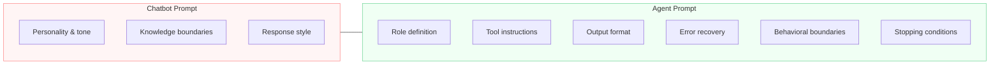

Notice the asymmetry. A chatbot prompt has three concerns. An agent prompt has six or more. And the agent concerns are harder -- they involve reasoning about actions and their consequences, not just generating appropriate text.

## 2.1 The Anatomy of an Agent Prompt

A well-structured agent prompt is not a wall of text. It is organized into distinct sections, each serving a specific purpose. Think of it like a job description: you would not hand someone a rambling paragraph and expect them to know exactly what to do. You would give them a role, responsibilities, procedures, and boundaries.

Here are the six core sections of an agent prompt:

**Role definition** tells the model who it is and what its primary mission is. This anchors every subsequent decision. A model that knows it is a "code review assistant" will make different tool choices than one told it is a "data analysis agent."

**Capability boundaries** specify what the agent can and cannot do. This is where you list what tools are available (the API provides tool definitions, but the prompt gives context about *when* to use them) and what topics or domains are out of scope.

**Tool instructions** explain how to use the available tools effectively. While the API's tool definitions tell the model the function signatures, the prompt provides the strategy: when to prefer one tool over another, how to chain tool calls, and what to do with ambiguous results.

**Output format specification** defines how the agent should structure its responses. Should it think step-by-step before acting? Should it summarize results in a particular format? Should it use markdown, JSON, or plain text?

**Behavioral guidelines** set the rules of engagement. These include safety constraints ("never delete files without confirmation"), quality standards ("always verify results before reporting"), and interaction patterns ("ask for clarification when the request is ambiguous").

**Error handling instructions** tell the agent what to do when things go wrong. This is the section most people forget, and it is the one that matters most in production. Tools fail, APIs time out, and data is malformed. Without explicit recovery instructions, the agent will either hallucinate a result or loop endlessly.

## 2.1 A Side-by-Side Comparison

Let's make the difference concrete. Here is the same task -- helping a user query a database -- with a chatbot prompt and an agent prompt.

**chatbot_prompt.py**

```python
# Chatbot prompt: simple, conversational
CHATBOT_PROMPT = """You are a helpful database assistant.
You know about SQL and can help users write queries.
Be friendly and explain your reasoning."""
```

This works fine for a chatbot. The user asks "How do I join two tables?", the model explains JOINs. But this prompt would fail catastrophically for an agent that actually *executes* queries. It says nothing about which tools to use, how to handle errors, or when to stop.

**agent_prompt.py**

```python
# Agent prompt: structured, operational
AGENT_PROMPT = """You are a database query agent. Your mission is to
help users retrieve information from a PostgreSQL database by writing
and executing SQL queries on their behalf.

## 2.1 Available Tools
- query_database: Executes a read-only SQL query and returns results.
  Use this for SELECT statements only.
- list_tables: Returns the names of all tables in the database.
  Call this FIRST if the user's request does not specify a table.
- describe_table: Returns the schema (columns, types) of a table.
  Call this before writing queries against unfamiliar tables.

## 2.1 Procedure
1. If the user's request is ambiguous, ask for clarification.
2. If you do not know the table schema, call describe_table first.
3. Write a SELECT query. NEVER use INSERT, UPDATE, DELETE, or DROP.
4. Execute the query using query_database.
5. If the query returns an error, analyze the error message, fix the
   query, and retry once. If it fails again, report the error.
6. Present results in a clear, readable format.

## 2.1 Constraints
- NEVER modify data. You have read-only access.
- NEVER expose raw connection strings or credentials in responses.
- Limit result sets to 100 rows. If more exist, inform the user.
- If a query would take longer than 30 seconds, warn the user first.

## 2.1 When You Are Done
Once you have presented the query results and the user's question is
fully answered, summarize what you found and ask if they need anything
else. Do NOT continue executing queries after the answer is complete."""
```

The difference is stark. The agent prompt is longer, but every section earns its place. Remove the procedure section and the agent might query before checking the schema. Remove the constraints and it might run destructive queries. Remove the error handling and a single typo in a query could crash the loop.

## 2.1 Building a Prompt: The Research Agent Example

Let's walk through constructing an agent prompt from scratch for a more realistic scenario: a research agent that searches the web and summarizes findings. This example shows how each section works together.

**research_agent_prompt.py**

```python
RESEARCH_AGENT_PROMPT = """You are a research assistant agent.
Your goal is to help users find accurate, well-sourced answers to
their questions by searching the web and synthesizing information
from multiple sources.

## 2.1 Tools
You have access to the following tools:

- web_search(query: str) -> list[SearchResult]
  Searches the web and returns a list of results with titles, URLs,
  and snippets. Use specific, targeted queries. If your first search
  does not return relevant results, reformulate and try again with
  different keywords.

- fetch_page(url: str) -> str
  Retrieves the full text content of a web page. Use this to read
  promising search results in detail. Only fetch pages that appear
  directly relevant from their search snippet.

## 2.1 Procedure
1. Analyze the user's question. Identify the key claims or facts
   that need to be verified or researched.
2. Formulate 1-3 targeted search queries. Prefer specific terms
   over broad ones.
3. Review the search results. Select the 2-4 most relevant pages.
4. Fetch and read the selected pages.
5. Synthesize your findings. Cross-reference claims across sources.
6. Present your answer with inline citations: [Source Title](URL).

## 2.1 Error Handling
- If web_search returns no results, reformulate with broader terms
  and retry. After 3 failed searches, tell the user you could not
  find relevant information.
- If fetch_page fails (timeout, 404, paywall), skip that source
  and note it was unavailable. Do NOT fabricate content from a
  page you could not read.
- If sources contradict each other, present both perspectives and
  note the disagreement.

## 2.1 Constraints
- Cite every factual claim. Never present information without a
  source URL.
- Do NOT make up URLs or citations. Only cite pages you actually
  fetched and read.
- Distinguish clearly between facts and your own analysis.
- If you cannot find reliable sources, say so honestly rather than
  speculating.

## 2.1 Completion
When you have synthesized information from at least 2 sources and
addressed all parts of the user's question, present your findings
and stop. Do not continue searching after you have a well-sourced
answer."""
```

Notice the patterns:

- The **role** is one sentence that establishes the mission.
- **Tool instructions** go beyond the API schema -- they include usage strategy ("Use specific, targeted queries") and chaining advice ("reformulate and try again").
- The **procedure** is numbered, giving the model a clear decision sequence.
- **Error handling** covers three specific failure modes with concrete recovery actions.
- **Constraints** are stated as absolute rules with "NEVER" and "Do NOT."
- The **completion** section tells the model exactly when to stop.

## 2.1 Common Prompt Engineering Mistakes for Agents

Even experienced engineers make these mistakes when writing agent prompts. Each one seems minor but can cause significant failures in a multi-step execution loop.

**Missing stopping conditions.** Without explicit instructions about when the task is complete, agents tend to keep acting -- running extra searches, making unnecessary API calls, or looping back to re-verify work they have already done. Always include a "when you are done" section.

**Vague tool instructions.** Telling the model "use the available tools" is like telling a new employee "use the office equipment." They need to know *which* tool for *which* situation, and what to do when a tool's output is ambiguous.

**No error recovery path.** In a chatbot, a failed response is mildly annoying. In an agent, a failed tool call without a recovery plan means the agent either hallucinates a result (dangerous) or enters an infinite retry loop (expensive). Always specify what to do when things go wrong.

**Over-constraining the model.** The opposite mistake is also common. If your prompt is so prescriptive that the model cannot exercise judgment, you have built a rigid script, not an agent. The goal is to set boundaries while leaving room for the model to reason about novel situations.

> **Key takeaway:** A good agent prompt balances structure with flexibility. It provides clear procedures for common cases and clear principles for novel ones.

## 2.1 Prompt Structure as a Design Pattern

You can think of the six-section agent prompt as a **design pattern** -- a reusable template that you adapt to each new agent. Here is the pattern:

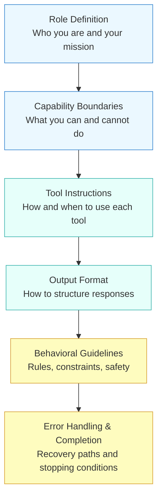

The first two sections (blue) establish **identity** -- who the agent is and what it is scoped to do. The middle two (teal) define **operations** -- how the agent acts in the world. The last two (yellow) set **guardrails** -- what keeps the agent safe and efficient. In the upcoming lesson on System Prompt Design, we will dive much deeper into each of these layers and explore advanced patterns like dynamic prompt assembly and context-dependent instructions.

## 2.1 From Prompting to Reasoning

The prompts we have built so far tell the agent *what to do* and *how to do it*. But they do not explicitly tell it *how to think*. Consider a complex request like "Find the most cost-effective cloud provider for a startup running ML workloads." An agent with a good prompt will know to search the web and compare options. But will it think through the comparison systematically, or just grab the first answer it finds?

This is where **reasoning techniques** come in. In the next lesson, we will explore **Chain-of-Thought reasoning** -- a prompting approach that instructs the model to break complex problems into explicit intermediate steps before deciding on an action. Combined with the structured prompt patterns from this lesson, Chain-of-Thought transforms an agent from a simple tool-caller into a genuine problem-solver.

## 2.1 Summary

Agent prompting is a distinct discipline from chatbot or completion prompting. The key differences stem from the fact that agents operate in **loops**, making chains of decisions where each step builds on the last:

- **Chatbot prompts** shape a single response. **Agent prompts** shape an entire decision process.
- A well-structured agent prompt has six sections: **role definition**, **capability boundaries**, **tool instructions**, **output format**, **behavioral guidelines**, and **error handling with completion criteria**.
- The most common mistakes are missing stopping conditions, vague tool instructions, and no error recovery path.
- Good agent prompts balance structure (clear procedures for common cases) with flexibility (clear principles for novel situations).
- Think of the six-section prompt as a **design pattern** -- a reusable template you adapt for each new agent you build.

The prompt is the most important lever you have over agent behavior. In the lessons ahead, we will build on this foundation with Chain-of-Thought reasoning, structured outputs, and advanced system prompt design to give you a complete toolkit for steering agents through complex tasks.

---

    Section 2.2: Chain-of-Thought Reasoning


## 2.2 Overview

In the previous lesson, we explored how prompt engineering for agents differs from chatbot prompting -- structuring prompts with tool instructions, behavioral boundaries, and clear task decomposition. But even the best-structured prompt can fail when the task requires multi-step reasoning. Ask an LLM to solve a word problem, plan a series of API calls, or debug a logical error, and a direct answer often goes wrong.

**Chain-of-Thought (CoT) reasoning** is the technique that changed this. Introduced by Wei et al. in 2022, CoT prompting encourages the model to produce intermediate reasoning steps before arriving at a final answer. Instead of leaping straight to a conclusion, the model "shows its work" -- and this simple shift dramatically improves accuracy on complex tasks.

For agents, CoT is not just a nice-to-have. It is the mechanism that powers the **Think** step in the observe-think-act loop you studied in Module 1. Every time an agent decides which tool to call next, evaluates a tool's output, or plans a multi-step strategy, it is performing chain-of-thought reasoning. Understanding CoT deeply will make you a better agent builder.

## 2.2 The Problem: Direct Prompting Falls Short

Consider a multi-step problem: *"A store sells notebooks for $4 each. Maria buys 3 notebooks and pays with a $20 bill. She then buys a pen for $2.50. How much money does she have left?"*

With **direct prompting**, you simply ask the question and hope for a correct answer. The model tries to jump to the conclusion in a single step. For simple questions this works fine, but as the number of reasoning steps increases, accuracy drops sharply. The model must hold multiple intermediate values in its "head" simultaneously, and errors compound.

With **CoT prompting**, the model works through each step explicitly:

1. 3 notebooks at $4 each = $12
2. $20 - $12 = $8 remaining after notebooks
3. $8 - $2.50 = $5.50 remaining after the pen

The answer is $5.50. By externalizing each step as text, the model can attend to its own intermediate results, catching errors that would compound in a single-step approach.

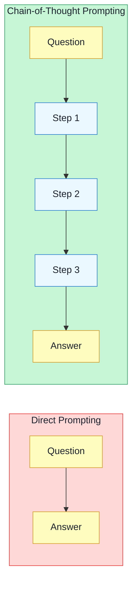

The diagram above captures the core insight: direct prompting maps input to output in a single hop, while CoT prompting introduces a **reasoning chain** of intermediate steps between the question and the answer. Those intermediate steps are what make the difference.

## 2.2 Three Variants of Chain-of-Thought

CoT prompting has evolved into several distinct techniques. Each offers a different trade-off between effort, accuracy, and generality.

### Few-Shot CoT

**Few-shot CoT** is the original technique from the Wei et al. paper. You provide one or more worked examples in the prompt that demonstrate step-by-step reasoning, and the model follows the same pattern for the actual question.

The key idea is that the model learns the *format* of reasoning from your examples -- not just the answer, but the process of arriving at it. You are teaching the model to "show its work" by showing your own work first.

Few-shot CoT is powerful but requires crafting good examples for each type of problem. The quality of your demonstrations directly affects the quality of the model's reasoning.

### Zero-Shot CoT

**Zero-shot CoT**, discovered by Kojima et al. in 2022, is remarkably simple: just append the phrase **"Let's think step by step"** to your prompt. No examples needed.

This works because large language models have already internalized reasoning patterns from their training data. The trigger phrase activates those patterns, causing the model to decompose the problem into steps rather than jumping to an answer. It is less reliable than few-shot CoT on specialized tasks, but it is universally applicable and requires zero prompt engineering effort.

Other effective trigger phrases include:
- *"Let's work through this step by step."*
- *"Let's break this down."*
- *"Think carefully before answering."*
- *"Before answering, reason through each part of the problem."*

### Self-Consistency

**Self-consistency**, introduced by Wang et al. in 2023, takes CoT one step further. Instead of generating a single reasoning chain, you sample multiple independent chains (typically 5-20) using a higher temperature setting, then take the **majority vote** across their final answers.

The intuition is that correct reasoning paths tend to converge on the same answer, while incorrect paths are more likely to diverge. By sampling many paths and voting, you filter out random reasoning errors.

Self-consistency is the most accurate CoT variant but also the most expensive, since it requires multiple LLM calls per question. It is most valuable for high-stakes decisions where accuracy matters more than latency or cost.

## 2.2 CoT in Action: A Reasoning Trace

Let's trace how an LLM uses chain-of-thought reasoning to solve a complex problem step by step. The following sequence diagram shows the internal reasoning process -- the kind of thinking that happens during the **Think** phase of an agent loop:

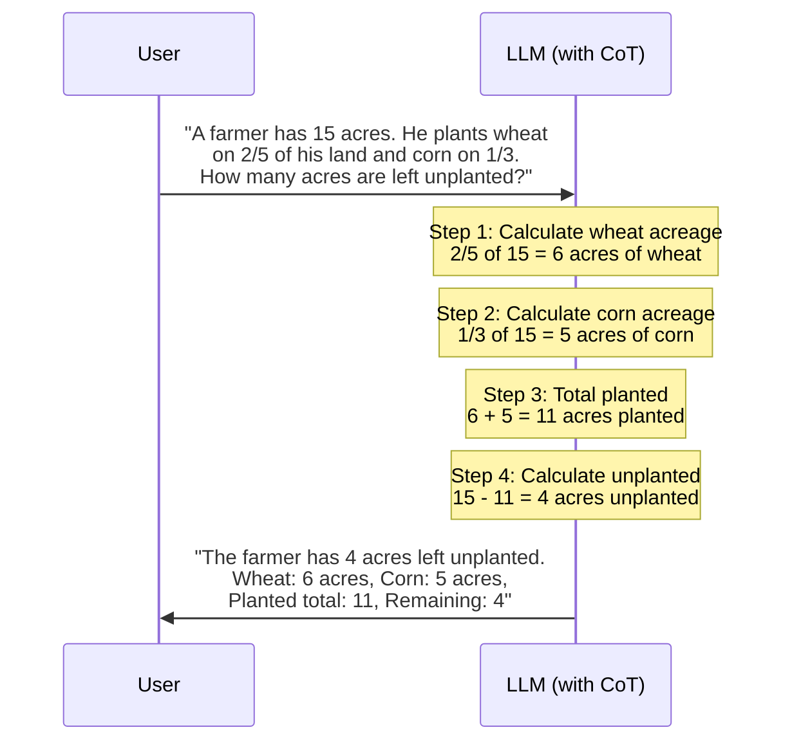

Notice how each step builds on the previous one. The model holds intermediate results (6 acres, 5 acres, 11 acres) as explicit text tokens rather than trying to compute the final answer in a single forward pass. This is the fundamental mechanism that makes CoT work.

## 2.2 Why Does Chain-of-Thought Work?

CoT's effectiveness comes from three properties:

**1. Decomposition reduces complexity.** A multi-step problem that is hard to solve in one shot becomes a series of simple sub-problems. Each individual step is well within the model's capability, even if the combined problem is not.

**2. Intermediate results become attention targets.** When the model writes "2/5 of 15 = 6" as text, those tokens become part of the context that the model can attend to when computing the next step. The model is essentially using its own output as a scratchpad -- externalizing working memory that would otherwise be lost in the hidden states.

**3. Reasoning becomes inspectable.** When an agent produces a wrong answer, CoT lets you trace *where* the reasoning went wrong. Was the initial decomposition flawed? Did a calculation error occur in step 2? This debuggability is critical for building reliable agents -- you cannot fix what you cannot see.

> **Key insight:** CoT does not give the model new capabilities. It gives the model a way to use its existing capabilities more effectively by breaking hard problems into easy ones and keeping intermediate results visible.

## 2.2 Comparing Direct and CoT Prompting in Code

Let's see the practical difference between direct prompting and CoT prompting using the Anthropic API. We will ask Claude to solve a logical reasoning problem both ways and compare the results:

**cot_comparison.py**

```python
import anthropic

client = anthropic.Anthropic()

PROBLEM = """
A company has 4 teams: Alpha, Beta, Gamma, and Delta.
- Alpha has twice as many members as Beta.
- Gamma has 3 more members than Alpha.
- Delta has half as many members as Gamma.
- Beta has 5 members.
How many total members does the company have?
"""

# --- Approach 1: Direct Prompting ---
direct_response = client.messages.create(
    model="claude-sonnet-4-20250514",
    max_tokens=256,
    messages=[{
        "role": "user",
        "content": f"Answer with just the number. {PROBLEM}"
    }]
)
print("Direct prompting answer:")
print(direct_response.content[0].text)
print()

# --- Approach 2: Few-Shot CoT ---
few_shot_cot_response = client.messages.create(
    model="claude-sonnet-4-20250514",
    max_tokens=1024,
    messages=[{
        "role": "user",
        "content": f"""Solve this step by step, showing your work for each team.

Example:
Q: Team X has 4 members. Team Y has double Team X. How many total?
A: Let's work through this:
- Team X = 4 members
- Team Y = 2 * 4 = 8 members
- Total = 4 + 8 = 12 members

Now solve:
{PROBLEM}"""
    }]
)
print("Few-shot CoT answer:")
print(few_shot_cot_response.content[0].text)
print()

# --- Approach 3: Zero-Shot CoT ---
zero_shot_cot_response = client.messages.create(
    model="claude-sonnet-4-20250514",
    max_tokens=1024,
    messages=[{
        "role": "user",
        "content": f"{PROBLEM}\\nLet's think step by step."
    }]
)
print("Zero-shot CoT answer:")
print(zero_shot_cot_response.content[0].text)
```

The correct answer is:
- Beta = 5
- Alpha = 2 * 5 = 10
- Gamma = 10 + 3 = 13
- Delta = 13 / 2 = 6.5

Total = 34.5 members.

With direct prompting, the model often produces an incorrect number because it tries to hold all the relationships in its head at once. With CoT -- whether few-shot or zero-shot -- the model works through each team's count sequentially, dramatically reducing the chance of error.

## 2.2 Self-Consistency in Practice

When accuracy is critical, self-consistency adds another layer of reliability. Here is how you would implement it:

**self_consistency.py**

```python
import anthropic
from collections import Counter

client = anthropic.Anthropic()

def extract_final_number(text: str) -> str:
    """Extract the last number mentioned in the response."""
    import re
    numbers = re.findall(r"[\\d.]+", text)
    return numbers[-1] if numbers else "unknown"

def self_consistency_solve(problem: str, n_samples: int = 5) -> str:
    """Sample multiple CoT reasoning paths and take majority vote."""

    answers = []

    for i in range(n_samples):
        response = client.messages.create(
            model="claude-sonnet-4-20250514",
            max_tokens=1024,
            temperature=0.7,   # Higher temp for diverse paths
            messages=[{
                "role": "user",
                "content": f"{problem}\\nLet's think step by step."
            }]
        )

        reasoning = response.content[0].text
        answer = extract_final_number(reasoning)
        answers.append(answer)
        print(f"  Sample {i+1}: {answer}")

    # Majority vote
    vote_counts = Counter(answers)
    winner, count = vote_counts.most_common(1)[0]

    print(f"\\nMajority answer: {winner} ({count}/{n_samples} votes)")
    return winner

PROBLEM = """
A train travels from City A to City B at 60 mph.
The return trip is at 40 mph.
The cities are 120 miles apart.
What is the average speed for the entire round trip?
"""

# Note: The correct answer is 48 mph (harmonic mean), NOT 50 mph.
# This is a classic trick question where CoT + self-consistency shines.
result = self_consistency_solve(PROBLEM, n_samples=5)
```

Notice the **temperature of 0.7** -- this is intentional. Self-consistency needs diverse reasoning paths. At temperature 0, every sample would produce the same chain, defeating the purpose. The diversity comes from the temperature; the accuracy comes from the voting.

## 2.2 CoT and the Agent Loop

Chain-of-thought reasoning is not just a prompting trick -- it is the cognitive engine that powers intelligent agents. Recall the **observe-think-act** loop from Module 1. The Think step is where CoT does its work:

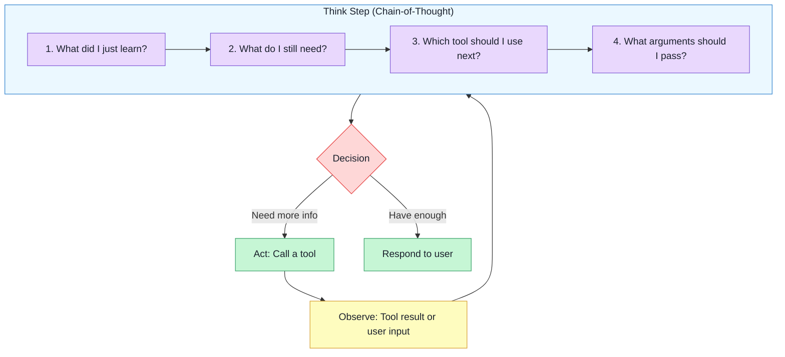

When you write an agent's system prompt and include instructions like "Before acting, reason about what you know and what you still need," you are explicitly requesting CoT behavior. The agent's internal monologue -- assessing observations, planning next steps, selecting tools -- is chain-of-thought reasoning applied to action selection rather than math problems.

This is also why **ReAct** (Reasoning + Acting), one of the most influential agent architectures, works so well. ReAct explicitly separates the Thought from the Action in the model's output, forcing visible chain-of-thought reasoning at every step of the agent loop. You will explore ReAct in detail in Module 4 (Agent Architectures).

## 2.2 When to Use Each Variant

Choosing the right CoT variant depends on your use case:

**Zero-shot CoT** ("Let's think step by step") is your default starting point. It requires no example crafting, works across domains, and provides a meaningful accuracy boost on any multi-step task. Use it when you need a quick improvement without investing in prompt engineering.

**Few-shot CoT** is the right choice when you have a specific, repeated task and can invest time in crafting high-quality examples. The examples serve as a template for the exact reasoning pattern you want. Common in production agent systems where the same type of reasoning happens thousands of times.

**Self-consistency** is reserved for high-stakes decisions where accuracy matters more than cost or latency. Think: medical reasoning, financial calculations, or any agent action that is expensive to reverse. The additional API calls are a small price for significantly higher reliability.

> **Looking ahead:** In lesson 05 (Reasoning Models and Extended Thinking), you will learn about models like OpenAI's o1/o3 and Claude's extended thinking mode. These models have CoT *built into the model itself* -- they generate internal reasoning tokens automatically, without any special prompting. They represent the next evolution of the ideas in this lesson.

## 2.2 Summary

**Chain-of-Thought reasoning** is the technique of prompting an LLM to produce intermediate reasoning steps before arriving at a final answer. It works because decomposition reduces complexity, intermediate results become visible attention targets, and the reasoning chain becomes inspectable for debugging.

The three main variants are **few-shot CoT** (provide worked examples), **zero-shot CoT** (append "Let's think step by step"), and **self-consistency** (sample multiple chains, majority vote). Each offers a different trade-off between prompt engineering effort, cost, and accuracy.

For agent builders, CoT is foundational -- it is the mechanism that powers the Think step in the observe-think-act loop. When an agent reasons about which tool to call, evaluates whether it has enough information, or plans a multi-step strategy, it is performing chain-of-thought reasoning. Mastering CoT means building agents that reason reliably rather than guess.

In the next lesson, we will turn to **Structured Outputs** -- getting the model to produce reliable JSON, function calls, and typed responses that your agent code can parse and act on programmatically.

---

    Section 2.3: Structured Outputs


## 2.3 Overview

In the previous two lessons, we explored how to craft effective prompts for agents and how chain-of-thought reasoning helps models break down complex problems. But there is a critical question we have not yet addressed: **how does the rest of your system understand what the model decided to do?**

When a human reads an LLM response, they can interpret nuance, ignore formatting inconsistencies, and extract meaning from loosely structured text. Software cannot. An agent's orchestration code needs to parse the model's output, extract specific fields, and route execution accordingly. If the model returns `"I think we should search the database for the user's order"` instead of `{"tool": "search_orders", "query": "user order #1234"}`, your code has nothing actionable to work with.

**Structured outputs** are techniques that constrain an LLM to produce machine-parseable responses -- valid JSON, typed function calls, or schema-conforming objects -- instead of free-form natural language. They are the bridge between the model's reasoning (which happens in natural language) and your application's execution logic (which requires precise, predictable data structures).

This lesson traces the evolution of structured output techniques from fragile prompt hacks to robust, schema-enforced generation, and explains why mastering them is essential before we move into tool use and function calling in Module 3.

## 2.3 Why Agents Need Structured Outputs

Consider what happens at each step of the agent loop. The model observes its environment, reasons about what to do, and then must **communicate a decision** back to the orchestrator. That decision might be:

- Which tool to call and with what arguments
- A classification label (e.g., "escalate", "resolve", "ask for clarification")
- A data extraction result (e.g., parsed entities from a document)
- A routing decision (e.g., which sub-agent should handle this request)

Every one of these requires the output to be **predictable in structure**. The orchestrator cannot run `if response == "I'd like to search the database"` -- it needs `response.tool_name == "search_db"`. This is the fundamental tension: LLMs are trained to produce natural language, but agents need them to produce structured data.

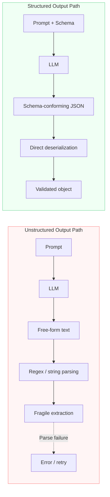

The diagram above captures the core trade-off. The unstructured path is simple to set up but brittle in production -- any deviation in the model's output format causes a parse failure. The structured path requires more upfront schema definition but delivers reliable, type-safe outputs that your orchestration code can depend on.

## 2.3 The Evolution of Structured Output Techniques

Structured output techniques have evolved through four generations, each addressing the failures of the previous approach. Understanding this progression helps you choose the right technique for your use case and appreciate why modern approaches like constrained decoding exist.

### Generation 1: Prompt-Based JSON

The earliest approach was simply asking the model to output JSON in the prompt. This is the most accessible technique -- it requires no special API features -- but it is also the most fragile.

**naive_json_extraction.py**

```python
import anthropic
import json

client = anthropic.Anthropic()

def extract_order_info_naive(user_message: str) -> dict:
    """Attempt to extract order info by prompting for JSON.
    This approach is fragile -- the model may not comply."""

    response = client.messages.create(
        model="claude-sonnet-4-20250514",
        max_tokens=512,
        messages=[
            {
                "role": "user",
                "content": f"""Extract the order information from the following message.
Return ONLY valid JSON with these fields:
- order_id (string)
- customer_name (string)
- issue_type (string: "refund", "exchange", "complaint", or "inquiry")
- priority (string: "low", "medium", or "high")

Message: {user_message}

JSON:"""
            }
        ]
    )

    raw_text = response.content[0].text

    # This is where things break in production
    try:
        result = json.loads(raw_text)
    except json.JSONDecodeError:
        # Common failures:
        # - Model wraps JSON in markdown: \`\`\`json ... \`\`\`
        # - Model adds explanatory text before or after the JSON
        # - Model produces trailing commas or single quotes
        # - Model omits closing braces on long outputs

        # Attempt to extract JSON from markdown code blocks
        import re
        json_match = re.search(r'\`\`\`(?:json)?\s*(.*?)\s*\`\`\`', raw_text, re.DOTALL)
        if json_match:
            result = json.loads(json_match.group(1))
        else:
            raise ValueError(f"Could not parse model output as JSON: {raw_text[:200]}")

    # Even if parsing succeeds, the schema may be wrong
    required_fields = {"order_id", "customer_name", "issue_type", "priority"}
    missing = required_fields - set(result.keys())
    if missing:
        raise ValueError(f"Missing required fields: {missing}")

    return result

# Usage
try:
    info = extract_order_info_naive(
        "Hi, I'm John Smith, order #ORD-7891. I want a refund ASAP."
    )
    print(info)
    # Might work: {"order_id": "ORD-7891", "customer_name": "John Smith",
    #              "issue_type": "refund", "priority": "high"}
    # Might fail: model adds commentary, uses wrong field names, etc.
except (json.JSONDecodeError, ValueError) as e:
    print(f"Parse failed: {e}")
```

This approach has several well-known failure modes:

- **Markdown wrapping** -- the model surrounds JSON in ` ```json ``` ` code blocks
- **Preamble text** -- the model says "Here is the JSON:" before the actual output
- **Schema drift** -- the model invents field names (`orderNumber` instead of `order_id`) or adds unexpected fields
- **Missing required fields** -- the model omits fields it could not confidently extract, rather than using a null value
- **Truncation** -- for complex objects, the JSON gets cut off at the token limit, leaving invalid syntax

Despite these issues, prompt-based JSON is still useful for quick prototyping and situations where you control the model and prompt tightly. But it should not be your production strategy for agent systems.

### Generation 2: JSON Mode

Several LLM providers introduced **JSON mode** -- an API-level flag that constrains the model to produce syntactically valid JSON. This eliminates the markdown wrapping and preamble problems, but it does not enforce a specific schema.

With JSON mode, you are guaranteed that the output parses as valid JSON. However, the *shape* of that JSON is still up to the model. You might get `{"id": "ORD-7891"}` instead of `{"order_id": "ORD-7891"}`, or the model might nest fields differently than expected. JSON mode solves the syntax problem but not the schema problem.

> **Key distinction:** JSON mode guarantees syntactic validity (the output is parseable JSON). Schema enforcement guarantees semantic validity (the output has the right fields, types, and constraints). For agents, you need both.

### Generation 3: Tool Use and Function Calling

The real breakthrough for agent systems came with **tool use** (also called **function calling**). Instead of asking the model to produce arbitrary JSON, you define **tools** with explicit input schemas. The model then generates **structured tool calls** that conform to those schemas.

This is the approach we previewed in Module 1 when we discussed LLM capabilities. Tool use was originally designed to let models invoke external functions, but it has a powerful secondary use: **you can define a "tool" purely as an output schema**, with no intention of calling an external function. The model produces structured data that matches your schema, and you use it however you need.

**structured_tool_use_extraction.py**

```python
import anthropic

client = anthropic.Anthropic()

def extract_order_info_structured(user_message: str) -> dict:
    """Extract order info using tool_use as a structured output mechanism.
    The 'tool' is never called -- we just use it to get schema-conforming output."""

    # Define the output schema as a tool
    tools = [
        {
            "name": "record_order_info",
            "description": (
                "Record the extracted order information. Call this tool with "
                "the customer's order details extracted from their message."
            ),
            "input_schema": {
                "type": "object",
                "properties": {
                    "order_id": {
                        "type": "string",
                        "description": "The order ID (e.g., ORD-7891)"
                    },
                    "customer_name": {
                        "type": "string",
                        "description": "Full name of the customer"
                    },
                    "issue_type": {
                        "type": "string",
                        "enum": ["refund", "exchange", "complaint", "inquiry"],
                        "description": "The category of the customer's issue"
                    },
                    "priority": {
                        "type": "string",
                        "enum": ["low", "medium", "high"],
                        "description": "Urgency level based on the customer's tone and request"
                    },
                    "summary": {
                        "type": "string",
                        "description": "One-sentence summary of the issue"
                    }
                },
                "required": ["order_id", "customer_name", "issue_type", "priority", "summary"]
            }
        }
    ]

    response = client.messages.create(
        model="claude-sonnet-4-20250514",
        max_tokens=1024,
        tools=tools,
        tool_choice={"type": "tool", "name": "record_order_info"},
        messages=[
            {
                "role": "user",
                "content": f"Extract the order information from this message: {user_message}"
            }
        ]
    )

    # The response is guaranteed to contain a tool_use block
    # with inputs matching our schema
    for block in response.content:
        if block.type == "tool_use":
            return block.input

    raise RuntimeError("No tool_use block in response")

# Usage -- no try/except for JSON parsing needed
info = extract_order_info_structured(
    "Hi, I'm John Smith, order #ORD-7891. I want a refund ASAP."
)
print(info)
# {"order_id": "ORD-7891", "customer_name": "John Smith",
#  "issue_type": "refund", "priority": "high",
#  "summary": "Customer requesting refund for order ORD-7891"}
```

Notice the key differences from the naive approach:

- **No JSON parsing code** -- the API returns a Python dictionary directly via `block.input`
- **No regex fallbacks** -- the output is guaranteed to be valid JSON conforming to the schema
- **Enum constraints** -- `issue_type` can only be one of the four specified values; the model cannot hallucinate a fifth category
- **Required fields** -- all five fields are guaranteed to be present
- **`tool_choice`** -- by setting `tool_choice` to force a specific tool, we ensure the model produces structured output rather than a free-form text response

The `tool_choice` parameter is particularly important. Without it, the model might decide to respond with text instead of a tool call. Setting `{"type": "tool", "name": "record_order_info"}` forces the model to use the tool, guaranteeing structured output.

### Generation 4: Constrained Decoding

The most advanced approach is **constrained decoding** -- where the LLM provider modifies the model's token generation process to make it *impossible* to produce output that violates the schema. Rather than hoping the model complies with the schema (prompt-based) or validating after generation (JSON mode), constrained decoding restricts which tokens the model can select at each step.

When you use Anthropic's `tool_use` with an `input_schema`, constrained decoding ensures that:

- String fields produce valid strings
- Enum fields produce only the specified values
- Required fields are never omitted
- Numeric fields produce valid numbers, not strings
- The overall JSON structure is always syntactically valid

This is the mechanism behind what OpenAI calls "structured outputs" and what Anthropic achieves through tool definitions with strict schemas. The key insight is that **the constraint is applied during generation, not after** -- the model never has the opportunity to produce invalid output.

## 2.3 Comparing the Approaches

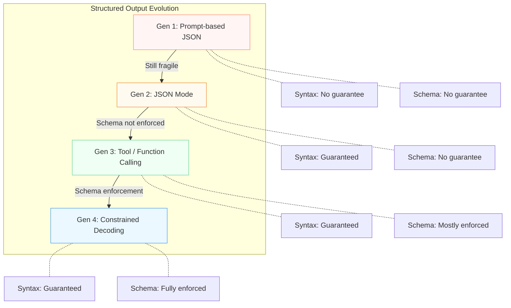

| Approach | Syntax Valid | Schema Enforced | Setup Effort | Best For |
|---|---|---|---|---|
| Prompt-based JSON | No guarantee | No guarantee | Low | Prototyping, simple cases |
| JSON Mode | Guaranteed | No guarantee | Low | When any valid JSON is acceptable |
| Tool / Function Calling | Guaranteed | Mostly enforced | Medium | Agent tool calls, structured extraction |
| Constrained Decoding | Guaranteed | Fully enforced | Medium | Production agent systems |

For agent systems, **tool use with schema constraints** (Generations 3-4) is the recommended approach. The upfront cost of defining schemas pays for itself immediately through eliminated parse failures and predictable outputs.

## 2.3 Common Failure Modes and Mitigations

Even with structured output techniques, there are failure modes you should understand and defend against:

**Hallucinated field values.** The schema guarantees the *structure* is correct, but the *values* are still generated by the model. If the user message does not mention an order ID, the model might hallucinate a plausible-looking one (`"ORD-0000"`) rather than indicating the information is missing. **Mitigation:** Make fields optional when the data might not be present, and use nullable types or sentinel values.

**Over-extraction.** The model may read meaning into ambiguous text and confidently fill in fields that a human would leave blank. For example, inferring `"priority": "high"` from a neutral message. **Mitigation:** Include a `confidence` field in your schema, or add instructions in the tool description to express uncertainty.

**Schema complexity limits.** Very deeply nested schemas or schemas with many conditional fields can confuse the model, leading to increased errors even with constrained decoding. **Mitigation:** Keep schemas flat when possible. If you need complex structures, break them into multiple sequential tool calls.

**Enum leakage.** When using enum constraints, the model is forced to choose one of the allowed values. If the real answer does not fit any enum value, the model picks the closest match rather than signaling a mismatch. **Mitigation:** Include an `"other"` value in enums, and pair it with a free-text field for elaboration.

> **Practical tip:** Design your schemas defensively. Assume the model will fill in every field with something plausible, even when the source data is ambiguous. Use optional fields, confidence scores, and `"other"` enum values to give the model a way to express uncertainty within the structured format.

## 2.3 Designing Effective Output Schemas

Good schema design is as much a prompting skill as writing good system prompts. Here are principles that improve structured output quality:

- **Descriptive field descriptions** -- the model reads the `description` strings in your schema to understand what each field should contain. `"description": "The customer's full name as stated in their message"` works better than `"description": "name"`.

- **Constrain where possible** -- use `enum` for categorical fields, `minimum`/`maximum` for numeric ranges, and `pattern` for string formats. Every constraint you add is a constraint the model cannot violate.

- **Order matters** -- list the most important and easiest-to-extract fields first. The model generates fields sequentially, and earlier fields provide context for later ones.

- **Use the tool description wisely** -- the `description` field on the tool itself is a prompt. Use it to explain *when* and *how* the tool should be called: `"Record the extracted order information. If any field cannot be determined from the message, use null."`.

- **Keep it flat** -- prefer `{"customer_name": "...", "customer_email": "..."}` over `{"customer": {"name": "...", "email": "..."}}` unless nesting genuinely models your domain.

## 2.3 The Bridge to Function Calling

Everything we have covered in this lesson -- schema definition, constrained generation, tool definitions -- is the foundation for **function calling**, which we will explore in depth in Module 3 (Tool Use & Function Calling). The distinction is subtle but important:

- **Structured output** means getting the model to produce data in a predictable format. The "tool" may be a pure output schema with no actual function behind it.
- **Function calling** means the model selects and parameterizes a real external function that your code then executes. The structured output *is* the function call.

In practice, the same API mechanism -- tool definitions with input schemas -- serves both purposes. In Module 3, we will shift focus from "how do I get structured data out of the model?" to "how do I let the model invoke real tools, handle results, and chain multiple calls together?" The schema design skills you learned here will transfer directly.

## 2.3 Summary

**Structured outputs** solve the fundamental interface problem between LLMs (which think in natural language) and agent orchestration code (which requires predictable data structures). We traced the evolution from fragile prompt-based JSON through JSON mode, tool use, and constrained decoding -- each generation eliminating a class of failures from the previous approach.

For production agent systems, use **tool definitions with explicit input schemas** (Anthropic's `tool_use` with `input_schema`). This approach gives you schema-enforced generation with enum constraints, required fields, and typed values -- all without manual JSON parsing or regex extraction. Design your schemas defensively with descriptive field descriptions, constrained types, and optional fields for ambiguous data.

Structured outputs are not just a convenience -- they are a prerequisite for reliable agents. An agent that cannot consistently express its decisions in a parseable format cannot reliably act on the world. With this foundation in place, we are ready to explore **system prompt design** in the next lesson, and then move into the full power of **tool use and function calling** in Module 3.

---

    Section 2.4: System Prompt Design


## 2.4 Overview

In the previous lessons, we covered the foundations of agent prompt engineering, chain-of-thought reasoning, and structured outputs. Each of those techniques is a tool in your prompting toolkit. Now we bring them together into the most important artifact in any agent system: the **system prompt**.

The system prompt is the "constitution" of your agent. It defines who the agent is, what it can and cannot do, how it should behave, and what its outputs should look like. Every time the agent loop runs -- every observe-think-act cycle from Module 1 -- the system prompt sits at the top of the conversation, silently shaping every decision the model makes.

A poorly designed system prompt produces an unreliable agent. A well-designed one produces an agent that is consistent, safe, and effective across thousands of interactions. This lesson teaches you how to craft system prompts that do the latter.

## 2.4 The Anatomy of a System Prompt

A great system prompt is not a wall of text. It is a structured document with clearly delineated sections, each serving a distinct purpose. Think of it as a job description, operations manual, and code of conduct rolled into one.

The following diagram shows the six key sections of a well-structured system prompt and how they relate to each other:

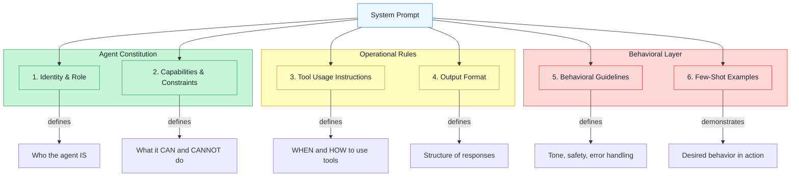

Let's walk through each section in detail.

## 2.4 Section 1: Identity and Role

The opening of a system prompt establishes **who the agent is**. This is not just cosmetic -- it fundamentally shapes how the model interprets every subsequent instruction and user message. When you tell a model "You are a senior security analyst," it activates different knowledge and reasoning patterns than "You are a friendly general assistant."

An effective identity section includes:

- **Role title**: A specific, descriptive title ("You are a research analyst specializing in financial markets," not "You are a helpful AI")
- **Domain expertise**: What the agent is an expert in
- **Audience**: Who the agent serves ("You assist junior developers on the team" vs. "You advise C-level executives")
- **Persona boundaries**: The agent should not claim to be human, should not invent credentials, and should be transparent about being an AI when asked

The more specific the role, the more consistent the agent's behavior. "You are a Python code reviewer who focuses on security vulnerabilities" will produce far more targeted outputs than "You are a code reviewer."

## 2.4 Section 2: Capabilities and Constraints

This section defines the agent's **operational boundaries** -- what it is allowed to do and, critically, what it must not do. Constraints are often more important than capabilities, because an unconstrained agent will attempt anything a user asks, including things it should refuse.

Strong capability and constraint definitions include:

- **Explicit capabilities**: "You can search the web, read documents, and write summaries"
- **Hard constraints**: "You must NEVER execute code that deletes files," "You must NEVER share API keys or credentials"
- **Scope limits**: "You only answer questions about our product. For unrelated topics, politely redirect the user"
- **Knowledge boundaries**: "If you do not know the answer, say so. Do not fabricate information"
- **Escalation rules**: "If the user requests account changes, instruct them to contact support@example.com"

Notice that constraints use strong, unambiguous language: "NEVER," "MUST NOT," "ALWAYS." Hedging with "try to avoid" or "preferably don't" gives the model room to rationalize violations.

## 2.4 Section 3: Tool Usage Instructions

If your agent has access to tools (and most agents do), the system prompt must explain **when and how to use them**. Without explicit tool usage guidance, the model may use tools unnecessarily, use them with incorrect arguments, or fail to use them when it should.

Effective tool usage instructions cover:

- **When to use each tool**: "Use the `search` tool when the user asks about current events or when you need factual information you are not confident about"
- **When NOT to use a tool**: "Do not use the `calculator` tool for simple arithmetic you can compute mentally"
- **Argument formatting**: "Pass dates to the `calendar` tool in ISO 8601 format (YYYY-MM-DD)"
- **Tool chaining patterns**: "After searching, always verify key claims by searching a second source"
- **Error handling**: "If a tool call fails, explain the failure to the user and suggest an alternative approach"

This section works hand-in-hand with the structured output techniques from Lesson 3. The system prompt tells the agent *when* to use a tool; the tool definitions (function schemas) tell it *how* to format the call.

## 2.4 Section 4: Output Format

This section specifies **how the agent should structure its responses**. Without format guidance, the model will default to whatever style it finds most probable, which may not match your application's needs.

Format instructions typically cover:

- **Response structure**: "Begin with a one-sentence summary, then provide details under subheadings"
- **Length expectations**: "Keep responses under 200 words unless the user asks for detail"
- **Formatting conventions**: "Use bullet points for lists, code blocks for code, and bold for key terms"
- **Citation style**: "Always cite sources with [Source Name](URL) format"
- **Thinking visibility**: Whether the agent should show its reasoning ("Think step by step and show your work") or hide it ("Provide only the final answer")

You can also reference the structured output techniques from Lesson 3 here -- for example, specifying that certain responses should be in JSON format or follow a particular schema.

## 2.4 Section 5: Behavioral Guidelines

Behavioral guidelines define the agent's **tone, personality, and safety posture**. This is where you shape the user experience and build guardrails against misuse.

Key areas to address:

- **Tone and style**: "Be professional and concise," "Use a friendly, encouraging tone," "Avoid jargon unless the user demonstrates expertise"
- **Safety boundaries**: "Do not generate harmful, illegal, or deceptive content," "If asked to do something unethical, decline and explain why"
- **Error handling behavior**: "When you make a mistake, acknowledge it directly and correct yourself"
- **Uncertainty handling**: "Express confidence levels when giving advice: 'I'm fairly confident that...' vs. 'I believe, but am not certain, that...'"
- **Conversation management**: "If the user's request is ambiguous, ask a clarifying question before proceeding"

## 2.4 Section 6: Few-Shot Examples

The final section -- and one that many prompt authors skip -- is **few-shot examples** of desired behavior. As we discussed in Lesson 1, examples are often more effective than rules because they demonstrate the expected pattern concretely rather than describing it abstractly.

Good examples show:

- **The ideal response format** for common query types
- **How to handle edge cases** (ambiguous questions, out-of-scope requests, tool failures)
- **The reasoning style** you expect (brief vs. detailed, formal vs. conversational)
- **Correct tool usage** with realistic inputs and outputs

Include 2-3 examples that cover the most common interaction patterns. For complex agents, examples of boundary cases (refusals, escalations, error recovery) are especially valuable.

## 2.4 Putting It All Together: A Complete System Prompt

Let's apply all six sections to build a complete, production-quality system prompt for a research agent. This agent can search the web and read documents to answer user questions.

**research_agent.py**

```python
import anthropic

RESEARCH_AGENT_SYSTEM_PROMPT = """You are a Senior Research Analyst at Meridian Insights, an AI-powered
research service. You specialize in synthesizing information from multiple
sources to produce accurate, well-cited answers to complex questions.

## 2.4 Capabilities and Constraints

You have access to tools that let you search the web and read documents.

YOU MUST:
- Search for information before answering factual questions -- do not rely
  solely on your training data for current events or statistics.
- Cross-reference claims across at least two sources before stating them
  as fact.
- Cite every factual claim with its source.
- Clearly distinguish between established facts, expert opinions, and your
  own analytical inferences.

YOU MUST NOT:
- Fabricate sources, statistics, or quotes.
- Provide medical, legal, or financial advice. If asked, recommend the user
  consult a qualified professional.
- Access or attempt to access private, paywalled, or restricted content.
- Present a single source's opinion as consensus unless verified.

If you cannot find reliable information on a topic, say so explicitly. An
honest "I could not find sufficient evidence" is always better than a
fabricated answer.

## 2.4 Tool Usage

You have access to the following tools:

- **web_search(query)**: Search the web for current information. Use this
  for any factual question about events, people, statistics, or topics
  that may have changed after your training cutoff. Formulate specific,
  targeted search queries -- not vague ones.

- **read_url(url)**: Read the full text of a web page. Use this to get
  details from a specific source found via web_search. Do NOT guess URLs
  -- only read URLs that appeared in search results.

Search strategy:
1. Start with a broad search to understand the landscape.
2. Follow up with specific searches to verify key claims.
3. Read primary sources (official reports, academic papers) when available.
4. If initial searches return low-quality results, reformulate your query
   with different terms.

## 2.4 Output Format

Structure every research response as follows:

1. **Summary** (2-3 sentences): Direct answer to the question.
2. **Key Findings** (bullet points): The most important facts, each with
   a source citation.
3. **Analysis** (1-2 paragraphs): Your synthesis of the findings, noting
   areas of consensus and disagreement among sources.
4. **Confidence Level**: State whether your confidence is High, Medium, or
   Low, with a brief explanation of why.
5. **Sources**: Numbered list of all sources consulted.

For simple factual questions, you may shorten this to Summary + Sources.

## 2.4 Behavioral Guidelines

- Be precise and evidence-driven. Avoid filler phrases and hedging
  language when the evidence is clear.
- When sources disagree, present both perspectives fairly.
- If a question is ambiguous, ask one clarifying question before
  researching. Do not guess the user's intent.
- Acknowledge the limitations of your research: time constraints, source
  availability, and potential bias in search results.
- Maintain a professional, neutral tone. You are an analyst, not an
  advocate.

## 2.4 Examples

User: "What is the current market share of electric vehicles in Europe?"

Good response pattern:
1. Search for "electric vehicle market share Europe 2025"
2. Search for "EV sales Europe latest statistics" to cross-reference
3. Read the most authoritative source (e.g., European Automobile
   Manufacturers' Association)
4. Synthesize findings with the Summary/Findings/Analysis/Sources format
5. Cite specific numbers with sources

Bad response pattern:
- Answering from memory without searching
- Citing a single blog post as definitive
- Saying "approximately 20%" without a source

User: "Should I invest in Tesla stock?"

Good response pattern:
- Decline to give investment advice
- Offer to research Tesla's recent financial performance, analyst
  consensus, or market trends as factual information
- Remind the user to consult a financial advisor for investment decisions
"""

# Using the system prompt with the Anthropic API
client = anthropic.Anthropic()

tools = [
    {
        "name": "web_search",
        "description": "Search the web for current information on a topic.",
        "input_schema": {
            "type": "object",
            "properties": {
                "query": {
                    "type": "string",
                    "description": "The search query to execute"
                }
            },
            "required": ["query"]
        }
    },
    {
        "name": "read_url",
        "description": "Read the full text content of a web page.",
        "input_schema": {
            "type": "object",
            "properties": {
                "url": {
                    "type": "string",
                    "description": "The URL to read"
                }
            },
            "required": ["url"]
        }
    }
]

response = client.messages.create(
    model="claude-sonnet-4-20250514",
    max_tokens=4096,
    system=RESEARCH_AGENT_SYSTEM_PROMPT,
    tools=tools,
    messages=[
        {"role": "user", "content": "What is the current state of fusion energy research?"}
    ]
)

print(response.content)
```

Notice how each section of the system prompt serves a distinct purpose. The identity establishes expertise and credibility. The constraints prevent hallucination and scope creep. The tool usage instructions guide search behavior. The output format ensures consistency. The behavioral guidelines set the tone. And the examples demonstrate both correct and incorrect patterns.

## 2.4 Common Anti-Patterns

Even experienced engineers make mistakes when writing system prompts. Here are the most common anti-patterns and how to avoid them.

**Vague instructions.** "Be helpful and accurate" tells the model almost nothing. Every LLM is already trained to be helpful and accurate. Instead, specify *what* helpful and accurate looks like in your context: "When answering technical questions, include a code example. When citing statistics, include the date of the data."

**Contradictory rules.** "Always be concise" combined with "Always explain your reasoning in detail" creates a tension the model cannot resolve consistently. When you have competing priorities, specify which takes precedence: "Default to concise answers (under 100 words). If the user asks 'why' or 'explain,' provide detailed reasoning."

**Information overload.** A system prompt with 50 rules and 20 examples becomes counterproductive. As the prompt grows longer, the model's ability to attend to every instruction decreases. Prioritize ruthlessly: include the 10-15 rules that matter most, and remove anything the model already does well by default.

**Missing boundaries.** A system prompt that tells the agent what it *can* do but not what it *cannot* do is incomplete. An agent without constraints will attempt anything a user asks, including things that are dangerous, out of scope, or beyond its capabilities.

**Implicit assumptions.** "Format the output correctly" assumes the model knows what "correctly" means in your context. Always be explicit: "Format dates as YYYY-MM-DD. Format currency as $X,XXX.XX with USD."

## 2.4 Prompt Versioning and Iteration

System prompts are not write-once artifacts. They evolve as you discover failure modes, expand the agent's capabilities, and refine its behavior based on real user interactions. Treating your system prompt as **living code** is essential for building reliable agents.

Best practices for prompt versioning:

- **Version control**: Store system prompts in your version control system alongside application code. Every change should be a commit with a clear message explaining *why* the prompt changed.
- **Semantic versioning**: Consider using version numbers (v1.0, v1.1, v2.0) to track major and minor changes. A new constraint is a minor change; a complete restructuring is a major change.
- **Change logs**: Maintain a log of what changed and why. "Added rule to decline medical advice after user complaint on 2025-03-15" is far more useful than a bare diff.
- **A/B testing**: When making significant changes, run the old and new prompts in parallel and compare outputs on a test suite of common queries.
- **Regression testing**: Maintain a set of test cases -- inputs and expected outputs -- that you run against the prompt after every change. This catches regressions where fixing one behavior breaks another.

> In production, system prompts need the same CI/CD discipline as application code: versioning, automated testing, staged rollouts, and rollback capabilities. We will cover this in detail in Module 11 (Production).

## 2.4 System Prompts in Multi-Agent Systems

So far we have discussed system prompts for a single agent. But as your systems grow more complex, you may build architectures with multiple agents, each responsible for a different part of the workflow. In these systems, **each agent gets its own specialized system prompt**.

Consider a customer support system with three agents:

- A **router agent** whose system prompt says: "You classify incoming requests into categories: billing, technical, or general. Output only the category name."
- A **billing agent** whose system prompt says: "You are a billing specialist. You can look up invoices, process refunds, and explain charges."
- A **technical agent** whose system prompt says: "You are a technical support engineer. You can query system logs, check service status, and guide users through troubleshooting steps."

Each agent has a tightly scoped identity, narrow capabilities, and specific tool access. This specialization makes each agent more reliable than a single general-purpose agent trying to handle everything.

> When building multi-agent systems, the system prompt becomes even more important: it is how you enforce the division of responsibilities between agents. We will explore this in depth in Module 9 (Multi-Agent Systems).

## 2.4 Design Heuristics

To tie everything together, here are practical heuristics you can apply whenever you sit down to write a system prompt:

- **Start specific, then generalize.** Begin with a narrow role and expand only as needed. It is easier to add capabilities than to constrain a broadly defined agent.
- **Constraints before capabilities.** Decide what the agent must *never* do before defining what it *can* do. Safety boundaries should be non-negotiable.
- **Show, don't just tell.** One good example is worth five rules. When a behavior is hard to describe in words, demonstrate it with a few-shot example.
- **Test at the boundaries.** The most important test cases are not "does the agent answer normal questions correctly?" but "does the agent refuse out-of-scope requests?" and "does the agent handle ambiguity gracefully?"
- **Iterate on failures.** Every time the agent misbehaves, trace the failure back to a gap in the system prompt and add a specific rule or example to address it.
- **Read it out loud.** If the prompt is confusing to a human, it will be confusing to the model. Clarity for humans correlates strongly with clarity for LLMs.

## 2.4 Summary

The **system prompt** is the most important artifact in an agent system. It is the constitution that governs every decision the agent makes across every iteration of the agent loop. A well-designed system prompt has six sections: **identity and role** (who the agent is), **capabilities and constraints** (what it can and cannot do), **tool usage instructions** (when and how to use tools), **output format** (how to structure responses), **behavioral guidelines** (tone, safety, error handling), and **few-shot examples** (demonstrations of desired behavior).

Avoid common anti-patterns: vague instructions, contradictory rules, information overload, missing boundaries, and implicit assumptions. Treat system prompts as living code -- version them, test them against regression suites, and iterate based on real-world failures. In multi-agent systems, each agent should have its own specialized system prompt that enforces its unique role and boundaries.

In the next lesson, we will explore **reasoning models and extended thinking** -- a new class of models that change how agents approach complex problems by spending more compute on the reasoning step itself.

---

    Section 2.5: Reasoning Models and Extended Thinking


## 2.5 Overview

In lesson 02, we explored **Chain-of-Thought (CoT) prompting** -- a technique where we instruct a standard LLM to "think step by step" before arriving at an answer. CoT works because it forces the model to generate intermediate reasoning tokens, which improves accuracy on complex tasks. But what if reasoning was not a prompting trick we applied from the outside, but a capability built directly into the model itself?

That is the central idea behind **reasoning models**. Models like OpenAI's o1 and o3 series, and Anthropic's Claude with **extended thinking**, are trained to perform deep internal reasoning before producing a response. They do not need to be told to think step by step -- they do it automatically, allocating significant compute to an internal chain-of-thought process that happens before the user ever sees output.

This lesson explores how reasoning models work, how they differ from standard models with CoT prompts, and what this shift means for the way you design and build agents.

## 2.5 From Prompted Reasoning to Native Reasoning

To understand why reasoning models matter, recall how CoT prompting works with a standard model. You write a prompt like "Think step by step before answering," and the model produces its reasoning in the visible output alongside the final answer. The reasoning is there because you asked for it. It appears in the response tokens, the user can read it, and it counts against the output token limit.

**Reasoning models** take a fundamentally different approach. During training, these models are specifically optimized to spend time "thinking" before answering. The model generates an internal chain-of-thought -- often called **thinking tokens** -- that the user may or may not see, depending on the API. Only after this internal deliberation does the model produce the final response.

The distinction is not cosmetic. It changes the economics, the quality, and the architecture of agent systems.

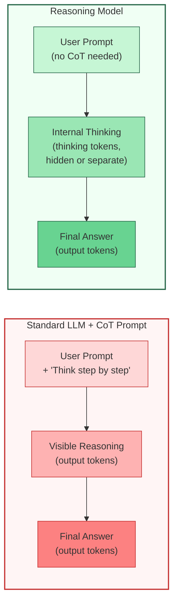

The left side shows the pattern you already know: you prompt the model to reason, and the reasoning appears in the output. The right side shows what reasoning models do: internal thinking happens in a separate phase, and only the final answer is returned as output.

## 2.5 The Reasoning Model Landscape

### OpenAI o1 and o3

OpenAI's **o1** (released late 2024) was one of the first widely available reasoning models. It introduced the concept of a model that spends variable amounts of time "thinking" based on problem complexity. The **o3** family extended this further, with o3-mini offering a cost-effective option and o3 providing maximum reasoning depth.

Key characteristics of o1/o3:

- **Hidden reasoning** -- the model's internal chain-of-thought is not exposed to the user. You see only a summary of the reasoning process, not the raw thinking tokens.
- **Variable compute** -- the model automatically decides how much thinking time a problem requires. A simple factual question gets minimal thinking; a complex math problem gets extensive deliberation.
- **No system prompt support (initially)** -- early versions of o1 did not support system prompts, which required significant agent architecture changes. Later versions relaxed this restriction.
- **Reasoning effort parameter** -- o3 introduced a `reasoning_effort` parameter (`low`, `medium`, `high`) that lets you trade off quality against cost and latency.

### Claude with Extended Thinking

Anthropic's approach with **Claude's extended thinking** differs in a critical way: the thinking process is visible. When you enable extended thinking, the API returns both a `thinking` block and a `text` block. You can inspect exactly what the model reasoned about.

Key characteristics of Claude's extended thinking:

- **Visible thinking blocks** -- the full internal reasoning is returned as a separate content block, giving you transparency into the model's thought process.
- **Budget control** -- you set a `budget_tokens` parameter that caps how many tokens the model can spend on thinking. This gives you direct control over the cost-quality tradeoff.
- **System prompt compatibility** -- extended thinking works with system prompts, so existing agent architectures do not need to be restructured.
- **Streaming support** -- thinking tokens can be streamed in real time, giving the user feedback that the model is working on a complex problem.

### How the Flow Works

The following diagram shows the complete lifecycle of a request to a reasoning model with extended thinking enabled.

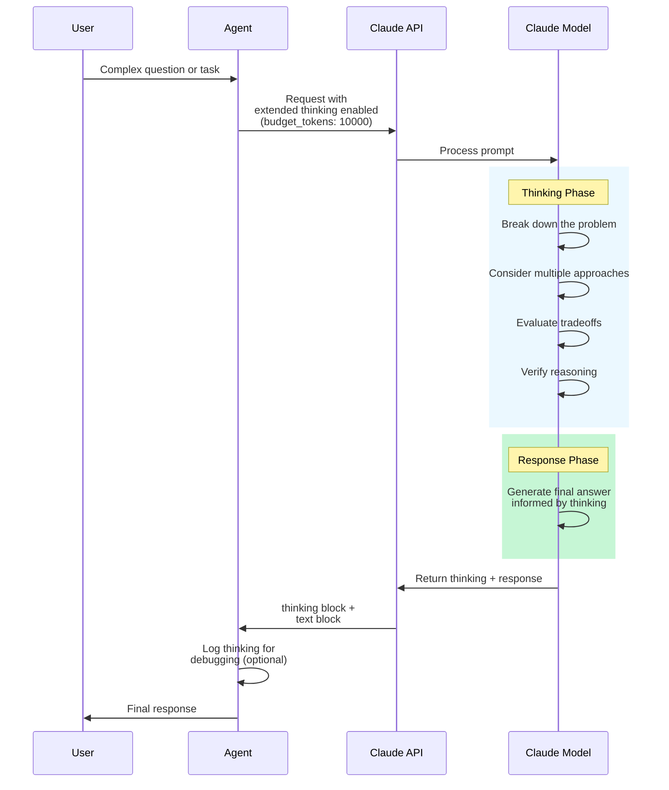

Notice the two distinct phases: the **thinking phase**, where the model reasons internally within the token budget you set, and the **response phase**, where it produces the final answer informed by that reasoning. The agent receives both blocks and can choose to log, display, or discard the thinking content.

## 2.5 Using Extended Thinking in Code

Here is how you enable extended thinking with the Anthropic Python SDK. This example shows a practical agent scenario -- asking the model to analyze a complex system design problem.

**extended_thinking.py**

```python
import anthropic

client = anthropic.Anthropic()

def solve_with_thinking(problem: str, thinking_budget: int = 10000) -> dict:
    """Send a problem to Claude with extended thinking enabled."""
    response = client.messages.create(
        model="claude-sonnet-4-20250514",
        max_tokens=16000,
        temperature=1,  # Required: must be 1 when thinking is enabled
        thinking={
            "type": "enabled",
            "budget_tokens": thinking_budget,  # Max tokens for internal reasoning
        },
        messages=[
            {
                "role": "user",
                "content": problem,
            }
        ],
    )

    # Extract thinking and response from content blocks
    thinking_text = ""
    response_text = ""
    for block in response.content:
        if block.type == "thinking":
            thinking_text = block.thinking
        elif block.type == "text":
            response_text = block.text

    return {
        "thinking": thinking_text,
        "response": response_text,
        "thinking_tokens": response.usage.cache_creation_input_tokens,
        "output_tokens": response.usage.output_tokens,
    }


# Example: Complex agent planning task
result = solve_with_thinking(
    problem="""Design a retry strategy for an agent that calls three 
    external APIs with different reliability characteristics:
    - API A: 99.9% uptime, 50ms latency, idempotent
    - API B: 95% uptime, 2s latency, NOT idempotent  
    - API C: 99% uptime, 200ms latency, idempotent
    
    The agent must call all three and combine results. 
    What is the optimal order, retry policy, and error handling?""",
    thinking_budget=8000,
)

print("=== Model's Thinking Process ===")
print(result["thinking"][:500])  # First 500 chars of reasoning
print("\\n=== Final Response ===")
print(result["response"])
```

A few important details in this code:

- **`temperature=1` is required** when extended thinking is enabled. The model needs full sampling diversity during its thinking phase.
- **`budget_tokens`** sets the ceiling for thinking tokens. The model may use fewer if the problem is straightforward. A budget of 5,000-10,000 tokens works well for most agent tasks; increase to 20,000+ for very complex reasoning.
- The response contains **separate content blocks** for thinking and text. Your agent code should handle both types.

## 2.5 When to Use Reasoning Models vs. Standard Models

Reasoning models are not universally better. They are a tool with specific strengths, and using them effectively requires understanding when they help and when they add unnecessary cost.

### Use reasoning models when:

- **The task requires multi-step logical reasoning** -- math proofs, code debugging, complex planning, and constraint satisfaction problems benefit most from extended thinking.
- **Accuracy is critical and latency is acceptable** -- for tasks where a wrong answer is expensive (financial analysis, medical reasoning, legal review), the extra thinking time is worth it.
- **The problem has a verifiable answer** -- reasoning models excel when the model can check its own work. "Does this code compile?" or "Does this proof follow logically?" are checkable in ways that creative writing is not.
- **You are building a planner agent** -- agents that need to decompose complex goals into multi-step plans benefit enormously from native reasoning, which we will explore in Module 4 when we cover agent architectures.

### Use standard models with CoT prompts when:

- **Latency matters more than depth** -- for real-time chat agents or high-throughput pipelines, standard models with CoT prompts are faster.
- **The reasoning is simple** -- straightforward classification, summarization, or extraction tasks do not benefit from extended thinking. The overhead is wasted.
- **You need fine-grained control over reasoning format** -- CoT prompts let you specify exactly how the model should structure its reasoning (numbered steps, pros/cons lists, specific frameworks). Reasoning models choose their own internal format.
- **Cost is the primary constraint** -- thinking tokens add to your bill. For high-volume, low-complexity tasks, standard models are more economical. This tradeoff becomes critical at production scale, as we will discuss in Module 11.

### The cost and latency tradeoff

This is worth stating explicitly: **reasoning tokens are not free**. A request that would use 500 output tokens with a standard model might use 5,000 thinking tokens plus 500 output tokens with a reasoning model. You are paying for the model to think, and that cost scales with problem complexity.

| Factor | Standard Model + CoT | Reasoning Model |
|---|---|---|
| Latency | Lower (single pass) | Higher (thinking + response) |
| Token cost | Output tokens only | Thinking tokens + output tokens |
| Reasoning quality | Good for simple tasks | Superior for complex tasks |
| Prompt engineering | Required (CoT prompt) | Minimal (built-in reasoning) |
| Transparency | Full (reasoning in output) | Varies (hidden in o1, visible in Claude) |
| Control over reasoning | High (prompt-directed) | Low to moderate (budget-directed) |

## 2.5 Design Implications for Agents

Reasoning models change several assumptions that underpin agent design. If you are building agents, these implications matter.

### You may not need CoT prompting

This is the most immediate change. In lesson 02, we learned to add "Think step by step" and similar instructions to improve reasoning. With reasoning models, **this can actually hurt performance**. The model already reasons internally; adding explicit CoT instructions can create conflicting reasoning processes -- the model tries to follow your format while also doing its own internal reasoning, sometimes producing worse results.

The rule of thumb: **remove CoT instructions from prompts when using reasoning models**. Let the model's built-in reasoning do its work.

### Agent loops may need fewer iterations

A standard model in an agent loop might need multiple tool calls and iterations to solve a complex problem -- it reasons a little, acts, observes, reasons more, acts again. A reasoning model can often solve more of the problem in a single step because it does deeper reasoning upfront. This means your agent loop might converge faster, requiring fewer iterations and fewer tool calls.

### Planning becomes more reliable

One of the hardest problems in agent design is **planning** -- decomposing a complex task into a sequence of actions. Standard models often produce superficial plans that fall apart when executed. Reasoning models produce more robust plans because they can think through edge cases, dependencies, and failure modes before committing to a plan. We will see this pay off in Module 4 when we explore planner-executor architectures.

### Error recovery improves

When a tool call fails or returns unexpected results, reasoning models are better at diagnosing what went wrong and adapting. Instead of blindly retrying (a common failure mode with standard models), a reasoning model can think through why the failure occurred and choose a different approach.

## 2.5 Combining Reasoning Models with Agent Architectures

A powerful pattern that is emerging in production agent systems is **selective reasoning** -- using reasoning models for the hard parts and standard models for the easy parts.

Consider an agent that processes customer support tickets:

1. **Classify the ticket** (standard model -- fast, cheap, simple)
2. **Route to the right team** (standard model -- rule-following task)
3. **Analyze the root cause of a complex technical issue** (reasoning model -- requires deep analysis)
4. **Draft a response** (standard model -- templated communication)

This hybrid approach gives you the quality benefits of reasoning models where they matter, without paying the cost and latency penalty on every step. Designing these mixed architectures is a key skill that we will develop in Module 4 (Architectures) and Module 5 (Design Patterns).

## 2.5 Summary

**Reasoning models** represent a shift from prompted reasoning to native reasoning. Instead of instructing a model to think step by step, models like OpenAI's o1/o3 and Claude with extended thinking are trained to reason internally before responding. Claude's extended thinking makes this process transparent by returning visible thinking blocks alongside the final response, with a `budget_tokens` parameter that gives you direct control over the reasoning depth.

The key design implications for agents are: you can drop explicit CoT prompting (it may hurt more than help), agent loops may converge faster because the model reasons more deeply per step, and planning and error recovery improve. But reasoning models are not always the right choice -- they add cost and latency, and simple tasks do not benefit from extended thinking.

The practical skill is knowing when to use reasoning models versus standard models with CoT prompts, and how to combine both in a single agent system. In the next lesson, *Prompt Patterns Lab*, you will put all of these prompting and reasoning techniques into practice by building a reasoning agent with progressively better prompts.

---

    Section 2.6: Prompt Patterns Lab


## 2.6 Overview

You have spent this module learning the individual techniques that make agent prompts effective: **chain-of-thought reasoning**, **structured outputs**, **system prompt design**, and **extended thinking**. Each technique solves a specific problem. But how do they combine? And how much difference does each one actually make?

In this hands-on lab, you will build a **fact-checker agent** from scratch, then improve it through five progressive versions. Each version adds one technique from this module, and you will see the output quality improve dramatically at every step. By the end, you will have a clear mental model for how to layer these patterns in your own agents.

The claim we will fact-check throughout the lab:

> "The Great Wall of China is visible from space with the naked eye."

This is a widely repeated claim that sounds plausible but is actually false -- making it a perfect test case for evaluating reasoning quality.

## 2.6 The Progression

Each version of our fact-checker adds one prompting technique on top of the previous one. Here is the roadmap:

```mermaid
graph LR
    V1["V1: Naive Prompt"] -->|"+ CoT"| V2["V2: Chain-of-Thought"]
    V2 -->|"+ JSON schema"| V3["V3: Structured Output"]
    V3 -->|"+ role & rules"| V4["V4: Full System Prompt"]
    V4 -->|"+ thinking"| V5["V5: Extended Thinking"]
    style V1 fill:#fed7d7,stroke:#c53030
    style V2 fill:#fefcbf,stroke:#b7791f
    style V3 fill:#fefcbf,stroke:#b7791f
    style V4 fill:#c6f6d5,stroke:#38a169
    style V5 fill:#bee3f8,stroke:#3182ce
```

Every version uses the Anthropic Python SDK. Let's start with the setup code that all versions share.

## 2.6 Setup

**setup.py**

```python
import anthropic
import json

client = anthropic.Anthropic()

# The claim we will fact-check in every version
CLAIM = "The Great Wall of China is visible from space with the naked eye."
```

## 2.6 Version 1: The Naive Prompt

The simplest possible approach. We ask the model a direct question with no guidance on how to reason, what format to use, or what role to play.

**v1_naive.py**

```python
def fact_check_v1(claim: str) -> str:
    """Version 1: Naive prompt -- just ask if it's true."""
    response = client.messages.create(
        model="claude-sonnet-4-6",
        max_tokens=1024,
        messages=[
            {
                "role": "user",
                "content": f"Is this true or false? '{claim}'"
            }
        ]
    )
    return response.content[0].text

result = fact_check_v1(CLAIM)
print(result)
```

A typical response from Version 1:

**v1_output.txt**

```text
This is a common myth. While the Great Wall of China is very long, it's
actually quite narrow (about 15-30 feet wide), making it difficult to
see from space with the naked eye. Astronauts have confirmed that it's
not visible from low Earth orbit without aid. So this statement is
**false**.
```

The model gets the right answer here -- but notice the problems. The response is free-form text with no consistent structure. It hedges with "difficult to see" rather than giving a clear verdict. There are no confidence levels, no explicit reasoning chain, and no cited evidence. If you were building a pipeline that consumes this output, you would have no reliable way to parse the verdict or assess the quality of the reasoning.

## 2.6 Version 2: Add Chain-of-Thought

The first improvement is simple but powerful: we ask the model to **think step by step** before reaching a conclusion. This is the **zero-shot chain-of-thought** technique from lesson 02.

**v2_cot.py**

```python
def fact_check_v2(claim: str) -> str:
    """Version 2: Add chain-of-thought reasoning."""
    response = client.messages.create(
        model="claude-sonnet-4-6",
        max_tokens=2048,
        messages=[
            {
                "role": "user",
                "content": (
                    f"Evaluate whether this claim is true or false: "
                    f"'{claim}'\n\n"
                    f"Think through this step by step:\n"
                    f"1. What exactly is the claim stating?\n"
                    f"2. What evidence supports or contradicts it?\n"
                    f"3. What do authoritative sources say?\n"
                    f"4. What is your final verdict?"
                )
            }
        ]
    )
    return response.content[0].text

result = fact_check_v2(CLAIM)
print(result)
```

What changed? We added a **numbered reasoning scaffold** that forces the model to decompose the problem before concluding. Instead of just "think step by step," we provide specific reasoning steps relevant to fact-checking. This is a domain-specific CoT template.

The output is noticeably better. The model now separates the claim analysis from the evidence from the verdict. But the output is still unstructured text -- you would have to parse natural language to extract the verdict programmatically.

## 2.6 Version 3: Structured Output

Now we force the model to return its analysis as **structured JSON** with explicit fields for each part of the assessment. This combines the CoT reasoning from Version 2 with the structured output techniques from lesson 03.

**v3_structured.py**

```python
def fact_check_v3(claim: str) -> dict:
    """Version 3: Force structured JSON output."""
    response = client.messages.create(
        model="claude-sonnet-4-6",
        max_tokens=2048,
        messages=[
            {
                "role": "user",
                "content": (
                    f"Evaluate whether this claim is true or false: "
                    f"'{claim}'\n\n"
                    f"Think through this step by step, then respond "
                    f"with ONLY a JSON object in this exact format:\n\n"
                    f'{{\n'
                    f'  "claim": "the original claim",\n'
                    f'  "verdict": "TRUE" | "FALSE" | "PARTIALLY TRUE" '
                    f'| "UNVERIFIABLE",\n'
                    f'  "confidence": 0.0 to 1.0,\n'
                    f'  "reasoning_steps": [\n'
                    f'    "Step 1: ...",\n'
                    f'    "Step 2: ...",\n'
                    f'    "Step 3: ..."\n'
                    f'  ],\n'
                    f'  "evidence": [\n'
                    f'    "Supporting or contradicting fact 1",\n'
                    f'    "Supporting or contradicting fact 2"\n'
                    f'  ],\n'
                    f'  "summary": "One-sentence summary of the verdict"\n'
                    f'}}\n\n'
                    f"Respond with ONLY the JSON. No other text."
                )
            }
        ]
    )

    # Parse the JSON response
    text = response.content[0].text.strip()
    # Handle models that wrap JSON in markdown code fences
    fence = chr(96) * 3  # triple backtick
    if text.startswith(fence):
        text = text.split("\\n", 1)[1].rsplit(fence, 1)[0].strip()
    return json.loads(text)

result = fact_check_v3(CLAIM)
print(json.dumps(result, indent=2))
```

What changed? The model now returns machine-readable output. We can programmatically access `result["verdict"]`, check `result["confidence"]`, and iterate over `result["reasoning_steps"]`. This makes the fact-checker composable -- you could feed its output into a dashboard, a database, or another agent.

Notice the defensive parsing at the end. Models sometimes wrap JSON in markdown code fences even when told not to. Always handle this in production code.

## 2.6 Version 4: Full System Prompt

This is where the techniques compound. We add a comprehensive **system prompt** that defines the agent's role, behavioral constraints, reasoning methodology, and output format. This version applies the system prompt design principles from lesson 04.

**v4_system_prompt.py**

```python
FACT_CHECKER_SYSTEM_PROMPT = """You are a rigorous fact-checking analyst.
Your job is to evaluate claims for accuracy using careful, evidence-based
reasoning.

## 2.6 Your Identity
- You are skeptical by default -- popular beliefs are often wrong
- You distinguish between "widely believed" and "actually true"
- You never confuse correlation with causation
- You acknowledge uncertainty honestly rather than guessing

## 2.6 Methodology
For every claim, follow this exact process:
1. PARSE the claim precisely -- what is it actually stating?
2. IDENTIFY the key testable assertions within the claim
3. EVALUATE each assertion against known evidence
4. CONSIDER common misconceptions related to this topic
5. SYNTHESIZE a verdict based on the weight of evidence

## 2.6 Confidence Calibration
- 0.9-1.0: Established scientific consensus with strong evidence
- 0.7-0.8: Well-supported by evidence with minor caveats
- 0.5-0.6: Mixed evidence or depends on interpretation
- 0.3-0.4: Mostly contradicted by evidence
- 0.0-0.2: Definitively disproven

## 2.6 Output Rules
- Always respond with a single JSON object
- Never include text outside the JSON
- The "verdict" must be exactly one of: TRUE, FALSE, PARTIALLY TRUE,
  UNVERIFIABLE
- Each reasoning step must be a complete sentence
- Evidence items must be specific and verifiable facts
- The summary must be one sentence, max 30 words"""


def fact_check_v4(claim: str) -> dict:
    """Version 4: Full system prompt with role, method, and rules."""
    response = client.messages.create(
        model="claude-sonnet-4-6",
        max_tokens=2048,
        system=FACT_CHECKER_SYSTEM_PROMPT,
        messages=[
            {
                "role": "user",
                "content": (
                    f"Fact-check this claim: '{claim}'\n\n"
                    f"Respond with JSON:\n"
                    f'{{\n'
                    f'  "claim": "string",\n'
                    f'  "verdict": "TRUE | FALSE | PARTIALLY TRUE '
                    f'| UNVERIFIABLE",\n'
                    f'  "confidence": 0.0-1.0,\n'
                    f'  "reasoning_steps": ["step1", "step2", ...],\n'
                    f'  "evidence": ["fact1", "fact2", ...],\n'
                    f'  "common_misconception": "string or null",\n'
                    f'  "summary": "string"\n'
                    f'}}'
                )
            }
        ]
    )

    text = response.content[0].text.strip()
    fence = chr(96) * 3  # triple backtick
    if text.startswith(fence):
        text = text.split("\\n", 1)[1].rsplit(fence, 1)[0].strip()
    return json.loads(text)

result = fact_check_v4(CLAIM)
print(json.dumps(result, indent=2))
```

Here is the kind of output Version 4 produces:

**v4_output.json**

```text
{
  "claim": "The Great Wall of China is visible from space with the naked eye.",
  "verdict": "FALSE",
  "confidence": 0.95,
  "reasoning_steps": [
    "The claim states that the Great Wall is visible to the unaided human eye from space.",
    "The Great Wall is approximately 21,196 km long but only 4.5-9 meters wide at most points.",
    "At low Earth orbit altitude (about 400 km), an object must be much wider than 9 meters to be resolved by the human eye.",
    "Multiple astronauts, including Chinese astronaut Yang Liwei, have stated they could not see the Wall from orbit.",
    "NASA has explicitly addressed this myth, confirming the Wall is not visible from low Earth orbit without aid.",
    "The Wall is a similar color to its surrounding terrain, further reducing contrast and visibility."
  ],
  "evidence": [
    "The human eye can resolve objects with an angular size of about 1 arcminute; at 400 km altitude, this corresponds to roughly 116 meters -- far wider than the Wall.",
    "Astronaut Chris Hadfield confirmed the Wall is not visible from the ISS.",
    "A 2004 study published in the journal 'Science' used satellite imagery to confirm the Wall cannot be distinguished from orbit without magnification.",
    "Yang Liwei, China's first astronaut, stated he could not see the Wall during his 2003 spaceflight."
  ],
  "common_misconception": "This myth has been repeated in textbooks and popular media for decades, possibly originating from a 1938 claim by Richard Halliburton, made before space travel was possible.",
  "summary": "The Great Wall is far too narrow to be resolved by the human eye from orbital altitudes, as confirmed by astronauts and NASA."
}
```

Compare this to Version 1. The reasoning is more rigorous, the evidence is specific and verifiable, the confidence is calibrated, and the model even identified the historical origin of the misconception. The system prompt did not just format the output -- it fundamentally changed how the model approached the problem by giving it a skeptical identity and a structured methodology.

## 2.6 Version 5: Extended Thinking

For complex or ambiguous claims, we can go further by enabling **extended thinking**. This gives the model a private reasoning space where it can work through the problem before committing to an answer. This applies the technique from lesson 05.

**v5_extended_thinking.py**

```python
def fact_check_v5(claim: str) -> dict:
    """Version 5: Extended thinking for deep analysis."""
    response = client.messages.create(
        model="claude-sonnet-4-6",
        max_tokens=16000,
        temperature=1,  # Required when using extended thinking
        thinking={
            "type": "enabled",
            "budget_tokens": 10000
        },
        system=FACT_CHECKER_SYSTEM_PROMPT,
        messages=[
            {
                "role": "user",
                "content": (
                    f"Fact-check this claim thoroughly: '{claim}'\n\n"
                    f"This may be nuanced -- consider edge cases, "
                    f"varying definitions, and partial truths.\n\n"
                    f"Respond with JSON:\n"
                    f'{{\n'
                    f'  "claim": "string",\n'
                    f'  "verdict": "TRUE | FALSE | PARTIALLY TRUE '
                    f'| UNVERIFIABLE",\n'
                    f'  "confidence": 0.0-1.0,\n'
                    f'  "reasoning_steps": ["step1", "step2", ...],\n'
                    f'  "evidence": ["fact1", "fact2", ...],\n'
                    f'  "nuances": ["edge case or caveat 1", ...],\n'
                    f'  "common_misconception": "string or null",\n'
                    f'  "summary": "string"\n'
                    f'}}'
                )
            }
        ]
    )

    # With extended thinking, the response contains thinking blocks
    # and text blocks. We need the text block with our JSON.
    for block in response.content:
        if block.type == "thinking":
            print("--- Model's internal reasoning ---")
            print(block.thinking[:500] + "...")
            print("--- End of thinking ---\n")
        elif block.type == "text":
            text = block.text.strip()
            # Strip markdown code fences if the model wraps JSON
            fence = chr(96) * 3  # triple backtick
            if text.startswith(fence):
                text = text.split("\\n", 1)[1].rsplit(fence, 1)[0].strip()
            return json.loads(text)

result = fact_check_v5(CLAIM)
print(json.dumps(result, indent=2))
```

What changed? Three things:

1. **`thinking` parameter** gives the model a private scratchpad with a budget of 10,000 tokens for internal reasoning before it produces the final answer.
2. **`temperature=1`** is required when extended thinking is enabled.
3. **`max_tokens=16000`** is increased to accommodate both the thinking tokens and the response.

Extended thinking shines on genuinely ambiguous claims. Try changing `CLAIM` to something like "Humans only use 10% of their brains" or "Goldfish have a 3-second memory" -- claims where the answer depends on interpretation and nuance. The model's internal reasoning will explore multiple angles before committing to a verdict.

> **When to use extended thinking:** Don't enable it for every call. It adds latency and cost. Use it when the claim is complex, when precision matters more than speed, or when you want the model to consider edge cases it might otherwise skip.

## 2.6 Comparing the Versions

Here is a summary of what each version adds and the trade-off involved:

| Version | Technique Added | What Improves | Trade-off |
|---------|----------------|---------------|-----------|
| V1 | None | Baseline | Unreliable format, shallow reasoning |
| V2 | Chain-of-Thought | Deeper reasoning, fewer errors | Longer output, still unstructured |
| V3 | Structured Output | Machine-readable, parseable | Slightly more prompt tokens |
| V4 | System Prompt | Consistent persona, calibrated confidence | Needs careful prompt design |
| V5 | Extended Thinking | Handles nuance and ambiguity | Higher latency and cost |

The key insight is that these techniques are **additive**. You do not choose one -- you layer them. A production agent typically uses all of them: a system prompt defines the agent's role, CoT reasoning ensures thorough analysis, structured output makes the results usable, and extended thinking handles the hardest cases.

## 2.6 Try It Yourself

Here are three exercises to deepen your understanding. Run each claim through all five versions and compare the outputs:

**Exercise 1 -- Clear-cut false claim:**
Change `CLAIM` to `"Lightning never strikes the same place twice."` Run all five versions. Even V1 should get this right, but observe how the reasoning quality improves with each version.

**Exercise 2 -- Genuinely ambiguous claim:**
Change `CLAIM` to `"Humans only use 10% of their brains."` This is partially true depending on interpretation. Watch how V5 with extended thinking handles the nuance compared to V1-V4.

**Exercise 3 -- Multi-part claim:**
Change `CLAIM` to `"Einstein failed math as a student and was considered a slow learner by his teachers."` This claim contains two assertions -- one false, one partially true. See which versions correctly identify the mixed verdict.

## 2.6 The Missing Piece

Look back at Version 4's output. The evidence items reference astronaut statements, a published study, and NASA's position. But our fact-checker did not actually **verify** any of these. It is generating evidence from its training data, not looking anything up. The model might hallucinate a study that does not exist or misattribute a quote.

This is the fundamental limitation of a reasoning-only agent: **it can think, but it cannot act**. It cannot search the web, query a database, or call an API to verify its claims. It is doing fact-checking without access to facts.

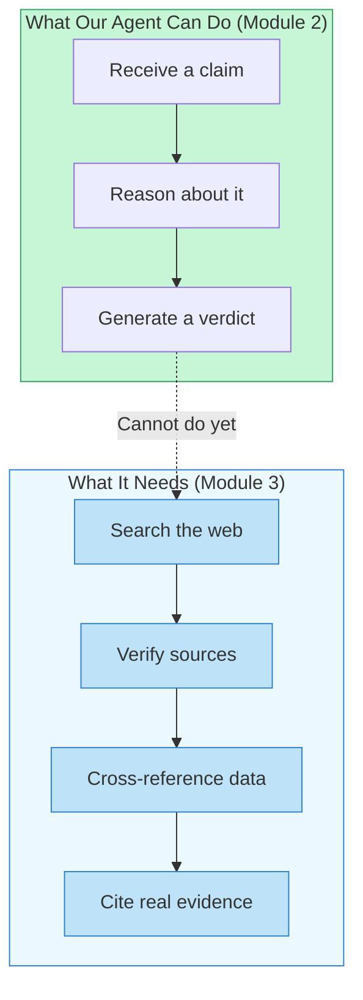

Our fact-checker can only reason -- it cannot search the web or verify sources. In **Module 3: Tool Use and Function Calling**, we will give agents the ability to **act** by calling tools and APIs. You will learn how to connect an agent to web search, databases, and external services so it can ground its reasoning in real, verifiable data. The fact-checker we built here will become the reasoning core of a much more capable agent that can actually look things up.

## 2.6 Summary

In this lab, you built a fact-checking agent and improved it through five iterations, each adding a technique from this module:

- **Version 1 (Naive)** showed that a bare prompt produces shallow, unstructured output even when the model knows the right answer
- **Version 2 (CoT)** demonstrated that step-by-step reasoning scaffolds produce more thorough and accurate analysis
- **Version 3 (Structured Output)** made the output machine-readable and composable with other systems
- **Version 4 (System Prompt)** gave the agent a consistent identity, methodology, and calibrated confidence
- **Version 5 (Extended Thinking)** unlocked deeper reasoning for complex and ambiguous claims

These techniques are not alternatives -- they are layers. A well-built agent combines all of them, choosing the right level of reasoning investment based on the complexity of the task at hand. With Module 2 complete, you have mastered the art of getting LLMs to **think** effectively. Next, you will learn how to make them **do**.

---

