# Tool Use & Function Calling

*Giving agents the ability to act on the world through tools, APIs, and the Model Context Protocol*

    Section 3.1: Why Tools Matter


## 3.1 Overview

In Module 2, we built a fact-checker agent that could reason brilliantly. It could break claims into verifiable components, identify logical fallacies, and weigh evidence with nuance. There was just one problem: it could not actually check any facts. Every "verification" was the model reasoning from its training data -- it had no way to search the web, query a database, or access any information beyond what it already knew. It was a fact-checker that could never look anything up.

**Tools** fix that. They are the bridge between what an LLM knows and what it can do. This lesson explains why tools matter, what categories of tools exist, and -- critically -- how the boundary between the model and the tools actually works. Understanding this boundary is essential before we dive into the mechanics of function calling in the next lesson.

## 3.1 The Knowledge-Action Gap

Large language models are extraordinary knowledge engines. They have absorbed vast amounts of text and can reason, summarize, translate, and generate with remarkable skill. But knowledge alone is not enough to be useful in the real world.

Consider what an LLM **cannot do** without tools:

- It cannot look up today's weather, stock prices, or breaking news
- It cannot run a calculation and guarantee the answer is correct
- It cannot read a file from your computer or query your database
- It cannot send an email, create a calendar event, or post a message
- It cannot call an external API to check inventory, book a flight, or process a payment

Without tools, an LLM is a brilliant mind locked in a room with no phone, no computer, and no way to interact with the outside world. It can think about anything, but it cannot *do* anything.

**Tool use** is what transforms an LLM from a passive knowledge engine into an active agent. Tools give the model hands -- the ability to reach out, gather fresh information, perform precise computations, and make changes in external systems.

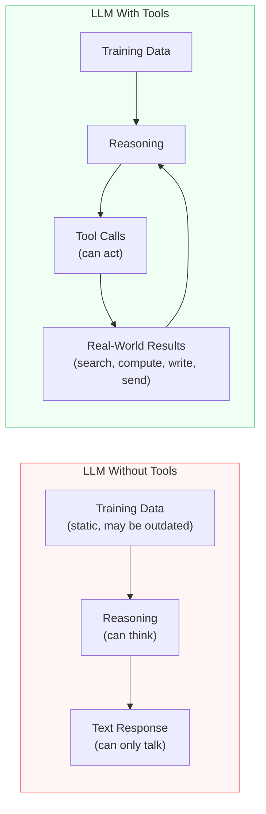

The diagram on the left shows an LLM operating alone: it reads from static training data, reasons about the input, and produces text. That is all it can do. The diagram on the right shows an LLM with tools: it still reasons, but now it can also call tools that interact with the real world -- and feed the results back into its reasoning. That feedback loop is what makes it an agent.

## 3.1 What Tools Unlock

Let's make the gap concrete. Here is what changes when you give an LLM access to tools:

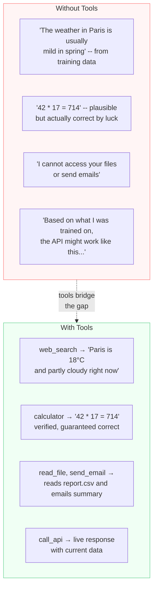

The difference is not just about capability -- it is about **reliability**. An LLM answering a math question from memory might get it right, or it might hallucinate a plausible but wrong answer. An LLM that calls a calculator tool *always* gets the math right. An LLM recalling an API's behavior from training data might describe an outdated version. An LLM that calls the API gets the current, real response.

> **Key insight:** Tools do not just expand what an LLM can do -- they make the things it does more trustworthy. Retrieval replaces recall. Computation replaces guessing. Verified actions replace speculation.

## 3.1 Categories of Tools

Not all tools are the same. They fall into four broad categories, each with different characteristics and risk profiles.

**Information retrieval** tools bring external data into the model's context. These include web search, database queries, file reading, API lookups, and knowledge base searches. They are read-only -- they observe the world but do not change it. This makes them the safest category of tools: if something goes wrong, you have not altered any external state.

**Computation** tools perform precise calculations that LLMs are unreliable at doing on their own. Calculators, code execution sandboxes, unit converters, and statistical functions all fall here. Like retrieval tools, they are typically side-effect-free -- they compute and return a result without changing anything.

**Side-effect tools** are where things get interesting -- and risky. These tools make changes to external systems: sending emails, writing files, creating database records, posting to APIs, or triggering workflows. Once a side-effect tool executes, the action cannot easily be undone. An agent that sends the wrong email or deletes the wrong file has caused real-world harm.

**Integration tools** connect the agent to external services and platforms. These include tools for interacting with GitHub, Slack, Jira, cloud providers, payment processors, and other systems. They often combine retrieval and side effects -- reading from a service and writing back to it.

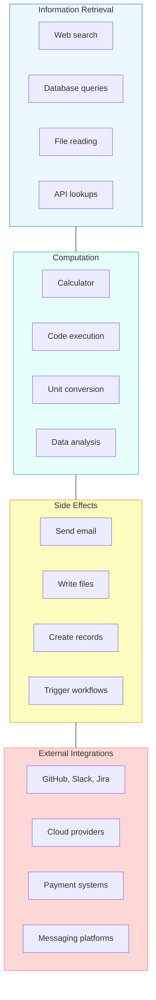

The categories are color-coded by risk: blue and teal tools (retrieval and computation) are safe to run freely. Yellow tools (side effects) require caution -- you may want user confirmation before executing them. Red tools (integrations that combine read and write) require the most careful design, since they interact with systems that other people and processes depend on.

Understanding these categories matters for agent design. When you are deciding which tools to give an agent, you are making a trust decision. A customer support agent might get retrieval tools (look up order status) but not side-effect tools (issue refunds) unless a human approves.

## 3.1 How Tool Use Actually Works

This is the most important concept in this lesson, and the one that is most commonly misunderstood: **the LLM does not execute tools**. It never runs code, calls APIs, or touches your filesystem. Here is what actually happens:

1. Your application sends the model a list of available tools, including their names, descriptions, and parameter schemas
2. The model reads the user's request and decides whether a tool would help
3. If the model wants to use a tool, it generates a **structured tool call** -- a JSON object specifying which tool to call and what arguments to pass
4. The model *stops generating* and returns the tool call to your application
5. **Your code** receives the tool call, validates it, and executes the actual function
6. Your code sends the tool's result back to the model as a new message
7. The model reads the result and either generates a final response or requests another tool call

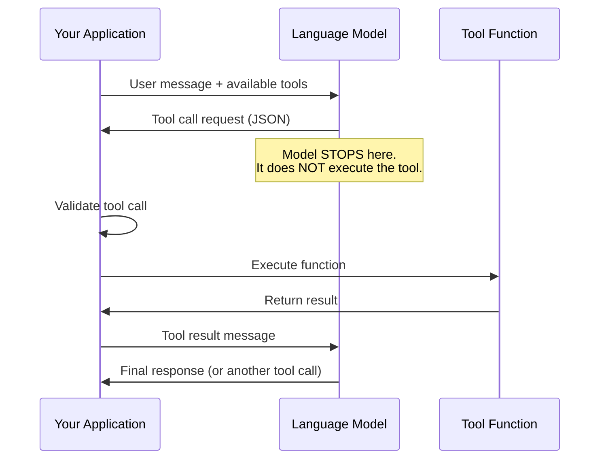

This architecture is deliberate. By keeping tool execution in your application code, you maintain full control:

- **Validation** -- you can check that the arguments are safe before executing
- **Authorization** -- you can enforce permission checks (does this user have access?)
- **Rate limiting** -- you can throttle how often expensive tools are called
- **Logging** -- you can record every tool call for debugging and auditing
- **Human-in-the-loop** -- you can pause and ask for confirmation before dangerous operations

The model's job is to *decide* what tool to call and with what arguments. Your code's job is to *execute* that decision safely. This separation of concerns is what makes tool-using agents both powerful and controllable.

> **Think of it this way:** The LLM is like a skilled operator giving instructions over a radio. It can analyze the situation and say "use wrench B on bolt 7 with 30 newton-meters of torque." But it is your application that holds the wrench and turns the bolt. The operator cannot physically do anything -- it can only communicate what should be done.

## 3.1 Revisiting the Fact-Checker

Now we can see exactly what was missing from our Module 2 fact-checker. The agent had excellent reasoning -- it could decompose claims, identify what needed verification, and synthesize a judgment. But it had zero tools. Every time it needed to verify a fact, it had to fall back on its training data, which might be outdated, incomplete, or simply wrong.

With tools, that same agent becomes dramatically more capable:

- **Claim: "The Eiffel Tower is 330 meters tall"** -- without tools, the model recalls from training. With a `web_search` tool, it finds the current official measurement.
- **Claim: "Python is the most popular programming language in 2026"** -- without tools, the model guesses based on trends it saw during training. With tools, it searches for the latest TIOBE or Stack Overflow survey data.
- **Claim: "This company's revenue grew 40% last year"** -- without tools, the model cannot verify at all. With an `api_lookup` tool connected to a financial data service, it retrieves the actual numbers.

The reasoning engine stays the same. The tools just give it access to ground truth. This is the pattern you will see throughout this module: **tools do not replace reasoning -- they make reasoning useful** by grounding it in real, current, verifiable information.

## 3.1 Summary

Tools are what transform LLMs from knowledge engines into action-taking agents. Without tools, a model can only reason from its training data -- it cannot search, compute, verify, or act. Here are the key ideas from this lesson:

- The **knowledge-action gap** is the fundamental limitation of LLMs without tools: they can think about anything but cannot do anything
- Tools fall into four categories: **information retrieval** (safe, read-only), **computation** (safe, precise), **side effects** (risky, irreversible), and **external integrations** (complex, combining reads and writes)
- The most critical architectural concept: **the LLM does not execute tools**. It generates a structured request, and your application code handles execution, validation, and control
- This separation gives you **validation, authorization, rate limiting, logging, and human-in-the-loop** control over every tool invocation
- Tools do not replace reasoning -- they **make reasoning useful** by grounding it in real-world data and actions

In the next lesson, we will go from the "why" to the "how." **Function Calling Basics** covers the exact mechanics of how LLMs select and invoke functions -- schemas, parameters, structured responses, and the full request-response lifecycle.

---

    Section 3.2: Function Calling Basics


## 3.2 Overview

In the previous lesson, you learned *why* tools matter -- they bridge the gap between what an LLM knows and what it can do. But how does an LLM actually call a function? It cannot execute code. It cannot make HTTP requests. All it can do is generate text.

The answer is a protocol. You describe available tools using structured schemas, the LLM responds with structured output requesting a specific tool call, your code executes that call, and you feed the result back. This **function calling lifecycle** is the mechanical foundation beneath every tool-using agent -- including the calculator you built in Module 1.

This lesson walks through the lifecycle step by step, shows you the anatomy of a tool definition, and demonstrates single, parallel, and sequential tool calls with working Python code.

## 3.2 The Function Calling Lifecycle

Function calling follows a six-step cycle. Your application and the LLM take turns, with your code acting as the execution layer that the LLM cannot provide for itself.

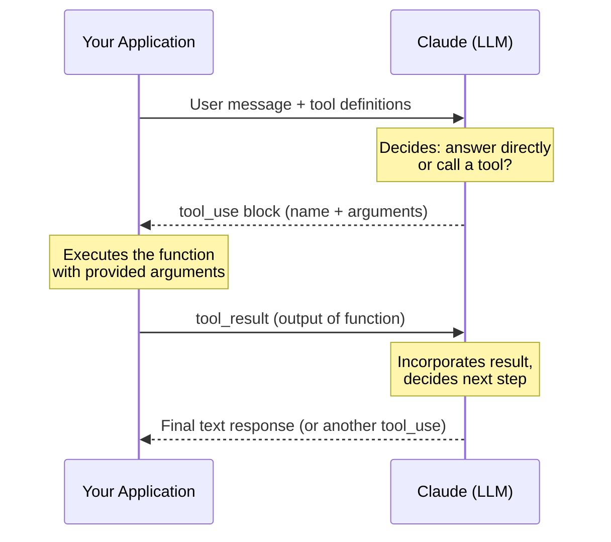

Here is each step in plain language:

1. **Define tools** -- you write JSON Schema descriptions of available functions: their names, what they do, and what parameters they accept.
2. **Send to LLM** -- you include both the user's message and the tool definitions in a single API call.
3. **LLM selects a tool** -- the model reads the descriptions, decides which tool (if any) to use, and generates a structured `tool_use` content block with the tool name and input arguments.
4. **Your code executes** -- you extract the tool name and arguments from the response and run the actual function in your own environment.
5. **Return the result** -- you send the function's output back to the LLM as a `tool_result` message.
6. **LLM continues** -- the model reads the result and either generates a final answer or issues another tool call.

This cycle repeats until the model decides it has enough information to respond directly. The model controls the *logic* (what to call and when), while your code controls the *execution* (actually running the function).

## 3.2 Text Response vs. Tool Call: How the LLM Decides

Not every message triggers a tool call. The LLM evaluates each turn and makes a decision: can I answer this directly from my training data, or do I need to use a tool?

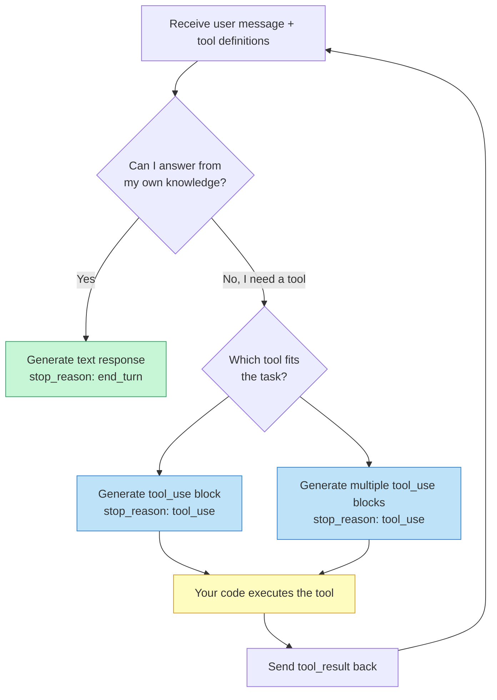

The decision hinges on two factors:

- **The tool descriptions** -- clear descriptions help the model recognize when a tool is relevant. If a user asks "What is the weather in Cairo?" and you provide a `get_weather` tool with a good description, the model will call it. Without that tool, the model will either say it cannot check live weather or answer from stale training data.
- **The system prompt** -- you can bias the model toward or away from tool use. The calculator agent from Module 1 included the instruction "Always use tools for calculations rather than computing in your head," which pushed the model to call the arithmetic tools even for simple sums it could compute internally.

## 3.2 Anatomy of a Tool Definition

Every tool definition has three required fields: **name**, **description**, and **input_schema**. Together, they form a contract between your application and the LLM.

**tool_definition.py**

```python
tool_definition = {
    "name": "get_weather",
    "description": (
        "Get the current weather for a specific location. "
        "Returns temperature, conditions, and humidity. "
        "Use this when a user asks about current weather, "
        "temperature, or atmospheric conditions in a city."
    ),
    "input_schema": {
        "type": "object",
        "properties": {
            "location": {
                "type": "string",
                "description": "City name, e.g. 'London' or 'San Francisco, CA'"
            },
            "units": {
                "type": "string",
                "enum": ["celsius", "fahrenheit"],
                "description": "Temperature unit. Defaults to celsius."
            }
        },
        "required": ["location"]
    }
}
```

Let's break down each field:

- **name** -- a short, descriptive identifier. The LLM uses this in its `tool_use` response to specify which tool it wants. Use `snake_case` and keep names self-explanatory: `get_weather`, `search_database`, `send_email`.
- **description** -- the most important field for tool selection. This is a natural language explanation that tells the model *what the tool does* and *when to use it*. A vague description like "weather tool" will cause misuse. A specific description like the one above gives the model clear guidance.
- **input_schema** -- a **JSON Schema** object that defines the parameters the tool accepts. Each property has a `type`, an optional `description`, and optional constraints like `enum` for allowed values. The `required` array lists which parameters the LLM must always provide.

> The LLM never sees your Python function. It only sees these three fields. The quality of your tool definition directly determines how reliably the model uses your tool. We will dig much deeper into this in the next lesson on tool interface design.

## 3.2 Making an API Call with Tools

Here is a complete example showing how to send tools to the Anthropic API and handle the response. We will use a weather tool and a time tool to answer a question that requires both.

**weather_agent.py**

```python
import anthropic
import json
from datetime import datetime

client = anthropic.Anthropic()

# --- Tool implementations (your actual code) ---

def get_weather(location: str, units: str = "celsius") -> dict:
    """Simulate a weather lookup."""
    # In production, this would call a real weather API
    weather_data = {
        "London": {"temp": 14, "conditions": "Cloudy", "humidity": 72},
        "Cairo": {"temp": 36, "conditions": "Sunny", "humidity": 25},
        "Tokyo": {"temp": 22, "conditions": "Partly cloudy", "humidity": 60},
    }
    data = weather_data.get(location, {"temp": 20, "conditions": "Unknown", "humidity": 50})
    if units == "fahrenheit":
        data["temp"] = round(data["temp"] * 9/5 + 32)
    data["units"] = units
    data["location"] = location
    return data

def get_current_time(timezone: str = "UTC") -> dict:
    """Return the current time."""
    return {"time": datetime.now().strftime("%H:%M"), "timezone": timezone}

# --- Tool definitions for the API ---

tools = [
    {
        "name": "get_weather",
        "description": "Get current weather for a location. Returns temperature, conditions, and humidity.",
        "input_schema": {
            "type": "object",
            "properties": {
                "location": {
                    "type": "string",
                    "description": "City name, e.g. 'London' or 'Tokyo'"
                },
                "units": {
                    "type": "string",
                    "enum": ["celsius", "fahrenheit"],
                    "description": "Temperature unit (default: celsius)"
                }
            },
            "required": ["location"]
        }
    },
    {
        "name": "get_current_time",
        "description": "Get the current time in a given timezone.",
        "input_schema": {
            "type": "object",
            "properties": {
                "timezone": {
                    "type": "string",
                    "description": "Timezone name, e.g. 'UTC', 'US/Eastern', 'Asia/Tokyo'"
                }
            },
            "required": ["timezone"]
        }
    }
]

# --- Dispatch table ---

tool_functions = {
    "get_weather": get_weather,
    "get_current_time": get_current_time,
}
```

With the tools defined, making the API call is straightforward -- pass the `tools` list alongside your messages:

**api_call.py**

```python
# --- Make the initial API call ---

response = client.messages.create(
    model="claude-sonnet-4-6",
    max_tokens=1024,
    tools=tools,
    messages=[
        {"role": "user", "content": "What's the weather like in Cairo right now?"}
    ]
)

# --- Inspect the response ---

print(f"Stop reason: {response.stop_reason}")
# Output: Stop reason: tool_use

for block in response.content:
    if block.type == "tool_use":
        print(f"Tool: {block.name}")
        print(f"Input: {block.input}")
        print(f"ID: {block.id}")
        # Output:
        # Tool: get_weather
        # Input: {'location': 'Cairo'}
        # ID: toolu_01ABC123...
```

The response contains a `tool_use` **content block** with three key fields:

- **name** -- which tool the LLM wants to call
- **input** -- a dictionary of arguments matching the tool's `input_schema`
- **id** -- a unique identifier for this specific tool call (the `tool_use_id`)

## 3.2 Handling Tool Results

After your code executes the function, you send the result back to the LLM as a `tool_result` message. The conversation grows turn by turn: the assistant's response (containing the `tool_use` block) followed by a user message (containing the `tool_result`).

**handle_results.py**

```python
# --- Execute the tool and return the result ---

# Step 1: Add the assistant's response to the conversation
messages = [
    {"role": "user", "content": "What's the weather like in Cairo right now?"},
    {"role": "assistant", "content": response.content},  # includes tool_use block
]

# Step 2: Execute each tool call and collect results
tool_results = []
for block in response.content:
    if block.type == "tool_use":
        # Call the actual function
        result = tool_functions[block.name](**block.input)

        tool_results.append({
            "type": "tool_result",
            "tool_use_id": block.id,   # Must match the tool_use block's id
            "content": json.dumps(result)
        })

# Step 3: Send tool results back to the LLM
messages.append({"role": "user", "content": tool_results})

follow_up = client.messages.create(
    model="claude-sonnet-4-6",
    max_tokens=1024,
    tools=tools,
    messages=messages
)

# The LLM now has the weather data and can respond naturally
for block in follow_up.content:
    if block.type == "text":
        print(block.text)
        # Output: The current weather in Cairo is sunny with a temperature
        #         of 36°C and humidity at 25%.
```

Two details are critical here:

- **The `tool_use_id` must match.** Each `tool_result` references the exact `tool_use` block it responds to. If you send back the wrong ID, the LLM cannot correlate the result with its request.
- **Results are strings.** The `content` field of a `tool_result` is a string (typically JSON). Your function can return any data structure internally, but you must serialize it before sending it back.

## 3.2 Parallel Tool Calls

Sometimes the LLM determines it needs multiple pieces of information that are independent of each other. Rather than issuing one tool call, waiting for the result, and then issuing the next, the model can return **multiple tool_use blocks in a single response**. This is called a **parallel tool call**.

**parallel_calls.py**

```python
# User asks a question that needs two independent lookups
response = client.messages.create(
    model="claude-sonnet-4-6",
    max_tokens=1024,
    tools=tools,
    messages=[
        {"role": "user", "content": "What's the weather in Cairo and what time is it in Tokyo?"}
    ]
)

# The response may contain TWO tool_use blocks
tool_calls = [b for b in response.content if b.type == "tool_use"]
print(f"Number of tool calls: {len(tool_calls)}")
# Output: Number of tool calls: 2

for tc in tool_calls:
    print(f"  {tc.name}({tc.input})")
# Output:
#   get_weather({'location': 'Cairo'})
#   get_current_time({'timezone': 'Asia/Tokyo'})

# Execute ALL tools and return ALL results in a single message
tool_results = []
for block in response.content:
    if block.type == "tool_use":
        result = tool_functions[block.name](**block.input)
        tool_results.append({
            "type": "tool_result",
            "tool_use_id": block.id,
            "content": json.dumps(result)
        })

# Send all results back at once
messages = [
    {"role": "user", "content": "What's the weather in Cairo and what time is it in Tokyo?"},
    {"role": "assistant", "content": response.content},
    {"role": "user", "content": tool_results},
]
```

Your code must handle every `tool_use` block in the response and return a matching `tool_result` for each one. If you skip one, the LLM will not receive the data it needs and will either hallucinate or ask again.

> Parallel tool calls are an optimization, not a separate mechanism. The same loop structure handles them naturally -- you iterate over all `tool_use` blocks regardless of whether there is one or several.

## 3.2 Sequential Tool Calls (Multi-Turn)

**Sequential tool calls** happen when the output of one tool call feeds into the next. The LLM cannot issue both calls at once because the second depends on the first result. Instead, the conversation spans multiple turns.

This is exactly what happened in the Module 1 calculator agent. When asked "What is 25 multiplied by 4, then add 10?", the model:

1. Called `multiply(25, 4)` and got `100`
2. Used that result to call `add(100, 10)` and got `110`
3. Produced the final answer

Each call required a full round trip through the lifecycle: the model issued a `tool_use`, your code executed and returned a `tool_result`, and then the model decided what to do next. This multi-turn pattern is what the **agent loop** handles -- the `while True` loop that keeps cycling until `stop_reason` is `end_turn`.

**generic_agent_loop.py**

```python
def run_agent(user_message: str, tools: list, tool_functions: dict) -> str:
    """A generic agent loop that handles single, parallel, and sequential calls."""
    messages = [{"role": "user", "content": user_message}]

    while True:
        response = client.messages.create(
            model="claude-sonnet-4-6",
            max_tokens=1024,
            tools=tools,
            messages=messages
        )

        # If the model is done, extract and return the text
        if response.stop_reason == "end_turn":
            return "".join(
                block.text for block in response.content if block.type == "text"
            )

        # Otherwise, execute all tool calls in this turn
        messages.append({"role": "assistant", "content": response.content})

        tool_results = []
        for block in response.content:
            if block.type == "tool_use":
                result = tool_functions[block.name](**block.input)
                tool_results.append({
                    "type": "tool_result",
                    "tool_use_id": block.id,
                    "content": json.dumps(result)
                })

        messages.append({"role": "user", "content": tool_results})
```

Notice that this is the same loop structure from the Module 1 calculator -- and it handles all three patterns (single, parallel, sequential) without any special-case logic. The loop iterates until `stop_reason` flips to `end_turn`, processing however many `tool_use` blocks appear in each turn.

## 3.2 Comparing the Three Patterns

| Pattern | Tool calls per turn | Turns | When it happens |
|---------|-------------------|-------|-----------------|
| **Single** | 1 | 1 | A simple request that needs one piece of external data |
| **Parallel** | 2+ | 1 | Independent lookups that do not depend on each other |
| **Sequential** | 1 (or more) | 2+ | Each call depends on the result of a previous call |

The LLM decides which pattern to use based on the user's request and the available tools. Your agent loop does not need to know which pattern is in play -- it handles all of them identically by iterating over content blocks and cycling until the model stops.

## 3.2 What Happens Under the Hood

It is worth understanding that the LLM is not "calling" anything. When Claude returns a `tool_use` block, it is generating structured text that *describes* a function call. The actual execution happens entirely in your code. The model is acting as a **reasoning engine** that decides what to call and with what arguments, while your application acts as the **execution engine** that runs the code and returns results.

This separation is what makes function calling safe and controllable. You can validate arguments before execution, restrict which tools are available, rate-limit calls, log everything, or reject calls that do not meet your criteria. The LLM proposes; your code disposes.

## 3.2 Summary

Function calling is a structured protocol between your application and the LLM, not a magic capability built into the model. The lifecycle is always the same: define tools with JSON Schema, send them with your message, receive `tool_use` blocks, execute the functions, return `tool_result` messages, and repeat until the model produces a final answer.

The three key concepts are:

- **Tool definitions** -- name, description, and input_schema form the contract that tells the LLM what it can do and how to request it
- **The tool_use / tool_result exchange** -- the LLM generates structured call requests and your code returns structured results, linked by `tool_use_id`
- **The agent loop** -- a `while True` loop that naturally handles single, parallel, and sequential tool calls by iterating until `stop_reason` is `end_turn`

The calculator agent you built in Module 1 used exactly this pattern. Every tool-using agent, from a simple calculator to a production system calling dozens of APIs, follows the same lifecycle. The difference is in the complexity of the tools and the robustness of the loop around them.

> Next lesson: tool definitions are the contract between your code and the LLM. How you write them determines whether the model uses your tools correctly or fails in subtle ways. In **Designing Effective Tool Interfaces**, we will cover naming conventions, description strategies, and schema patterns that make tools reliable.

---

    Section 3.3: Designing Effective Tool Interfaces


## 3.3 Overview

In the previous lesson, you learned how function calling works at the protocol level -- how the LLM receives tool definitions, selects a tool, and generates a structured call. But there is a critical question that protocol knowledge alone does not answer: **why does the LLM pick the right tool sometimes and the wrong tool other times?**

The answer almost always comes down to **interface design**. The tool's name, description, and parameter schema are not just documentation for human developers -- they are the *entire* signal the LLM uses to decide what to call and how to call it. A poorly named tool with a vague description and a sprawling parameter list will confuse the model, leading to wrong tool selections, hallucinated parameter values, and cascading failures.

This lesson covers the principles of **tool interface design** -- the art of crafting tool definitions that LLMs can use reliably. These principles apply whether you are building tools for function calling, the Model Context Protocol (Module 3, Lesson 5), or any agent framework.

> Think of tool design like API design, but your consumer is a language model, not a human developer. The model cannot look at examples, read a tutorial, or ask a colleague. It has only the schema.

## 3.3 The LLM's Perspective

Before diving into principles, it helps to understand what the LLM actually sees when it decides whether to call a tool. At inference time, the model receives a list of tool definitions -- typically as JSON Schema objects -- injected into its context. Each definition contains:

1. A **name** (e.g., `search_documents`)
2. A **description** (a natural language string)
3. A **parameters** schema (types, constraints, required fields)

The model must use *only* these three signals to make two decisions: **which tool** to call (or whether to call one at all), and **what arguments** to pass. There is no Stack Overflow, no README, no example call. The schema is the entire interface.

This means every ambiguity in your tool definition becomes a decision the LLM must guess at. And guessing means errors.

## 3.3 Good Design vs. Bad Design

Let us start with a concrete comparison. Suppose you want to give an agent the ability to look up information in a company knowledge base.

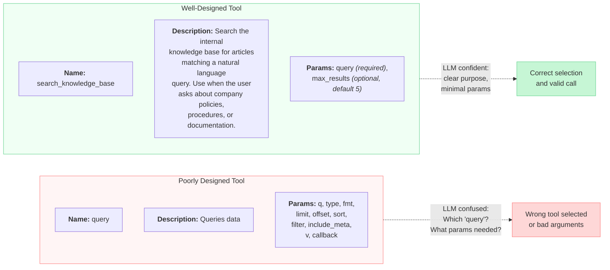

The poorly designed tool fails on every dimension: the name is generic, the description says nothing about *when* to use it, and the parameter list is overwhelming. The well-designed tool is self-documenting: the name tells you what it searches, the description tells the LLM when to reach for it, and the parameters are minimal.

## 3.3 Principle 1: Clear, Verb-First Naming

The tool name is the first signal the LLM processes. It should immediately communicate the **action** and the **target**.

**Pattern:** `verb_noun` or `verb_noun_qualifier`

Good names:
- `search_web` -- action is clear, scope is clear
- `get_weather` -- retrieves weather data
- `create_calendar_event` -- creates an event in a calendar
- `delete_file` -- removes a file
- `send_email` -- sends an email

Bad names:
- `doStuff` -- what stuff?
- `handle` -- handle what?
- `query` -- query what data source?
- `process_v2` -- what does it process? What happened to v1?
- `utils` -- a tool called "utils" is a tool the LLM will never use correctly

**Verb-first naming** matters because LLMs are language models -- they parse tool names as natural language tokens. A name like `search_documents` activates the same semantic understanding as the phrase "search documents." A name like `ds_qry_v3` does not.

## 3.3 Principle 2: Descriptions That Explain When, Not Just What

The description is your most powerful lever. Most developers write descriptions that explain **what** the tool does ("Queries the database"). Effective descriptions explain **when** the LLM should use it.

Compare these two descriptions for the same tool:

> **Weak:** "Gets user information."
>
> **Strong:** "Retrieve profile details for a specific user by their user ID. Use this tool when the user asks about account information, profile settings, or membership status. Do NOT use this for authentication or login -- use verify_credentials instead."

The strong description does three things the weak one does not:

1. **Specifies the input** -- "by their user ID" tells the LLM what argument is expected
2. **Gives usage context** -- "when the user asks about account information" helps the LLM match user intent to tool selection
3. **Disambiguates** -- "Do NOT use this for authentication" prevents confusion with similar tools

When you have multiple tools with overlapping domains, disambiguation in descriptions becomes essential. Without it, the LLM will pick whichever tool name happens to have the closest semantic match to the user's request, which may not be the right one.

## 3.3 Principle 3: Minimal Parameters

Every parameter you add is a decision the LLM must make. More decisions means more chances for errors. The principle is simple: **require only what is necessary, and default everything else.**

**bad_tool_definition.py**

```python
# BAD: Too many parameters, most optional, unclear purposes
tools = [{
    "name": "search_documents",
    "description": "Search documents.",
    "parameters": {
        "type": "object",
        "properties": {
            "q": {"type": "string", "description": "Query"},
            "type": {"type": "string", "description": "Type"},
            "format": {"type": "string", "description": "Format"},
            "limit": {"type": "integer", "description": "Limit"},
            "offset": {"type": "integer", "description": "Offset"},
            "sort_by": {"type": "string", "description": "Sort field"},
            "sort_order": {"type": "string", "description": "Sort order"},
            "filter_date_start": {"type": "string", "description": "Start date"},
            "filter_date_end": {"type": "string", "description": "End date"},
            "filter_author": {"type": "string", "description": "Author"},
            "include_metadata": {"type": "boolean", "description": "Include metadata"},
            "include_snippets": {"type": "boolean", "description": "Include snippets"},
        },
        "required": ["q"]
    }
}]
```

**good_tool_definition.py**

```python
# GOOD: Minimal parameters, clear descriptions, sensible defaults
tools = [{
    "name": "search_documents",
    "description": (
        "Search the company document repository using a natural language query. "
        "Returns the top matching documents with titles and summaries. "
        "Use when the user asks about internal documentation, policies, or procedures."
    ),
    "parameters": {
        "type": "object",
        "properties": {
            "query": {
                "type": "string",
                "description": "Natural language search query describing what to find"
            },
            "max_results": {
                "type": "integer",
                "description": "Maximum number of results to return (default: 5, max: 20)",
                "default": 5
            }
        },
        "required": ["query"]
    }
}]
```

The bad definition has 12 parameters with single-word descriptions. The LLM must guess what "Type" means, what valid values for "Format" are, and whether "Limit" refers to results or characters. The good definition has two parameters, both with clear descriptions and a sensible default for the optional one.

**Rule of thumb:** if a parameter can be handled server-side with a reasonable default, do not expose it to the LLM. You can always add parameters later if the agent genuinely needs them.

## 3.3 Principle 4: Constrained Types

When a parameter has a finite set of valid values, use an **enum** instead of a free-text string. This eliminates an entire class of errors where the LLM invents plausible-but-invalid values.

**enum_vs_freetext.py**

```python
# BAD: Free-text string -- the LLM might generate "urgent", "CRITICAL",
# "p0", "very high", or any other plausible-sounding value
{
    "name": "priority",
    "type": "string",
    "description": "The priority level"
}

# GOOD: Enum constrains to valid values -- the LLM picks from the list
{
    "name": "priority",
    "type": "string",
    "enum": ["low", "medium", "high", "critical"],
    "description": "Priority level for the ticket"
}
```

The same principle applies to other types:

- Use `integer` with `minimum` / `maximum` instead of unbounded numbers
- Use `boolean` for yes/no flags instead of strings like "true" or "yes"
- Use specific `format` hints like `"format": "date"` or `"format": "email"` when applicable
- Mark parameters as `required` only when the tool truly cannot function without them

Every constraint you add is one fewer hallucination the LLM can produce. Think of it as **guardrails at the schema level** -- far cheaper than catching errors after execution.

## 3.3 Principle 5: One Tool Per Action

A common mistake is building **mega-tools** -- a single tool that does many different things based on a mode or action parameter. This forces the LLM to understand a complex internal routing system.

**granularity.py**

```python
# BAD: Mega-tool with an "action" parameter
{
    "name": "manage_users",
    "description": "Manage users in the system",
    "parameters": {
        "type": "object",
        "properties": {
            "action": {
                "type": "string",
                "enum": ["create", "read", "update", "delete", "list", "search"],
                "description": "The action to perform"
            },
            "user_id": {"type": "string", "description": "User ID (for read/update/delete)"},
            "name": {"type": "string", "description": "User name (for create/update)"},
            "email": {"type": "string", "description": "Email (for create/update)"},
            "query": {"type": "string", "description": "Search query (for search)"},
            "filters": {"type": "object", "description": "Filters (for list)"}
        },
        "required": ["action"]
    }
}

# GOOD: Separate tools with focused interfaces
tools = [
    {
        "name": "create_user",
        "description": "Create a new user account. Use when the user asks to add or register someone.",
        "parameters": {
            "type": "object",
            "properties": {
                "name": {"type": "string", "description": "Full name of the new user"},
                "email": {"type": "string", "format": "email", "description": "Email address"}
            },
            "required": ["name", "email"]
        }
    },
    {
        "name": "get_user",
        "description": "Retrieve details for a specific user by ID. Use when the user asks about a particular person's account.",
        "parameters": {
            "type": "object",
            "properties": {
                "user_id": {"type": "string", "description": "The unique user identifier"}
            },
            "required": ["user_id"]
        }
    },
    {
        "name": "search_users",
        "description": "Search for users by name or email. Use when the user wants to find someone but does not have their ID.",
        "parameters": {
            "type": "object",
            "properties": {
                "query": {"type": "string", "description": "Name or email to search for"}
            },
            "required": ["query"]
        }
    }
]
```

With the mega-tool, the LLM must understand that `user_id` is only relevant for certain actions, that `name` and `email` are only for create/update, and so on. With separate tools, each tool's parameters are always relevant, and the LLM's job reduces to a simple question: "Does this tool match the user's intent?"

**The tradeoff:** more tools means more entries in the context window. If you have hundreds of tools, you may need to use tool filtering or dynamic tool selection to keep the list manageable. But for most agents with 5-30 tools, granularity wins.

## 3.3 Principle 6: Consistent Return Formats

While tool definitions focus on inputs, the **output format** matters just as much for the LLM's ability to reason about results. If one tool returns a list of objects and another returns a raw string, and a third returns nested XML, the LLM must adapt its parsing strategy for each one.

Adopt a consistent return format across all your tools:

**consistent_returns.py**

```python
# Consistent return format for all tools
def make_tool_response(success: bool, data=None, error=None):
    """Wrap every tool result in a consistent envelope."""
    response = {"success": success}
    if data is not None:
        response["data"] = data
    if error is not None:
        response["error"] = error
    return response

# Usage in tool implementations
def search_documents(query: str, max_results: int = 5):
    try:
        results = db.search(query, limit=max_results)
        return make_tool_response(
            success=True,
            data={
                "results": [
                    {"title": r.title, "summary": r.summary, "id": r.id}
                    for r in results
                ],
                "total_found": len(results)
            }
        )
    except Exception as e:
        return make_tool_response(
            success=False,
            error=f"Search failed: {str(e)}"
        )
```

When every tool returns `{"success": true/false, "data": ..., "error": ...}`, the LLM learns the pattern quickly and can reliably check for errors, extract data, and chain tool calls together. This consistency becomes especially important in the error handling patterns you will study in the next lesson.

## 3.3 Common Mistakes

Even with these principles in mind, several mistakes appear repeatedly in practice:

**Ambiguous names with overlapping scope.** If you have `search_docs` and `find_documents` and `query_knowledge`, the LLM has no reliable way to pick between them. Each tool name should be unique in both verb and noun.

**Descriptions that assume context.** "Use this for the main flow" or "Handles the standard case" tells the LLM nothing. Descriptions must be self-contained -- the LLM has no knowledge of your system's internal terminology unless you define it.

**Missing required fields.** If a tool cannot function without a parameter, mark it as `required`. Otherwise the LLM may omit it, and you will get a cryptic runtime error instead of a schema validation failure.

**Exposing internal identifiers.** If a tool requires an internal database ID that the user would never know, the LLM will hallucinate one. Instead, provide a lookup tool (like `search_users`) that returns IDs, and have the LLM chain calls: search first, then act on the result.

**Ignoring the tool count.** Research shows that LLM accuracy on tool selection degrades as the number of available tools increases. If your agent has 50 tools, consider organizing them into categories and loading only the relevant subset per turn. The **tool registry pattern** you will encounter in Module 5 (Design Patterns) builds directly on this idea.

## 3.3 Putting It All Together

Here is a complete, well-designed tool set for a simple customer support agent. Notice how each tool follows all six principles:

**complete_toolset.py**

```python
customer_support_tools = [
    {
        "name": "lookup_customer",
        "description": (
            "Look up a customer by email address or phone number. Returns the "
            "customer's name, account ID, and plan type. Use this as the first "
            "step when a user asks about their account, billing, or subscription."
        ),
        "parameters": {
            "type": "object",
            "properties": {
                "email": {
                    "type": "string",
                    "format": "email",
                    "description": "Customer's email address"
                },
                "phone": {
                    "type": "string",
                    "description": "Customer's phone number (e.g., +1-555-123-4567)"
                }
            },
            "required": []  # At least one should be provided
        }
    },
    {
        "name": "get_recent_orders",
        "description": (
            "Retrieve the most recent orders for a customer. Requires the "
            "customer's account ID (use lookup_customer first to get this). "
            "Use when the user asks about order status, shipping, or purchases."
        ),
        "parameters": {
            "type": "object",
            "properties": {
                "account_id": {
                    "type": "string",
                    "description": "Customer account ID from lookup_customer"
                },
                "limit": {
                    "type": "integer",
                    "description": "Number of recent orders to return (default: 3)",
                    "default": 3,
                    "minimum": 1,
                    "maximum": 10
                }
            },
            "required": ["account_id"]
        }
    },
    {
        "name": "create_support_ticket",
        "description": (
            "Create a support ticket for an issue that cannot be resolved in "
            "this conversation. Use when the problem requires escalation to a "
            "human agent, a refund over $50, or a technical investigation."
        ),
        "parameters": {
            "type": "object",
            "properties": {
                "account_id": {
                    "type": "string",
                    "description": "Customer account ID"
                },
                "subject": {
                    "type": "string",
                    "description": "Brief summary of the issue (under 100 characters)"
                },
                "priority": {
                    "type": "string",
                    "enum": ["low", "medium", "high"],
                    "description": "Ticket priority based on urgency and impact"
                }
            },
            "required": ["account_id", "subject", "priority"]
        }
    }
]
```

Notice the design choices:

- **Names** are verb-first and unambiguous: `lookup_customer`, `get_recent_orders`, `create_support_ticket`
- **Descriptions** specify when to use each tool and how they chain together ("use `lookup_customer` first")
- **Parameters** are minimal -- only what is truly needed, with defaults for optional values
- **Types** are constrained -- `format: "email"`, `minimum/maximum` on integers, `enum` on priority
- **Dependencies** are documented -- `get_recent_orders` explains it needs an `account_id` from `lookup_customer`

## 3.3 Summary

Tool interface design is the single highest-leverage activity when building reliable agents. The LLM has no documentation, no examples, and no ability to ask clarifying questions -- it has only the tool schema. Every principle in this lesson reduces ambiguity in that schema:

1. **Verb-first names** make purpose immediately clear
2. **When-not-just-what descriptions** guide tool selection
3. **Minimal parameters** reduce decision points and errors
4. **Constrained types** eliminate invalid values at the schema level
5. **One tool per action** keeps interfaces focused and predictable
6. **Consistent return formats** let the LLM reason reliably about results

These principles are not theoretical -- they directly affect whether your agent succeeds or fails. In the next lesson, **Error Handling and Retries**, you will learn what happens when tools fail despite good design, and how agents can recover gracefully. And in Module 5, the **tool registry pattern** will show you how to manage large tool sets by dynamically selecting which tools to expose based on context.

---

    Section 3.4: Error Handling and Retries


## 3.4 Overview

In the previous lessons, you learned how LLMs call functions, how to design clean tool interfaces, and how schemas guide the model toward correct parameter usage. But there is a truth that every production agent builder discovers quickly: **tools will fail**. APIs time out. Rate limits kick in. The LLM generates invalid parameters. Network connections drop. Permissions expire.

The difference between a toy demo and a production agent is not whether failures happen -- it is how the agent handles them. A brittle agent crashes on the first error. A robust agent treats errors as information, reasons about what went wrong, and adapts its strategy.

This lesson covers the patterns that make agents resilient: returning errors to the LLM instead of crashing, retrying with backoff, falling back to alternative tools, and structuring error responses so the model can make intelligent recovery decisions.

## 3.4 Why Tools Fail

Before diving into solutions, it helps to understand the taxonomy of tool failures. Not all errors are created equal, and different error types demand different recovery strategies.

**Tool execution errors** occur when the tool itself breaks -- an API returns a 500 status, a database query fails, or a file is not found. These are the most common failures in production, and they are often transient.

**Invalid parameters from the LLM** happen when the model generates arguments that do not match what the tool expects -- a malformed date string, an ID that does not exist, or a missing required field. Schema validation catches some of these, but not all.

**Timeouts** occur when a tool takes too long to respond. A web search that hangs, an API call to a slow service, or a database query scanning millions of rows can all exceed reasonable time limits.

**Rate limiting** happens when you hit the usage cap on an external API. The service returns a 429 status code, telling you to slow down. This is particularly common with search APIs, LLM APIs themselves, and third-party data services.

**Permission denied** errors occur when credentials expire, API keys are rotated, or the agent tries to access a resource it does not have authorization for.

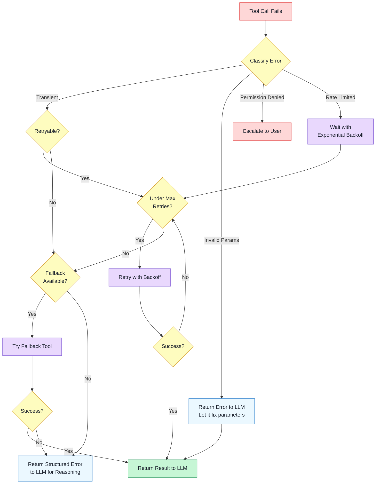

This decision tree captures the core principle: **classify the error first, then choose the appropriate recovery strategy**. Transient errors get retried. Parameter errors go back to the LLM for correction. Permission failures escalate to the user. And if all recovery paths are exhausted, a structured error report goes to the LLM so it can reason about alternatives.

## 3.4 Pattern 1: Return Errors to the LLM

The most important pattern -- and the one that distinguishes agent error handling from traditional software error handling -- is this: **do not crash on tool failures. Return the error to the LLM as a tool result and let it reason about what to do next.**

In traditional software, an unhandled exception means the program stops. In an agent system, the LLM is the orchestrator. When a tool fails, the LLM needs to know *what* failed and *why*, so it can decide whether to retry, try a different approach, or inform the user.

This is a fundamental shift in thinking. The error is not a bug to be hidden -- it is **information** that the agent uses to adapt its strategy.

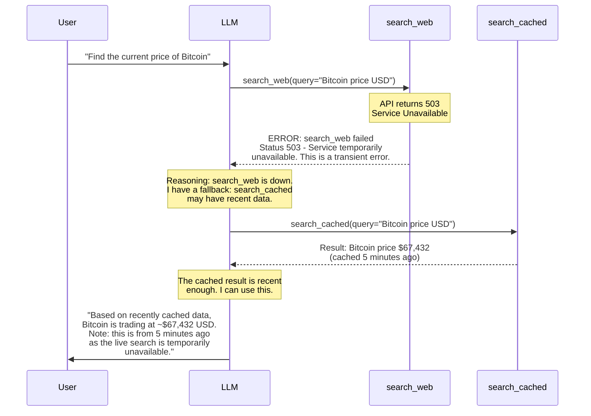

Notice what happens in this sequence. The LLM does not just mechanically retry. It reasons: the web search is down, but there is a cached alternative. The cached data is recent enough to be useful. And it transparently tells the user that the data source was a fallback. This is the kind of adaptive behavior that only works when errors flow back to the LLM as structured information.

## 3.4 Pattern 2: Retry with Exponential Backoff

Many tool failures are **transient** -- the service is momentarily overloaded, a network packet was dropped, or a rate limit window has not yet reset. For these, the correct strategy is to retry, but with increasing delays between attempts.

**Exponential backoff** means each retry waits longer than the previous one: 1 second, then 2, then 4, then 8. This gives the failing service time to recover and prevents your agent from hammering an already-stressed endpoint. Adding a small random **jitter** (a random fraction of a second) prevents multiple agents from retrying in lockstep.

## 3.4 Pattern 3: Structured Error Responses

When returning an error to the LLM, the format matters. A raw exception traceback gives the model little to work with. A structured error response gives it actionable information:

**tool_executor.py**

```python
import time
import random
import json
import httpx
from typing import Any


def execute_tool_with_retry(
    tool_name: str,
    tool_fn: callable,
    arguments: dict[str, Any],
    max_retries: int = 3,
    base_delay: float = 1.0,
) -> dict:
    """
    Execute a tool with retry logic and structured error reporting.

    Returns a dict that can be sent back to the LLM as a tool result,
    whether the call succeeded or failed.
    """
    last_error = None

    for attempt in range(1, max_retries + 1):
        try:
            result = tool_fn(**arguments)
            return {
                "status": "success",
                "data": result,
            }

        except httpx.TimeoutException as e:
            last_error = e
            if attempt < max_retries:
                delay = base_delay * (2 ** (attempt - 1))
                jitter = random.uniform(0, delay * 0.1)
                time.sleep(delay + jitter)
                continue  # Retry -- timeouts are transient

        except httpx.HTTPStatusError as e:
            last_error = e
            status_code = e.response.status_code

            if status_code == 429:
                # Rate limited -- respect Retry-After header if present
                retry_after = e.response.headers.get("Retry-After", "5")
                delay = float(retry_after)
                if attempt < max_retries:
                    time.sleep(delay)
                    continue

            elif status_code >= 500:
                # Server error -- retry with backoff
                if attempt < max_retries:
                    delay = base_delay * (2 ** (attempt - 1))
                    time.sleep(delay)
                    continue

            else:
                # Client error (400, 403, 404) -- do not retry
                break

        except ValueError as e:
            # Invalid parameters -- no point retrying the same bad input
            return {
                "status": "error",
                "error_type": "invalid_parameters",
                "message": str(e),
                "tool_name": tool_name,
                "suggestion": "Check the parameter values and try again "
                              "with corrected arguments.",
            }

        except Exception as e:
            last_error = e
            break  # Unknown errors -- don't retry blindly

    # All retries exhausted or non-retryable error
    return {
        "status": "error",
        "error_type": _classify_error(last_error),
        "message": str(last_error),
        "tool_name": tool_name,
        "attempts": attempt,
        "suggestion": _suggest_recovery(last_error, tool_name),
    }


def _classify_error(error: Exception) -> str:
    """Classify an error into a category the LLM can reason about."""
    if isinstance(error, httpx.TimeoutException):
        return "timeout"
    if isinstance(error, httpx.HTTPStatusError):
        code = error.response.status_code
        if code == 429:
            return "rate_limited"
        if code == 403:
            return "permission_denied"
        if code >= 500:
            return "server_error"
        return "client_error"
    return "unknown"


def _suggest_recovery(error: Exception, tool_name: str) -> str:
    """Generate a recovery suggestion for the LLM."""
    error_type = _classify_error(error)
    suggestions = {
        "timeout": f"{tool_name} timed out after retries. Consider "
                   f"using a cached alternative or simplifying the query.",
        "rate_limited": f"{tool_name} is rate limited. Wait before "
                        f"retrying, or use a different data source.",
        "permission_denied": f"{tool_name} access was denied. This "
                             f"may require user intervention.",
        "server_error": f"{tool_name} service is experiencing issues. "
                        f"Try a fallback tool if available.",
    }
    return suggestions.get(
        error_type,
        f"{tool_name} encountered an unexpected error. "
        f"Consider an alternative approach.",
    )
```

There are several things to notice in this code. First, the function always returns a dictionary -- never raises an exception. This means the agent loop never crashes. Second, the error response includes an `error_type`, a human-readable `message`, and a `suggestion` field that gives the LLM a hint about recovery. Third, the retry logic differentiates between error types: timeouts and server errors get retried, rate limits respect the `Retry-After` header, and client errors like 400 or 403 are not retried because sending the same bad request again will produce the same result.

## 3.4 Pattern 4: Fallback Tools

Sometimes the right response to a tool failure is not to retry the same tool but to **try a different tool that achieves the same goal through a different path**. This is the **fallback tool** pattern.

The idea is simple: register tools in priority order. If the primary tool fails, try the next one. A web search can fall back to a cached search. A live database query can fall back to a recently-snapshotted read replica. A premium API can fall back to a free tier with fewer features.

**fallback_tools.py**

```python
from typing import Any


# Define fallback chains: primary tool -> list of alternatives
FALLBACK_CHAINS: dict[str, list[str]] = {
    "search_web": ["search_cached", "search_local_index"],
    "get_stock_price": ["get_stock_price_delayed", "search_web"],
    "query_database": ["query_read_replica", "search_cached"],
}


def execute_with_fallbacks(
    tool_name: str,
    tools: dict[str, callable],
    arguments: dict[str, Any],
    max_retries: int = 2,
) -> dict:
    """
    Try the primary tool, then fall through to alternatives on failure.
    Returns a structured result the LLM can reason about.
    """
    chain = [tool_name] + FALLBACK_CHAINS.get(tool_name, [])
    errors_seen = []

    for current_tool in chain:
        if current_tool not in tools:
            continue

        result = execute_tool_with_retry(
            tool_name=current_tool,
            tool_fn=tools[current_tool],
            arguments=arguments,
            max_retries=max_retries,
        )

        if result["status"] == "success":
            # Let the LLM know if a fallback was used
            if current_tool != tool_name:
                result["note"] = (
                    f"Primary tool '{tool_name}' failed. "
                    f"Result obtained from fallback '{current_tool}'."
                )
            return result

        errors_seen.append({
            "tool": current_tool,
            "error": result["message"],
        })

    # All tools in the chain failed
    return {
        "status": "error",
        "error_type": "all_fallbacks_exhausted",
        "tool_name": tool_name,
        "attempts": errors_seen,
        "suggestion": (
            "All available tools for this operation have failed. "
            "Consider informing the user or trying a completely "
            "different approach to the task."
        ),
    }
```

The fallback chain is transparent to the LLM -- when a fallback is used, the `note` field tells the model which tool actually provided the data. This lets the LLM communicate appropriately to the user (for example, noting that data came from a cache and may be slightly stale).

## 3.4 Pattern 5: Max Retry Limits

Every retry mechanism needs a **ceiling**. Without a maximum retry count, an agent can enter an infinite loop: the tool fails, the LLM retries, the tool fails again, the LLM retries again, burning tokens and time indefinitely.

The `max_retries` parameter in the examples above serves this purpose, but there is a subtler form of the problem that happens at the agent loop level. Consider an agent that calls a tool, gets an error, reasons about the error, decides to try again with different parameters, gets another error, reasons again, and so on. Each iteration consumes a full LLM call plus a tool call. Even if each individual retry is bounded, the agent-level loop can still spin.

The solution is to track retry state across the entire agent loop, not just within a single tool execution:

**agent_loop_limits.py**

```python
# Track retries at the agent loop level
MAX_TOOL_RETRIES_PER_TURN = 3
MAX_TOTAL_TOOL_CALLS = 15

tool_retry_counts: dict[str, int] = {}  # tool_name -> retry count
total_tool_calls = 0

while not task_complete:
    # Safety: hard limit on total tool calls
    total_tool_calls += 1
    if total_tool_calls > MAX_TOTAL_TOOL_CALLS:
        # Force the agent to respond with what it has
        messages.append({
            "role": "user",
            "content": "You have reached the maximum number of tool "
                       "calls. Please respond with the best answer "
                       "you can provide given the information gathered "
                       "so far."
        })
        break

    # Get the LLM's next action
    response = get_llm_response(messages)

    if response.stop_reason == "tool_use":
        tool_name = response.tool_name

        # Check per-tool retry limit
        tool_retry_counts[tool_name] = (
            tool_retry_counts.get(tool_name, 0) + 1
        )

        if tool_retry_counts[tool_name] > MAX_TOOL_RETRIES_PER_TURN:
            # Tell the LLM to stop retrying this tool
            messages.append({
                "role": "tool",
                "content": json.dumps({
                    "status": "error",
                    "error_type": "max_retries_exceeded",
                    "message": f"'{tool_name}' has been attempted "
                               f"{MAX_TOOL_RETRIES_PER_TURN} times "
                               f"and keeps failing. Do NOT retry "
                               f"this tool. Use an alternative "
                               f"approach or inform the user.",
                }),
            })
        else:
            result = execute_with_fallbacks(
                tool_name, tools, response.arguments
            )
            messages.append({
                "role": "tool",
                "content": json.dumps(result),
            })
```

The two-level approach -- retry limits within `execute_tool_with_retry` for transient errors, and retry limits within the agent loop for repeated LLM-level attempts -- prevents both fast-spinning inner loops and slow-spinning outer loops.

## 3.4 Putting It All Together

Here is how these patterns work together in a real agent interaction. The agent is asked to look up weather data, but the primary weather API is down:

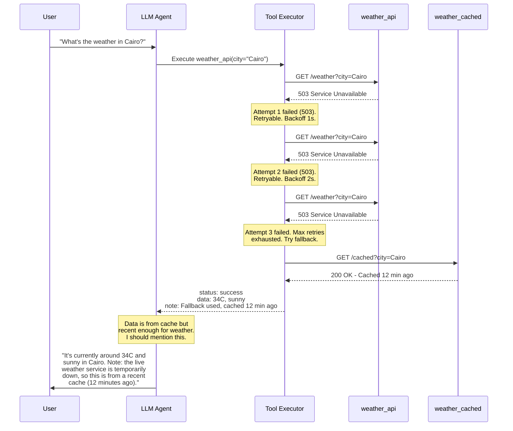

This is the full pipeline in action: the tool executor retries with backoff, falls through to a fallback tool when retries are exhausted, annotates the result with metadata about the fallback, and the LLM uses that metadata to craft an honest, transparent response to the user.

## 3.4 Common Mistakes

There are several anti-patterns to avoid when building error handling into agents:

**Swallowing errors silently.** If a tool fails and you return nothing or return a generic "success" message, the LLM will proceed as if the tool worked. This leads to hallucinated data -- the model will make up an answer because it thinks the tool gave it one.

**Retrying without limits.** An agent stuck in a retry loop burns tokens, burns API quota, and blocks the user. Always set hard ceilings at both the tool level and the agent loop level.

**Returning raw exception tracebacks.** A Python stack trace is information-dense for developers but noise for an LLM. Structured error responses with `error_type`, `message`, and `suggestion` fields give the model what it needs to make a recovery decision.

**Retrying non-retryable errors.** A 403 Forbidden will not succeed no matter how many times you try. A malformed parameter will not fix itself. Classify errors before deciding whether to retry.

> **Looking ahead:** The fallback and escalation patterns introduced here are instances of a broader design principle. In Module 5 (Design Patterns), you will see how these ideas generalize into full architectural patterns like circuit breakers and graceful degradation. And in Module 11 (Production), you will learn how to monitor tool failure rates, set up alerting on error spikes, and build dashboards that track agent reliability over time.

## 3.4 Summary

Tools fail in production -- APIs time out, rate limits trigger, parameters go wrong, services go down. The key insight for agent systems is that **errors are information, not crashes**. By returning structured errors to the LLM instead of raising exceptions, you let the agent reason about failures and adapt its strategy.

The five core patterns are: (1) **return errors to the LLM** with enough context for it to reason about recovery, (2) **retry with exponential backoff** for transient failures, (3) **use fallback tools** when the primary tool is unavailable, (4) **enforce max retry limits** at both the tool and agent loop levels to prevent infinite loops, and (5) **structure error responses** with error type, message, and recovery suggestions so the LLM can make informed decisions.

Building resilient agents means accepting that failure is normal and designing your tool execution layer to handle it gracefully. In the next lesson, we will explore the **Model Context Protocol (MCP)** -- an open standard that brings structure and interoperability to the way agents connect to tools, data sources, and services.

---

    Section 3.5: Model Context Protocol (MCP)


## 3.5 Overview

In the previous four lessons, you built tools from the ground up -- defining JSON schemas, wiring function calls, handling errors, and designing clean tool interfaces. All of that work used a single LLM provider's function calling format. But what happens when you want to share those tools across different AI applications? Or use tools someone else built? Or switch from one LLM host to another without rewriting every integration?

You hit a wall. Every framework, every host application, and every LLM provider has its own format for defining and invoking tools. A tool built for one system cannot be used in another without rewriting the integration layer. If you have worked with hardware before the USB standard, you know this pain -- every device had its own proprietary connector, and your desk was buried in cables.

The **Model Context Protocol (MCP)** is the solution. Created by Anthropic and released as an open standard, MCP defines a universal protocol for connecting AI agents to tools, data sources, and services. Write a tool once as an MCP server, and it works with any MCP-compatible host -- Claude Desktop, VS Code, custom agent frameworks, and more. MCP is to AI tools what USB-C is to hardware peripherals: one standard connector that replaces a dozen proprietary ones.

## 3.5 The Problem: N x M Integration

Without a standard protocol, connecting AI applications to external tools is an **N x M problem**. If you have N host applications and M tool providers, you need N x M custom integrations. Each host speaks its own tool format. Each tool provider must write a separate adapter for every host it wants to support.

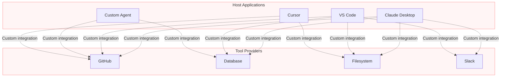

This diagram is a mess on purpose -- it reflects reality. Four hosts and four tool providers already produce a tangled web of custom integrations. Scale to dozens of hosts and hundreds of tools, and the ecosystem becomes unsustainable. Every new host must negotiate with every tool provider. Every new tool must be adapted for every host.

MCP collapses this N x M problem into **N + M**. Each host implements the MCP client protocol once. Each tool provider implements the MCP server protocol once. They all interoperate automatically.

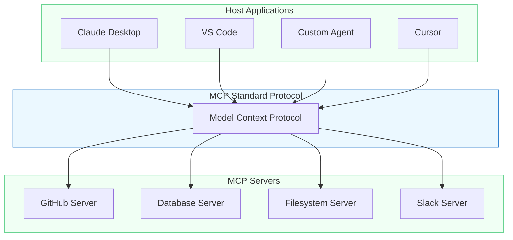

Clean. Every host connects through the same protocol. Every server exposes its capabilities through the same protocol. Add a new host? It immediately works with every existing server. Add a new server? It immediately works with every existing host.

## 3.5 MCP Architecture: Host, Client, Server

MCP defines three distinct roles that work together. Understanding this layered architecture is essential before you write any MCP code.

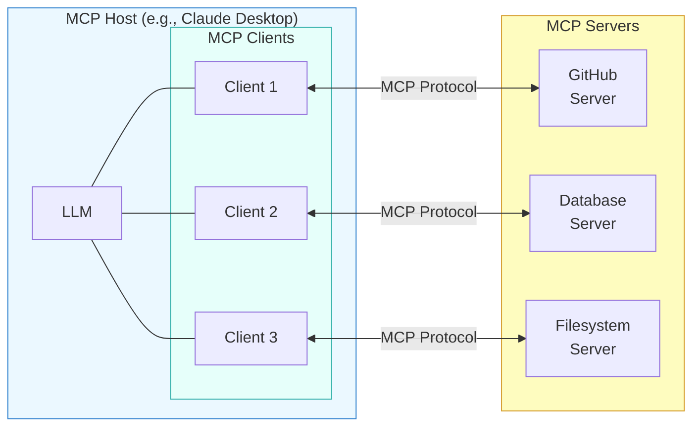

**MCP Host** is the application the user interacts with -- Claude Desktop, an IDE, or your custom agent. The host creates and manages MCP client instances, controls which clients connect to which servers, and enforces security policies. A single host can manage multiple clients simultaneously.

**MCP Client** maintains a 1:1 connection with a single MCP server. Each client handles protocol negotiation, message routing, and capability tracking for its server. The host creates one client per server it wants to connect to. The client is the bridge between the LLM inside the host and the external server.

**MCP Server** is a lightweight program that exposes specific capabilities -- tools, data, or prompt templates -- through the MCP protocol. Each server is focused: a GitHub server handles GitHub operations, a database server handles queries, a filesystem server handles file access. Servers run as separate processes, which provides natural isolation and security boundaries.

The key insight is the **separation of concerns**. The host manages the user experience and the LLM. The client handles protocol mechanics. The server handles domain-specific logic. No layer needs to know the internals of the others.

## 3.5 The Three MCP Primitives

MCP defines three types of capabilities that a server can expose. Each primitive serves a different purpose and is controlled differently.

**Tools** are model-controlled operations that perform actions. They are the MCP equivalent of the function calling you have been building in the previous lessons. Tools can have side effects -- they can create files, send messages, query APIs, or modify data. The LLM decides when to call a tool based on the user's request, just like the function calling pattern you already know. Examples: `create_issue`, `run_query`, `send_message`.

**Resources** are application-controlled data sources. They provide context to the LLM -- file contents, database records, API responses, live system data -- but the host application decides when and how to expose them, not the model. Think of resources as read-only data attachments. The host might automatically include relevant resources in the context, or let the user select them. Examples: `file://project/README.md`, `db://users/schema`, `api://weather/current`.

**Prompts** are user-controlled templates. They are reusable prompt structures that servers can expose for common tasks -- a code review template, a SQL query generator, a bug report formatter. The user selects a prompt template, fills in the parameters, and the result is injected into the conversation. Examples: `review-code`, `explain-error`, `generate-migration`.

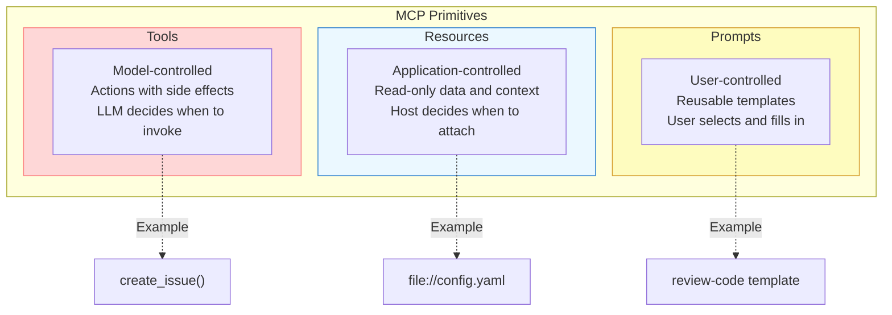

The distinction between these primitives matters for security and control. Tools can change the world, so the model must choose them carefully and the host can require user approval. Resources are read-only, so they are safer to expose broadly. Prompts are user-initiated, so they never fire without explicit human action.

## 3.5 The MCP Lifecycle: Handshake to Invocation

When an MCP client connects to a server, they go through a structured lifecycle. Understanding this sequence helps you debug connection issues and design robust integrations.

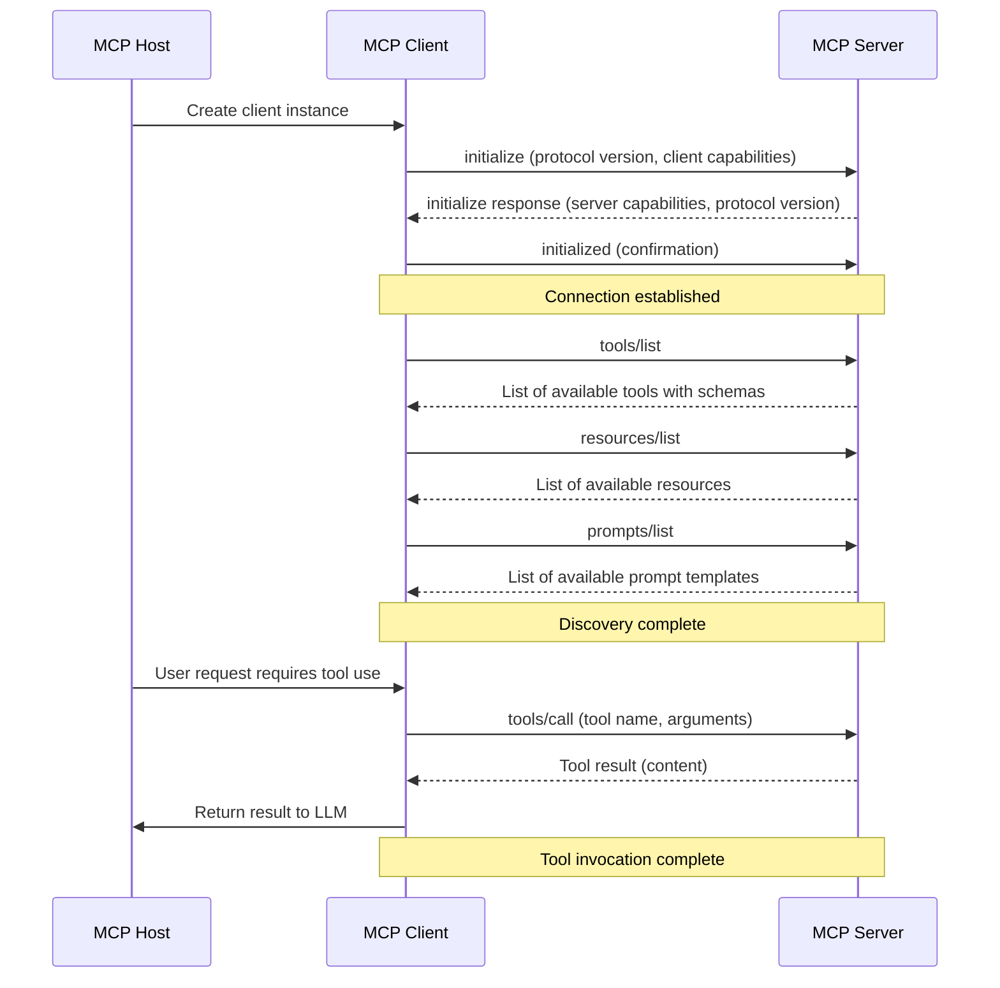

The lifecycle has three phases:

**Initialization.** The client sends an `initialize` request with its protocol version and capabilities. The server responds with its own capabilities and the negotiated protocol version. The client confirms with an `initialized` notification. This handshake ensures both sides agree on what they support before any work begins.

**Discovery.** The client queries the server to learn what tools, resources, and prompts are available. Each tool comes with a JSON Schema describing its parameters -- exactly like the function definitions you wrote in Lesson 02. The host uses this information to present tools to the LLM and to the user.

**Invocation.** When the LLM decides to use a tool, the host routes the call through the client to the server. The server executes the tool, and the result flows back through the client to the host and into the LLM's context. This is the same call-and-response pattern you built by hand in the function calling lesson -- MCP just standardizes the wire format.

## 3.5 Transport: How Client and Server Communicate

MCP is transport-agnostic -- it defines the messages, not how they travel. The protocol currently supports two primary transports.

**stdio (Standard I/O)** is the simplest transport. The host launches the MCP server as a child process and communicates over stdin/stdout. This is ideal for local tools -- filesystem access, local databases, CLI wrappers. There is no network setup, no ports to configure, and the server's lifetime is tied to the host's. Most MCP servers you will encounter use stdio.

**Streamable HTTP** (formerly called SSE) is the network transport. The server runs as an HTTP endpoint, and the client connects over HTTP with server-sent events for streaming responses. This is used for remote servers -- shared team tools, cloud-hosted services, or servers that need to persist across multiple host sessions.

> **When to use which?** Start with stdio. It is simpler, faster, and works for the vast majority of use cases. Only move to Streamable HTTP when you need a server that runs independently of the host, serves multiple clients, or is deployed on a remote machine.

## 3.5 Using MCP in Python

Let's see MCP in practice. The `mcp` Python SDK provides both client and server implementations. Here is how you connect to an MCP server, discover its tools, and call one.

**mcp_client_example.py**

```python
import asyncio
from mcp import ClientSession, StdioServerParameters
from mcp.client.stdio import stdio_client


async def main():
    # Define the server to connect to
    # This launches "uvx mcp-server-filesystem" as a child process
    server_params = StdioServerParameters(
        command="uvx",
        args=["mcp-server-filesystem", "--root", "/home/user/projects"],
    )

    # Connect to the server over stdio
    async with stdio_client(server_params) as (read_stream, write_stream):
        async with ClientSession(read_stream, write_stream) as session:
            # Phase 1: Initialize the connection
            await session.initialize()
            print("Connected to MCP server")

            # Phase 2: Discover available tools
            tools = await session.list_tools()
            print(f"\\nAvailable tools ({len(tools.tools)}):")
            for tool in tools.tools:
                print(f"  - {tool.name}: {tool.description}")

            # Phase 3: Call a tool
            result = await session.call_tool(
                name="read_file",
                arguments={"path": "/home/user/projects/README.md"},
            )
            print(f"\\nFile contents:\\n{result.content[0].text}")


asyncio.run(main())
```

Notice the three phases from the lifecycle diagram playing out in code: `initialize()` performs the handshake, `list_tools()` performs discovery, and `call_tool()` performs invocation. The MCP SDK handles all the protocol details -- JSON-RPC framing, capability negotiation, message routing -- so your code stays clean.

The tool schemas you get back from `list_tools()` look exactly like the JSON Schema tool definitions you wrote by hand in Lesson 02. MCP did not invent a new format -- it standardized the one the ecosystem was already converging toward.

## 3.5 Integrating MCP Tools with an LLM

Discovering and calling tools manually is useful for testing, but the real power of MCP is feeding those tools to an LLM so it can decide when to use them. Here is how you bridge MCP discovery into an LLM's tool-use loop.

**mcp_agent_loop.py**

```python
import anthropic
from mcp import ClientSession


async def build_tool_definitions(session: ClientSession) -> list[dict]:
    """Convert MCP tools into the format the LLM expects."""
    tools = await session.list_tools()
    return [
        {
            "name": tool.name,
            "description": tool.description,
            "input_schema": tool.inputSchema,
        }
        for tool in tools.tools
    ]


async def agent_loop(session: ClientSession, user_message: str):
    """Run an agent loop using MCP tools."""
    client = anthropic.Anthropic()

    # Convert MCP tool schemas to LLM tool definitions
    tools = await build_tool_definitions(session)

    messages = [{"role": "user", "content": user_message}]

    while True:
        response = client.messages.create(
            model="claude-sonnet-4-20250514",
            max_tokens=1024,
            tools=tools,
            messages=messages,
        )

        # If the model is done, return the final text
        if response.stop_reason == "end_turn":
            final = [b.text for b in response.content if b.type == "text"]
            return "\\n".join(final)

        # Process any tool calls
        tool_results = []
        for block in response.content:
            if block.type == "tool_use":
                # Route the tool call through MCP
                result = await session.call_tool(
                    name=block.name,
                    arguments=block.input,
                )
                tool_results.append({
                    "type": "tool_result",
                    "tool_use_id": block.id,
                    "content": result.content[0].text,
                })

        # Feed results back into the conversation
        messages.append({"role": "assistant", "content": response.content})
        messages.append({"role": "user", "content": tool_results})
```

This is the same agent loop pattern from Lesson 02, but instead of hardcoded tool definitions and local function handlers, everything flows through MCP. The `build_tool_definitions` function converts MCP tool schemas into the format the LLM expects. The agent loop routes tool calls through `session.call_tool()` instead of dispatching to local functions. Swap the MCP server, and the agent gains entirely different capabilities -- without changing a single line of the agent loop.

## 3.5 The MCP Ecosystem

One of MCP's greatest strengths is the rapidly growing ecosystem of pre-built servers. Instead of building every integration from scratch, you can connect to existing MCP servers that wrap popular services.

Here are some widely used MCP servers:

- **Filesystem** -- read, write, search, and manage local files and directories
- **GitHub** -- create issues, open pull requests, search repositories, manage branches
- **PostgreSQL / SQLite** -- run queries, inspect schemas, manage database operations
- **Slack** -- send messages, read channels, search conversation history
- **Google Drive** -- search, read, and organize documents
- **Brave Search** -- web search with structured result parsing
- **Docker** -- manage containers, images, and compose stacks
- **Kubernetes** -- query cluster state, manage pods and deployments

Each of these servers follows the same MCP protocol. Your agent connects to them identically -- the same `initialize`, `list_tools`, `call_tool` pattern works for all of them. Want your agent to search GitHub, query a database, and post a Slack summary? Connect three MCP servers and the agent has all three capabilities without you writing any integration code.

> **The power of composition:** Because MCP servers are independent processes with a standard interface, you can compose any combination of them. An agent with access to a filesystem server, a GitHub server, and a database server can read local files, cross-reference them with GitHub issues, and log results to a database -- all through the same protocol.

## 3.5 MCP and Multi-Agent Systems

MCP's standardized interface has implications beyond single-agent tool use. When you reach Module 9 (Multi-Agent Systems), you will see that MCP also enables **agents to share tools across a multi-agent system**. Because every tool is exposed through the same protocol, a supervisor agent can provision MCP servers for its worker agents dynamically. A research agent and a coding agent can connect to the same GitHub MCP server without either knowing about the other. The protocol becomes the shared infrastructure that makes multi-agent coordination practical.

## 3.5 What's Next

You now understand what MCP is, why it exists, and how its architecture works. You have seen how an MCP client discovers and calls tools, and how those tools integrate into an LLM agent loop. But so far, you have only used existing MCP servers.

In the next lesson, we will **build our own MCP server from scratch**. You will create a server that exposes custom tools and resources, register it with a host application, and watch your agent use it in real time. Everything you learned about tool design in Lesson 03 -- clear names, precise schemas, helpful descriptions -- applies directly to designing MCP server tools.

## 3.5 Summary

The **Model Context Protocol (MCP)** is an open standard that solves the fragmentation problem in AI tool integration:

- **The problem:** Without a standard, connecting N hosts to M tool providers requires N x M custom integrations. MCP reduces this to **N + M** by providing a universal protocol.
- **The architecture** has three layers: **Hosts** (user-facing applications) create **Clients** (1:1 protocol bridges) that connect to **Servers** (capability providers).
- **Three primitives** define what servers can expose: **Tools** (model-controlled actions), **Resources** (application-controlled data), and **Prompts** (user-controlled templates).
- **The lifecycle** follows three phases: initialization (handshake), discovery (list capabilities), and invocation (call tools and get results).
- **Two transports** are available: **stdio** for local servers (simple, start here) and **Streamable HTTP** for remote/shared servers.
- **The ecosystem** provides pre-built servers for GitHub, databases, filesystems, Slack, and many more -- all usable through the same protocol.
- MCP tool schemas are the same JSON Schema format you already know from function calling -- MCP standardized the pattern, not reinvented it.

---

    Section 3.6: Building MCP Servers


## 3.6 Overview

In the previous lesson, you learned what the **Model Context Protocol** is and how its architecture works: hosts, clients, servers, transports, and the three primitives (tools, resources, prompts). You understand how MCP separates the agent from its capabilities. Now it is time to build a server yourself.

In this lesson, you will create a working MCP server from scratch using the official **FastMCP** Python SDK. Your server will expose two tools -- `get_weather` and `add_note` -- plus a resource that lists all stored notes. By the end, you will be able to run the server, connect it to an MCP client, and call your custom tools from an LLM-powered agent.

This is a build lesson. Every section adds working code. Follow along step by step.

## 3.6 What We Are Building

Here is the architecture of the server you will create and how it fits into the MCP ecosystem:

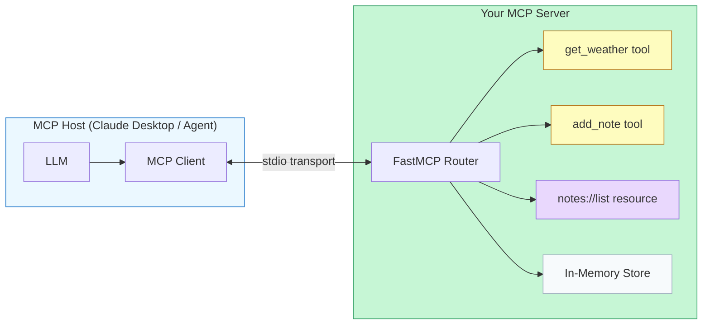

The host (Claude Desktop or any MCP client) connects to your server over **stdio transport**. When the LLM decides to call a tool, the client sends a JSON-RPC request through stdin. Your server routes the request to the right handler, executes it, and returns the result through stdout. The LLM never knows or cares that your server is a separate process -- it just sees tools and resources it can use.

## 3.6 Step 1: Project Setup

Create a new directory and install the `mcp` Python package. This is the official SDK maintained by Anthropic.

**terminal**

```bash
# Create a project directory
mkdir my-mcp-server && cd my-mcp-server

# Create a virtual environment
python -m venv .venv
source .venv/bin/activate

# Install the MCP SDK
pip install mcp
```

The `mcp` package includes **FastMCP**, a high-level framework that handles all the protocol details -- JSON-RPC message parsing, capability negotiation, transport management -- so you can focus on writing tool and resource handlers.

Let's verify the installation by creating a minimal server file:

**server.py**

```python
from mcp.server.fastmcp import FastMCP

# Create the server instance
mcp = FastMCP("my-notes-server")

if __name__ == "__main__":
    mcp.run()
```

If you run `python server.py` and it starts without errors, your environment is ready. The server will listen on stdin/stdout by default, waiting for a client to connect. Press `Ctrl+C` to stop it.

## 3.6 Step 2: Add Your First Tool

Tools are the most common MCP primitive. They let the LLM **take actions** -- calling APIs, writing data, performing computations. You define a tool by decorating a Python function with `@mcp.tool()`.

Let's add a `get_weather` tool that returns weather data for a given city. In a real server, this would call a weather API. For this lesson, we will use simulated data so we can focus on the MCP mechanics.

**server.py**

```python
from mcp.server.fastmcp import FastMCP

mcp = FastMCP("my-notes-server")

@mcp.tool()
def get_weather(city: str) -> str:
    """Get the current weather for a city.

    Args:
        city: The name of the city to get weather for.
    """
    # Simulated weather data -- in production, call a real API
    weather_data = {
        "london": {"temp_c": 12, "condition": "Cloudy", "humidity": 78},
        "tokyo": {"temp_c": 22, "condition": "Sunny", "humidity": 45},
        "new york": {"temp_c": 18, "condition": "Partly cloudy", "humidity": 62},
        "cairo": {"temp_c": 35, "condition": "Sunny", "humidity": 20},
    }

    lookup = city.lower().strip()
    if lookup in weather_data:
        data = weather_data[lookup]
        return (
            f"Weather in {city}: {data['temp_c']}°C, "
            f"{data['condition']}, "
            f"Humidity: {data['humidity']}%"
        )
    else:
        return f"Weather data not available for '{city}'."

if __name__ == "__main__":
    mcp.run()
```

Three things to notice about how FastMCP handles this:

- **The function name becomes the tool name.** When the LLM sees the list of available tools, it will see `get_weather`.
- **The docstring becomes the tool description.** FastMCP extracts it and sends it to the client during capability negotiation. Write clear docstrings -- they are what the LLM reads to decide when to call your tool.
- **Type hints become the input schema.** The `city: str` parameter annotation tells FastMCP to generate a JSON Schema requiring a string argument named `city`. The `Args:` section in the docstring provides the parameter description.

You did not write any JSON Schema, parse any JSON-RPC messages, or handle any protocol details. FastMCP did all of that from your function signature and docstring.

## 3.6 Step 3: Add a Second Tool

Now let's add `add_note` -- a tool that stores a note in memory. This demonstrates a **stateful** tool: one that modifies server-side state rather than just returning data.

**server.py**

```python
from mcp.server.fastmcp import FastMCP

mcp = FastMCP("my-notes-server")

# In-memory storage for notes
notes: list[dict] = []

@mcp.tool()
def get_weather(city: str) -> str:
    """Get the current weather for a city.

    Args:
        city: The name of the city to get weather for.
    """
    weather_data = {
        "london": {"temp_c": 12, "condition": "Cloudy", "humidity": 78},
        "tokyo": {"temp_c": 22, "condition": "Sunny", "humidity": 45},
        "new york": {"temp_c": 18, "condition": "Partly cloudy", "humidity": 62},
        "cairo": {"temp_c": 35, "condition": "Sunny", "humidity": 20},
    }

    lookup = city.lower().strip()
    if lookup in weather_data:
        data = weather_data[lookup]
        return (
            f"Weather in {city}: {data['temp_c']}°C, "
            f"{data['condition']}, "
            f"Humidity: {data['humidity']}%"
        )
    else:
        return f"Weather data not available for '{city}'."

@mcp.tool()
def add_note(title: str, content: str) -> str:
    """Save a new note.

    Args:
        title: A short title for the note.
        content: The body text of the note.
    """
    note = {
        "id": len(notes) + 1,
        "title": title,
        "content": content,
    }
    notes.append(note)
    return f"Note saved with ID {note['id']}: '{title}'"

if __name__ == "__main__":
    mcp.run()
```

The `add_note` tool takes two string parameters and stores the note in a Python list. FastMCP generates the JSON Schema with both `title` and `content` as required string fields, all from the type hints.

> **Stateful vs. stateless tools:** `get_weather` is stateless -- it returns the same result for the same input every time. `add_note` is stateful -- it modifies the `notes` list. Both are valid MCP tools. Stateful tools are how MCP servers interact with databases, files, and external services.

## 3.6 Step 4: Add a Resource

**Resources** are the second MCP primitive. While tools let the LLM take actions, resources let the LLM **read data**. Resources are identified by URIs, just like web pages. The LLM can request a resource to load context into its conversation.

Let's add a resource that returns all stored notes:

**server.py (add below add_note)**

```python
@mcp.resource("notes://list")
def list_notes() -> str:
    """List all saved notes."""
    if not notes:
        return "No notes saved yet."

    lines = []
    for note in notes:
        lines.append(
            f"[{note['id']}] {note['title']}: {note['content']}"
        )
    return "\n".join(lines)
```

The `@mcp.resource()` decorator takes a **URI** as its argument. When a client requests the resource at `notes://list`, FastMCP calls this function and returns the result. The URI scheme is up to you -- `notes://` is a custom scheme that makes the purpose clear.

Resources differ from tools in an important way: tools are **model-controlled** (the LLM decides when to call them), while resources are typically **application-controlled** (the host application decides when to load them). Think of resources as "files" the LLM can read, and tools as "actions" the LLM can take.

## 3.6 The Request Flow

Here is what happens when an LLM calls one of your tools, from start to finish:

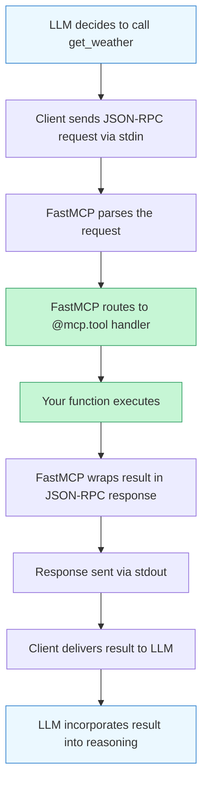

You wrote steps D and E. FastMCP handles everything else -- the JSON-RPC parsing (C), the routing (D), the response formatting (F), and the transport (B, G). This is why building an MCP server requires so little boilerplate.

## 3.6 Step 5: The Complete Server

Here is the full server in a single file. This is everything you need to run a working MCP server:

**server.py**

```python
"""
MCP server exposing weather tools and a notes system.

Usage:
    python server.py                  # Run with stdio transport
    mcp dev server.py                 # Run with MCP Inspector
"""

from mcp.server.fastmcp import FastMCP

# Create the server
mcp = FastMCP("my-notes-server")

# In-memory storage for notes
notes: list[dict] = []


# --- Tools ---

@mcp.tool()
def get_weather(city: str) -> str:
    """Get the current weather for a city.

    Args:
        city: The name of the city to get weather for.
    """
    weather_data = {
        "london": {"temp_c": 12, "condition": "Cloudy", "humidity": 78},
        "tokyo": {"temp_c": 22, "condition": "Sunny", "humidity": 45},
        "new york": {"temp_c": 18, "condition": "Partly cloudy", "humidity": 62},
        "cairo": {"temp_c": 35, "condition": "Sunny", "humidity": 20},
    }

    lookup = city.lower().strip()
    if lookup in weather_data:
        data = weather_data[lookup]
        return (
            f"Weather in {city}: {data['temp_c']}°C, "
            f"{data['condition']}, "
            f"Humidity: {data['humidity']}%"
        )
    else:
        return f"Weather data not available for '{city}'."


@mcp.tool()
def add_note(title: str, content: str) -> str:
    """Save a new note.

    Args:
        title: A short title for the note.
        content: The body text of the note.
    """
    note = {
        "id": len(notes) + 1,
        "title": title,
        "content": content,
    }
    notes.append(note)
    return f"Note saved with ID {note['id']}: '{title}'"


# --- Resources ---

@mcp.resource("notes://list")
def list_notes() -> str:
    """List all saved notes."""
    if not notes:
        return "No notes saved yet."

    lines = []
    for note in notes:
        lines.append(
            f"[{note['id']}] {note['title']}: {note['content']}"
        )
    return "\\n".join(lines)


# --- Entry point ---

if __name__ == "__main__":
    mcp.run()
```

That is the entire server: 60 lines of meaningful code. Compare this to what it would take to build the equivalent from scratch -- you would need to implement JSON-RPC message parsing, capability negotiation, request routing, error handling, and transport management. FastMCP handles all of it.

## 3.6 Step 6: Testing Your Server

The MCP SDK includes a built-in development tool called the **MCP Inspector**. It provides a web UI where you can connect to your server, list its tools and resources, and call them interactively -- without needing a full LLM client.

**terminal**

```bash
# Start the MCP Inspector (opens a web UI)
mcp dev server.py
```

The Inspector will start your server and open a browser window where you can:

1. See the list of registered tools and their schemas
2. Call `get_weather` with a city name and see the response
3. Call `add_note` to store a note, then read the `notes://list` resource to verify it was saved

This is the fastest way to iterate on your server. You do not need an LLM to test MCP -- the Inspector lets you call tools directly and inspect the JSON-RPC messages flowing back and forth.

> **Debugging tip:** If your server crashes or a tool returns an error, the Inspector shows the full JSON-RPC error response. Look at the `message` field for Python tracebacks. Common mistakes include missing type hints (FastMCP cannot generate a schema without them) and forgetting to return a string from your tool handler.

## 3.6 Step 7: Connecting to Claude Desktop

Once your server works in the Inspector, you can connect it to **Claude Desktop** so Claude can use your tools in conversation. Claude Desktop acts as an MCP host -- it manages client connections to one or more MCP servers.

Add your server to Claude Desktop's configuration file:

**claude_desktop_config.json**

```json
// Claude Desktop config
// macOS: ~/Library/Application Support/Claude/claude_desktop_config.json
// Windows: %APPDATA%\\Claude\\claude_desktop_config.json

{
  "mcpServers": {
    "my-notes-server": {
      "command": "python",
      "args": ["/absolute/path/to/server.py"]
    }
  }
}
```

After saving this file and restarting Claude Desktop, you will see a hammer icon indicating that MCP tools are available. You can then ask Claude things like:

- "What's the weather in Tokyo?"
- "Save a note titled 'Meeting' with the content 'Discuss Q3 roadmap'"
- "Show me all my notes"

Claude will call your `get_weather` and `add_note` tools, and read the `notes://list` resource, all through the MCP protocol.

> **Use absolute paths.** Claude Desktop launches your server as a subprocess. Relative paths will fail because the working directory is not what you expect. Always use the full path to `server.py` and, if you are using a virtual environment, point `command` to the Python binary inside it (e.g., `/path/to/.venv/bin/python`).

## 3.6 Debugging MCP Servers

When things go wrong -- and they will -- here are the most effective debugging techniques:

**Check the logs.** Claude Desktop writes MCP logs that show every JSON-RPC message exchanged with your server. On macOS, find them at `~/Library/Logs/Claude/mcp*.log`.

**Print to stderr.** Your server's stdout is reserved for JSON-RPC messages. If you add `print()` statements for debugging, they will corrupt the protocol stream. Use `print(..., file=sys.stderr)` instead, or use Python's `logging` module which defaults to stderr:

**server.py (debugging)**

```python
import sys
import logging

# Configure logging to stderr (safe for MCP servers)
logging.basicConfig(level=logging.DEBUG, stream=sys.stderr)
logger = logging.getLogger("my-server")

@mcp.tool()
def get_weather(city: str) -> str:
    """Get the current weather for a city.

    Args:
        city: The name of the city to get weather for.
    """
    logger.debug(f"get_weather called with city={city}")
    # ... rest of the handler
```

**Return errors, don't raise them.** If a tool handler raises an unhandled exception, FastMCP will catch it and return a generic error to the client. Instead, catch exceptions yourself and return a descriptive error string. The LLM can read your error message and adjust its approach:

**server.py (error handling)**

```python
@mcp.tool()
def get_weather(city: str) -> str:
    """Get the current weather for a city.

    Args:
        city: The name of the city to get weather for.
    """
    try:
        # ... lookup logic ...
        return f"Weather in {city}: ..."
    except Exception as e:
        return f"Error fetching weather for '{city}': {str(e)}"
```

**Validate with the Inspector first.** Always test tools in `mcp dev` before connecting to Claude Desktop. The Inspector shows you the raw protocol messages, making it much easier to diagnose schema mismatches and serialization issues.

## 3.6 Beyond the Basics

The server you built covers the core patterns, but FastMCP supports several more capabilities you should know about:

**Dynamic resources with templates.** Instead of a fixed URI, you can parameterize resources using URI templates:

**server.py (resource template)**

```python
@mcp.resource("notes://{note_id}")
def get_note(note_id: str) -> str:
    """Get a specific note by ID."""
    for note in notes:
        if str(note["id"]) == note_id:
            return f"{note['title']}: {note['content']}"
    return f"Note {note_id} not found."
```

Now the client can request `notes://1`, `notes://2`, and so on. FastMCP extracts the `note_id` from the URI and passes it to your handler.

**Prompts.** The third MCP primitive lets you expose reusable prompt templates:

**server.py (prompt)**

```python
@mcp.prompt()
def summarize_notes() -> str:
    """Create a prompt to summarize all notes."""
    all_notes = list_notes()
    return f"Please summarize the following notes:\\n\\n{all_notes}"
```

Prompts are user-controlled -- the human selects them from the client UI to inject pre-built instructions into the conversation. They are useful for complex workflows that the user triggers intentionally.

**SSE transport.** For remote servers (not running on the same machine as the host), FastMCP supports **Server-Sent Events** transport over HTTP. This lets you deploy your MCP server as a web service:

**server.py (SSE transport)**

```python
# Run with SSE transport instead of stdio
if __name__ == "__main__":
    mcp.run(transport="sse")
```

## 3.6 What You Have Built

Let's step back and see what you accomplished. You started with an empty file and built an MCP server that:

1. **Exposes two tools** -- `get_weather` and `add_note` -- that any MCP client can discover and call
2. **Serves a resource** -- `notes://list` -- that provides read access to stored data
3. **Handles the full MCP protocol** -- capability negotiation, JSON-RPC messaging, transport -- through FastMCP
4. **Connects to real clients** -- the MCP Inspector for development, Claude Desktop for production use

The server is 60 lines of code. Everything else -- the protocol, the transport, the schema generation -- is handled by the SDK. This is the power of MCP: it gives you a standard way to expose capabilities to any LLM agent, without writing integration code for each client.

In the next lesson, you will combine everything from this module -- tool definitions, function calling, error handling, and MCP -- into a complete tool-using agent in the **Tool Use Lab**.

## 3.6 Summary

You built a working MCP server from scratch using the FastMCP Python SDK. The key takeaways are:

- **`@mcp.tool()`** turns a Python function into an MCP tool. FastMCP generates the JSON Schema from your type hints and the description from your docstring.
- **`@mcp.resource()`** exposes read-only data at a URI. Resources let the LLM load context without taking actions.
- **`mcp dev`** launches the MCP Inspector for interactive testing without needing an LLM client.
- **stdio transport** connects your server to local clients like Claude Desktop. The host launches your server as a subprocess and communicates through stdin/stdout.
- **Always log to stderr** -- stdout is reserved for protocol messages. A stray `print()` will corrupt the JSON-RPC stream.
- **Return error strings** from tool handlers instead of raising exceptions, so the LLM can read the error and adapt its behavior.

---

    Section 3.7: Tool Use Lab


## 3.7 Overview

You have spent six lessons building up every piece of the tool-use puzzle: why tools matter, how function calling works, how to design clean tool interfaces, how to handle errors gracefully, what the Model Context Protocol is, and how to build your own MCP servers. Now it is time to put all of those pieces together.

In this capstone lab, you will build a **research assistant agent** -- an agent that takes a research question, searches the web for information, reads the content of relevant pages, and synthesizes its findings into a structured report. This is not a toy calculator. It is a multi-tool, multi-turn agent that mirrors what production research agents actually do.

By the end of this lab, you will have a working agent that demonstrates every concept from this module in a single cohesive system. You will also see exactly where this approach hits its limits -- which sets the stage for Module 4, where we learn structured agent architectures that solve those problems.

## 3.7 What We Are Building

The research assistant takes a question like "What are the main approaches to reducing LLM hallucinations?" and autonomously gathers information to answer it. Here is the full flow of a research session:

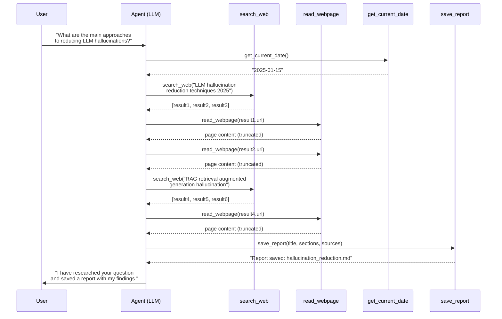

Notice the pattern: the agent does not follow a hardcoded script. The LLM decides when to search, what to read, whether to search again with refined terms, and when it has gathered enough information to write the report. This is **autonomous, goal-directed behavior** driven by tools.

## 3.7 Stage 1: Define the Tools

We need four tools. Each one follows the design principles from lesson 03: clear names, specific descriptions that tell the LLM *when* to use the tool, and well-typed parameter schemas.

**tools.py**

```python
import json
import datetime
from typing import Any


# --- Tool implementations ---

def search_web(query: str, max_results: int = 3) -> str:
    """Search the web and return a list of results with titles,
    URLs, and snippets.

    In production, this would call a real search API (Google, Bing,
    Tavily, etc.). Here we simulate results to keep the lab
    self-contained.
    """
    # Simulated search results for demonstration
    simulated_results = {
        "default": [
            {
                "title": f"Research result for: {query}",
                "url": f"https://example.com/article/{query.replace(' ', '-')[:40]}",
                "snippet": f"Comprehensive overview of {query}. "
                           f"This article covers key concepts and recent developments.",
            },
            {
                "title": f"Deep dive: {query}",
                "url": f"https://example.com/deep-dive/{query.replace(' ', '-')[:40]}",
                "snippet": f"An in-depth analysis of {query} with practical examples "
                           f"and expert commentary.",
            },
            {
                "title": f"{query} - Latest Research",
                "url": f"https://example.com/research/{query.replace(' ', '-')[:40]}",
                "snippet": f"Recent academic and industry research on {query}, "
                           f"including benchmarks and comparisons.",
            },
        ]
    }

    results = simulated_results["default"][:max_results]
    return json.dumps({"results": results, "total_found": len(results)})


def read_webpage(url: str) -> str:
    """Fetch and return the text content of a webpage.

    In production, this would use httpx or requests with
    readability extraction. Here we return simulated content.
    """
    # Simulated page content
    simulated_content = (
        f"Content from {url}\\n\\n"
        "Large language models can produce plausible-sounding but incorrect "
        "information, known as hallucinations. Key approaches to reducing "
        "hallucinations include:\\n\\n"
        "1. Retrieval-Augmented Generation (RAG): Grounding model outputs "
        "in retrieved documents from a knowledge base.\\n"
        "2. Fine-tuning on verified data: Training models on curated, "
        "fact-checked datasets specific to the domain.\\n"
        "3. Chain-of-thought prompting: Asking models to show their "
        "reasoning step by step, which reduces logical errors.\\n"
        "4. Constitutional AI and RLHF: Using reinforcement learning from "
        "human feedback to penalize fabricated claims.\\n"
        "5. Tool use and grounding: Giving models access to search engines, "
        "calculators, and databases so they can verify facts.\\n\\n"
        "Recent benchmarks show that combining RAG with chain-of-thought "
        "prompting reduces hallucination rates by up to 60%."
    )

    # Simulate truncation for very long pages
    max_chars = 2000
    if len(simulated_content) > max_chars:
        simulated_content = simulated_content[:max_chars] + "\\n\\n[Content truncated]"

    return json.dumps({
        "url": url,
        "content": simulated_content,
        "char_count": len(simulated_content),
    })


def get_current_date() -> str:
    """Return today's date. Useful for time-sensitive research
    queries and for dating the final report."""
    today = datetime.date.today()
    return json.dumps({
        "date": today.isoformat(),
        "formatted": today.strftime("%B %d, %Y"),
    })


def save_report(
    title: str,
    summary: str,
    sections: list[dict[str, str]],
    sources: list[str],
) -> str:
    """Save a structured research report. Each section has a
    'heading' and 'body'. Sources are listed at the end."""
    filename = title.lower().replace(" ", "_")[:50] + ".md"

    # Build the report content
    report_lines = [f"# {title}\\n"]
    report_lines.append(f"*Generated on {datetime.date.today().isoformat()}*\\n")
    report_lines.append(f"## Summary\\n\\n{summary}\\n")

    for section in sections:
        report_lines.append(f"## {section['heading']}\\n\\n{section['body']}\\n")

    report_lines.append("## Sources\\n")
    for i, source in enumerate(sources, 1):
        report_lines.append(f"{i}. {source}")

    report_content = "\\n".join(report_lines)

    # In production, write to disk or a database
    print(f"\\n--- Report saved to {filename} ---")
    print(report_content)
    print("--- End of report ---\\n")

    return json.dumps({
        "filename": filename,
        "char_count": len(report_content),
        "section_count": len(sections),
    })


# Tool dispatch table
tool_functions: dict[str, Any] = {
    "search_web": search_web,
    "read_webpage": read_webpage,
    "get_current_date": get_current_date,
    "save_report": save_report,
}
```

A few design choices worth calling out:

- **Simulated tools** keep this lab self-contained. Swapping in real implementations (Tavily for search, httpx for web reading) only requires changing the function bodies -- the schemas and agent loop stay identical.
- **`read_webpage` truncates long content.** This is a real-world concern. Web pages can be massive, and sending tens of thousands of characters to the LLM wastes tokens and degrades performance. Production agents typically use readability extraction and chunking.
- **`save_report` takes structured input.** Rather than accepting a raw string, it takes a title, summary, sections, and sources. This forces the LLM to organize its findings before writing -- a technique from lesson 03 on designing tool interfaces that shape model behavior.
- **Every tool returns JSON.** Consistent return formats make it easier for the LLM to parse results and for you to debug the agent's behavior.

## 3.7 Stage 2: Write the Tool Definitions

Now we describe each tool to the LLM. Remember from lesson 03: descriptions should explain *what* the tool does and *when* to use it. Parameter descriptions should eliminate ambiguity.

**tool_definitions.py**

```python
# --- Tool definitions for the API ---

tools = [
    {
        "name": "search_web",
        "description": (
            "Search the web for information on a topic. Returns a list of "
            "results with titles, URLs, and snippets. Use this as the first "
            "step when researching a new topic, or to find additional sources "
            "when existing information is incomplete. You can refine your "
            "query based on what you have already learned."
        ),
        "input_schema": {
            "type": "object",
            "properties": {
                "query": {
                    "type": "string",
                    "description": (
                        "The search query. Be specific and include key terms. "
                        "For recent topics, include the year."
                    ),
                },
                "max_results": {
                    "type": "integer",
                    "description": "Maximum number of results to return (default 3).",
                    "default": 3,
                },
            },
            "required": ["query"],
        },
    },
    {
        "name": "read_webpage",
        "description": (
            "Fetch and read the text content of a webpage. Use this after "
            "search_web to read the full content of promising results. "
            "The content is truncated to 2000 characters for very long pages."
        ),
        "input_schema": {
            "type": "object",
            "properties": {
                "url": {
                    "type": "string",
                    "description": "The full URL of the webpage to read.",
                },
            },
            "required": ["url"],
        },
    },
    {
        "name": "get_current_date",
        "description": (
            "Get today's date. Use this at the beginning of research to "
            "know what time frame is current, and to date the final report."
        ),
        "input_schema": {
            "type": "object",
            "properties": {},
            "required": [],
        },
    },
    {
        "name": "save_report",
        "description": (
            "Save a structured research report. Use this when you have "
            "gathered enough information to answer the user's question "
            "comprehensively. The report should synthesize findings from "
            "multiple sources, not just copy-paste content."
        ),
        "input_schema": {
            "type": "object",
            "properties": {
                "title": {
                    "type": "string",
                    "description": "A descriptive title for the research report.",
                },
                "summary": {
                    "type": "string",
                    "description": (
                        "A 2-3 sentence executive summary of the key findings."
                    ),
                },
                "sections": {
                    "type": "array",
                    "description": "The main body of the report, divided into sections.",
                    "items": {
                        "type": "object",
                        "properties": {
                            "heading": {
                                "type": "string",
                                "description": "The section heading.",
                            },
                            "body": {
                                "type": "string",
                                "description": "The section content. Synthesize information from sources.",
                            },
                        },
                        "required": ["heading", "body"],
                    },
                },
                "sources": {
                    "type": "array",
                    "description": "List of URLs used as sources for this report.",
                    "items": {"type": "string"},
                },
            },
            "required": ["title", "summary", "sections", "sources"],
        },
    },
]
```

Compare these definitions to the calculator tools from Module 1. The descriptions are longer and more directive because the tasks are more complex. The `save_report` tool uses a nested schema with arrays of objects -- this is how you guide the LLM toward producing structured, multi-part output through the tool interface itself.

## 3.7 Stage 3: Write the System Prompt

The system prompt is where we apply everything from Module 2. It defines the agent's role, its research methodology, behavioral guidelines, and stopping conditions. A research agent needs significantly more guidance than a calculator agent because the task is open-ended.

**system_prompt.py**

```python
SYSTEM_PROMPT = """You are a research assistant agent. Your job is to
answer the user's research question by searching the web, reading
relevant sources, and producing a well-structured report.

## 3.7 Research Methodology

Follow this process for every research question:

1. Get the current date so you know what time frame is relevant.
2. Search the web with a well-crafted query based on the user's
   question. Include the current year for time-sensitive topics.
3. Read the most promising results (2-3 pages) to gather
   detailed information.
4. If the information is insufficient or you need to explore a
   subtopic, search again with a refined query.
5. Once you have enough information, synthesize your findings
   into a structured report using the save_report tool.
6. After saving the report, provide a brief summary to the user.

## 3.7 Behavioral Guidelines

- Always verify information across multiple sources when possible.
- Distinguish between facts and opinions in your report.
- If search results are low quality, try alternative search terms
  rather than giving up.
- Do NOT fabricate information. If you cannot find an answer,
  say so in the report.
- Do NOT read more than 5 pages per research question -- be
  selective about which results are worth reading.
- Keep the total number of tool calls under 12 to avoid
  excessive API usage.

## 3.7 Stopping Condition

You are done when you have saved a report that adequately answers
the user's question. Do not continue searching after the report
is saved unless the user asks a follow-up question.
"""
```

This prompt applies three key techniques from Module 2:

- **Structured methodology** gives the agent a step-by-step process without being so rigid that it cannot adapt. The agent can skip steps or repeat them based on what it finds.
- **Behavioral boundaries** set limits (5 pages max, 12 tool calls max) that prevent the agent from spiraling into endless research loops. Without these guardrails, a research agent will keep searching indefinitely.
- **An explicit stopping condition** tells the model when to stop acting. This is critical for any agent that runs in a loop -- without a clear stopping rule, the loop may never terminate.

## 3.7 Stage 4: Implement the Agent Loop with Error Handling

The agent loop is the same pattern from Module 1's calculator agent, but with two important additions from lesson 04: **error handling** around tool execution and a **maximum iteration guard** to prevent runaway loops.

**agent_loop.py**

```python
import anthropic

client = anthropic.Anthropic()
MODEL = "claude-sonnet-4-6"
MAX_ITERATIONS = 15


def run_research_agent(question: str) -> str:
    """Run the research assistant agent on a question."""

    print(f"\\n{'='*60}")
    print(f"Research Question: {question}")
    print(f"{'='*60}")

    messages = [{"role": "user", "content": question}]
    iteration = 0

    while iteration < MAX_ITERATIONS:
        iteration += 1
        print(f"\\n--- Iteration {iteration} ---")

        try:
            response = client.messages.create(
                model=MODEL,
                max_tokens=4096,
                system=SYSTEM_PROMPT,
                tools=tools,
                messages=messages,
            )
        except anthropic.APIError as e:
            print(f"API error: {e}")
            return f"Research failed due to API error: {e}"

        # Check if the agent is done
        if response.stop_reason == "end_turn":
            final_text = ""
            for block in response.content:
                if block.type == "text":
                    final_text += block.text
            print(f"\\nAgent finished: {final_text[:200]}...")
            return final_text

        # Process tool calls
        if response.stop_reason == "tool_use":
            # Append the assistant's response to conversation
            messages.append({
                "role": "assistant",
                "content": response.content,
            })

            tool_results = []
            for block in response.content:
                if block.type == "text" and block.text:
                    print(f"Agent thinking: {block.text[:150]}...")

                if block.type == "tool_use":
                    tool_name = block.name
                    tool_input = block.input
                    print(f"  -> Calling: {tool_name}({json.dumps(tool_input)[:100]}...)")

                    # Execute the tool with error handling
                    result = execute_tool(tool_name, tool_input)
                    print(f"  <- Result: {result[:120]}...")

                    tool_results.append({
                        "type": "tool_result",
                        "tool_use_id": block.id,
                        "content": result,
                    })

            messages.append({
                "role": "user",
                "content": tool_results,
            })

    # If we hit the iteration limit, ask the agent to wrap up
    print(f"\\nMax iterations ({MAX_ITERATIONS}) reached, requesting wrap-up.")
    messages.append({
        "role": "user",
        "content": (
            "You have reached the maximum number of steps. Please "
            "save a report with whatever information you have gathered "
            "so far, even if the research is incomplete."
        ),
    })
    response = client.messages.create(
        model=MODEL,
        max_tokens=4096,
        system=SYSTEM_PROMPT,
        tools=tools,
        messages=messages,
    )

    for block in response.content:
        if block.type == "text":
            return block.text

    return "Research completed (max iterations reached)."
```

The **`execute_tool`** function wraps every tool call in a try/except block. This is the error handling pattern from lesson 04: catch exceptions, return structured error messages that the LLM can understand and reason about, and let the agent decide how to recover.

**execute_tool.py**

```python
def execute_tool(tool_name: str, tool_input: dict) -> str:
    """Execute a tool by name with error handling.

    Returns a JSON string with either the result or a structured
    error message the LLM can use to decide what to do next.
    """
    if tool_name not in tool_functions:
        return json.dumps({
            "error": f"Unknown tool: {tool_name}",
            "available_tools": list(tool_functions.keys()),
        })

    try:
        func = tool_functions[tool_name]
        result = func(**tool_input)
        return result

    except TypeError as e:
        # Wrong arguments passed to the tool
        return json.dumps({
            "error": f"Invalid arguments for {tool_name}: {str(e)}",
            "hint": "Check the parameter names and types.",
        })

    except Exception as e:
        # Catch-all for unexpected errors
        return json.dumps({
            "error": f"Tool execution failed: {str(e)}",
            "tool": tool_name,
            "hint": "You may retry or try a different approach.",
        })
```

Two key design decisions here:

- **Structured error messages** include a `hint` field that gives the LLM actionable guidance. From lesson 04, we know that vague errors like "something went wrong" cause the agent to either give up or retry blindly. A hint like "Check the parameter names and types" helps the LLM self-correct.
- **The `available_tools` list** in the unknown-tool error helps the LLM recover if it hallucinates a tool name. Rather than failing silently, it shows the LLM what is actually available.

## 3.7 Stage 5: Run the Agent

Let's put everything together and run the research assistant on a sample question.

**run_agent.py**

```python
if __name__ == "__main__":
    question = (
        "What are the main approaches to reducing hallucinations "
        "in large language models?"
    )
    result = run_research_agent(question)
    print(f"\\n{'='*60}")
    print("FINAL RESPONSE:")
    print(result)
```

Here is what the output looks like when the agent runs (abbreviated for readability):

**output**

```text
============================================================
Research Question: What are the main approaches to reducing
hallucinations in large language models?
============================================================

--- Iteration 1 ---
  -> Calling: get_current_date({})
  <- Result: {"date": "2025-01-15", "formatted": "January 15, 2025"}

--- Iteration 2 ---
Agent thinking: Let me search for current research on LLM
hallucination reduction techniques...
  -> Calling: search_web({"query": "LLM hallucination reduction
     techniques 2025", "max_results": 3})
  <- Result: {"results": [{"title": "Research result for: LLM
     hallucination reduction techniques 2025", ...}], ...}

--- Iteration 3 ---
Agent thinking: Let me read the most relevant results to
gather detailed information...
  -> Calling: read_webpage({"url": "https://example.com/article/..."})
  <- Result: {"url": "...", "content": "Content from ...\\n\\n
     Large language models can produce plausible-sounding but
     incorrect information...", ...}

--- Iteration 4 ---
  -> Calling: read_webpage({"url": "https://example.com/deep-dive/..."})
  <- Result: {"url": "...", "content": "Content from ...\\n\\n...", ...}

--- Iteration 5 ---
Agent thinking: I want to learn more specifically about RAG
approaches to hallucination reduction...
  -> Calling: search_web({"query": "RAG retrieval augmented
     generation hallucination prevention"})
  <- Result: {"results": [...], ...}

--- Iteration 6 ---
  -> Calling: read_webpage({"url": "https://example.com/article/..."})
  <- Result: {"url": "...", "content": "...", ...}

--- Iteration 7 ---
Agent thinking: I now have enough information to write a
comprehensive report on hallucination reduction techniques...
  -> Calling: save_report({"title": "Approaches to Reducing
     LLM Hallucinations", "summary": "...", "sections": [...],
     "sources": [...]})
  <- Result: {"filename": "approaches_to_reducing_llm_halluci.md",
     "char_count": 1842, "section_count": 5}

--- Iteration 8 ---
Agent finished: I have completed my research and saved a
detailed report...
```

The agent made its own decisions at every step: it checked the date first, searched with a topical query, read two pages, refined its search to focus on RAG specifically, read one more page, and then decided it had enough information to write the report. Eight iterations, seven tool calls, all driven by the LLM's judgment.

## 3.7 Anatomy of the Full Agent

Here is the complete, runnable file that combines all the stages.

**research_agent.py**

```python
"""
Research Assistant Agent -- Module 3 Capstone Lab

A multi-tool agent that searches the web, reads pages, and
produces structured research reports.

Usage:
    export ANTHROPIC_API_KEY="your-key-here"
    python research_agent.py
"""

import json
import datetime
from typing import Any
import anthropic


# ============================================================
# Stage 1: Tool implementations
# ============================================================

def search_web(query: str, max_results: int = 3) -> str:
    simulated_results = [
        {
            "title": f"Research result for: {query}",
            "url": f"https://example.com/article/{query.replace(' ', '-')[:40]}",
            "snippet": f"Comprehensive overview of {query}.",
        },
        {
            "title": f"Deep dive: {query}",
            "url": f"https://example.com/deep-dive/{query.replace(' ', '-')[:40]}",
            "snippet": f"An in-depth analysis of {query}.",
        },
        {
            "title": f"{query} - Latest Research",
            "url": f"https://example.com/research/{query.replace(' ', '-')[:40]}",
            "snippet": f"Recent research on {query}.",
        },
    ]
    results = simulated_results[:max_results]
    return json.dumps({"results": results, "total_found": len(results)})


def read_webpage(url: str) -> str:
    content = (
        f"Content from {url}\\n\\n"
        "Large language models can produce plausible-sounding but "
        "incorrect information, known as hallucinations. Key "
        "approaches include: RAG, fine-tuning on verified data, "
        "chain-of-thought prompting, RLHF, and tool-use grounding."
    )
    return json.dumps({"url": url, "content": content[:2000]})


def get_current_date() -> str:
    today = datetime.date.today()
    return json.dumps({
        "date": today.isoformat(),
        "formatted": today.strftime("%B %d, %Y"),
    })


def save_report(
    title: str,
    summary: str,
    sections: list[dict[str, str]],
    sources: list[str],
) -> str:
    filename = title.lower().replace(" ", "_")[:50] + ".md"
    lines = [f"# {title}\\n", f"## Summary\\n\\n{summary}\\n"]
    for s in sections:
        lines.append(f"## {s['heading']}\\n\\n{s['body']}\\n")
    lines.append("## Sources\\n")
    for i, src in enumerate(sources, 1):
        lines.append(f"{i}. {src}")
    report = "\\n".join(lines)
    print(f"\\n--- Report: {filename} ({len(report)} chars) ---")
    return json.dumps({"filename": filename, "char_count": len(report)})


tool_functions: dict[str, Any] = {
    "search_web": search_web,
    "read_webpage": read_webpage,
    "get_current_date": get_current_date,
    "save_report": save_report,
}


# ============================================================
# Stage 2: Tool definitions
# ============================================================

tools = [
    {
        "name": "search_web",
        "description": "Search the web for information. Use as the "
            "first step when researching, or to find additional "
            "sources when information is incomplete.",
        "input_schema": {
            "type": "object",
            "properties": {
                "query": {
                    "type": "string",
                    "description": "Search query. Be specific.",
                },
                "max_results": {
                    "type": "integer",
                    "description": "Max results (default 3).",
                    "default": 3,
                },
            },
            "required": ["query"],
        },
    },
    {
        "name": "read_webpage",
        "description": "Fetch text content of a webpage. Use after "
            "search_web to read promising results.",
        "input_schema": {
            "type": "object",
            "properties": {
                "url": {
                    "type": "string",
                    "description": "Full URL to read.",
                },
            },
            "required": ["url"],
        },
    },
    {
        "name": "get_current_date",
        "description": "Get today's date for time-sensitive queries.",
        "input_schema": {
            "type": "object",
            "properties": {},
            "required": [],
        },
    },
    {
        "name": "save_report",
        "description": "Save a structured research report. Use when "
            "you have enough information to answer the question.",
        "input_schema": {
            "type": "object",
            "properties": {
                "title": {"type": "string"},
                "summary": {"type": "string"},
                "sections": {
                    "type": "array",
                    "items": {
                        "type": "object",
                        "properties": {
                            "heading": {"type": "string"},
                            "body": {"type": "string"},
                        },
                        "required": ["heading", "body"],
                    },
                },
                "sources": {
                    "type": "array",
                    "items": {"type": "string"},
                },
            },
            "required": ["title", "summary", "sections", "sources"],
        },
    },
]


# ============================================================
# Stage 3: System prompt
# ============================================================

SYSTEM_PROMPT = """You are a research assistant. Search the web,
read sources, and produce a structured report.

Process: (1) get today's date, (2) search for the topic,
(3) read 2-3 promising results, (4) refine and search again if
needed, (5) save a report, (6) summarize for the user.

Rules: max 5 pages read, max 12 tool calls, do not fabricate
information, stop after saving the report."""


# ============================================================
# Stage 4: Agent loop with error handling
# ============================================================

client = anthropic.Anthropic()
MODEL = "claude-sonnet-4-6"
MAX_ITERATIONS = 15


def execute_tool(tool_name: str, tool_input: dict) -> str:
    if tool_name not in tool_functions:
        return json.dumps({
            "error": f"Unknown tool: {tool_name}",
            "available_tools": list(tool_functions.keys()),
        })
    try:
        return tool_functions[tool_name](**tool_input)
    except TypeError as e:
        return json.dumps({"error": f"Invalid arguments: {e}"})
    except Exception as e:
        return json.dumps({"error": f"Failed: {e}"})


def run_research_agent(question: str) -> str:
    messages = [{"role": "user", "content": question}]
    iteration = 0

    while iteration < MAX_ITERATIONS:
        iteration += 1
        response = client.messages.create(
            model=MODEL,
            max_tokens=4096,
            system=SYSTEM_PROMPT,
            tools=tools,
            messages=messages,
        )

        if response.stop_reason == "end_turn":
            for block in response.content:
                if block.type == "text":
                    return block.text

        if response.stop_reason == "tool_use":
            messages.append({
                "role": "assistant",
                "content": response.content,
            })
            tool_results = []
            for block in response.content:
                if block.type == "tool_use":
                    result = execute_tool(block.name, block.input)
                    tool_results.append({
                        "type": "tool_result",
                        "tool_use_id": block.id,
                        "content": result,
                    })
            messages.append({"role": "user", "content": tool_results})

    return "Max iterations reached."


if __name__ == "__main__":
    answer = run_research_agent(
        "What are the main approaches to reducing "
        "hallucinations in large language models?"
    )
    print(answer)
```

## 3.7 What This Lab Taught You

Look at what you built and trace each piece back to the lesson where you learned it:

- **Tool implementations** with clear return formats (lesson 01: why tools matter)
- **Tool definitions** with JSON Schema that guide the LLM's behavior (lesson 02: function calling basics)
- **Intentional interface design** -- structured report output, descriptive parameter names, usage hints in descriptions (lesson 03: tool interface design)
- **Error handling** with structured error messages and recovery hints (lesson 04: error handling and retries)
- **A maximum iteration guard** that prevents runaway loops (lesson 04)
- **A well-structured system prompt** with methodology, boundaries, and stopping conditions (Module 2: prompt engineering)
- **The agent loop** that cycles between LLM reasoning and tool execution (Module 1: the agent loop)

This is the full tool-use toolkit. Every agent you build from here will use these same building blocks.

## 3.7 Where This Architecture Falls Short

The research agent works, but step back and look at its architecture critically. The agent's "strategy" is entirely implicit -- it lives inside the system prompt as natural language instructions, and the LLM follows them loosely. This creates several problems:

- **No explicit plan.** The agent decides what to do one step at a time. It cannot look ahead, prioritize, or allocate its limited tool calls across sub-tasks. If the question has three parts, the agent might spend all its iterations on the first part and never reach the others.

- **No self-reflection.** The agent never pauses to evaluate the quality of information it has gathered. It might write a report based on one mediocre source when a better source is one search away.

- **No structured reasoning.** The LLM interleaves thinking and acting in whatever order feels natural. Sometimes it thinks carefully before acting; sometimes it fires off a tool call impulsively. There is no guarantee of consistency.

- **No task decomposition.** For a complex research question, the agent treats everything as a single flat task. It cannot break the question into sub-questions, research each one independently, and then synthesize.

These are not bugs in our code. They are fundamental limitations of the **ad-hoc agent loop** -- a while loop that hands all control to the LLM with no structural guidance beyond the system prompt.

## 3.7 What Comes Next

In **Module 4: Agent Architectures**, we solve these problems with proven architectural patterns:

- **ReAct** (Reason + Act) forces the agent to explicitly state its reasoning before every action, making the thought process visible and consistent.
- **Plan-and-Execute** separates planning from execution -- the agent creates a full plan first, then executes each step, tracking progress and adapting as it goes.
- **Self-Reflection** adds an evaluation step where the agent critiques its own output and decides whether to refine it.
- **Routing architectures** let you dispatch different types of questions to specialized sub-agents, each with their own tools and prompts.

These patterns do not replace anything you built in this lab. They build on top of it. The tools, schemas, error handling, and agent loop you implemented here are the foundation. Module 4 adds the *structure* that makes agents reliable, predictable, and capable of handling complex tasks.

## 3.7 Summary

You built a research assistant agent that combines every concept from Module 3 into a working system. The agent uses four tools -- `search_web`, `read_webpage`, `get_current_date`, and `save_report` -- to autonomously research a question and produce a structured report. The implementation applies tool design principles, error handling patterns, structured system prompts, and the core agent loop.

This capstone demonstrates that tool use is the mechanism that transforms an LLM from a text generator into an agent that can interact with the world. But it also reveals that the simple while-loop architecture has real limits: no planning, no self-reflection, no task decomposition. Module 4 introduces the architectural patterns that address these limitations head-on.

---

