# Agent Architectures

*Core architectural patterns from ReAct to workflow agents and how to choose between them*

    Section 4.1: The Architecture Landscape


## 4.1 Overview

In Module 3, we built a research agent that could search the web, read pages, and write reports. It worked -- sometimes impressively well. But if you ran it enough times, you noticed problems. Sometimes it searched for the same thing twice. Sometimes it read a page, ignored the results, and went off on a tangent. Sometimes it stopped too early, missing important sources. Sometimes it kept going long after it had enough information.

These are not bugs in the code. The tools worked perfectly. The LLM was capable. The problem was that our agent had no **architecture** -- no deliberate structure governing how it decided what to do next, when to stop, or how to recover from mistakes. It was a simple loop: get the user's request, let the LLM pick a tool, execute it, repeat until the LLM decides to stop. Every decision was fully delegated to the model's judgment in the moment.

That approach has a ceiling. This lesson introduces the concept of **agent architecture** -- the structural patterns that govern how an agent thinks, acts, and self-corrects. We will survey six fundamental architectures, understand when each one shines, and build a mental map for the deep dives in the rest of this module.

## 4.1 Why Architecture Matters

When you build a traditional application, you do not just throw functions into a file and hope they call each other in the right order. You design the control flow. You decide what happens first, what depends on what, and how errors are handled. Agent architecture applies the same discipline to LLM-powered systems.

Architecture matters for three reasons:

**Reliability.** A well-architected agent produces consistent results across runs. The simple loop gives the LLM complete freedom at every step, which means its behavior can vary wildly between runs. Architecture constrains that freedom in productive ways -- ensuring the agent follows a logical progression and does not skip critical steps.

**Predictability.** When something goes wrong, you need to understand *why*. An agent with clear architectural phases (plan, then execute, then reflect) gives you natural checkpoints. You can inspect the plan, see which execution step failed, and read the reflection. A simple loop with no structure gives you a flat log of interleaved thoughts and actions that is much harder to debug.

**Debuggability.** Architecture creates seams in the system -- boundaries between phases where you can insert logging, validation, human approval, or fallback logic. Without architecture, the only seam is between the LLM and the tools. With architecture, you get rich control points throughout the agent's lifecycle.

> **Key insight:** Agent architecture is not about restricting the LLM. It is about giving it the right structure so it can do its best work. Just like a good meeting agenda does not limit discussion -- it channels it toward a productive outcome.

## 4.1 A Taxonomy of Agent Architectures

There are six fundamental architectures for LLM agents. Each one makes a different tradeoff between autonomy (letting the LLM decide everything) and control (imposing structure on the agent's behavior). Here is the full landscape:

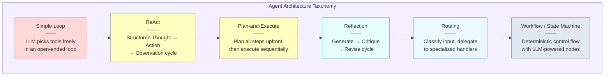

The arrows show increasing structure, not a hierarchy. You do not "graduate" from one to the next. Each architecture is a tool in your toolbox, suited to different problems. Let's preview each one.

## 4.1 1. Simple Loop

The **simple loop** is what we built in Modules 1 and 3. The agent receives a user message, passes it to the LLM along with available tools, executes whatever tool the LLM requests, feeds the result back, and repeats until the LLM produces a final response.

This architecture has zero imposed structure. The LLM has full autonomy over which tools to call, in what order, how many times, and when to stop. It is the easiest architecture to build -- you can implement one in twenty lines of code -- and for simple tasks, it works well.

**Best suited for:** Simple, well-defined tasks where the LLM is unlikely to get lost. Single-turn tool calls. Quick prototypes. Tasks where the order of operations does not matter much.

**Limitations:** No mechanism for planning ahead. No self-correction. No way to guarantee specific steps happen. Behavior varies between runs. Difficult to debug when things go wrong.

## 4.1 2. ReAct (Reasoning + Acting)

**ReAct** adds a single but powerful constraint to the simple loop: before every action, the agent must produce an explicit reasoning step. Instead of jumping straight from observation to tool call, the agent follows a strict Thought-Action-Observation cycle.

The model *thinks* about what it knows so far and what it should do next. Then it takes an *action* (calls a tool). Then it reads the *observation* (the tool's result). Then it thinks again. This interleaving of reasoning and acting means the agent's decision-making process is visible and traceable in the transcript.

**Best suited for:** Multi-step research and investigation. Tasks requiring adaptive reasoning -- where the next step depends on what you learned from the last one. Situations where you need an audit trail of the agent's thinking.

**Limitations:** Still reactive rather than proactive. The agent plans only one step ahead. Can still go in circles if it does not recognize it has already explored a path.

## 4.1 3. Plan-and-Execute

**Plan-and-Execute** inverts the simple loop's approach entirely. Instead of figuring out the next step one turn at a time, the agent first creates a complete plan -- a numbered list of steps to achieve the goal. Then it executes those steps one by one, tracking progress. If a step fails or reveals new information, the agent can replan.

This separation of planning and execution is powerful. The planning phase uses the LLM's full reasoning capacity to think about the problem holistically. The execution phase can be more mechanical, following the plan step by step.

**Best suited for:** Complex, multi-step tasks with clear goals. Tasks where you can anticipate the steps needed. Situations where you want to show the user a plan before executing it. Long-running tasks where progress tracking matters.

**Limitations:** The initial plan may be wrong or incomplete. Replanning adds latency. Overly rigid plans can prevent the agent from adapting to unexpected discoveries.

## 4.1 4. Reflection (Generate-Critique-Revise)

The **Reflection** architecture adds a quality-assurance loop. The agent generates an output, then critiques its own work, then revises based on that critique. This cycle can repeat multiple times until the output meets a quality threshold or a maximum iteration count.

Reflection can be implemented with a single LLM playing both roles (generator and critic), or with separate LLM calls with different system prompts -- one optimized for generation and one for harsh critique. The key insight is that LLMs are often better at evaluating work than producing it on the first try, so giving them a chance to self-correct dramatically improves output quality.

**Best suited for:** Tasks where output quality is critical -- writing, code generation, analysis. Situations where a first draft is easy but polishing is hard. Tasks with clear quality criteria that the critic can check against.

**Limitations:** Each critique-revise cycle costs additional LLM calls. The agent might over-revise, making things worse. Without clear quality criteria, the critic can be vague or unhelpful.

## 4.1 5. Routing (Classify and Delegate)

**Routing** is fundamentally different from the architectures above. Instead of one agent doing everything, a router agent classifies the incoming request and delegates it to the most appropriate specialized handler. Each handler might use a different architecture, different tools, or even a different model.

Think of it as a switchboard. A customer support system might route billing questions to a billing agent (with access to payment tools), technical issues to a troubleshooting agent (with access to diagnostic tools), and general questions to a knowledge-base agent (with access to documentation search).

**Best suited for:** Systems that handle diverse request types. Situations where different requests need different tools, models, or safety guardrails. Multi-domain applications. Cost optimization -- routing simple requests to smaller, cheaper models.

**Limitations:** The router itself can misclassify requests. Adding a new request type requires building a new handler. Handoff logic between agents can be complex.

## 4.1 6. Workflow / State Machine

The **Workflow** architecture provides the most structure. You define a directed graph of states and transitions, where each state represents a specific step in the process. Some states involve LLM calls (for reasoning, generation, or classification), while others are purely deterministic (data validation, API calls, conditional branching). The control flow follows the graph -- the LLM does not decide *what to do next*; the graph does.

This is the architecture closest to traditional software engineering. You get the full power of LLMs at the nodes that need intelligence, while keeping everything else predictable and testable.

**Best suited for:** Production systems with strict reliability requirements. Regulated domains (finance, healthcare) where you need auditability. Complex processes with well-defined steps. Situations where you need guaranteed execution of specific steps in a specific order.

**Limitations:** Requires more upfront design. Less flexible -- adding a new capability means redesigning the graph. Can be over-engineered for simple tasks.

## 4.1 The Autonomy-Control Spectrum

These architectures are not random alternatives. They fall along a spectrum from maximum LLM autonomy to maximum developer control:

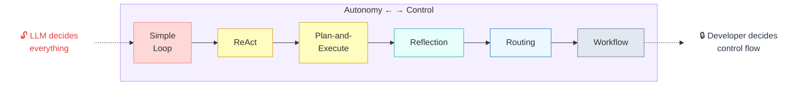

On the left, the simple loop gives the LLM full autonomy. Every decision -- what to do, when to do it, when to stop -- is made by the model. On the right, the workflow architecture gives the developer full control over the process, using the LLM only at specific nodes for specific tasks.

Neither end of the spectrum is inherently better. The right position depends on your problem:

- **High autonomy** works when the task is exploratory, the stakes are low, and you trust the model's judgment. Prototyping, brainstorming, open-ended research.
- **High control** works when the task is well-defined, the stakes are high, and you need predictable, auditable behavior. Production pipelines, regulated processes, customer-facing systems.
- **The middle ground** is where most real-world agents live. ReAct, Plan-and-Execute, and Reflection give you meaningful structure while still leveraging the LLM's ability to adapt and reason.

## 4.1 Combining Architectures

In practice, production agents rarely use a single architecture in isolation. They combine patterns. A workflow agent might use ReAct at one of its nodes. A routing agent might delegate to a Plan-and-Execute agent for complex requests and a simple loop for straightforward ones. A Plan-and-Execute agent might use reflection on its final output before delivering it.

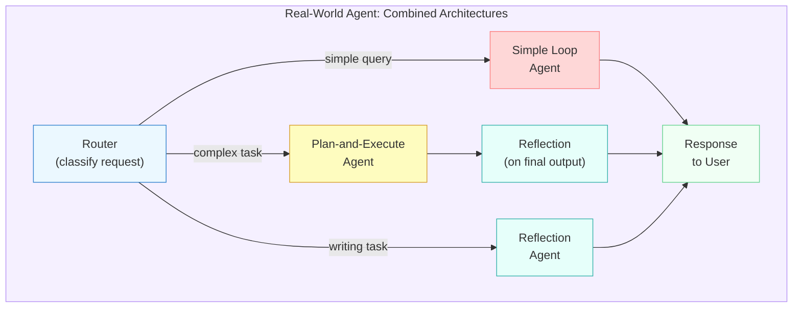

This is why understanding all six architectures matters even if you only use two or three directly. Knowing the full landscape lets you pick the right building blocks and compose them into a system that matches your problem's actual requirements.

## 4.1 What is Coming in This Module

This lesson is your map. The next six lessons are the territory:

- **Lesson 02: ReAct** -- We will implement the Thought-Action-Observation cycle from scratch and see how explicit reasoning traces transform debugging.
- **Lesson 03: Plan-and-Execute** -- We will build an agent that plans before acting, with support for dynamic replanning when things change.
- **Lesson 04: Self-Reflection** -- We will add a generate-critique-revise loop and see how self-evaluation can catch errors the first pass missed.
- **Lesson 05: Routing and Handoffs** -- We will build a router that classifies requests and delegates to specialized agents with different capabilities.
- **Lesson 06: Workflow Agents** -- We will construct a state machine agent with deterministic control flow and LLM-powered decision nodes.
- **Lesson 07: Choosing Architectures** -- We will build a decision framework for matching architectures to problems, drawing on everything from the module.

By the end of this module, you will not just know *what* these architectures are -- you will know *how* to build them and *when* to use each one.

## 4.1 Summary

Agent architecture is the structural pattern that governs how an agent decides what to do, in what order, and how it recovers from mistakes. Architecture matters because it determines your agent's reliability, predictability, and debuggability.

- The **simple loop** gives the LLM full autonomy -- easy to build, hard to control
- **ReAct** adds explicit reasoning before every action, creating traceable decision-making
- **Plan-and-Execute** separates thinking from doing, enabling holistic planning and progress tracking
- **Reflection** adds a critique-and-revise cycle, improving output quality through self-evaluation
- **Routing** classifies inputs and delegates to specialized handlers, enabling multi-domain systems
- **Workflow / State Machine** provides deterministic control flow with LLM-powered nodes, maximizing reliability
- These architectures fall along an **autonomy-control spectrum** -- the right choice depends on your task's complexity, stakes, and need for predictability
- Production agents typically **combine multiple architectures**, using routing to dispatch and different patterns at different stages

In the next lesson, we will take the first step off the map and into the details. **ReAct: Reasoning + Acting** introduces the most influential agent architecture in the field -- and shows why making the LLM think out loud changes everything.

---

    Section 4.2: ReAct: Reasoning + Acting


## 4.2 Overview

In the previous lesson, you surveyed the landscape of agent architectures and saw that they differ in how they organize reasoning and action. Now we dive into the most foundational pattern of all: **ReAct**.

Introduced by Yao et al. in their 2022 paper "ReAct: Synergizing Reasoning and Acting in Language Models," ReAct answered a deceptively simple question -- what happens if you force the LLM to *think out loud* before every tool call? The answer turned out to be transformative. By interleaving explicit **Thought**, **Action**, and **Observation** steps, ReAct produced agents that were more accurate, more interpretable, and more grounded than anything that came before.

If you built the calculator agent in Module 1 and studied Chain-of-Thought reasoning in Module 2, you already have the pieces. ReAct is what happens when you combine them: it formalizes CoT reasoning directly into the agent loop, making the model's step-by-step thinking a first-class part of every decision cycle.

## 4.2 The Core Insight: Think Before You Act

A basic tool-calling agent loop -- like the one from Module 3 -- works well for straightforward tasks. The LLM receives a question, decides which tool to call, gets a result, and continues. But for complex, multi-step tasks, that loop has a blind spot: the model's reasoning is implicit. You can see *what* it called, but not *why*. When things go wrong, debugging is guesswork.

ReAct fixes this by adding a single constraint: **the model must produce an explicit reasoning trace before every action**. Each iteration of the loop has three labeled phases:

- **Thought** -- the model reasons about what it knows so far, what it still needs, and what to do next
- **Action** -- the model selects a tool and provides arguments, informed by its Thought
- **Observation** -- the tool executes and the result is fed back to the model

This three-phase cycle repeats until the model decides it has enough information to produce a final answer.

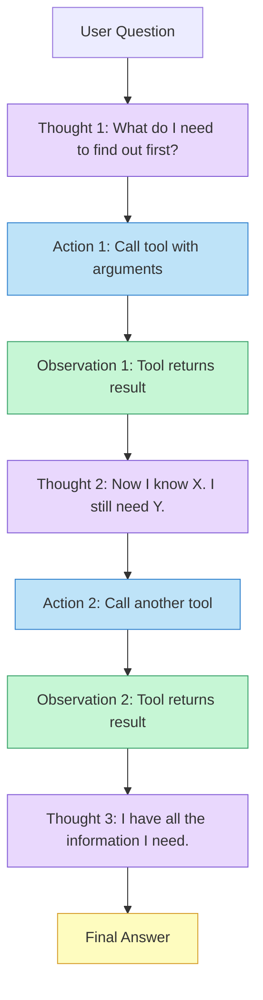

The purple nodes are the key difference. Without ReAct, those Thought steps either do not exist or are buried inside the model's hidden processing. With ReAct, they are visible, loggable, and debuggable.

## 4.2 A Complete ReAct Trace

Let's watch ReAct solve a concrete multi-step question: *"Who is the CEO of the company that developed the Python programming language, and when was that company founded?"*

This question requires two lookups -- first identifying the company, then finding its CEO and founding date. A simple loop might get the right answer, but with ReAct you can see the reasoning at every step.

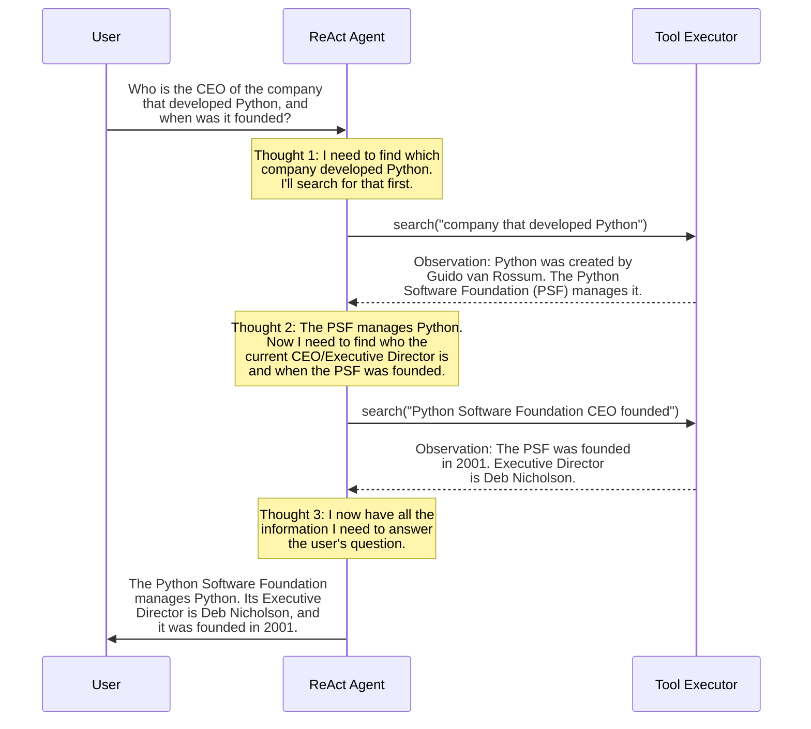

Notice the pattern: each Thought explicitly states what the agent knows and what it still needs. Each Action is directly motivated by the preceding Thought. Each Observation provides new information that feeds into the next Thought. The reasoning chain is fully transparent.

## 4.2 How ReAct Differs from the Simple Loop

You already built a tool-calling loop in Module 3. Here is how that loop and a ReAct loop compare side by side:

| Aspect | Simple Agent Loop | ReAct Agent Loop |
|--------|-------------------|------------------|
| **Reasoning** | Implicit -- hidden inside the model | Explicit -- Thought step before each Action |
| **Debuggability** | You see tool calls and results only | You see *why* each tool was called |
| **Grounding** | Model may hallucinate between calls | Each Thought references prior Observations |
| **Verbosity** | Minimal output per turn | More tokens per turn (reasoning costs tokens) |
| **Control flow** | LLM decides internally | LLM's decision process is visible and loggable |

The simple loop from Module 3 cycles on `stop_reason` -- it runs tools whenever the LLM requests them and stops when the LLM says `end_turn`. That works, but you are trusting the model to reason correctly in its hidden state. ReAct externalizes that reasoning, which means you can log it, inspect it when things go wrong, and even use it for evaluation.

## 4.2 Implementing a ReAct Agent

The implementation strategy is straightforward: use the **system prompt** to force the model into the Thought/Action/Observation format, then **parse** the model's output to extract the action. There are two common approaches:

1. **Text-based parsing** -- the model outputs structured text that you parse with string matching or regex
2. **Hybrid approach** -- the model outputs a Thought as text, then uses native tool calling for the Action

We will implement the hybrid approach because it leverages the structured tool-calling you already learned in Module 3 while adding the explicit reasoning trace that makes ReAct powerful.

**react_agent.py**

```python
import anthropic
import json

client = anthropic.Anthropic()

# --- Tool definitions ---

tools = [
    {
        "name": "search",
        "description": "Search for information on a topic. Returns relevant text snippets.",
        "input_schema": {
            "type": "object",
            "properties": {
                "query": {
                    "type": "string",
                    "description": "The search query"
                }
            },
            "required": ["query"]
        }
    },
    {
        "name": "lookup",
        "description": "Look up a specific fact about an entity (person, company, place).",
        "input_schema": {
            "type": "object",
            "properties": {
                "entity": {
                    "type": "string",
                    "description": "The entity to look up"
                },
                "attribute": {
                    "type": "string",
                    "description": "The specific attribute to find, e.g. 'founding_date', 'ceo', 'population'"
                }
            },
            "required": ["entity", "attribute"]
        }
    }
]

# --- Simulated tool implementations ---

def search(query: str) -> str:
    """Simulate a search tool."""
    responses = {
        "company that developed Python": "Python was created by Guido van Rossum in 1991. "
            "The Python Software Foundation (PSF) manages its development.",
        "Python Software Foundation": "The PSF is a non-profit founded in 2001. "
            "It manages the open-source licensing for Python.",
    }
    for key, value in responses.items():
        if key.lower() in query.lower():
            return value
    return f"No results found for: {query}"

def lookup(entity: str, attribute: str) -> str:
    """Simulate a fact lookup tool."""
    facts = {
        ("Python Software Foundation", "executive_director"): "Deb Nicholson",
        ("Python Software Foundation", "founded"): "2001",
    }
    return facts.get((entity, attribute), f"Unknown: {entity}.{attribute}")

tool_functions = {
    "search": lambda **kwargs: search(**kwargs),
    "lookup": lambda **kwargs: lookup(**kwargs),
}
```

The key ingredient is the system prompt. It instructs the model to always produce a Thought before calling any tool:

**react_system_prompt.py**

```python
REACT_SYSTEM_PROMPT = """You are a research assistant that answers questions by searching for information.

You MUST follow the ReAct pattern for every step:

1. THOUGHT: Before taking any action, write a "Thought:" section where you:
   - State what you currently know
   - Identify what you still need to find out
   - Explain which tool you will use and why

2. ACTION: Then call the appropriate tool.

3. After receiving the tool result (the Observation), write another Thought
   before your next action.

When you have enough information to answer the question fully, write a final
Thought explaining that you have all the information, then provide your answer.

Always ground your reasoning in the Observations you receive. Never guess at
facts you have not verified through a tool call."""
```

Now the agent loop. It is similar to the Module 3 loop, but we log each Thought and Observation to create a visible trace:

**react_loop.py**

```python
def run_react_agent(question: str) -> str:
    """Run a ReAct agent that interleaves Thought, Action, and Observation."""
    messages = [{"role": "user", "content": question}]
    step = 1

    while True:
        response = client.messages.create(
            model="claude-sonnet-4-6",
            max_tokens=2048,
            system=REACT_SYSTEM_PROMPT,
            tools=tools,
            messages=messages,
        )

        # --- Log the Thought (text blocks) and Action (tool_use blocks) ---
        for block in response.content:
            if block.type == "text":
                print(f"\\n--- Step {step}: Thought ---")
                print(block.text)
            elif block.type == "tool_use":
                print(f"\\n--- Step {step}: Action ---")
                print(f"  Tool: {block.name}")
                print(f"  Input: {json.dumps(block.input, indent=2)}")

        # --- If the model is done, return the final answer ---
        if response.stop_reason == "end_turn":
            return "\\n".join(
                block.text for block in response.content if block.type == "text"
            )

        # --- Execute tools and log Observations ---
        messages.append({"role": "assistant", "content": response.content})

        tool_results = []
        for block in response.content:
            if block.type == "tool_use":
                result = tool_functions[block.name](**block.input)
                result_str = result if isinstance(result, str) else json.dumps(result)
                print(f"\\n--- Step {step}: Observation ---")
                print(f"  {result_str}")
                tool_results.append({
                    "type": "tool_result",
                    "tool_use_id": block.id,
                    "content": result_str,
                })

        messages.append({"role": "user", "content": tool_results})
        step += 1


# --- Run it ---
answer = run_react_agent(
    "Who is the executive director of the organization that manages Python, "
    "and when was it founded?"
)
print(f"\\n=== Final Answer ===\\n{answer}")
```

When you run this, the output looks something like:

```
--- Step 1: Thought ---
Thought: I need to find which organization manages Python. Let me search for that.

--- Step 1: Action ---
  Tool: search
  Input: {"query": "company that developed Python"}

--- Step 1: Observation ---
  Python was created by Guido van Rossum in 1991. The Python Software Foundation (PSF) manages its development.

--- Step 2: Thought ---
Thought: Now I know the Python Software Foundation manages Python. I need two more facts: the executive director and when the PSF was founded. Let me look those up.

--- Step 2: Action ---
  Tool: lookup
  Input: {"entity": "Python Software Foundation", "attribute": "executive_director"}

--- Step 2: Observation ---
  Deb Nicholson

...

=== Final Answer ===
The Python Software Foundation manages Python. Its Executive Director is Deb Nicholson, and it was founded in 2001.
```

Every decision the agent makes is visible. If it takes a wrong turn, you can see exactly which Thought led it astray.

## 4.2 Why the Reasoning Trace Matters

The explicit Thought step is not just for developer convenience -- it materially improves the agent's behavior. There are three reasons:

**Interpretability.** When an agent produces a wrong answer, the Thought trace tells you *where* the reasoning broke down. Was it a bad search query? A misinterpretation of the Observation? A premature conclusion? Without the trace, you are left guessing.

**Grounding.** Each Thought references the preceding Observation, which forces the model to integrate real data into its reasoning. This reduces hallucination because the model cannot silently invent facts -- it must reason from evidence you can inspect.

**Debuggability.** You can log the full Thought/Action/Observation trace and review it later. In production systems, these traces become your primary debugging tool. You can search traces for patterns, identify common failure modes, and build evaluation datasets from them.

> If you recall from Module 2, Chain-of-Thought prompting improved accuracy by making the model show its work. ReAct takes that same principle and embeds it into the agent loop. CoT gives you better reasoning in a single prompt; ReAct gives you better reasoning across a multi-step task with real tools.

## 4.2 Strengths and Weaknesses

ReAct is powerful, but it is not the right architecture for every problem. Understanding its trade-offs will help you decide when to use it and when to reach for something else.

### Strengths

- **Interpretable** -- every decision is justified by a visible Thought
- **Debuggable** -- the full trace can be logged, searched, and replayed
- **Grounded** -- reasoning is anchored in real Observations, not hallucinated context
- **Simple to implement** -- it is a system prompt plus the same agent loop you already know
- **Flexible** -- works with any set of tools, no specialized infrastructure required

### Weaknesses

- **Verbose** -- the Thought steps consume additional tokens on every iteration, increasing cost and latency
- **No upfront planning** -- ReAct reasons one step at a time; it cannot look ahead to plan a multi-step strategy before starting execution
- **Repetitive loops** -- the model can get stuck repeating the same Thought/Action cycle when it does not find what it expects, sometimes looping indefinitely without making progress
- **Token window pressure** -- as the trace grows, older Thoughts and Observations push against the context window limit, and the model may lose track of earlier reasoning

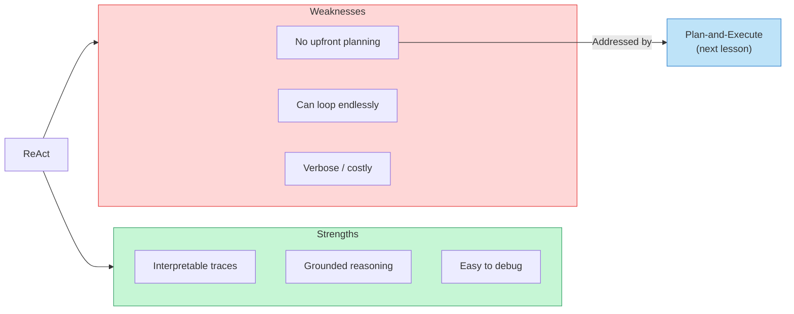

## 4.2 When to Use ReAct

ReAct is an excellent default choice for agents that need to answer questions by gathering information from tools. It shines in scenarios like:

- **Research and question answering** -- where the agent needs to search, verify, and synthesize
- **Debugging and troubleshooting** -- where you need a transparent reasoning trail
- **Prototyping** -- when you want a working agent fast and plan to optimize later
- **Any task where interpretability matters more than efficiency**

It is less suited for tasks that require long-horizon planning (20+ steps), deterministic workflows, or minimal token usage. For those, the architectures in upcoming lessons will serve you better.

## 4.2 Summary

**ReAct** is the foundational agent architecture that interleaves Thought, Action, and Observation in an explicit loop. Its key insight is simple but powerful: by forcing the LLM to reason out loud before every tool call, you get agents that are interpretable, debuggable, and grounded in real evidence.

The pattern builds directly on two ideas you have already learned:

- **Chain-of-Thought reasoning** from Module 2 -- ReAct formalizes CoT into the agent loop, making the model's step-by-step thinking a required part of each iteration rather than an optional prompting technique
- **The tool-calling lifecycle** from Module 3 -- ReAct uses the same tool definitions, `tool_use`/`tool_result` exchange, and agent loop structure, adding only the Thought constraint on top

ReAct's main limitation is that it reasons one step at a time. It does not plan ahead -- each Thought only considers the current state, not a strategy for reaching the goal. This works well for short tasks but can lead to inefficiency or loops on complex problems.

> In the next lesson, **Plan-and-Execute** addresses this weakness directly. Instead of reasoning one step at a time, a Plan-and-Execute agent creates an explicit plan upfront, then executes each step while dynamically revising the plan as new information arrives. This gives agents the strategic foresight that ReAct lacks.

---

    Section 4.3: Plan-and-Execute Agents


## 4.3 Overview

In the previous lesson, we explored **ReAct** -- an architecture where the agent interleaves reasoning and action one step at a time. ReAct is powerful and interpretable, but it has a blind spot: it never stops to think about the big picture. Each cycle of thought-action-observation decides only the *next* move, without considering how that move fits into a broader strategy. For simple tasks, that is fine. For complex, multi-step tasks -- writing a research report, planning a trip, migrating a codebase -- the lack of upfront planning can lead to wasted steps, missed dependencies, and meandering execution.

**Plan-and-Execute** is an agent architecture that fixes this by splitting the work into two distinct phases. First, a **planner** analyzes the full task and produces an ordered list of steps. Then, an **executor** works through those steps one at a time, using tools and reasoning to complete each one. If something unexpected happens along the way, the agent can **replan** -- updating the remaining steps based on new information.

This separation of planning from execution mirrors how humans tackle complex projects. You do not write a research paper by randomly searching for facts. You outline the sections first, then fill each one in. Plan-and-Execute agents do the same thing.

## 4.3 The Two-Phase Architecture

The core idea is a clean separation of concerns. The planner thinks strategically -- it looks at the entire task and breaks it into manageable steps. The executor thinks tactically -- it focuses on completing one step well before moving to the next.

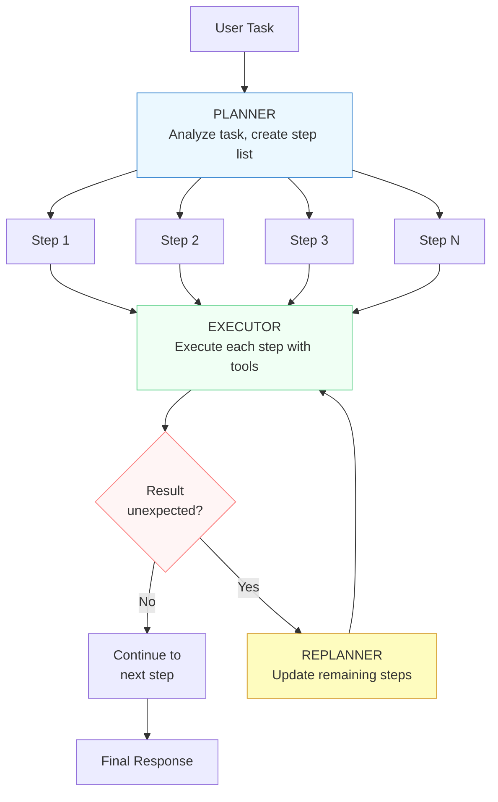

Notice the three distinct components. The **planner** (blue) runs once at the beginning to create the step list. The **executor** (green) runs in a loop, completing one step at a time. The **replanner** (yellow) activates only when something unexpected happens -- a step fails, reveals new information, or makes the remaining plan obsolete. The decision point (red) is the critical junction where the agent decides whether to continue with the current plan or adapt.

## 4.3 Plan-and-Execute in Motion

Let's trace through a concrete example. Imagine a user asks: "Compare the pricing and features of AWS Lambda, Google Cloud Functions, and Azure Functions for a startup running 1 million invocations per month."

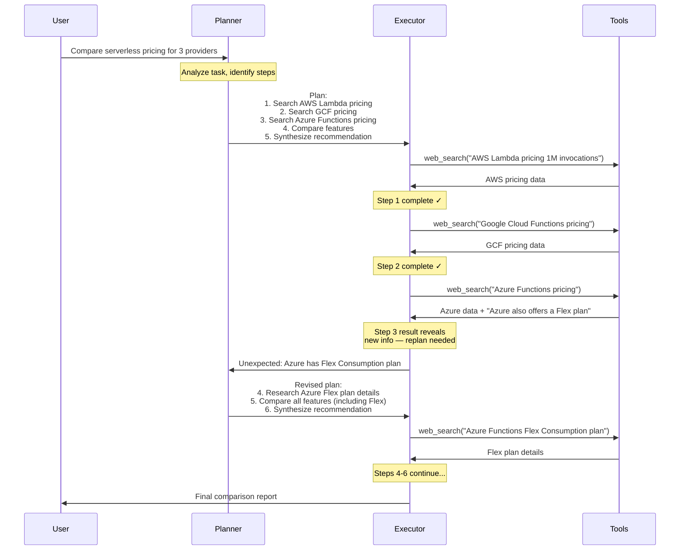

This sequence shows the full lifecycle. The planner creates a five-step plan upfront. The executor works through steps 1 through 3 without issues. But step 3 reveals something the planner did not anticipate -- Azure has a new Flex Consumption plan that changes the comparison. Rather than ignoring this or blindly continuing, the agent replans: it inserts a new research step and adjusts the remaining steps accordingly. The final output is more thorough because the agent adapted.

## 4.3 How It Compares to ReAct

The difference between ReAct and Plan-and-Execute is the difference between navigating turn-by-turn and studying the map first.

**ReAct** decides one action at a time. After each observation, it thinks about what to do *next* -- but only next. It has no explicit representation of the full task or how far along it is. This makes it excellent for tasks where the path forward is unclear or changes rapidly, but it can lead to inefficient execution on structured problems.

**Plan-and-Execute** creates a complete plan before taking any action. It knows how many steps remain, what depends on what, and where the goal is. This makes it excellent for complex, multi-step tasks where coordination matters, but it adds overhead for simple tasks that do not need a plan.

| Aspect | ReAct | Plan-and-Execute |
|--------|-------|-----------------|
| Planning | None -- decides action-by-action | Explicit upfront plan |
| Visibility | Sees only the current step | Sees the full task structure |
| Adaptability | Naturally flexible (no plan to break) | Requires explicit replanning |
| Efficiency on complex tasks | Can meander or repeat work | Structured, avoids redundancy |
| Overhead | Low -- just think and act | Higher -- planning takes time and tokens |
| Progress tracking | Difficult -- no step list | Easy -- check off completed steps |

> **Key insight:** ReAct and Plan-and-Execute are not competitors -- they are tools for different situations. ReAct excels at exploratory, open-ended tasks. Plan-and-Execute excels at structured, multi-step tasks where you can anticipate the steps. Many real-world agents combine both: Plan-and-Execute at the top level, with ReAct inside the executor for individual steps.

## 4.3 Implementing a Plan-and-Execute Agent

Let's build a Plan-and-Execute agent from scratch. The implementation has three core components: a planner that generates a step list, an executor that carries out each step, and a replanning check that decides whether the plan needs updating.

**plan_and_execute_agent.py**

```python
import json
from anthropic import Anthropic

client = Anthropic()

PLANNER_SYSTEM = """You are a planning agent. Given a user task, break it down
into a numbered list of concrete steps. Each step should be a single, actionable
item that can be executed independently.

Output your plan as a JSON array of strings. Example:
["Search for X", "Analyze the results of X", "Compare X with Y", "Write summary"]

Rules:
- Each step should be specific and actionable
- Steps should be in logical order
- Include 3-8 steps (no more, no less)
- Do not include meta-steps like "start" or "finish"
"""

EXECUTOR_SYSTEM = """You are an execution agent. You receive a single step to
complete and the results of any previous steps. Execute the current step
thoroughly and report your findings.

You have access to tools. Use them when the step requires external information.
Report what you found and whether anything unexpected came up.
"""

REPLANNER_SYSTEM = """You are a replanning agent. You receive:
1. The original task
2. Steps completed so far with their results
3. The remaining steps in the current plan
4. What unexpected information was discovered

Decide whether the remaining steps need to change. If yes, output a revised
list of remaining steps as a JSON array. If no, output the original remaining
steps unchanged. Always output a JSON array of strings.
"""

def create_plan(task: str) -> list[str]:
    """Phase 1: Generate a step-by-step plan for the task."""
    response = client.messages.create(
        model="claude-sonnet-4-20250514",
        max_tokens=1024,
        system=PLANNER_SYSTEM,
        messages=[{"role": "user", "content": task}],
    )
    return json.loads(response.content[0].text)


def execute_step(step: str, context: list[dict]) -> dict:
    """Phase 2: Execute a single step with context from prior steps."""
    context_str = ""
    if context:
        context_str = "Previous step results:\\n"
        for c in context:
            context_str += f"- {c['step']}: {c['result']}\\n"

    prompt = f"{context_str}\\nNow execute this step: {step}"
    response = client.messages.create(
        model="claude-sonnet-4-20250514",
        max_tokens=2048,
        system=EXECUTOR_SYSTEM,
        messages=[{"role": "user", "content": prompt}],
    )
    return {
        "step": step,
        "result": response.content[0].text,
    }


def check_replan(task: str, completed: list[dict],
                 remaining: list[str], unexpected: str) -> list[str]:
    """Decide whether to replan and return updated remaining steps."""
    prompt = f"""Original task: {task}

Completed steps:
{json.dumps([c['step'] for c in completed], indent=2)}

Remaining steps:
{json.dumps(remaining, indent=2)}

Unexpected information: {unexpected}

Should the remaining steps change? Output the remaining steps as a JSON array.
"""
    response = client.messages.create(
        model="claude-sonnet-4-20250514",
        max_tokens=1024,
        system=REPLANNER_SYSTEM,
        messages=[{"role": "user", "content": prompt}],
    )
    return json.loads(response.content[0].text)


def plan_and_execute(task: str) -> str:
    """Full Plan-and-Execute loop."""
    # Phase 1: Plan
    print("📋 Planning...")
    steps = create_plan(task)
    print(f"Plan created with {len(steps)} steps:")
    for i, step in enumerate(steps, 1):
        print(f"  {i}. {step}")

    # Phase 2: Execute
    completed = []
    remaining = steps.copy()

    while remaining:
        current_step = remaining.pop(0)
        step_num = len(completed) + 1
        print(f"\\n⚡ Executing step {step_num}: {current_step}")

        result = execute_step(current_step, completed)
        completed.append(result)

        # Check for unexpected findings that might require replanning
        if remaining and "unexpected" in result["result"].lower():
            print("🔄 Unexpected findings detected — replanning...")
            remaining = check_replan(
                task, completed, remaining, result["result"]
            )
            print("Updated remaining steps:")
            for i, step in enumerate(remaining, step_num + 1):
                print(f"  {i}. {step}")

    # Phase 3: Synthesize
    print("\\n✅ All steps complete. Synthesizing response...")
    synthesis_prompt = f"""Task: {task}

Step results:
{json.dumps([{"step": c["step"], "result": c["result"]} for c in completed], indent=2)}

Synthesize a comprehensive final response from all step results.
"""
    response = client.messages.create(
        model="claude-sonnet-4-20250514",
        max_tokens=4096,
        messages=[{"role": "user", "content": synthesis_prompt}],
    )
    return response.content[0].text


# Run it
result = plan_and_execute(
    "Compare the pros and cons of PostgreSQL vs MongoDB "
    "for a real-time analytics dashboard that ingests 10K events/second"
)
print(result)
```

Let's walk through the key design decisions in this implementation:

**Separate system prompts for each role.** The planner, executor, and replanner each get a focused system prompt that defines their specific job. This prevents role confusion -- the planner never tries to execute, and the executor never tries to replan. This separation is the architectural backbone of Plan-and-Execute.

**Context accumulation.** The `completed` list acts as the agent's working memory. Each executor call receives the results of all previous steps, so later steps can build on earlier findings. This is how step 4 ("Compare features") can reference the data gathered in steps 1 through 3.

**Lightweight replanning trigger.** The code checks for the word "unexpected" in the executor's output as a simple heuristic. In a production system, you would use a more sophisticated check -- perhaps a dedicated LLM call that evaluates whether the result deviates from expectations. The key principle is that replanning should not happen on every step (too expensive) but should trigger when the plan is clearly stale.

## 4.3 Dynamic Replanning

**Replanning** is what separates a good Plan-and-Execute agent from a rigid script. Without it, you just have a to-do list runner that blindly follows steps even when they no longer make sense.

There are three common triggers for replanning:

**Step failure.** A tool call fails, an API returns an error, or a search yields no results. The remaining steps that depended on that result need to be adjusted. For example, if a web search for pricing data returns nothing, the agent might replan to try a different search query or consult an alternative source.

**New information.** A step reveals something the planner could not have anticipated. In our serverless comparison example, discovering Azure's Flex plan changed the scope of the comparison. The agent needs to incorporate this new information into remaining steps.

**Goal refinement.** As the agent works through the task, it may realize the user's goal is different from what the planner assumed. For instance, a step might reveal that the user's "real-time analytics" requirement rules out one of the databases entirely, simplifying the remaining comparison.

> **Connection to Module 2:** Replanning benefits enormously from **reasoning models** (lesson 05 in Module 2). Extended thinking allows the replanner to carefully evaluate what changed, why the current plan is insufficient, and what the revised plan should look like. A quick, shallow replan might miss subtle dependencies between steps. A reasoning model that thinks through the implications produces better revised plans.

## 4.3 Strengths and Weaknesses

**Strengths of Plan-and-Execute:**

- **Predictable structure.** You can see the full plan before any execution starts. This makes it easy to estimate how long a task will take, what resources it will need, and where it might fail.
- **Progress tracking.** At any point, you know exactly which steps are done and which remain. This is invaluable for long-running tasks and for showing progress to users.
- **Better for complex tasks.** Tasks with dependencies between steps benefit from upfront planning. The planner can identify that step 4 depends on steps 1-3 and order them correctly, while ReAct might discover this dependency only after starting step 4.
- **Easier to debug.** When something goes wrong, you can inspect the plan, see which step failed, and understand the intended flow. Debugging a ReAct trace requires following the full thought-action-observation chain.
- **Cost-efficient for structured work.** The planner runs once, creating an efficient roadmap. ReAct's per-step reasoning can accumulate significant token costs over many cycles.

**Weaknesses of Plan-and-Execute:**

- **Planning overhead.** The initial planning step costs time and tokens, even for tasks that turn out to be simple. A one-step task does not need a planner.
- **Plan staleness.** The longer the plan, the more likely that later steps become irrelevant or wrong by the time the agent reaches them. Replanning helps but adds its own cost.
- **Harder to implement.** Three components (planner, executor, replanner) are more complex than ReAct's single loop. Each needs its own prompt, and the handoffs between them must be carefully managed.
- **Rigid when exploration is needed.** Some tasks require open-ended exploration where the next step depends entirely on what you just found. A plan constrains this exploration -- the agent may follow the plan instead of pursuing a promising unexpected lead.

## 4.3 When to Use Plan-and-Execute

Plan-and-Execute is the right choice when:

- The task has **multiple distinct steps** that need to happen in order
- You need **progress visibility** -- users or systems need to know how far along the agent is
- The task is **well-defined enough** to plan upfront, even if details may change
- Steps have **dependencies** -- later steps need results from earlier ones
- **Cost matters** -- avoiding redundant work saves tokens and API calls

Stick with ReAct when:

- The task is **simple** or **single-step** -- planning overhead is not worth it
- The task is **highly exploratory** -- you cannot predict the steps in advance
- **Speed matters more than structure** -- ReAct's immediate action beats planning delay
- The environment is **rapidly changing** -- plans go stale faster than they can be created

## 4.3 Summary

**Plan-and-Execute** agents separate thinking from doing. The planner creates a structured roadmap, the executor follows it step by step, and the replanner adapts when reality diverges from the plan. Here are the key ideas from this lesson:

- Plan-and-Execute splits agent behavior into **two distinct phases**: planning (create a step list) and execution (complete each step), unlike ReAct which interleaves reasoning and action in a single loop
- The **planner** analyzes the full task and outputs an ordered list of steps; the **executor** carries out each step with access to tools and the results of prior steps
- **Dynamic replanning** is triggered when a step fails, reveals new information, or changes the scope of the task -- it updates remaining steps without restarting from scratch
- Plan-and-Execute excels at **complex, multi-step tasks** with dependencies and benefits from **progress tracking** and **predictability**, but adds **planning overhead** that is wasteful for simple tasks
- The pattern maps naturally to **reasoning models** from Module 2 -- extended thinking in the planner produces higher-quality plans with better step decomposition

In the next lesson, **Self-Reflection and Critique** adds a quality check after execution. Instead of returning the first answer, a self-reflecting agent evaluates its own output, identifies weaknesses, and iterates until the response meets a quality bar -- adding a feedback loop that Plan-and-Execute does not have on its own.

---

    Section 4.4: Self-Reflection and Critique


## 4.4 Overview

In the previous lessons, we explored ReAct's interleaved reasoning-and-acting loop and Plan-and-Execute's upfront planning approach. Both architectures produce output in a forward pass -- the agent generates a response and delivers it. But what if the first attempt is not good enough? Humans rarely submit a first draft without reviewing it. We re-read our emails, double-check our code, and revise our arguments. Why should agents be any different?

**Self-reflection** adds a **critique step** to the agent loop: after generating an output, the agent evaluates its own work, identifies weaknesses, and revises before returning the final result. This generate-evaluate-revise cycle transforms a single-pass system into one that iteratively improves its own output.

The insight is simple but powerful: LLMs are often better at *judging* quality than *producing* quality on the first try. A model that writes mediocre code might still recognize that the code has a bug when asked to review it. Self-reflection exploits this asymmetry -- using the model's critical abilities to compensate for its generative limitations.

## 4.4 The Generate-Critique-Revise Loop

At its core, self-reflection follows a three-phase cycle. The agent generates a candidate output, a critic evaluates it against quality criteria, and if the output does not pass, the agent revises using the critique as guidance. This loop repeats until the output meets the acceptance threshold or a maximum number of iterations is reached.

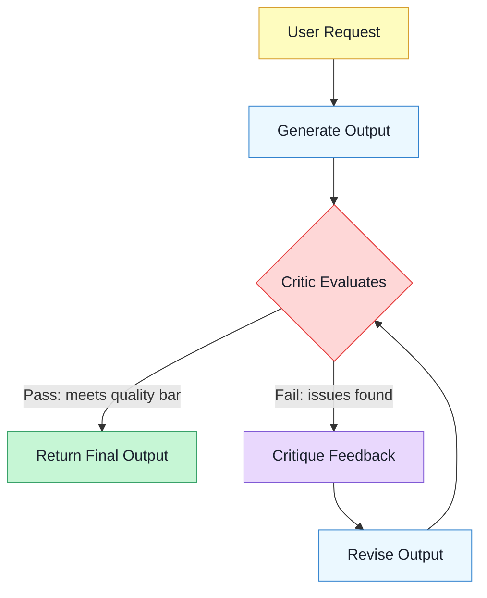

The key design decisions in this loop are: *What criteria does the critic use?* *How many iterations are allowed?* *What constitutes a "pass"?* These choices determine whether self-reflection adds genuine value or merely burns tokens.

## 4.4 The Reflexion Pattern

The most influential formalization of self-reflection is the **Reflexion** pattern, introduced by Shinn et al. in 2023. Reflexion goes beyond simple "try again" retries by introducing **verbal reinforcement** -- the agent produces a natural language reflection on *why* its attempt failed, and this reflection is carried forward as context for the next attempt.

The key insight of Reflexion is that natural language feedback is a richer signal than a binary pass/fail. When an agent reflects "I failed because I forgot to handle the edge case where the list is empty," that specific self-diagnosis helps it avoid the same mistake on the next attempt. This is analogous to how humans learn from mistakes -- not just knowing *that* something went wrong, but understanding *why*.

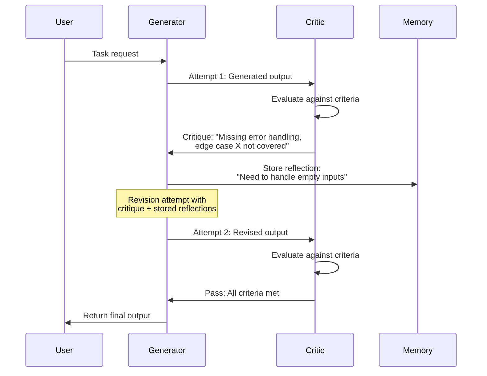

Notice the **Memory** participant in the diagram. In the full Reflexion pattern, reflections accumulate across attempts, giving the agent an evolving understanding of its own failure modes. This is what distinguishes Reflexion from naive retry loops -- the agent does not just try again blindly; it tries again *with knowledge of what went wrong*.

> **Connection to Module 10:** Self-reflection is essentially a built-in **LLM-as-judge** (a concept you will explore in depth in Module 10, Evaluation). The difference is that in evaluation, the judge scores a finished output after the fact. In self-reflection, the judge operates *inside* the agent loop, catching problems before the user ever sees them.

## 4.4 Two Approaches: Same-Model vs. Separate Critic

There are two fundamental ways to implement the critic in a self-reflection system, and the choice has significant implications for quality, cost, and reliability.

### Same-Model Reflection

In **same-model reflection**, a single LLM plays both roles -- generator and critic -- using different prompts. The generator prompt produces the output, and a separate critic prompt evaluates it. This is the simplest approach and requires no additional model infrastructure.

The advantage is simplicity and coherence: the same model that generated the output understands the reasoning behind it and can assess it in context. The disadvantage is the **blind-spot problem** -- a model that makes a reasoning error during generation may repeat the same error during critique, because both calls share the same underlying knowledge and biases. If the model believes an incorrect fact, it will not catch the error by reflecting on it.

### Separate Critic

In a **separate critic** setup, a different LLM (or the same model with a fundamentally different prompt and temperature) evaluates the generator's output. This could be a stronger model reviewing a weaker model's work, a specialized fine-tuned model focused on quality assessment, or even a code execution environment that tests generated code.

The advantage is independence: the critic brings a different "perspective" and is less likely to share the generator's blind spots. The disadvantage is increased complexity and cost -- you are running two models instead of one, and the critic must understand the task well enough to evaluate the output without having generated it.

| Approach | Pros | Cons | Best For |
|----------|------|------|----------|
| Same-model | Simple, coherent, one model to manage | Shared blind spots, may repeat errors | Writing, reasoning, first-pass review |
| Separate critic | Independent perspective, catches more errors | More complex, higher cost, needs coordination | Code generation, high-stakes tasks |

## 4.4 Implementing a Self-Reflecting Agent

Let's build a self-reflecting agent that generates code and then critiques its own output before returning it to the user. The agent uses same-model reflection with distinct generator and critic prompts:

**self_reflecting_agent.py**

```python
import anthropic
import json

client = anthropic.Anthropic()
MODEL = "claude-sonnet-4-20250514"
MAX_REVISIONS = 3

GENERATOR_PROMPT = """You are a Python code generator. Given a task description,
write clean, correct, well-documented Python code that solves the task.

If you are given feedback from a previous attempt, use it to fix the
issues identified. Do not repeat the same mistakes.

Return ONLY the Python code, no explanations outside the code."""

CRITIC_PROMPT = """You are a senior code reviewer. Evaluate the following Python
code for correctness, edge cases, and code quality.

Respond in JSON format:
{
  "passed": true/false,
  "issues": ["list of specific issues found"],
  "suggestions": ["list of improvement suggestions"]
}

Be strict. Check for:
- Off-by-one errors
- Missing edge case handling (empty inputs, None values)
- Incorrect logic or algorithms
- Missing type hints or docstrings
- Potential runtime errors

If the code is correct and handles edge cases well, set passed to true."""

def generate(task: str, feedback: str = "") -> str:
    """Generate or revise code for the given task."""
    messages = [{"role": "user", "content": f"Task: {task}"}]
    if feedback:
        messages.append({
            "role": "assistant",
            "content": "I'll revise the code based on your feedback."
        })
        messages.append({
            "role": "user",
            "content": f"Previous feedback:\\n{feedback}\\n\\nPlease fix these issues."
        })

    response = client.messages.create(
        model=MODEL,
        max_tokens=2048,
        system=GENERATOR_PROMPT,
        messages=messages,
    )
    return response.content[0].text

def critique(code: str, task: str) -> dict:
    """Evaluate generated code and return structured feedback."""
    response = client.messages.create(
        model=MODEL,
        max_tokens=1024,
        system=CRITIC_PROMPT,
        messages=[{
            "role": "user",
            "content": f"Task: {task}\\n\\nCode to review:\\n\`\`\`python\\n{code}\\n\`\`\`"
        }],
    )
    return json.loads(response.content[0].text)

def self_reflecting_agent(task: str) -> str:
    """Generate code with self-reflection and iterative revision."""
    print(f"Task: {task}\\n")

    code = generate(task)
    print(f"--- Attempt 1 ---\\n{code}\\n")

    for attempt in range(2, MAX_REVISIONS + 2):
        review = critique(code, task)
        print(f"--- Critique (Attempt {attempt - 1}) ---")
        print(f"  Passed: {review['passed']}")
        for issue in review.get("issues", []):
            print(f"  Issue: {issue}")

        if review["passed"]:
            print(f"\\nCode accepted after {attempt - 1} attempt(s).")
            return code

        # Build feedback string from issues and suggestions
        feedback = "Issues found:\\n"
        feedback += "\\n".join(f"- {i}" for i in review["issues"])
        if review.get("suggestions"):
            feedback += "\\nSuggestions:\\n"
            feedback += "\\n".join(f"- {s}" for s in review["suggestions"])

        code = generate(task, feedback)
        print(f"\\n--- Attempt {attempt} ---\\n{code}\\n")

    print(f"\\nMax revisions reached. Returning best attempt.")
    return code


# --- Run it ---
result = self_reflecting_agent(
    "Write a function that finds the longest palindromic substring "
    "in a given string. Handle edge cases like empty strings and "
    "single characters."
)
```

There are several design choices worth noting in this implementation. The **critic returns structured JSON**, making it easy to programmatically check the `passed` field and iterate over specific issues. The **feedback accumulates** -- each revision attempt receives the full list of issues from the previous critique. And the **MAX_REVISIONS cap** prevents infinite loops when the model cannot satisfy its own critic.

## 4.4 When Self-Reflection Helps

Self-reflection is not universally beneficial. It shines in specific categories of tasks and can actually hurt performance in others.

### Where Reflection Adds Value

**Code generation** is the strongest use case. Generated code can be logically analyzed for bugs, edge cases, and style issues. The critic can check for specific patterns (error handling, input validation) that the generator might overlook in its first pass. Even better, if you have a test suite, you can use actual test execution as an objective critic rather than relying on LLM judgment.

**Writing and content creation** benefits significantly from revision. First drafts often have structural problems, unclear arguments, or inconsistent tone. A critic prompt that checks for clarity, coherence, and completeness can guide meaningful revisions.

**Complex reasoning** with multiple steps improves when the agent reviews its own chain of thought. The critic can verify that each step follows logically from the previous one, catching errors that compound through a long reasoning chain -- the same principle behind Chain-of-Thought verification from Module 2.

### Where Reflection Hurts

**Simple factual lookups** gain nothing from self-reflection. If the model does not know the answer to "What is the capital of Burkina Faso?", reflecting on its own answer will not help -- it will either confirm the correct answer it already knew or double down on a hallucination. Self-reflection cannot fix knowledge gaps; it can only improve *reasoning* about knowledge the model already has.

**Low-complexity tasks** suffer from unnecessary overhead. If the task is "convert this temperature from Celsius to Fahrenheit," the reflection loop adds latency and cost with no quality improvement. The first-pass answer is almost always correct for simple, well-defined operations.

**Time-sensitive requests** are a poor fit because each reflection iteration adds a full LLM round trip. For a real-time chatbot, adding 2-3 extra LLM calls per response may make latency unacceptable, even if quality improves.

> **Looking ahead:** In the next lesson on **Routing and Handoffs**, you will learn how to classify incoming requests by complexity and route them accordingly. This lets you apply self-reflection selectively -- complex code generation tasks go through the reflection loop, while simple questions get a direct response. Routing is what makes reflection practical in production systems.

## 4.4 Controlling Reflection Depth

A critical design parameter is **how many revision iterations to allow**. Too few, and you miss fixable issues. Too many, and the agent oscillates -- fixing one issue while introducing another, or the critic becomes increasingly nitpicky about stylistic preferences rather than genuine problems.

In practice, most of the value comes from the **first revision**. Research on Reflexion and similar patterns shows diminishing returns after 2-3 iterations. A reasonable default is:

- **Max 3 iterations** for code generation (test-based feedback is objective)
- **Max 2 iterations** for writing tasks (subjective quality plateaus quickly)
- **Max 1 iteration** for reasoning verification (one sanity check is enough)

You should also implement an **escape hatch**: if the critic's feedback on revision N is the same as revision N-1, the agent is stuck in a loop and should return its best attempt rather than continuing to cycle.

## 4.4 Summary

**Self-reflection** introduces a critique step into the agent loop, transforming single-pass generation into an iterative generate-evaluate-revise cycle. The **Reflexion** pattern formalizes this with verbal reinforcement -- natural language reflections on *why* an attempt failed, carried forward to guide the next attempt.

You can implement the critic as **same-model reflection** (simple but prone to shared blind spots) or a **separate critic** (independent perspective but higher cost and complexity). The choice depends on the task's stakes and your tolerance for complexity.

Self-reflection works best for **code generation, writing, and complex reasoning** -- tasks where quality is subjective or multi-dimensional and where first drafts are reliably improvable. It is least effective for **factual lookups, simple tasks, and time-sensitive requests** where the overhead outweighs the benefit.

In the next lesson, we will explore **Routing and Handoffs** -- how agents classify incoming requests and delegate them to the right sub-agent or workflow. Routing is the complement to reflection: instead of applying the same processing to every request, routing lets you apply heavy techniques like self-reflection only where they are needed.

---

    Section 4.5: Routing and Handoffs


## 4.5 Overview

In the previous lessons, we explored agent architectures where a single agent handles the entire task -- ReAct loops through reasoning and acting, Plan-and-Execute decomposes problems into steps, and Self-Reflection critiques its own output. But what happens when a single agent cannot be an expert at everything? A customer sends a billing question, a developer asks for a code review, and a researcher requests a literature summary -- all through the same interface. No single system prompt, tool set, or reasoning strategy handles all three optimally.

**Routing** solves this by classifying the incoming request and sending it to the right handler. Instead of one agent that does everything adequately, you build several agents that each do one thing exceptionally well, with a **router** at the front that decides which specialist to invoke. This is the same principle behind microservices in software engineering: decompose a monolith into focused services behind a dispatcher.

**Handoffs** are the mechanism by which the router transfers control -- and critically, transfers *context* -- from one agent to another. A handoff is not just a function call. It involves passing conversation history, relevant memory, tool state, and enough context for the receiving agent to continue seamlessly, as if it had been in the conversation all along.

Together, routing and handoffs form the foundation for building systems where multiple agents collaborate. By the time you reach Module 9 (Multi-Agent Systems), the router will have evolved into a full supervisor agent -- but the core pattern starts here.

## 4.5 The Routing Architecture

At the center of every routing system is a **router agent** -- a lightweight classifier whose sole job is to understand the user's intent and dispatch the request to a specialized handler. The router itself does not solve the problem. It answers one question: *Who should handle this?*

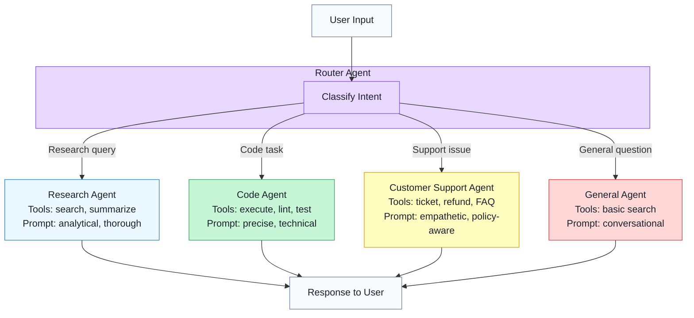

Each specialized agent has its own **system prompt** tailored to its domain, its own **tool set** (a research agent does not need a refund tool), and potentially its own **model** (a simple FAQ agent can use a smaller, faster model while a code agent needs the most capable one). This specialization is what makes routing powerful -- each agent operates in its area of strength.

## 4.5 The Routing Flow

Let's trace the complete lifecycle of a routed request, from the user's input through classification, delegation, and response:

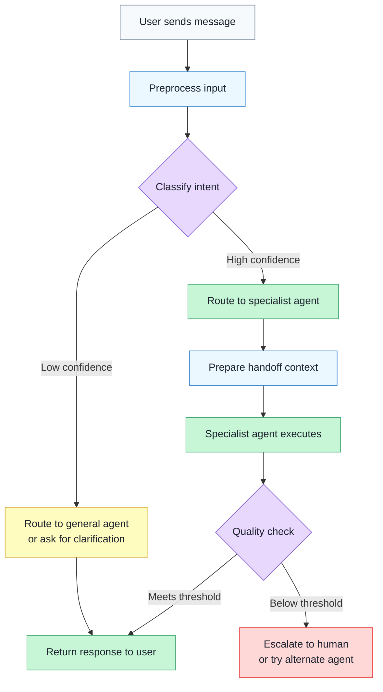

Two details in this flow are worth highlighting. First, the **confidence threshold** on classification -- when the router is unsure, it should not guess. A misrouted request is worse than a slightly slower correct routing. Falling back to a general agent or asking the user to clarify is a better strategy. Second, the **quality check** after execution -- the router can inspect the specialist's output and decide whether to escalate, retry with a different agent, or accept the result.

## 4.5 Three Strategies for Routing

Not every router needs an LLM. The right strategy depends on the complexity of your intents, the latency budget, and the cost per request.

### LLM-Based Classification

The most flexible approach uses the LLM itself as the classifier. You provide a system prompt listing the available routes with descriptions, and the model returns a structured classification.

**Strengths:** Handles ambiguous, nuanced, or novel inputs. Can reason about edge cases. No training data required -- just descriptions of each route.

**Weaknesses:** Adds latency (one LLM call before the specialist even starts). Costs money per classification. Can be inconsistent -- the same input might route differently on repeated calls.

### Keyword and Regex Matching

The simplest and fastest approach. You define patterns -- if the input contains "refund" or "cancel subscription," route to customer support; if it contains "def " or "function" or "```", route to the code agent.

**Strengths:** Near-zero latency, zero cost, fully deterministic. Easy to debug and audit.

**Weaknesses:** Brittle. Users rarely phrase things the way you expect. "My code isn't working and I want my money back" matches both code and support patterns. Cannot handle intent that is expressed indirectly.

### Embedding Similarity

A middle ground. You pre-compute **embedding vectors** for a set of representative queries per route, then at runtime compute the embedding of the user's input and find the closest match using cosine similarity.

**Strengths:** Handles paraphrasing and indirect phrasing well. Fast at inference (one embedding call plus a vector search). More robust than keywords.

**Weaknesses:** Requires curating representative examples for each route. Does not handle truly novel intents that fall outside all clusters. The embedding model's quality matters -- a poor embedding model means poor routing.

> **In practice:** Production systems often combine strategies. A fast keyword check handles obvious cases (90% of traffic), an embedding classifier catches the subtler ones (9%), and an LLM-based classifier handles the remaining ambiguous 1%. This tiered approach minimizes latency and cost while maximizing accuracy.

## 4.5 Implementing a Router Agent

Let's build a practical router that classifies user intent and delegates to specialized agents, each with its own system prompt and tool set. The router uses structured output to ensure consistent classification:

**router_agent.py**

```python
import anthropic
import json
from typing import Literal

client = anthropic.Anthropic()

# --- Define the specialized agents ---

AGENT_CONFIGS = {
    "research": {
        "system_prompt": (
            "You are a research analyst. Provide thorough, well-structured "
            "answers backed by evidence. Cite sources when possible. "
            "Use the search tool to find current information."
        ),
        "tools": [
            {
                "name": "web_search",
                "description": "Search the web for current information",
                "input_schema": {
                    "type": "object",
                    "properties": {
                        "query": {"type": "string", "description": "Search query"}
                    },
                    "required": ["query"],
                },
            }
        ],
    },
    "code": {
        "system_prompt": (
            "You are a senior software engineer. Write clean, well-documented "
            "code. Explain your design decisions. Include error handling "
            "and type hints. Run code to verify correctness."
        ),
        "tools": [
            {
                "name": "execute_code",
                "description": "Execute Python code and return the output",
                "input_schema": {
                    "type": "object",
                    "properties": {
                        "code": {"type": "string", "description": "Python code"}
                    },
                    "required": ["code"],
                },
            }
        ],
    },
    "support": {
        "system_prompt": (
            "You are a customer support specialist. Be empathetic and helpful. "
            "Follow company policies strictly. Offer concrete solutions. "
            "Escalate to a human agent when you cannot resolve the issue."
        ),
        "tools": [
            {
                "name": "lookup_order",
                "description": "Look up a customer order by ID",
                "input_schema": {
                    "type": "object",
                    "properties": {
                        "order_id": {"type": "string", "description": "Order ID"}
                    },
                    "required": ["order_id"],
                },
            },
            {
                "name": "create_ticket",
                "description": "Create a support ticket for escalation",
                "input_schema": {
                    "type": "object",
                    "properties": {
                        "subject": {"type": "string"},
                        "description": {"type": "string"},
                        "priority": {
                            "type": "string",
                            "enum": ["low", "medium", "high"],
                        },
                    },
                    "required": ["subject", "description", "priority"],
                },
            },
        ],
    },
}


def classify_intent(user_message: str) -> dict:
    """Use the LLM to classify the user's intent and select a route."""
    response = client.messages.create(
        model="claude-sonnet-4-20250514",
        max_tokens=256,
        system=(
            "You are a routing classifier. Analyze the user's message and "
            "determine which specialist agent should handle it.\\n\\n"
            "Available routes:\\n"
            '- "research": Factual questions, analysis, comparisons, explanations\\n'
            '- "code": Programming tasks, debugging, code review, technical implementation\\n'
            '- "support": Billing, orders, account issues, complaints, refunds\\n\\n'
            "Respond with JSON only: "
            '{"route": "<route_name>", "confidence": <0.0-1.0>, "reasoning": "<brief explanation>"}'
        ),
        messages=[{"role": "user", "content": user_message}],
    )

    return json.loads(response.content[0].text)


def handoff_to_agent(
    route: str,
    user_message: str,
    conversation_history: list[dict] | None = None,
) -> str:
    """Hand off the request to a specialized agent with full context."""
    config = AGENT_CONFIGS[route]

    # Build the handoff context -- this is the critical part.
    # The specialist agent needs enough history to continue seamlessly.
    messages = []
    if conversation_history:
        messages.extend(conversation_history)
    messages.append({"role": "user", "content": user_message})

    response = client.messages.create(
        model="claude-sonnet-4-20250514",
        max_tokens=2048,
        system=config["system_prompt"],
        tools=config["tools"],
        messages=messages,
    )

    return response.content[0].text


def route_request(
    user_message: str,
    conversation_history: list[dict] | None = None,
    confidence_threshold: float = 0.7,
) -> str:
    """Full routing pipeline: classify, then delegate."""

    # Step 1: Classify intent
    classification = classify_intent(user_message)
    route = classification["route"]
    confidence = classification["confidence"]
    reasoning = classification["reasoning"]

    print(f"Route: {route} (confidence: {confidence:.0%})")
    print(f"Reasoning: {reasoning}")

    # Step 2: Check confidence threshold
    if confidence < confidence_threshold:
        print(f"Low confidence ({confidence:.0%}). Asking for clarification.")
        return (
            "I want to make sure I help you in the best way. "
            "Could you tell me more about what you need? For example:\\n"
            "- A factual question or research topic?\\n"
            "- Help with code or a technical task?\\n"
            "- A support issue with your account or order?"
        )

    # Step 3: Hand off to the specialist agent
    return handoff_to_agent(route, user_message, conversation_history)


# --- Try it out ---
queries = [
    "What are the main differences between TCP and UDP?",
    "Write a Python function that finds all prime numbers up to N",
    "I was charged twice for order #12345, please help",
    "Tell me something interesting",  # Ambiguous -- may trigger fallback
]

for query in queries:
    print(f"\\n{'='*60}")
    print(f"User: {query}")
    print(f"{'='*60}")
    result = route_request(query)
    print(f"Response: {result[:200]}...")
```

Several design decisions in this implementation are worth noting. The **confidence threshold** at 0.7 means the router will fall back to asking for clarification rather than guessing when it is unsure -- this prevents cascading errors from misclassification. The **handoff function** accepts a `conversation_history` parameter, ensuring the specialist agent receives prior context rather than seeing the request in isolation. And each agent configuration bundles both the system prompt and the tools, so the router can set up the specialist with everything it needs in a single call.

## 4.5 Handoff Context: What to Transfer

The difference between a good routing system and a great one lies in the **handoff**. When one agent passes control to another, what exactly gets transferred?

A **minimal handoff** sends only the current user message. This is simple but fragile -- the receiving agent has no idea what came before. If the user said "Can you also check my billing?" after a long research conversation, the support agent receives just that one sentence with no context about who the user is or what was discussed.

A **full-context handoff** transfers:

- **Conversation history** -- the full message log so the receiving agent can read what happened before
- **Extracted entities** -- user ID, order numbers, relevant facts the previous agent identified
- **Tool state** -- results from tools the previous agent already called (so the new agent does not repeat work)
- **Routing metadata** -- why the handoff happened, what the previous agent's confidence was, any partial results

**handoff_context.py**

```python
from dataclasses import dataclass, field


@dataclass
class HandoffContext:
    """Everything a specialist agent needs to continue seamlessly."""

    # The current request
    user_message: str

    # Full conversation history (list of {"role": ..., "content": ...})
    conversation_history: list[dict] = field(default_factory=list)

    # Entities extracted by the router or previous agent
    extracted_entities: dict = field(default_factory=dict)
    # e.g., {"user_id": "u_123", "order_id": "12345", "product": "Widget Pro"}

    # Results from tools already called (avoid redundant calls)
    tool_results: list[dict] = field(default_factory=list)
    # e.g., [{"tool": "lookup_order", "result": {"status": "shipped"}}]

    # Why the handoff happened
    routing_metadata: dict = field(default_factory=dict)
    # e.g., {"from_route": "research", "reason": "user asked about billing",
    #         "confidence": 0.92}


def build_specialist_prompt(
    base_system_prompt: str, context: HandoffContext
) -> str:
    """Inject handoff context into the specialist's system prompt."""
    parts = [base_system_prompt]

    if context.extracted_entities:
        entities_str = ", ".join(
            f"{k}: {v}" for k, v in context.extracted_entities.items()
        )
        parts.append(
            f"\\nKnown context about this user: {entities_str}"
        )

    if context.tool_results:
        results_str = "\\n".join(
            f"- {r['tool']}: {r['result']}" for r in context.tool_results
        )
        parts.append(
            f"\\nPrevious tool results (do not re-call these):\\n{results_str}"
        )

    if context.routing_metadata:
        parts.append(
            f"\\nThis conversation was routed to you from "
            f"'{context.routing_metadata.get('from_route', 'unknown')}' "
            f"because: {context.routing_metadata.get('reason', 'unspecified')}"
        )

    return "\\n".join(parts)
```

The `HandoffContext` dataclass makes the transfer explicit and structured. Rather than ad hoc string concatenation, every piece of context has a well-defined field. The `build_specialist_prompt` function injects this context into the specialist's system prompt, so the receiving agent can immediately see extracted entities, prior tool results, and the reason for the handoff.

## 4.5 Strengths and Weaknesses

Routing and handoffs offer clear advantages but come with real trade-offs:

**Strengths:**

- **Specialization** -- each agent can be optimized for its domain with a tailored system prompt, specific tools, and even a different model. A billing agent does not need a code execution tool, and a code agent does not need empathy training.
- **Efficiency** -- simple queries (like FAQ lookups) can be handled by a lightweight agent with a small model, reserving expensive models and complex tool sets for the requests that need them. This reduces both latency and cost.
- **Modularity** -- adding a new capability means adding a new specialist agent and updating the router's classification list. Existing agents remain untouched. This mirrors the open/closed principle from software engineering.
- **Scalability** -- each specialist can be scaled, monitored, and updated independently. A bug in the support agent does not affect the code agent.

**Weaknesses:**

- **Classification errors cascade** -- if the router sends a billing complaint to the code agent, the specialist will produce a confident but completely wrong response. Unlike other agent failures where the agent might self-correct, a misroute often produces plausible-looking output that the user must catch.
- **Context loss during handoffs** -- even with careful context transfer, some information is inevitably lost or degraded. The receiving agent may miss subtle cues from earlier in the conversation. Multi-hop handoffs (A to B to C) amplify this problem.
- **Added latency** -- the classification step adds at least one LLM call before any work begins. For latency-sensitive applications, this overhead may be unacceptable.
- **Routing boundary ambiguity** -- real user requests often span multiple domains. "Debug my billing API code" involves both code and billing. Rigid routing categories struggle with these cross-cutting requests.

> **Mitigation strategy:** For cross-cutting requests, consider a **fan-out** approach -- route to multiple specialists in parallel and combine their responses. Or use a hierarchical router where the first level splits "code" from "support" and a second level handles the overlap.

## 4.5 Connecting to the Bigger Picture

Routing is not just another architecture pattern -- it is the **gateway to multi-agent systems**. Consider the progression:

1. **Single agent** -- one prompt, one tool set, handles everything (Modules 1-4 so far)
2. **Router + specialists** -- one classifier delegates to focused agents (this lesson)
3. **Supervisor + workers** -- the router gains the ability to coordinate, retry, and synthesize across agents (Module 9: Multi-Agent Systems)

The router you built in this lesson is already a simple supervisor. It classifies, delegates, and returns results. In Module 9, you will extend this pattern with agents that can communicate with each other, share intermediate results, and collaborate on tasks that no single specialist can solve alone.

## 4.5 Summary

**Routing** is the pattern of classifying an incoming request and dispatching it to the most appropriate specialized handler. A **router agent** sits at the center of the architecture, analyzing user intent and selecting from a set of specialist agents, each equipped with its own system prompt, tool set, and optionally its own model.

Three main routing strategies exist: **LLM-based classification** (flexible but adds latency), **keyword/regex matching** (fast and deterministic but brittle), and **embedding similarity** (robust to paraphrasing but requires curated examples). Production systems often tier these strategies, using fast methods for clear-cut cases and reserving LLM classification for ambiguous inputs.

**Handoffs** are how context transfers between agents. Effective handoffs carry not just the current message but the full conversation history, extracted entities, prior tool results, and routing metadata. The quality of the handoff determines whether the transition feels seamless or jarring to the user.

The key trade-offs are specialization and efficiency versus classification errors and context loss. Routing shines when your problem space has clearly distinct domains, and struggles when user requests span multiple categories. As systems grow more complex, the router naturally evolves into a supervisor -- making routing the foundational pattern for the multi-agent architectures you will explore in Module 9.

In the next lesson, we will explore **Workflow and State Machine Agents** -- architectures that combine routing with deterministic control flow, giving you explicit state transitions and predictable execution paths rather than relying on LLM classification at every step.

---

    Section 4.6: Workflow and State Machine Agents


## 4.6 Overview

In the previous lessons, you explored agent architectures that give the LLM significant autonomy: ReAct lets the model decide what to do at every step, Plan-and-Execute lets it write its own plan, Self-Reflection lets it critique and revise its own output, and Routing lets it classify and delegate. These patterns are powerful, but they share a common trait -- the LLM is in the driver's seat.

Now consider a different scenario. A customer contacts your support system. The process should always follow the same steps: greet the customer, classify their issue, look up relevant information, draft a response, and close the ticket. The *structure* is fixed and known in advance. But within each step, you need intelligence -- classifying whether the issue is a billing question or a technical problem, generating a personalized response, deciding whether to escalate. You do not need autonomy. You need **structured intelligence**.

This is the domain of **workflow agents** and **state machine agents**. They combine the predictability of deterministic control flow with the flexibility of LLM-powered decision-making at specific nodes. The structure is yours. The intelligence is the model's.

## 4.6 The Key Insight: Not Everything Needs Autonomy

Most real-world business processes are not open-ended explorations. They are sequences of known steps with known branching points. An insurance claim follows a defined process. A data pipeline has fixed stages. An employee onboarding flow has mandatory checkpoints. The steps are documented, regulated, and auditable.

Fully autonomous agents are a poor fit for these processes. When a ReAct agent decides what to do at every turn, you lose guarantees. Did it skip the compliance check? Did it forget to log the decision? Did it take a path that no one anticipated? In regulated environments, "the AI decided to skip that step" is not an acceptable answer.

**Workflow agents** solve this by inverting the relationship between structure and intelligence. Instead of an LLM deciding the structure, you define the structure and let the LLM provide intelligence *within* that structure. The workflow is deterministic. The decisions within it are intelligent.

> **The analogy:** Think of a workflow agent like an assembly line in a factory. The line itself is fixed -- stations in a specific order, conveyor belts connecting them. But at certain stations, a skilled worker (the LLM) makes judgment calls: is this part defective? Which color should we paint it? Does this need a custom adjustment? The line provides predictability. The workers provide intelligence.

## 4.6 State Machines: The Foundation

A **state machine** is a model of computation where the system is always in exactly one of a finite number of states. At each state, the system evaluates its context and transitions to the next state based on defined rules. State machines are everywhere in software engineering -- network protocols, game logic, UI flows, and now, agent architectures.

Here is a customer support workflow modeled as a state machine:

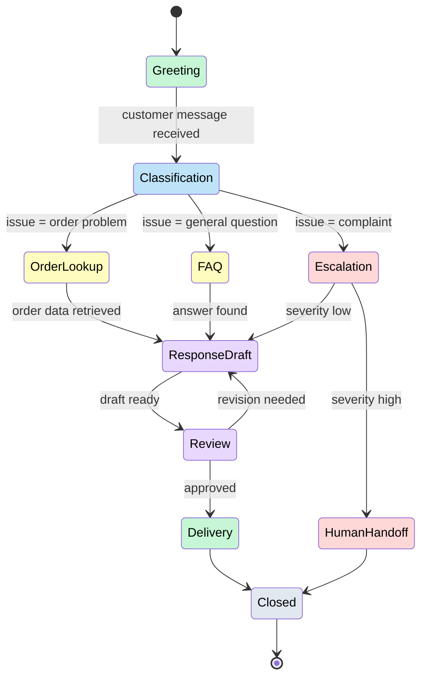

Every path through this diagram is known and auditable. The customer will always be greeted. Their issue will always be classified. The response will always be reviewed before delivery. No step can be skipped, and no unexpected path can emerge. But notice that several nodes require intelligence -- **Classification** must understand the customer's message, **ResponseDraft** must generate a natural language reply, and **Review** must evaluate whether the draft is adequate. These are the LLM-powered decision nodes.

## 4.6 Hybrid Workflows: Deterministic + Intelligent Nodes

The real power of workflow agents comes from mixing deterministic nodes and LLM-powered nodes in the same graph. Not every node needs an LLM. Not every node should be hardcoded. The art is choosing which nodes get intelligence and which stay deterministic.

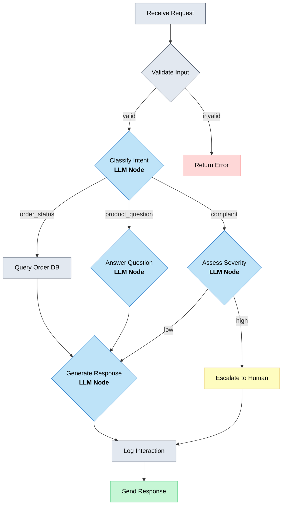

In this diagram, gray nodes are **deterministic** -- they run fixed code with no LLM involvement. Blue nodes are **LLM-powered** -- they call a model to make a decision or generate content. The workflow structure ensures that validation always happens before classification, that every interaction is logged, and that responses are always sent through the same channel. The LLM nodes provide the intelligence that makes each interaction feel personalized and contextual.

This hybrid approach gives you the best of both worlds. Deterministic nodes handle validation, data retrieval, logging, and routing -- things that should never be creative or unpredictable. LLM nodes handle classification, generation, and judgment -- things that require understanding natural language and making nuanced decisions.

## 4.6 Implementing a State Machine Agent

Let's build a workflow agent in Python. The implementation has three core components: a set of states, a transition function, and node handlers (some of which call an LLM).

**workflow_agent.py**

```python
import anthropic
from dataclasses import dataclass, field
from enum import Enum


class State(Enum):
    GREETING = "greeting"
    CLASSIFICATION = "classification"
    ORDER_LOOKUP = "order_lookup"
    FAQ_ANSWER = "faq_answer"
    RESPONSE_DRAFT = "response_draft"
    CLOSED = "closed"


# Valid transitions: current_state -> list of possible next states
TRANSITIONS: dict[State, list[State]] = {
    State.GREETING: [State.CLASSIFICATION],
    State.CLASSIFICATION: [State.ORDER_LOOKUP, State.FAQ_ANSWER],
    State.ORDER_LOOKUP: [State.RESPONSE_DRAFT],
    State.FAQ_ANSWER: [State.RESPONSE_DRAFT],
    State.RESPONSE_DRAFT: [State.CLOSED],
}


@dataclass
class WorkflowContext:
    """Shared context that flows through the workflow."""
    customer_message: str = ""
    issue_type: str = ""
    retrieved_data: str = ""
    draft_response: str = ""
    history: list[str] = field(default_factory=list)

    def log(self, entry: str):
        self.history.append(entry)


client = anthropic.Anthropic()


def llm_call(prompt: str, system: str = "") -> str:
    """Make a single LLM call and return the text response."""
    response = client.messages.create(
        model="claude-sonnet-4-20250514",
        max_tokens=512,
        system=system,
        messages=[{"role": "user", "content": prompt}],
    )
    return response.content[0].text


# --- Node Handlers ---

def handle_greeting(ctx: WorkflowContext) -> State:
    """Deterministic node: always transitions to classification."""
    ctx.log(f"Greeted customer. Message: {ctx.customer_message[:50]}...")
    return State.CLASSIFICATION


def handle_classification(ctx: WorkflowContext) -> State:
    """LLM node: classifies the customer's issue."""
    result = llm_call(
        prompt=f"Classify this customer message into exactly one category.\\n"
               f"Categories: order_issue, general_question\\n"
               f"Message: {ctx.customer_message}\\n"
               f"Respond with only the category name.",
        system="You are a customer support classifier. Respond with only the category.",
    )
    ctx.issue_type = result.strip().lower()
    ctx.log(f"Classified as: {ctx.issue_type}")

    if "order" in ctx.issue_type:
        return State.ORDER_LOOKUP
    return State.FAQ_ANSWER


def handle_order_lookup(ctx: WorkflowContext) -> State:
    """Deterministic node: queries the order database."""
    # In production, this queries a real database
    ctx.retrieved_data = "Order #12345: Shipped on June 5, arriving June 9."
    ctx.log(f"Retrieved order data: {ctx.retrieved_data}")
    return State.RESPONSE_DRAFT


def handle_faq_answer(ctx: WorkflowContext) -> State:
    """Deterministic node: retrieves FAQ content."""
    ctx.retrieved_data = "Return policy: 30-day returns for unused items."
    ctx.log(f"Retrieved FAQ: {ctx.retrieved_data}")
    return State.RESPONSE_DRAFT


def handle_response_draft(ctx: WorkflowContext) -> State:
    """LLM node: generates a personalized response."""
    ctx.draft_response = llm_call(
        prompt=f"Write a helpful customer support response.\\n"
               f"Customer message: {ctx.customer_message}\\n"
               f"Issue type: {ctx.issue_type}\\n"
               f"Relevant information: {ctx.retrieved_data}",
        system="You are a friendly customer support agent. Be concise and helpful.",
    )
    ctx.log(f"Drafted response ({len(ctx.draft_response)} chars)")
    return State.CLOSED


# --- State Machine Engine ---

NODE_HANDLERS = {
    State.GREETING: handle_greeting,
    State.CLASSIFICATION: handle_classification,
    State.ORDER_LOOKUP: handle_order_lookup,
    State.FAQ_ANSWER: handle_faq_answer,
    State.RESPONSE_DRAFT: handle_response_draft,
}


def run_workflow(customer_message: str, max_steps: int = 10) -> WorkflowContext:
    """Execute the workflow state machine."""
    ctx = WorkflowContext(customer_message=customer_message)
    current_state = State.GREETING

    for step in range(max_steps):
        print(f"Step {step + 1}: {current_state.value}")

        handler = NODE_HANDLERS.get(current_state)
        if handler is None:
            ctx.log(f"Terminal state: {current_state.value}")
            break

        next_state = handler(ctx)

        # Validate the transition
        valid_next = TRANSITIONS.get(current_state, [])
        if next_state not in valid_next:
            raise ValueError(
                f"Invalid transition: {current_state.value} -> {next_state.value}. "
                f"Valid: {[s.value for s in valid_next]}"
            )

        current_state = next_state

    return ctx


# Run it
result = run_workflow("Where is my order #12345? I placed it last week.")
print(f"\\nResponse: {result.draft_response}")
print(f"\\nWorkflow log:")
for entry in result.history:
    print(f"  - {entry}")
```

Let's walk through the key design decisions in this implementation:

**States as an enum.** Each state is explicitly defined. There are no surprise states -- the system can only be in one of the declared states at any time. This makes the workflow self-documenting and easy to audit.

**Explicit transition table.** The `TRANSITIONS` dictionary declares which states can follow which. This is the structural guarantee: the workflow *cannot* jump from greeting to response drafting without going through classification first. If a node handler returns an invalid next state, the engine raises an error immediately.

**Node handlers return the next state.** Each handler takes the shared context, does its work (deterministic or LLM-powered), and returns the next state. This keeps the decision about *where to go next* close to the logic that informs it.

**Shared context object.** The `WorkflowContext` carries data between nodes. The classification result informs the data lookup. The lookup result informs the response draft. Every node reads from and writes to this shared context, creating a clean data flow through the workflow.

**Audit trail built in.** The `history` list on the context records what happened at every step. In production, this becomes your observability layer -- you can reconstruct exactly what path the workflow took, what the LLM decided at each node, and what data it used.

## 4.6 How Workflow Agents Differ from Autonomous Agents

It helps to be precise about where workflow agents sit relative to the other architectures you have studied. The fundamental axis is **who controls the structure** of execution.

| Dimension | Autonomous (ReAct) | Workflow Agent |
|-----------|-------------------|----------------|
| Control flow | LLM decides next step each iteration | Predefined graph of states and transitions |
| Predictability | Low -- paths emerge at runtime | High -- all paths are known at design time |
| Auditability | Requires tracing the full reasoning chain | Built in -- every path is in the transition table |
| Flexibility | Handles novel situations well | Handles known processes well |
| Failure modes | May loop, hallucinate actions, or wander | Constrained -- invalid transitions are caught |
| LLM usage | Every step requires LLM reasoning | Only specific decision nodes use the LLM |
| Cost | Higher -- many LLM calls per task | Lower -- LLM called only where needed |

Neither approach is universally better. Autonomous agents excel at open-ended tasks where the path cannot be predicted in advance. Workflow agents excel at structured processes where the path is known but the decisions along it require intelligence.

Most production systems use both. A routing agent (Lesson 05) might classify an incoming request and hand it off to a workflow agent that processes it through a defined set of steps. The outer layer is autonomous. The inner layer is structured. This is the layered architecture pattern you will see in real-world deployments.

## 4.6 When to Use Workflow Agents

Workflow agents are the right choice when the process is more important than the individual decisions within it. Here are the clearest signals:

**Regulated processes.** Healthcare, finance, legal, and compliance workflows have mandatory steps that cannot be skipped. A loan approval workflow must always run a credit check, verify identity, and log the decision. A workflow agent guarantees these steps happen in the right order every time.

**Customer support flows.** Support interactions follow predictable patterns -- greet, classify, retrieve information, respond, close. The LLM provides natural language understanding and generation, but the process structure ensures consistency and enables quality monitoring.

**Data pipelines with judgment.** Extract-transform-load pipelines that need human-like judgment at certain stages -- is this data entry anomalous? How should this edge case be classified? -- benefit from the workflow pattern. Most stages are deterministic data processing. A few stages need LLM intelligence.

**Approval workflows.** Any process that requires sign-off at specific checkpoints -- code review, document approval, expense authorization -- maps naturally to a state machine with human-in-the-loop gates.

**Multi-step content generation.** Generating a report that requires research, outlining, drafting, fact-checking, and formatting is a workflow. Each stage has a clear input, output, and success criterion. The LLM handles the creative work. The workflow handles the process.

## 4.6 Connecting to Frameworks and Production

The workflow agent pattern is so fundamental that it has become the basis for major agent frameworks. **LangGraph**, which you will explore in Module 7, is built entirely around this idea -- you define a graph of nodes and edges, some nodes call LLMs, and the framework manages state, transitions, and persistence. If you understand the state machine pattern from this lesson, LangGraph will feel immediately familiar.

Workflow agents are also the easiest architecture to deploy and monitor in production, which you will cover in Module 11. Because every path is predefined, you can:

- **Set up alerts** on specific transitions (e.g., "notify me when escalation rate exceeds 10%")
- **Measure latency** per node to identify bottlenecks
- **A/B test** individual nodes without changing the overall flow
- **Roll back** a single LLM prompt without redeploying the entire system
- **Guarantee SLAs** because the maximum number of steps is bounded

Compare this to monitoring a ReAct agent, where the number of steps is variable, the path is different every time, and a single prompt change can alter the entire execution flow. Workflow agents give operations teams the predictability they need.

## 4.6 Summary

**Workflow agents** and **state machine agents** bring deterministic structure to LLM-powered systems. Instead of giving the model full autonomy, you define the control flow and let the LLM provide intelligence at specific decision points.

- **The core insight:** Most business processes have a known structure. The workflow should be deterministic; only the *decisions within it* need to be intelligent.
- **State machines** model workflows as a finite set of states with explicit transitions. Every valid path is declared at design time, making the system auditable and predictable.
- **Hybrid workflows** combine deterministic nodes (validation, data retrieval, logging) with LLM-powered nodes (classification, generation, judgment) in the same graph.
- **Implementation** centers on three components: an enum of states, a transition table, and node handlers that return the next state. A shared context object carries data between nodes.
- **The key advantage** over autonomous agents is predictability: all paths are known, invalid transitions are caught, and every step is logged. The key tradeoff is flexibility -- workflow agents handle known processes well but cannot improvise when the process itself is unknown.
- **Frameworks like LangGraph** (Module 7) are built on this pattern, and workflow agents are the easiest architecture to deploy and monitor in production (Module 11).

In the next lesson, we bring everything together. You have now studied five distinct architectures -- ReAct, Plan-and-Execute, Self-Reflection, Routing, and Workflow agents. The final lesson in this module provides a **decision framework for choosing the right architecture** based on your problem's characteristics.

---

    Section 4.7: Choosing the Right Architecture


## 4.7 Overview

You have now studied six agent architectures: ReAct, Plan-and-Execute, Self-Reflection, Routing, and Workflow agents. Each one has distinct strengths. ReAct is flexible and adaptive. Plan-and-Execute handles complex multi-step problems. Self-Reflection improves output quality. Routing distributes work efficiently. Workflows provide deterministic control.

But knowing what each architecture *does* is not the same as knowing *when to use it*. In practice, the hardest part of building an agent is not implementing the architecture -- it is choosing the right one in the first place. Pick too simple an architecture, and your agent will fail on complex tasks. Pick too complex an architecture, and you will waste tokens, add latency, and create debugging nightmares for a problem that did not need that sophistication.

This lesson gives you a **decision framework** -- a systematic way to match problem characteristics to architecture patterns. We will also cover **hybrid architectures** that combine multiple patterns, and the **common mistakes** that teams make when choosing.

## 4.7 The Decision Framework

Choosing an architecture starts with understanding your task. Ask a series of questions about the problem, and each answer narrows the set of architectures that fit.

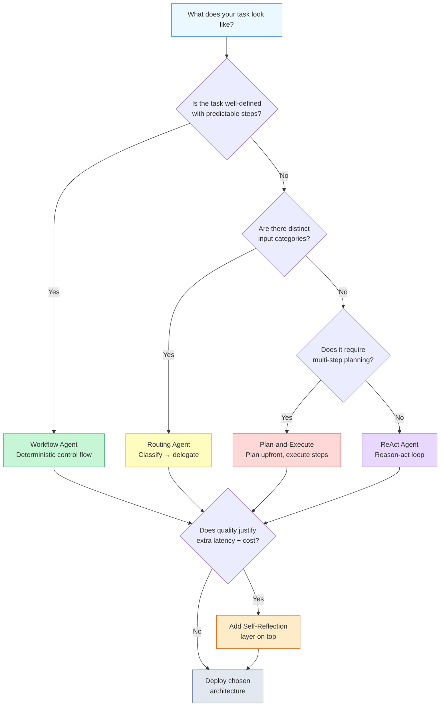

Let's walk through each decision point.

**Is the task well-defined with predictable steps?** If you can write out the exact steps the agent should follow before you start building, you have a workflow problem. Order processing, form validation, data pipeline orchestration -- these are tasks where the path is known. A Workflow agent gives you deterministic control flow, which means predictable behavior, easy debugging, and low cost. Do not add autonomy where you do not need it.

**Are there distinct input categories?** If inputs naturally cluster into types that need different handling, Routing is your answer. Customer support (billing vs. shipping vs. returns), content moderation (text vs. image vs. video), or multi-language processing all have this shape. The router classifies the input, then delegates to a specialized sub-agent -- which itself might use any of the other patterns.

**Does it require multi-step planning?** If the task is complex enough that the agent needs to create a plan before acting, Plan-and-Execute is the right fit. Research tasks, multi-file code changes, complex data analysis -- anything where the steps are not obvious upfront but need to be reasoned about, and where completing one step informs the next.

**If none of the above, use ReAct.** For tasks that need flexibility and tool use but are not complex enough to warrant full planning, the ReAct loop is the right default. It is the most general-purpose architecture: reason, act, observe, repeat.

**Should you add Self-Reflection?** This is not a standalone choice but a layer you add on top. If your domain has high stakes (legal, medical, financial), if errors are expensive to fix, or if quality matters more than speed, add a reflection step that critiques and refines the output before returning it.

## 4.7 Comparing Architectures

Each architecture makes different tradeoffs. The following diagram rates all six patterns across five dimensions: **autonomy** (how much freedom the agent has), **predictability** (how consistent the behavior is), **implementation complexity** (how hard it is to build), **debugging ease** (how easy it is to find and fix problems), and **cost per task** (token usage and API calls).

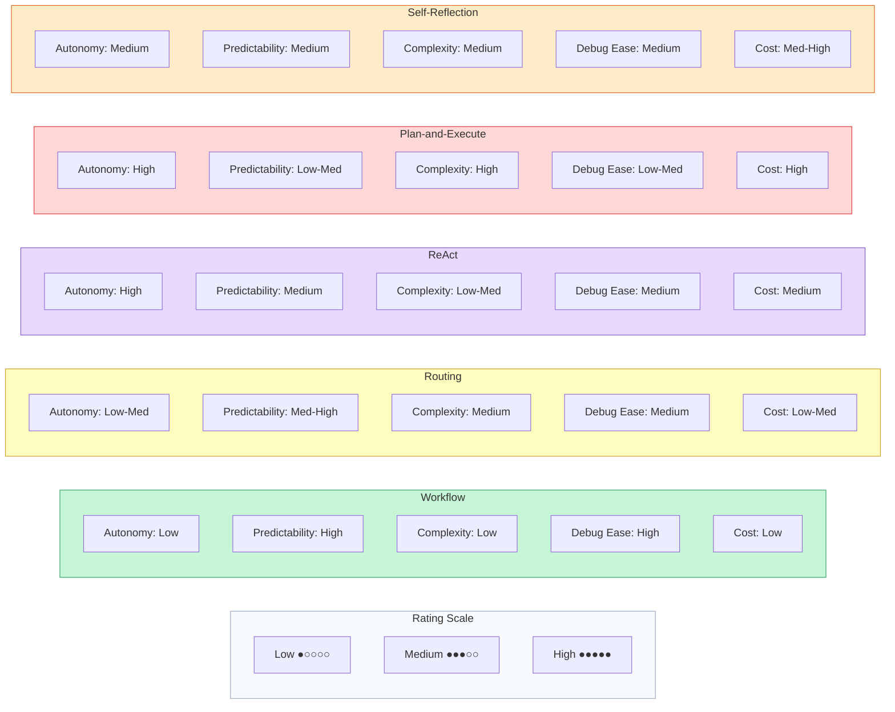

The pattern is clear: **simpler architectures trade autonomy for predictability**, while **complex architectures trade predictability for flexibility**. There is no universally best choice -- only the best fit for your problem.

## 4.7 Architecture-to-Use-Case Matrix

The decision framework gives you a process. The matrix below gives you a reference -- a quick lookup for common use cases and the architectures that fit them.

| Use Case | Primary Architecture | Enhancement | Why |
|---|---|---|---|
| Customer support | Routing + Workflow | -- | Classifiable inputs, deterministic resolution |
| Research assistant | Plan-and-Execute | Self-Reflection | Complex, multi-step, quality-sensitive |
| Code generation | ReAct | Self-Reflection | Iterative tool use, needs self-correction |
| Data pipeline orchestration | Workflow | -- | Fully deterministic, well-defined steps |
| Content moderation | Routing | -- | Distinct categories, specialized handling |
| Document summarization | ReAct | Self-Reflection | Straightforward tool use, quality matters |
| Travel planning | Plan-and-Execute | Routing | Complex planning, multiple booking categories |
| FAQ / Q&A bot | Workflow | -- | Simple retrieval, predictable flow |
| Competitive analysis | Plan-and-Execute | Self-Reflection | Multi-source research, synthesis required |
| DevOps incident response | Routing + ReAct | -- | Triage by type, then flexible investigation |

Notice that the simplest use cases (FAQ bots, data pipelines) map to the simplest architecture (Workflow), while the most complex tasks (research, competitive analysis) require Plan-and-Execute with Self-Reflection. This is not a coincidence -- it reflects a fundamental principle: **match your architecture's complexity to your problem's complexity**.

## 4.7 Hybrid Architectures

Real-world agents rarely use a single architecture in isolation. The most effective agents combine patterns, using each one where it fits best. This is the idea behind **hybrid architectures**.

The most common hybrid pattern uses Routing as the top layer. The router classifies incoming tasks, then delegates each type to an agent built with a different architecture.

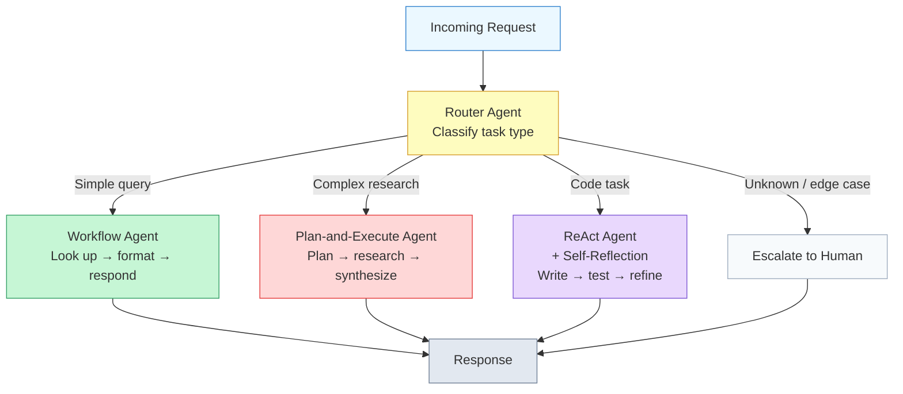

In this design, simple queries hit a fast, cheap Workflow agent. Complex research tasks go to a Plan-and-Execute agent that takes more time and tokens but produces thorough results. Code tasks get a ReAct agent with Self-Reflection for iterative refinement. And edge cases that do not fit any category are escalated to a human. Each branch uses the architecture that best matches its problem characteristics.

Other common hybrid combinations include:

- **Plan-and-Execute with ReAct steps** -- the planner creates a high-level plan, but each step is executed by a ReAct agent that can adapt and use tools flexibly
- **Workflow with LLM decision nodes** -- a mostly deterministic pipeline where certain branch points use LLM reasoning instead of hardcoded rules
- **ReAct with Routing sub-calls** -- a general-purpose ReAct agent that can delegate specialized sub-tasks to purpose-built agents

The key insight is that architectures are composable. You are not locked into one pattern for your entire system. Use the simplest pattern that works for each part of the problem, and compose them together.

## 4.7 Common Mistakes

Teams building their first agents consistently fall into two traps. Recognizing them will save you weeks of wasted effort.

### Over-Engineering

**Over-engineering** means applying a complex architecture to a problem that does not need it. The symptom: you build a Plan-and-Execute agent with Self-Reflection for a task that could be handled by a three-step Workflow.

This happens because complex architectures feel more impressive, and because teams worry about edge cases before they have evidence that edge cases are a real problem. The cost is significant: more tokens per request, higher latency, harder debugging, and more failure modes. A Plan-and-Execute agent can fail at the planning stage, at any execution step, and at the replanning stage. A Workflow agent can only fail at predefined points.

> **Rule of thumb:** Start with the simplest architecture that could work. If a Workflow handles 90% of your cases, ship the Workflow. Add complexity only when you have evidence -- from real usage data -- that the simpler approach is failing.

### Under-Engineering

**Under-engineering** is the opposite trap: using a simple loop for a task that genuinely requires planning and coordination. The symptom: your ReAct agent spins in circles on complex tasks, repeatedly trying the same approach, burning through tokens without making progress.

This happens when teams prototype with ReAct (because it is the easiest to build) and then never upgrade, even as the task complexity grows. A ReAct agent working on a problem that requires coordinating ten steps in a specific order will waste enormous amounts of time rediscovering the order through trial and error -- time that a Plan-and-Execute agent would spend on a single planning step.

> **Rule of thumb:** If your ReAct agent frequently takes more than 5-7 steps to complete a task, or if it often circles back to retry earlier steps, the task has outgrown the ReAct pattern. Consider Plan-and-Execute.

### Ignoring the Escape Hatch

A third mistake is building an agent without an **escalation path**. No architecture handles every input gracefully. When an agent encounters a task outside its competence, it should recognize that and escalate -- to a more capable agent, to a human, or to an error handler. Agents that try to handle everything end up handling nothing well.

## 4.7 Putting It All Together

Here is a practical process for choosing an architecture for a new agent project:

1. **Characterize the task.** Write down twenty example inputs. How varied are they? How many steps does each take? Are the steps predictable or emergent?

2. **Walk the decision tree.** Use the framework from earlier in this lesson. Follow the questions and note which architecture the tree suggests.

3. **Check the matrix.** Look up your use case in the architecture-to-use-case matrix. Does the suggestion match the decision tree? If they disagree, dig deeper into why.

4. **Start simple.** Build the simplest architecture the decision tree suggests. Do not add Self-Reflection, Routing, or planning until you have evidence that you need it.

5. **Measure and evolve.** Track success rate, token usage, latency, and failure modes. Let the data tell you when to upgrade. If your simple agent fails on 30% of tasks, that is evidence. If it fails on 2%, the complexity is not worth it.

6. **Compose when needed.** When different input types need different architectures, use Routing to compose them into a hybrid. Do not force one architecture to handle everything.

## 4.7 Summary

Choosing the right architecture is a design decision, not a technical one. The best architecture is not the most powerful -- it is the one that matches your problem's actual complexity.

Here are the key ideas from this lesson:

- Use the **decision framework**: well-defined tasks get Workflows, classifiable inputs get Routing, complex multi-step tasks get Plan-and-Execute, and general-purpose tasks get ReAct. Self-Reflection is an optional quality layer on top.
- Architectures trade off along five dimensions: **autonomy, predictability, complexity, debugging ease, and cost**. Simpler architectures are more predictable and cheaper; complex ones are more flexible but harder to debug.
- **Hybrid architectures** combine patterns using Routing as a top layer, delegating different task types to different agent architectures. This is how most production agents are built.
- The two most common mistakes are **over-engineering** (complex architecture for a simple problem) and **under-engineering** (simple architecture for a complex problem). Start simple, measure, and evolve.
- Always build an **escalation path** so the agent can hand off tasks it cannot handle.

You have now completed Module 4. You understand the major agent architectures, when each one shines, and how to choose between them. But knowing which architecture to use is only half the challenge. Building it for production requires a different set of skills entirely. In **Module 5: Agent Design Patterns**, you will learn the software engineering patterns that make these architectures robust, maintainable, and production-ready: **tool registries** for managing growing tool sets, **middleware** for cross-cutting concerns like logging and auth, **context management** for keeping prompts under token limits, and **checkpointing** for recovering from failures mid-execution. These are the patterns that separate a prototype from a system you can deploy with confidence.

---

