# Agent Design Patterns

*Reusable software engineering patterns for building robust, maintainable agent systems*

    Section 5.1: Why Design Patterns Matter


## 5.1 Overview

At the end of Module 4, you built a decision framework for choosing agent architectures. You know when to reach for ReAct, Plan-and-Execute, Self-Reflection, Routing, or Workflow patterns. You can pick the right architecture for a given problem.

But here is a question Module 4 did not answer: once you choose an architecture, how do you *build* it cleanly?

If you have been following along with the code exercises, you have probably noticed something. Your ReAct agent works, but adding logging meant sprinkling `print()` statements through three functions. Your Plan-and-Execute agent works, but when you wanted to swap in a different search tool, you had to change code in four places. Your Routing agent works, but adding a new handler required copying boilerplate from an existing one and hoping you did not forget anything.

The architecture was right. The code was messy.

This module introduces **design patterns** for agent systems -- reusable solutions to the recurring implementation problems that every agent builder hits. This first lesson explains why these patterns matter, how they differ from architectures, and previews the six patterns you will learn in the lessons ahead.

## 5.1 Architectures vs. Design Patterns

These two concepts solve different problems, and confusing them is one of the most common mistakes in agent development.

**Architectures** answer the question: *What does the agent do?* They define the agent's reasoning strategy -- whether it thinks before each action (ReAct), plans upfront (Plan-and-Execute), critiques its own output (Self-Reflection), or follows a fixed graph (Workflow). Architecture is about the *shape* of the agent's cognitive process.

**Design patterns** answer a different question: *How is the code organized?* They define how tools are registered and discovered, how you intercept actions for logging or validation, how context is managed as conversations grow, how failures are handled gracefully, and how long-running tasks survive crashes. Patterns are about the *structure* of the implementation.

Here is the critical relationship: design patterns are **orthogonal** to architectures. A Tool Registry works the same way whether your agent uses ReAct or Plan-and-Execute. Middleware applies equally to a Routing agent and a Workflow agent. Checkpointing is valuable regardless of which reasoning strategy you chose. Patterns are **cross-cutting concerns** that apply across all architectures.

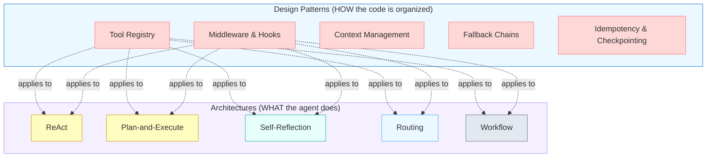

Notice how the dotted lines cross from every pattern to every architecture. This is what "cross-cutting" means -- patterns are not tied to any single architecture. They are the engineering layer that sits beneath all of them.

## 5.1 The Ad-Hoc Problem

To understand why patterns matter, let's look at what happens without them. Consider a ReAct agent that searches the web and answers questions. In an ad-hoc implementation, a single function does everything:

- It defines the tools inline as dictionaries
- It calls the LLM and parses the response
- It logs actions with `print()` statements scattered through the code
- It handles errors with bare `try/except` blocks
- It manages context by truncating the message list when it gets too long
- It has no retry logic -- if a tool call fails, the whole agent fails

This works for a prototype. Now imagine what happens when requirements change:

**"Add a new tool."** You write another dictionary in the same function, add another branch to the tool-dispatch `if/elif` chain, and hope the tool's schema matches what the LLM expects.

**"Add logging to every tool call."** You find every place a tool is invoked and add logging before and after each one. You miss one. A bug in production goes unlogged.

**"Switch to a cheaper model for simple queries."** You add a conditional at the top of the function. Now the function handles model selection, tool dispatch, context management, and error handling. It is 200 lines long and growing.

**"Make it resumable after crashes."** You realize there is no good place to save state. The entire agent's progress lives in local variables inside one function. You would have to restructure everything.

Each change is individually small. But they compound. After six months of requirements, the ad-hoc agent is a tangled monolith where every concern is interleaved with every other concern. Adding a feature means understanding the whole thing. Fixing a bug means risking a regression somewhere else. Onboarding a new team member means a week of reading spaghetti code.

## 5.1 What Patterns Give You

Design patterns solve this by giving each concern its own home. Compare the ad-hoc approach with a pattern-based approach to the same problems:

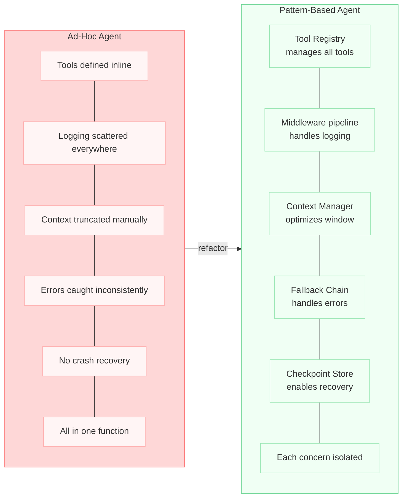

With patterns, each of the changes we described earlier becomes straightforward:

**"Add a new tool."** Register it with the Tool Registry. The agent discovers it automatically. No dispatch code to modify.

**"Add logging to every tool call."** Add a logging middleware to the middleware pipeline. It intercepts every tool call in one place. Nothing else changes.

**"Switch to a cheaper model for simple queries."** Add a fallback chain that tries the cheap model first and escalates to the expensive one when the cheap model fails or declines.

**"Make it resumable after crashes."** The checkpoint store already saves state after each step. On restart, the agent loads the last checkpoint and continues.

The difference is not just aesthetics. It is the difference between a system that can evolve and one that cannot.

## 5.1 The Six Patterns

This module covers six design patterns. Each one addresses a specific cross-cutting concern that arises in every non-trivial agent system.

**Pattern 1: Tool Registry** -- A centralized system for registering, discovering, and selecting tools at runtime. Instead of hardcoding tool definitions in your agent, you register them once and the agent discovers what is available dynamically. This makes it trivial to add, remove, or swap tools without changing agent code. It also enables runtime tool selection -- giving the agent only the tools relevant to the current task.

**Pattern 2: Middleware and Hooks** -- An interception layer that wraps agent actions. Every tool call, every LLM invocation, and every state transition passes through a pipeline of middleware functions. Each middleware can log, validate, rate-limit, transform, or block the action. This is how you add observability, enforce safety guardrails, and implement access control -- without touching the core agent logic.

**Pattern 3: Context Window Management** -- Strategies for keeping relevant information in the LLM's context as conversations grow beyond the token limit. This includes summarization, sliding windows, priority-based retention, and semantic chunking. Without this pattern, long-running agents either crash when they exceed the context limit or lose critical information when you naively truncate the conversation history.

**Pattern 4: Fallback and Escalation Chains** -- A cascading strategy for handling failures gracefully. When a tool call fails, try a different tool. When a cheap model cannot handle a query, escalate to a more capable one. When no automated approach works, escalate to a human. This pattern ensures that agents degrade gracefully instead of failing catastrophically.

**Pattern 5: Idempotency and Checkpointing** -- Making agent actions safe to retry and agent runs safe to resume. Idempotency means that executing the same action twice produces the same result -- critical when network errors or crashes cause retries. Checkpointing means saving the agent's state at key points so it can resume after a failure instead of starting over.

**Pattern 6: Putting It All Together** -- In the lab, you will refactor a naive agent using the patterns from this module, seeing how they compose into a clean, maintainable system.

## 5.1 Why Now: The Bridge to Production

You might wonder: if these patterns are so useful, why did we not teach them in Module 1? The answer is pedagogical. You needed to feel the pain first.

In Modules 1 through 3, you built agents that worked. In Module 4, you learned to choose the right architecture. But if you tried to build anything beyond a demo, you hit the ad-hoc wall. Tools were hardcoded. Logging was inconsistent. Error handling was an afterthought. Context windows overflowed. The architecture was correct, but the engineering was not there yet.

Design patterns are the engineering layer that turns a correct architecture into a deployable system.

This is also the bridge to Module 11: Production, Deployment, and Safety. When you get to production, you will need monitoring, retries, circuit breakers, and graceful degradation. Those production concerns *depend* on the patterns you learn here. You cannot monitor tool calls if you have no middleware to intercept them. You cannot retry failed actions if those actions are not idempotent. You cannot resume after a crash if you have no checkpoints. You cannot enforce guardrails if there is no interception layer to enforce them through.

> **Key insight:** Design patterns are not optional polish you add before deployment. They are the structural foundation that production infrastructure plugs into. Build them in from the start, and going to production is a matter of configuration. Skip them, and going to production means rewriting your agent from scratch.

## 5.1 Summary

Agent architectures and design patterns solve different problems. Architectures define *what* the agent does -- its reasoning strategy. Design patterns define *how* the code is organized -- the implementation structure that makes the system maintainable, observable, and resilient.

- **Architectures** (ReAct, Plan-and-Execute, Reflection, Routing, Workflow) describe the agent's cognitive strategy
- **Design patterns** (Tool Registry, Middleware, Context Management, Fallback Chains, Checkpointing) describe the code's organizational structure
- Patterns are **cross-cutting concerns** -- they apply to every architecture, not just one
- Ad-hoc agent code works for prototypes but collapses under real-world requirements like logging, tool changes, error handling, and crash recovery
- Pattern-based agents give each concern its own home, making the system **modular**, **testable**, and **evolvable**
- These patterns are the **structural foundation** that production infrastructure depends on -- monitoring needs middleware, retries need idempotency, and recovery needs checkpoints

In the next lesson, we start with the first and most fundamental pattern: **The Tool Registry**. You will learn how to replace hardcoded tool definitions with a dynamic registry that makes adding, removing, and selecting tools a one-line operation.

---

    Section 5.2: The Tool Registry Pattern


## 5.2 Overview

In the previous lesson, you saw how ad-hoc tool definitions -- dictionaries scattered through your agent code -- create a maintenance burden that grows with every new tool. This lesson introduces the **Tool Registry pattern**, the first and most foundational pattern in our toolkit. It replaces hardcoded tool lists with a centralized registry where tools are registered once and discovered dynamically at runtime.

If you worked through Module 3 (Tool Use), you designed tool schemas, implemented tool functions, and connected them to an LLM. You probably defined tools as inline dictionaries or lists that you passed directly to the model. That works for two or three tools. But what happens when you have fifteen tools across three domains, and different tasks need different subsets? The Tool Registry pattern is the answer.

## 5.2 The Core Idea

A **Tool Registry** is a centralized data structure that holds all available tools and their metadata. Instead of the agent knowing about specific tools, it queries the registry: "Give me all tools tagged with 'search'" or "What tools are available for file operations?" The registry returns the relevant tools, and the agent passes them to the LLM.

This creates a clean separation. The agent code never mentions specific tools. Tool authors never touch agent code. Adding a tool means registering it with the registry -- one operation, one location, zero changes to the agent.

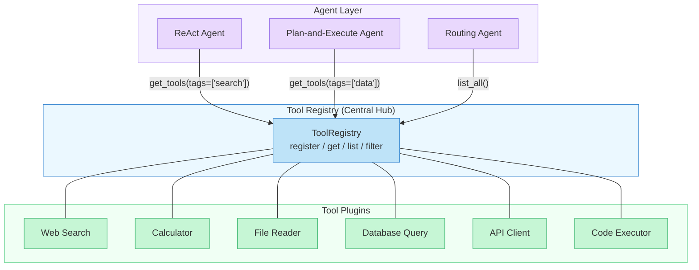

Notice the direction of the arrows. Agents depend on the registry, not on specific tools. Tools register themselves with the registry, not with specific agents. This is the **Dependency Inversion Principle** applied to agent systems -- both the agent and the tools depend on the registry abstraction, not on each other.

## 5.2 Class Structure

Before writing code, let's design the class structure. The registry pattern has three key components: a **Tool** dataclass that wraps each tool's function and metadata, the **ToolRegistry** class that stores and queries tools, and a **decorator** that makes registration effortless.

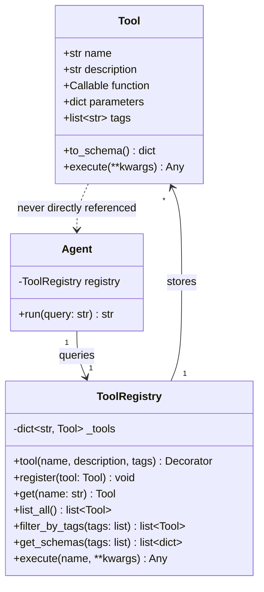

The key design decisions in this diagram:

- **Tool** wraps both the callable function and its metadata (name, description, parameter schema, tags). The `to_schema()` method generates the JSON schema that the LLM expects.
- **ToolRegistry** uses a dictionary internally, keyed by tool name. The `filter_by_tags()` method is what enables dynamic tool selection -- the agent asks for tools by capability, not by name.
- **Agent** holds a reference to the registry, never to individual tools. The dashed line from Tool to Agent means "no direct dependency" -- tools and agents are fully decoupled.

## 5.2 Implementation

Let's build this step by step. We start with the `Tool` dataclass, then the `ToolRegistry`, and finally the decorator that ties them together.

### The Tool Wrapper

**tool.py**

```python
from dataclasses import dataclass, field
from typing import Any, Callable
import inspect


@dataclass
class Tool:
    """Wraps a tool function with its metadata and schema."""
    name: str
    description: str
    function: Callable
    tags: list[str] = field(default_factory=list)
    parameters: dict = field(default_factory=dict)

    def to_schema(self) -> dict:
        """Generate the JSON schema the LLM expects for tool calling."""
        return {
            "type": "function",
            "function": {
                "name": self.name,
                "description": self.description,
                "parameters": {
                    "type": "object",
                    "properties": self.parameters,
                    "required": [
                        k for k, v in self.parameters.items()
                        if "default" not in str(v)
                    ],
                },
            },
        }

    def execute(self, **kwargs) -> Any:
        """Run the tool function with the given arguments."""
        return self.function(**kwargs)
```

The `Tool` dataclass serves as the **single source of truth** for everything the system needs to know about a tool: what it is called, what it does, how to call it, and what categories it belongs to. The `to_schema()` method produces the exact format that LLM APIs expect, so tool authors never have to write raw JSON schemas by hand.

### The Registry

**registry.py**

```python
from typing import Optional


class ToolRegistry:
    """Central registry for dynamic tool management."""

    def __init__(self):
        self._tools: dict[str, Tool] = {}

    def register(self, tool: Tool) -> None:
        """Register a tool. Raises if name is already taken."""
        if tool.name in self._tools:
            raise ValueError(
                f"Tool '{tool.name}' is already registered. "
                f"Use a unique name or unregister it first."
            )
        self._tools[tool.name] = tool

    def tool(
        self,
        name: str,
        description: str,
        tags: Optional[list[str]] = None,
        parameters: Optional[dict] = None,
    ):
        """Decorator that registers a function as a tool.

        Usage:
            @registry.tool(
                name="web_search",
                description="Search the web for information",
                tags=["search", "web"],
                parameters={"query": {"type": "string", "description": "Search query"}},
            )
            def web_search(query: str) -> str:
                ...
        """
        def decorator(func: Callable) -> Callable:
            tool_obj = Tool(
                name=name,
                description=description,
                function=func,
                tags=tags or [],
                parameters=parameters or self._infer_parameters(func),
            )
            self.register(tool_obj)
            return func
        return decorator

    def get(self, name: str) -> Tool:
        """Retrieve a tool by name. Raises KeyError if not found."""
        if name not in self._tools:
            raise KeyError(
                f"Tool '{name}' not found. "
                f"Available: {list(self._tools.keys())}"
            )
        return self._tools[name]

    def list_all(self) -> list[Tool]:
        """Return all registered tools."""
        return list(self._tools.values())

    def filter_by_tags(self, tags: list[str]) -> list[Tool]:
        """Return tools that have at least one of the given tags."""
        return [
            tool for tool in self._tools.values()
            if any(tag in tool.tags for tag in tags)
        ]

    def get_schemas(self, tags: Optional[list[str]] = None) -> list[dict]:
        """Get LLM-ready schemas, optionally filtered by tags."""
        tools = self.filter_by_tags(tags) if tags else self.list_all()
        return [tool.to_schema() for tool in tools]

    def execute(self, name: str, **kwargs) -> Any:
        """Look up a tool by name and execute it."""
        tool = self.get(name)
        return tool.execute(**kwargs)

    def _infer_parameters(self, func: Callable) -> dict:
        """Auto-generate parameter schema from type hints."""
        sig = inspect.signature(func)
        type_map = {str: "string", int: "integer", float: "number", bool: "boolean"}
        params = {}
        for param_name, param in sig.parameters.items():
            hint = param.annotation
            params[param_name] = {
                "type": type_map.get(hint, "string"),
                "description": f"Parameter: {param_name}",
            }
        return params
```

Several design choices are worth calling out:

- **Name uniqueness is enforced.** Registering two tools with the same name raises an error immediately, preventing silent overwrites that would be painful to debug at runtime.
- **Schema inference from type hints.** If you do not provide an explicit `parameters` dict, the decorator inspects the function's type hints and builds a schema automatically. This reduces boilerplate for simple tools.
- **Tag-based filtering uses OR semantics.** A tool matches if it has *any* of the requested tags. This is intentional -- when an agent asks for tools tagged `["search", "web"]`, it wants all search tools and all web tools, not only tools that are both.

### Registering Tools

**register_tools.py**

```python
# Create a shared registry
registry = ToolRegistry()


@registry.tool(
    name="web_search",
    description="Search the web and return relevant results",
    tags=["search", "web", "information"],
    parameters={
        "query": {"type": "string", "description": "The search query"},
        "max_results": {"type": "integer", "description": "Max results to return"},
    },
)
def web_search(query: str, max_results: int = 5) -> str:
    # In production, this calls an actual search API
    return f"Search results for: {query} (top {max_results})"


@registry.tool(
    name="calculator",
    description="Evaluate a mathematical expression",
    tags=["math", "calculation"],
    parameters={
        "expression": {"type": "string", "description": "Math expression to evaluate"},
    },
)
def calculator(expression: str) -> str:
    try:
        result = eval(expression)  # Use a safe parser in production
        return f"Result: {result}"
    except Exception as e:
        return f"Error: {e}"


@registry.tool(
    name="read_file",
    description="Read the contents of a file",
    tags=["filesystem", "data"],
    parameters={
        "path": {"type": "string", "description": "File path to read"},
    },
)
def read_file(path: str) -> str:
    with open(path, "r") as f:
        return f.read()


# Dynamic tool selection in action
search_tools = registry.filter_by_tags(["search"])
math_tools = registry.filter_by_tags(["math"])
all_schemas = registry.get_schemas()
search_schemas = registry.get_schemas(tags=["search"])

print(f"Total tools: {len(registry.list_all())}")       # 3
print(f"Search tools: {len(search_tools)}")              # 1
print(f"Math tools: {len(math_tools)}")                  # 1
print(f"Schemas for LLM: {len(all_schemas)}")            # 3
print(f"Search schemas for LLM: {len(search_schemas)}")  # 1
```

This is the payoff. Adding a new tool is a **single decorator** on the function definition. No dispatch tables to update. No agent code to modify. No import lists to maintain. The decorator co-locates the tool's metadata with its implementation, so they cannot drift out of sync.

## 5.2 Connecting the Registry to an Agent

The registry only becomes useful when an agent queries it. Here is how a ReAct-style agent loop uses the registry to dynamically select and execute tools:

**agent_with_registry.py**

```python
import json
from anthropic import Anthropic


def run_agent(query: str, registry: ToolRegistry, tags: list[str] = None):
    """A minimal agent loop that uses the registry for tool management."""
    client = Anthropic()
    messages = [{"role": "user", "content": query}]

    # Ask the registry for the right tools -- not hardcoded
    tool_schemas = registry.get_schemas(tags=tags)

    while True:
        response = client.messages.create(
            model="claude-sonnet-4-20250514",
            max_tokens=1024,
            tools=tool_schemas,
            messages=messages,
        )

        # Check if the model wants to use a tool
        if response.stop_reason == "tool_use":
            tool_block = next(
                b for b in response.content if b.type == "tool_use"
            )

            # Execute via registry -- no if/elif dispatch
            result = registry.execute(
                tool_block.name, **tool_block.input
            )

            # Feed result back to the model
            messages.append({"role": "assistant", "content": response.content})
            messages.append({
                "role": "user",
                "content": [{
                    "type": "tool_result",
                    "tool_use_id": tool_block.id,
                    "content": str(result),
                }],
            })
        else:
            # Model produced a final text response
            return response.content[0].text


# Use it: give the agent only search tools for a search task
answer = run_agent(
    "What is the weather in Tokyo?",
    registry,
    tags=["search", "web"],
)
```

Compare this to the ad-hoc approach from Module 3, where you would have an `if/elif` chain dispatching tool calls by name. With the registry, the dispatch is a single `registry.execute()` call. The agent does not know or care which tools exist -- it delegates that entirely to the registry.

## 5.2 Why Filtering Matters

You might wonder: why not just give the LLM all the tools every time? The answer comes down to three factors:

**Context window cost.** Every tool schema consumes tokens. With 20 tools, the schemas alone can eat 2,000-3,000 tokens before the conversation even starts. Filtering to 5 relevant tools saves significant context space -- context you need for the actual conversation and reasoning.

**Selection accuracy.** LLMs make better tool choices when presented with fewer, relevant options. Research consistently shows that tool selection accuracy *decreases* as the number of available tools increases. A focused set of 3-5 tools leads to more accurate selections than a sprawling set of 20.

**Security and safety.** Not every tool should be available for every task. A customer support agent should not have access to database deletion tools. Filtering by tags gives you a simple, declarative way to enforce **least privilege** -- the agent only sees the tools it needs for the current task.

> **Connection to Module 3:** In Module 3, you learned to design tool schemas with clear names and descriptions so the LLM can select the right tool. The Tool Registry builds on that foundation by controlling *which* schemas the LLM sees in the first place. Good schema design and good tool filtering work together -- the registry narrows the candidate set, and well-designed schemas help the LLM pick correctly from that set.

## 5.2 Dynamic Loading: Plugins at Runtime

So far, all tools were registered at import time using decorators. But the registry pattern truly shines when tools are loaded **dynamically** -- discovered and registered at runtime from a plugin directory, a configuration file, or even a remote service.

**dynamic_loading.py**

```python
import importlib
import os
from pathlib import Path


def load_plugins(registry: ToolRegistry, plugin_dir: str) -> int:
    """Discover and load tool plugins from a directory.

    Each plugin is a .py file that defines a 'register' function
    accepting a ToolRegistry instance.

    Returns the number of tools loaded.
    """
    plugin_path = Path(plugin_dir)
    loaded = 0

    for file in sorted(plugin_path.glob("*.py")):
        if file.name.startswith("_"):
            continue

        # Import the module dynamically
        spec = importlib.util.spec_from_file_location(
            f"plugins.{file.stem}", file
        )
        module = importlib.util.module_from_spec(spec)
        spec.loader.exec_module(module)

        # Each plugin exposes a register(registry) function
        if hasattr(module, "register"):
            before = len(registry.list_all())
            module.register(registry)
            loaded += len(registry.list_all()) - before
            print(f"Loaded plugin: {file.name} ({len(registry.list_all()) - before} tools)")
        else:
            print(f"Skipping {file.name}: no register() function")

    return loaded


# Example plugin file: plugins/weather_tools.py
# ------------------------------------------------
# def register(registry):
#     @registry.tool(
#         name="get_weather",
#         description="Get current weather for a city",
#         tags=["weather", "search"],
#         parameters={"city": {"type": "string", "description": "City name"}},
#     )
#     def get_weather(city: str) -> str:
#         return f"Weather for {city}: 72F, sunny"
#
#     @registry.tool(
#         name="get_forecast",
#         description="Get 5-day weather forecast",
#         tags=["weather", "search"],
#         parameters={"city": {"type": "string", "description": "City name"}},
#     )
#     def get_forecast(city: str) -> str:
#         return f"5-day forecast for {city}: ..."
```

This **plugin architecture** means you can extend an agent's capabilities without modifying a single line of the agent's code. Drop a new `.py` file into the plugins directory, restart the agent, and the new tools appear automatically. This is the same pattern that frameworks like pytest (plugins), Flask (extensions), and VS Code (extensions) use to achieve extensibility.

## 5.2 When to Use This Pattern

The Tool Registry pattern is valuable when:

- You have **more than three tools** and expect the number to grow
- Different tasks require **different subsets** of tools
- Multiple agents share the **same pool** of tools
- You want to **add tools without modifying** agent code
- You need **runtime control** over which tools are available (e.g., based on user permissions, task type, or environment)

For a simple agent with two or three fixed tools, the overhead of a registry is not justified. Pass the tool list directly. But as soon as your tool count grows or your agents multiply, the registry pays for itself immediately.

## 5.2 Looking Ahead

The Tool Registry handles the "what tools exist" question. But it does not address what happens *around* tool execution -- logging, validation, rate limiting, and error handling. That is the domain of the next lesson: **Middleware and Hooks**. You will learn how to wrap every tool call in a pipeline of interceptors, without modifying the tools themselves or the agent logic.

Further ahead, in Module 7 (Frameworks), you will see that frameworks like LangGraph and CrewAI include built-in tool registries. Understanding the pattern from first principles -- as we have done here -- will let you use those frameworks' registries effectively, extend them when they fall short, and debug them when they behave unexpectedly.

## 5.2 Summary

The **Tool Registry pattern** decouples tool definitions from agent logic by introducing a centralized registry where tools are registered once and discovered dynamically at runtime.

- A **Tool** dataclass wraps each tool's function, metadata, and schema in a single object
- The **ToolRegistry** stores tools by name and supports filtering by **tags** -- enabling agents to request only the tools relevant to the current task
- A **decorator** (`@registry.tool(...)`) co-locates registration metadata with the function definition, making tool registration a single-step operation
- **Tag-based filtering** reduces context window usage, improves LLM tool selection accuracy, and enforces least-privilege access
- **Dynamic loading** from plugin directories enables extensibility without modifying agent code
- The registry replaces ad-hoc `if/elif` dispatch chains with a single `registry.execute()` call, eliminating a common source of bugs when tools are added or removed

In the next lesson, you will learn the **Middleware and Hooks** pattern -- how to intercept every tool call for logging, validation, and transformation without touching the registry or the agent.

---

    Section 5.3: Middleware and Hooks


## 5.3 Overview

In the previous lesson, you built a **Tool Registry** that lets agents discover and select tools dynamically. But registration is only half the story. Once a tool is called, you need to *intercept* that call -- to log it, validate the inputs, enforce rate limits, track costs, or redact sensitive data before it reaches an external API.

If you have worked with web frameworks like Express.js, Django, or FastAPI, this concept will feel familiar. In those frameworks, **middleware** sits between the incoming request and the route handler. Every request passes through a chain of middleware functions that can inspect, transform, or reject the request before it reaches your business logic. The same pattern applies to agent systems, except the "request" is a tool call and the "handler" is the tool function.

This lesson introduces the **middleware and hooks pattern** for agent systems. You will learn how to build a pipeline that wraps every tool invocation, giving you a single place to add cross-cutting concerns without modifying any tool code. This is the pattern that turns scattered `print()` statements and ad-hoc `try/except` blocks into a clean, composable interception layer.

## 5.3 The Middleware Pipeline

The core idea is simple: instead of calling a tool function directly, the agent passes every tool call through an ordered chain of middleware. Each middleware gets a chance to inspect or modify the call before execution (**pre-hooks**) and after execution (**post-hooks**).

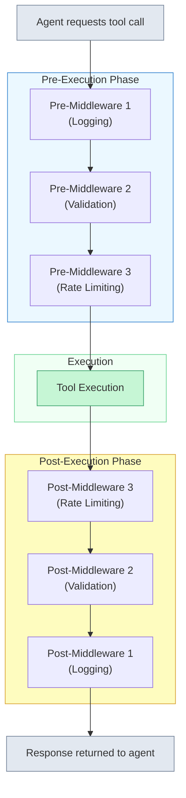

Notice the **onion model**: pre-middleware runs in registration order (1, 2, 3), but post-middleware runs in *reverse* order (3, 2, 1). This means the first middleware registered is the outermost layer -- it sees the raw request first and the final response last. This is identical to how middleware works in Express.js or Django.

Why reverse order for post-hooks? Because each middleware wraps the next one. Logging middleware wraps validation, which wraps rate limiting, which wraps the actual tool call. When the call returns, it "unwinds" back through the layers in the opposite direction. The logging middleware is the first to see the request and the last to see the response -- perfect for measuring total latency including all middleware overhead.

## 5.3 Middleware in Action: A Sequence Diagram

Let's trace a concrete example. An agent calls a `web_search` tool. Three middleware components are registered: a logger, a validator, and a rate limiter.

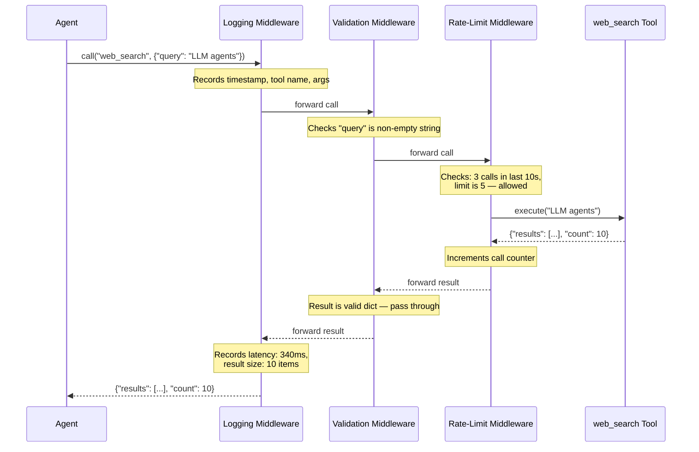

Every tool call passes through this same pipeline. If the rate limiter rejects a call, the tool never executes -- the rate limiter returns an error directly, and that error unwinds back through the validator and logger. The logger still records the attempt, including the fact that it was rate-limited. Nothing is lost.

This is the key insight: **middleware makes the invisible visible**. Without it, you would need to add logging code inside `web_search`, validation code inside `web_search`, and rate-limiting code inside `web_search`. Now multiply that by twenty tools. Middleware lets you write each concern once and apply it to every tool automatically.

## 5.3 Building a Middleware System in Python

Let's implement this pattern. We will define a base middleware class, build three concrete middleware components, and wire them into an executor that runs the pipeline.

**middleware_base.py**

```python
from dataclasses import dataclass, field
from typing import Any, Callable, Optional
import time
import logging

logger = logging.getLogger(__name__)


@dataclass
class ToolCall:
    """Represents a tool invocation passing through the middleware pipeline."""
    tool_name: str
    arguments: dict[str, Any]
    metadata: dict[str, Any] = field(default_factory=dict)


@dataclass
class ToolResult:
    """Represents the outcome of a tool invocation."""
    tool_name: str
    output: Any
    error: Optional[str] = None
    metadata: dict[str, Any] = field(default_factory=dict)


class Middleware:
    """Base class for all middleware. Override before_tool and/or after_tool."""

    def before_tool(self, call: ToolCall) -> Optional[ToolResult]:
        """
        Inspect or modify a tool call before execution.

        Returns:
            None  — proceed to next middleware / tool execution.
            ToolResult — short-circuit: skip the tool and return this result.
        """
        return None

    def after_tool(self, call: ToolCall, result: ToolResult) -> ToolResult:
        """
        Inspect or modify the result after tool execution.

        Always returns a ToolResult (possibly modified).
        """
        return result
```

The contract is straightforward. A **before_tool** hook receives the `ToolCall` and can either let it pass (return `None`) or short-circuit the pipeline by returning a `ToolResult` directly. An **after_tool** hook receives both the call and its result, and returns a (possibly modified) result. This is enough to implement logging, validation, rate limiting, cost tracking, and PII redaction -- all without touching any tool code.

Now let's build three concrete middleware components.

**middleware_implementations.py**

```python
class LoggingMiddleware(Middleware):
    """Logs every tool call: name, arguments, latency, and outcome."""

    def before_tool(self, call: ToolCall) -> Optional[ToolResult]:
        call.metadata["start_time"] = time.time()
        logger.info(
            "Tool call started: %s | args: %s",
            call.tool_name,
            call.arguments,
        )
        return None  # proceed

    def after_tool(self, call: ToolCall, result: ToolResult) -> ToolResult:
        elapsed = time.time() - call.metadata.get("start_time", 0)
        status = "SUCCESS" if result.error is None else "FAILED"
        logger.info(
            "Tool call finished: %s | status: %s | latency: %.3fs",
            call.tool_name,
            status,
            elapsed,
        )
        result.metadata["latency_seconds"] = round(elapsed, 4)
        return result


class ValidationMiddleware(Middleware):
    """Validates tool arguments against expected schemas before execution."""

    def __init__(self, schemas: dict[str, dict]):
        # schemas maps tool_name -> {"required": [...field names...]}
        self.schemas = schemas

    def before_tool(self, call: ToolCall) -> Optional[ToolResult]:
        schema = self.schemas.get(call.tool_name)
        if schema is None:
            return None  # no schema registered, allow

        missing = [
            f for f in schema.get("required", [])
            if f not in call.arguments
        ]
        if missing:
            return ToolResult(
                tool_name=call.tool_name,
                output=None,
                error=f"Missing required fields: {missing}",
            )
        return None  # all required fields present


class RateLimitMiddleware(Middleware):
    """Enforces per-tool call rate limits using a sliding window."""

    def __init__(self, max_calls: int = 5, window_seconds: float = 60.0):
        self.max_calls = max_calls
        self.window_seconds = window_seconds
        self.call_log: dict[str, list[float]] = {}

    def before_tool(self, call: ToolCall) -> Optional[ToolResult]:
        now = time.time()
        window_start = now - self.window_seconds
        # Get recent calls for this tool
        recent = self.call_log.get(call.tool_name, [])
        recent = [t for t in recent if t > window_start]
        self.call_log[call.tool_name] = recent

        if len(recent) >= self.max_calls:
            return ToolResult(
                tool_name=call.tool_name,
                output=None,
                error=(
                    f"Rate limit exceeded: {self.max_calls} calls "
                    f"per {self.window_seconds}s for '{call.tool_name}'"
                ),
            )
        return None  # under the limit, allow

    def after_tool(self, call: ToolCall, result: ToolResult) -> ToolResult:
        # Record the call only if it actually executed
        if result.error is None:
            self.call_log.setdefault(call.tool_name, []).append(time.time())
        return result
```

Notice how each middleware is a self-contained class with no knowledge of the others. The logging middleware does not know about rate limiting. The rate limiter does not know about validation. Each one handles exactly one concern. This is the **separation of concerns** that makes the pattern powerful.

## 5.3 The Middleware Executor

Now we need the engine that runs the pipeline. The **MiddlewareExecutor** accepts a list of middleware, and when a tool is called, it runs each `before_tool` hook in order, executes the tool, then runs each `after_tool` hook in reverse order.

**middleware_executor.py**

```python
class MiddlewareExecutor:
    """Runs a tool call through the full middleware pipeline."""

    def __init__(self):
        self.middlewares: list[Middleware] = []
        self.tools: dict[str, Callable] = {}

    def use(self, middleware: Middleware) -> "MiddlewareExecutor":
        """Register a middleware (order matters — first in, outermost layer)."""
        self.middlewares.append(middleware)
        return self  # allow chaining: executor.use(a).use(b).use(c)

    def register_tool(self, name: str, func: Callable) -> None:
        """Register a tool function by name."""
        self.tools[name] = func

    def execute(self, tool_name: str, arguments: dict[str, Any]) -> ToolResult:
        """Execute a tool call through the middleware pipeline."""
        call = ToolCall(tool_name=tool_name, arguments=arguments)

        # --- Pre-execution phase: run before_tool hooks in order ---
        for mw in self.middlewares:
            short_circuit = mw.before_tool(call)
            if short_circuit is not None:
                # A middleware blocked the call — unwind through
                # post-hooks of already-visited middleware only
                result = short_circuit
                for prev_mw in reversed(self.middlewares[:self.middlewares.index(mw) + 1]):
                    result = prev_mw.after_tool(call, result)
                return result

        # --- Execution phase: call the actual tool ---
        tool_func = self.tools.get(tool_name)
        if tool_func is None:
            result = ToolResult(
                tool_name=tool_name,
                output=None,
                error=f"Unknown tool: {tool_name}",
            )
        else:
            try:
                output = tool_func(**arguments)
                result = ToolResult(tool_name=tool_name, output=output)
            except Exception as e:
                result = ToolResult(
                    tool_name=tool_name,
                    output=None,
                    error=f"{type(e).__name__}: {e}",
                )

        # --- Post-execution phase: run after_tool hooks in REVERSE order ---
        for mw in reversed(self.middlewares):
            result = mw.after_tool(call, result)

        return result
```

Two design decisions are worth noting here. First, when a `before_tool` hook short-circuits (returns a `ToolResult` instead of `None`), the executor still runs the `after_tool` hooks for the middleware layers that already executed. This ensures the logging middleware always records the outcome, even when a deeper middleware blocks the call. Second, the executor catches exceptions from the tool function and wraps them in a `ToolResult` with an error field. This is the same principle you learned in Module 3, Lesson 4 on error handling -- never let an exception crash the agent; always turn it into structured data the LLM can reason about.

## 5.3 Wiring It All Together

Here is how you compose the pieces:

**usage_example.py**

```python
def web_search(query: str) -> dict:
    """Simulated web search tool."""
    return {"results": [f"Result for: {query}"], "count": 1}


def send_email(to: str, subject: str, body: str) -> dict:
    """Simulated email tool."""
    return {"status": "sent", "to": to}


# Build the executor with middleware
executor = MiddlewareExecutor()

executor.use(LoggingMiddleware())
executor.use(ValidationMiddleware(schemas={
    "web_search": {"required": ["query"]},
    "send_email": {"required": ["to", "subject", "body"]},
}))
executor.use(RateLimitMiddleware(max_calls=3, window_seconds=60))

executor.register_tool("web_search", web_search)
executor.register_tool("send_email", send_email)

# Normal call — passes all middleware
result = executor.execute("web_search", {"query": "LLM agents"})
print(result)
# ToolResult(tool_name='web_search', output={'results': [...], 'count': 1}, ...)

# Missing required field — ValidationMiddleware blocks it
result = executor.execute("send_email", {"to": "alice@example.com"})
print(result.error)
# "Missing required fields: ['subject', 'body']"

# After 3 calls — RateLimitMiddleware blocks further calls
for i in range(4):
    r = executor.execute("web_search", {"query": f"search {i}"})
    if r.error:
        print(f"Call {i}: {r.error}")
# Call 3: Rate limit exceeded: 3 calls per 60.0s for 'web_search'
```

Adding a new concern is now a one-line change. Want to track costs? Write a `CostTrackingMiddleware` and call `executor.use(...)`. Want to redact PII before it reaches external APIs? Write a `PIIRedactionMiddleware`. The core agent logic and all existing tool functions remain untouched.

## 5.3 Common Middleware Use Cases

The three middleware components above demonstrate the pattern, but production agents benefit from several more. Here are the most common use cases and when to reach for each one.

**Logging and tracing** -- Record every tool call with its arguments, result, latency, and any errors. This is the foundation of observability. Without it, debugging a misbehaving agent in production means reading LLM conversation logs and guessing what happened. With it, you have a structured audit trail of every action the agent took. These hooks become your observability layer in production -- something you will rely on heavily in Module 11.

**Input validation** -- Check that the LLM-generated arguments actually match the tool's expectations before calling the tool. This catches malformed dates, missing required fields, out-of-range values, and invalid enum choices. It is much cheaper to reject a bad call in middleware than to let it hit an external API and fail with a cryptic error.

**Rate limiting** -- Enforce per-tool or global call limits. This prevents runaway agents from burning through API quotas or getting your account suspended. Especially important for tools that call paid external APIs.

**Cost tracking** -- Record the estimated cost of each tool call (API fees, token usage, compute time) and enforce budgets. A middleware can track cumulative cost and short-circuit when a spending threshold is reached, preventing unexpected bills.

**PII redaction** -- Scan tool arguments for personally identifiable information (names, emails, phone numbers, SSNs) and redact or mask them before the arguments reach the tool function. This is critical for agents handling user data, particularly when tools send data to third-party APIs. A `before_tool` hook can scrub sensitive fields, and an `after_tool` hook can ensure that PII does not leak into logs.

**Retry wrapping** -- Automatically retry failed tool calls with exponential backoff. This middleware catches transient errors (network timeouts, 503 responses) and retries the call a configurable number of times before giving up. This connects directly to what you learned in Module 3, Lesson 4 -- the retry logic lives in middleware now instead of being scattered inside each tool.

> **Design principle:** If you find yourself adding the same logic inside multiple tool functions, that logic belongs in middleware instead. Middleware is the right home for any concern that applies to *all* tools, not just one.

## 5.3 When to Short-Circuit vs. When to Pass Through

A subtle but important design decision in middleware is *when* a `before_tool` hook should block a call versus letting it proceed.

**Short-circuit** (return a `ToolResult`) when:
- The call would violate a hard constraint (rate limit exceeded, budget exhausted)
- Required arguments are missing or invalid
- PII is detected and cannot be safely redacted
- The tool is disabled or deprecated

**Pass through** (return `None`) when:
- The middleware is purely observational (logging, tracing, cost recording)
- The arguments look valid
- The rate limit has not been reached yet

A common mistake is building middleware that is too aggressive about blocking. If your validation middleware rejects calls based on heuristics that are sometimes wrong, the agent will fail on legitimate tool calls and the LLM will not understand why. Keep blocking logic strict and well-defined. Use middleware for observation liberally, but use it for enforcement conservatively.

## 5.3 Connecting to the Bigger Picture

Middleware and hooks do not exist in isolation. They connect to patterns you have already learned and patterns you will learn next.

**Error handling (Module 3, Lesson 4):** In that lesson, you learned to return structured error messages to the LLM instead of crashing. Middleware formalizes this -- the executor wraps tool exceptions in `ToolResult` objects automatically, and middleware like the validator produces clean error messages that the LLM can reason about. If you built ad-hoc error handling before, middleware gives it a permanent, consistent home.

**Tool Registry (Module 5, Lesson 2):** The Tool Registry handles *which* tools exist and *how* they are discovered. Middleware handles *what happens around* each tool call. In a production system, these two patterns work together: the registry resolves the tool, and the executor runs it through the middleware pipeline.

**Context Management (Module 5, Lesson 4, coming next):** Some middleware modifies what goes into the agent's context. A summarization middleware might compress verbose tool results before they are added to the conversation history, helping manage the context window.

**Fallback and Escalation (Module 5, Lesson 5):** When middleware detects repeated failures for a tool, it can signal the fallback chain to switch strategies -- for example, escalating from a fast API to a more reliable but slower alternative.

**Production observability (Module 11):** The logging, cost-tracking, and tracing middleware you build here become the data sources that production monitoring dashboards consume. Structured logs from middleware feed into alerting systems, cost dashboards, and audit trails. You will not need to retrofit observability later because middleware already captures everything. These hooks become your observability layer in production.

## 5.3 Summary

**Middleware and hooks** give you a composable interception layer around every tool call in your agent. Instead of scattering logging, validation, rate limiting, and error handling inside individual tool functions, you write each concern as a self-contained middleware class and register it with the executor.

- The **middleware pipeline** follows the onion model: pre-hooks run in registration order, post-hooks run in reverse order
- A **before_tool** hook can inspect, modify, or short-circuit a tool call; returning `None` means "proceed," returning a `ToolResult` means "stop here"
- An **after_tool** hook can inspect or modify the result after the tool executes
- Common use cases include **logging**, **input validation**, **rate limiting**, **cost tracking**, **PII redaction**, and **retry wrapping**
- Middleware separates **cross-cutting concerns** from business logic -- adding a new concern is a one-line `executor.use(...)` call
- The pattern connects backward to Module 3's error handling and forward to Module 11's production observability

In the next lesson, we move to another critical pattern: **Context Window Management**. As your agents run longer conversations and accumulate tool results, the LLM's context window fills up. You will learn strategies for keeping the most relevant information in context while gracefully handling overflow -- summarization, sliding windows, and priority-based retention.

---

    Section 5.4: Context Window Management


## 5.4 Overview

In the previous lessons, you learned how to organize tools with a registry and intercept actions with middleware. Both patterns assume that the LLM *sees* the information it needs. But what happens when there is too much information to fit?

Every LLM has a **context window** -- a fixed limit on how many tokens it can process in a single request. Think of it as the agent's working memory. Everything the agent knows *right now* must fit inside this window: the system prompt that defines its behavior, the conversation history that tracks what has happened, the tool results it needs to reason about, and enough remaining space for it to generate a response.

For a simple chatbot that answers one question and stops, this is rarely a problem. But agents are not simple chatbots. A ReAct agent that searches the web, reads documents, and iterates through ten reasoning steps can easily accumulate hundreds of thousands of tokens of conversation history. A Plan-and-Execute agent that calls a code analysis tool might receive a single tool result that consumes half the context window. A customer support agent that handles a complex case over fifty messages will eventually run out of room.

When the context window fills up, bad things happen. The API call fails with a token limit error. Or worse, you naively truncate the conversation and the agent forgets critical instructions or earlier decisions, leading to contradictory behavior and loops.

**Context window management** is the design pattern that prevents this. It treats the context window as a scarce resource, allocates budgets to different content categories, and applies strategies to keep the most relevant information visible to the LLM while gracefully evicting or compressing the rest.

## 5.4 Anatomy of the Context Window

Before you can manage the context window, you need to understand what fills it. Every LLM request is composed of distinct content categories, each competing for the same fixed pool of tokens.

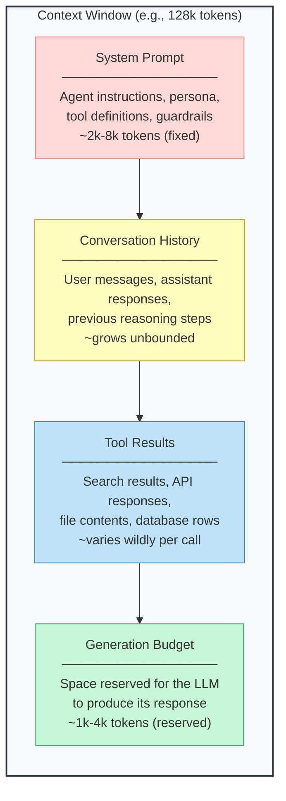

Each category has different characteristics:

- **System prompt** is essentially fixed for the lifetime of the agent. It defines who the agent is, what tools it has, and what rules it follows. You set it once and it occupies the same space every turn. This is your *floor* -- the minimum context you always need.

- **Conversation history** grows with every turn. Each user message, assistant response, and reasoning step adds tokens. In a ReAct agent, a single turn might add hundreds of tokens (thought + action + observation). Over dozens of turns, history can consume the entire window.

- **Tool results** are the wildcard. A web search might return 500 tokens. A code file might return 15,000. A database query might return 50,000. You often cannot predict the size until after the tool runs.

- **Generation budget** is the space you must reserve for the LLM's response. If you fill the context window completely with input tokens, the model has no room to generate output. You need to reserve at least 1,000-4,000 tokens depending on the expected response length.

The fundamental tension is this: the system prompt and generation budget are relatively fixed, but history and tool results grow without bound. Something has to give. The question is *what* gives and *how*.

## 5.4 The Context Budget

The first principle of context management is making the implicit budget explicit. Instead of hoping everything fits and crashing when it does not, you define upfront how tokens are allocated.

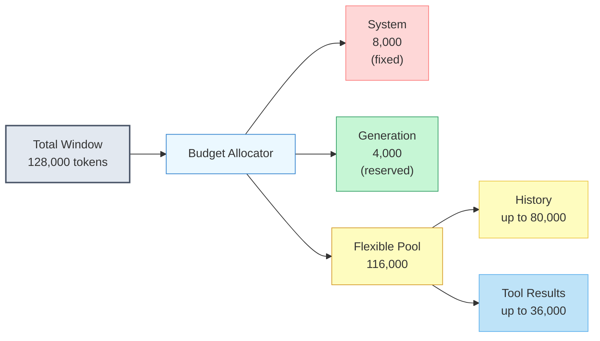

A **token budget** defines hard limits and soft limits for each category:

- **Hard limits** cannot be exceeded. The system prompt always stays. The generation budget is always reserved. These are subtracted first.
- **Soft limits** represent the *maximum* a category can use when there is room. History might be allowed up to 80,000 tokens, but if a large tool result comes in, history gets compressed to make space.
- **The flexible pool** is what remains after hard limits are subtracted. History and tool results share this pool, with a priority system determining who yields when space is tight.

This budgeting approach transforms context management from a reactive "oh no, we exceeded the limit" crash into a proactive allocation problem.

## 5.4 Context Management Strategies

When the flexible pool runs out of space, you need a strategy to reclaim tokens. There are four main strategies, each with different trade-offs. In practice, production agents combine multiple strategies.

### Sliding Window

The simplest strategy. Keep the most recent N messages and drop everything older.

**How it works:** Set a maximum message count or token count for history. When a new message arrives and the limit is exceeded, remove the oldest message. The system prompt is never removed -- only conversation history slides.

**Strengths:** Simple to implement. Predictable memory usage. Works well for short conversations where recent context is all that matters.

**Weaknesses:** Catastrophic information loss. If the user stated a critical requirement in message 3 and the window only holds the last 20 messages, that requirement disappears at message 23. The agent acts as if it was never mentioned. Worse, it does not *know* it lost that information -- it simply behaves inconsistently.

> **When to use:** Prototypes, simple chatbots, or as a *fallback* inside a more sophisticated strategy. Never as the sole strategy for agents that run for many turns.

### Summarization

Replace older messages with a compressed summary that preserves the key information in fewer tokens.

**How it works:** When history exceeds a threshold, take the oldest block of messages (say, the first 20 turns) and pass them to an LLM with a prompt like "Summarize the key decisions, facts, and open questions from this conversation." Replace the 20 messages with the summary, which typically uses 10-20% of the original tokens.

**Strengths:** Preserves semantic content. Critical facts survive even as the raw messages are evicted. The agent "remembers" what happened, just not the exact wording.

**Weaknesses:** Lossy -- subtle details can be dropped. Adds latency and cost (you are making an extra LLM call). Summaries can be inaccurate. Recursive summarization (summarizing summaries) compounds errors.

> **When to use:** Long-running agents where conversation history contains important decisions, requirements, or facts that must persist across many turns.

### Priority-Based Retention

Assign importance scores to messages and evict the least important ones first.

**How it works:** Each message gets a priority score based on its role and content. System messages get the highest priority (never evicted). Messages containing tool results from the current task get high priority. User messages with explicit instructions get medium-high priority. Assistant reasoning steps that led to completed sub-tasks get low priority -- the outcome matters, not the deliberation.

**Strengths:** Intelligent eviction. The most relevant information survives regardless of when it appeared in the conversation. You can encode domain-specific importance rules.

**Weaknesses:** Requires careful priority tuning. Getting the heuristics wrong means evicting important messages. More complex to implement than a simple window.

> **When to use:** Multi-step agents where some turns are clearly more important than others. Particularly effective when combined with summarization -- summarize low-priority blocks, keep high-priority messages verbatim.

### Chunking and Retrieval

Instead of keeping everything in the context window, store messages externally and retrieve only what is relevant to the current step.

**How it works:** As the conversation grows, older messages are moved to an external store (a vector database, a simple list, or even a file). Before each LLM call, a retrieval step identifies which stored messages are relevant to the current query and injects them back into the context. This is essentially **RAG applied to the agent's own conversation history**.

**Strengths:** Scales to arbitrarily long conversations. Only relevant information enters the context, regardless of when it appeared. Memory-efficient.

**Weaknesses:** Retrieval can miss relevant information (recall is imperfect). Adds significant infrastructure complexity. Latency increases with retrieval steps. The agent may behave oddly if retrieval returns messages out of chronological order without proper framing.

> **When to use:** Agents that run for hundreds or thousands of turns. Agents that need to recall specific facts from much earlier in the conversation. Often used alongside summarization -- store detailed messages externally, keep summaries in-context, and retrieve originals on demand.

## 5.4 Strategy Decision Tree

Choosing the right combination of strategies depends on your agent's characteristics. Use this decision tree as a starting point.

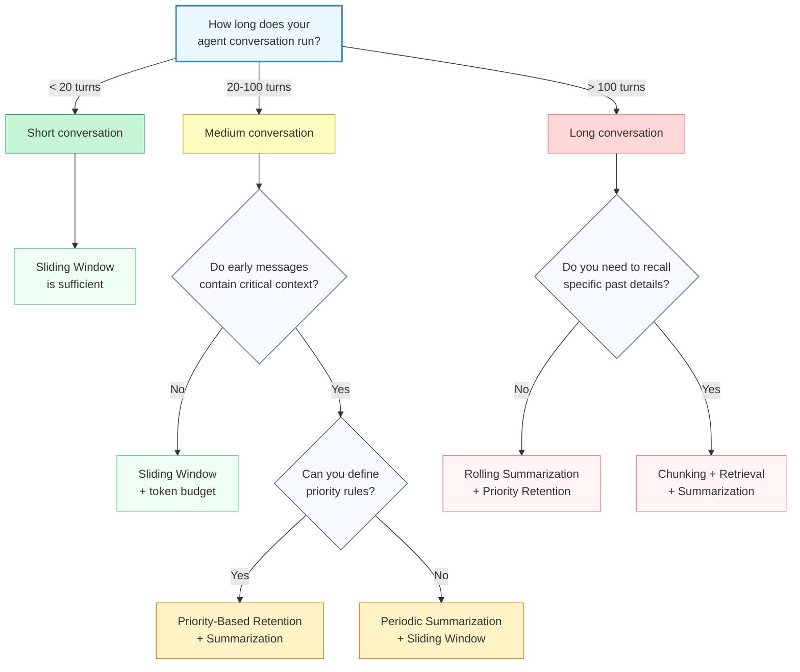

Most production agents land in the middle column: conversations long enough that naive truncation loses information, but not so long that full retrieval infrastructure is justified. Priority-based retention combined with periodic summarization is the sweet spot for the majority of use cases.

## 5.4 Building a Context Manager

Let's put these concepts into code. The following implementation provides a **ContextManager** class that tracks token usage, enforces budgets, and applies strategies automatically.

**context_manager.py**

```python
import tiktoken
from dataclasses import dataclass, field
from enum import Enum
from typing import Optional


class MessagePriority(Enum):
    """Priority levels for context retention."""
    CRITICAL = 4   # System prompt, user instructions -- never evict
    HIGH = 3       # Recent tool results, current task context
    MEDIUM = 2     # User messages, important assistant responses
    LOW = 1        # Completed reasoning steps, old observations
    DISPOSABLE = 0 # Verbose tool output, debug info


@dataclass
class ManagedMessage:
    """A message annotated with context management metadata."""
    role: str
    content: str
    token_count: int
    priority: MessagePriority = MessagePriority.MEDIUM
    turn_number: int = 0
    is_summarizable: bool = True
    summary: Optional[str] = None  # compressed version, if available


@dataclass
class TokenBudget:
    """Defines how the context window is allocated."""
    total_window: int = 128_000
    system_prompt_reserve: int = 8_000
    generation_reserve: int = 4_000
    max_history_tokens: int = 80_000
    max_tool_result_tokens: int = 36_000

    @property
    def flexible_pool(self) -> int:
        return (
            self.total_window
            - self.system_prompt_reserve
            - self.generation_reserve
        )


class ContextManager:
    """Manages the LLM context window as a scarce resource.

    Tracks token usage across content categories, enforces budgets,
    and applies eviction strategies when the window fills up.
    """

    def __init__(
        self,
        budget: Optional[TokenBudget] = None,
        model: str = "gpt-4",
    ):
        self.budget = budget or TokenBudget()
        self.encoder = tiktoken.encoding_for_model(model)
        self.messages: list[ManagedMessage] = []
        self.system_prompt_tokens: int = 0
        self.current_turn: int = 0

    def count_tokens(self, text: str) -> int:
        """Count the number of tokens in a string."""
        return len(self.encoder.encode(text))

    def tokens_used(self) -> int:
        """Total tokens currently in the managed context."""
        return self.system_prompt_tokens + sum(
            m.token_count for m in self.messages
        )

    def tokens_available(self) -> int:
        """Tokens remaining in the flexible pool."""
        used_by_history = sum(m.token_count for m in self.messages)
        return self.budget.flexible_pool - used_by_history

    def set_system_prompt(self, prompt: str) -> None:
        """Register the system prompt and lock its token allocation."""
        self.system_prompt_tokens = self.count_tokens(prompt)
        if self.system_prompt_tokens > self.budget.system_prompt_reserve:
            raise ValueError(
                f"System prompt uses {self.system_prompt_tokens} tokens, "
                f"but budget reserves {self.budget.system_prompt_reserve}."
            )

    def add_message(
        self,
        role: str,
        content: str,
        priority: Optional[MessagePriority] = None,
    ) -> ManagedMessage:
        """Add a message to the context, applying eviction if needed."""
        token_count = self.count_tokens(content)

        # Assign default priority based on role
        if priority is None:
            priority = self._default_priority(role)

        msg = ManagedMessage(
            role=role,
            content=content,
            token_count=token_count,
            priority=priority,
            turn_number=self.current_turn,
        )

        # Check if we need to make room
        while (
            self.tokens_available() < token_count
            and self._has_evictable_messages()
        ):
            self._evict_one()

        if self.tokens_available() < token_count:
            # Still not enough room -- truncate the new message
            content = self._truncate_to_fit(content, self.tokens_available())
            msg.content = content
            msg.token_count = self.count_tokens(content)

        self.messages.append(msg)
        self.current_turn += 1
        return msg

    def get_context(self) -> list[dict]:
        """Return the current context as a list of message dicts."""
        return [
            {"role": m.role, "content": m.content}
            for m in self.messages
        ]

    def get_usage_report(self) -> dict:
        """Return a breakdown of current token usage."""
        history_tokens = sum(
            m.token_count for m in self.messages
            if m.role in ("user", "assistant")
        )
        tool_tokens = sum(
            m.token_count for m in self.messages
            if m.role == "tool"
        )
        return {
            "total_window": self.budget.total_window,
            "system_prompt": self.system_prompt_tokens,
            "history": history_tokens,
            "tool_results": tool_tokens,
            "generation_reserve": self.budget.generation_reserve,
            "used": self.tokens_used(),
            "available": self.tokens_available(),
            "utilization_pct": round(
                self.tokens_used() / self.budget.total_window * 100, 1
            ),
        }

    # ── Private helpers ──────────────────────────────────────────

    def _default_priority(self, role: str) -> MessagePriority:
        """Assign a default priority based on message role."""
        defaults = {
            "system": MessagePriority.CRITICAL,
            "user": MessagePriority.MEDIUM,
            "assistant": MessagePriority.LOW,
            "tool": MessagePriority.HIGH,
        }
        return defaults.get(role, MessagePriority.MEDIUM)

    def _has_evictable_messages(self) -> bool:
        """Check if any messages can be evicted."""
        return any(
            m.priority != MessagePriority.CRITICAL
            for m in self.messages
        )

    def _evict_one(self) -> None:
        """Evict the lowest-priority, oldest message."""
        candidates = [
            (i, m) for i, m in enumerate(self.messages)
            if m.priority != MessagePriority.CRITICAL
        ]
        if not candidates:
            return

        # Sort by priority (ascending), then by turn number (ascending)
        # This evicts the least important, oldest message first
        candidates.sort(key=lambda x: (x[1].priority.value, x[1].turn_number))
        evict_index = candidates[0][0]
        self.messages.pop(evict_index)

    def _truncate_to_fit(self, content: str, max_tokens: int) -> str:
        """Truncate content to fit within a token limit."""
        tokens = self.encoder.encode(content)
        if len(tokens) <= max_tokens:
            return content
        truncated = self.encoder.decode(tokens[:max_tokens - 20])
        return truncated + "\\n... [truncated to fit context window]"
```

Let's walk through the key design decisions:

- **Token counting uses tiktoken**, the same tokenizer the model uses. Estimating token counts with character-based heuristics (like "4 characters per token") leads to budget overruns. Always count exactly.
- **Priority is assigned by default based on role**, but callers can override it. This lets the agent mark specific messages as critical ("the user just gave a new requirement") or disposable ("this was a verbose debug dump").
- **Eviction is priority-first, age-second.** A disposable message from turn 50 is evicted before a medium-priority message from turn 5. Within the same priority, older messages go first.
- **Truncation is the last resort.** If evicting all evictable messages still does not free enough space, the incoming message itself is truncated. This preserves the beginning of tool results (which usually contain the most relevant information) and appends a marker so the agent knows the content was cut.

## 5.4 Using the Context Manager

Here is how you wire the context manager into an agent loop.

**agent_with_context.py**

```python
from context_manager import ContextManager, TokenBudget, MessagePriority


def run_agent(user_query: str, tools: dict) -> str:
    """A ReAct agent loop with context management."""

    budget = TokenBudget(
        total_window=128_000,
        system_prompt_reserve=6_000,
        generation_reserve=4_000,
        max_history_tokens=90_000,
        max_tool_result_tokens=28_000,
    )
    ctx = ContextManager(budget=budget)

    system_prompt = "You are a research assistant. Use tools to answer questions."
    ctx.set_system_prompt(system_prompt)

    # User input is medium priority by default
    ctx.add_message("user", user_query)

    for step in range(20):  # max 20 reasoning steps
        # Build the LLM request from managed context
        messages = [
            {"role": "system", "content": system_prompt},
            *ctx.get_context(),
        ]

        response = call_llm(messages)

        if response.is_final_answer:
            return response.content

        # Assistant reasoning -- mark as LOW priority (evictable)
        ctx.add_message(
            "assistant",
            response.content,
            priority=MessagePriority.LOW,
        )

        # Tool results -- mark as HIGH priority (recent results matter)
        tool_result = execute_tool(response.tool_call, tools)
        ctx.add_message(
            "tool",
            tool_result,
            priority=MessagePriority.HIGH,
        )

        # Log context health every 5 steps
        if step % 5 == 0:
            report = ctx.get_usage_report()
            print(
                f"Step {step}: {report['utilization_pct']}% context used, "
                f"{report['available']} tokens available"
            )

    return "Max steps reached without a final answer."
```

Notice the priority assignments: the agent's intermediate reasoning steps are marked LOW because once a step leads to a tool call and its result, the reasoning that *led* to that decision is less important than the result itself. The tool results are HIGH because they contain the facts the agent needs to reason about *now*. If the context fills up, old reasoning steps are evicted first, preserving the factual tool outputs.

## 5.4 Adding Summarization

The basic context manager evicts messages entirely. A more sophisticated approach summarizes them before eviction, preserving their semantic content in fewer tokens.

**summarizing_context.py**

```python
class SummarizingContextManager(ContextManager):
    """Extends ContextManager with LLM-based summarization."""

    def __init__(self, summarizer_fn, **kwargs):
        super().__init__(**kwargs)
        self.summarizer_fn = summarizer_fn
        self.summary_threshold = 0.75  # summarize at 75% utilization

    def add_message(self, role, content, priority=None):
        """Add a message, triggering summarization if needed."""
        utilization = self.tokens_used() / self.budget.flexible_pool

        if utilization > self.summary_threshold:
            self._summarize_old_messages()

        return super().add_message(role, content, priority)

    def _summarize_old_messages(self) -> None:
        """Summarize the oldest block of low-priority messages."""
        # Find messages eligible for summarization
        eligible = [
            (i, m) for i, m in enumerate(self.messages)
            if m.is_summarizable
            and m.priority.value <= MessagePriority.MEDIUM.value
            and m.summary is None  # not already summarized
        ]

        if len(eligible) < 5:
            return  # not enough messages to justify summarization

        # Take the oldest block of eligible messages
        block = eligible[:10]
        block_content = "\\n".join(
            f"[{m.role}]: {m.content}" for _, m in block
        )

        # Call the summarizer (an LLM call)
        summary = self.summarizer_fn(block_content)
        summary_tokens = self.count_tokens(summary)

        # Replace the block with a single summary message
        indices_to_remove = [i for i, _ in block]
        for i in sorted(indices_to_remove, reverse=True):
            self.messages.pop(i)

        summary_msg = ManagedMessage(
            role="system",
            content=f"[Summary of earlier conversation]\\n{summary}",
            token_count=summary_tokens,
            priority=MessagePriority.HIGH,
            turn_number=block[0][1].turn_number,
            is_summarizable=False,  # don't re-summarize summaries
        )
        self.messages.insert(0, summary_msg)
```

Two important details in this implementation:

- **Summaries are marked `is_summarizable=False`** to prevent recursive summarization. Summarizing a summary compounds information loss and can produce nonsensical results after a few rounds.
- **Summarization triggers proactively at 75% utilization**, not reactively when the window is full. This avoids the latency spike of summarizing a large block right when the agent needs to respond quickly.

## 5.4 Token Counting: Getting It Right

Token counting is the foundation that everything else depends on. If your counts are wrong, your budgets are wrong, and your eviction strategies fire too early or too late.

**token_counting.py**

```python
import tiktoken


def count_tokens_for_messages(
    messages: list[dict],
    model: str = "gpt-4",
) -> int:
    """Count tokens for a list of chat messages.

    Accounts for the per-message overhead that chat models add
    (role tokens, separators, etc.), not just the content tokens.
    """
    encoder = tiktoken.encoding_for_model(model)

    # Every message has overhead: role, separators, etc.
    # This varies by model but 4 tokens per message is typical
    PER_MESSAGE_OVERHEAD = 4
    REPLY_PRIMER = 3  # tokens for the reply priming

    total = 0
    for msg in messages:
        total += PER_MESSAGE_OVERHEAD
        total += len(encoder.encode(msg["role"]))
        total += len(encoder.encode(msg["content"]))

    total += REPLY_PRIMER
    return total


# Example: see exactly where your tokens go
messages = [
    {"role": "system", "content": "You are a helpful assistant."},
    {"role": "user", "content": "What is the capital of France?"},
    {"role": "assistant", "content": "The capital of France is Paris."},
]

total = count_tokens_for_messages(messages)
print(f"Total tokens: {total}")
# Total tokens: 36
```

A common mistake is counting only the `content` tokens and ignoring the **per-message overhead** -- the tokens the model uses for role markers, separators, and message boundaries. For a conversation with 100 messages, this overhead alone can be 400+ tokens. Ignore it and your budget calculations silently drift.

## 5.4 Common Pitfalls

**Pitfall 1: Evicting the system prompt.** Never. The system prompt defines the agent's behavior. Evicting it turns your carefully designed agent into a generic chatbot. Always mark it as CRITICAL.

**Pitfall 2: Summarizing too aggressively.** If you summarize after every 5 messages, you spend more tokens (and latency) on summarization calls than you save. Summarize in batches -- 10-20 messages at a time -- and only when utilization crosses a threshold.

**Pitfall 3: Ignoring tool result size.** A single tool call can return tens of thousands of tokens. If your context manager does not account for tool results, a large API response can blow through your budget in one turn. Always check tool result size *before* inserting it and truncate if necessary.

**Pitfall 4: Not reserving generation space.** If you fill the context window to 99% with input tokens, the model has almost no room to respond. It may produce truncated or incoherent output. Always reserve a generation budget and treat it as a hard limit.

## 5.4 Connection to Memory Systems

Context window management handles the agent's *short-term* working memory -- what is visible in the current LLM call. But what about information that was evicted? What about facts the agent learned in a previous conversation entirely?

This is where **memory systems** come in, which you will explore in depth in Module 6. Memory systems provide *long-term storage* that persists beyond the context window and across conversations. The context manager and memory system work together:

- The **context manager** decides what stays in the window and what gets evicted
- The **memory system** stores what was evicted so it can be retrieved later
- At the start of each turn, the context manager can *query* the memory system to pull in relevant information from past conversations

Think of it like human cognition: your context window is your conscious attention (limited, focused, fast), while your memory system is your long-term memory (vast, associative, requires recall). A well-designed agent uses both.

> **Key insight:** Context management and memory are two sides of the same coin. Context management controls what the agent is thinking about *right now*. Memory controls what the agent *can* think about when prompted. Neither is sufficient alone.

## 5.4 Summary

The context window is the agent's working memory -- a fixed-size budget that must hold everything the agent needs to reason about. Managing it well is the difference between agents that handle complex, multi-step tasks and agents that crash or forget critical information midway through.

- The context window is divided into four categories: **system prompt** (fixed), **conversation history** (grows), **tool results** (variable), and **generation budget** (reserved)
- A **token budget** makes allocation explicit, giving each category a guaranteed share and defining a flexible pool for history and tool results
- **Sliding window** is simple but loses information indiscriminately -- suitable only for short conversations or as a fallback
- **Summarization** compresses older messages, preserving semantic content at 10-20% of the original token cost
- **Priority-based retention** assigns importance scores and evicts the least important messages first, keeping critical context regardless of age
- **Chunking and retrieval** scales to very long conversations by storing messages externally and retrieving relevant ones on demand
- Most production agents combine **priority-based retention with periodic summarization** for the best balance of simplicity and information preservation
- Always **count tokens exactly** using the model's tokenizer, including per-message overhead
- Always **reserve generation space** -- a full context window with no room for output produces truncated or broken responses

In the next lesson, we explore **Fallback and Escalation Chains** -- what happens when a tool call fails, a model cannot handle a query, or the agent reaches the limits of what automation can solve. You will learn to build cascading strategies that degrade gracefully instead of failing catastrophically.

---

    Section 5.5: Fallback and Escalation Chains


## 5.5 Overview

In Module 3 Lesson 04, you learned how to handle tool failures with retries, backoff, and fallback tools -- when one tool fails, try an alternative that achieves the same goal through a different method. That pattern keeps your agent running when individual tools break.

But tool failures are not the only kind of problem. Sometimes the tool works fine, but the *model* is not capable enough. A fast, cheap model might misunderstand a nuanced query. A single model tier might produce a low-confidence answer on a complex question. And sometimes, no model is sufficient -- the decision requires human judgment, policy expertise, or access to information the agent does not have.

This lesson introduces **fallback and escalation chains** -- a pattern for cascading requests from fast and cheap resources to slow and powerful ones, and ultimately to human operators when automation is not enough. This is the design pattern that controls *who handles what*, and it is the key to building agents that are both cost-effective and reliable.

## 5.5 Model Cascading

The simplest form of escalation is **model cascading**: routing a request through progressively more capable (and more expensive) LLMs until one produces a satisfactory result.

The idea is straightforward. Most requests are easy. A small, fast model like Claude Haiku handles them in milliseconds at minimal cost. But some requests are harder -- they need the reasoning depth of Claude Sonnet. And a few requests are genuinely complex, requiring the full capability of Claude Opus. Instead of always using the most powerful model (expensive, slow) or always using the cheapest model (fast but sometimes wrong), you cascade through them.

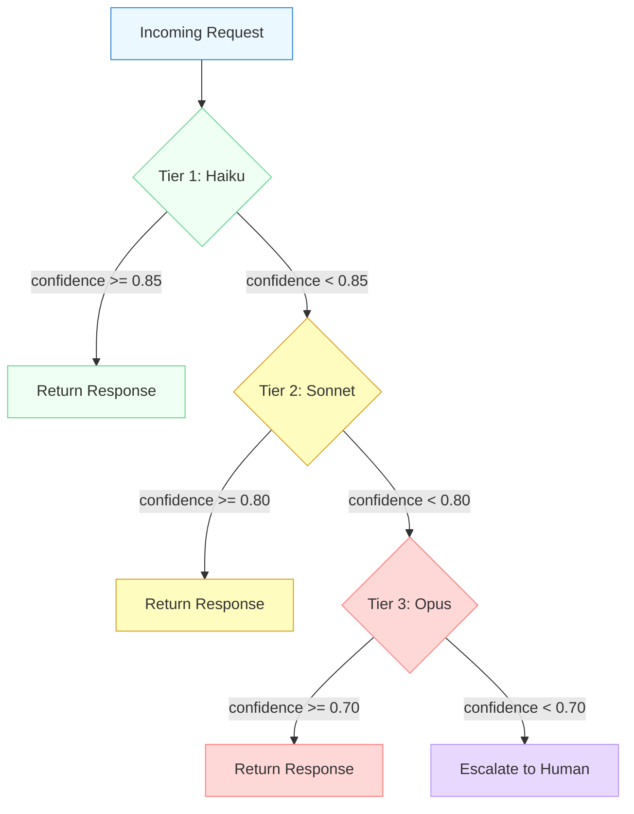

There are two critical design decisions in any cascade: **what triggers escalation**, and **how you measure confidence**.

**Triggering escalation** can be based on several signals. The model can self-report confidence (by asking it to rate its own certainty). You can use output validation -- if the response fails a format check or contains hedging language ("I'm not sure", "it might be"), escalate. You can use task complexity heuristics -- long queries, multi-step reasoning, or domain-specific jargon might skip directly to a higher tier. In practice, combining these signals works better than relying on any single one.

**Measuring confidence** is an active area of research. One practical approach is to ask the model to return a confidence score alongside its answer. Another is to run a lightweight classifier on the response to detect uncertainty markers. The key insight is that the confidence threshold should *decrease* as you move up the cascade -- you demand high confidence from the cheap model (only accept its answer if it is very sure) but accept lower confidence from the expensive model (because there is nowhere better to escalate to, except a human).

## 5.5 Confidence-Based Routing in Practice

Here is a complete implementation of a model cascade with confidence-based routing. The cascade tries each tier in order, extracts a confidence score from the model's response, and escalates if confidence falls below the tier's threshold.

**model_cascade.py**

```python
import anthropic
import json
from dataclasses import dataclass

client = anthropic.Anthropic()


@dataclass
class TierResult:
    """Result from a single tier in the cascade."""
    tier: str
    model: str
    response: str
    confidence: float
    escalated: bool


@dataclass
class CascadeResult:
    """Final result from the full cascade."""
    response: str
    confidence: float
    resolved_by: str       # "haiku", "sonnet", "opus", or "human"
    tiers_tried: list      # audit trail of every tier attempted
    total_cost_estimate: float


# Each tier: model ID, confidence threshold, cost per 1K input tokens
CASCADE_TIERS = [
    {
        "name": "haiku",
        "model": "claude-haiku-4-20250514",
        "threshold": 0.85,
        "cost_per_1k_input": 0.001,
    },
    {
        "name": "sonnet",
        "model": "claude-sonnet-4-20250514",
        "threshold": 0.80,
        "cost_per_1k_input": 0.003,
    },
    {
        "name": "opus",
        "model": "claude-opus-4-20250514",
        "threshold": 0.70,
        "cost_per_1k_input": 0.015,
    },
]

CONFIDENCE_PROMPT = \"\"\"Answer the user's question, then rate your confidence.

Respond in JSON with exactly two keys:
- "answer": your response to the question
- "confidence": a float between 0.0 and 1.0

Confidence guidelines:
- 0.9-1.0: You are certain and the answer is factual/well-established
- 0.7-0.89: You are fairly confident but the topic has nuance
- 0.5-0.69: You are uncertain -- the question is ambiguous or complex
- Below 0.5: You are guessing or the question is outside your knowledge\"\"\"


def call_tier(question: str, tier: dict) -> TierResult:
    """Call a single model tier and extract its confidence."""
    response = client.messages.create(
        model=tier["model"],
        max_tokens=1024,
        system=CONFIDENCE_PROMPT,
        messages=[{"role": "user", "content": question}],
    )

    text = response.content[0].text
    try:
        parsed = json.loads(text)
        answer = parsed["answer"]
        confidence = float(parsed["confidence"])
    except (json.JSONDecodeError, KeyError, ValueError):
        # If the model does not return valid JSON, treat as low confidence
        answer = text
        confidence = 0.0

    escalated = confidence < tier["threshold"]

    return TierResult(
        tier=tier["name"],
        model=tier["model"],
        response=answer,
        confidence=confidence,
        escalated=escalated,
    )


def cascade(question: str) -> CascadeResult:
    """Run a question through the model cascade."""
    tiers_tried = []
    total_cost = 0.0

    for tier in CASCADE_TIERS:
        result = call_tier(question, tier)
        tiers_tried.append(result)

        # Rough cost estimate (actual cost depends on token count)
        total_cost += tier["cost_per_1k_input"] * 2  # estimate ~2K tokens

        if not result.escalated:
            return CascadeResult(
                response=result.response,
                confidence=result.confidence,
                resolved_by=result.tier,
                tiers_tried=tiers_tried,
                total_cost_estimate=total_cost,
            )

    # All automated tiers exhausted -- escalate to human
    best_result = max(tiers_tried, key=lambda r: r.confidence)
    return CascadeResult(
        response=f"[NEEDS HUMAN REVIEW] Best automated answer "
                 f"(confidence {best_result.confidence:.0%}): "
                 f"{best_result.response}",
        confidence=best_result.confidence,
        resolved_by="human",
        tiers_tried=tiers_tried,
        total_cost_estimate=total_cost,
    )


# --- Usage ---
if __name__ == "__main__":
    easy = cascade("What is the capital of France?")
    print(f"Easy Q resolved by: {easy.resolved_by}")
    # Likely: "haiku" (high confidence, no escalation)

    hard = cascade(
        "Compare the trade-offs of eventual consistency vs. strong "
        "consistency in distributed agent memory systems."
    )
    print(f"Hard Q resolved by: {hard.resolved_by}")
    print(f"Tiers tried: {[t.tier for t in hard.tiers_tried]}")
    # Likely: "sonnet" or "opus" (lower confidence triggers escalation)
```

A few things to notice in this implementation:

- The **confidence threshold decreases** at each tier (0.85, 0.80, 0.70). You are strict with the cheap model and lenient with the expensive one.
- Every tier result is recorded in `tiers_tried`, creating an **audit trail**. When you get to Module 11's monitoring and cost lessons, this trail becomes invaluable for understanding where your budget goes.
- When JSON parsing fails, confidence defaults to 0.0 -- this is a **safe failure mode** that forces escalation rather than silently accepting a bad response.
- The `resolved_by` field tells the caller which tier handled the request. This is the metric you will track in production to tune your thresholds.

## 5.5 Tool Fallbacks vs. Model Escalation

It is worth pausing to clarify how this pattern relates to the tool fallback pattern from Module 3 Lesson 04.

**Tool fallbacks** (Module 3) handle the case where a tool *breaks*. The search API returns a 500 error, so you try a different search API. The primary database is down, so you query the read replica. The tool's *function* stays the same -- you are just finding a different way to achieve it.

**Model escalation** (this lesson) handles the case where the model is not *capable enough*. The tool works fine, but the model's answer is not good enough. You are not switching tools -- you are switching the brain that reasons about the results.

In a well-designed agent, both patterns coexist. A request might first cascade through models (escalation), and within each model tier, a failed tool call might trigger a tool fallback. They operate at different layers of the system.

## 5.5 The Escalation Sequence

Let's trace a concrete scenario to see how escalation works end-to-end. A customer support agent receives a complex billing dispute. Watch how the request flows through the cascade.

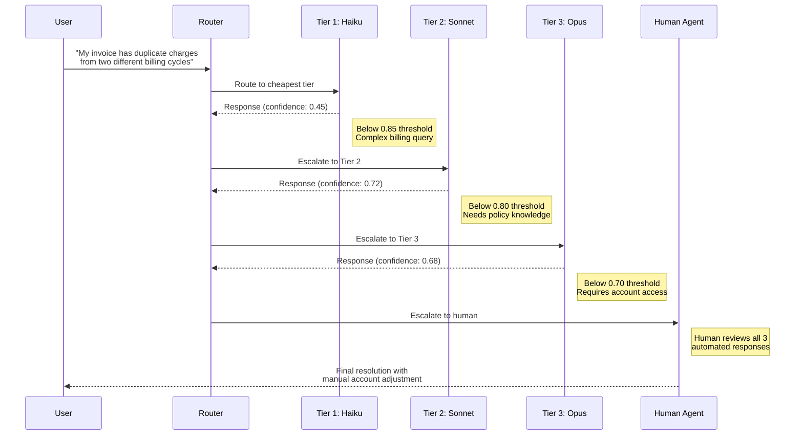

This sequence reveals something important: when the request finally reaches a human, the human does not start from scratch. They have three automated responses to review, each with a confidence score. The Opus response (68% confidence) is probably mostly correct -- the human just needs to verify and authorize the account adjustment. The cascade has not just escalated the request; it has *pre-processed* it, saving the human significant effort.

## 5.5 Human-in-the-Loop Escalation

The final tier of any escalation chain is a human. Designing this handoff well is the difference between a system that frustrates operators and one that makes them more productive.

**When to escalate to a human:**

- All automated tiers have been tried and confidence remains below threshold
- The request involves **high-stakes decisions** -- financial transactions, account deletions, legal implications
- The agent detects **ambiguity** it cannot resolve -- contradictory instructions, missing context, policy edge cases
- Safety guardrails are triggered -- the request touches sensitive topics or the response might cause harm

**What to include in the escalation:**

- The original user request
- Every automated response with its confidence score
- The specific reason for escalation (low confidence, safety trigger, policy gap)
- Relevant context the agent has gathered (tool results, conversation history)

**What to avoid:**

- Do not make the human re-do work the agent already completed. If Opus produced a 68% confidence answer, show it to the human as a starting point.
- Do not escalate silently. Tell the user their request is being reviewed by a human and give an estimated response time.
- Do not treat escalation as failure. Knowing when *not* to answer autonomously is a feature of a well-designed agent, not a deficiency.

**escalation.py**

```python
from dataclasses import dataclass, field
from enum import Enum
from datetime import datetime


class EscalationReason(Enum):
    LOW_CONFIDENCE = "low_confidence"
    HIGH_STAKES = "high_stakes"
    SAFETY_TRIGGER = "safety_trigger"
    POLICY_GAP = "policy_gap"
    USER_REQUESTED = "user_requested"


@dataclass
class EscalationTicket:
    """Structured handoff to a human operator."""
    user_query: str
    reason: EscalationReason
    automated_responses: list       # TierResult objects from the cascade
    context: dict                   # tool results, conversation history
    priority: str = "normal"        # "low", "normal", "high", "critical"
    created_at: str = field(
        default_factory=lambda: datetime.utcnow().isoformat()
    )

    def summary_for_human(self) -> str:
        """Format the ticket for human review."""
        lines = [
            f"=== Escalation: {self.reason.value} ===",
            f"Priority: {self.priority}",
            f"Time: {self.created_at}",
            f"",
            f"User asked: {self.user_query}",
            f"",
            f"--- Automated Attempts ---",
        ]
        for resp in self.automated_responses:
            lines.append(
                f"[{resp.tier}] confidence={resp.confidence:.0%}: "
                f"{resp.response[:200]}..."
            )
        lines.append("")
        lines.append("Please review and respond to the user.")
        return "\\n".join(lines)


def should_escalate_to_human(
    cascade_result,
    high_stakes_keywords=None,
) -> EscalationReason | None:
    """Decide whether a cascade result needs human review."""
    high_stakes_keywords = high_stakes_keywords or [
        "delete", "refund", "cancel", "legal", "compliance",
    ]

    # All tiers exhausted
    if cascade_result.resolved_by == "human":
        return EscalationReason.LOW_CONFIDENCE

    # High-stakes check even if a model answered confidently
    query_lower = cascade_result.response.lower()
    if any(kw in query_lower for kw in high_stakes_keywords):
        return EscalationReason.HIGH_STAKES

    return None  # No escalation needed
```

Notice the `HIGH_STAKES` check -- even when a model answers with high confidence, certain topics should always get human review. A model might be 95% confident about how to process a refund, but company policy might require human authorization for all refunds above a certain amount. Confidence-based routing and policy-based routing work together.

## 5.5 Designing Effective Escalation Chains

Building a cascade is straightforward. Building a *good* cascade takes thought. Here are the design principles that separate effective chains from ones that waste money or frustrate users.

**Principle 1: Match tiers to task difficulty distribution.** Before choosing thresholds, analyze your request distribution. If 80% of requests are simple lookups, a cheap model with a high threshold will handle most traffic at minimal cost. If 50% of requests are complex reasoning tasks, starting with a cheap model wastes latency -- you are better off starting at a middle tier or using a complexity classifier to skip tiers.

**Principle 2: Make thresholds tunable, not hardcoded.** Your initial thresholds will be wrong. In production, you will tune them based on actual resolution rates. Store thresholds in configuration, not in code. Track the distribution of which tier resolves each request and adjust. Module 11 Lesson 06 covers the monitoring infrastructure you need for this.

**Principle 3: Add circuit breakers at each tier.** If Haiku starts returning errors (API outage, rate limit), skip it and go directly to Sonnet. Do not waste time and tokens waiting for a tier that is down. This connects directly to the reliability patterns you will see in Module 11 Lesson 04.

**Principle 4: Preserve context across tiers.** When escalating from Haiku to Sonnet, pass the original request -- not Haiku's response. Each tier should reason from the source material, not from a potentially flawed lower-tier answer. However, *do* pass the lower-tier confidence score as metadata so the higher tier understands why it was called.

> **Key takeaway:** The goal of an escalation chain is not to try everything. It is to find the cheapest resource that can handle the request *well enough*, and to know when "well enough" requires a human.

## 5.5 Connecting the Patterns

Fallback and escalation chains do not exist in isolation. They work with the other patterns from this module:

- **Tool Registry** (Lesson 02): The cascade itself can be registered as a "meta-tool" in the registry, so agents invoke it like any other capability.
- **Middleware and Hooks** (Lesson 03): Middleware can log every escalation, track tier resolution rates, and enforce rate limits per tier.
- **Context Management** (Lesson 04): When escalating, you may need to summarize the conversation so far to fit the higher-tier model's context window -- especially if earlier tiers consumed tokens on failed attempts.
- **Checkpointing** (next lesson): If an escalation to a human takes hours or days, checkpointing ensures the agent can resume the conversation when the human responds, without losing state.

And looking ahead to Module 11: the cascade's `tiers_tried` audit trail feeds directly into the cost monitoring and optimization infrastructure you will build there. Every escalation is a data point that helps you tune thresholds, identify patterns in what gets escalated, and measure the true cost per resolution.

## 5.5 Summary

Fallback and escalation chains give your agent the ability to match the right resource to each request -- cheap and fast for easy tasks, powerful and expensive for hard ones, and human when automation is not enough.

- **Model cascading** routes requests through progressively more capable models (Haiku, Sonnet, Opus), stopping at the first tier that meets its confidence threshold
- **Confidence-based routing** uses self-reported confidence scores (or output validation) to decide whether to accept an answer or escalate
- **Confidence thresholds decrease** as you move up the cascade -- strict with cheap models, lenient with expensive ones
- **Tool fallbacks** (Module 3 Lesson 04) and **model escalation** (this lesson) operate at different layers: tool fallbacks swap implementations, model escalation swaps reasoning capability
- **Human-in-the-loop** is the final escalation tier -- it should receive pre-processed context, not raw requests, so humans augment the agent rather than replace it
- Design cascades with **tunable thresholds**, **circuit breakers**, and **audit trails** to enable the production monitoring and cost optimization covered in Module 11

In the next lesson, you will learn **Idempotency and Checkpointing** -- how to make agent actions safe to retry and how to save state so that long-running workflows (including those waiting on human escalation) can survive crashes and resume exactly where they left off.

---

    Section 5.6: Idempotency and Checkpointing


## 5.6 Overview

In the previous lesson, you learned how **fallback and escalation chains** handle failures gracefully by cascading through alternative strategies. But there is a class of failure that fallbacks alone cannot solve: the crash in the middle.

Imagine a Plan-and-Execute agent that is six steps into an eight-step research task. It has spent two minutes and dozens of API calls gathering data, comparing options, and building a structured analysis. Then the process crashes -- a network timeout, a server restart, an out-of-memory error. When the agent restarts, what happens? Without any preparation, it starts over from step one. All that work is lost. All those API calls are repeated. All that time is wasted.

Now imagine a worse scenario. The agent was in the middle of step five when it crashed -- a step that sends an email to a customer. Did the email go out? Maybe. If the agent retries step five, will it send a *second* email? Possibly. The customer gets a duplicate message. That is not just a waste of resources -- it is a user-facing bug.

These two problems have names. **Idempotency** means that performing the same action twice produces the same result as performing it once -- making retries safe. **Checkpointing** means saving the agent's state at key points so it can resume from where it left off instead of starting over. Together, they make agent systems resilient to the failures that inevitably happen in distributed, long-running processes.

## 5.6 Why Agents Need Both

Traditional software can often get away without these patterns. A web server handles a request in milliseconds -- if it crashes, the user just refreshes the page. But agents are different. Agent tasks run for seconds to hours, involve multiple LLM calls and tool invocations, accumulate state across steps, and interact with external systems that have real consequences.

This combination makes agents uniquely vulnerable to partial failures. A crash does not just lose a computation -- it can leave the world in an inconsistent state. An agent that was halfway through creating a database table, sending a notification, and updating a record might have completed the first action but not the other two. Restarting from scratch might try to create the table again and fail because it already exists.

Idempotency and checkpointing address the two sides of this problem:

- **Idempotency** answers: "Is it safe to retry this action?" If yes, the agent can attempt it again without worrying about duplicate side effects.
- **Checkpointing** answers: "Where was I?" It lets the agent skip actions that already completed successfully and resume from the point of failure.

> **Connection to Module 4:** The **Plan-and-Execute** architecture benefits most from checkpointing. Its ordered step list with accumulated results is a natural fit -- each completed step is a checkpoint. Without checkpointing, a crash at step six of eight loses steps one through five. With it, the agent reloads the checkpoint and picks up at step six. ReAct agents also benefit, but their step-by-step nature means each checkpoint captures less accumulated work.

## 5.6 Idempotency: Making Actions Safe to Retry

An action is **idempotent** if executing it once or executing it multiple times has the same effect on the system. This is not the same as returning the same value -- it means the *side effects* are identical.

Some operations are naturally idempotent:

- **Setting a value**: "Set the user's name to Alice" produces the same result whether you do it once or ten times.
- **Reading data**: "Get the current temperature" has no side effects at all.
- **Upserting a record**: "Insert this record if it does not exist; otherwise update it" converges to the same state.

Other operations are **not** idempotent by default:

- **Incrementing a counter**: "Add 1 to the total" produces different results each time.
- **Sending a message**: "Email the user a confirmation" sends duplicates on retry.
- **Appending to a list**: "Add this item to the log" creates duplicate entries.

The key technique for making non-idempotent operations idempotent is the **idempotency key** -- a unique identifier for each intended action. Before performing the action, you check whether an action with that key has already been completed. If it has, you skip it and return the previous result.

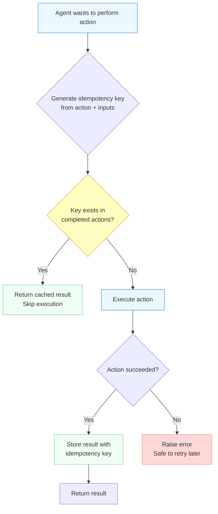

The flowchart shows the idempotency pattern. Every action starts by generating a unique key from the action type and its inputs. If that key already exists in the completed actions store, the action was already performed -- return the cached result without executing again. If the key does not exist, execute the action. On success, store the result keyed by the idempotency key. On failure, raise the error -- the action can be safely retried because no partial result was recorded.

## 5.6 Checkpointing: Saving State for Recovery

While idempotency makes individual actions safe to retry, **checkpointing** makes entire agent runs safe to resume. A checkpoint is a snapshot of the agent's state at a specific point in execution -- enough information to reconstruct where the agent was and what it had accomplished.

A good checkpoint captures:

- **The current step** -- which step the agent is about to execute (or just completed)
- **Accumulated results** -- the outputs of all completed steps
- **The remaining plan** -- what steps are left (especially important after replanning)
- **Metadata** -- timestamps, run ID, task description, retry counts

The agent saves a checkpoint after each significant action. On restart, it checks for an existing checkpoint for the current task. If one exists, the agent loads it and resumes from the saved state instead of starting from scratch.

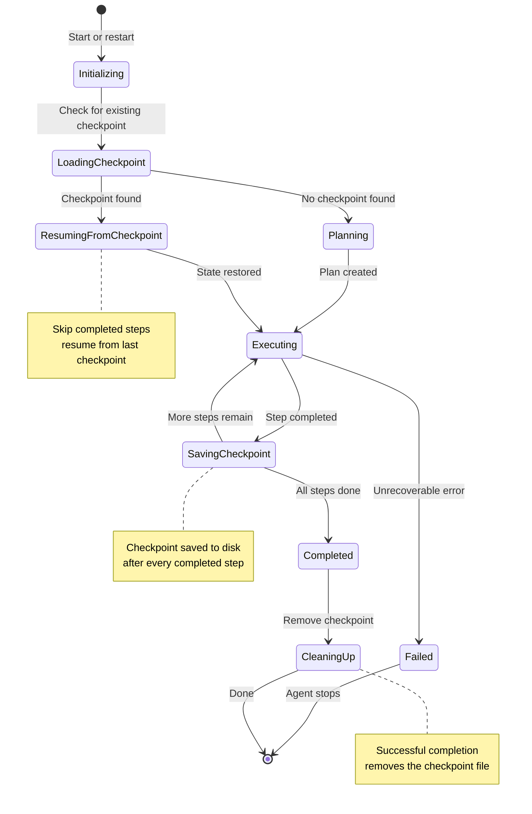

The state diagram reveals the full lifecycle. Notice the two entry paths into `Executing`: fresh runs come through `Planning`, while restarts come through `ResumingFromCheckpoint`. Both converge on the same execution loop. The `SavingCheckpoint` state is the critical addition -- it sits between step completions, ensuring that progress is persisted before moving forward. When the agent finishes successfully, it cleans up the checkpoint file to avoid stale state on the next run.

## 5.6 Building a Checkpointed Agent

Let's implement an agent that combines idempotency and checkpointing. The agent uses JSON files for checkpoint storage -- simple enough to understand, robust enough for single-machine use cases.

**checkpointed_agent.py**

```python
import json
import hashlib
import time
from pathlib import Path
from anthropic import Anthropic

client = Anthropic()

CHECKPOINT_DIR = Path("./checkpoints")
CHECKPOINT_DIR.mkdir(exist_ok=True)


def make_idempotency_key(action: str, inputs: dict) -> str:
    """Generate a deterministic key from action type and inputs."""
    payload = json.dumps({"action": action, **inputs}, sort_keys=True)
    return hashlib.sha256(payload.encode()).hexdigest()[:16]


class CheckpointedAgent:
    """An agent that persists state after each step and supports
    idempotent actions for safe retries."""

    def __init__(self, run_id: str):
        self.run_id = run_id
        self.checkpoint_path = CHECKPOINT_DIR / f"{run_id}.json"
        self.state = self._load_or_init()

    def _load_or_init(self) -> dict:
        """Load existing checkpoint or initialize fresh state."""
        if self.checkpoint_path.exists():
            with open(self.checkpoint_path) as f:
                state = json.load(f)
            print(f"Resumed from checkpoint: {state['current_step_index']}"
                  f"/{len(state['plan'])} steps completed")
            return state
        return {
            "run_id": self.run_id,
            "task": None,
            "plan": [],
            "current_step_index": 0,
            "completed_results": [],
            "completed_keys": {},  # idempotency key -> result
            "status": "initialized",
            "created_at": time.time(),
            "updated_at": time.time(),
        }

    def _save_checkpoint(self):
        """Persist current state to disk."""
        self.state["updated_at"] = time.time()
        with open(self.checkpoint_path, "w") as f:
            json.dump(self.state, f, indent=2)

    def _cleanup_checkpoint(self):
        """Remove checkpoint after successful completion."""
        if self.checkpoint_path.exists():
            self.checkpoint_path.unlink()
            print("Checkpoint cleaned up after successful completion.")

    def execute_idempotent(self, action: str, inputs: dict,
                           executor_fn) -> str:
        """Run an action idempotently. If the same action+inputs
        were already completed, return the cached result."""
        key = make_idempotency_key(action, inputs)

        # Check if this exact action was already completed
        if key in self.state["completed_keys"]:
            print(f"  Skipping (already completed): {action}")
            return self.state["completed_keys"][key]

        # Execute the action
        result = executor_fn(action, inputs)

        # Record completion with idempotency key
        self.state["completed_keys"][key] = result
        return result

    def plan(self, task: str) -> list[str]:
        """Create a plan, or reuse the existing plan from checkpoint."""
        if self.state["plan"]:
            print("Using plan from checkpoint.")
            return self.state["plan"]

        self.state["task"] = task
        self.state["status"] = "planning"

        response = client.messages.create(
            model="claude-sonnet-4-20250514",
            max_tokens=1024,
            system=("Break this task into 3-8 concrete steps. "
                    "Return a JSON array of step descriptions."),
            messages=[{"role": "user", "content": task}],
        )
        plan = json.loads(response.content[0].text)
        self.state["plan"] = plan
        self._save_checkpoint()
        return plan

    def execute_step(self, step: str, context: list[dict]) -> str:
        """Execute a single step using the LLM."""
        context_text = "\\n".join(
            f"- {c['step']}: {c['result']}" for c in context
        )
        prompt = (
            f"Previous results:\\n{context_text}\\n\\n"
            f"Execute this step: {step}"
            if context else f"Execute this step: {step}"
        )
        response = client.messages.create(
            model="claude-sonnet-4-20250514",
            max_tokens=2048,
            messages=[{"role": "user", "content": prompt}],
        )
        return response.content[0].text

    def run(self, task: str) -> str:
        """Full checkpointed Plan-and-Execute loop."""
        plan = self.plan(task)
        print(f"Plan ({len(plan)} steps):")
        for i, step in enumerate(plan):
            marker = "done" if i < self.state["current_step_index"] else "todo"
            print(f"  [{marker}] {i + 1}. {step}")

        self.state["status"] = "executing"

        # Resume from where we left off
        start = self.state["current_step_index"]
        for i in range(start, len(plan)):
            step = plan[i]
            print(f"\\nStep {i + 1}/{len(plan)}: {step}")

            # Execute with idempotency protection
            result = self.execute_idempotent(
                action=f"step_{i}",
                inputs={"step": step, "index": i},
                executor_fn=lambda a, inp: self.execute_step(
                    inp["step"], self.state["completed_results"]
                ),
            )

            self.state["completed_results"].append({
                "step": step, "result": result
            })
            self.state["current_step_index"] = i + 1
            self._save_checkpoint()
            print(f"  Checkpoint saved at step {i + 1}.")

        self.state["status"] = "completed"
        self._save_checkpoint()
        self._cleanup_checkpoint()

        # Synthesize final answer from all results
        return self._synthesize()

    def _synthesize(self) -> str:
        """Combine all step results into a final response."""
        results_text = json.dumps(self.state["completed_results"], indent=2)
        response = client.messages.create(
            model="claude-sonnet-4-20250514",
            max_tokens=4096,
            messages=[{"role": "user", "content": (
                f"Task: {self.state['task']}\\n\\n"
                f"Step results:\\n{results_text}\\n\\n"
                "Synthesize a comprehensive final response."
            )}],
        )
        return response.content[0].text


# --- Usage ---
# First run: creates a checkpoint after each step
agent = CheckpointedAgent(run_id="research-task-42")
result = agent.run(
    "Compare three Python web frameworks for building REST APIs"
)
print(result)

# If the process crashes mid-run and restarts:
# The same run_id loads the checkpoint and resumes automatically.
# agent = CheckpointedAgent(run_id="research-task-42")
# result = agent.run(...)  # picks up where it left off
```

Let's examine the key design decisions in this implementation:

**Run ID as the checkpoint key.** Each task gets a unique `run_id` that maps to a checkpoint file. When the agent restarts with the same `run_id`, it finds the existing checkpoint and resumes. This is the link between "a task that crashed" and "the same task restarting." In production, you would generate the `run_id` from the task parameters or receive it from the orchestration layer.

**Idempotency keys from action + inputs.** The `make_idempotency_key` function hashes the action type and input parameters into a deterministic key. If the same step with the same inputs is attempted twice -- whether from a retry or a resume -- the agent detects the duplicate and returns the cached result. This prevents double-executing steps that have external side effects.

**Checkpoint after every step, not at the end.** The `_save_checkpoint()` call happens inside the loop, immediately after each step completes. This means the worst-case loss from a crash is a single step, not the entire run. The trade-off is disk I/O on every step, but for LLM-based agents where each step takes seconds, the checkpoint overhead is negligible.

**Cleanup on success.** When the agent completes successfully, `_cleanup_checkpoint()` removes the checkpoint file. This prevents a stale checkpoint from confusing a future run. Only active, in-progress runs have checkpoint files on disk.

## 5.6 Checkpoint Storage Strategies

The example above uses JSON files, but production systems need more robust storage. Here is how the options compare:

| Strategy | Durability | Concurrency | Complexity | Best For |
|----------|-----------|-------------|------------|----------|
| JSON files | Medium -- survives process restart, not disk failure | Single agent only | Low | Prototypes, single-machine agents |
| SQLite database | High -- ACID transactions, crash-safe | Limited -- file locking | Medium | Single-machine production agents |
| PostgreSQL / Redis | High -- replicated, durable | Full concurrent access | Higher | Multi-agent systems, distributed deployments |
| Cloud storage (S3) | Very high -- redundant, versioned | Concurrent with caveats | Medium | Serverless agents, cross-region recovery |

The choice depends on your deployment model. For a single agent running on one machine, SQLite is the sweet spot -- it provides ACID guarantees with minimal setup. For distributed systems with multiple agents, a shared database or key-value store is necessary so that any worker can pick up where a crashed worker left off.

> **Forward to Module 7:** When you reach Module 7 on LangGraph, you will discover that it has **built-in checkpointing** through its persistence layer. LangGraph saves the state of its graph execution after each node, using pluggable storage backends (SQLite, PostgreSQL, or custom). The concepts you learned here -- run IDs, state serialization, resume-from-checkpoint -- are exactly what LangGraph automates. Understanding the manual approach first makes LangGraph's checkpointing feel intuitive rather than magical.

## 5.6 Common Pitfalls

Building checkpointed, idempotent agents is conceptually straightforward but has several traps that catch even experienced developers.

**Non-serializable state.** Your checkpoint must be writable to disk (or a database), which means every piece of state must be serializable. Open file handles, database connections, live API clients, and in-memory caches cannot be checkpointed. The fix is to store only data -- strings, numbers, lists, dicts -- and reconstruct non-serializable objects when loading a checkpoint.

**Checkpoint size bloat.** If your agent accumulates large intermediate results (full web pages, large API responses, generated documents), the checkpoint file can grow to megabytes. This slows down every save and load. The fix is to store references (URLs, IDs, file paths) instead of full content, and retrieve the content on demand after resume.

**Stale checkpoints.** If the external world changes between the crash and the resume, the checkpoint's assumptions may be invalid. An agent that checkpointed after finding a stock price of $150 might resume into a world where the price is $175. The fix is to add timestamps to checkpoints and validate staleness on resume -- if too much time has passed, discard the checkpoint and start fresh.

**Idempotency key collisions.** If your key generation is too coarse (for example, keying only on the step number without the inputs), different actions might collide. The agent would skip a step it never actually completed. The fix is to include enough information in the key to make collisions impossible -- action type, all inputs, and any relevant context.

> **Forward to Module 11:** Checkpointing becomes critical for **long-running production agents** that operate over minutes or hours. Module 11 covers the operational infrastructure around checkpointing -- monitoring checkpoint health, alerting on stale checkpoints, cleaning up orphaned checkpoint files, and building dashboards that show agent progress across checkpoints. The pattern you learn here is the foundation; Module 11 shows how to operate it at scale.

## 5.6 Summary

**Idempotency** and **checkpointing** are complementary patterns that make agent systems resilient to the failures that are inevitable in long-running, distributed processes. Here are the key ideas from this lesson:

- **Idempotent actions** produce the same result whether executed once or multiple times, making retries safe -- the key technique is using an **idempotency key** derived from the action type and inputs to detect and skip duplicate executions
- **Checkpointing** saves the agent's state (current step, accumulated results, remaining plan) after each significant action, enabling the agent to **resume from the point of failure** instead of restarting from scratch
- The two patterns solve different sides of the same problem: idempotency asks "is it safe to retry this action?" while checkpointing asks "where was I when I stopped?"
- **Plan-and-Execute agents** benefit most from checkpointing because their ordered step lists and accumulated results map naturally to checkpoint state -- a crash at step six preserves steps one through five
- Checkpoint storage ranges from simple JSON files for prototypes to databases and cloud storage for production, with the choice depending on durability, concurrency, and deployment model
- Common pitfalls include non-serializable state, checkpoint size bloat, stale checkpoints after long downtime, and idempotency key collisions from overly coarse key generation

In the next lesson, the **Design Patterns Lab**, you will put all five patterns from this module into practice. You will refactor a naive agent to use the Tool Registry, Middleware, Context Management, Fallback Chains, and the Checkpointing pattern you just learned -- seeing how these patterns compose into a clean, production-ready system.

---

    Section 5.7: Design Patterns Lab


## 5.7 Overview

In Module 3, you built a research assistant agent that searched the web, read pages, and produced structured reports. It worked. It also had every problem we diagnosed in lesson 01 of this module: tools were hardcoded in a dictionary, logging was scattered `print()` statements, there was no cost tracking, no context management, and no way to resume after a crash. The architecture was right. The engineering was not there yet.

In this lab, you will **progressively refactor** that same research agent using the four design patterns you learned in lessons 02 through 06. Each refactoring step is independent -- you add one pattern at a time, and after each step the agent still runs correctly but is more maintainable, observable, and resilient.

By the end, you will have transformed a monolithic script into a well-structured agent system. And you will see exactly where the next limitation lies -- which sets the stage for Module 6.

## 5.7 Before and After: The Architecture

Let's start by looking at the transformation we are going to make. The left side is the Module 3 agent. The right side is what we will have at the end of this lab.

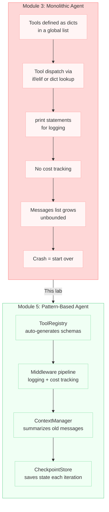

We will apply each pattern in order, testing at each step. This is how real refactoring works -- small, verified changes, never a big-bang rewrite.

## 5.7 The Starting Point

Here is the Module 3 research agent, condensed to the parts we will refactor. If you completed the Module 3 lab, this is your code. If not, use this as the starting point.

**research_agent_v0.py**

```python
"""Module 3 Research Agent -- the monolithic version."""

import json
import datetime
from typing import Any
import anthropic

# --- Tools defined inline ---
def search_web(query: str, max_results: int = 3) -> str:
    """Search the web for information on a topic."""
    simulated = [
        {
            "title": f"Result for: {query}",
            "url": f"https://example.com/{query.replace(' ', '-')[:40]}",
            "snippet": f"Overview of {query}.",
        }
        for i in range(max_results)
    ]
    return json.dumps({"results": simulated})

def read_webpage(url: str) -> str:
    """Fetch text content of a webpage."""
    content = f"Content from {url}. Key findings about the topic..."
    return json.dumps({"url": url, "content": content[:2000]})

def get_current_date() -> str:
    """Return today's date."""
    today = datetime.date.today()
    return json.dumps({"date": today.isoformat()})

def save_report(title: str, summary: str,
                sections: list[dict], sources: list[str]) -> str:
    """Save a structured research report."""
    filename = title.lower().replace(" ", "_")[:50] + ".md"
    return json.dumps({"filename": filename, "char_count": 1200})

# --- Dispatch table ---
tool_functions: dict[str, Any] = {
    "search_web": search_web,
    "read_webpage": read_webpage,
    "get_current_date": get_current_date,
    "save_report": save_report,
}

# --- Tool schemas (hand-written, 80+ lines omitted for brevity) ---
tools = [...]  # The full list from Module 3

# --- Agent loop ---
client = anthropic.Anthropic()

def run_agent(question: str) -> str:
    messages = [{"role": "user", "content": question}]

    for iteration in range(15):
        print(f"--- Iteration {iteration + 1} ---")  # Ad-hoc logging

        response = client.messages.create(
            model="claude-sonnet-4-6",
            max_tokens=4096,
            system="You are a research assistant...",
            tools=tools,
            messages=messages,
        )

        if response.stop_reason == "end_turn":
            for block in response.content:
                if block.type == "text":
                    return block.text

        if response.stop_reason == "tool_use":
            messages.append({"role": "assistant", "content": response.content})
            tool_results = []
            for block in response.content:
                if block.type == "tool_use":
                    print(f"  Calling: {block.name}")  # Ad-hoc logging
                    try:
                        result = tool_functions[block.name](**block.input)
                    except Exception as e:
                        result = json.dumps({"error": str(e)})
                    tool_results.append({
                        "type": "tool_result",
                        "tool_use_id": block.id,
                        "content": result,
                    })
            messages.append({"role": "user", "content": tool_results})

    return "Max iterations reached."
```

Count the problems: tool schemas are hand-written and can drift from implementations, logging is `print()` sprinkled everywhere, there is no cost tracking, the `messages` list grows without bound, and if the process crashes at iteration 10 you lose everything.

## 5.7 Step 1: Add the Tool Registry

The first refactoring replaces the hand-written tool schemas and dispatch table with a **Tool Registry**. From lesson 02, you know the registry uses Python's `inspect` module to auto-generate JSON schemas from function signatures and docstrings.

**tool_registry.py**

```python
"""Step 1: Replace hand-written schemas with a ToolRegistry."""

import inspect
import json
from typing import Any, Callable, get_type_hints


class ToolRegistry:
    """Central registry for agent tools.

    Register a function once. The registry auto-generates the
    JSON schema, handles dispatch, and manages tool lifecycle.
    """

    def __init__(self):
        self._tools: dict[str, Callable] = {}
        self._schemas: dict[str, dict] = {}

    def register(self, func: Callable) -> Callable:
        """Register a tool function. Can be used as a decorator."""
        name = func.__name__
        self._tools[name] = func
        self._schemas[name] = self._generate_schema(func)
        return func

    def execute(self, name: str, args: dict) -> str:
        """Execute a registered tool by name."""
        if name not in self._tools:
            return json.dumps({
                "error": f"Unknown tool: {name}",
                "available": list(self._tools.keys()),
            })
        try:
            return self._tools[name](**args)
        except TypeError as e:
            return json.dumps({"error": f"Invalid arguments: {e}"})
        except Exception as e:
            return json.dumps({"error": f"Tool failed: {e}"})

    def get_definitions(self) -> list[dict]:
        """Return tool definitions for the API call."""
        return list(self._schemas.values())

    def _generate_schema(self, func: Callable) -> dict:
        """Auto-generate a tool schema from function metadata."""
        sig = inspect.signature(func)
        hints = get_type_hints(func)
        doc = inspect.getdoc(func) or ""

        properties = {}
        required = []

        for param_name, param in sig.parameters.items():
            prop: dict[str, Any] = {}
            hint = hints.get(param_name)

            # Map Python types to JSON Schema types
            if hint == str:
                prop["type"] = "string"
            elif hint == int:
                prop["type"] = "integer"
            elif hint == bool:
                prop["type"] = "boolean"
            elif hint == float:
                prop["type"] = "number"
            else:
                prop["type"] = "string"  # safe fallback

            if param.default is inspect.Parameter.empty:
                required.append(param_name)
            else:
                prop["default"] = param.default

            properties[param_name] = prop

        return {
            "name": func.__name__,
            "description": doc,
            "input_schema": {
                "type": "object",
                "properties": properties,
                "required": required,
            },
        }
```

Now registering tools is a one-line operation. No more hand-written schemas that can drift from the implementation.

**register_tools.py**

```python
"""Register the research agent's tools with the registry."""

import json
import datetime

registry = ToolRegistry()


@registry.register
def search_web(query: str, max_results: int = 3) -> str:
    """Search the web for information on a topic. Use as the
    first step when researching a new question."""
    simulated = [
        {
            "title": f"Result for: {query}",
            "url": f"https://example.com/{query.replace(' ', '-')[:40]}",
            "snippet": f"Overview of {query}.",
        }
        for i in range(max_results)
    ]
    return json.dumps({"results": simulated})


@registry.register
def read_webpage(url: str) -> str:
    """Fetch and return the text content of a webpage. Use after
    search_web to read promising results."""
    content = f"Content from {url}. Key findings about the topic..."
    return json.dumps({"url": url, "content": content[:2000]})


@registry.register
def get_current_date() -> str:
    """Get today's date for time-sensitive research queries."""
    today = datetime.date.today()
    return json.dumps({"date": today.isoformat()})


@registry.register
def save_report(title: str, summary: str,
                sections: str, sources: str) -> str:
    """Save a structured research report when you have gathered
    enough information to answer the question."""
    filename = title.lower().replace(" ", "_")[:50] + ".md"
    return json.dumps({"filename": filename, "char_count": 1200})


# The agent loop now uses the registry:
# tools=registry.get_definitions()
# result = registry.execute(block.name, block.input)
```

What changed: the 80+ lines of hand-written tool schemas are gone. The docstring *is* the description. The function signature *is* the schema. Adding a new tool means writing a function and adding `@registry.register`. Removing a tool means deleting the function. The dispatch table and schema list are always in sync because they are generated from the same source.

## 5.7 Step 2: Add Middleware for Logging and Cost Tracking

The second refactoring replaces scattered `print()` statements with a **middleware pipeline**. From lesson 03, you know that middleware intercepts every tool call, letting you add cross-cutting behavior in one place.

**middleware.py**

```python
"""Step 2: Add middleware pipeline for logging and cost tracking."""

import time
from dataclasses import dataclass, field


@dataclass
class AgentMetrics:
    """Tracks cost and usage across an agent run."""
    total_input_tokens: int = 0
    total_output_tokens: int = 0
    tool_calls: int = 0
    tool_errors: int = 0
    tool_durations: list[float] = field(default_factory=list)
    estimated_cost_usd: float = 0.0

    def record_api_call(self, usage):
        """Record token usage from an API response."""
        self.total_input_tokens += usage.input_tokens
        self.total_output_tokens += usage.output_tokens
        # Pricing for claude-sonnet-4-6 (per million tokens)
        self.estimated_cost_usd += (
            usage.input_tokens * 3.0 / 1_000_000
            + usage.output_tokens * 15.0 / 1_000_000
        )

    def summary(self) -> str:
        avg_ms = (
            sum(self.tool_durations) / len(self.tool_durations) * 1000
            if self.tool_durations else 0
        )
        return (
            f"Tokens: {self.total_input_tokens:,} in / "
            f"{self.total_output_tokens:,} out | "
            f"Tools: {self.tool_calls} calls, "
            f"{self.tool_errors} errors, "
            f"{avg_ms:.0f}ms avg | "
            f"Cost: ${self.estimated_cost_usd:.4f}"
        )


def logging_middleware(registry: ToolRegistry,
                       metrics: AgentMetrics):
    """Wrap the registry's execute method with logging."""
    original_execute = registry.execute

    def wrapped_execute(name: str, args: dict) -> str:
        metrics.tool_calls += 1
        print(f"  [tool] {name}("
              f"{json.dumps(args, default=str)[:80]}...)")

        start = time.time()
        result = original_execute(name, args)
        duration = time.time() - start

        metrics.tool_durations.append(duration)

        # Check for errors in the result
        try:
            parsed = json.loads(result)
            if "error" in parsed:
                metrics.tool_errors += 1
                print(f"  [error] {parsed['error']}")
        except (json.JSONDecodeError, TypeError):
            pass

        print(f"  [done] {duration*1000:.0f}ms | "
              f"result: {result[:100]}...")
        return result

    registry.execute = wrapped_execute
```

Notice the pattern: the middleware wraps `registry.execute` without modifying the registry class itself. This is the **decorator pattern** applied at the method level. You can stack multiple middleware -- logging, cost tracking, rate limiting -- and each one is a standalone function.

Here is how the agent loop changes with middleware applied:

**agent_v2.py**

```python
"""Agent loop with registry + middleware."""

import anthropic

client = anthropic.Anthropic()
MODEL = "claude-sonnet-4-6"
SYSTEM_PROMPT = """You are a research assistant. Search the web,
read sources, and produce a structured report.

Process: (1) get today's date, (2) search, (3) read 2-3 pages,
(4) refine search if needed, (5) save report, (6) summarize.

Rules: max 5 pages, max 12 tool calls, do not fabricate."""


def run_agent_v2(question: str) -> str:
    """Agent loop with ToolRegistry and middleware."""
    # Set up registry and middleware
    metrics = AgentMetrics()
    logging_middleware(registry, metrics)

    messages = [{"role": "user", "content": question}]
    print(f"\\nResearch: {question}")
    print("=" * 60)

    for iteration in range(15):
        print(f"\\n--- Iteration {iteration + 1} ---")

        response = client.messages.create(
            model=MODEL,
            max_tokens=4096,
            system=SYSTEM_PROMPT,
            tools=registry.get_definitions(),  # From registry
            messages=messages,
        )
        metrics.record_api_call(response.usage)

        if response.stop_reason == "end_turn":
            print(f"\\n{metrics.summary()}")  # Final metrics
            for block in response.content:
                if block.type == "text":
                    return block.text

        if response.stop_reason == "tool_use":
            messages.append({
                "role": "assistant",
                "content": response.content,
            })
            tool_results = []
            for block in response.content:
                if block.type == "tool_use":
                    # Middleware handles logging + metrics
                    result = registry.execute(block.name, block.input)
                    tool_results.append({
                        "type": "tool_result",
                        "tool_use_id": block.id,
                        "content": result,
                    })
            messages.append({"role": "user", "content": tool_results})

    print(f"\\n{metrics.summary()}")
    return "Max iterations reached."
```

What changed: all logging now flows through one middleware function. The agent loop itself has zero `print()` statements for tool tracking. Adding cost tracking required zero changes to the agent loop -- we just added `metrics.record_api_call()` where we already had the response object. To add rate limiting, you would write another middleware function and apply it -- one line of setup, no loop changes.

## 5.7 Step 3: Add Context Management

The third refactoring addresses a problem you cannot see in a short demo but that kills long-running agents: **unbounded context growth**. From lesson 04, you know that every iteration adds both an assistant message and tool results to the `messages` list. After enough iterations, you exceed the model's context window and the API call fails.

**context_manager.py**

```python
"""Step 3: Add context management to prevent window overflow."""

import anthropic


class ContextManager:
    """Manages the conversation history to stay within token limits.

    Strategy: when the message list exceeds a threshold, summarize
    older messages and replace them with a compact summary. Recent
    messages are kept intact so the agent has full detail for its
    current step.
    """

    def __init__(self, client: anthropic.Anthropic,
                 model: str,
                 max_messages: int = 20,
                 keep_recent: int = 6):
        self.client = client
        self.model = model
        self.max_messages = max_messages
        self.keep_recent = keep_recent

    def maybe_compress(self, messages: list[dict]) -> list[dict]:
        """Compress the message history if it exceeds the limit.

        Returns a new message list with old messages summarized.
        """
        if len(messages) <= self.max_messages:
            return messages  # No compression needed

        # Split into old messages and recent messages
        boundary = len(messages) - self.keep_recent
        old_messages = messages[:boundary]
        recent_messages = messages[boundary:]

        # Summarize the old messages
        summary = self._summarize(old_messages)

        # Build new message list: summary + recent
        compressed = [
            {
                "role": "user",
                "content": (
                    f"[Context summary of previous {len(old_messages)} "
                    f"messages]\\n\\n{summary}\\n\\n"
                    "[End of summary. Continue from here.]"
                ),
            },
            {
                "role": "assistant",
                "content": "Understood. I will continue the research "
                           "using the context above.",
            },
        ] + recent_messages

        print(f"  [context] Compressed {len(messages)} messages "
              f"-> {len(compressed)} messages")
        return compressed

    def _summarize(self, messages: list[dict]) -> str:
        """Use the LLM to summarize older conversation history."""
        # Build a text representation of the old messages
        parts = []
        for msg in messages:
            role = msg["role"]
            content = msg.get("content", "")
            if isinstance(content, str):
                parts.append(f"{role}: {content[:300]}")
            elif isinstance(content, list):
                for block in content:
                    if isinstance(block, dict):
                        if block.get("type") == "tool_result":
                            parts.append(
                                f"tool_result: "
                                f"{str(block.get('content', ''))[:200]}"
                            )
                    elif hasattr(block, "type"):
                        if block.type == "text":
                            parts.append(f"assistant: {block.text[:200]}")
                        elif block.type == "tool_use":
                            parts.append(
                                f"tool_call: {block.name}"
                                f"({json.dumps(block.input)[:100]})"
                            )

        history_text = "\\n".join(parts)

        response = self.client.messages.create(
            model=self.model,
            max_tokens=500,
            messages=[{
                "role": "user",
                "content": (
                    "Summarize this agent conversation history. "
                    "Include: the research question, tools called, "
                    "key findings so far, and sources found. Be "
                    "concise but preserve all factual details.\\n\\n"
                    f"{history_text}"
                ),
            }],
        )
        return response.content[0].text
```

Integrating this into the agent loop requires exactly two lines:

**integration_context.py**

```python
# In the agent loop, after creating the client:
context_mgr = ContextManager(client, MODEL, max_messages=20)

# Inside the loop, before each API call:
messages = context_mgr.maybe_compress(messages)
```

What changed: the `messages` list can no longer grow without bound. When it hits 20 messages, the older ones are summarized and replaced. The agent retains full detail for its recent actions and a compact summary of everything before. The summarization costs one extra API call, but that is far cheaper than failing because you exceeded the context window -- or worse, degrading response quality because the model is drowning in old, irrelevant tool results.

## 5.7 Step 4: Add Checkpointing

The fourth and final refactoring makes the agent **resumable**. From lesson 06, you know that checkpointing saves the agent's state after each meaningful step, so a crash at iteration 10 does not mean starting over from iteration 1.

**checkpointing.py**

```python
"""Step 4: Add checkpointing for crash recovery."""

import json
import os
import hashlib
from dataclasses import dataclass, asdict


@dataclass
class Checkpoint:
    """Snapshot of agent state at a given iteration."""
    question: str
    iteration: int
    messages_json: str  # Serialized message history
    metrics_snapshot: dict
    status: str  # "running", "completed", "failed"

    def save(self, directory: str = ".checkpoints") -> str:
        """Save checkpoint to disk."""
        os.makedirs(directory, exist_ok=True)
        # Deterministic filename from the question
        q_hash = hashlib.sha256(
            self.question.encode()
        ).hexdigest()[:12]
        path = os.path.join(
            directory,
            f"research_{q_hash}_iter{self.iteration:03d}.json"
        )
        with open(path, "w") as f:
            json.dump(asdict(self), f, indent=2, default=str)
        print(f"  [checkpoint] Saved iteration {self.iteration} "
              f"-> {path}")
        return path

    @classmethod
    def load_latest(cls, question: str,
                    directory: str = ".checkpoints"
                    ) -> "Checkpoint | None":
        """Load the most recent checkpoint for a question."""
        if not os.path.exists(directory):
            return None

        q_hash = hashlib.sha256(
            question.encode()
        ).hexdigest()[:12]
        prefix = f"research_{q_hash}_iter"

        # Find all checkpoints for this question
        candidates = sorted([
            f for f in os.listdir(directory)
            if f.startswith(prefix) and f.endswith(".json")
        ])
        if not candidates:
            return None

        # Load the latest one
        path = os.path.join(directory, candidates[-1])
        with open(path) as f:
            data = json.load(f)

        print(f"  [checkpoint] Resuming from iteration "
              f"{data['iteration']} ({path})")
        return cls(**data)


def serialize_messages(messages: list[dict]) -> str:
    """Serialize message history to JSON for checkpointing.

    Handles Anthropic content blocks by converting them to dicts.
    """
    serializable = []
    for msg in messages:
        content = msg.get("content", "")
        if isinstance(content, list):
            # Convert content blocks to serializable dicts
            blocks = []
            for block in content:
                if hasattr(block, "type"):
                    # Anthropic ContentBlock object
                    if block.type == "text":
                        blocks.append({
                            "type": "text", "text": block.text
                        })
                    elif block.type == "tool_use":
                        blocks.append({
                            "type": "tool_use",
                            "id": block.id,
                            "name": block.name,
                            "input": block.input,
                        })
                else:
                    blocks.append(block)
            serializable.append({
                "role": msg["role"], "content": blocks
            })
        else:
            serializable.append(msg)
    return json.dumps(serializable, default=str)
```

## 5.7 The Complete Refactored Agent

Here is the full agent loop with all four patterns applied. Compare its structure to the Module 3 version -- every cross-cutting concern has its own home.

**research_agent_v3.py**

```python
"""Research Agent v3 -- fully refactored with design patterns.

Patterns applied:
  1. ToolRegistry -- dynamic tool management
  2. Middleware -- logging and cost tracking
  3. ContextManager -- prevents context overflow
  4. Checkpointing -- crash recovery

Usage:
    python research_agent_v3.py
    # If it crashes, run again -- it resumes from checkpoint.
"""

import json
import anthropic

# --- Configuration ---
MODEL = "claude-sonnet-4-6"
MAX_ITERATIONS = 15
SYSTEM_PROMPT = """You are a research assistant. Search the web,
read sources, and produce a structured report.

Process: (1) get date, (2) search, (3) read 2-3 pages,
(4) refine if needed, (5) save report, (6) summarize.

Rules: max 5 pages, max 12 tool calls, never fabricate."""

client = anthropic.Anthropic()


def run_agent_v3(question: str) -> str:
    """Production-ready agent loop with all four patterns."""

    # --- Pattern 1: Tool Registry ---
    # (tools registered via @registry.register above)
    tool_defs = registry.get_definitions()

    # --- Pattern 2: Middleware ---
    metrics = AgentMetrics()
    logging_middleware(registry, metrics)

    # --- Pattern 3: Context Manager ---
    context_mgr = ContextManager(
        client, MODEL, max_messages=20, keep_recent=6
    )

    # --- Pattern 4: Checkpoint Recovery ---
    checkpoint = Checkpoint.load_latest(question)
    if checkpoint and checkpoint.status == "running":
        messages = json.loads(checkpoint.messages_json)
        start_iteration = checkpoint.iteration + 1
        print(f"Resuming from iteration {start_iteration}")
    else:
        messages = [{"role": "user", "content": question}]
        start_iteration = 1

    print(f"\\nResearch: {question}")
    print("=" * 60)

    for iteration in range(start_iteration, MAX_ITERATIONS + 1):
        print(f"\\n--- Iteration {iteration} ---")

        # Context management: compress if needed
        messages = context_mgr.maybe_compress(messages)

        # LLM call
        response = client.messages.create(
            model=MODEL,
            max_tokens=4096,
            system=SYSTEM_PROMPT,
            tools=tool_defs,
            messages=messages,
        )
        metrics.record_api_call(response.usage)

        # Terminal condition
        if response.stop_reason == "end_turn":
            Checkpoint(
                question=question,
                iteration=iteration,
                messages_json=serialize_messages(messages),
                metrics_snapshot={"summary": metrics.summary()},
                status="completed",
            ).save()
            print(f"\\n{metrics.summary()}")
            for block in response.content:
                if block.type == "text":
                    return block.text

        # Tool execution through registry + middleware
        if response.stop_reason == "tool_use":
            messages.append({
                "role": "assistant",
                "content": response.content,
            })
            tool_results = []
            for block in response.content:
                if block.type == "tool_use":
                    result = registry.execute(
                        block.name, block.input
                    )
                    tool_results.append({
                        "type": "tool_result",
                        "tool_use_id": block.id,
                        "content": result,
                    })
            messages.append({
                "role": "user", "content": tool_results
            })

        # Checkpoint after each iteration
        Checkpoint(
            question=question,
            iteration=iteration,
            messages_json=serialize_messages(messages),
            metrics_snapshot={"summary": metrics.summary()},
            status="running",
        ).save()

    print(f"\\n{metrics.summary()}")
    return "Max iterations reached."


if __name__ == "__main__":
    answer = run_agent_v3(
        "What are the main approaches to reducing "
        "hallucinations in large language models?"
    )
    print(f"\\nFinal answer: {answer[:300]}...")
```

## 5.7 What Each Pattern Bought You

Let's trace how the refactored agent handles the same change requests that broke the monolithic version in lesson 01:

**"Add a new tool."** Write a function, add `@registry.register`. The schema is auto-generated. The middleware already intercepts it. The checkpoint serializer already handles it. One line of code, zero changes elsewhere.

**"Add logging to every tool call."** Already done. The logging middleware intercepts every call through `registry.execute`. To change the log format, edit one function.

**"Track costs."** Already done. The `AgentMetrics` dataclass accumulates token usage from every API call. The `metrics.summary()` prints totals at the end.

**"Handle long conversations."** Already done. The `ContextManager` compresses old messages before they overflow the context window. The agent never crashes from token limits.

**"Resume after a crash."** Already done. Run the same command again. The `Checkpoint.load_latest()` finds the last saved state and continues from there. No work is lost.

Each pattern solved exactly one concern. Together, they transformed a fragile script into a system that can evolve.

## 5.7 The Interaction Between Patterns

These four patterns are not just independent additions -- they **reinforce each other**. Here is how they interact at runtime:

```mermaid
sequenceDiagram
    participant Loop as Agent Loop
    participant Ctx as ContextManager
    participant LLM as LLM API
    participant MW as Middleware
    participant Reg as ToolRegistry
    participant Chk as Checkpoint

    Note over Loop: Start iteration N
    Loop->>Ctx: maybe_compress(messages)
    Ctx-->>Loop: compressed messages
    Loop->>LLM: messages.create(tools, messages)
    LLM-->>Loop: response (tool_use)
    Note over Loop: Record token usage in metrics

    loop For each tool call
        Loop->>MW: execute(name, args)
        MW->>MW: Log call, start timer
        MW->>Reg: original_execute(name, args)
        Reg-->>MW: result
        MW->>MW: Log result, record duration
        MW-->>Loop: result
    end

    Loop->>Chk: save(iteration, messages, metrics)
    Note over Loop: Next iteration
```

The sequence matters: context management happens *before* the LLM call (so the model sees a clean, right-sized history), middleware wraps *around* tool execution (so every call is logged and timed), and checkpointing happens *after* tool results are collected (so the saved state includes the latest results). This ordering is not accidental -- it follows the data flow of the agent loop.

## 5.7 What Is Still Missing

The refactored agent is well-structured, observable, and resilient. But run it twice with the same question and notice something: the second run starts from scratch. It does not remember that it already researched this topic yesterday. It cannot build on previous findings. It cannot learn from past mistakes.

This is not a pattern problem -- it is a **memory** problem. Our agent has:

- **Working memory** (the `messages` list) -- but it is scoped to a single run and gets summarized away
- **Checkpoint state** (the `.checkpoints/` directory) -- but that is for crash recovery, not knowledge retention
- **No long-term memory** -- no way to store and retrieve knowledge across sessions

Consider what a memory-equipped research agent could do:

- "I researched LLM hallucinations last week. Let me check what I already know before searching again."
- "The last time I used that URL, the content was outdated. Let me try a different source."
- "The user asked about RAG three times this month. They probably care about this topic -- I should track new developments."

This is the gap between a well-engineered tool and a truly intelligent assistant. Design patterns gave us the *structure*. Memory gives us the *continuity*.

> **Key insight:** Design patterns make your agent's code maintainable and resilient. Memory makes your agent's *behavior* intelligent across sessions. You need both.

## 5.7 Summary

You refactored the Module 3 research agent in four steps, each applying one design pattern from this module:

- **Tool Registry** replaced hand-written schemas and dispatch tables with auto-generated definitions from function metadata. Adding or removing a tool is now a one-line change.
- **Middleware** replaced scattered `print()` statements with a centralized interception layer that handles logging and cost tracking. Cross-cutting concerns live in one place.
- **Context Management** prevents the message list from growing unbounded by summarizing older messages when the conversation exceeds a threshold. Long-running agents no longer crash from context overflow.
- **Checkpointing** saves agent state after each iteration, enabling crash recovery by resuming from the last saved checkpoint. No work is lost.

These patterns are **composable** -- each one solves a single concern, and they reinforce each other when combined. The Tool Registry gives middleware a single interception point. The Context Manager keeps checkpoints small. The middleware metrics tell you whether context compression is being triggered too often.

The refactored agent is maintainable, observable, and resilient. But it forgets everything between sessions. In **Module 6: Memory and Knowledge Management**, you will give your agent the ability to store, retrieve, and reason over information across runs -- turning a well-structured tool into a system that learns.

---

