# Memory & Knowledge

*Giving agents short-term context, long-term recall, and access to external knowledge*

    Section 6.1: Why Memory Matters


## 6.1 Overview

At the end of Module 5, you built agents with clean internal structure -- registries for tools, middleware for cross-cutting concerns, context managers for the token budget, fallback chains for resilience, and checkpoints for crash recovery. Your agents are well-organized, robust, and capable.

They also have amnesia.

Every time a conversation ends, your agent forgets everything. The user's preferences, the decisions made, the facts discovered, the mistakes corrected -- all gone. The next session starts with a blank context window, as if the agent and user have never met. This is the **forgetting problem**, and it is the single biggest gap between today's agents and the intelligent assistants users actually want.

In Module 5's lesson on context window management, you learned to treat the context window as a scarce resource and manage what fits inside it. That was about optimizing the agent's *working memory* within a single session. This module goes deeper. You will build systems that give agents memory *across* sessions -- the ability to learn, recall, and apply knowledge over time.

This first lesson explains why memory matters, introduces a taxonomy of memory types drawn from cognitive science, and maps each type to concrete agent capabilities you will build in the lessons ahead.

## 6.1 The Forgetting Problem

Consider a scenario that exposes the fundamental limitation. A user spends 45 minutes working with a research agent to analyze quarterly earnings reports. The agent discovers that the user prefers tables over prose, cares most about revenue growth rates, and wants comparisons against analyst consensus estimates. By the end of the session, the agent is producing exactly what the user wants.

The next morning, the user returns: "Analyze Q2 the same way you did Q1 yesterday."

The agent has no idea what happened yesterday. It does not know the user's format preferences. It does not remember which metrics mattered. It cannot recall the analysis structure it converged on. The user must re-explain everything from scratch.

This is not a bug in any specific agent implementation. It is a structural property of how LLMs work.

**LLMs are stateless.** Each API call receives a context window, generates a response, and discards all internal state. There is no persistent memory between calls. When you chain calls together in a conversation, the *application* maintains state by passing the conversation history back into each subsequent call. But that history lives in the application's memory, not the model's. When the application session ends, the history is gone.

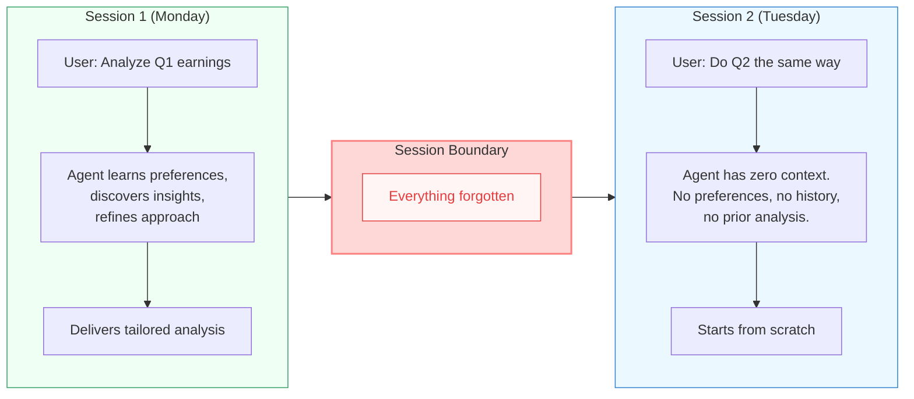

The forgetting problem compounds over time. Every session, the user repeats the same preferences, re-explains the same context, and re-discovers the same dead ends. The agent never improves. It never learns from past mistakes. It cannot build on prior work. Each interaction is an isolated event, disconnected from every other interaction.

Compare this to working with a skilled human colleague. Over weeks of collaboration, the colleague learns your communication style, remembers past decisions and their rationale, builds up domain expertise from shared projects, and anticipates your needs. The relationship gets *better* over time. That is what memory enables, and what stateless agents fundamentally lack.

## 6.1 The Human Memory Analogy

To solve the forgetting problem, it helps to understand how the system we are trying to emulate actually works. **Cognitive science** provides a well-studied model of human memory that maps surprisingly well onto the capabilities agents need.

Psychologists divide human memory into several distinct systems, each serving a different purpose and operating at a different timescale. The most relevant for agent design are four types: working memory, episodic memory, semantic memory, and procedural memory.

**Working memory** is the small, limited-capacity system that holds information you are actively using *right now*. When you do mental arithmetic, the numbers you are juggling are in working memory. When you read a sentence, the words at the beginning stay in working memory until you reach the end. Working memory is fast, immediately accessible, but severely limited -- cognitive scientists estimate it holds roughly 4 to 7 items at a time. Information that is not actively rehearsed fades within seconds.

**Episodic memory** stores specific personal experiences -- events tied to a particular time and place. "Last Tuesday's meeting where we decided to switch databases" is an episodic memory. "The time a customer escalated a billing complaint and we discovered a system bug" is an episodic memory. These memories are autobiographical, chronological, and rich in context.

**Semantic memory** stores general knowledge and facts, detached from the specific episode where you learned them. You know that Paris is the capital of France, but you probably do not remember the exact moment you learned it. Semantic memory is your accumulated understanding of how the world works -- concepts, categories, relationships, and rules.

**Procedural memory** stores learned skills and procedures -- how to do things rather than facts about things. Riding a bicycle, typing on a keyboard, or following a debugging workflow are all procedural memories. These are difficult to articulate explicitly but guide behavior automatically.

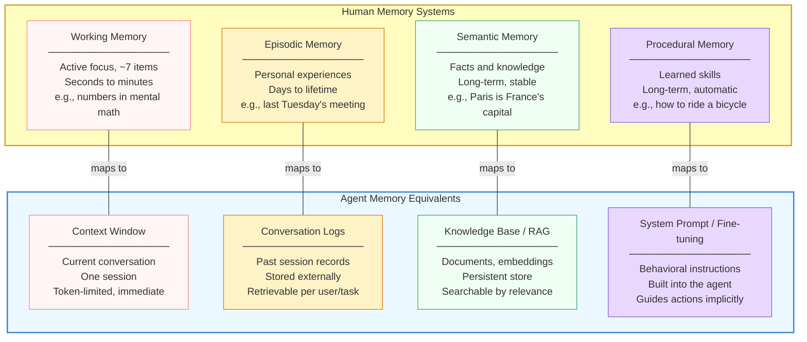

This mapping is not just a convenient analogy -- it is a design blueprint. Each human memory type points to a specific capability your agent needs and a specific technology that provides it. The rest of this module builds these systems one by one.

## 6.1 Memory Types for Agents

Let's examine each memory type in the agent context, what it enables, and where you will build it.

### Working Memory: The Context Window

You already know this one. The agent's **working memory** is the context window -- the tokens visible to the LLM in the current API call. It holds the system prompt, conversation history, tool results, and space for the response. It is fast (everything is immediately available to the model), limited (bounded by the token window), and ephemeral (cleared when the session ends).

In Module 5, lesson 04, you learned to manage working memory with token budgets, priority-based retention, and summarization. Those techniques optimize *how much* the agent can hold in mind at once. But they do not solve the fundamental problem: when the session ends, working memory is wiped clean.

Working memory is necessary but not sufficient. It is the starting point, not the destination.

### Episodic Memory: What Happened Before

**Episodic memory** for agents means storing and recalling *specific past interactions* -- not just that a conversation happened, but what was discussed, what decisions were made, and what outcomes resulted.

An agent with episodic memory can answer questions like:

- "What did we discuss in our last three sessions?"
- "When did the user first report this issue?"
- "What approach did I try last time for this problem, and why did it fail?"

Episodic memory is implemented by persisting conversation logs, indexing them by user, timestamp, and topic, and retrieving relevant episodes when they might be useful. The agent can look back at its own history and learn from it.

You will build episodic memory in lessons 02 (Conversation Memory) and 03 (Long-Term Memory).

### Semantic Memory: What the Agent Knows

**Semantic memory** for agents means access to a persistent knowledge base -- facts, documents, reference materials, and domain knowledge that the agent can consult when needed.

An agent with semantic memory can answer questions like:

- "What is our company's refund policy?"
- "What are the configuration options for this API?"
- "What did the latest research paper say about this technique?"

Unlike episodic memory (which is about the agent's own experiences), semantic memory is about *external knowledge*. The agent does not need to have "experienced" the knowledge -- it needs to be able to find and use it.

Semantic memory is implemented through **Retrieval-Augmented Generation (RAG)**: storing documents as vector embeddings, searching them by semantic similarity, and injecting relevant results into the context window. You will build this in lessons 04 (RAG), 05 (Embeddings and Vector Stores), and 06 (Advanced RAG Patterns).

### Procedural Memory: How the Agent Behaves

**Procedural memory** for agents means the learned behaviors, strategies, and patterns that guide how the agent operates -- not declarative facts, but *ways of doing things*.

An agent with procedural memory exhibits behaviors like:

- Always checking inventory before quoting prices (learned from past errors)
- Using a specific analysis framework that the user prefers
- Following a multi-step debugging workflow refined over many interactions

Procedural memory is the hardest to implement explicitly because it is embedded in the agent's behavior rather than stored as retrievable data. It lives in the system prompt (explicit instructions), in fine-tuning (behavioral adjustments from training data), and in learned workflows (procedures extracted from successful past sessions and encoded as rules).

You will encounter procedural memory concepts throughout this module, but it becomes a central focus in Module 11 (Production Deployment) where agents learn from operational feedback.

## 6.1 With Memory vs. Without: A Comparison

To make the impact concrete, consider how a customer support agent behaves with and without memory systems.

**Without memory**, each ticket is an island:

- The agent cannot recognize repeat customers
- It asks the same diagnostic questions every time, even when the answer has not changed
- It cannot detect patterns ("this is the fifth report of the same bug this week")
- It cannot reference past solutions ("we fixed this last time by resetting the cache")
- It treats every interaction as if it has never encountered this problem before

**With memory**, the agent builds on prior experience:

- It recognizes the customer and recalls their history
- It skips diagnostic steps when it already knows the customer's environment
- It detects emerging patterns and escalates proactively
- It applies solutions that worked before and avoids approaches that failed
- It improves over time as its knowledge base grows

The difference is not just convenience -- it is capability. Memory transforms an agent from a sophisticated text generator into something that can genuinely *learn* and *adapt*.

## 6.1 The Memory Architecture

All four memory types work together in a layered architecture. When the agent receives a query, it does not rely solely on the current context window. It actively retrieves relevant information from its memory systems and loads it into working memory before reasoning.

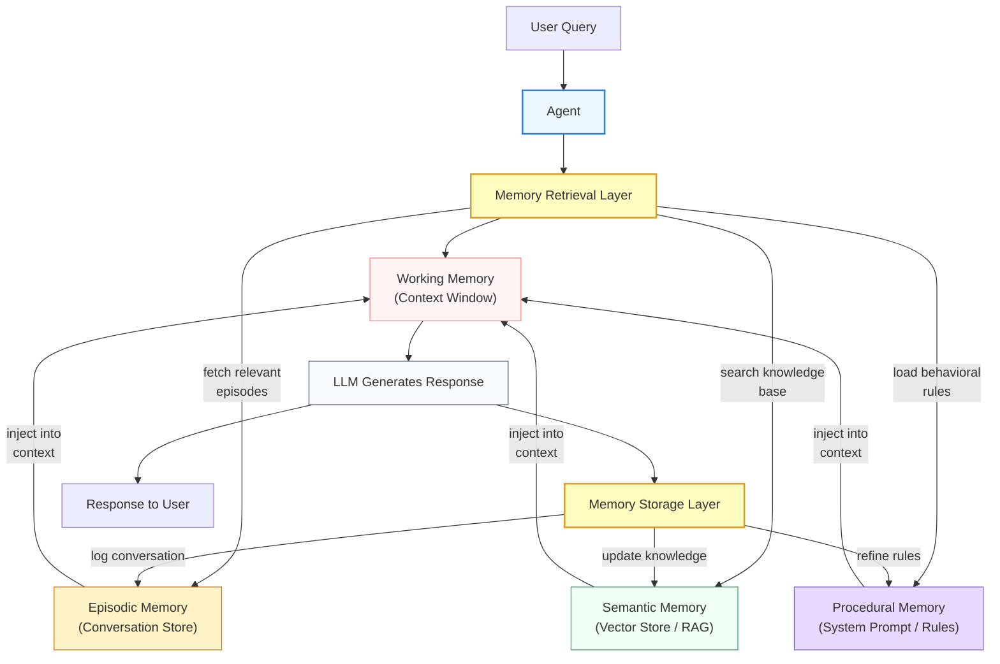

Notice the **bidirectional flow**. Memory is not just read -- it is also written. After the agent responds, the memory storage layer logs the conversation (episodic), potentially updates the knowledge base (semantic), and may refine behavioral rules (procedural). This read-write cycle is what enables the agent to improve over time.

The retrieval layer is the critical bridge. It decides *what* past information is relevant to the current query and *how much* of it to inject into the context window. Too little, and the agent misses relevant context. Too much, and it overwhelms the context window with tangential information. Getting this balance right is the central challenge of the lessons ahead.

## 6.1 From Context Management to Memory

Module 5's context management lesson taught you the mechanics of working within a single context window -- token budgets, eviction strategies, and summarization. Think of that as the *inner loop* of agent memory. This module builds the *outer loop*: what happens when information leaves the context window.

The two systems are deeply connected:

- **Context management** decides what to evict from working memory. **Memory systems** catch what is evicted and store it for later retrieval.
- **Context management** reserves space for injected content. **Memory systems** provide that content by retrieving relevant past knowledge.
- **Context management** compresses information via summarization. **Memory systems** decide whether to store the original, the summary, or both.

If context management is the agent's ability to focus, memory is the agent's ability to *remember*. You need both. An agent with perfect memory but no context management will overflow its context window with retrieved information. An agent with perfect context management but no memory will make excellent use of the current session and then forget everything.

> **Key insight:** Context management and memory are not separate concerns -- they are two halves of the same system. Context management is the *short-term* strategy (what fits now). Memory is the *long-term* strategy (what to keep for later). Building one without the other leaves your agent fundamentally incomplete.

## 6.1 What's Ahead in This Module

The remaining lessons build each memory capability from the ground up:

- **Lesson 02: Conversation Memory** -- Implement short-term memory using conversation buffers, sliding windows, and summary-based compression. This is the simplest memory system and the one every agent needs.

- **Lesson 03: Long-Term Memory** -- Persist knowledge across sessions using vector stores and structured storage. Your agent will remember past conversations and recall them when relevant.

- **Lesson 04: Retrieval-Augmented Generation** -- Connect your agent to external knowledge bases. Instead of relying solely on what the LLM was trained on, your agent will ground its responses in your documents, data, and domain knowledge.

- **Lesson 05: Embeddings and Vector Stores** -- Understand the technology underlying semantic search -- how text is converted to vectors, how similarity works in high-dimensional space, and how to choose and configure vector databases.

- **Lesson 06: Advanced RAG Patterns** -- Go beyond basic retrieval with hybrid search, reranking, query decomposition, and agentic RAG -- patterns that dramatically improve retrieval quality for complex queries.

- **Lesson 07: Memory Lab** -- Put it all together by building an agent with conversation memory and RAG-powered knowledge in a hands-on lab exercise.

By the end of this module, your agents will not just manage information within a session -- they will accumulate, organize, and retrieve knowledge across sessions, becoming more capable with every interaction.

## 6.1 Summary

The **forgetting problem** is the fundamental limitation of stateless LLM agents: every session starts from zero, with no memory of past interactions, decisions, or learned knowledge. Users are forced to repeat context, preferences, and instructions in every conversation.

- **LLMs are stateless** -- each API call is independent. Conversation continuity within a session is maintained by the application, not the model. When the session ends, everything is lost.
- Human memory provides a useful design blueprint with four types: **working memory** (limited, immediate focus), **episodic memory** (specific past experiences), **semantic memory** (general knowledge and facts), and **procedural memory** (learned skills and behaviors).
- These map directly to agent capabilities: the **context window** is working memory, **conversation logs** provide episodic memory, **RAG and vector stores** provide semantic memory, and the **system prompt plus fine-tuning** provide procedural memory.
- Context management from Module 5 handles the *inner loop* -- optimizing what fits in a single session. Memory systems handle the *outer loop* -- persisting and retrieving knowledge across sessions. Both are essential.
- Memory transforms agents from isolated text generators into systems that **learn, adapt, and improve** over time -- recognizing users, recalling past solutions, detecting patterns, and building on prior work.

In the next lesson, you will build the first and most fundamental memory system: **conversation memory** -- giving your agent the ability to maintain coherent context within a session using buffers, windows, and summarization strategies.

---

    Section 6.2: Conversation and Short-Term Memory


## 6.2 Overview

In the previous lesson, you learned *why* memory matters -- the context window is finite, and agents that run for more than a handful of turns will inevitably run out of room. You also saw the taxonomy of memory types: sensory, short-term, and long-term.

This lesson zooms into **short-term memory** -- specifically, how agents manage conversation history within a session. Every time you chat with an LLM, the entire conversation must be re-sent with each request. The model does not "remember" what you said three messages ago unless you explicitly include those messages in the next API call. This is the fundamental mechanic that conversation memory must solve.

Think of it like a whiteboard in a meeting room. The whiteboard has limited space (the context window). As the meeting progresses and you fill the board, you need a strategy: do you erase the oldest notes? Do you photograph them and summarize the key points? Do you keep a separate notebook and only write the most important items on the board? Each choice has trade-offs, and the right answer depends on how long the meeting runs and what kind of information matters most.

By the end of this lesson, you will understand three core strategies for managing conversation memory -- buffer, sliding window, and summarization -- know when to use each one, and have a working implementation you can adapt for your own agents.

## 6.2 How Conversation Memory Actually Works

Before diving into strategies, let's make sure the underlying mechanic is crystal clear. LLMs are **stateless**. Every API call is independent. The model receives a list of messages, generates a response, and immediately forgets everything. There is no server-side session, no hidden state, no implicit memory.

**Conversation memory** is an application-level construct. Your code is responsible for storing messages, deciding which ones to include in the next request, and assembling them into the messages array that gets sent to the API. The LLM sees only what you put in that array.

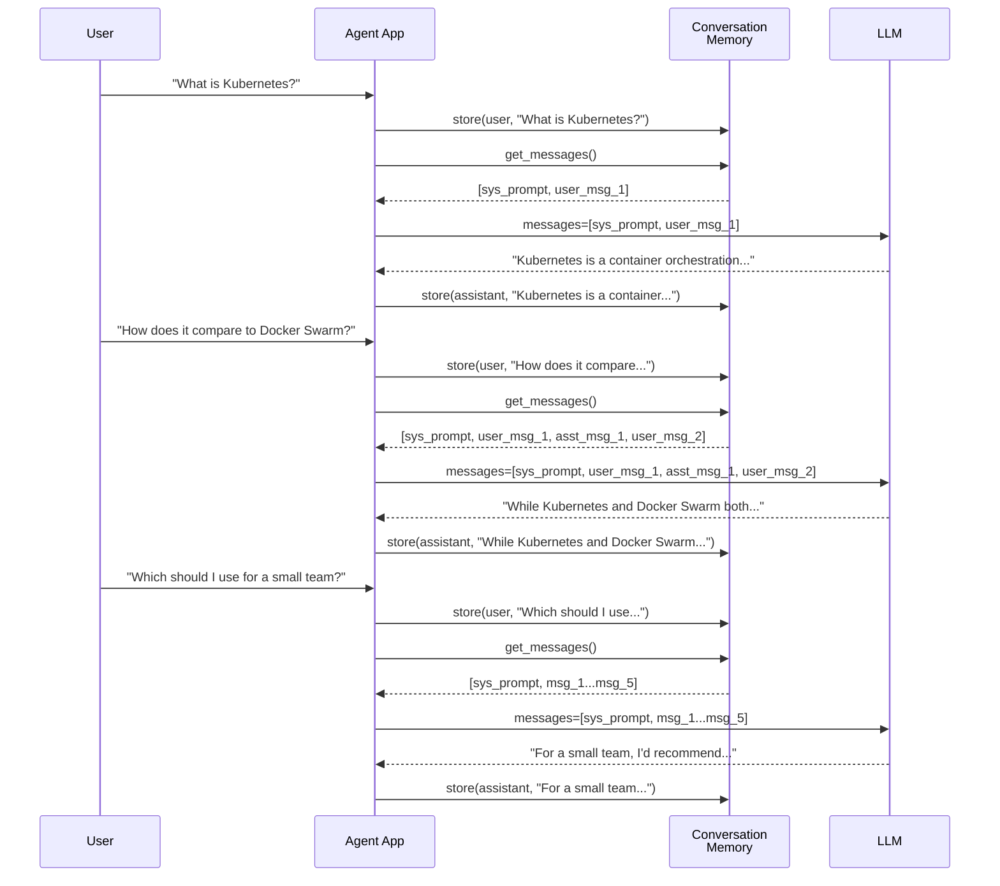

Notice the pattern: every turn, the full conversation is re-sent. Turn 1 sends 2 messages. Turn 2 sends 4. Turn 3 sends 6. By turn 50, you are sending 102 messages -- and every single one counts against your token budget. This is why conversation memory is not optional; it is inevitable. The only question is *which strategy* you use to manage the growth.

## 6.2 The Three Core Strategies

There are three fundamental strategies for managing conversation history: **buffer memory**, **sliding window memory**, and **summarization memory**. Every production memory system is built from one or a combination of these primitives.

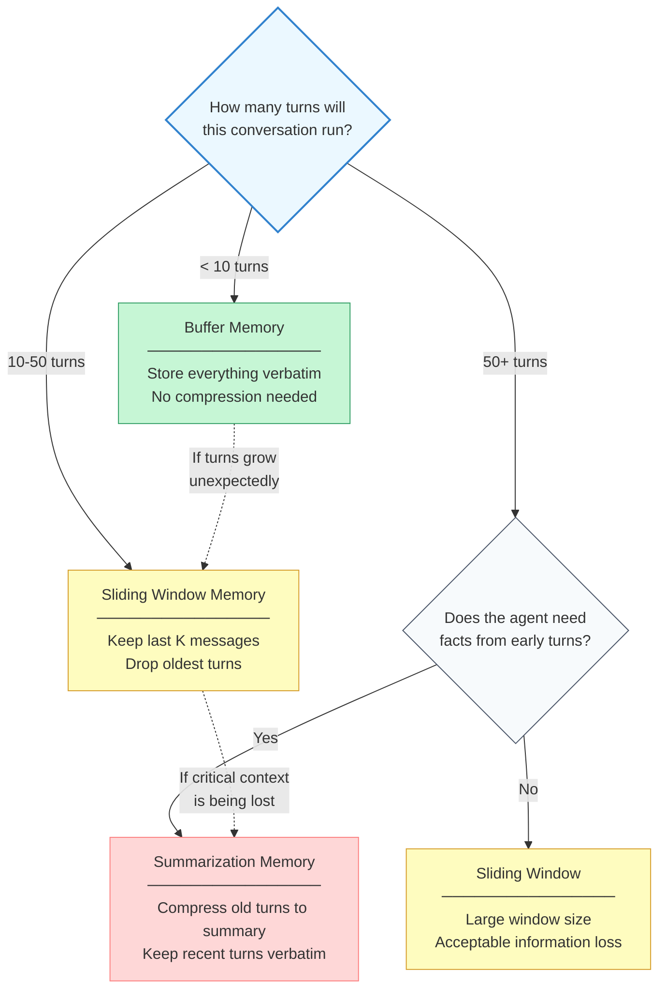

Let's examine each strategy in detail.

### Buffer Memory

**Buffer memory** is the simplest approach: store every message and include all of them in every LLM request. No truncation, no compression, no information loss.

This is what you are probably doing already if you have built a basic chatbot. You append each message to a list and pass the full list to the API every turn.

**When it works:** Short conversations (under 10 turns), prototyping, demos, and any scenario where you are confident the total token count will stay well within the context window.

**When it breaks:** The moment the conversation exceeds the context window. A 128k token window sounds generous, but a multi-step agent with tool calls can fill it in 20-30 turns. A verbose user explaining a complex problem can fill it in 10. Buffer memory gives you zero protection against overflow -- it works perfectly until it suddenly does not.

### Sliding Window Memory

**Sliding window memory** keeps only the most recent K messages (or K tokens) and drops everything older. It is the buffer's natural evolution -- you still store everything verbatim, but only the tail of the conversation enters the context window.

**When it works:** Conversations where recency is the strongest signal of relevance. A coding assistant working through a file edit-by-edit rarely needs to recall what happened 30 turns ago. A customer service agent handling sequential, independent questions can safely drop earlier exchanges.

**When it breaks:** When early messages contain information that stays relevant throughout the conversation. If the user states "I'm running macOS on an M2 chip" in message 2 and the window only holds the last 20 messages, that constraint vanishes at message 22. The agent might start suggesting Windows-specific solutions without realizing it lost critical context.

### Summarization Memory

**Summarization memory** compresses older messages into a condensed summary and keeps recent messages verbatim. The LLM sees the summary (capturing what happened before) followed by the full recent conversation (capturing what is happening now).

**When it works:** Long conversations where early context matters. A project planning agent that discussed requirements 40 turns ago needs those requirements to persist even as the conversation shifts to implementation details. Summarization preserves the *essence* of those early turns without paying the full token cost.

**When it breaks:** When exact details matter. Summaries are lossy by nature -- they preserve themes and decisions but may drop specific numbers, exact error messages, or verbatim code snippets. If your agent needs to recall the precise content of an earlier message, summarization alone is not enough (you need retrieval, which we cover in lesson 04).

## 6.2 Building a ConversationMemory Class

Let's implement all three strategies in a single, configurable class. This design lets you switch strategies without changing the rest of your agent code.

**conversation_memory.py**

```python
from dataclasses import dataclass, field
from enum import Enum
from typing import Optional, Callable


class MemoryStrategy(Enum):
    """Available conversation memory strategies."""
    BUFFER = "buffer"
    SLIDING_WINDOW = "sliding_window"
    SUMMARIZATION = "summarization"


@dataclass
class Message:
    """A single conversation message."""
    role: str       # "system", "user", "assistant", "tool"
    content: str
    token_count: int = 0
    turn_number: int = 0

    def to_dict(self) -> dict:
        return {"role": self.role, "content": self.content}


class ConversationMemory:
    """Manages conversation history with configurable strategies.

    Supports three modes:
    - buffer: keeps all messages (simplest, no compression)
    - sliding_window: keeps the last 'window_size' messages
    - summarization: summarizes older messages, keeps recent ones verbatim
    """

    def __init__(
        self,
        strategy: MemoryStrategy = MemoryStrategy.BUFFER,
        window_size: int = 20,
        token_limit: int = 80_000,
        summarize_fn: Optional[Callable[[str], str]] = None,
        count_tokens_fn: Optional[Callable[[str], int]] = None,
    ):
        self.strategy = strategy
        self.window_size = window_size
        self.token_limit = token_limit
        self.summarize_fn = summarize_fn
        self._count_tokens = count_tokens_fn or self._simple_token_count

        self._messages: list[Message] = []
        self._summary: Optional[str] = None
        self._summary_token_count: int = 0
        self._turn_counter: int = 0

    # ── Public API ──────────────────────────────────────────────

    def add_message(self, role: str, content: str) -> None:
        """Store a new message in memory."""
        msg = Message(
            role=role,
            content=content,
            token_count=self._count_tokens(content),
            turn_number=self._turn_counter,
        )
        self._messages.append(msg)
        self._turn_counter += 1

    def get_messages(self, system_prompt: Optional[str] = None) -> list[dict]:
        """Retrieve messages formatted for an LLM API call.

        Applies the configured strategy to select which messages
        to include. Optionally prepends a system prompt.
        """
        if self.strategy == MemoryStrategy.BUFFER:
            selected = self._apply_buffer()
        elif self.strategy == MemoryStrategy.SLIDING_WINDOW:
            selected = self._apply_sliding_window()
        elif self.strategy == MemoryStrategy.SUMMARIZATION:
            selected = self._apply_summarization()
        else:
            raise ValueError(f"Unknown strategy: {self.strategy}")

        messages = [m.to_dict() for m in selected]

        if system_prompt:
            messages.insert(0, {"role": "system", "content": system_prompt})

        return messages

    def get_stats(self) -> dict:
        """Return memory statistics for monitoring."""
        total_tokens = sum(m.token_count for m in self._messages)
        return {
            "strategy": self.strategy.value,
            "total_messages": len(self._messages),
            "total_tokens": total_tokens,
            "has_summary": self._summary is not None,
            "summary_tokens": self._summary_token_count,
            "token_limit": self.token_limit,
            "utilization_pct": round(total_tokens / self.token_limit * 100, 1)
                if self.token_limit > 0 else 0,
        }

    # ── Strategy implementations ────────────────────────────────

    def _apply_buffer(self) -> list[Message]:
        """Buffer strategy: return all messages."""
        return list(self._messages)

    def _apply_sliding_window(self) -> list[Message]:
        """Sliding window: return the last 'window_size' messages."""
        if len(self._messages) <= self.window_size:
            return list(self._messages)
        return list(self._messages[-self.window_size :])

    def _apply_summarization(self) -> list[Message]:
        """Summarization: compress old messages, keep recent ones."""
        if len(self._messages) <= self.window_size:
            # Not enough messages to justify summarization
            return list(self._messages)

        # Split into old (to summarize) and recent (to keep verbatim)
        split_point = len(self._messages) - self.window_size
        old_messages = self._messages[:split_point]
        recent_messages = self._messages[split_point:]

        # Build or update the summary of old messages
        self._update_summary(old_messages)

        # Return: summary (as a system message) + recent messages
        result = []
        if self._summary:
            result.append(Message(
                role="system",
                content=f"[Conversation summary so far]\n{self._summary}",
                token_count=self._summary_token_count,
            ))
        result.extend(recent_messages)
        return result

    def _update_summary(self, old_messages: list[Message]) -> None:
        """Generate or refresh the summary of older messages."""
        if not self.summarize_fn:
            # No summarizer provided -- fall back to sliding window
            return

        # Format the messages for the summarizer
        conversation_text = "\n".join(
            f"[{m.role}]: {m.content}" for m in old_messages
        )

        # If we already have a summary, include it for continuity
        if self._summary:
            prompt = (
                f"Previous summary:\n{self._summary}\n\n"
                f"New messages to incorporate:\n{conversation_text}"
            )
        else:
            prompt = conversation_text

        self._summary = self.summarize_fn(prompt)
        self._summary_token_count = self._count_tokens(self._summary)

    # ── Helpers ─────────────────────────────────────────────────

    @staticmethod
    def _simple_token_count(text: str) -> int:
        """Rough token estimate (4 chars per token). Use tiktoken in production."""
        return len(text) // 4
```

Let's walk through the key design decisions:

- **Strategy as a parameter, not a subclass.** You can change the strategy at runtime -- start with buffer mode during the first 10 turns, then switch to sliding window as the conversation grows. This flexibility matters in production.
- **`summarize_fn` is injected.** The class does not know or care how summarization works. You can pass a function that calls Claude, GPT-4, or even a local model. This keeps the memory class focused on *when* to summarize, not *how*.
- **`get_messages()` assembles the output fresh each call.** The raw messages are always preserved in `_messages`. The strategy only affects what `get_messages()` returns, not what is stored. You can switch strategies mid-conversation without losing data.
- **The summary is injected as a system message.** Placing it with the `system` role ensures the LLM treats it as authoritative context rather than something a user or assistant said. The `[Conversation summary so far]` prefix makes its nature explicit.

## 6.2 Wiring the Memory into an Agent

Here is how you use the `ConversationMemory` class in an agent loop, including a practical summarization function.

**agent_with_memory.py**

```python
from conversation_memory import ConversationMemory, MemoryStrategy


def make_summarizer(llm_client):
    """Create a summarization function using an LLM."""
    def summarize(conversation_text: str) -> str:
        response = llm_client.messages.create(
            model="claude-sonnet-4-20250514",
            max_tokens=500,
            system=(
                "Summarize this conversation. Preserve: key decisions, "
                "stated requirements, important facts, and open questions. "
                "Be concise but do not drop critical details."
            ),
            messages=[{"role": "user", "content": conversation_text}],
        )
        return response.content[0].text
    return summarize


def run_agent(llm_client) -> None:
    """An agent loop with conversation memory."""

    # Configure memory with summarization strategy
    memory = ConversationMemory(
        strategy=MemoryStrategy.SUMMARIZATION,
        window_size=15,           # keep last 15 messages verbatim
        token_limit=80_000,
        summarize_fn=make_summarizer(llm_client),
    )

    system_prompt = (
        "You are a helpful project planning assistant. "
        "Help the user define requirements and create a plan."
    )

    print("Agent ready. Type 'quit' to exit, 'stats' for memory info.\n")

    while True:
        user_input = input("You: ").strip()
        if user_input.lower() == "quit":
            break
        if user_input.lower() == "stats":
            for key, val in memory.get_stats().items():
                print(f"  {key}: {val}")
            continue

        # Store user message and build context
        memory.add_message("user", user_input)
        messages = memory.get_messages(system_prompt=system_prompt)

        # Call the LLM with managed conversation history
        response = llm_client.messages.create(
            model="claude-sonnet-4-20250514",
            max_tokens=2048,
            messages=messages,
        )
        assistant_reply = response.content[0].text

        # Store assistant response
        memory.add_message("assistant", assistant_reply)
        print(f"Agent: {assistant_reply}\n")


# Example usage:
# from anthropic import Anthropic
# client = Anthropic()
# run_agent(client)
```

Notice how the agent loop itself is clean -- it calls `memory.add_message()` to store and `memory.get_messages()` to retrieve. The compression strategy is completely invisible to the loop. If you later decide to switch from summarization to sliding window, you change one parameter at initialization and nothing else.

## 6.2 How Summarization Flows Through the Conversation

To understand what the LLM actually *sees* at each turn, let's trace through a multi-turn conversation using summarization memory with a window size of 4.

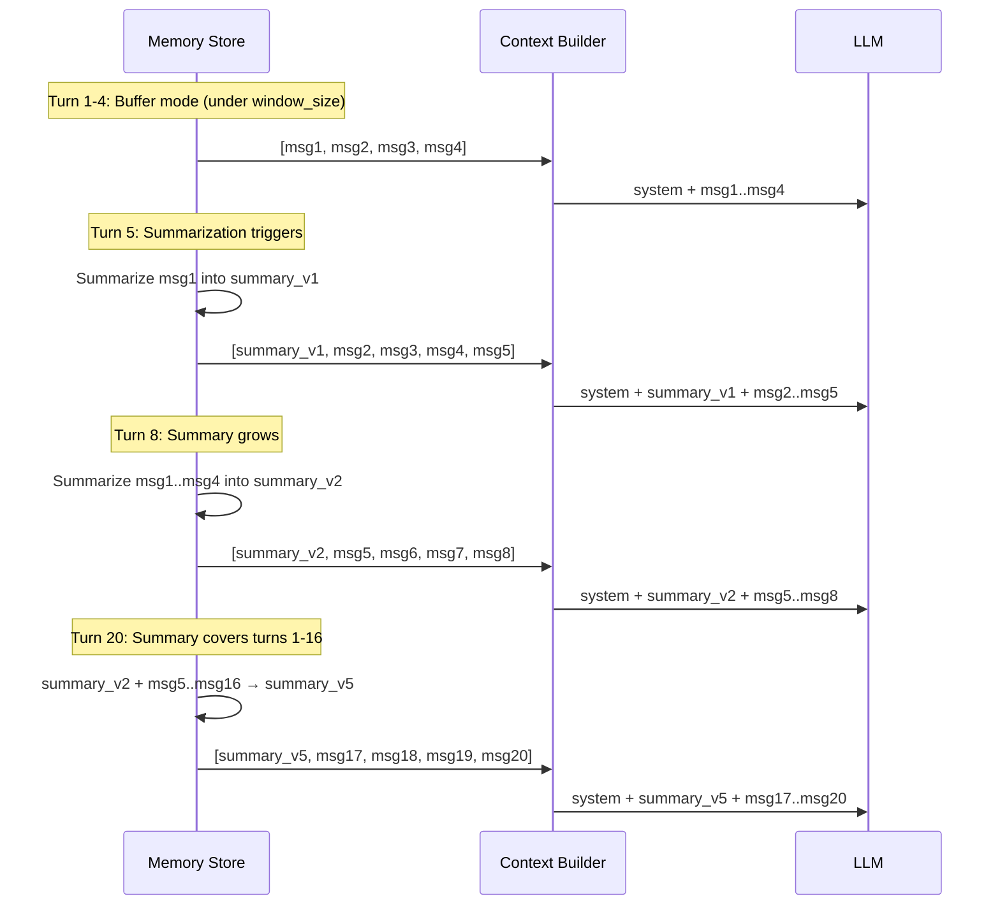

At turn 20, the LLM sees three things in this order:

1. **System prompt** -- who the agent is and what it can do
2. **Summary** -- a compressed account of turns 1 through 16, covering key decisions, requirements, and facts from those earlier turns
3. **Recent messages** -- the verbatim last 4 messages, giving the LLM full detail on the current thread of conversation

This layered structure is powerful. The summary provides *breadth* (the agent knows what happened earlier), while the recent window provides *depth* (the agent sees exact wording, code snippets, and nuances of the current exchange). Together, they give the LLM the illusion of a much longer memory than the context window would otherwise allow.

## 6.2 Connecting to Context Management

If you completed Module 5, lesson 04 on context window management, you may notice a strong connection. The `ConversationMemory` class handles *what messages to include*, while the `ContextManager` from that lesson handles *how to allocate token budgets* across system prompts, history, tool results, and generation space.

In a production agent, these two systems work together:

- The **ConversationMemory** decides which messages represent the conversation history -- applying buffer, window, or summarization as appropriate
- The **ContextManager** takes that history and fits it alongside tool results, system prompts, and generation reserves into the overall token budget

Think of conversation memory as the *content curator* and context management as the *space allocator*. The curator selects what is worth showing. The allocator ensures it all fits.

> **Key insight:** Conversation memory and context management are complementary, not competing. Memory strategies decide *which* information to keep. Context budgets decide *how much room* that information gets. A well-designed agent uses both.

## 6.2 Trade-Off Comparison

Each strategy has distinct characteristics that matter for different use cases.

| Characteristic | Buffer | Sliding Window | Summarization |
|---|---|---|---|
| **Implementation complexity** | Trivial | Simple | Moderate |
| **Information loss** | None | Abrupt (old messages vanish) | Gradual (details compressed) |
| **Token cost per turn** | Grows linearly | Constant (capped at window) | Moderate (summary + window) |
| **Extra LLM calls** | None | None | One per summarization cycle |
| **Latency impact** | Grows with history | Constant | Spikes during summarization |
| **Best for** | Short conversations, prototypes | Recency-focused tasks | Long conversations needing context |

In practice, many production agents use a **hybrid approach**: start with buffer mode, switch to sliding window when a soft threshold is crossed, and upgrade to summarization if the agent detects that it is losing critical context (for example, if a user references something that is no longer in the window).

## 6.2 Common Pitfalls

**Pitfall 1: Forgetting that memory is re-sent every turn.** New developers sometimes assume the LLM "remembers" the previous call. It does not. If you forget to include conversation history in the messages array, the agent has complete amnesia every turn.

**Pitfall 2: Summarizing too frequently.** If you summarize after every single new message, you are making an LLM call per turn just for memory management. This doubles your latency and cost. Summarize in batches -- when the old-message block grows by 10-20 messages, not every time it grows by 1.

**Pitfall 3: Losing the system prompt in the summary.** If your system prompt is stored as the first message and your sliding window drops it, the agent loses its instructions and persona. Always treat the system prompt separately -- pass it through `get_messages(system_prompt=...)` rather than storing it as a regular message.

**Pitfall 4: Not monitoring memory health.** Without visibility into memory stats, you will not know that your agent is silently losing context until users report inconsistent behavior. Always expose metrics like total tokens used, summarization frequency, and utilization percentage. The `get_stats()` method exists for exactly this reason.

## 6.2 Summary

Conversation memory is the mechanism that gives stateless LLMs the appearance of continuity. Because every API call is independent, your application must explicitly manage which messages to re-send, how many to keep, and what to do when the conversation outgrows the context window.

- **Buffer memory** stores everything and works perfectly for short conversations, but offers no protection against context overflow
- **Sliding window memory** caps the context at the most recent K messages, providing predictable token usage at the cost of abrupt information loss for older turns
- **Summarization memory** compresses older turns into a condensed summary, preserving semantic content at reduced token cost -- but adds latency, API expense, and lossy compression
- The **ConversationMemory** class encapsulates all three strategies behind a common interface: `add_message()` to store, `get_messages()` to retrieve with the active strategy applied
- In production, conversation memory works alongside the **context manager** (Module 5, lesson 04) -- memory selects *which* messages to keep, the context manager allocates *how much space* they get
- **Monitor memory health** with utilization metrics to catch context overflow before it causes inconsistent agent behavior
- Most production agents use a **hybrid approach**, starting with buffer mode and escalating to summarization as conversations grow

Everything we have covered in this lesson happens *within a single session*. When the user closes the chat and comes back tomorrow, the conversation memory is gone. What about remembering across sessions? What about learning facts that persist indefinitely -- a user's preferences, past decisions, or domain knowledge accumulated over weeks of interaction? That is the domain of **long-term memory**, which we explore in the next lesson.

---

    Section 6.3: Long-Term Memory


## 6.3 Overview

In the previous lesson, you learned how **conversation memory** and **short-term memory** strategies -- summarization, sliding windows, token budgets -- keep the agent's current session coherent. But those techniques have a fundamental limitation: when the session ends, the memories disappear. The agent wakes up the next day with no recollection of who it talked to, what it learned, or what it decided.

Humans do not work this way. You remember that a colleague prefers email over Slack. You recall that the last time you deployed on a Friday, something broke. You know how to write a SQL migration because you have done it dozens of times. These are not facts sitting in your "context window" right now -- they are stored in **long-term memory** and retrieved on demand.

This lesson introduces long-term memory for agents: how to persist knowledge across sessions, what types of memory exist, and how to build a system that stores, retrieves, and updates memories using embeddings and structured storage. By the end, you will have a working `LongTermMemory` class and a clear understanding of the architecture that underpins memory-augmented agents.

## 6.3 Why Long-Term Memory Changes Everything

Without long-term memory, every agent session starts from zero. The agent cannot learn from past mistakes, remember user preferences, or accumulate domain knowledge. It repeats the same questions, makes the same errors, and treats every user as a stranger.

With long-term memory, an agent can:

- **Personalize** -- remember that User A likes concise answers while User B prefers detailed explanations
- **Learn from experience** -- recall that a particular API endpoint returns errors on weekends and route around it
- **Accumulate knowledge** -- build up a repository of facts discovered during past sessions
- **Avoid redundant work** -- remember that it already solved a similar problem last week and reuse the approach

The difference is the gap between a stateless function and a knowledgeable assistant. Long-term memory is what turns a tool into a collaborator.

## 6.3 Three Types of Long-Term Memory

Cognitive science distinguishes several types of human long-term memory. Agent systems benefit from the same taxonomy, because each type serves a different purpose and requires different storage strategies.

**Episodic memory** stores records of specific past experiences. "The user asked me to refactor the auth module on Tuesday and rejected my first approach because it broke backward compatibility." Episodic memories are timestamped, contextualized, and tied to particular interactions. They let the agent learn from what went well and what did not.

**Semantic memory** stores general facts and knowledge independent of when or how they were learned. "PostgreSQL supports JSONB columns." "The company's production database is hosted on AWS RDS in us-east-1." Semantic memories are timeless truths (or at least truths that change slowly). They form the agent's knowledge base.

**Procedural memory** stores learned skills and patterns -- how to do things. "When deploying to production, always run the migration script before restarting the service." "When the user asks for a chart, use matplotlib with the company's brand colors." Procedural memories are action-oriented recipes that the agent has acquired through experience or instruction.

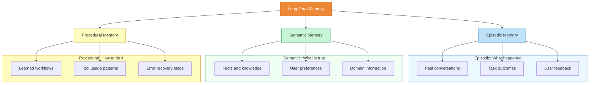

In practice, many agent systems start with semantic memory (a knowledge base of facts) and add episodic memory later (a log of past interactions). Procedural memory is often the hardest to implement well because it requires the agent to generalize from specific experiences into reusable patterns.

## 6.3 The Long-Term Memory Architecture

A production long-term memory system combines three storage layers, each optimized for a different access pattern.

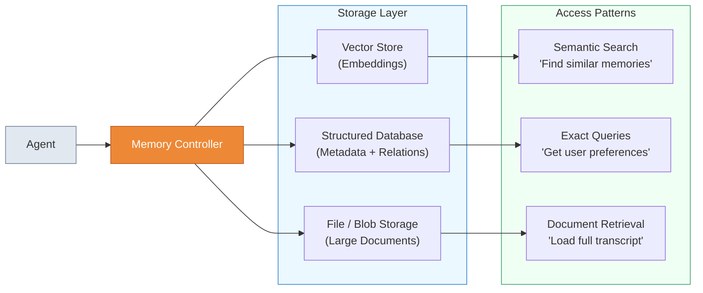

The **vector store** holds embedding vectors alongside text chunks. This is where semantic similarity search happens -- when the agent asks "have I seen anything like this before?", the vector store finds the closest matches by comparing embedding vectors. You will learn exactly how embeddings work in Lesson 05.

The **structured database** holds metadata, relationships, and fields that need exact-match queries. User preferences, memory timestamps, access counts, memory types, and tags all live here. When the agent needs "all memories tagged as `user-preference` for user ID 42," a structured query is far more efficient than a vector similarity search.

The **file or blob storage** holds large objects that would be wasteful to embed in their entirety -- full conversation transcripts, uploaded documents, generated reports. The structured database stores a reference (a file path or URL), and the agent retrieves the full content only when it needs it.

Not every system needs all three layers. A simple agent might use only a vector store with metadata columns. A production system handling millions of memories will typically use all three, with the memory controller deciding which layer to query based on the type of retrieval needed.

## 6.3 The Store-Retrieve-Update Cycle

Long-term memory is not a write-once archive. Memories need to be created, found, and maintained over time. The **store-retrieve-update cycle** governs how memories flow through the system.

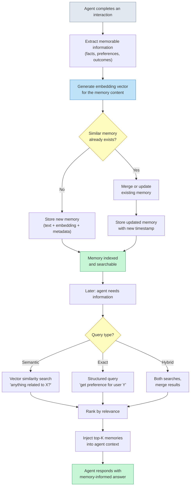

Three aspects of this cycle deserve emphasis.

**Extraction is the hardest step.** Not everything the agent encounters is worth remembering. A good memory system extracts key facts, user preferences, task outcomes, and lessons learned while ignoring routine chatter. This is often done by prompting the LLM itself: "Given this conversation, what facts should be stored for future reference?"

**Deduplication prevents memory bloat.** If the user says "I prefer dark mode" in five different sessions, the agent should not store five separate memories. Before storing, the system checks for existing memories that overlap semantically and either merges them or updates the existing record.

**Retrieval must be fast and relevant.** When the agent needs memories mid-conversation, the retrieval step adds latency. If it takes two seconds to search memories, the user will notice. Vector search with pre-computed embeddings keeps this fast -- typically under 50 milliseconds for collections of tens of thousands of memories.

## 6.3 Building a LongTermMemory Class

Let's implement the core of a long-term memory system. This class handles storing memories with embeddings, retrieving by semantic similarity, and updating existing memories. For the embedding function, we use a placeholder that you will replace with a real embedding model in Lesson 05.

**long_term_memory.py (1/3) -- Data structures**

```python
import json
import sqlite3
import time
from dataclasses import dataclass, field
from typing import Optional


@dataclass
class Memory:
    """A single long-term memory entry."""
    id: Optional[int] = None
    content: str = ""
    memory_type: str = "semantic"  # episodic, semantic, procedural
    metadata: dict = field(default_factory=dict)
    embedding: list[float] = field(default_factory=list)
    created_at: float = 0.0
    updated_at: float = 0.0
    access_count: int = 0


def compute_embedding(text: str) -> list[float]:
    """
    Placeholder embedding function.
    In production, replace with a real model:
      - OpenAI: openai.embeddings.create(model="text-embedding-3-small", input=text)
      - Sentence Transformers: model.encode(text).tolist()
    Returns a normalized vector. Lesson 05 covers this in detail.
    """
    # Simple hash-based placeholder (NOT for production use)
    import hashlib
    h = hashlib.sha256(text.encode()).hexdigest()
    vec = [int(h[i:i+2], 16) / 255.0 for i in range(0, 64, 2)]
    norm = sum(x**2 for x in vec) ** 0.5
    return [x / norm for x in vec]


def cosine_similarity(a: list[float], b: list[float]) -> float:
    """Compute cosine similarity between two vectors."""
    dot = sum(x * y for x, y in zip(a, b))
    norm_a = sum(x**2 for x in a) ** 0.5
    norm_b = sum(x**2 for x in b) ** 0.5
    if norm_a == 0 or norm_b == 0:
        return 0.0
    return dot / (norm_a * norm_b)
```

The `Memory` dataclass captures everything about a single memory: its text content, its type (episodic, semantic, or procedural), arbitrary metadata for structured queries, the embedding vector for similarity search, timestamps, and an access counter for tracking how often the memory is retrieved.

Now let's build the `LongTermMemory` class itself.

**long_term_memory.py (2/3) -- LongTermMemory class**

```python
class LongTermMemory:
    """
    Persistent long-term memory with semantic search.
    Uses SQLite for storage and cosine similarity for retrieval.
    """

    def __init__(self, db_path: str = "agent_memory.db"):
        self.db_path = db_path
        self.conn = sqlite3.connect(db_path)
        self._create_tables()

    def _create_tables(self) -> None:
        self.conn.execute("""
            CREATE TABLE IF NOT EXISTS memories (
                id INTEGER PRIMARY KEY AUTOINCREMENT,
                content TEXT NOT NULL,
                memory_type TEXT NOT NULL DEFAULT 'semantic',
                metadata TEXT NOT NULL DEFAULT '{}',
                embedding TEXT NOT NULL DEFAULT '[]',
                created_at REAL NOT NULL,
                updated_at REAL NOT NULL,
                access_count INTEGER NOT NULL DEFAULT 0
            )
        """)
        self.conn.execute("""
            CREATE INDEX IF NOT EXISTS idx_memory_type
            ON memories(memory_type)
        """)
        self.conn.commit()

    def store(self, content: str, memory_type: str = "semantic",
              metadata: Optional[dict] = None) -> Memory:
        """
        Store a new memory. Checks for duplicates first -- if a
        semantically similar memory exists (similarity > 0.9),
        the existing memory is updated instead.
        """
        embedding = compute_embedding(content)
        now = time.time()

        # Check for near-duplicate
        existing = self._find_duplicate(embedding, threshold=0.9)
        if existing:
            return self.update(existing.id, content, metadata)

        meta_json = json.dumps(metadata or {})
        emb_json = json.dumps(embedding)

        cursor = self.conn.execute(
            """INSERT INTO memories
               (content, memory_type, metadata, embedding, created_at, updated_at)
               VALUES (?, ?, ?, ?, ?, ?)""",
            (content, memory_type, meta_json, emb_json, now, now),
        )
        self.conn.commit()

        return Memory(
            id=cursor.lastrowid, content=content,
            memory_type=memory_type, metadata=metadata or {},
            embedding=embedding, created_at=now, updated_at=now,
        )

    def retrieve(self, query: str, top_k: int = 5,
                 memory_type: Optional[str] = None) -> list[Memory]:
        """
        Retrieve the most relevant memories for a query using
        cosine similarity over embeddings.
        """
        query_embedding = compute_embedding(query)

        # Load candidate memories
        if memory_type:
            rows = self.conn.execute(
                "SELECT * FROM memories WHERE memory_type = ?",
                (memory_type,),
            ).fetchall()
        else:
            rows = self.conn.execute("SELECT * FROM memories").fetchall()

        # Score each memory by similarity
        scored = []
        for row in rows:
            mem = self._row_to_memory(row)
            score = cosine_similarity(query_embedding, mem.embedding)
            scored.append((score, mem))

        # Sort by similarity (descending) and return top-K
        scored.sort(key=lambda x: x[0], reverse=True)
        results = []
        for score, mem in scored[:top_k]:
            # Update access count
            self.conn.execute(
                "UPDATE memories SET access_count = access_count + 1 WHERE id = ?",
                (mem.id,),
            )
            mem.access_count += 1
            results.append(mem)

        self.conn.commit()
        return results

    def search_by_type(self, memory_type: str) -> list[Memory]:
        """Retrieve all memories of a specific type (exact match)."""
        rows = self.conn.execute(
            "SELECT * FROM memories WHERE memory_type = ? ORDER BY updated_at DESC",
            (memory_type,),
        ).fetchall()
        return [self._row_to_memory(row) for row in rows]

    def update(self, memory_id: int, new_content: str,
               new_metadata: Optional[dict] = None) -> Memory:
        """Update an existing memory with new content."""
        now = time.time()
        embedding = compute_embedding(new_content)
        meta_json = json.dumps(new_metadata or {})

        self.conn.execute(
            """UPDATE memories
               SET content = ?, metadata = ?, embedding = ?, updated_at = ?
               WHERE id = ?""",
            (new_content, meta_json, json.dumps(embedding), now, memory_id),
        )
        self.conn.commit()

        return Memory(
            id=memory_id, content=new_content,
            memory_type="semantic", metadata=new_metadata or {},
            embedding=embedding, updated_at=now,
        )

    def _find_duplicate(self, embedding: list[float],
                        threshold: float) -> Optional[Memory]:
        """Find an existing memory with similarity above the threshold."""
        rows = self.conn.execute("SELECT * FROM memories").fetchall()
        for row in rows:
            mem = self._row_to_memory(row)
            if cosine_similarity(embedding, mem.embedding) > threshold:
                return mem
        return None

    def _row_to_memory(self, row: tuple) -> Memory:
        return Memory(
            id=row[0], content=row[1], memory_type=row[2],
            metadata=json.loads(row[3]), embedding=json.loads(row[4]),
            created_at=row[5], updated_at=row[6], access_count=row[7],
        )
```

The class follows the store-retrieve-update cycle directly. The `store` method computes an embedding, checks for near-duplicates, and either creates a new record or updates an existing one. The `retrieve` method computes a query embedding, scores every candidate memory by cosine similarity, and returns the top-K results. The `update` method replaces a memory's content and recomputes its embedding.

One important limitation: this implementation scans all memories for similarity search. That works fine for thousands of memories but does not scale to millions. In Lesson 05, you will learn about vector databases (Pinecone, Weaviate, Chroma, pgvector) that use approximate nearest-neighbor algorithms to search millions of vectors in milliseconds.

## 6.3 Using the Memory System

Here is how an agent would use the `LongTermMemory` class across sessions.

**long_term_memory.py (3/3) -- Usage across sessions**

```python
# --- Session 1: Agent learns about the user ---
memory = LongTermMemory(db_path="agent_memory.db")

# Store user preferences (semantic memory)
memory.store(
    "User prefers Python over JavaScript for backend work",
    memory_type="semantic",
    metadata={"category": "user_preference", "user_id": "u_42"},
)

memory.store(
    "User's production database is PostgreSQL 15 on AWS RDS us-east-1",
    memory_type="semantic",
    metadata={"category": "infrastructure", "user_id": "u_42"},
)

# Store a task outcome (episodic memory)
memory.store(
    "Attempted to refactor auth module on 2025-01-15. First approach "
    "broke backward compatibility. Second approach using the adapter "
    "pattern was accepted by the user.",
    memory_type="episodic",
    metadata={"task": "auth_refactor", "outcome": "success"},
)

# Store a learned procedure (procedural memory)
memory.store(
    "When deploying to production: 1) Run database migrations, "
    "2) Deploy the new container image, 3) Run smoke tests, "
    "4) Enable traffic routing. Never skip the migration step.",
    memory_type="procedural",
    metadata={"category": "deployment", "importance": "critical"},
)

print(f"Stored {len(memory.search_by_type('semantic'))} semantic memories")
print(f"Stored {len(memory.search_by_type('episodic'))} episodic memories")
print(f"Stored {len(memory.search_by_type('procedural'))} procedural memories")


# --- Session 2: Agent retrieves relevant context ---
memory = LongTermMemory(db_path="agent_memory.db")  # reconnect

# User asks: "Set up a new API endpoint"
relevant = memory.retrieve("building a backend API endpoint", top_k=3)
for mem in relevant:
    print(f"[{mem.memory_type}] {mem.content[:80]}...")

# Output might include:
#   [semantic] User prefers Python over JavaScript for backend work...
#   [semantic] User's production database is PostgreSQL 15 on AWS RDS...
#   [procedural] When deploying to production: 1) Run database migrations...

# The agent now knows to write Python, connect to PostgreSQL,
# and follow the deployment procedure -- without asking again.
```

Notice that session 2 connects to the same database file and immediately has access to everything learned in session 1. The agent does not need to ask the user their language preference or database setup again. The `retrieve` call finds the most relevant memories for the current task, and the agent can inject them into its context alongside the current conversation.

## 6.3 Comparing Storage Backends

The SQLite implementation above is a good starting point, but production systems have different requirements. Here is how the most common storage backends compare for long-term memory.

| Backend | Best For | Vector Search | Scalability | Setup Complexity |
|---------|----------|---------------|-------------|-----------------|
| **SQLite** | Prototyping, single-user agents | Manual (scan all rows) | Thousands of memories | Minimal -- no server needed |
| **PostgreSQL + pgvector** | Production apps with existing Postgres | Native (HNSW / IVFFlat indexes) | Millions of memories | Moderate -- requires extension |
| **Redis + RedisVSS** | Low-latency, session-heavy workloads | Native (HNSW indexes) | Millions, in-memory | Moderate -- requires Redis Stack |
| **Chroma / Pinecone / Weaviate** | Dedicated vector-first workloads | Native (optimized ANN) | Billions of vectors | Low to moderate (managed services) |

**SQLite** is the right choice when you are prototyping or building a single-user desktop agent. It requires no server, stores everything in one file, and is fast enough for small memory collections. The downside is that similarity search requires scanning every row, which degrades beyond tens of thousands of memories.

**PostgreSQL with pgvector** is often the best production choice when your application already uses PostgreSQL. The `pgvector` extension adds native vector columns and indexing (HNSW or IVFFlat), so you get similarity search without adding a separate database. You keep metadata, relations, and vectors in the same transactional database. This is what many production agent systems use.

**Redis with vector search** excels when you need sub-millisecond retrieval latency and your memories fit in memory. Redis Stack includes vector similarity search with HNSW indexing. It is particularly good for session-scoped memory where you need extremely fast reads, but it requires careful memory management for large collections.

**Dedicated vector databases** like Chroma, Pinecone, and Weaviate are purpose-built for embedding storage and search. They offer the best vector search performance and scale to billions of vectors. The trade-off is operational complexity -- you now have another database to manage, and you need a separate system for structured metadata queries. These are covered in depth in Lesson 05.

> **Practical advice:** Start with SQLite. When you need production scale, move to PostgreSQL + pgvector if you already run Postgres, or to a managed vector database if you want to offload infrastructure. Do not optimize for scale before you have validated that the memory system is useful.

## 6.3 Memory Lifecycle and Maintenance

Long-term memory is not "store and forget." Over time, memories become outdated, redundant, or irrelevant. A healthy memory system needs lifecycle management.

**Decay and importance scoring.** Not all memories are equally valuable. A memory that has been retrieved frequently is likely more important than one that has never been accessed. Some systems implement a **decay function** that reduces a memory's relevance score over time unless it is reinforced by access. The `access_count` field in our `Memory` class is the foundation for this -- memories that are never retrieved can be archived or deleted.

**Conflict resolution.** When new information contradicts an existing memory, the system needs a strategy. "The production database is on PostgreSQL 14" might need updating to "PostgreSQL 15" after an upgrade. The simplest approach is last-write-wins with a merge step. More sophisticated systems keep a version history so the agent can reason about how facts changed over time.

**Memory compaction.** Over many sessions, the agent accumulates hundreds of small, overlapping memories. Periodically, the system should compact related memories into consolidated summaries. Five memories about a user's code style preferences can be merged into one comprehensive preference profile. This reduces storage and makes retrieval faster.

## 6.3 Summary

**Long-term memory** gives agents the ability to persist knowledge across sessions, transforming them from stateless tools into learning systems that improve over time. The architecture combines a vector store for semantic similarity search, a structured database for exact queries and metadata, and optionally file storage for large documents.

- **Episodic memory** records specific past experiences -- what happened, what worked, what failed
- **Semantic memory** stores general facts and knowledge -- user preferences, domain information, configuration details
- **Procedural memory** captures learned workflows and action patterns -- how to deploy, how to handle errors, how to format output
- The **store-retrieve-update cycle** governs memory creation, deduplication, retrieval by similarity or exact query, and ongoing maintenance
- Storage backends range from **SQLite** for prototyping to **PostgreSQL + pgvector** for production to **dedicated vector databases** for extreme scale
- Memory lifecycle management -- decay scoring, conflict resolution, and compaction -- keeps the memory system healthy as it grows

The `LongTermMemory` class you built here uses a placeholder embedding function. In the next lesson, **Retrieval-Augmented Generation (RAG)**, you will learn how to give agents access to external knowledge bases -- documents, databases, and APIs -- so they can answer questions grounded in real data, not just their training knowledge.

---

    Section 6.4: Retrieval-Augmented Generation (RAG)


## 6.4 Overview

In the previous lessons, you explored why agents need memory, how conversation memory works within a session, and how long-term memory persists knowledge across sessions. But there is a harder problem lurking: how does an agent answer questions about knowledge it was never trained on? Your company's internal documentation, a product catalog updated yesterday, a research paper published last week -- none of this exists in the LLM's weights.

One approach is fine-tuning: retraining the model on your data. But fine-tuning is expensive, slow to update, and does not tell you *where* an answer came from. **Retrieval-Augmented Generation** -- universally known as **RAG** -- takes a different approach. Instead of baking knowledge into the model, you retrieve the relevant documents at query time, inject them into the prompt, and let the model generate a grounded response. The knowledge stays outside the model, in a searchable store you control.

RAG is arguably the most important pattern in applied LLM engineering. It is how chatbots answer questions about private data, how coding assistants reference your codebase, and how enterprise agents stay current without retraining. This lesson covers the core architecture, the indexing pipeline that prepares your data, and a working Python implementation you can extend.

## 6.4 Why RAG Beats Fine-Tuning for Knowledge

Before diving into architecture, it is worth understanding *why* RAG has become the default approach for knowledge-grounded agents. The comparison with fine-tuning is instructive.

**Fine-tuning** modifies the model's weights so it "learns" new information. This works for teaching a model a new *style* or *behavior* (like generating SQL or following a specific format), but it is a poor fit for factual knowledge:

- **Staleness** -- the model's knowledge is frozen at training time. When your documents change, you must retrain.
- **Cost** -- fine-tuning requires GPU hours and careful dataset preparation for every update.
- **No citations** -- the model cannot tell you which document it drew an answer from.
- **Hallucination** -- fine-tuned models still hallucinate. They just hallucinate more confidently about your domain.

**RAG** sidesteps all of these problems:

- **Always current** -- update the document store and the next query sees the new data.
- **Cheap to update** -- adding a document means embedding it and inserting a few vectors, not retraining a model.
- **Citable** -- every retrieved chunk carries metadata (source file, page number, URL), so the agent can show its sources.
- **Grounded** -- the model generates from actual text in its context window, not from vague weight patterns.

> RAG and fine-tuning are not mutually exclusive. Fine-tuning teaches the model *how* to behave; RAG teaches it *what* to know. Some production systems use both. But if you need an agent to answer questions from a document corpus, RAG is where you start.

## 6.4 The RAG Architecture

A RAG system has two pipelines: an **indexing pipeline** that runs offline to prepare your documents, and a **query pipeline** that runs in real time when a user asks a question.

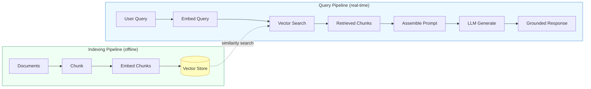

The two pipelines connect through the **vector store**: the indexing pipeline writes to it, and the query pipeline reads from it. Let's trace each one.

## 6.4 The Indexing Pipeline

Before your agent can retrieve anything, you need to prepare your documents. The indexing pipeline transforms raw documents into searchable vectors.

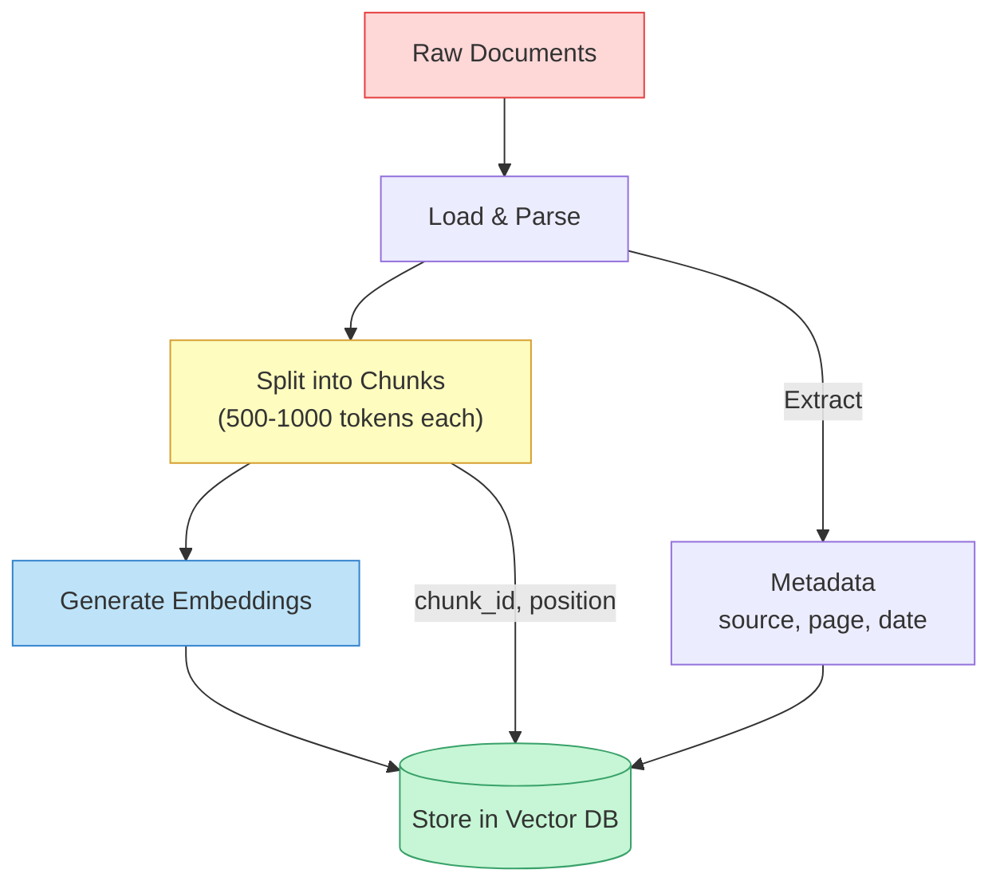

Each step solves a specific problem:

**Loading and parsing** converts your raw files -- PDFs, web pages, Markdown, databases -- into plain text. Different source types need different parsers, but the output is always text.

**Chunking** splits that text into smaller pieces. This is the step where most RAG implementations succeed or fail, because the chunk size and strategy directly affect retrieval quality. We will cover chunking strategies in detail below.

**Embedding** converts each text chunk into a dense vector (a list of floating-point numbers) that captures its semantic meaning. Texts with similar meanings produce vectors that are close together in the embedding space. We will cover embeddings in depth in lesson 05.

**Storing** writes each vector alongside the original chunk text and its metadata (source file, page number, creation date) into a **vector database** -- a database optimized for similarity search across high-dimensional vectors.

## 6.4 Chunking Strategies

**Chunking** is the process of splitting documents into retrieval units. The chunk size is a critical trade-off:

- **Too large** -- chunks exceed the context window budget, retrieval returns irrelevant padding alongside the useful text, and the model struggles to find the answer within walls of text.
- **Too small** -- chunks lose context. A single sentence about "it" makes no sense without the paragraph that defines what "it" refers to.

The three most common strategies are:

**Fixed-size chunking** splits text every N characters or tokens, with an overlap window. Simple and predictable, but it cuts through sentences, paragraphs, and sections without regard for meaning.

**Recursive character splitting** tries to split on natural boundaries -- double newlines (paragraphs) first, then single newlines, then sentences, then characters -- falling back to smaller separators only when a chunk would exceed the target size. This preserves structure better than fixed-size splitting.

**Semantic chunking** uses the document's own structure -- headings, sections, code blocks, list items -- to define chunk boundaries. This produces the most meaningful chunks but requires format-specific logic.

Most production systems start with recursive character splitting at 500-1000 tokens with 10-20% overlap. **Chunk overlap** means each chunk shares some text with its neighbors, ensuring that information at the boundary of two chunks is not lost during retrieval.

## 6.4 The Query Pipeline

When a user asks a question, the query pipeline runs in real time:

1. **Embed the query** -- the user's question is converted to a vector using the same embedding model that indexed the documents.
2. **Search** -- the vector store finds the K most similar chunk vectors (typically K = 3 to 10). This is called **approximate nearest neighbor** search.
3. **Assemble the prompt** -- the retrieved chunks are injected into the LLM's prompt, usually in the system message or as a clearly delineated context block.
4. **Generate** -- the LLM reads the context and produces an answer grounded in the retrieved documents.

This is where RAG connects to the prompt engineering techniques from Module 2. The way you structure the context injection prompt -- how you frame the retrieved chunks, what instructions you give the model, whether you tell it to cite sources or admit uncertainty -- directly determines the quality of the final response.

## 6.4 Building a Naive RAG Pipeline

Let's build a working RAG pipeline from scratch. This implementation uses a simple in-memory vector store so you can understand every step without external dependencies. In production, you would replace this with a dedicated vector database like ChromaDB, Pinecone, or pgvector.

First, the document loading and chunking layer:

**rag_pipeline.py**

```python
import anthropic
import json
import math

# --- Document Loading and Chunking ---

def load_documents(sources: list[dict]) -> list[dict]:
    """Load documents from a list of source definitions.
    Each source has 'text' and 'metadata' (source name, etc.)."""
    documents = []
    for source in sources:
        documents.append({
            "text": source["text"],
            "metadata": source.get("metadata", {})
        })
    return documents


def chunk_text(
    text: str,
    chunk_size: int = 500,
    chunk_overlap: int = 50,
    metadata: dict = None,
) -> list[dict]:
    """Split text into overlapping chunks using simple character splitting.
    Returns a list of chunks with text, metadata, and position info."""
    chunks = []
    start = 0
    chunk_index = 0

    while start < len(text):
        end = start + chunk_size

        # Try to break at a paragraph or sentence boundary
        if end < len(text):
            # Look for paragraph break first
            newline_pos = text.rfind("\\n\\n", start, end)
            if newline_pos > start + chunk_size // 2:
                end = newline_pos
            else:
                # Fall back to sentence boundary
                period_pos = text.rfind(". ", start, end)
                if period_pos > start + chunk_size // 2:
                    end = period_pos + 1

        chunk_text_content = text[start:end].strip()
        if chunk_text_content:
            chunks.append({
                "text": chunk_text_content,
                "metadata": {
                    **(metadata or {}),
                    "chunk_index": chunk_index,
                    "start_char": start,
                },
            })
            chunk_index += 1

        # Move forward, minus the overlap
        start = end - chunk_overlap if end < len(text) else len(text)

    return chunks
```

Next, the embedding and retrieval layer. We use a simple cosine similarity approach with a mock embedding function. In production, you would call an embedding API (like Voyage AI or OpenAI's embeddings endpoint):

**rag_pipeline.py**

```python
# --- Embedding and Vector Store ---

def get_embeddings(texts: list[str]) -> list[list[float]]:
    """Generate embeddings for a list of texts.
    In production, call an embedding API (e.g., Voyage AI, OpenAI).
    This mock uses simple word-frequency vectors for demonstration."""
    # Build vocabulary from all texts
    vocab = set()
    for text in texts:
        vocab.update(text.lower().split())
    vocab = sorted(vocab)
    word_to_idx = {w: i for i, w in enumerate(vocab)}

    # Create simple bag-of-words vectors
    embeddings = []
    for text in texts:
        vec = [0.0] * len(vocab)
        words = text.lower().split()
        for word in words:
            if word in word_to_idx:
                vec[word_to_idx[word]] += 1.0
        # Normalize to unit length
        magnitude = math.sqrt(sum(v * v for v in vec)) or 1.0
        vec = [v / magnitude for v in vec]
        embeddings.append(vec)
    return embeddings


def cosine_similarity(a: list[float], b: list[float]) -> float:
    """Compute cosine similarity between two vectors."""
    dot = sum(x * y for x, y in zip(a, b))
    return dot  # Vectors are already normalized


class SimpleVectorStore:
    """In-memory vector store for demonstration.
    Replace with ChromaDB, Pinecone, or pgvector in production."""

    def __init__(self):
        self.chunks = []       # Original chunk dicts
        self.embeddings = []   # Corresponding embedding vectors

    def add(self, chunks: list[dict]):
        """Index a list of chunks: embed their text and store."""
        texts = [c["text"] for c in chunks]
        vectors = get_embeddings(texts)
        self.chunks.extend(chunks)
        self.embeddings.extend(vectors)
        print(f"Indexed {len(chunks)} chunks ({len(self.chunks)} total)")

    def search(self, query: str, top_k: int = 3) -> list[dict]:
        """Find the top_k most similar chunks to the query."""
        query_vec = get_embeddings([query])[0]
        scored = []
        for i, emb in enumerate(self.embeddings):
            score = cosine_similarity(query_vec, emb)
            scored.append((score, i))
        scored.sort(reverse=True)
        results = []
        for score, idx in scored[:top_k]:
            results.append({
                "chunk": self.chunks[idx],
                "score": score,
            })
        return results
```

Finally, the query pipeline that ties retrieval to generation. Notice how the system prompt structures the context injection -- this connects directly to the prompt engineering patterns from Module 2:

**rag_pipeline.py**

```python
# --- RAG Query Pipeline ---

def rag_query(query: str, vector_store: SimpleVectorStore, top_k: int = 3) -> str:
    """Execute a full RAG pipeline: retrieve, augment, generate."""
    client = anthropic.Anthropic()

    # Step 1: Retrieve relevant chunks
    results = vector_store.search(query, top_k=top_k)

    # Step 2: Assemble context from retrieved chunks
    context_blocks = []
    for i, result in enumerate(results, 1):
        chunk = result["chunk"]
        source = chunk["metadata"].get("source", "unknown")
        context_blocks.append(
            f"[Source {i}: {source}]\\n{chunk['text']}"
        )
    context = "\\n\\n---\\n\\n".join(context_blocks)

    # Step 3: Generate response with context-augmented prompt
    system_prompt = f"""You are a knowledgeable assistant. Answer the user's question
based ONLY on the provided context. If the context does not contain
enough information to answer, say so clearly.

When you use information from the context, reference the source
(e.g., "According to Source 1...").

<context>
{context}
</context>"""

    response = client.messages.create(
        model="claude-sonnet-4-6",
        max_tokens=1024,
        system=system_prompt,
        messages=[{"role": "user", "content": query}],
    )

    return response.content[0].text


# --- Putting It All Together ---

# Sample documents about a fictional product
sources = [
    {
        "text": (
            "AcmeDB is a distributed database designed for real-time analytics. "
            "It supports SQL queries and can handle up to 10 million rows per "
            "second on a standard cluster. AcmeDB uses columnar storage for "
            "efficient analytical queries and row-based storage for transactional "
            "workloads. The query optimizer automatically selects the appropriate "
            "storage engine based on the query pattern."
        ),
        "metadata": {"source": "acmedb-overview.md"},
    },
    {
        "text": (
            "To install AcmeDB, download the binary for your platform from "
            "releases.acmedb.io. Run 'acmedb init' to create a new cluster, "
            "then 'acmedb start' to launch the server. The default port is "
            "5433. Connect using any PostgreSQL-compatible client. For "
            "production deployments, configure replication by setting "
            "replication_factor=3 in acmedb.conf."
        ),
        "metadata": {"source": "acmedb-install-guide.md"},
    },
    {
        "text": (
            "AcmeDB pricing is based on compute units. The free tier includes "
            "2 compute units and 10GB storage. The Pro plan costs $49/month "
            "for 8 compute units and 100GB storage. Enterprise plans start at "
            "$499/month with dedicated support and unlimited storage. All plans "
            "include automatic backups and point-in-time recovery."
        ),
        "metadata": {"source": "acmedb-pricing.md"},
    },
]

# Build the index
documents = load_documents(sources)
store = SimpleVectorStore()
for doc in documents:
    chunks = chunk_text(doc["text"], chunk_size=300, chunk_overlap=30, metadata=doc["metadata"])
    store.add(chunks)

# Query the RAG pipeline
answer = rag_query("How do I install AcmeDB?", store)
print(answer)
# The model answers using the installation guide chunk, citing Source 2
```

This implementation is deliberately simple. A production RAG system would use a real embedding model, a persistent vector database, and more sophisticated chunking. But the *architecture* is identical: chunk, embed, store, retrieve, augment, generate. Everything else is optimization on top of this skeleton.

## 6.4 How RAG Connects to Prompt Engineering

The "augment" step in RAG is fundamentally a prompt engineering problem. The way you inject retrieved context into the prompt determines whether the model produces a precise, well-sourced answer or a vague paraphrase. Several patterns from Module 2 apply directly:

- **XML tags for structure** -- wrapping context in `<context>` tags (as in the code above) helps the model distinguish between instructions and reference material.
- **Role framing** -- telling the model "answer based ONLY on the provided context" prevents it from blending retrieved facts with training data.
- **Uncertainty instructions** -- telling the model to say "I don't know" when the context is insufficient reduces hallucination. Without this instruction, the model will often fabricate plausible-sounding answers.
- **Citation instructions** -- asking the model to reference sources ("According to Source 2...") makes answers verifiable and builds user trust.

The system prompt in the `rag_query` function above demonstrates all four patterns. Getting this prompt right is often more impactful than tuning the retrieval parameters.

## 6.4 Common RAG Failure Modes

RAG is powerful but not foolproof. Understanding the common failure modes helps you diagnose problems when your pipeline produces poor answers:

- **Retrieval misses** -- the relevant document exists in the store but the query does not match it. This happens when the query phrasing diverges from the document phrasing. Lesson 06 covers reranking and query expansion to address this.
- **Context window overload** -- too many chunks or chunks that are too large flood the prompt with noise. The model sees the answer buried in irrelevant text and either misses it or gets confused.
- **Lost in the middle** -- LLMs pay more attention to information at the beginning and end of the context window than to content in the middle. If your answer is in chunk 5 out of 10, the model may overlook it.
- **Chunk boundary splits** -- a critical piece of information is split across two chunks and neither chunk alone makes sense. This is why overlap matters.
- **Stale index** -- documents have been updated but the vector store still contains the old embeddings. Regular re-indexing is essential.

## 6.4 Summary

**Retrieval-Augmented Generation** is the pattern that lets agents answer questions from knowledge they were never trained on. Instead of modifying the model, you modify the prompt -- retrieving relevant documents and injecting them as context.

The architecture has two pipelines:

- **Indexing** -- load documents, split them into chunks, embed the chunks, and store the vectors
- **Query** -- embed the user's question, search for similar chunks, assemble a context-augmented prompt, and generate a grounded response

RAG beats fine-tuning for knowledge tasks because it is cheap to update, easy to cite, and always current. The trade-off is that it requires infrastructure (a vector store, an embedding model, a chunking strategy) and careful prompt engineering to get right.

The naive implementation in this lesson works end to end, but production RAG systems need better building blocks. In the next lesson, **Embeddings and Vector Stores**, we will take a deep dive into how embeddings actually work, what makes one embedding model better than another, and how to choose and configure a vector database for your use case. Then in lesson 06, we will revisit the RAG pipeline and layer on advanced techniques like hybrid search, reranking, and query decomposition.

---

    Section 6.5: Embeddings and Vector Stores


## 6.5 Overview

In the previous lesson, you learned how RAG combines retrieval with generation to ground agents in factual knowledge. But we treated the retrieval step as a black box -- you put text in, and relevant results came back. In this lesson, we open that box. How does a system know that "cardiovascular disease" and "heart condition" are semantically related, even though they share no words? How does it search through millions of documents in milliseconds? The answers are **embeddings** and **vector stores**.

Embeddings are the mathematical foundation that makes semantic search possible. A vector store is the infrastructure that makes it fast. Together, they form the retrieval engine at the heart of every RAG system. Understanding how they work -- not just how to call their APIs -- will help you make informed decisions about dimension sizes, distance metrics, indexing algorithms, and database choices that directly impact your agent's retrieval quality and cost.

## 6.5 What Embeddings Represent

An **embedding** is a dense numerical vector that captures the semantic meaning of a piece of text. Unlike keyword search, which matches exact words, embeddings encode *meaning* into a fixed-length array of floating-point numbers. The key insight is that texts with similar meanings end up close together in this high-dimensional space, even if they use completely different words.

When you pass the sentence "The patient has a heart condition" through an embedding model, you get back something like a 1536-dimensional vector -- an array of 1536 numbers. The sentence "Cardiovascular disease was diagnosed" produces a different vector, but one that points in nearly the same direction in that 1536-dimensional space. Meanwhile, "The restaurant serves excellent pasta" produces a vector pointing in a completely different direction.

This works because embedding models are trained on massive text corpora to learn that certain words and phrases appear in similar contexts. Through this training, the model learns to place semantically related concepts near each other in the vector space. The resulting vectors encode nuances that keyword matching cannot capture: synonyms, paraphrases, conceptual relationships, and even cross-lingual meaning.

> **Key insight:** Embeddings transform the problem of "find similar text" from a linguistic problem (comparing words and grammar) into a geometric problem (finding nearby points in space). Geometry is something computers are extremely good at.

## 6.5 The Embedding Pipeline

Every RAG system follows the same pipeline to get from raw text to searchable vectors. Understanding each stage helps you diagnose problems and optimize performance.

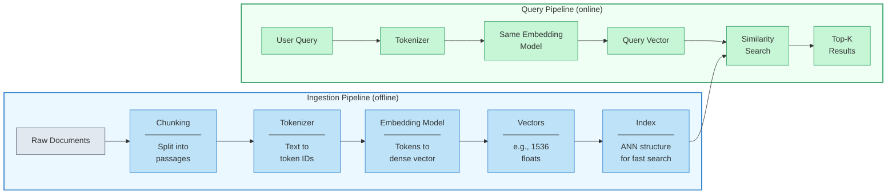

The pipeline has two phases:

- **Ingestion (offline):** Your documents are chunked into passages, each passage is converted to a vector by the embedding model, and the vectors are stored in an index. This is a batch process you run when your knowledge base changes.

- **Query (online):** The user's query is converted to a vector using the *same* embedding model, then the index is searched for the vectors closest to the query vector. The corresponding text passages are returned as results.

A critical requirement: the **same embedding model** must be used for both ingestion and query. Vectors from different models live in incompatible spaces -- comparing them is meaningless. If you switch models, you must re-embed your entire document collection.

## 6.5 Distance Metrics: Measuring Similarity

Once you have vectors, you need a way to measure how "close" two vectors are. This is where **distance metrics** come in. The choice of metric affects both retrieval quality and performance.

**Cosine similarity** measures the angle between two vectors, ignoring their magnitude. Two vectors pointing in the same direction have a cosine similarity of 1.0, perpendicular vectors score 0.0, and opposite vectors score -1.0. This is the most widely used metric for text embeddings because it focuses on *direction* (meaning) rather than *length* (which can vary with text length).

**Euclidean distance** (L2) measures the straight-line distance between two points in the vector space. Smaller values mean more similar. It considers both direction and magnitude, which can be useful when vector lengths carry meaningful information, but for most text embedding models, cosine similarity is preferred.

**Dot product** (inner product) multiplies corresponding dimensions and sums the results. It combines direction and magnitude. When vectors are normalized to unit length (which many embedding models do), dot product and cosine similarity produce identical rankings. Dot product is computationally cheaper, so many vector stores use it internally after normalizing the vectors.

> **Practical rule:** Use **cosine similarity** as your default for text embeddings. Switch to dot product only if your vectors are already normalized and you need the slight speed advantage. Use Euclidean distance only for specialized use cases where magnitude matters.

## 6.5 Indexing Algorithms: Making Search Fast

A brute-force search compares the query vector against every stored vector. This gives perfect results (exact nearest neighbors) but scales linearly with dataset size -- searching 10 million vectors means 10 million distance computations per query. At scale, this is too slow.

**Approximate Nearest Neighbor (ANN)** algorithms trade a small amount of accuracy for dramatic speed improvements. Instead of searching everything, they use clever data structures to narrow the search to a small subset of candidates.

### HNSW (Hierarchical Navigable Small World)

**HNSW** builds a multi-layer graph where each node is a vector and edges connect nearby vectors. The top layer is sparse (few nodes, long-range connections), and each lower layer adds more nodes with shorter-range connections. To search, you start at the top layer and greedily navigate toward the query vector, then drop to the next layer for finer-grained navigation, repeating until you reach the bottom layer.

Think of it like navigating a city: the top layer is a highway map (few exits, fast travel), the middle layers are main roads, and the bottom layer is every street. You take the highway to the right neighborhood, then use local streets to find the exact address.

**Strengths:** Excellent recall (typically 95-99%+ of true nearest neighbors). Fast query times even at large scale. No training step required -- vectors are inserted directly.

**Weaknesses:** High memory usage -- the graph structure is stored in RAM alongside the vectors. Insertion is slower than IVF because the graph must be updated.

### IVF (Inverted File Index)

**IVF** partitions the vector space into clusters using k-means clustering. Each vector is assigned to its nearest cluster centroid. To search, you first identify the closest centroids to the query vector, then search only the vectors within those clusters.

**Strengths:** Lower memory overhead than HNSW. Faster insertion. Works well with disk-based storage because you only need to load relevant clusters.

**Weaknesses:** Lower recall than HNSW at the same speed -- if the nearest neighbor is in a cluster that you did not search, you miss it. Requires a training step (the k-means clustering) before you can add vectors. Query quality depends heavily on the number of clusters searched (`nprobe`).

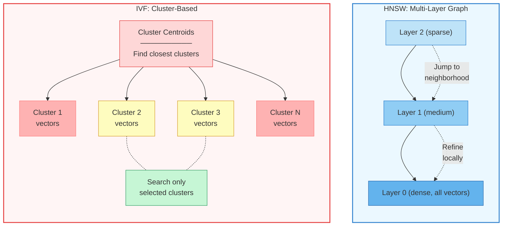

In practice, **HNSW is the default choice** for most applications because its recall-speed trade-off is superior. IVF is preferred when memory is constrained or when the dataset is too large to fit the HNSW graph in RAM.

## 6.5 Choosing Embedding Dimensions

Embedding models produce vectors of a fixed dimension -- 256, 768, 1024, 1536, or 3072 are common sizes. The dimension represents the expressiveness of the semantic space: more dimensions can encode finer-grained distinctions, but at a cost.

**Higher dimensions** (1536, 3072):
- Capture more nuanced semantic relationships
- Better at distinguishing between subtly different concepts
- Higher storage cost -- a 3072-dim vector uses 12KB (32-bit floats)
- Slower similarity computation (more multiplications per comparison)
- Risk of overfitting on small datasets

**Lower dimensions** (256, 512):
- Faster to compute and search
- Lower storage and memory requirements
- Sufficient for many practical applications, especially with well-trained models
- May lose fine-grained distinctions between closely related concepts

**The practical sweet spot** for most applications is 768-1536 dimensions. Modern embedding models like Voyage 3 (1024-dim) and OpenAI's `text-embedding-3-small` (1536-dim) hit a strong balance between quality and efficiency. Some models support **Matryoshka embeddings**, where you can truncate the vector to a smaller dimension (e.g., use only the first 512 of 1536 dimensions) with graceful quality degradation -- useful when you need to trade precision for speed.

## 6.5 Comparing Vector Stores

Choosing a vector store depends on your scale, infrastructure preferences, and operational requirements. Here is how the major options compare:

| Feature | ChromaDB | FAISS | pgvector | Pinecone | Weaviate |
|---------|----------|-------|----------|----------|----------|
| **Type** | Embedded DB | Library | PostgreSQL extension | Managed cloud | Self-hosted / cloud |
| **Best for** | Prototypes, small apps | Research, single-machine perf | Teams already on PostgreSQL | Production SaaS, zero-ops | Hybrid search, multi-modal |
| **Max scale** | ~1M vectors | ~1B vectors (single machine) | ~10M vectors | ~1B+ vectors | ~1B+ vectors |
| **Index types** | HNSW | HNSW, IVF, PQ, flat | HNSW, IVF | Proprietary ANN | HNSW |
| **Persistence** | SQLite / DuckDB | File-based | PostgreSQL tables | Fully managed | Disk / cloud storage |
| **Filtering** | Metadata filters | Requires custom code | SQL WHERE clauses | Metadata filters | GraphQL + filters |
| **Ops overhead** | Minimal | None (library) | Existing PG ops | None (managed) | Moderate |
| **Cost model** | Free / open-source | Free / open-source | Free + PG hosting | Pay per vector + query | Free + hosting |

**ChromaDB** is ideal for learning, prototyping, and applications with fewer than a million vectors. It runs in-process with no external dependencies, has a clean Python API, and handles persistence automatically. If you are building a RAG agent and want to get started in minutes, start here.

**FAISS** (Facebook AI Similarity Search) is a battle-tested library, not a database. It gives you fine-grained control over index types, quantization, and GPU acceleration. It excels when you need maximum single-machine performance but requires you to handle persistence, metadata, and filtering yourself.

**pgvector** extends PostgreSQL with vector operations. If your team already runs PostgreSQL, this avoids adding a new database to your infrastructure. You get the full power of SQL for filtering and joining vector results with relational data. The trade-off is that PostgreSQL was not designed for vector workloads, so performance at very large scale lags behind purpose-built solutions.

**Pinecone** is a fully managed cloud service. You send vectors, it handles indexing, sharding, replication, and scaling. Ideal for teams that want production-grade vector search without operational overhead. The trade-off is vendor lock-in and per-query pricing.

**Weaviate** offers a strong hybrid search capability (combining vector search with keyword search in a single query) and supports multi-modal data (text, images, audio). It can be self-hosted or used as a cloud service.

## 6.5 Working with Embeddings and ChromaDB

Let's build a complete example: embed documents, store them in ChromaDB, and query for similar content. We will use Voyage AI embeddings (Anthropic's recommended embedding provider), but the pattern is identical with any embedding model.

**embedding_pipeline.py**

```python
import voyageai
import chromadb


# ── 1. Initialize the embedding model and vector store ──────────

# Voyage AI client (set VOYAGE_API_KEY in your environment)
voyage = voyageai.Client()
MODEL = "voyage-3"           # 1024-dim, strong general-purpose model

# ChromaDB persists to disk so vectors survive restarts
chroma_client = chromadb.PersistentClient(path="./vector_store")

# A collection is like a table -- one per knowledge domain
collection = chroma_client.get_or_create_collection(
    name="agent_knowledge",
    metadata={"hnsw:space": "cosine"},   # use cosine similarity
)


# ── 2. Embed and store documents ────────────────────────────────

documents = [
    "ReAct agents interleave reasoning and action. The agent thinks "
    "about what to do, takes an action, observes the result, and "
    "repeats until the task is complete.",

    "Plan-and-Execute agents separate planning from execution. "
    "First the agent creates a complete plan, then a separate "
    "executor carries out each step.",

    "Tool use allows LLMs to interact with external systems. "
    "The model generates a structured tool call, the runtime "
    "executes it, and the result is fed back to the model.",

    "Retrieval-Augmented Generation combines a retriever that "
    "finds relevant documents with a generator that produces "
    "answers grounded in those documents.",

    "Embedding models convert text into dense numerical vectors "
    "that capture semantic meaning. Similar texts produce vectors "
    "that are close together in the embedding space.",
]

# Generate embeddings for all documents in one batch
embeddings = voyage.embed(
    documents,
    model=MODEL,
    input_type="document",    # tells the model these are passages to index
).embeddings

# Store in ChromaDB with metadata for filtering
collection.add(
    ids=[f"doc-{i}" for i in range(len(documents))],
    embeddings=embeddings,
    documents=documents,
    metadatas=[
        {"topic": "react", "module": 3},
        {"topic": "plan-execute", "module": 3},
        {"topic": "tools", "module": 4},
        {"topic": "rag", "module": 6},
        {"topic": "embeddings", "module": 6},
    ],
)
print(f"Stored {len(documents)} documents ({len(embeddings[0])}-dim vectors)")


# ── 3. Query: find relevant documents ──────────────────────────

query = "How do agents decide what action to take next?"

# Embed the query (note: input_type="query" for queries)
query_embedding = voyage.embed(
    [query],
    model=MODEL,
    input_type="query",
).embeddings[0]

# Search for the 3 most similar documents
results = collection.query(
    query_embeddings=[query_embedding],
    n_results=3,
    include=["documents", "distances", "metadatas"],
)

print(f"\\nQuery: {query}\\n")
for i, (doc, dist, meta) in enumerate(zip(
    results["documents"][0],
    results["distances"][0],
    results["metadatas"][0],
)):
    similarity = 1 - dist   # ChromaDB returns distance, not similarity
    print(f"  {i+1}. [similarity={similarity:.3f}] (topic={meta['topic']})")
    print(f"     {doc[:100]}...\\n")
```

Several design decisions are worth noting:

- **`input_type` matters.** Voyage (and many modern embedding models) distinguish between documents being indexed and queries being searched. The model applies slightly different transformations to each, improving retrieval accuracy. Always use `"document"` when embedding passages for storage and `"query"` when embedding search queries.

- **Batch embedding** is dramatically faster than embedding one document at a time. Voyage supports up to 128 documents per call. For large ingestion jobs, batch your documents to minimize API round-trips.

- **`hnsw:space`** tells ChromaDB which distance metric to use in the HNSW index. Setting it to `"cosine"` at collection creation time is important -- changing it later requires rebuilding the entire index.

- **Metadata filtering** lets you narrow search to specific subsets before the vector similarity search runs. Filtering by `module` or `topic` reduces the search space and improves relevance when your knowledge base spans multiple domains.

## 6.5 Adding Metadata Filtering to Queries

In production, you rarely want to search across your entire vector store. Metadata filtering lets you scope queries to relevant subsets:

**filtered_queries.py**

```python
# Search only within module 6 content
results = collection.query(
    query_embeddings=[query_embedding],
    n_results=3,
    where={"module": {"$eq": 6}},          # filter by metadata
    include=["documents", "distances", "metadatas"],
)

# Combine multiple filters
results = collection.query(
    query_embeddings=[query_embedding],
    n_results=5,
    where={
        "$and": [
            {"module": {"$gte": 3}},        # modules 3 and above
            {"topic": {"$ne": "tools"}},     # exclude tool-related docs
        ]
    },
    include=["documents", "distances", "metadatas"],
)

# Filter + similarity threshold (post-filter by distance)
results = collection.query(
    query_embeddings=[query_embedding],
    n_results=10,
    include=["documents", "distances"],
)

# Only keep results above a similarity threshold
SIMILARITY_THRESHOLD = 0.7
relevant = [
    (doc, 1 - dist)
    for doc, dist in zip(results["documents"][0], results["distances"][0])
    if (1 - dist) >= SIMILARITY_THRESHOLD
]

print(f"Found {len(relevant)} results above {SIMILARITY_THRESHOLD} similarity")
for doc, sim in relevant:
    print(f"  [{sim:.3f}] {doc[:80]}...")
```

The combination of **vector similarity** (semantic matching) and **metadata filtering** (exact matching on structured fields) is what makes vector stores practical for real applications. Without filtering, a query about "agent memory" might return results about "human memory in psychology" from a different part of your knowledge base.

## 6.5 Chunking Strategy: The Hidden Lever

Before you can embed documents, you must split them into chunks. This step is easy to overlook but has an outsized impact on retrieval quality. Chunk too large and the embedding becomes a blurry average of many topics. Chunk too small and you lose context that the reader needs to understand the passage.

**Fixed-size chunking** splits text into chunks of N tokens with an overlap of M tokens. Simple and predictable, but it can split sentences or paragraphs mid-thought.

**Recursive character splitting** tries to split on natural boundaries (paragraphs, then sentences, then words) while staying within a size limit. This produces more coherent chunks.

**Semantic chunking** uses the embedding model itself to detect topic boundaries -- it embeds sliding windows of text and splits where the similarity between consecutive windows drops sharply. More expensive but produces the most coherent chunks.

For most applications, **recursive character splitting with 500-1000 token chunks and 50-100 token overlap** is a strong starting point. The overlap ensures that information at chunk boundaries is not lost. You can tune from there based on retrieval quality.

## 6.5 Putting It Together: Architecture

Here is how embeddings and vector stores fit into the full RAG architecture of an agent system.

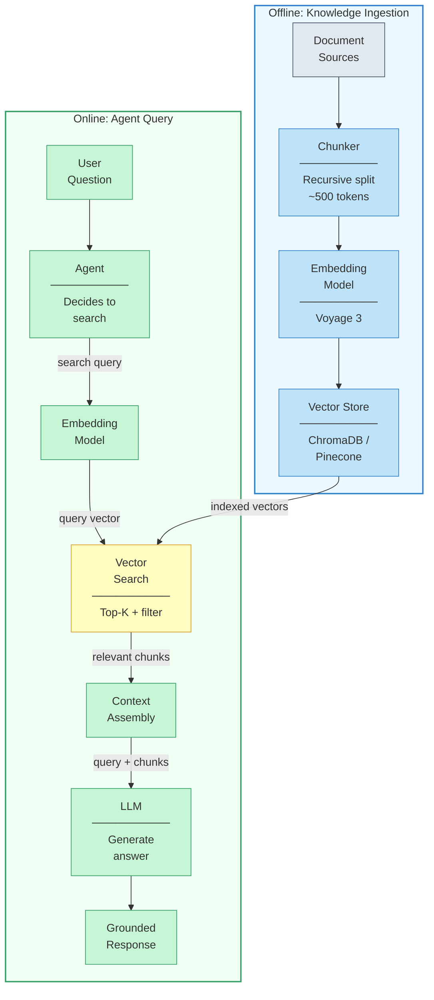

Each component is independently tunable:
- **Chunker** -- adjust chunk size and overlap to balance specificity vs. context
- **Embedding model** -- choose based on quality, dimension, and cost
- **Vector store** -- choose based on scale, infrastructure, and operational requirements
- **Search** -- tune top-K, similarity threshold, and metadata filters
- **Context assembly** -- decide how many chunks to include and how to format them for the LLM

## 6.5 Summary

Embeddings and vector stores are the retrieval engine that powers semantic search in RAG systems. Getting them right directly determines whether your agent retrieves the right information or hallucinates because it found irrelevant context.

- **Embeddings** convert text into dense numerical vectors where semantic similarity corresponds to geometric proximity -- similar meanings produce nearby vectors
- **Cosine similarity** is the default distance metric for text embeddings, measuring directional alignment rather than magnitude
- **HNSW** is the default indexing algorithm for most applications, offering excellent recall with fast query times at the cost of higher memory usage
- **IVF** trades recall for lower memory usage by partitioning vectors into clusters and searching only the nearest clusters
- **Embedding dimensions** of 768-1536 hit the practical sweet spot -- large enough for nuanced semantics, small enough for efficient search
- **ChromaDB** is the best starting point for prototypes and small-scale applications; **Pinecone** or **Weaviate** for production at scale; **pgvector** for teams already invested in PostgreSQL
- Always use the **same embedding model** for indexing and querying -- mixing models produces meaningless similarity scores
- **Metadata filtering** narrows search to relevant subsets before vector similarity runs, dramatically improving precision
- **Chunking strategy** has an outsized impact on retrieval quality -- start with recursive splitting at 500-1000 tokens with overlap, then tune based on results

In the next lesson, you will learn **Advanced RAG Patterns** -- hybrid search that combines keyword and semantic retrieval, reranking models that refine initial results, query decomposition for complex questions, and agentic RAG where the agent decides *how* to search, not just *what* to search for.

---

    Section 6.6: Advanced RAG Patterns


## 6.6 Overview

In the previous two lessons, you learned how basic **Retrieval-Augmented Generation** works and how **embeddings and vector stores** power the retrieval step. Those foundations handle straightforward use cases well -- a user asks a question, you embed it, find similar chunks, and feed them to the LLM. But real-world queries are messy. Users ask vague questions, complex multi-part questions, or questions where the best document does not share the same vocabulary as the query. A naive retrieve-then-generate pipeline quietly fails in all of these cases, returning plausible-sounding answers built on irrelevant context.

This lesson introduces the techniques that production RAG systems use to close that gap. You will learn how to transform queries before retrieval, combine multiple search strategies, rerank results for precision, and ultimately hand retrieval control to the agent itself. These are not theoretical improvements -- each technique addresses a specific, observable failure mode in basic RAG.

## 6.6 The Failure Modes of Naive RAG

Before diving into solutions, it helps to understand exactly *what goes wrong* with a simple embed-and-retrieve pipeline. There are four common failure patterns:

- **Vocabulary mismatch** -- the user says "car" but the document says "automobile." Vector search handles this better than keyword search, but it still struggles with domain-specific jargon and acronyms.
- **Low-relevance retrieval** -- the top-k chunks are topically related but do not actually answer the question. The LLM receives context that looks relevant but is not, and confidently generates a wrong answer.
- **Complex queries** -- the user asks a question that requires information from multiple documents or multiple aspects of a topic. A single retrieval pass returns chunks that cover only one aspect.
- **Unnecessary retrieval** -- the query is something the LLM already knows (e.g., "What does HTTP stand for?"), but the pipeline retrieves and injects context anyway, sometimes introducing noise that degrades the answer.

Every technique in this lesson targets one or more of these failure modes.

## 6.6 The Advanced RAG Pipeline

A production RAG system inserts additional stages between the user's query and the final generation. Each stage refines the information before it reaches the LLM.

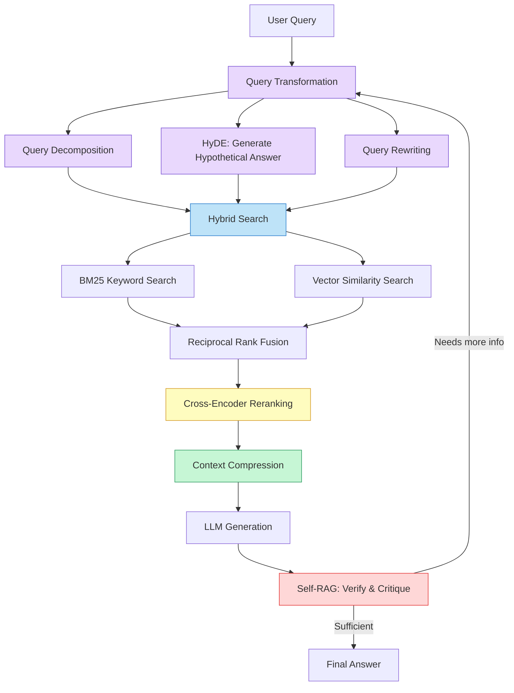

The purple stages transform the query, the blue stages perform retrieval, the yellow stage reranks, the green stage compresses context, and the red stage verifies the output. You do not need all of these in every system -- you choose the stages that address your specific failure modes.

## 6.6 Hybrid Search: BM25 + Vector

**Hybrid search** combines two complementary retrieval methods: **BM25** (a classic keyword-matching algorithm) and **vector similarity search** (the embedding-based approach from the previous lesson). The insight is simple -- keyword search excels at exact matches and rare terms, while vector search excels at semantic similarity. By running both and merging their results, you cover cases where either alone would fail.

Consider a user searching a medical knowledge base for "NSAID contraindications." A vector search might return chunks about "pain medication side effects" -- semantically related, but missing the specific acronym. BM25 would match "NSAID" exactly. Conversely, a query like "drugs you shouldn't take with blood thinners" would stump BM25 (no keyword overlap with "anticoagulant contraindications") but would be handled well by vector search.

**Reciprocal Rank Fusion (RRF)** is the standard technique for merging results from multiple search methods. It assigns each document a score based on its rank position in each result list, then combines the scores:

```
RRF_score(doc) = sum( 1 / (k + rank_i) )  for each retriever i
```

The constant `k` (typically 60) dampens the influence of rank position, preventing a single retriever from dominating. Documents that appear high in *both* lists get the highest combined scores.

## 6.6 Query Decomposition

**Query decomposition** addresses complex, multi-part questions by breaking them into simpler sub-queries that can each be answered independently. Instead of trying to retrieve all relevant information with a single search, you decompose the question into focused retrieval passes.

For example, the question *"How does Kubernetes handle pod scheduling differently from Docker Swarm, and what are the performance implications?"* requires knowledge about three distinct topics: Kubernetes scheduling, Docker Swarm scheduling, and performance benchmarks. A single retrieval pass is unlikely to surface chunks covering all three.

The decomposition approach uses the LLM itself to generate sub-queries:

1. The LLM analyzes the original question and produces 2-4 focused sub-queries
2. Each sub-query runs through the retrieval pipeline independently
3. The retrieved chunks are deduplicated and merged
4. The LLM generates the final answer using the combined context

## 6.6 HyDE: Hypothetical Document Embeddings

**Hypothetical Document Embeddings (HyDE)** tackles the vocabulary mismatch problem from a creative angle. Instead of embedding the user's *question*, you ask the LLM to generate a *hypothetical answer* -- a passage that *would* answer the question if it existed -- and embed that instead.

Why does this work? The hypothetical answer, even if factually imperfect, uses the same vocabulary and phrasing that a real answer document would use. When you embed it, the resulting vector is much closer in embedding space to the actual relevant documents than the original question vector would be.

The trade-off is clear: HyDE adds an extra LLM call before retrieval (latency and cost), and if the hypothetical answer is wildly off-base, it can pull retrieval in the wrong direction. It works best for domains where the LLM has enough background knowledge to generate a plausible (if imprecise) answer.

## 6.6 Cross-Encoder Reranking

Initial retrieval -- whether BM25, vector, or hybrid -- casts a wide net. The top 20-50 results are *probably* relevant, but their ranking is approximate. A **cross-encoder reranker** refines this ranking with much higher precision.

The difference is architectural. In the initial retrieval step, the query and each document are embedded *independently* -- the retriever never sees them together. A **cross-encoder** processes the query and a candidate document *jointly* as a single input, allowing the model to capture fine-grained interactions between query terms and document terms. This produces far more accurate relevance scores, but it is computationally expensive -- you cannot run a cross-encoder over millions of documents, only over the pre-filtered candidates.

This two-stage architecture -- fast approximate retrieval followed by precise reranking -- is the standard pattern in production search systems:

1. **Stage 1 (Retrieval):** Retrieve top-50 candidates using hybrid search. Fast, approximate.
2. **Stage 2 (Reranking):** Score each candidate with a cross-encoder. Slow, precise. Keep top-5.

## 6.6 Context Compression

Even after reranking, the retrieved chunks may contain irrelevant paragraphs, boilerplate headers, or tangential information. **Context compression** extracts only the sentences or passages that are directly relevant to the query, reducing noise in the LLM's context window.

This can be done with a lightweight model that scores each sentence for relevance, or by prompting the LLM itself to extract the relevant portions before generating the final answer. The benefit is twofold: less noise means better answers, and shorter context means lower token costs.

## 6.6 Self-RAG: Retrieval with Self-Critique

**Self-RAG** introduces a feedback loop into the pipeline. Instead of blindly generating an answer from retrieved context, the LLM evaluates its own output:

- **Do I need retrieval at all?** For simple factual questions the LLM already knows, retrieval may be unnecessary.
- **Is the retrieved context relevant?** The LLM scores each chunk before using it.
- **Is my answer supported by the context?** After generating, the LLM checks whether its claims are grounded in the retrieved passages.
- **Is the answer complete?** If not, trigger another retrieval cycle with a refined query.

Self-RAG transforms the pipeline from a single pass into an iterative loop where the LLM actively manages retrieval quality. This connects directly to the self-reflection architecture you studied in Module 4 -- the same principle of having the LLM critique and revise its own work, applied specifically to the retrieval-generation cycle.

## 6.6 Agentic RAG: The Agent Controls Retrieval

All of the patterns above still treat RAG as a *pipeline* -- a fixed sequence of stages. **Agentic RAG** takes a fundamentally different approach: retrieval becomes a *tool* that the agent decides when and how to use. This is where the retrieval patterns from this module meet the agent architectures from Module 4.

In a ReAct-style agentic RAG system, the agent has access to retrieval tools alongside other tools. At each step, the agent decides:

- **Whether to retrieve at all** -- some questions do not need external knowledge
- **What query to use** -- the agent can reformulate, decompose, or use HyDE on its own
- **Which knowledge source to search** -- the agent can route queries to different indexes
- **Whether the results are sufficient** -- the agent can retrieve again with a refined query

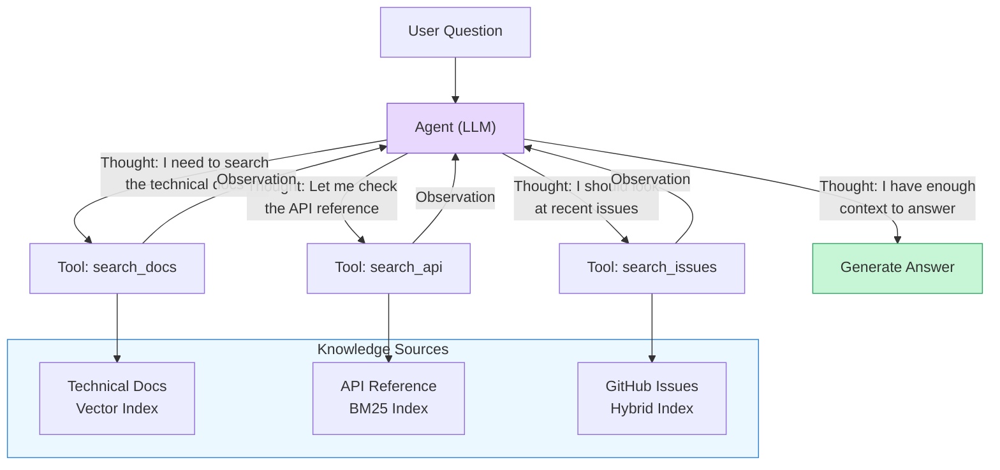

The agent does not follow a fixed retrieve-then-generate pipeline. It reasons about what information it needs, chooses the right source, evaluates the results, and iterates until it has enough context to answer confidently. This is the most flexible RAG architecture, but it is also the most dependent on the LLM's ability to make good retrieval decisions.

## 6.6 Implementing Query Decomposition + Reranking

Let's implement two of the most impactful techniques -- query decomposition and cross-encoder reranking -- in a combined pipeline. This code builds on the embedding and retrieval patterns from the previous lessons.

**advanced_rag_pipeline.py**

```python
import anthropic
import json
from dataclasses import dataclass

client = anthropic.Anthropic()


@dataclass
class RetrievedChunk:
    """A chunk of text retrieved from the knowledge base."""
    text: str
    source: str
    score: float = 0.0


# --- Stage 1: Query Decomposition ---

def decompose_query(query: str) -> list[str]:
    """Use the LLM to break a complex query into focused sub-queries."""
    response = client.messages.create(
        model="claude-sonnet-4-6",
        max_tokens=1024,
        messages=[{
            "role": "user",
            "content": f"""Break this question into 2-4 focused sub-queries that can
each be answered independently. Return a JSON array of strings.

Question: {query}

Return ONLY the JSON array, no other text. Example:
["sub-query 1", "sub-query 2", "sub-query 3"]"""
        }],
    )
    return json.loads(response.content[0].text)


# --- Stage 2: Retrieval (simulated) ---

def retrieve(query: str, top_k: int = 5) -> list[RetrievedChunk]:
    """Simulate hybrid retrieval. In production, this would query
    both a vector store and a BM25 index, then apply RRF."""
    # Simulated knowledge base
    knowledge = [
        RetrievedChunk(
            text="Kubernetes uses a scheduler that assigns pods to nodes based on "
                 "resource requests, affinity rules, and taints/tolerations.",
            source="k8s-docs/scheduling.md",
        ),
        RetrievedChunk(
            text="Docker Swarm uses a simpler spread or binpack strategy for "
                 "service placement across nodes in the cluster.",
            source="swarm-docs/placement.md",
        ),
        RetrievedChunk(
            text="Benchmarks show Kubernetes scheduling adds 2-5ms latency per "
                 "pod compared to Swarm's sub-millisecond placement decisions.",
            source="benchmarks/orchestration-2024.md",
        ),
        RetrievedChunk(
            text="Kubernetes supports custom schedulers via the scheduler "
                 "extender or the scheduling framework plugin API.",
            source="k8s-docs/custom-scheduler.md",
        ),
        RetrievedChunk(
            text="Container orchestration platforms manage the lifecycle of "
                 "containerized applications across a cluster of machines.",
            source="intro/orchestration-overview.md",
        ),
    ]
    # In production: embed query, run BM25 + vector search, apply RRF
    return knowledge[:top_k]


# --- Stage 3: Cross-Encoder Reranking ---

def rerank(query: str, chunks: list[RetrievedChunk], top_k: int = 3) -> list[RetrievedChunk]:
    """Use the LLM as a cross-encoder reranker.
    In production, use a dedicated cross-encoder model for speed."""
    chunk_texts = "\n\n".join(
        f"[{i}] {c.text}" for i, c in enumerate(chunks)
    )
    response = client.messages.create(
        model="claude-sonnet-4-6",
        max_tokens=256,
        messages=[{
            "role": "user",
            "content": f"""Score each document's relevance to the query on a scale of 0-10.
Return a JSON array of objects with "index" and "score" keys.

Query: {query}

Documents:
{chunk_texts}

Return ONLY the JSON array."""
        }],
    )
    scores = json.loads(response.content[0].text)

    for item in scores:
        chunks[item["index"]].score = item["score"]

    ranked = sorted(chunks, key=lambda c: c.score, reverse=True)
    return ranked[:top_k]


# --- Stage 4: Generate with reranked context ---

def generate_answer(query: str, context_chunks: list[RetrievedChunk]) -> str:
    """Generate the final answer using reranked context."""
    context = "\n\n".join(
        f"[Source: {c.source}] {c.text}" for c in context_chunks
    )
    response = client.messages.create(
        model="claude-sonnet-4-6",
        max_tokens=2048,
        system="Answer the question using ONLY the provided context. "
               "Cite sources in brackets. If the context is insufficient, say so.",
        messages=[{
            "role": "user",
            "content": f"Context:\n{context}\n\nQuestion: {query}"
        }],
    )
    return response.content[0].text


# --- Full Pipeline ---

def advanced_rag(query: str) -> str:
    """Run the full advanced RAG pipeline."""
    # Step 1: Decompose the query
    sub_queries = decompose_query(query)
    print(f"Sub-queries: {json.dumps(sub_queries, indent=2)}")

    # Step 2: Retrieve for each sub-query
    all_chunks: list[RetrievedChunk] = []
    seen_texts: set[str] = set()
    for sq in sub_queries:
        for chunk in retrieve(sq):
            if chunk.text not in seen_texts:
                all_chunks.append(chunk)
                seen_texts.add(chunk.text)

    print(f"Retrieved {len(all_chunks)} unique chunks")

    # Step 3: Rerank against the original query
    top_chunks = rerank(query, all_chunks, top_k=3)
    print(f"Top chunks after reranking:")
    for c in top_chunks:
        print(f"  [{c.score}] {c.source}: {c.text[:80]}...")

    # Step 4: Generate the answer
    return generate_answer(query, top_chunks)


# --- Run it ---
answer = advanced_rag(
    "How does Kubernetes handle pod scheduling differently from Docker Swarm, "
    "and what are the performance implications?"
)
print(f"\n=== Answer ===\n{answer}")
```

This pipeline demonstrates the two stages working together. Query decomposition ensures you retrieve chunks covering all aspects of the question, and reranking ensures only the most relevant chunks reach the LLM. In production, you would replace the simulated retrieval with a real hybrid search engine and use a dedicated cross-encoder model (such as `cross-encoder/ms-marco-MiniLM-L-6-v2`) instead of prompting the LLM for reranking.

## 6.6 Choosing the Right Pattern

Not every system needs every technique. The right combination depends on your failure modes:

| Failure Mode | Technique | Trade-off |
|-------------|-----------|-----------|
| Vocabulary mismatch | Hybrid search, HyDE | HyDE adds latency (extra LLM call) |
| Low-relevance results | Cross-encoder reranking | Adds 50-200ms per query |
| Complex multi-part queries | Query decomposition | Multiple retrieval passes (cost and latency) |
| Noisy context | Context compression | Extra processing step |
| Unnecessary retrieval | Self-RAG, Agentic RAG | Requires capable LLM with good judgment |
| Need for multiple sources | Agentic RAG | Most complex to implement and debug |

Start with the simplest pipeline that works -- basic RAG from the previous lesson -- and add techniques as you identify specific failure modes in your data. Hybrid search and reranking give the most improvement for the least complexity. Query decomposition and HyDE help with specific query types. Agentic RAG is the most powerful but also the most complex, requiring the agent architecture patterns from Module 4.

> **Connection to Module 4:** If you built a ReAct agent with tool access, you already have the foundation for agentic RAG. The only difference is that one of your tools is a retrieval function. The agent's Thought/Action/Observation loop naturally supports deciding when to retrieve, evaluating results, and retrieving again with a refined query.

## 6.6 Summary

**Advanced RAG patterns** address the specific failure modes that naive retrieve-then-generate pipelines cannot handle. The key techniques build on each other in layers:

- **Hybrid search** combines BM25 keyword matching with vector similarity to cover both exact and semantic matches
- **Query decomposition** breaks complex questions into focused sub-queries, ensuring retrieval covers all aspects of the question
- **HyDE** bridges the vocabulary gap between questions and documents by embedding a hypothetical answer instead of the raw query
- **Cross-encoder reranking** applies a precision scoring model to pre-filtered candidates, dramatically improving which chunks reach the LLM
- **Context compression** strips irrelevant content from retrieved chunks, reducing noise and token costs
- **Self-RAG** adds a verification loop where the LLM critiques its own retrieval and generation quality
- **Agentic RAG** gives the agent full control over when, how, and from where to retrieve, making retrieval a dynamic tool rather than a fixed pipeline stage

The progression from basic RAG to agentic RAG mirrors the broader progression of this course: from fixed pipelines to autonomous agents that make their own decisions. Each layer of sophistication adds flexibility but also complexity -- choose the techniques that match your actual failure modes, not the ones that sound most impressive.

> In the next lesson, **Memory Lab**, you will put these concepts into practice by building an agent with conversation memory and RAG-powered knowledge retrieval. Frameworks like LangChain and LlamaIndex provide built-in integrations for many of these patterns, which you will explore in Module 7.

---

    Section 6.7: Memory Lab


## 6.7 Overview

Throughout Module 6, you learned the individual building blocks of agent memory: conversation buffers, summarization strategies, long-term storage, embeddings, vector stores, and advanced RAG patterns. Each lesson focused on one piece of the puzzle. In this lab, you will put every piece together.

You are going to build a **knowledge-grounded agent** -- an agent that maintains conversation memory across turns, ingests documents into a vector store, retrieves relevant knowledge before answering, and combines all of this into a single coherent system. This is the architecture behind every serious AI assistant that needs to be both conversational and factually grounded.

The build is progressive. You will start with a bare agent loop, then add conversation memory, then build a document ingestion pipeline, then wire up RAG retrieval as a tool, and finally combine everything into a complete memory-augmented agent. At each step, the agent still works -- you are layering capabilities, not doing a big-bang rewrite.

By the end of this lab, you will have built from scratch what frameworks like LangChain and LangGraph provide out of the box. That is the point. When you understand the internals, you can make informed decisions about when to use a framework and when to build your own.

## 6.7 The Complete Architecture

Before writing any code, let's look at the system you are going to build. Every component in this diagram corresponds to a class or function you will implement in this lab.

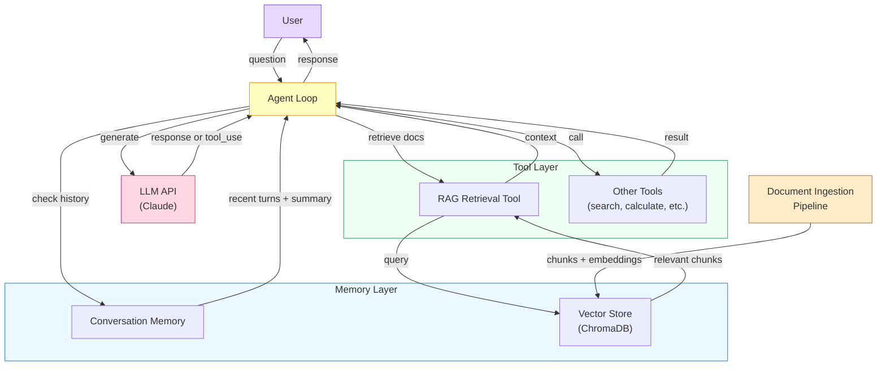

The architecture has two memory systems working in parallel. **Conversation memory** tracks what the user and agent have said in the current session -- it handles the "what did we just talk about?" problem. **The vector store** holds pre-ingested documents -- it handles the "what do you know about X?" problem. The agent consults both before generating a response, giving it continuity within a conversation and grounding in external knowledge.

## 6.7 Step 1: Conversation Memory

The first layer to add is **conversation memory**. You built the pieces in lessons 02 and 03 -- a buffer that stores recent turns and a summarizer that compresses older history. Here, you combine them into a single `ConversationMemory` class that the agent loop can use without thinking about the details.

**conversation_memory.py**

```python
"""Conversation memory with buffer + summarization.

Keeps the last N turns in full detail and summarizes older
history into a running summary. The agent always sees both
the summary and the recent turns, giving it continuity
without blowing up the context window.
"""

import anthropic
from dataclasses import dataclass, field


@dataclass
class ConversationMemory:
    """Manages conversation history with automatic summarization.

    When the buffer exceeds max_turns, older turns are compressed
    into a running summary. The agent sees: system context about
    the summary + the summary itself + recent full turns.
    """

    max_turns: int = 10
    summary: str = ""
    buffer: list[dict] = field(default_factory=list)
    _client: anthropic.Anthropic | None = None
    _model: str = "claude-sonnet-4-6"

    def add_user_message(self, content: str) -> None:
        """Record a user message."""
        self.buffer.append({"role": "user", "content": content})
        self._maybe_compress()

    def add_assistant_message(self, content: str) -> None:
        """Record an assistant response."""
        self.buffer.append({"role": "assistant", "content": content})
        self._maybe_compress()

    def get_messages(self) -> list[dict]:
        """Return the message list for the API call.

        If a summary exists, it is prepended as context so the
        model knows what happened before the visible turns.
        """
        messages = []

        if self.summary:
            messages.append({
                "role": "user",
                "content": (
                    "[Summary of earlier conversation]\n"
                    f"{self.summary}\n"
                    "[End of summary. Recent messages follow.]"
                ),
            })
            messages.append({
                "role": "assistant",
                "content": (
                    "Understood. I have the context from our "
                    "earlier conversation and will continue "
                    "from here."
                ),
            })

        messages.extend(self.buffer)
        return messages

    def _maybe_compress(self) -> None:
        """Compress older turns into the summary if buffer is full."""
        if len(self.buffer) <= self.max_turns:
            return

        # Split: older half gets summarized, recent half stays
        midpoint = len(self.buffer) - self.max_turns // 2
        old_turns = self.buffer[:midpoint]
        self.buffer = self.buffer[midpoint:]

        # Summarize the old turns
        self.summary = self._summarize(old_turns)

    def _summarize(self, turns: list[dict]) -> str:
        """Use the LLM to compress turns into a summary."""
        if not self._client:
            self._client = anthropic.Anthropic()

        # Build a readable transcript of the turns
        transcript_parts = []
        for turn in turns:
            role = turn["role"]
            content = turn.get("content", "")
            if isinstance(content, str):
                transcript_parts.append(f"{role}: {content[:500]}")

        transcript = "\n\n".join(transcript_parts)

        # Include existing summary for continuity
        existing = ""
        if self.summary:
            existing = (
                f"Previous summary:\n{self.summary}\n\n"
                "New turns to incorporate:\n"
            )

        response = self._client.messages.create(
            model=self._model,
            max_tokens=400,
            messages=[{
                "role": "user",
                "content": (
                    "Produce a concise summary of this conversation. "
                    "Preserve: key questions asked, answers given, "
                    "decisions made, and any facts established. "
                    "Omit pleasantries and filler.\n\n"
                    f"{existing}{transcript}"
                ),
            }],
        )
        return response.content[0].text
```

The key design decision here is the **split between buffer and summary**. The buffer holds recent turns in full fidelity -- the model can see exact wording, nuances, and follow-up context. The summary compresses everything older into a paragraph. This gives the agent both precision (for the current thread) and context (for the broader conversation) without exceeding the context window.

Notice that the summary is **incremental**. When new turns get compressed, the summarizer receives both the existing summary and the new turns, producing a single updated summary. This avoids the information loss you would get from re-summarizing a summary of a summary.

## 6.7 Step 2: Document Ingestion Pipeline

The second layer is the **document ingestion pipeline** -- the system that takes raw documents, splits them into chunks, generates embeddings, and stores them in a vector database. This is the "write path" of your RAG system.

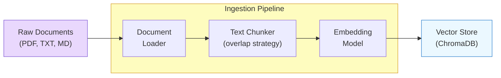

You covered chunking strategies in lesson 05 and embedding models in lesson 05. Here, you wire them together into a pipeline that can process a directory of documents in one call.

**ingestion_pipeline.py**

```python
"""Document ingestion pipeline.

Loads documents, splits them into overlapping chunks,
generates embeddings, and stores everything in ChromaDB.
"""

import os
import hashlib
from dataclasses import dataclass
import chromadb
from chromadb.utils import embedding_functions


@dataclass
class DocumentChunk:
    """A chunk of text with its source metadata."""
    text: str
    source: str       # filename or URL
    chunk_index: int   # position within the document
    doc_id: str        # unique ID for deduplication


class IngestionPipeline:
    """Processes documents into a searchable vector store.

    Uses ChromaDB with its built-in sentence-transformer
    embeddings. Each chunk is stored with metadata about its
    source and position, enabling citation in agent responses.
    """

    def __init__(
        self,
        collection_name: str = "knowledge_base",
        persist_directory: str = "./vectorstore",
        chunk_size: int = 500,
        chunk_overlap: int = 50,
    ):
        self.chunk_size = chunk_size
        self.chunk_overlap = chunk_overlap

        # Initialize ChromaDB with persistence
        self.chroma_client = chromadb.PersistentClient(
            path=persist_directory
        )

        # Use a sentence-transformer for embeddings
        embedding_fn = (
            embedding_functions.SentenceTransformerEmbeddingFunction(
                model_name="all-MiniLM-L6-v2"
            )
        )

        self.collection = self.chroma_client.get_or_create_collection(
            name=collection_name,
            embedding_function=embedding_fn,
            metadata={"hnsw:space": "cosine"},
        )

    def ingest_directory(self, directory: str) -> int:
        """Ingest all supported files from a directory.

        Returns the number of chunks stored.
        """
        total_chunks = 0
        supported = (".txt", ".md", ".py", ".json")

        for filename in sorted(os.listdir(directory)):
            if not filename.endswith(supported):
                continue

            filepath = os.path.join(directory, filename)
            with open(filepath, "r", encoding="utf-8") as f:
                text = f.read()

            chunks = self._chunk_text(text, source=filename)
            self._store_chunks(chunks)
            total_chunks += len(chunks)
            print(f"  Ingested {filename}: {len(chunks)} chunks")

        print(f"  Total: {total_chunks} chunks in collection "
              f"'{self.collection.name}'")
        return total_chunks

    def ingest_text(self, text: str, source: str) -> int:
        """Ingest a single text document.

        Returns the number of chunks stored.
        """
        chunks = self._chunk_text(text, source=source)
        self._store_chunks(chunks)
        return len(chunks)

    def _chunk_text(
        self, text: str, source: str
    ) -> list[DocumentChunk]:
        """Split text into overlapping chunks.

        Uses a simple character-based strategy with overlap.
        Each chunk gets a deterministic ID based on source +
        content hash for deduplication.
        """
        chunks = []
        start = 0
        chunk_index = 0

        while start < len(text):
            end = start + self.chunk_size

            # Try to break at a sentence boundary
            if end < len(text):
                # Look for the last period, newline, or
                # sentence-ending punctuation near the boundary
                for boundary_char in ["\n\n", ".\n", ". ", "\n"]:
                    boundary = text.rfind(
                        boundary_char, start + self.chunk_size // 2, end
                    )
                    if boundary != -1:
                        end = boundary + len(boundary_char)
                        break

            chunk_text = text[start:end].strip()
            if chunk_text:
                content_hash = hashlib.md5(
                    chunk_text.encode()
                ).hexdigest()[:8]
                doc_id = f"{source}::chunk{chunk_index}::{content_hash}"

                chunks.append(DocumentChunk(
                    text=chunk_text,
                    source=source,
                    chunk_index=chunk_index,
                    doc_id=doc_id,
                ))
                chunk_index += 1

            # Move forward, accounting for overlap
            start = end - self.chunk_overlap
            if start <= 0 and chunk_index > 0:
                break  # Prevent infinite loop on tiny texts

        return chunks

    def _store_chunks(self, chunks: list[DocumentChunk]) -> None:
        """Store chunks in ChromaDB with metadata."""
        if not chunks:
            return

        self.collection.upsert(
            ids=[c.doc_id for c in chunks],
            documents=[c.text for c in chunks],
            metadatas=[
                {
                    "source": c.source,
                    "chunk_index": c.chunk_index,
                }
                for c in chunks
            ],
        )
```

Three design decisions worth noting. First, the chunker tries to break at sentence boundaries rather than cutting mid-sentence -- this produces chunks that are more coherent when retrieved. Second, each chunk gets a **deterministic ID** based on its source and content hash, which means re-ingesting the same document updates existing chunks via `upsert` rather than creating duplicates. Third, the pipeline stores **source metadata** with every chunk, which lets the agent cite where its knowledge came from.

## 6.7 Step 3: RAG Retrieval as a Tool

The third layer turns your vector store into an **agent tool**. Instead of hardcoding retrieval into the agent loop, you expose it as a tool the agent can choose to call -- or not -- based on the question. This is the **agentic RAG** pattern from lesson 06: the agent decides when retrieval is helpful.

**rag_tool.py**

```python
"""RAG retrieval exposed as an agent tool.

The agent decides when to search the knowledge base. This is
agentic RAG -- the model controls retrieval, not a fixed pipeline.
"""

import json


class KnowledgeRetriever:
    """Retrieves relevant document chunks from the vector store.

    Designed to be registered as an agent tool. The agent calls
    this when it needs factual grounding for its response.
    """

    def __init__(self, pipeline: IngestionPipeline, top_k: int = 5):
        self.collection = pipeline.collection
        self.top_k = top_k

    def search(self, query: str, n_results: int | None = None) -> str:
        """Search the knowledge base for relevant information.

        Args:
            query: Natural language search query.
            n_results: Number of results to return (default: 5).

        Returns:
            JSON string with matching document chunks and
            their source metadata.
        """
        k = n_results or self.top_k

        results = self.collection.query(
            query_texts=[query],
            n_results=k,
        )

        # Format results for the agent
        chunks = []
        if results["documents"] and results["documents"][0]:
            for i, doc in enumerate(results["documents"][0]):
                metadata = results["metadatas"][0][i]
                distance = results["distances"][0][i]

                chunks.append({
                    "text": doc,
                    "source": metadata.get("source", "unknown"),
                    "chunk_index": metadata.get("chunk_index", 0),
                    "relevance_score": round(1 - distance, 4),
                })

        return json.dumps({
            "query": query,
            "num_results": len(chunks),
            "chunks": chunks,
        }, indent=2)


def build_retrieval_tool(retriever: KnowledgeRetriever) -> dict:
    """Build the tool definition for the Claude API.

    Returns the tool schema dict that gets passed to
    the tools parameter of messages.create().
    """
    return {
        "name": "search_knowledge_base",
        "description": (
            "Search the internal knowledge base for information "
            "relevant to the user's question. Use this tool when "
            "the user asks about topics that may be covered in "
            "the ingested documents. Returns the most relevant "
            "text chunks with source citations. Always prefer "
            "this over generating answers from general knowledge "
            "when the topic might be in the knowledge base."
        ),
        "input_schema": {
            "type": "object",
            "properties": {
                "query": {
                    "type": "string",
                    "description": (
                        "The search query. Use natural language. "
                        "Be specific about what information you "
                        "need."
                    ),
                },
                "n_results": {
                    "type": "integer",
                    "description": (
                        "Number of results to return. Default 5. "
                        "Use more for broad questions, fewer for "
                        "specific lookups."
                    ),
                },
            },
            "required": ["query"],
        },
    }
```

The tool description is critical. It tells the model *when* to use retrieval ("when the user asks about topics that may be covered in the ingested documents") and *how* to use it ("be specific about what information you need"). A vague tool description leads to either over-retrieval (the agent searches for everything, wasting tokens) or under-retrieval (the agent guesses instead of looking things up).

## 6.7 Step 4: The Complete Memory-Augmented Agent

Now you combine all three components -- conversation memory, document ingestion, and RAG retrieval -- into a single agent. This is the full system from the architecture diagram at the top of this lesson.

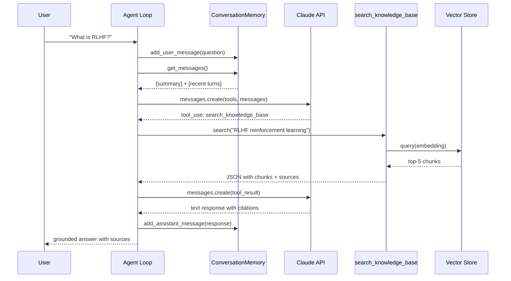

The sequence shows how both memory systems participate in every turn. Conversation memory provides context about what has been discussed. The RAG tool provides factual grounding from documents. The LLM synthesizes both into a coherent response.

**memory_agent.py**

```python
"""Complete memory-augmented agent.

Combines:
  1. ConversationMemory -- tracks the dialogue across turns
  2. IngestionPipeline -- loads documents into a vector store
  3. KnowledgeRetriever -- RAG tool the agent can call
  4. Agent loop -- orchestrates everything

Usage:
    python memory_agent.py

    # First run ingests documents, then starts a conversation.
    # The agent remembers what you discussed and grounds
    # answers in the ingested documents.
"""

import json
import anthropic


# --- Configuration ---
MODEL = "claude-sonnet-4-6"
KNOWLEDGE_DIR = "./documents"
VECTORSTORE_DIR = "./vectorstore"

SYSTEM_PROMPT = """You are a knowledgeable assistant with access
to an internal knowledge base. Follow these rules:

1. When the user asks a factual question, ALWAYS search the
   knowledge base first using the search_knowledge_base tool.
2. Ground your answers in the retrieved documents. Cite the
   source file when referencing specific information.
3. If the knowledge base does not contain relevant information,
   say so clearly and answer from your general knowledge,
   marking it as such.
4. Maintain continuity across the conversation -- reference
   earlier discussion when relevant.
5. Be concise but thorough. Prefer clarity over length."""


class MemoryAugmentedAgent:
    """An agent with conversation memory and RAG retrieval.

    This is the complete system: it remembers what you talked
    about, looks up facts in a knowledge base, and synthesizes
    grounded responses.
    """

    def __init__(
        self,
        knowledge_dir: str = KNOWLEDGE_DIR,
        vectorstore_dir: str = VECTORSTORE_DIR,
    ):
        self.client = anthropic.Anthropic()

        # Layer 1: Conversation memory
        self.memory = ConversationMemory(
            max_turns=10,
            _client=self.client,
            _model=MODEL,
        )

        # Layer 2: Document ingestion
        self.pipeline = IngestionPipeline(
            collection_name="knowledge_base",
            persist_directory=vectorstore_dir,
            chunk_size=500,
            chunk_overlap=50,
        )

        # Layer 3: RAG retrieval tool
        self.retriever = KnowledgeRetriever(
            pipeline=self.pipeline,
            top_k=5,
        )

        # Tool definitions for the API
        self.tools = [build_retrieval_tool(self.retriever)]

        # Tool dispatch table
        self.tool_handlers = {
            "search_knowledge_base": self.retriever.search,
        }

        # Ingest documents on startup
        if os.path.isdir(knowledge_dir):
            print(f"Ingesting documents from {knowledge_dir}...")
            self.pipeline.ingest_directory(knowledge_dir)
            print()

    def chat(self, user_message: str) -> str:
        """Process a user message and return a response.

        This is the main entry point. It:
          1. Records the message in conversation memory
          2. Builds the message list (summary + recent turns)
          3. Calls the LLM with tools available
          4. Handles any tool calls (RAG retrieval)
          5. Records the response in conversation memory
          6. Returns the final text
        """
        # Record the user message
        self.memory.add_user_message(user_message)

        # Build messages from memory
        messages = self.memory.get_messages()

        # Agent loop: handle tool calls until we get a text response
        for iteration in range(10):
            response = self.client.messages.create(
                model=MODEL,
                max_tokens=4096,
                system=SYSTEM_PROMPT,
                tools=self.tools,
                messages=messages,
            )

            # If the model is done, extract and return the text
            if response.stop_reason == "end_turn":
                assistant_text = ""
                for block in response.content:
                    if block.type == "text":
                        assistant_text += block.text

                # Record in conversation memory
                self.memory.add_assistant_message(assistant_text)
                return assistant_text

            # If the model wants to use a tool, execute it
            if response.stop_reason == "tool_use":
                messages.append({
                    "role": "assistant",
                    "content": response.content,
                })

                tool_results = []
                for block in response.content:
                    if block.type == "tool_use":
                        handler = self.tool_handlers.get(block.name)
                        if handler:
                            result = handler(**block.input)
                            print(
                                f"  [tool] {block.name}: "
                                f"query={block.input.get('query', '')}"
                            )
                        else:
                            result = json.dumps({
                                "error": f"Unknown tool: {block.name}"
                            })

                        tool_results.append({
                            "type": "tool_result",
                            "tool_use_id": block.id,
                            "content": result,
                        })

                messages.append({
                    "role": "user",
                    "content": tool_results,
                })

        return "Max iterations reached."
```

The `chat` method is the heart of the agent. Notice how simple the loop is -- complexity is pushed into the components. Conversation memory handles history management. The retriever handles vector search. The agent loop just orchestrates: get messages, call the LLM, handle tools, record the response.

## 6.7 Running the Agent

Here is how you use the complete system. The agent ingests documents once, then handles a multi-turn conversation where it draws on both conversation history and retrieved knowledge.

**run_agent.py**

```python
"""Run the memory-augmented agent in a conversation loop."""

import os


def main():
    # Create sample documents for the knowledge base
    os.makedirs("./documents", exist_ok=True)

    # Write a sample document about RLHF
    with open("./documents/rlhf-overview.md", "w") as f:
        f.write("""# Reinforcement Learning from Human Feedback

RLHF is a technique for aligning language models with human
preferences. The process has three stages:

1. Supervised Fine-Tuning (SFT): Train the base model on
   high-quality demonstration data.

2. Reward Model Training: Collect human comparisons of model
   outputs and train a reward model to predict which output
   humans prefer.

3. PPO Optimization: Use Proximal Policy Optimization to
   fine-tune the SFT model to maximize the reward model's
   score, with a KL penalty to prevent divergence from the
   original model.

Key challenges include reward hacking (the model exploits
the reward model without genuinely improving), the cost of
human annotation, and the difficulty of capturing complex
preferences in a scalar reward signal.

Alternatives to RLHF include DPO (Direct Preference
Optimization), which skips the reward model entirely by
optimizing the policy directly on preference data, and
RLAIF (RL from AI Feedback), which uses another AI model
to generate preference labels.
""")

    # Initialize and run the agent
    agent = MemoryAugmentedAgent(
        knowledge_dir="./documents",
        vectorstore_dir="./vectorstore",
    )

    # Multi-turn conversation
    questions = [
        "What is RLHF and how does it work?",
        "You mentioned three stages -- which one is most expensive?",
        "What alternatives exist to the approach you described?",
    ]

    for question in questions:
        print(f"\nUser: {question}")
        print("-" * 50)
        response = agent.chat(question)
        print(f"Agent: {response}\n")
        print("=" * 60)


if __name__ == "__main__":
    main()
```

Watch what happens across the three questions:

- **Question 1**: The agent calls `search_knowledge_base` with "RLHF reinforcement learning from human feedback", retrieves the chunks from `rlhf-overview.md`, and explains the three-stage process with citations.
- **Question 2**: The agent does *not* call the tool. "Three stages" is a reference to the previous answer, which is in conversation memory. The agent draws on the earlier turn to discuss costs -- particularly human annotation for the reward model.
- **Question 3**: The agent calls the tool again, searching for "alternatives to RLHF", and retrieves the DPO and RLAIF chunks. It connects this to the earlier discussion: "As I mentioned, RLHF has high annotation costs -- DPO addresses this by..."

This is the payoff of combining conversation memory with RAG. Neither system alone could handle all three questions well. Without conversation memory, question 2 would be nonsensical ("which three stages?"). Without RAG, the answers would come from general knowledge and might contain hallucinated details about the algorithms.

## 6.7 How the Two Memory Systems Interact

The interaction between conversation memory and RAG retrieval is worth understanding in detail, because getting it wrong leads to subtle bugs.

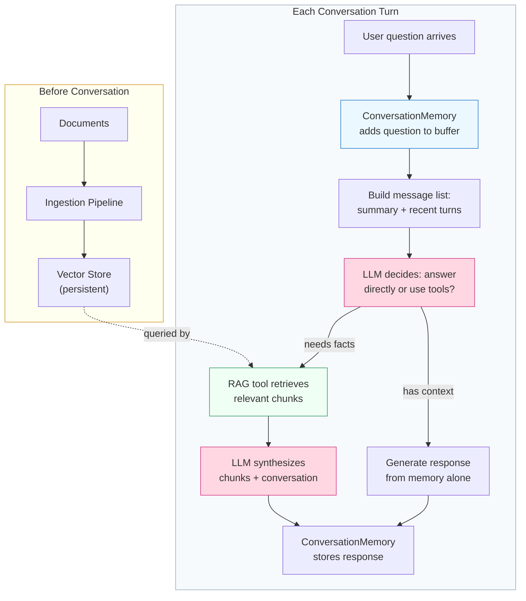

The critical insight is **when each memory system contributes**. Conversation memory is always present -- every LLM call includes the summary and recent turns. RAG retrieval is *conditional* -- the LLM decides whether to search based on whether the question needs factual grounding. This is why the tool description matters so much: it guides the model's decision about when to retrieve.

There is also a subtle feedback loop. When the agent retrieves information and uses it in a response, that response gets stored in conversation memory. On later turns, the summarized version of that response becomes part of the context. This means RAG results gradually become part of the conversation's "common ground" -- the agent can reference them later without re-retrieving.

## 6.7 Adding More Tools

The architecture is designed to accommodate additional tools alongside RAG. You might want a calculator, a web search tool, or a code execution tool. Here is how you extend the agent without restructuring anything.

**extra_tools.py**

```python
"""Extending the agent with additional tools.

Shows how to add tools alongside RAG retrieval. The agent
decides which tools to use based on the question.
"""

import json
import datetime


def get_current_date() -> str:
    """Get today's date for time-sensitive questions."""
    return json.dumps({
        "date": datetime.date.today().isoformat(),
        "weekday": datetime.date.today().strftime("%A"),
    })


def calculate(expression: str) -> str:
    """Evaluate a mathematical expression safely.

    Args:
        expression: A math expression like '2 + 2' or
                    '(100 / 3) * 1.5'.
    """
    # Only allow safe math operations
    allowed = set("0123456789+-*/.() ")
    if not all(c in allowed for c in expression):
        return json.dumps({
            "error": "Expression contains invalid characters"
        })
    try:
        result = eval(expression)  # Safe: chars are restricted
        return json.dumps({"expression": expression, "result": result})
    except Exception as e:
        return json.dumps({"error": str(e)})


# Add tools to the agent
EXTRA_TOOLS = [
    {
        "name": "get_current_date",
        "description": "Get today's date and day of week.",
        "input_schema": {
            "type": "object",
            "properties": {},
            "required": [],
        },
    },
    {
        "name": "calculate",
        "description": (
            "Evaluate a mathematical expression. Use for any "
            "arithmetic the user asks about."
        ),
        "input_schema": {
            "type": "object",
            "properties": {
                "expression": {
                    "type": "string",
                    "description": "Math expression to evaluate.",
                },
            },
            "required": ["expression"],
        },
    },
]

EXTRA_HANDLERS = {
    "get_current_date": lambda **kwargs: get_current_date(),
    "calculate": lambda **kwargs: calculate(kwargs["expression"]),
}


# To integrate, add these in the agent's __init__:
#   self.tools.extend(EXTRA_TOOLS)
#   self.tool_handlers.update(EXTRA_HANDLERS)
```

Adding a tool is three things: a function, a schema, and a handler entry. The agent loop does not change. The LLM decides when to use each tool based on the descriptions. This is the same extensibility pattern you saw with the Tool Registry in Module 5, but now the tools have access to persistent memory through the shared vector store.

## 6.7 What You Built

Take a step back and look at what the complete system does:

- **Conversation memory** gives the agent continuity within a session. It remembers what was discussed, can reference earlier points, and does not repeat itself. The automatic summarization keeps the context window manageable even for long conversations.

- **Document ingestion** gives the agent a knowledge base. Raw documents are chunked, embedded, and stored in a vector database. The ingestion is idempotent -- re-ingesting the same documents updates rather than duplicates.

- **RAG retrieval** gives the agent factual grounding. When a question touches on topics in the knowledge base, the agent retrieves relevant chunks and cites its sources. When the knowledge base does not have relevant information, the agent says so.

- **The agent loop** orchestrates everything. It is simple because complexity lives in the components. Adding new capabilities means adding new tools, not rewriting the loop.

This is roughly 300 lines of Python, not counting the sample documents. That is the entire infrastructure for a knowledge-grounded conversational agent. It is not production-ready -- you would want error handling, rate limiting, better chunking strategies, reranking, and observability -- but the architecture is sound. Every production system you will see in Module 7 follows this same shape.

## 6.7 What Frameworks Give You

You built this from scratch. It works. But look at the code and count how much of it is *your* logic versus *infrastructure plumbing*. The conversation memory class is mostly boilerplate for managing a list and calling a summarization API. The ingestion pipeline is mostly file I/O and ChromaDB wiring. The RAG tool is mostly JSON formatting. The agent loop is mostly the same tool-dispatch pattern you have written since Module 3.

This is exactly the problem that **agent frameworks** solve. They provide the plumbing so you can focus on the logic. LangChain gives you `ConversationBufferMemory` and `ConversationSummaryMemory` as one-liners. LangGraph lets you define the retrieval-generation flow as a graph with built-in state management. The Anthropic SDK handles the tool-dispatch loop for you.

But here is why you built it from scratch first: when `ConversationSummaryMemory` does not behave the way you expect, you now know *exactly* what it is doing underneath. When LangGraph's retrieval node returns unexpected results, you can reason about the chunking and embedding pipeline because you wrote one. When the framework's agent loop does not fit your use case, you know how to build your own because you have already done it.

> **Bridge to Module 7:** You have now built every core component of an agent system by hand -- tool use (Module 3), design patterns (Module 5), and memory with RAG (this lab). Module 7 shows how frameworks like LangChain, LangGraph, the OpenAI Agents SDK, and the Anthropic Claude SDK package these same components into reusable abstractions. You will see the same patterns, the same architecture, and the same tradeoffs -- just expressed in the framework's vocabulary instead of raw Python.

## 6.7 Summary

In this lab, you built a complete knowledge-grounded agent with two memory systems working in parallel:

- **Conversation memory** with buffer and summarization tracks dialogue across turns. Older turns are compressed into a running summary, keeping the context window manageable while preserving continuity. The summary is incremental -- each compression incorporates the previous summary.

- **A document ingestion pipeline** processes raw documents into a vector store. Text is split into overlapping chunks at sentence boundaries, embedded using a sentence-transformer model, and stored in ChromaDB with source metadata for citation.

- **RAG retrieval as an agent tool** lets the model decide when to search the knowledge base. The tool description guides the model's retrieval decisions. Retrieved chunks flow through the same tool-use mechanism as any other tool.

- **The complete agent** combines all three components in a simple loop. Conversation memory provides every-turn context. RAG provides on-demand factual grounding. The agent synthesizes both into responses that are conversational, accurate, and citable.

You also saw how the two memory systems interact: conversation memory is always present, RAG is conditional, and retrieved information gradually becomes part of the conversation's summarized context.

This lab concludes Module 6. You have gone from understanding why agents need memory to building a fully functional memory-augmented agent. In **Module 7: Agent Frameworks and SDKs**, you will see how production frameworks implement these same patterns -- and you will be equipped to evaluate them critically because you have built the internals yourself.

---

