# Multi-Modal Agents

*Building agents that see, hear, and generate across text, images, audio, and video*

    Section 8.1: Why Multi-Modal Agents?


## 8.1 Overview

You have spent seven modules building agents that think in text. They read text prompts, call text-based tools, retrieve text documents, reason over text context, and produce text output. And that has been enough to build remarkably capable systems -- agent loops, tool orchestration, memory pipelines, design patterns, and full framework integrations, all operating in the text modality.

But text is a fraction of the world. Think about the tasks you perform daily that no text-only system could handle. You glance at a chart and immediately spot an anomaly. You hear a tone of voice and know a customer is frustrated. You skim a scanned document and find the signature line without reading every word. You look at a user interface and see that a button is misaligned, even though the code looks correct.

These are not exotic capabilities. They are basic competencies that humans apply constantly and that real-world agent tasks increasingly demand. Module 8 closes this gap. Now that you know the frameworks from Module 7, you will extend your agents with **multi-modal capabilities** -- the ability to see, hear, and generate beyond text.

## 8.1 The Modality Gap

There is a fundamental mismatch between how most agents work and how the real world presents information. This mismatch is the **modality gap**.

Consider the data your organization produces every day. Internal documents contain charts, diagrams, and tables that carry meaning through spatial layout, not just through the text within them. Customer interactions happen over voice calls, video meetings, and screen shares. Product interfaces are inherently visual -- a pixel-perfect rendering matters more than the HTML that produced it. Manufacturing and logistics generate sensor data, camera feeds, and audio signals from machinery.

Estimates vary, but research consistently finds that **roughly 80-90% of enterprise data is unstructured**, and a large portion of that unstructured data is non-textual: images, audio, video, and documents whose meaning depends on visual layout. A text-only agent can access perhaps 10-20% of the information available in a typical business process. The rest is invisible to it.

This is not a theoretical limitation. It manifests as concrete failures:

- A document processing agent that extracts OCR text from a scanned invoice but loses the table structure, misattributes line items, and cannot verify whether a stamp or signature is present
- A customer support agent that reads chat transcripts but cannot see the screenshot the customer attached showing the exact error they encountered
- A QA testing agent that validates API responses but cannot detect that the UI renders a button off-screen on mobile devices
- A research agent that reads a paper's text but cannot interpret the figures, charts, and diagrams that carry the paper's key results

The modality gap is not about adding a nice-to-have feature. It is about building agents that can operate in the real world, where information arrives in whatever form is natural for the domain.

## 8.1 Anatomy of a Multi-Modal Agent

A **multi-modal agent** is an agent whose reasoning engine can accept, process, and generate information across multiple modalities -- text, images, audio, and video. The architecture extends the agent loop you built in Module 1 with input encoders for each modality, a unified reasoning core, and output generators that can produce results beyond text.

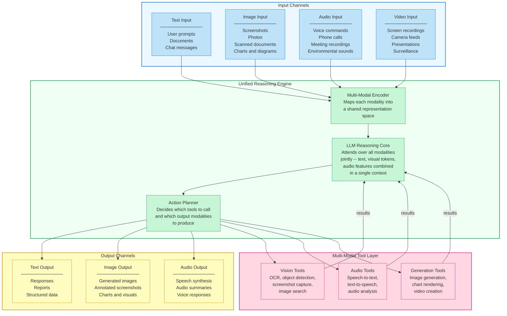

The key architectural insight is the **unified reasoning engine**. Rather than running separate models for each modality and stitching results together, modern multi-modal LLMs process all input modalities in a single forward pass. Text tokens, image patches, and audio features are encoded into a shared representation space and attended over jointly. This means the model can reason about relationships *between* modalities -- "the chart in slide 3 contradicts the claim in paragraph 2" -- in a way that siloed models cannot.

The tool layer extends the agent's capabilities beyond what the LLM can do natively. Vision tools provide OCR, object detection, and screenshot capture. Audio tools handle speech-to-text and text-to-speech conversion. Generation tools produce images, charts, and videos. These tools follow the same tool-use patterns you learned in Module 3, but they operate on non-textual inputs and outputs.

## 8.1 Text-Only vs. Multi-Modal: A Concrete Comparison

The difference between text-only and multi-modal agents is not a matter of degree. It is a qualitative shift in what tasks the agent can perform. The following comparison illustrates this across several domains.

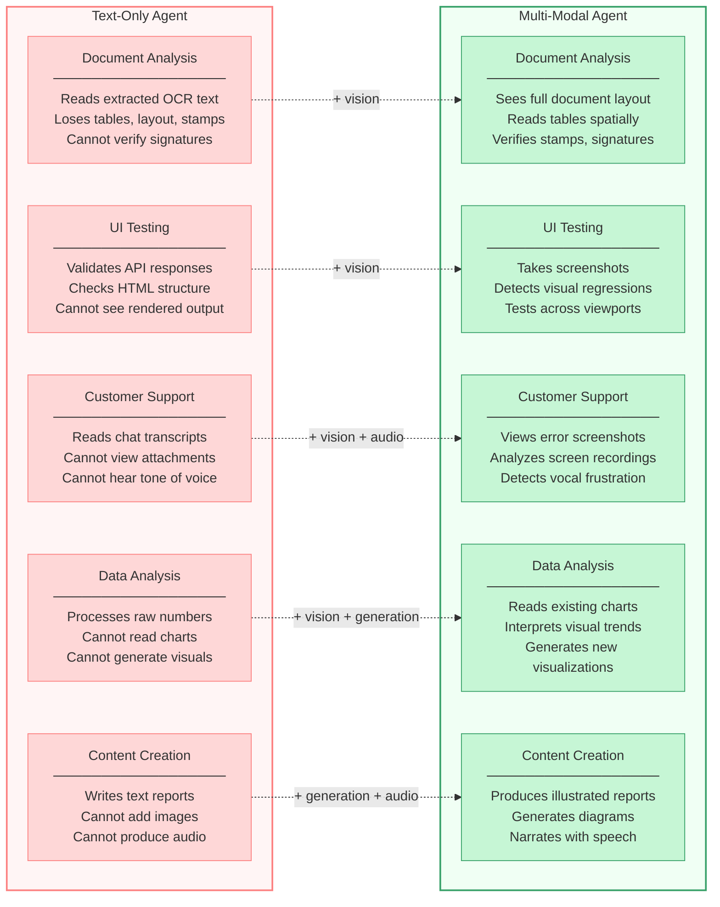

Each row represents the same task. The text-only agent can attempt each one, but it operates with a partial view of the information. The multi-modal agent sees the complete picture.

Consider **document analysis** more concretely. A scanned invoice arrives as a PDF. The text-only agent runs OCR and gets a flat stream of characters: "Acme Corp Invoice 12345 Widget A 50 25.00 1250.00 Widget B 100 12.50 1250.00 Total 2500.00". The table structure is gone. Is "50" a quantity or a price? Is "1250.00" a line total or a subtotal? The text-only agent must guess based on patterns, and it will get it wrong on non-standard layouts.

The multi-modal agent sees the document as a human does. It recognizes the table, reads the column headers, follows the rows, and understands that "50" is under "Quantity" and "25.00" is under "Unit Price". It can also check whether the company stamp is present, whether the signature line is filled, and whether the logo matches the expected vendor. None of this is possible from OCR text alone.

## 8.1 Where Each Modality Matters

Different modalities unlock different categories of tasks. Understanding which modality a task requires is the first step in designing a multi-modal agent.

### Vision: Seeing the World

**Vision** is the most immediately impactful modality to add to an agent. The ability to process images and screenshots enables entire categories of tasks that text-only agents cannot touch.

**Document understanding** goes far beyond OCR. A vision-capable agent can read complex tables, interpret flowcharts, understand page layouts, and extract information from forms where spatial position determines meaning. Medical records, legal contracts, financial statements, and engineering drawings all contain information that is encoded spatially, not just textually.

**UI and web testing** becomes visual. Instead of asserting that a CSS class is present in the DOM, the agent can take a screenshot and verify that the button actually appears green, is the right size, and is positioned where the design spec says it should be. Visual regression testing -- comparing screenshots across deploys to detect unintended changes -- is a natural fit for vision-capable agents.

**Chart and graph interpretation** lets agents understand data visualizations directly. A research agent can read a scatter plot and identify outliers. A financial agent can interpret a candlestick chart. A monitoring agent can look at a dashboard screenshot and spot the anomalous metric without needing the underlying data in tabular form.

### Audio: Hearing the World

**Audio** capabilities let agents participate in spoken interactions and process information that exists only as sound.

**Voice assistants** move beyond the type-and-read paradigm. An agent with speech-to-text and text-to-speech can conduct a natural phone conversation -- taking a customer support call, guiding a user through a troubleshooting process, or conducting a voice-based survey. The interaction feels natural because it matches how humans communicate.

**Meeting transcription and analysis** is more than just generating a transcript. An audio-capable agent can identify speakers, detect changes in topic, recognize when someone is asking a question versus making a statement, and summarize action items. More advanced audio understanding can detect emotional tone -- identifying frustration, confusion, or enthusiasm -- which carries information that the words alone do not.

**Environmental audio analysis** lets agents process non-speech sounds. A factory monitoring agent can listen for unusual machine vibrations. A security agent can detect breaking glass or alarms. A wildlife monitoring agent can identify bird species from their calls. These are niche applications, but they illustrate the breadth of what audio understanding enables.

### Generation: Creating Beyond Text

**Generation** capabilities let agents produce outputs in modalities beyond text, turning them from analysts into creators.

**Reports with visuals** transform agent output. Instead of producing a text report that says "sales increased 15% in Q3", the agent can generate a report that includes a chart showing the trend, highlighted data points, and annotated screenshots of the dashboard. The output matches what a human analyst would produce.

**Presentations and documents** can be assembled end-to-end. An agent can research a topic, write the content, generate supporting diagrams, create slide layouts, and produce a finished deck. The individual capabilities exist today across different tools -- the multi-modal agent ties them together into a coherent workflow.

**Audio narration** adds a voice to any text output. An agent can generate a podcast-style summary of a research paper, narrate a tutorial walkthrough, or produce an audio briefing from a set of documents. Combined with vision, the agent can describe what it sees in a video feed, creating real-time audio commentary.

## 8.1 The Foundation Models Behind Multi-Modal Agents

Multi-modal agents are possible today because the foundation models themselves have become multi-modal. This is a recent development that has fundamentally changed what agents can do.

**Claude** (Anthropic) supports vision natively -- you can include images directly in the conversation alongside text, and the model reasons over both jointly. This is not a separate vision model stitched onto a text model. The same transformer processes text tokens and image patches in a single context, enabling genuine cross-modal reasoning like "describe the discrepancy between this chart and the text in paragraph 3".

**GPT-4o** (OpenAI) extends multi-modal capabilities to include native audio understanding and generation. The model can process spoken audio directly without a separate speech-to-text step, preserving nuances like tone, emphasis, and pacing that traditional ASR pipelines lose.

**Gemini** (Google) was designed from the ground up as a multi-modal model, processing text, images, audio, and video in a unified architecture. Its long context window is particularly relevant for video understanding, where the model can process extended clips rather than just individual frames.

These models provide the reasoning core. The agent architecture you learned in Modules 1 through 6 -- the observe-think-act loop, tool dispatch, memory management, state tracking -- wraps around this core and extends it with tools, persistence, and orchestration. The frameworks from Module 7 provide the infrastructure to build these systems efficiently. Module 8 teaches you how to wire multi-modal capabilities into those existing patterns.

## 8.1 What's Ahead in This Module

The remaining lessons in this module take you from understanding to implementation. Each lesson focuses on a specific modality or cross-modal capability, building on the agent architecture and frameworks you already know.

- **Lesson 02: Vision-Language Agents** -- Build agents that understand images and screenshots. You will implement document parsing that preserves spatial layout, UI testing that detects visual regressions, and visual question answering over charts and diagrams.

- **Lesson 03: Audio and Speech Agents** -- Build agents that hear and speak. You will integrate speech-to-text for voice input, text-to-speech for spoken output, and real-time conversational audio pipelines for agents that conduct natural spoken interactions.

- **Lesson 04: Image and Video Generation** -- Build agents that create visual content. You will integrate image generation models for producing diagrams, illustrations, and annotated screenshots, and explore video generation for creating explainer clips and visual summaries.

- **Lesson 05: Cross-Modal Reasoning** -- Build agents that reason across modalities simultaneously. You will create agents that look at a chart, read the accompanying text, identify contradictions between them, and produce a synthesized analysis that neither modality alone could support.

- **Lesson 06: Multi-Modal Tool Use** -- Extend the tool-use patterns from Module 3 to multi-modal inputs and outputs. You will build tools for screenshot capture, browser interaction, camera input, and file-type-aware processing that routes documents, images, and audio to the appropriate handlers.

- **Lesson 07: Multi-Modal Lab** -- Bring it all together in a hands-on lab. You will build an agent that receives images, analyzes them visually, generates a structured report with embedded visualizations, and narrates the findings with synthesized speech.

## 8.1 Summary

The **modality gap** is the mismatch between agents that operate exclusively on text and a world where 80-90% of information is non-textual. Real-world tasks -- document analysis, UI testing, customer support, data visualization, content creation -- require agents that can see, hear, and generate across modalities.

- A **multi-modal agent** extends the agent loop with input encoders for text, images, audio, and video, a unified reasoning engine that processes all modalities jointly, and output generators that produce results beyond text. The key is the **unified reasoning engine** -- a single model that attends over all modalities in one context, enabling cross-modal reasoning that siloed models cannot achieve.
- **Vision** unlocks document understanding, UI testing, and chart interpretation -- tasks where spatial layout and visual appearance carry meaning that text cannot capture. **Audio** enables voice assistants, meeting analysis, and environmental sound processing. **Generation** lets agents produce illustrated reports, presentations, and narrated audio.
- The **foundation models** behind multi-modal agents -- Claude, GPT-4o, Gemini -- process multiple modalities natively within a single architecture, providing the reasoning core that agent systems wrap with tools, memory, and orchestration.
- The architecture and patterns you built in Modules 1 through 7 remain the foundation. Multi-modal capabilities extend those patterns rather than replacing them. The agent loop, tool dispatch, memory management, and framework integrations all carry forward -- Module 8 adds the ability to operate on richer inputs and produce richer outputs.
- The most common mistake is treating multi-modal as optional or exotic. For any agent that operates in a domain where humans use their eyes, ears, or visual communication, multi-modal is not a feature -- it is a **requirement for competence**.

In the next lesson, you will build your first vision-capable agent. **Vision-language agents** process images alongside text, enabling document understanding, UI testing, and visual question answering -- the most immediately practical multi-modal capability.

---

    Section 8.2: Vision-Language Agents


## 8.2 Overview

In the previous lesson, we explored why multi-modal capabilities matter for agents operating in the real world. Text alone cannot capture the richness of invoices, screenshots, architectural diagrams, or handwritten notes. In this lesson, we move from theory to practice: how do you build agents that **see**?

A **vision-language agent** is an agent whose perception system processes images alongside text, enabling it to reason about visual information and take actions based on what it observes. This is not simply "image captioning" -- it is a full integration of visual perception into the agent loop you learned in Module 1. The agent sees an image, reasons about its contents in context, and decides what to do next -- exactly as a text-only agent reads a document and decides which tool to call.

By the end of this lesson, you will understand the architecture of vision-language pipelines, know how to pass images to Claude's API, and be able to build agents that extract structured information from documents, analyze screenshots, and answer questions about visual content.

## 8.2 The Vision-Language Pipeline

At the core of every vision-language agent is a pipeline that transforms raw pixel data into structured understanding. Modern **multimodal large language models** (like Claude) handle this pipeline internally, but understanding its stages helps you design better agents.

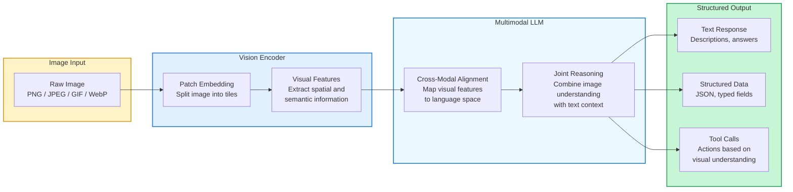

The pipeline has four stages:

- **Image input** -- the raw image arrives as base64-encoded data or a URL reference. Claude supports PNG, JPEG, GIF, and WebP formats.
- **Vision encoder** -- the model splits the image into patches (small tiles), processes each through a vision transformer, and produces a set of **visual feature vectors** that encode spatial layout, objects, text, colors, and relationships.
- **Cross-modal alignment** -- the visual features are projected into the same representational space as text tokens, allowing the language model to "read" the image as naturally as it reads words.
- **Joint reasoning** -- the model reasons over both the visual features and any text prompt simultaneously, producing text responses, structured data, or tool calls.

The key insight is that the model does not first describe the image and then reason about the description. Visual features and text are processed **jointly**, which means the model can attend to specific image regions when answering specific questions. Ask "what color is the button in the top-right corner?" and the model's attention focuses on that region directly.

## 8.2 Passing Images to Claude

Claude's Messages API accepts images as **content blocks** within a message. There are two approaches: **base64 encoding** and **URL references**.

### Base64 Encoding

When you have an image file locally, you encode it as a base64 string and include it inline in the API request. This is the most reliable method because the image data travels with the request -- no external fetching required.

**send_image_base64.py**

```python
import anthropic
import base64
from pathlib import Path


def encode_image(image_path: str) -> tuple[str, str]:
    """Read an image file and return its base64 encoding and media type."""
    path = Path(image_path)
    suffix = path.suffix.lower()
    media_types = {
        ".png": "image/png",
        ".jpg": "image/jpeg",
        ".jpeg": "image/jpeg",
        ".gif": "image/gif",
        ".webp": "image/webp",
    }
    media_type = media_types.get(suffix, "image/png")
    image_data = base64.standard_b64encode(path.read_bytes()).decode("utf-8")
    return image_data, media_type


client = anthropic.Anthropic()

image_data, media_type = encode_image("invoice.png")

message = client.messages.create(
    model="claude-sonnet-4-20250514",
    max_tokens=1024,
    messages=[
        {
            "role": "user",
            "content": [
                {
                    "type": "image",
                    "source": {
                        "type": "base64",
                        "media_type": media_type,
                        "data": image_data,
                    },
                },
                {
                    "type": "text",
                    "text": "Extract the invoice number, date, total amount, and line items from this invoice. Return the result as JSON.",
                },
            ],
        }
    ],
)

print(message.content[0].text)
```

### URL References

When the image is hosted publicly, you can pass a URL instead. Claude will fetch the image at request time.

**send_image_url.py**

```python
message = client.messages.create(
    model="claude-sonnet-4-20250514",
    max_tokens=1024,
    messages=[
        {
            "role": "user",
            "content": [
                {
                    "type": "image",
                    "source": {
                        "type": "url",
                        "url": "https://example.com/charts/quarterly-revenue.png",
                    },
                },
                {
                    "type": "text",
                    "text": "Analyze this chart. What trend do you see in Q3 and Q4?",
                },
            ],
        }
    ],
)
```

You can include **multiple images** in a single message by adding multiple image content blocks. This is useful when an agent needs to compare two screenshots, process a multi-page document, or analyze a set of related images.

## 8.2 Use Cases for Vision-Language Agents

Vision-language agents unlock a broad range of capabilities that text-only agents cannot address. Here are the primary categories:

### Document Parsing

Extracting structured data from invoices, receipts, contracts, forms, and reports. The agent sees the document image and returns typed fields -- dates, amounts, names, line items -- in a structured format that downstream systems can process. Unlike traditional OCR pipelines, a vision-language agent understands **context**: it knows that the number next to "Total:" is a monetary amount, not an ID number.

### UI Understanding

Agents that look at application screenshots and understand the user interface -- identifying buttons, form fields, navigation elements, error messages, and layout structure. This is the foundation of **computer use** agents that can interact with software by seeing the screen. If you have used Claude's computer use capability, this is the vision component at work.

### Visual Question Answering

Answering natural language questions about images: "What brand is shown in this logo?", "How many people are in this photo?", "Is this plant healthy or diseased?" The agent combines its visual perception with its world knowledge to provide grounded answers.

### Chart and Graph Analysis

Reading data visualizations -- bar charts, line graphs, pie charts, scatter plots -- and extracting the underlying data, identifying trends, or comparing values. An agent can look at a dashboard screenshot and summarize the key metrics without needing access to the underlying database.

### Screenshot Analysis for Testing and Monitoring

Agents that capture screenshots of web applications and detect visual regressions, layout issues, broken elements, or deviations from design specifications. This combines vision perception with the tool use patterns from Module 3 -- the agent sees the screenshot and then calls tools to file a bug report or trigger a redeployment.

## 8.2 Document Processing Agent: A Complete Workflow

Let us design a practical agent that processes incoming documents. This workflow demonstrates how vision perception integrates with the agent loop and tool use.

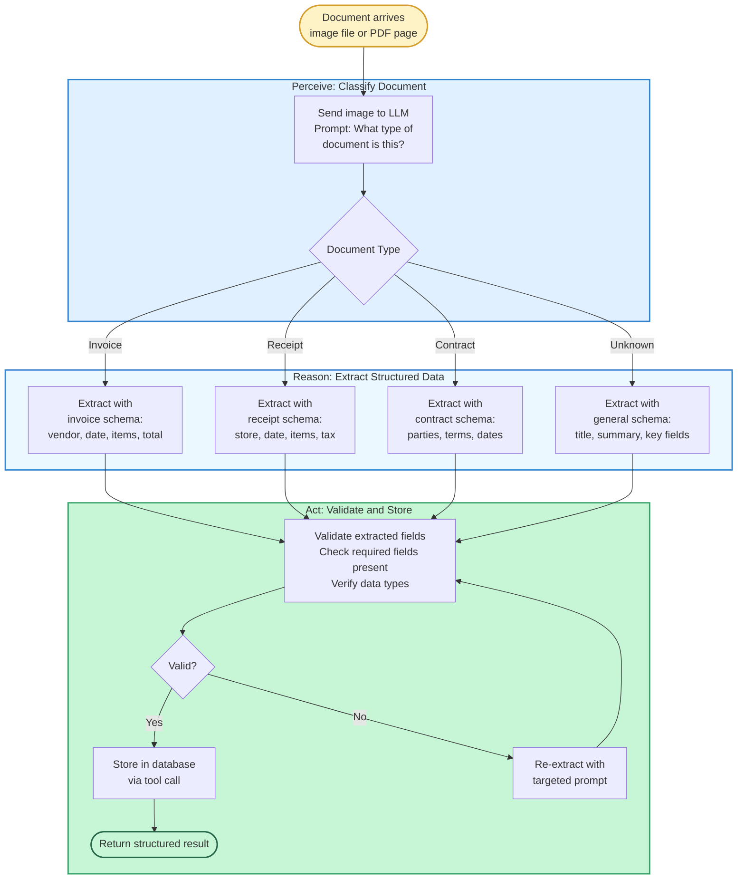

Notice how this maps directly to the perception-reasoning-action loop from Module 1:

- **Perceive** -- the agent looks at the document image and classifies its type
- **Reason** -- based on the document type, it selects the appropriate extraction schema and pulls out structured fields
- **Act** -- it validates the extracted data and stores it, retrying if validation fails

The classification step is critical. A generic "extract everything" prompt produces inconsistent results. By first identifying whether the document is an invoice, receipt, or contract, the agent can apply a **type-specific extraction prompt** with the exact fields expected. This mirrors how a human would process documents -- you look at it, recognize what it is, and then know what information to look for.

## 8.2 Building a Vision-Language Agent

Now let us implement a vision-language agent that combines image understanding with tool use. This agent can analyze images, extract structured data, and take actions based on what it sees. Recall the tool definition patterns from Module 3 -- we are extending the same approach to include visual inputs.

**document_agent.py**

```python
import anthropic
import base64
import json
from pathlib import Path


def encode_image(image_path: str) -> tuple[str, str]:
    """Encode a local image file to base64 with its media type."""
    path = Path(image_path)
    media_types = {
        ".png": "image/png",
        ".jpg": "image/jpeg",
        ".jpeg": "image/jpeg",
        ".gif": "image/gif",
        ".webp": "image/webp",
    }
    media_type = media_types.get(path.suffix.lower(), "image/png")
    data = base64.standard_b64encode(path.read_bytes()).decode("utf-8")
    return data, media_type


# Define tools the agent can use after analyzing images
tools = [
    {
        "name": "save_extracted_data",
        "description": "Save structured data extracted from a document image to the database.",
        "input_schema": {
            "type": "object",
            "properties": {
                "document_type": {
                    "type": "string",
                    "enum": ["invoice", "receipt", "contract", "report", "other"],
                    "description": "The classified type of the document.",
                },
                "extracted_fields": {
                    "type": "object",
                    "description": "Key-value pairs of extracted data fields.",
                },
                "confidence": {
                    "type": "string",
                    "enum": ["high", "medium", "low"],
                    "description": "Confidence level in the extraction accuracy.",
                },
            },
            "required": ["document_type", "extracted_fields", "confidence"],
        },
    },
    {
        "name": "flag_for_human_review",
        "description": "Flag a document for human review when extraction confidence is low or the document type is unclear.",
        "input_schema": {
            "type": "object",
            "properties": {
                "reason": {
                    "type": "string",
                    "description": "Why this document needs human review.",
                },
                "partial_extraction": {
                    "type": "object",
                    "description": "Any data that was partially extracted.",
                },
            },
            "required": ["reason"],
        },
    },
]


def process_document(image_path: str) -> dict:
    """Run the vision-language agent loop on a document image."""
    client = anthropic.Anthropic()
    image_data, media_type = encode_image(image_path)

    system_prompt = """You are a document processing agent. When given a document image:

1. CLASSIFY the document type (invoice, receipt, contract, report, or other).
2. EXTRACT all relevant structured fields based on the document type.
   - Invoice: vendor name, invoice number, date, line items, subtotal, tax, total
   - Receipt: store name, date, items with prices, tax, total, payment method
   - Contract: parties involved, effective date, termination date, key terms
   - Report: title, author, date, executive summary, key findings
3. ASSESS your confidence in the extraction (high/medium/low).
4. If confidence is high or medium, use save_extracted_data to store the result.
   If confidence is low or the document is unclear, use flag_for_human_review.

Always use one of the tools to record your result. Do not just describe the document."""

    messages = [
        {
            "role": "user",
            "content": [
                {
                    "type": "image",
                    "source": {
                        "type": "base64",
                        "media_type": media_type,
                        "data": image_data,
                    },
                },
                {
                    "type": "text",
                    "text": "Process this document. Classify it, extract structured data, and save or flag it.",
                },
            ],
        }
    ]

    # Agent loop: keep running until the model stops calling tools
    while True:
        response = client.messages.create(
            model="claude-sonnet-4-20250514",
            max_tokens=2048,
            system=system_prompt,
            tools=tools,
            messages=messages,
        )

        # Check if the model wants to use a tool
        if response.stop_reason == "tool_use":
            tool_block = next(
                block for block in response.content
                if block.type == "tool_use"
            )

            # Execute the tool (in production, these would call real services)
            if tool_block.name == "save_extracted_data":
                result = {
                    "status": "saved",
                    "id": "doc_12345",
                    "document_type": tool_block.input["document_type"],
                }
                print(f"Saved {tool_block.input['document_type']} with confidence: "
                      f"{tool_block.input['confidence']}")
                print(json.dumps(tool_block.input["extracted_fields"], indent=2))

            elif tool_block.name == "flag_for_human_review":
                result = {"status": "flagged", "queue_position": 3}
                print(f"Flagged for review: {tool_block.input['reason']}")

            # Feed the tool result back into the conversation
            messages.append({"role": "assistant", "content": response.content})
            messages.append({
                "role": "user",
                "content": [
                    {
                        "type": "tool_result",
                        "tool_use_id": tool_block.id,
                        "content": json.dumps(result),
                    }
                ],
            })
        else:
            # Model finished without a tool call -- return final response
            final_text = next(
                (block.text for block in response.content if hasattr(block, "text")),
                "Processing complete.",
            )
            return {"status": "complete", "summary": final_text}


# Usage
if __name__ == "__main__":
    result = process_document("invoice.png")
    print(f"\\nFinal result: {result['status']}")
```

There are several design decisions worth noting in this implementation:

- **Classification before extraction** -- the system prompt instructs the agent to first classify the document type, then apply the correct extraction schema. This produces far more consistent results than a generic "extract everything" prompt.
- **Confidence-gated actions** -- the agent assesses its own extraction confidence and routes low-confidence documents to human review rather than saving potentially incorrect data. This is a practical pattern for production systems where accuracy matters.
- **Tool use for actions** -- rather than returning raw text, the agent uses tools (as covered in Module 3) to take concrete actions. This makes the agent's outputs machine-readable and integrable with downstream systems.
- **Agent loop** -- the `while True` loop continues until the model produces a response without a tool call, allowing for multi-step interactions if needed (for example, saving data and then confirming the save).

## 8.2 Multi-Image Analysis

Vision-language agents become especially powerful when they process **multiple images** in a single conversation. This enables comparison, change detection, and multi-page document processing.

**compare_screenshots.py**

```python
def compare_screenshots(before_path: str, after_path: str) -> str:
    """Compare two UI screenshots and identify differences."""
    client = anthropic.Anthropic()

    before_data, before_type = encode_image(before_path)
    after_data, after_type = encode_image(after_path)

    message = client.messages.create(
        model="claude-sonnet-4-20250514",
        max_tokens=1024,
        messages=[
            {
                "role": "user",
                "content": [
                    {
                        "type": "text",
                        "text": "Compare these two UI screenshots. The first is BEFORE and the second is AFTER a code change.",
                    },
                    {
                        "type": "image",
                        "source": {
                            "type": "base64",
                            "media_type": before_type,
                            "data": before_data,
                        },
                    },
                    {
                        "type": "image",
                        "source": {
                            "type": "base64",
                            "media_type": after_type,
                            "data": after_data,
                        },
                    },
                    {
                        "type": "text",
                        "text": """Analyze the visual differences between BEFORE and AFTER:
1. Layout changes (spacing, alignment, element positions)
2. Color or styling changes
3. Content changes (text, icons, images)
4. Missing or added elements
5. Potential visual regressions or bugs

Return a structured assessment with severity ratings.""",
                    },
                ],
            }
        ],
    )
    return message.content[0].text
```

This pattern is directly applicable to visual regression testing, design review automation, and monitoring dashboards for unexpected UI changes.

## 8.2 Practical Considerations

Building production vision-language agents requires attention to several practical details:

**Image resolution and tokens** -- larger images consume more input tokens. Claude processes images by dividing them into tiles, and higher-resolution images produce more tiles. For cost-sensitive applications, resize images to the minimum resolution that preserves the information you need. A screenshot for UI analysis needs high resolution; a document classification task may work fine at lower resolution.

**Prompt specificity** -- vague prompts like "describe this image" produce vague responses. Specific prompts like "extract the vendor name, invoice number, and total amount from this invoice" produce structured, actionable outputs. Always tell the model exactly what you are looking for and in what format.

**Structured output** -- when you need machine-readable results, instruct the model to return JSON and define the expected schema in your prompt. For critical applications, validate the returned structure before using it. The tool use pattern shown above is one way to enforce structure, since tool inputs must conform to the defined input schema.

**Multi-page documents** -- for PDFs or multi-page documents, convert each page to an image and send them as multiple image content blocks. The model can reason across pages, understanding that page 2 continues a table started on page 1.

**Grounding and hallucination** -- vision-language models can sometimes "read" text that is not actually in the image, especially with low-resolution or blurry inputs. For high-stakes extraction tasks, implement validation checks: verify that extracted amounts sum correctly, cross-reference dates with expected ranges, and flag anomalies for human review.

## 8.2 Connecting to Module 3: Vision Meets Tool Use

The document processing agent above demonstrates a pattern that will recur throughout this module: **vision as perception, tools as action**. In Module 3, you learned how agents use tools to interact with external systems -- calling APIs, querying databases, running code. Vision-language agents extend this by adding a visual perception channel.

The agent loop remains the same:

1. **Perceive** -- now includes both text inputs and image inputs
2. **Reason** -- the model jointly processes visual and textual information
3. **Act** -- the model calls tools based on its visual understanding
4. **Observe** -- the model reads tool results and decides whether to continue

This means every tool use pattern you learned in Module 3 -- sequential tool calls, parallel tool execution, error handling, human-in-the-loop confirmation -- applies directly to vision-language agents. The only difference is that the agent's perception now includes pixels as well as text.

## 8.2 Summary

In this lesson, we moved from the "why" of multi-modal agents to the "how" of vision-language agents. You learned the architecture of the vision-language pipeline -- from raw pixels through vision encoding and cross-modal alignment to structured output. You saw how to pass images to Claude using base64 encoding and URL references, and you explored the key use cases: document parsing, UI understanding, visual QA, chart analysis, and screenshot-based testing.

Most importantly, you built a complete document processing agent that combines visual perception with tool use, demonstrating that vision is not a separate capability but a new **perception channel** that plugs directly into the agent loop and tool use patterns you already know.

In the next lesson, *Audio and Speech Agents*, we will extend this multi-modal approach to a different sensory channel -- sound -- and explore agents that can listen, speak, and process audio in real time.

---

    Section 8.3: Audio and Speech Agents


## 8.3 Overview

In the previous lesson, we explored how agents process visual information -- reading documents, understanding screenshots, and answering questions about images. Vision gives agents eyes, but many real-world interactions happen through sound. A customer support agent that can only read text misses the urgency in a caller's voice. A field assistant that requires typing is useless when your hands are full. Audio is the most natural human interface, and agents that can hear and speak unlock entirely new categories of applications.

This lesson covers the complete audio pipeline for LLM agents: converting speech to text (**STT**), routing the transcript through agent reasoning, and converting the response back to speech (**TTS**). We will examine the key technologies -- Whisper, Deepgram, ElevenLabs, OpenAI TTS -- and build a working voice agent pipeline. Along the way, we will tackle the central engineering challenge of voice agents: **latency**. A 3-second pause after every sentence makes a voice agent feel broken, so we will explore streaming architectures, chunked processing, and pipeline parallelism that bring response times under 500 milliseconds.

This connects directly to Module 3's tool-use patterns. Speech-to-text and text-to-speech are specialized tools in the agent's toolkit -- the same function-calling and tool-interface-design principles apply, but the data flowing through the pipeline is audio rather than JSON.

## 8.3 The Voice Conversation Flow

A voice agent conversation follows a precise sequence. The user speaks, the audio is captured and transcribed, the transcript enters the LLM reasoning loop, and the response is synthesized back into speech. Understanding this flow is essential before diving into implementation.

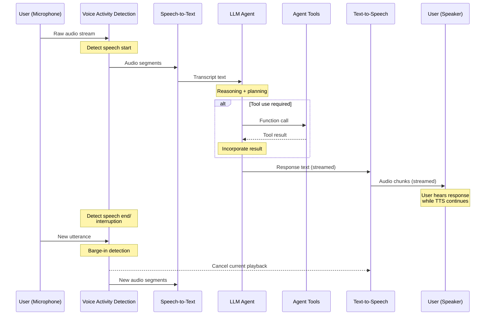

Several things happen in this flow that distinguish voice agents from text-based chat. **Voice Activity Detection (VAD)** sits at the front of the pipeline, determining when the user starts and stops speaking. Without VAD, the agent would either clip words or wait indefinitely. **Barge-in detection** allows the user to interrupt the agent mid-response -- a behavior humans expect in natural conversation but that requires canceling the current TTS output and restarting the pipeline. And the entire response path from LLM to TTS to speaker is **streamed**, meaning the user starts hearing the response before the LLM has finished generating it.

## 8.3 Speech-to-Text: Giving Agents Ears

**Speech-to-text (STT)** is the entry point of any voice agent. The quality and speed of transcription directly determine the agent's effectiveness. Two approaches dominate the landscape.

### Whisper: The Open-Source Foundation

OpenAI's **Whisper** is an open-source transformer model trained on 680,000 hours of multilingual audio. It supports 99 languages, handles accents and background noise robustly, and can be self-hosted for complete data privacy. Whisper operates in **batch mode** -- you send a complete audio segment, and it returns the full transcript. This makes it straightforward to integrate but introduces latency proportional to the audio length.

Whisper comes in several sizes. The `tiny` model (39M parameters) transcribes in near real-time but with lower accuracy. The `large-v3` model (1.5B parameters) achieves near-human accuracy but requires a GPU and takes longer. For agent pipelines, the `medium` model often hits the sweet spot between speed and accuracy.

### Deepgram Nova: Streaming-First

**Deepgram Nova** is a cloud-native STT API built for real-time applications. Unlike Whisper's batch processing, Deepgram accepts a continuous audio stream over WebSocket and returns **interim results** as the user speaks, with **final results** when it detects a pause. This streaming architecture dramatically reduces perceived latency because the agent can begin processing a partial transcript before the user finishes speaking.

Deepgram also provides **endpointing** -- automatic detection of when the user has finished a thought -- which simplifies VAD logic. Its API includes features like smart formatting, punctuation, and speaker diarization out of the box.

### Choosing Between Them

| Feature | Whisper (self-hosted) | Deepgram Nova |
|---|---|---|
| Latency | Batch (higher) | Streaming (lower) |
| Privacy | Full control (on-premise) | Cloud-dependent |
| Cost | Compute cost only | Per-minute API pricing |
| Languages | 99 languages | 30+ languages |
| Streaming | Requires wrapper (e.g., faster-whisper) | Native WebSocket |
| Accuracy | Excellent (large-v3) | Excellent (Nova-2) |

For prototyping and applications where latency is secondary, Whisper is the practical choice. For production voice agents where sub-second response time matters, Deepgram or a similar streaming API is typically necessary.

## 8.3 Text-to-Speech: Giving Agents a Voice

The other end of the pipeline is **text-to-speech (TTS)** -- converting the agent's text response into natural-sounding audio. Modern TTS has moved far beyond robotic monotone; today's models produce speech that is difficult to distinguish from human recordings.

### OpenAI TTS

OpenAI offers two TTS models. The standard `tts-1` model is optimized for speed and real-time use, while `tts-1-hd` produces higher-quality audio at the cost of added latency. Both support six built-in voices and accept a streaming response, meaning you can pipe LLM output tokens directly into TTS and start playback immediately.

### ElevenLabs

**ElevenLabs** specializes in expressive, high-fidelity voice synthesis. Its key differentiator is **voice cloning** -- you can upload a sample of any voice and generate speech that sounds like that person. For agent applications, ElevenLabs offers a streaming API with WebSocket support, enabling the same chunked-output pattern as Deepgram. It also provides fine-grained control over **stability** (how consistent the voice sounds) and **similarity boost** (how closely it matches the target voice).

### Streaming TTS for Low Latency

The critical insight for voice agents is that TTS should never wait for the complete LLM response. Instead, as the LLM streams tokens, you accumulate text until you hit a sentence boundary (a period, question mark, or exclamation point), then send that sentence to TTS while the LLM continues generating. The user hears the first sentence while the second is being synthesized and the third is still being generated by the LLM. This **sentence-level pipelining** is what makes voice agents feel responsive.

## 8.3 Real-Time Voice Agent Architecture

Putting these components together requires a streaming architecture that moves data through the pipeline with minimal buffering. The following diagram shows the production-grade design used in real-time voice agents.

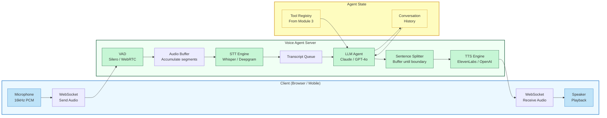

The architecture uses **WebSocket** connections for bidirectional audio streaming. The client sends raw PCM audio at 16kHz, and the server sends synthesized audio chunks back. This avoids the overhead of HTTP request-response cycles for every utterance. The **Agent State** box on the right connects this to everything we learned in Module 5 -- conversation history persists across turns, and tools from Module 3 are available for the LLM to call when voice requests require actions like database lookups, API calls, or calculations.

## 8.3 Voice Agent Latency Optimization

Latency is the defining engineering challenge for voice agents. Users expect conversational response times under one second. Every millisecond spent in the pipeline is felt directly. Here are the primary optimization strategies.

**Pipeline parallelism** is the most impactful technique. Instead of waiting for each stage to complete before starting the next, stages overlap. The STT begins processing the next audio chunk while the LLM reasons about the previous transcript. The TTS synthesizes the first sentence while the LLM generates the second. This turns a serial 3-second pipeline into a parallel one that delivers first audio in under 500ms.

**Model selection** matters enormously. Using Whisper `tiny` instead of `large-v3` for initial transcription, then re-transcribing with the larger model if confidence is low, gives you speed for common cases and accuracy when needed. Similarly, using `tts-1` (faster) instead of `tts-1-hd` (higher quality) reduces TTS latency at a barely perceptible quality cost.

**Prefetching and caching** help with common responses. If your agent frequently says "Let me look that up for you," pre-synthesize that audio and play it instantly while the actual lookup happens. This **filler phrase** pattern mimics human conversation behavior and masks processing time.

**Connection pooling** eliminates the overhead of establishing new connections to STT and TTS services on every turn. Keep WebSocket connections to Deepgram and ElevenLabs alive across the entire conversation session.

> **Key takeaway:** Perceived latency matters more than actual latency. Streaming the first sentence of audio to the user while generating the rest creates the impression of instant response, even if the full response takes several seconds to complete.

## 8.3 Building a Voice Agent Pipeline

Let us build a complete voice agent that accepts audio input, transcribes it, runs it through an LLM agent with tool access, and synthesizes the response back to speech. This example uses OpenAI's Whisper API for STT, Anthropic's Claude for reasoning, and OpenAI's TTS API for speech synthesis.

**voice_agent.py**

```python
import asyncio
import io
import struct
from pathlib import Path
from anthropic import Anthropic
from openai import OpenAI

# ── Clients ──────────────────────────────────────────────
anthropic_client = Anthropic()
openai_client = OpenAI()

# ── Tool definitions (Module 3 pattern) ──────────────────
TOOLS = [
    {
        "name": "check_weather",
        "description": "Get current weather for a city.",
        "input_schema": {
            "type": "object",
            "properties": {
                "city": {"type": "string", "description": "City name"}
            },
            "required": ["city"],
        },
    },
    {
        "name": "set_reminder",
        "description": "Set a reminder for the user.",
        "input_schema": {
            "type": "object",
            "properties": {
                "message": {"type": "string"},
                "minutes": {"type": "integer"},
            },
            "required": ["message", "minutes"],
        },
    },
]


def execute_tool(name: str, args: dict) -> str:
    """Execute a tool and return the result as a string."""
    if name == "check_weather":
        return f"It is 22°C and sunny in {args['city']}."
    elif name == "set_reminder":
        return f"Reminder set: '{args['message']}' in {args['minutes']} minutes."
    return f"Unknown tool: {name}"


# ── Speech-to-Text ───────────────────────────────────────
def transcribe_audio(audio_path: str) -> str:
    """Transcribe an audio file using OpenAI Whisper API."""
    with open(audio_path, "rb") as audio_file:
        transcript = openai_client.audio.transcriptions.create(
            model="whisper-1",
            file=audio_file,
            language="en",
        )
    return transcript.text


# ── Text-to-Speech ───────────────────────────────────────
def synthesize_speech(text: str, output_path: str) -> str:
    """Convert text to speech using OpenAI TTS API."""
    response = openai_client.audio.speech.create(
        model="tts-1",
        voice="nova",
        input=text,
        response_format="mp3",
    )
    response.stream_to_file(output_path)
    return output_path


# ── LLM Agent with Tool Loop ────────────────────────────
def run_agent(user_text: str, history: list[dict]) -> str:
    """Run the Claude agent loop until a final text response."""
    history.append({"role": "user", "content": user_text})

    while True:
        response = anthropic_client.messages.create(
            model="claude-sonnet-4-20250514",
            max_tokens=1024,
            system="You are a helpful voice assistant. Keep responses "
                   "concise and conversational -- the user will hear "
                   "this spoken aloud, so avoid markdown, bullet lists, "
                   "and long paragraphs. Use natural spoken language.",
            tools=TOOLS,
            messages=history,
        )

        # Append assistant response to history
        history.append({"role": "assistant", "content": response.content})

        # If the model wants to use a tool, execute it and loop
        if response.stop_reason == "tool_use":
            tool_results = []
            for block in response.content:
                if block.type == "tool_use":
                    result = execute_tool(block.name, block.input)
                    tool_results.append({
                        "type": "tool_result",
                        "tool_use_id": block.id,
                        "content": result,
                    })
            history.append({"role": "user", "content": tool_results})
            continue

        # Extract final text response
        text_parts = [
            block.text for block in response.content
            if block.type == "text"
        ]
        return " ".join(text_parts)


# ── Full Voice Pipeline ─────────────────────────────────
def voice_conversation_turn(
    audio_input_path: str,
    audio_output_path: str,
    history: list[dict],
) -> str:
    """Process one turn of a voice conversation.

    1. Transcribe user audio (STT)
    2. Run agent reasoning loop (LLM + tools)
    3. Synthesize response audio (TTS)
    """
    # Step 1: Speech-to-Text
    print("🎤 Transcribing audio...")
    user_text = transcribe_audio(audio_input_path)
    print(f"   User said: {user_text}")

    # Step 2: Agent reasoning
    print("🧠 Agent thinking...")
    agent_response = run_agent(user_text, history)
    print(f"   Agent response: {agent_response}")

    # Step 3: Text-to-Speech
    print("🔊 Synthesizing speech...")
    synthesize_speech(agent_response, audio_output_path)
    print(f"   Audio saved to: {audio_output_path}")

    return agent_response


# ── Example usage ────────────────────────────────────────
if __name__ == "__main__":
    history = []

    # Simulate a multi-turn voice conversation
    turns = [
        ("input_1.wav", "output_1.mp3"),
        ("input_2.wav", "output_2.mp3"),
    ]

    for input_path, output_path in turns:
        if Path(input_path).exists():
            response = voice_conversation_turn(
                input_path, output_path, history
            )
            print(f"Turn complete. Response: {response}\\n")
```

This code follows the same **agentic loop** pattern from Module 7's Claude agent lesson. The `run_agent` function cycles between the LLM and tool execution until the model produces a final text response -- the only difference is that the input comes from audio transcription and the output goes to speech synthesis. The conversation `history` list persists across turns, giving the voice agent multi-turn memory exactly as we implemented in text-based agents.

## 8.3 Streaming Voice Pipeline

The pipeline above works correctly but processes each stage sequentially -- the user waits for the full STT, then the full LLM response, then the full TTS before hearing anything. For production voice agents, we need streaming. The following example shows how to stream the LLM response through sentence-level TTS.

**streaming_voice_agent.py**

```python
import asyncio
import re
from anthropic import Anthropic

anthropic_client = Anthropic()

# Sentence boundary pattern: split on . ? ! followed by space
SENTENCE_BOUNDARY = re.compile(r'(?<=[.!?])\s+')


async def stream_agent_to_tts(
    user_text: str,
    history: list[dict],
    tts_callback,
):
    """Stream LLM output through TTS with sentence-level chunking.

    Instead of waiting for the full response, we accumulate tokens
    until we hit a sentence boundary, then send that sentence to
    TTS immediately while continuing to collect the next sentence.
    """
    history.append({"role": "user", "content": user_text})

    buffer = ""
    sentence_index = 0

    # Stream the LLM response token by token
    with anthropic_client.messages.stream(
        model="claude-sonnet-4-20250514",
        max_tokens=1024,
        system="You are a helpful voice assistant. Respond in short, "
               "natural sentences suitable for spoken delivery.",
        messages=history,
    ) as stream:
        for text_chunk in stream.text_stream:
            buffer += text_chunk

            # Check if buffer contains a complete sentence
            sentences = SENTENCE_BOUNDARY.split(buffer)
            if len(sentences) > 1:
                # Send all complete sentences to TTS
                for sentence in sentences[:-1]:
                    sentence = sentence.strip()
                    if sentence:
                        sentence_index += 1
                        # Fire-and-forget: TTS runs in parallel
                        # with continued LLM generation
                        asyncio.create_task(
                            tts_callback(sentence, sentence_index)
                        )
                # Keep the incomplete last segment in the buffer
                buffer = sentences[-1]

    # Flush remaining buffer
    if buffer.strip():
        sentence_index += 1
        await tts_callback(buffer.strip(), sentence_index)

    # Collect the full response for history
    full_response = stream.get_final_message()
    history.append({
        "role": "assistant",
        "content": full_response.content,
    })


async def tts_synthesize(sentence: str, index: int):
    """Placeholder TTS callback -- replace with real API call."""
    print(f"  TTS [{index}]: Synthesizing '{sentence}'")
    # In production: call OpenAI TTS or ElevenLabs streaming API
    # and send audio chunks to the client WebSocket
    await asyncio.sleep(0.3)  # Simulate TTS latency
    print(f"  TTS [{index}]: Audio ready")


async def main():
    history = []
    await stream_agent_to_tts(
        user_text="What is the weather like in Paris today?",
        history=history,
        tts_callback=tts_synthesize,
    )

if __name__ == "__main__":
    asyncio.run(main())
```

The key pattern here is **sentence-level chunking**. The `buffer` accumulates streamed tokens until a sentence boundary regex matches, then dispatches that sentence to TTS as an async task. The LLM continues streaming the next sentence while TTS synthesizes the previous one. This overlap is what brings perceived latency down from seconds to hundreds of milliseconds.

## 8.3 Audio Analysis Beyond Speech

Voice agents are not limited to transcription and synthesis. Audio contains rich information beyond words. **Tone and sentiment analysis** can detect frustration, urgency, or confusion in a caller's voice, allowing the agent to adapt its behavior. **Speaker diarization** identifies who is speaking in a multi-person conversation, enabling agents to track participants in a meeting. **Sound classification** lets agents respond to non-speech audio events -- a doorbell, a baby crying, or an alarm.

These capabilities are typically implemented as specialized tools that the agent can invoke. Following the tool-use patterns from Module 3, you would define a `analyze_audio_sentiment` tool or a `identify_speakers` tool, expose them to the LLM through the standard tool-calling interface, and let the agent decide when to use them based on context.

> **Connection to Module 3:** Audio processing functions are tools in the same way that web search or database queries are tools. The agent does not need to understand the audio processing internals -- it calls the tool with audio data and receives structured results. The tool interface design principles from Module 3 (clear descriptions, well-typed schemas, informative error messages) apply directly.

## 8.3 Latency Budget Breakdown

Understanding where time is spent helps you target optimizations. Here is a typical latency budget for a voice agent turn.

| Stage | Sequential | With Streaming |
|---|---|---|
| VAD + capture | 200-500ms | 200-500ms |
| STT (Whisper medium) | 800-1500ms | 300-600ms (streaming STT) |
| LLM first token | 300-800ms | 300-800ms |
| LLM full response | 1000-3000ms | Overlapped with TTS |
| TTS first audio | 200-500ms | 200-500ms |
| TTS full audio | 500-2000ms | Overlapped with playback |
| **Total (user perceives)** | **3-8 seconds** | **0.7-1.5 seconds** |

The streaming column shows why pipeline parallelism is so important. The user's perceived wait is only from the end of their speech to the first audio playback -- about one second in optimal conditions. Everything after that is streamed concurrently.

## 8.3 Summary

Voice agents extend the LLM agent paradigm from text to the most natural human interface -- spoken conversation. The core pipeline follows a clear pattern: **VAD** detects speech boundaries, **STT** converts audio to text (using Whisper for flexibility or Deepgram for streaming speed), the **LLM agent** reasons and calls tools exactly as it would in a text-based system, and **TTS** converts the response back to speech (using OpenAI TTS for simplicity or ElevenLabs for expressiveness and voice cloning).

The defining engineering challenge is **latency**. Sequential processing creates multi-second delays that break the illusion of conversation. The solution is pipeline parallelism: streaming STT results to the LLM as the user speaks, chunking LLM output at sentence boundaries for immediate TTS synthesis, and overlapping audio playback with continued generation. These techniques bring perceived latency under one second.

Audio processing functions -- sentiment analysis, speaker diarization, sound classification -- integrate as tools through the same patterns covered in Module 3. The agent does not need to understand audio internals; it calls tools and acts on structured results.

In the next lesson, we will explore agents that **generate** visual content -- images and video -- adding creative output capabilities to the multi-modal toolkit.

---

    Section 8.4: Image and Video Generation


## 8.4 Overview

In the previous lessons, we gave agents the ability to **see** (vision-language models) and **hear** (audio and speech). Those are perception capabilities -- the agent consumes existing media and extracts meaning. Now we flip the direction. In this lesson, agents become **creators** of visual content: generating images from text descriptions, producing short videos from prompts, and iteratively refining their output until it matches the user's intent.

This is not just about calling an API and returning a picture. The interesting part is what happens *around* the API call. An agent that generates images must engineer effective prompts for the generation model, evaluate whether the output matches the request, handle failures and content policy rejections, and decide when to refine versus when to deliver. These are the same tool-use patterns you learned in Module 3, applied to a new and uniquely challenging domain -- one where the "correctness" of output is subjective and often requires multiple iterations.

## 8.4 The Image Generation Pipeline

When a user asks an agent to create an image, the request passes through several stages before a final image is delivered. Understanding this pipeline is essential for building agents that produce high-quality visual content reliably.

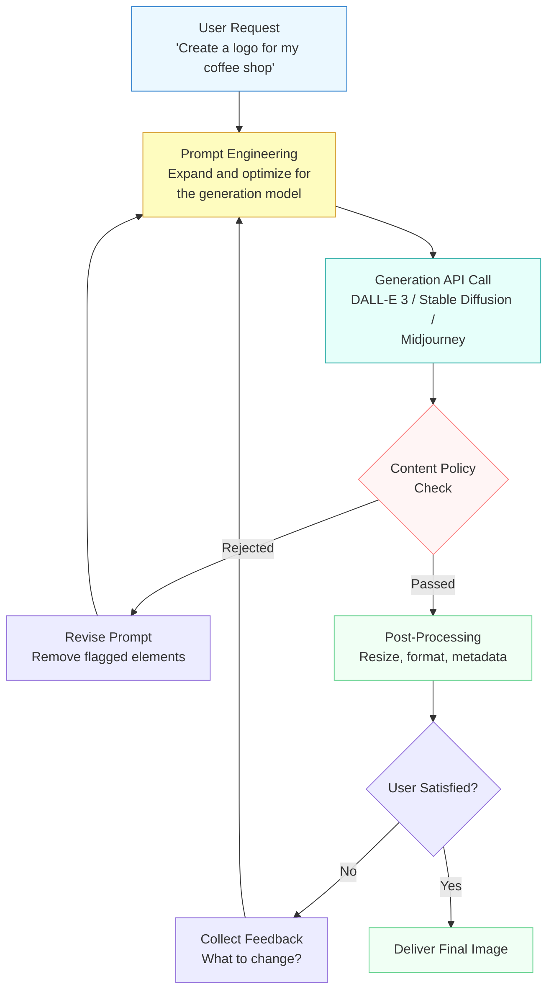

The key insight is that this is a **loop**, not a linear process. The agent does not fire-and-forget. It engineers the prompt, calls the API, checks the result, and refines -- potentially multiple times. This iterative refinement is what separates a useful generation agent from a thin API wrapper.

## 8.4 Prompt Engineering for Image Generation

The gap between what a user says and what an image generation model needs is often enormous. A user might say "a cozy coffee shop." A generation model produces its best work when given something like "a warm interior photograph of a small artisan coffee shop, morning light streaming through large windows, exposed brick walls, wooden tables with steaming ceramic cups, shallow depth of field, shot on 35mm film." Bridging this gap is the agent's first and most important job.

**Prompt expansion** is the technique where the agent's LLM takes a brief user request and transforms it into a rich, detailed prompt optimized for the generation model. This is where the agent's language understanding becomes a genuine advantage -- it can ask clarifying questions, infer style preferences from context, and translate abstract concepts ("make it feel professional") into concrete visual descriptors.

The expanded prompt typically includes several dimensions:

- **Subject** -- what is depicted (objects, people, scenes)
- **Style** -- artistic approach (photorealistic, watercolor, digital art, isometric)
- **Composition** -- framing, perspective, layout
- **Lighting** -- natural, studio, dramatic, soft
- **Color palette** -- warm tones, monochromatic, vibrant
- **Technical parameters** -- aspect ratio, resolution, camera lens simulation

**prompt_expansion.py**

```python
import anthropic
import openai

# The agent's LLM expands a brief user request into a rich generation prompt
def expand_prompt_for_generation(user_request: str, style_preferences: dict) -> str:
    """Use the agent's LLM to craft an optimized image generation prompt."""
    client = anthropic.Anthropic()

    style_context = ""
    if style_preferences:
        style_context = f"""
The user has these style preferences:
- Art style: {style_preferences.get('style', 'photorealistic')}
- Color mood: {style_preferences.get('mood', 'neutral')}
- Aspect ratio: {style_preferences.get('aspect_ratio', '1:1')}
"""

    message = client.messages.create(
        model="claude-sonnet-4-20250514",
        max_tokens=300,
        messages=[{
            "role": "user",
            "content": f"""Transform this image request into a detailed prompt
optimized for DALL-E 3. Include subject, style, composition, lighting,
and color details. Output ONLY the prompt text, nothing else.
{style_context}
User request: {user_request}"""
        }]
    )
    return message.content[0].text


# Example: expand a simple request
expanded = expand_prompt_for_generation(
    user_request="a logo for my coffee shop called 'Morning Brew'",
    style_preferences={"style": "minimalist", "mood": "warm", "aspect_ratio": "1:1"}
)
print(f"Expanded prompt:\\n{expanded}")
# Output might be: "A minimalist logo design for 'Morning Brew' coffee shop,
# featuring a stylized steaming coffee cup silhouette, warm amber and cream
# color palette, clean sans-serif typography, centered composition on a
# white background, flat design style with subtle gradient accents..."
```

This prompt expansion step is the bridge between human intent and model capability. Without it, users must learn the generation model's "language" themselves -- knowing that "35mm film" produces a certain look, or that "isometric" triggers a specific perspective. The agent absorbs that expertise.

## 8.4 Integrating DALL-E 3

**DALL-E 3** is OpenAI's image generation model, accessible through their API. From an agent's perspective, it is a tool -- you send a text prompt and receive an image. But DALL-E 3 has a distinctive feature that makes it especially interesting for agents: it **rewrites your prompt internally** to improve generation quality, and it returns the revised prompt alongside the image. This means the agent can see what DALL-E actually generated from, which is invaluable for iterative refinement.

**dalle_integration.py**

```python
import openai
import base64
from pathlib import Path


def generate_image_dalle(
    prompt: str,
    size: str = "1024x1024",
    quality: str = "standard",
    style: str = "vivid",
) -> dict:
    """Generate an image using DALL-E 3 and return the result."""
    client = openai.OpenAI()

    try:
        response = client.images.generate(
            model="dall-e-3",
            prompt=prompt,
            size=size,        # 1024x1024, 1792x1024, or 1024x1792
            quality=quality,  # "standard" or "hd"
            style=style,      # "vivid" or "natural"
            n=1,
            response_format="url",
        )

        image_data = response.data[0]
        return {
            "success": True,
            "image_url": image_data.url,
            "revised_prompt": image_data.revised_prompt,
            "original_prompt": prompt,
        }

    except openai.BadRequestError as e:
        # Content policy rejection
        return {
            "success": False,
            "error": "content_policy",
            "message": str(e),
            "original_prompt": prompt,
        }
    except openai.RateLimitError:
        return {
            "success": False,
            "error": "rate_limit",
            "message": "Rate limit exceeded. Try again shortly.",
            "original_prompt": prompt,
        }


# Generate an image
result = generate_image_dalle(
    prompt="A minimalist logo for 'Morning Brew' coffee shop, warm amber tones",
    size="1024x1024",
    quality="hd",
    style="natural",
)

if result["success"]:
    print(f"Image URL: {result['image_url']}")
    print(f"DALL-E revised prompt: {result['revised_prompt']}")
else:
    print(f"Failed: {result['error']} -- {result['message']}")
```

Notice the error handling. Content policy rejections are not bugs -- they are expected events that the agent must handle gracefully. The agent should analyze *why* the prompt was rejected, revise it to remove problematic elements, and retry. This is exactly the kind of error recovery we discussed in Module 3's lesson on error handling and retries.

## 8.4 Integrating Stable Diffusion

**Stable Diffusion** offers a different approach to image generation. While DALL-E is a hosted API, Stable Diffusion can run locally or through hosted endpoints like Stability AI's API. For agents, the key difference is control: Stable Diffusion exposes parameters like **guidance scale**, **number of inference steps**, and **negative prompts** that give the agent fine-grained control over generation.

**Negative prompts** are a concept unique to diffusion models -- they tell the model what to *avoid* in the generated image. An agent can use negative prompts strategically: "blurry, low quality, distorted faces, extra fingers" is a common baseline that improves output quality.

**stability_integration.py**

```python
import requests
import base64


def generate_image_stability(
    prompt: str,
    negative_prompt: str = "blurry, low quality, distorted, artifacts",
    width: int = 1024,
    height: int = 1024,
    cfg_scale: float = 7.0,
    steps: int = 30,
    style_preset: str | None = None,
) -> dict:
    """Generate an image using Stability AI's API."""
    api_key = "your-stability-api-key"

    body = {
        "text_prompts": [
            {"text": prompt, "weight": 1.0},
            {"text": negative_prompt, "weight": -1.0},
        ],
        "cfg_scale": cfg_scale,
        "width": width,
        "height": height,
        "steps": steps,
        "samples": 1,
    }

    if style_preset:
        body["style_preset"] = style_preset  # e.g., "photographic", "anime"

    response = requests.post(
        "https://api.stability.ai/v1/generation/stable-diffusion-xl-1024-v1-0/text-to-image",
        headers={
            "Content-Type": "application/json",
            "Authorization": f"Bearer {api_key}",
        },
        json=body,
    )

    if response.status_code == 200:
        data = response.json()
        image_b64 = data["artifacts"][0]["base64"]
        return {
            "success": True,
            "image_base64": image_b64,
            "finish_reason": data["artifacts"][0]["finishReason"],
            "prompt": prompt,
        }
    else:
        return {
            "success": False,
            "error": response.status_code,
            "message": response.text,
        }


# Generate with specific style control
result = generate_image_stability(
    prompt="Cozy artisan coffee shop interior, morning sunlight, warm tones",
    negative_prompt="dark, gloomy, empty, modern, sterile, cold lighting",
    style_preset="photographic",
    cfg_scale=8.0,  # Higher = stricter prompt adherence
    steps=40,       # More steps = higher quality, slower generation
)
```

The choice between DALL-E and Stable Diffusion depends on the agent's requirements. DALL-E excels at understanding complex prompts and produces consistently high-quality results with minimal parameter tuning. Stable Diffusion offers more control, supports negative prompts, and can be self-hosted for cost savings or data privacy. A sophisticated agent might offer both as tools and choose based on the task.

## 8.4 Video Generation

**Video generation** extends the same principles to moving images, but introduces a critical difference for agents: time. Image generation typically completes in seconds. Video generation can take minutes. This means the agent must handle **asynchronous workflows** -- submitting a generation job, polling for completion, and managing the wait gracefully.

Models like **Runway Gen-3**, **Pika**, and **Luma Dream Machine** offer text-to-video and image-to-video capabilities. From an agent's perspective, these are asynchronous tools: you submit a request and receive a job ID, then poll until the result is ready.

**video_generation.py**

```python
import time
import requests


def generate_video_async(
    prompt: str,
    duration: int = 4,
    aspect_ratio: str = "16:9",
    source_image_url: str | None = None,
) -> dict:
    """Submit a video generation job (generic async pattern).

    This demonstrates the async polling pattern common across video
    generation APIs like Runway, Pika, and Luma.
    """
    api_key = "your-api-key"
    headers = {"Authorization": f"Bearer {api_key}", "Content-Type": "application/json"}

    # Step 1: Submit the generation job
    payload = {
        "prompt": prompt,
        "duration": duration,
        "aspect_ratio": aspect_ratio,
    }
    if source_image_url:
        payload["image_url"] = source_image_url  # image-to-video mode

    submit_response = requests.post(
        "https://api.example.com/v1/video/generate",
        headers=headers,
        json=payload,
    )

    if submit_response.status_code != 202:
        return {"success": False, "error": submit_response.text}

    job_id = submit_response.json()["job_id"]

    # Step 2: Poll for completion (with timeout and backoff)
    max_wait = 300  # 5 minutes
    poll_interval = 5
    elapsed = 0

    while elapsed < max_wait:
        status_response = requests.get(
            f"https://api.example.com/v1/video/status/{job_id}",
            headers=headers,
        )
        status = status_response.json()

        if status["state"] == "completed":
            return {
                "success": True,
                "video_url": status["output_url"],
                "duration": status["duration"],
                "prompt": prompt,
            }
        elif status["state"] == "failed":
            return {
                "success": False,
                "error": status.get("error", "Generation failed"),
                "prompt": prompt,
            }

        time.sleep(poll_interval)
        elapsed += poll_interval
        poll_interval = min(poll_interval * 1.5, 30)  # Exponential backoff

    return {"success": False, "error": "timeout", "job_id": job_id}


# Submit a video generation job
result = generate_video_async(
    prompt="A steaming cup of coffee on a wooden table, morning light slowly "
           "shifting across the scene, shallow depth of field, cinematic",
    duration=4,
    aspect_ratio="16:9",
)

if result["success"]:
    print(f"Video ready: {result['video_url']}")
else:
    print(f"Generation failed: {result['error']}")
```

The exponential backoff pattern is important. Video generation APIs have rate limits and generation times vary. An agent that polls every second wastes resources and risks hitting rate limits. The backoff pattern starts with short intervals and gradually increases, balancing responsiveness with efficiency.

## 8.4 Agent-Controlled Generation Architecture

The real power emerges when you combine all of these pieces into a coherent agent architecture. The agent sits at the center, orchestrating prompt engineering, model selection, generation, evaluation, and iterative refinement -- all driven by the LLM's reasoning capabilities.

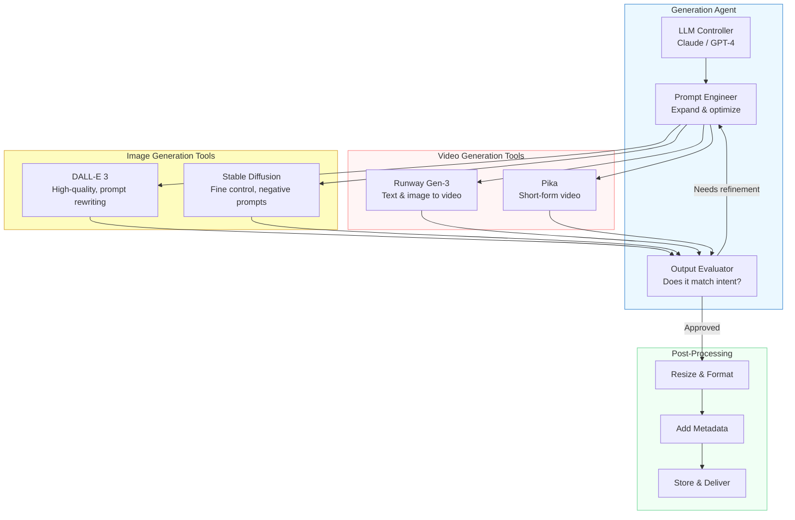

The architecture follows a pattern you should recognize from Module 3: the LLM controller decides *which* tool to use and *what* arguments to pass, then interprets the result to decide the next action. The generation APIs are tools in the same sense that a web search or database query is a tool -- the agent calls them, evaluates the response, and decides whether to act further.

## 8.4 Building the Complete Generation Agent

Let's bring everything together into a complete agent that uses image generation as a tool. This agent accepts natural language requests, engineers prompts, generates images, and iteratively refines them based on feedback.

**generation_agent.py**

```python
import anthropic
import json

# Define image generation as a tool for the agent
GENERATION_TOOLS = [
    {
        "name": "generate_image",
        "description": (
            "Generate an image from a text prompt using DALL-E 3. "
            "The prompt should be detailed and descriptive. Returns the "
            "image URL and the revised prompt that DALL-E actually used. "
            "Use this for creating illustrations, logos, photos, art, "
            "diagrams, and any other visual content."
        ),
        "input_schema": {
            "type": "object",
            "properties": {
                "prompt": {
                    "type": "string",
                    "description": "Detailed image generation prompt with subject, style, composition, and lighting",
                },
                "size": {
                    "type": "string",
                    "enum": ["1024x1024", "1792x1024", "1024x1792"],
                    "description": "Image dimensions. Use 1792x1024 for landscape, 1024x1792 for portrait",
                },
                "quality": {
                    "type": "string",
                    "enum": ["standard", "hd"],
                    "description": "Use 'hd' for detailed images where quality matters",
                },
                "style": {
                    "type": "string",
                    "enum": ["vivid", "natural"],
                    "description": "'vivid' for dramatic/artistic, 'natural' for realistic/subdued",
                },
            },
            "required": ["prompt"],
        },
    },
    {
        "name": "generate_video",
        "description": (
            "Generate a short video (4-10 seconds) from a text prompt. "
            "This is an async operation -- returns a job ID that must be "
            "polled for completion. Use for animations, product demos, "
            "and cinematic clips."
        ),
        "input_schema": {
            "type": "object",
            "properties": {
                "prompt": {
                    "type": "string",
                    "description": "Detailed video generation prompt including motion and scene description",
                },
                "duration": {
                    "type": "integer",
                    "enum": [4, 6, 8, 10],
                    "description": "Video duration in seconds",
                },
            },
            "required": ["prompt"],
        },
    },
]

SYSTEM_PROMPT = """You are a creative visual content agent. Your mission is
to help users generate images and videos that match their vision.

## 8.4 Workflow
1. When the user describes what they want, ask clarifying questions if
   the request is vague (style? mood? aspect ratio? use case?).
2. Engineer a detailed prompt optimized for the generation model.
   Include subject, style, composition, lighting, and color details.
3. Call the appropriate generation tool.
4. Present the result and ask if the user wants refinements.
5. If refining, adjust the prompt based on feedback and regenerate.

## 8.4 Guidelines
- Always engineer the prompt before generating -- never pass the user's
  raw text directly to the generation tool.
- For logos and brand assets, use 'natural' style and 'hd' quality.
- For artistic illustrations, use 'vivid' style.
- If generation fails due to content policy, explain what was flagged
  and suggest an alternative approach.
- Limit refinement to 3 iterations. After that, suggest the user
  rephrase their core request.
"""


def handle_tool_call(tool_name: str, tool_input: dict) -> str:
    """Route tool calls to the appropriate generation function."""
    if tool_name == "generate_image":
        result = generate_image_dalle(
            prompt=tool_input["prompt"],
            size=tool_input.get("size", "1024x1024"),
            quality=tool_input.get("quality", "standard"),
            style=tool_input.get("style", "vivid"),
        )
        return json.dumps(result)
    elif tool_name == "generate_video":
        result = generate_video_async(
            prompt=tool_input["prompt"],
            duration=tool_input.get("duration", 4),
        )
        return json.dumps(result)
    return json.dumps({"error": f"Unknown tool: {tool_name}"})


def run_generation_agent(user_message: str):
    """Run the generation agent loop with tool use."""
    client = anthropic.Anthropic()
    messages = [{"role": "user", "content": user_message}]

    while True:
        response = client.messages.create(
            model="claude-sonnet-4-20250514",
            max_tokens=1024,
            system=SYSTEM_PROMPT,
            tools=GENERATION_TOOLS,
            messages=messages,
        )

        # If the model wants to use a tool, execute it and continue
        if response.stop_reason == "tool_use":
            # Collect all tool calls from this response
            assistant_content = response.content
            tool_results = []

            for block in assistant_content:
                if block.type == "tool_use":
                    print(f"Calling tool: {block.name}")
                    result = handle_tool_call(block.name, block.input)
                    tool_results.append({
                        "type": "tool_result",
                        "tool_use_id": block.id,
                        "content": result,
                    })

            messages.append({"role": "assistant", "content": assistant_content})
            messages.append({"role": "user", "content": tool_results})
            continue

        # Model is done -- extract and return the text response
        final_text = ""
        for block in response.content:
            if hasattr(block, "text"):
                final_text += block.text

        print(f"Agent: {final_text}")
        return final_text


# Run the agent
run_generation_agent(
    "Create a professional hero image for a SaaS landing page. "
    "The product is a project management tool. Make it modern and clean."
)
```

This agent follows the same tool-use loop pattern from Module 3: the LLM reasons about the request, decides to call a tool, receives the result, and either refines or delivers. The generation-specific intelligence lives in the system prompt -- the prompt engineering workflow, the style guidelines, and the refinement limits.

## 8.4 Iterative Refinement in Practice

The most important capability of a generation agent is **iterative refinement** -- the ability to evaluate its own output and improve it. In practice, this means the agent generates an image, describes what it sees (using the vision capabilities from Lesson 02), compares that description to the user's intent, and decides whether refinement is needed.

This creates a feedback loop:

1. **Generate** -- call the generation API with an engineered prompt
2. **Evaluate** -- use vision-language capabilities to describe the result
3. **Compare** -- check whether the description matches the user's intent
4. **Refine** -- adjust the prompt to fix discrepancies and regenerate

This loop is what transforms a simple API wrapper into a genuine creative assistant. The agent does not just generate -- it *evaluates and iterates*, converging on the user's vision through successive refinement.

> **Key takeaway:** The generation API is the tool. The agent's value is everything *around* it -- understanding the user's intent, engineering effective prompts, evaluating results, and iteratively refining until the output matches the vision.

## 8.4 Choosing the Right Model

Different generation models have different strengths. An agent that has access to multiple models can choose strategically based on the task:

| Capability | DALL-E 3 | Stable Diffusion XL | Runway Gen-3 | Pika |
|---|---|---|---|---|
| Input | Text | Text + negative prompt | Text / image | Text / image |
| Output | Image | Image | Video (4-16s) | Video (3-8s) |
| Latency | 5-15 seconds | 5-30 seconds | 1-5 minutes | 1-3 minutes |
| Control | Moderate | High (cfg, steps) | Moderate | Moderate |
| Best for | General images | Style-specific work | Cinematic video | Quick animations |
| API style | Synchronous | Synchronous | Async (polling) | Async (polling) |

An intelligent agent uses this knowledge to route requests. A logo request goes to DALL-E with `quality: "hd"` and `style: "natural"`. A photorealistic product shot might go to Stable Diffusion with a high `cfg_scale` and specific negative prompts. A product demo clip goes to Runway. The routing decision is itself an act of reasoning -- exactly what LLM-based agents excel at.

## 8.4 Summary

Image and video generation transforms agents from consumers of visual content into **creators** of it. The key principles are:

- **Prompt engineering** is the critical first step -- the agent's LLM bridges the gap between casual user requests and the detailed, structured prompts that generation models need.
- **DALL-E 3** offers high-quality generation with automatic prompt rewriting, making it the simplest integration path. **Stable Diffusion** provides fine-grained control through parameters like guidance scale, inference steps, and negative prompts.
- **Video generation** introduces asynchronous workflows -- the agent must submit jobs, poll for completion with exponential backoff, and handle longer processing times gracefully.
- **Iterative refinement** is what separates a generation agent from an API wrapper. The agent evaluates output, compares it to the user's intent, and refines the prompt -- creating a feedback loop that converges on the desired result.
- Generation APIs are **tools** in the same sense we explored in Module 3 -- the agent calls them through function calling, interprets the results, and decides the next action based on its reasoning.

In the next lesson, we will explore **cross-modal reasoning** -- agents that combine multiple modalities in a single task, such as seeing a chart, generating a description, and producing an audio narration of the findings.

---

    Section 8.5: Cross-Modal Reasoning


## 8.5 Overview

In the previous lessons, you learned how agents can perceive images (Lesson 02), process audio (Lesson 03), and generate visual content (Lesson 04). Each of those lessons treated a single modality in isolation -- the agent either looked at an image *or* listened to audio *or* produced a picture. But real-world tasks rarely fit neatly into one modality. A financial analyst looks at a chart, reads the axis labels, calculates percentage changes, and writes a narrative summary. A doctor reviews an X-ray, reads the patient notes, and produces a diagnosis that synthesizes both. A field engineer photographs a broken component, describes the damage, and generates a repair procedure.

**Cross-modal reasoning** is the ability to combine information from multiple modalities -- sight, text, structured data, and generated output -- within a single reasoning chain. Rather than processing each modality independently, the agent weaves them together, using insight from one modality to guide extraction or reasoning in another.

This lesson builds directly on the **chain-of-thought reasoning** techniques from Module 2. There, you learned that decomposing a problem into explicit intermediate steps improves accuracy and makes reasoning inspectable. Cross-modal reasoning applies the same principle across modality boundaries: perceive first, extract second, reason third, generate fourth. Each step externalizes intermediate results that the next step can attend to.

## 8.5 Grounding: Connecting What the Agent Sees to What It Knows

The foundational concept behind cross-modal reasoning is **grounding** -- the process of anchoring visual or auditory elements to their semantic meaning by linking information across modalities. When you look at a bar chart, grounding is what lets you connect the tallest bar to the label "Q4 Revenue" and the number "$2.3M" on the y-axis. You are linking a visual pattern (tall rectangle) to textual meaning (a specific quarter and dollar amount).

For an LLM agent, grounding is not automatic. A vision-language model can describe what it sees ("there is a tall blue bar"), but reliably extracting the precise numeric value requires the model to attend to axis labels, gridlines, and scale -- and then connect all of those pieces into a coherent interpretation. This is where chain-of-thought reasoning becomes essential.

Without grounding, the agent operates in **ungrounded** mode: it can describe visual patterns but cannot reliably connect them to facts. With grounding, the agent operates in **grounded** mode: every visual observation is anchored to a specific meaning that can be verified and reasoned about.

> **Key insight:** Grounding is not a separate technique you bolt on. It is the natural result of applying structured, step-by-step reasoning to multi-modal inputs. When the agent explicitly describes what it sees, extracts values, and cross-checks them, grounding emerges from the process.

## 8.5 The Cross-Modal Pipeline

Cross-modal reasoning follows a pipeline pattern where each stage transforms the input into a more structured and actionable form. The pipeline below shows how an agent processes a chart image into a complete analytical report:

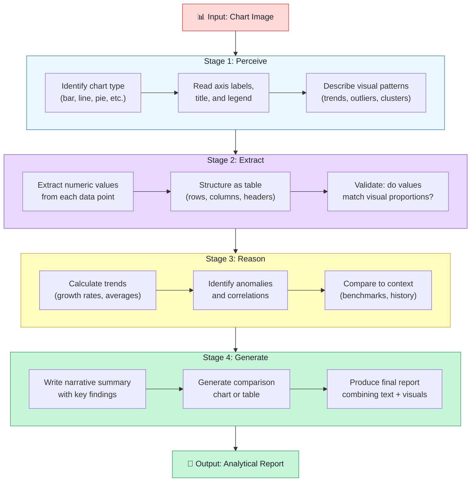

Each stage in this pipeline serves a distinct purpose:

- **Perceive** turns raw pixels into natural language descriptions. The agent identifies what kind of chart it is looking at, reads the labels, and describes the overall shape of the data.
- **Extract** converts those descriptions into structured data. Instead of "the blue bar is the tallest," the agent produces `{"Q4": 2300000, "Q3": 1800000, ...}`. This is the critical grounding step -- visual patterns become programmable values.
- **Reason** applies logic and computation to the structured data. This is where the agent calculates growth rates, identifies outliers, and draws conclusions. Crucially, this step operates on the extracted numbers, not on the raw image -- the agent has crossed from the visual modality to the analytical modality.
- **Generate** produces the final output, which may itself be multi-modal: a written summary, a reformatted table, or even a new chart for comparison.

## 8.5 Visual Question Answering with Chain-of-Thought

When an agent needs to answer a specific question about a visual input, the pipeline collapses into a focused **visual question answering (VQA)** workflow. The sequence diagram below shows how an agent handles a user asking a question about a dashboard screenshot:

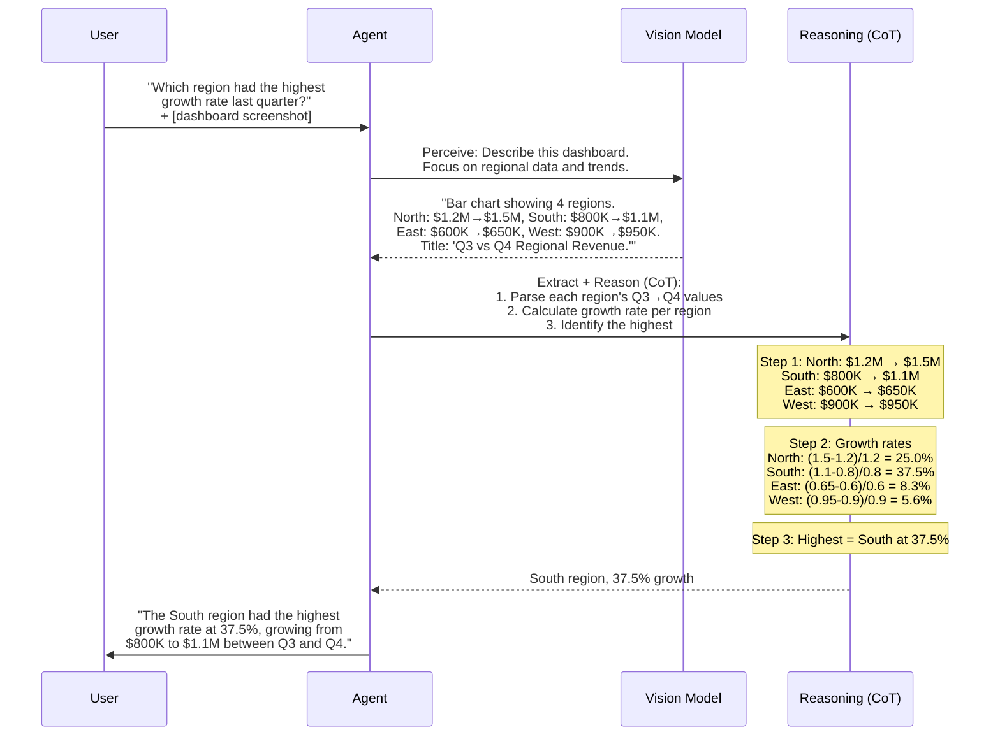

Notice the separation between **perception** (the Vision Model describing the chart) and **reasoning** (the CoT step calculating growth rates). This separation is deliberate and important. Vision models are strong at describing what they see but weak at precise arithmetic. By extracting the numbers first and then reasoning over them in a text-only chain-of-thought step, the agent plays to each modality's strengths.

This is exactly the chain-of-thought principle from Module 2 applied to a visual context: decompose the problem, externalize intermediate results, and reason step by step. The only difference is that the first step of the chain crosses a modality boundary -- from pixels to text.

## 8.5 Multi-Step Cross-Modal Workflows

Real-world cross-modal tasks often require multiple round trips between modalities. The agent might look at an image, extract data, realize it needs to look at a different part of the image more carefully, re-examine with a focused prompt, and then continue reasoning. This iterative pattern is what distinguishes true **cross-modal reasoning** from simple sequential chaining.

Consider a complex workflow where an agent analyzes a multi-page financial report:

1. **First pass (visual):** Scan all pages and identify which ones contain charts versus tables versus text.
2. **Focused extraction (visual + text):** For each chart, extract data points. For each table, parse rows and columns. For text sections, summarize key claims.
3. **Cross-reference (reasoning):** Check whether the numbers in the charts match the numbers in the tables. Flag any discrepancies.
4. **Synthesis (generation):** Write a summary that integrates findings from all sources, noting where the visual data confirms or contradicts the textual claims.

The key characteristic of this workflow is **feedback between modalities**. The reasoning step in phase 3 might discover that a chart shows different numbers than the accompanying table. This triggers a return to the visual modality -- the agent re-examines the chart with a more focused prompt to determine whether it misread a value or whether there is a genuine discrepancy in the document.

## 8.5 Building a Cross-Modal Chart Analysis Agent

Let's build a complete agent that takes a chart image, extracts data, answers questions, and generates a summary. This implementation brings together the perceive-extract-reason-generate pipeline in working code:

**cross_modal_agent.py**

```python
import anthropic
import base64
import json
from pathlib import Path


client = anthropic.Anthropic()
MODEL = "claude-sonnet-4-20250514"


def load_image_as_base64(image_path: str) -> str:
    """Load an image file and return its base64-encoded content."""
    image_bytes = Path(image_path).read_bytes()
    return base64.standard_b64encode(image_bytes).decode("utf-8")


def perceive_chart(image_b64: str, media_type: str = "image/png") -> str:
    """Stage 1: Perceive -- describe the chart in detail."""
    response = client.messages.create(
        model=MODEL,
        max_tokens=1024,
        messages=[{
            "role": "user",
            "content": [
                {
                    "type": "image",
                    "source": {
                        "type": "base64",
                        "media_type": media_type,
                        "data": image_b64,
                    },
                },
                {
                    "type": "text",
                    "text": (
                        "Describe this chart in detail. Include:\n"
                        "1. Chart type (bar, line, pie, etc.)\n"
                        "2. Title and axis labels\n"
                        "3. All data points with their exact values\n"
                        "4. Any visible trends, patterns, or outliers\n"
                        "Be precise with numbers -- read them carefully "
                        "from the axes and data labels."
                    ),
                },
            ],
        }],
    )
    return response.content[0].text


def extract_structured_data(description: str) -> dict:
    """Stage 2: Extract -- convert description to structured JSON."""
    response = client.messages.create(
        model=MODEL,
        max_tokens=1024,
        messages=[{
            "role": "user",
            "content": (
                "Given this chart description, extract the data into "
                "structured JSON. Include chart_type, title, x_axis, "
                "y_axis, and a 'data' array of objects with the "
                "relevant fields.\n\n"
                f"Description:\n{description}\n\n"
                "Respond with ONLY valid JSON, no markdown fences."
            ),
        }],
    )
    return json.loads(response.content[0].text)


def reason_about_data(
    structured_data: dict, question: str
) -> str:
    """Stage 3: Reason -- answer a question using chain-of-thought."""
    response = client.messages.create(
        model=MODEL,
        max_tokens=1024,
        messages=[{
            "role": "user",
            "content": (
                "You are given structured data extracted from a chart. "
                "Answer the question using step-by-step reasoning.\n\n"
                "Data:\n"
                f"{json.dumps(structured_data, indent=2)}\n\n"
                f"Question: {question}\n\n"
                "Think step by step:\n"
                "1. Identify which data points are relevant\n"
                "2. Perform any necessary calculations\n"
                "3. State your conclusion with supporting numbers"
            ),
        }],
    )
    return response.content[0].text


def generate_summary(
    description: str, structured_data: dict, qa_pairs: list[dict]
) -> str:
    """Stage 4: Generate -- produce an analytical report."""
    qa_text = "\n".join(
        f"Q: {qa['question']}\nA: {qa['answer']}"
        for qa in qa_pairs
    )

    response = client.messages.create(
        model=MODEL,
        max_tokens=2048,
        messages=[{
            "role": "user",
            "content": (
                "Write a concise analytical summary of this chart. "
                "Integrate the visual description, extracted data, "
                "and Q&A findings into a coherent report.\n\n"
                f"Visual description:\n{description}\n\n"
                f"Extracted data:\n"
                f"{json.dumps(structured_data, indent=2)}\n\n"
                f"Analysis Q&A:\n{qa_text}\n\n"
                "Format the summary with:\n"
                "- A one-sentence overview\n"
                "- Key findings (bulleted)\n"
                "- Notable trends or concerns\n"
                "- Recommended next steps"
            ),
        }],
    )
    return response.content[0].text


# --- Run the full cross-modal pipeline ---

def analyze_chart(image_path: str, questions: list[str]) -> str:
    """End-to-end cross-modal chart analysis."""
    print("Stage 1: Perceiving chart...")
    image_b64 = load_image_as_base64(image_path)
    description = perceive_chart(image_b64)
    print(f"  Perceived: {description[:120]}...")

    print("Stage 2: Extracting structured data...")
    structured_data = extract_structured_data(description)
    print(f"  Extracted {len(structured_data.get('data', []))} "
          f"data points")

    print("Stage 3: Reasoning about data...")
    qa_pairs = []
    for question in questions:
        answer = reason_about_data(structured_data, question)
        qa_pairs.append({"question": question, "answer": answer})
        print(f"  Q: {question}")
        print(f"  A: {answer[:100]}...")

    print("Stage 4: Generating summary report...")
    summary = generate_summary(description, structured_data, qa_pairs)

    return summary


# Example usage
if __name__ == "__main__":
    report = analyze_chart(
        image_path="quarterly_revenue.png",
        questions=[
            "Which quarter had the highest revenue?",
            "What is the quarter-over-quarter growth rate?",
            "Are there any quarters with declining revenue?",
        ],
    )
    print("\n=== FINAL REPORT ===\n")
    print(report)
```

There are several design decisions worth highlighting in this code:

**Separation of stages.** Each function handles exactly one stage of the pipeline. The `perceive_chart` function only describes what it sees -- it does not try to calculate growth rates. The `reason_about_data` function only works with structured data -- it never sees the original image. This separation ensures that each stage can be tested, debugged, and improved independently.

**Grounding through extraction.** The `extract_structured_data` function is the grounding step. It converts free-text descriptions like "the Q4 bar reaches approximately $2.3 million" into `{"quarter": "Q4", "revenue": 2300000}`. Once the data is in structured form, the reasoning stage can perform exact arithmetic rather than relying on the vision model's approximate number reading.

**Chain-of-thought in the reasoning stage.** The `reason_about_data` function explicitly prompts for step-by-step reasoning, applying the CoT techniques from Module 2. This is critical for multi-step calculations like growth rates, where a single-step answer is prone to errors.

## 8.5 Validation: Closing the Loop

One of the most powerful aspects of cross-modal reasoning is the ability to **validate** extracted data by crossing back into the visual modality. If the agent extracts a value of $2.3M for Q4 revenue, it can re-examine the chart with a focused prompt: "Look at the Q4 bar specifically. Does it reach the $2.3M gridline?" This cross-modal validation catches extraction errors that would otherwise propagate through the entire pipeline.

**validation.py**

```python
def validate_extraction(
    image_b64: str,
    structured_data: dict,
    media_type: str = "image/png",
) -> dict:
    """Cross-modal validation: verify extracted values
    against the original image."""
    response = client.messages.create(
        model=MODEL,
        max_tokens=1024,
        messages=[{
            "role": "user",
            "content": [
                {
                    "type": "image",
                    "source": {
                        "type": "base64",
                        "media_type": media_type,
                        "data": image_b64,
                    },
                },
                {
                    "type": "text",
                    "text": (
                        "I extracted the following data from this "
                        "chart. Please verify each value by looking "
                        "at the chart carefully.\n\n"
                        f"{json.dumps(structured_data, indent=2)}\n\n"
                        "For each data point, respond with:\n"
                        '- "correct" if the value matches the chart\n'
                        '- "incorrect: [actual value]" if it does '
                        "not match\n\n"
                        "Return your findings as a JSON object with "
                        "the same keys and your verification result "
                        "for each."
                    ),
                },
            ],
        }],
    )
    return json.loads(response.content[0].text)
```

This validation step transforms the pipeline from a one-way chain into a **feedback loop**. When validation catches an error, the agent can re-extract with a corrected prompt, improving the accuracy of the final output. This iterative refinement is a hallmark of robust cross-modal systems.

## 8.5 When Cross-Modal Reasoning Breaks Down

Cross-modal reasoning is powerful but not infallible. Understanding its failure modes helps you build more robust agents:

- **Perception errors compound.** If the vision model misreads "1.8M" as "1.3M" in the perception stage, every downstream calculation will be wrong. The validation step described above mitigates this, but does not eliminate it entirely.
- **Ambiguous visuals resist grounding.** Low-resolution charts, overlapping labels, and 3D effects make precise value extraction unreliable. When the agent encounters ambiguous visuals, it should express uncertainty rather than guess.
- **Context limits constrain complex documents.** A multi-page report with dozens of charts may exceed the model's context window when all descriptions and extracted data are combined. Prioritizing which charts to analyze deeply is itself a reasoning task.
- **Hallucinated precision.** The agent may report a value as "$2,347,521" when the chart only shows resolution to the nearest $100K. Training the agent to report values at the appropriate precision level is important for trustworthiness.

> **Practical tip:** Always include confidence indicators in your cross-modal pipeline. If the perception stage is uncertain about a value ("the bar appears to be between $1.7M and $1.9M"), that uncertainty should propagate through the extraction and reasoning stages rather than being silently resolved into a false-precision number.

## 8.5 Summary

**Cross-modal reasoning** is the ability to combine information from multiple modalities within a single reasoning chain, using insights from one modality to guide extraction or reasoning in another. It is built on the concept of **grounding** -- anchoring visual or auditory elements to their semantic meaning by linking perception to structured data.

The cross-modal pipeline follows four stages: **perceive** (describe what the agent sees), **extract** (convert descriptions to structured data), **reason** (apply chain-of-thought logic to the structured data), and **generate** (produce a final output that may span multiple modalities). This pipeline directly applies the chain-of-thought reasoning principles from Module 2, with the added dimension of crossing modality boundaries between steps.

The key design principle is **separation of perception from reasoning**. Vision models excel at describing what they see but struggle with precise arithmetic. By extracting structured data as an intermediate step, the agent can apply exact computation to values that were originally encoded as pixels. Validation steps that cross back into the visual modality create feedback loops that catch extraction errors before they propagate.

In the next lesson, we will explore **Multi-Modal Tool Use** -- how agents interact with screens, browsers, cameras, and file systems to gather multi-modal inputs and produce multi-modal outputs in real-world environments.

---

    Section 8.6: Multi-Modal Tool Use


## 8.6 Overview

In previous lessons, you explored how agents perceive images, process audio, generate visual content, and reason across modalities. But those capabilities are only as useful as the **tools** that connect them to the real world. An agent that can analyze images is powerful -- an agent that can *capture its own screenshots*, *drive a browser*, *read a camera feed*, and *process arbitrary file types* is transformative.

**Multi-modal tool use** is the practice of equipping agents with tools that capture, transform, and interact with non-text data. Instead of waiting for a user to upload an image, the agent takes a screenshot itself. Instead of asking for a URL's content, the agent launches a browser and navigates to the page. Instead of requiring pre-processed data, the agent detects a file's type and routes it to the right handler.

This lesson covers the architecture of multi-modal tool ecosystems, walks through screen capture, browser automation, camera input, and file-type-aware processing, and introduces Claude's computer use capabilities. By the end, you will have a working pattern for building agents that can see and interact with their digital environment autonomously.

## 8.6 The Multi-Modal Tool Ecosystem

A multi-modal agent does not rely on a single tool. It draws from an ecosystem of specialized tools, each handling a different modality or interaction pattern. The agent's reasoning layer decides which tool to invoke based on the task at hand.

```mermaid
graph TD
    subgraph Agent["Multi-Modal Agent"]
        LLM["LLM Reasoning Engine<br/>Decides which tool to use"]
    end

    subgraph ScreenTools["Screen & Display"]
        SC["Screenshot Capture<br/>Grab screen or window"]
        CU["Computer Use<br/>Mouse, keyboard, observe"]
    end

    subgraph BrowserTools["Browser Automation"]
        PW["Playwright / Puppeteer<br/>Navigate, click, extract"]
        WS["Web Scraper<br/>Structured data extraction"]
    end

    subgraph CameraTools["Camera & Vision"]
        WC["Webcam Capture<br/>Live camera frames"]
        VF["Video Frames<br/>Extract frames from video"]
    end

    subgraph FileTools["File Processing"]
        PDF["PDF Extractor<br/>Text, tables, images"]
        IMG["Image Analyzer<br/>OCR, classification"]
        XLS["Spreadsheet Parser<br/>Rows, charts, formulas"]
        DOC["Document Converter<br/>Format transformation"]
    end

    LLM --> SC
    LLM --> CU
    LLM --> PW
    LLM --> WS
    LLM --> WC
    LLM --> VF
    LLM --> PDF
    LLM --> IMG
    LLM --> XLS
    LLM --> DOC

    style Agent fill:#ebf8ff,stroke:#3182ce,stroke-width:2px
    style ScreenTools fill:#c6f6d5,stroke:#38a169,stroke-width:1px
    style BrowserTools fill:#fefcbf,stroke:#d69e2e,stroke-width:1px
    style CameraTools fill:#fed7e2,stroke:#d53f8c,stroke-width:1px
    style FileTools fill:#e9d8fd,stroke:#805ad5,stroke-width:1px
    style LLM fill:#e0f0ff,stroke:#3182ce,stroke-width:2px
```

The key insight is that each tool category serves a different purpose:

- **Screen and display tools** let the agent see what is on a computer screen, enabling it to interact with any GUI application
- **Browser automation tools** give the agent programmatic control over web pages, going beyond what a screenshot reveals
- **Camera and vision tools** connect the agent to the physical world through live or recorded video
- **File processing tools** let the agent handle arbitrary file types intelligently, extracting structured data from PDFs, images, spreadsheets, and more

## 8.6 Screen Capture Tools

The simplest and most immediately useful multi-modal tool is **screen capture**. By taking a screenshot and sending it to a vision-capable LLM, an agent can understand what is displayed on a screen without needing API access to the underlying application.

Screen capture tools typically work in three steps:

1. **Capture** -- take a screenshot of the full screen, a specific window, or a defined region
2. **Encode** -- convert the image to a format the LLM can consume (base64-encoded PNG or JPEG)
3. **Analyze** -- send the encoded image to the LLM as an image content block alongside a text prompt

**screenshot_tool.py**

```python
import anthropic
import base64
import subprocess
import platform


def capture_screenshot(region: str = "full") -> dict:
    """Capture a screenshot and return it as base64-encoded PNG.
    
    Args:
        region: 'full' for entire screen, or 'x,y,width,height' for a region
    """
    filepath = "/tmp/screenshot.png"
    
    system = platform.system()
    if system == "Darwin":  # macOS
        if region == "full":
            subprocess.run(["screencapture", "-x", filepath], check=True)
        else:
            # screencapture -R x,y,w,h for region capture
            subprocess.run(["screencapture", "-x", "-R", region, filepath], check=True)
    elif system == "Linux":
        if region == "full":
            subprocess.run(["scrot", filepath], check=True)
        else:
            subprocess.run(["scrot", "-a", region, filepath], check=True)
    
    with open(filepath, "rb") as f:
        image_data = base64.standard_b64encode(f.read()).decode("utf-8")
    
    return {"image_base64": image_data, "media_type": "image/png"}


def analyze_screenshot(question: str, region: str = "full") -> str:
    """Take a screenshot and ask the LLM a question about it."""
    client = anthropic.Anthropic()
    
    # Step 1: Capture the screen
    screenshot = capture_screenshot(region)
    
    # Step 2: Send to Claude with the question
    response = client.messages.create(
        model="claude-sonnet-4-6",
        max_tokens=1024,
        messages=[{
            "role": "user",
            "content": [
                {
                    "type": "image",
                    "source": {
                        "type": "base64",
                        "media_type": screenshot["media_type"],
                        "data": screenshot["image_base64"],
                    },
                },
                {
                    "type": "text",
                    "text": question,
                },
            ],
        }],
    )
    
    return response.content[0].text


# Example: analyze what's on screen
result = analyze_screenshot("What application is currently in the foreground? Describe what you see.")
print(result)
```

This pattern is deceptively powerful. With just a screenshot tool and a vision-capable LLM, an agent can:

- **Monitor dashboards** -- periodically screenshot a Grafana or Datadog dashboard and summarize the current state
- **Verify deployments** -- capture the deployed web page and confirm it matches expectations
- **Read error dialogs** -- identify and describe error messages from any GUI application
- **Extract data from legacy systems** -- read information from applications that have no API

## 8.6 Browser Automation with Playwright

Screenshots show you what a page looks like, but **browser automation** lets the agent *interact* with it. **Playwright** is the most widely used library for programmatic browser control, and it pairs naturally with LLM agents.

The following sequence shows how an agent uses Playwright to navigate to a page, take a screenshot for analysis, and then decide what to click next.

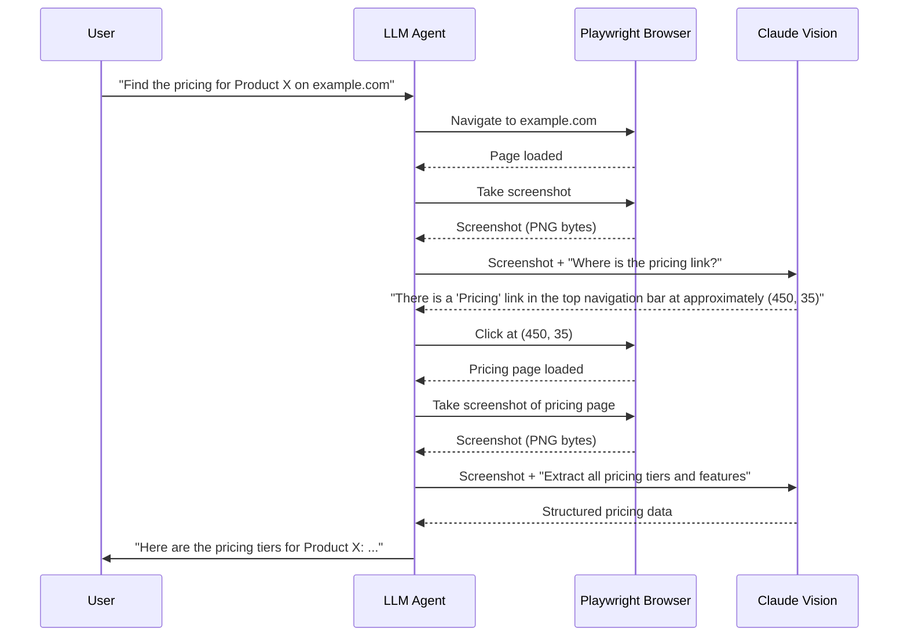

The Playwright tool integrates into the agent's tool ecosystem as a set of actions the LLM can invoke:

**browser_tool.py**

```python
import asyncio
from playwright.async_api import async_playwright
import anthropic
import base64


class BrowserTool:
    """A browser automation tool that an LLM agent can drive."""
    
    def __init__(self):
        self.browser = None
        self.page = None
    
    async def start(self, headless: bool = True):
        """Launch the browser."""
        self.playwright = await async_playwright().start()
        self.browser = await self.playwright.chromium.launch(headless=headless)
        self.page = await self.browser.new_page(viewport={"width": 1280, "height": 720})
    
    async def navigate(self, url: str) -> dict:
        """Navigate to a URL and return page info."""
        response = await self.page.goto(url, wait_until="networkidle")
        return {
            "status": response.status if response else None,
            "url": self.page.url,
            "title": await self.page.title(),
        }
    
    async def screenshot(self) -> dict:
        """Take a screenshot of the current page."""
        png_bytes = await self.page.screenshot(full_page=False)
        return {
            "image_base64": base64.standard_b64encode(png_bytes).decode("utf-8"),
            "media_type": "image/png",
            "url": self.page.url,
        }
    
    async def click(self, x: int, y: int) -> dict:
        """Click at specific coordinates on the page."""
        await self.page.mouse.click(x, y)
        await self.page.wait_for_load_state("networkidle")
        return {"clicked": True, "x": x, "y": y, "url_after": self.page.url}
    
    async def type_text(self, selector: str, text: str) -> dict:
        """Type text into a form field identified by CSS selector."""
        await self.page.fill(selector, text)
        return {"typed": True, "selector": selector, "text": text}
    
    async def get_text(self) -> dict:
        """Extract all visible text from the current page."""
        text = await self.page.inner_text("body")
        return {"text": text[:5000], "truncated": len(text) > 5000}
    
    async def close(self):
        """Shut down the browser."""
        if self.browser:
            await self.browser.close()
        if self.playwright:
            await self.playwright.stop()
```

The agent uses the browser tool in its loop just like any other tool: the LLM reasons about what action to take, emits a `tool_use` block (e.g., `navigate`, `click`, `screenshot`), and your code dispatches it to the `BrowserTool` instance. The screenshot capability is especially important because it lets the LLM *see* what the page looks like after each interaction and decide what to do next.

## 8.6 Camera and Webcam Input

For agents that operate in the physical world -- monitoring a physical space, reading handwritten notes, or inspecting physical objects -- **camera input** bridges the gap between digital reasoning and physical perception.

The pattern mirrors screen capture: capture a frame, encode it, send it to the LLM. The difference is the source.

**camera_tool.py**

```python
import cv2
import base64
import anthropic


def capture_webcam_frame(camera_index: int = 0) -> dict:
    """Capture a single frame from the webcam."""
    cap = cv2.VideoCapture(camera_index)
    
    if not cap.isOpened():
        return {"error": "Could not open camera"}
    
    ret, frame = cap.read()
    cap.release()
    
    if not ret:
        return {"error": "Could not capture frame"}
    
    # Encode frame as JPEG for efficient transmission
    _, buffer = cv2.imencode(".jpg", frame, [cv2.IMWRITE_JPEG_QUALITY, 85])
    image_base64 = base64.standard_b64encode(buffer).decode("utf-8")
    
    return {
        "image_base64": image_base64,
        "media_type": "image/jpeg",
        "width": frame.shape[1],
        "height": frame.shape[0],
    }


def analyze_camera_view(question: str) -> str:
    """Capture a webcam frame and ask the LLM about it."""
    client = anthropic.Anthropic()
    frame = capture_webcam_frame()
    
    if "error" in frame:
        return f"Camera error: {frame['error']}"
    
    response = client.messages.create(
        model="claude-sonnet-4-6",
        max_tokens=1024,
        messages=[{
            "role": "user",
            "content": [
                {
                    "type": "image",
                    "source": {
                        "type": "base64",
                        "media_type": frame["media_type"],
                        "data": frame["image_base64"],
                    },
                },
                {"type": "text", "text": question},
            ],
        }],
    )
    
    return response.content[0].text
```

Camera tools are particularly valuable for **inventory monitoring** (point a camera at shelves and ask "which items are running low?"), **security** (analyze camera feeds for anomalies), and **accessibility** (describe the physical environment for a visually impaired user).

## 8.6 File-Type-Aware Processing

Real-world agents receive files in many formats: PDFs, images, spreadsheets, CSVs, Word documents, and more. A naive agent would try to send every file directly to the LLM. A well-designed agent uses **file-type-aware processing** -- detecting the file type and routing it to a specialized handler that extracts structured data before sending it to the LLM.

**file_processor.py**

```python
import mimetypes
import base64
import fitz  # PyMuPDF for PDF processing
import openpyxl  # For Excel files
from pathlib import Path


class FileProcessor:
    """Route files to specialized handlers based on MIME type."""
    
    def process(self, file_path: str) -> dict:
        """Detect file type and extract content appropriately."""
        mime_type, _ = mimetypes.guess_type(file_path)
        path = Path(file_path)
        
        handlers = {
            "application/pdf": self._process_pdf,
            "image/png": self._process_image,
            "image/jpeg": self._process_image,
            "application/vnd.openxmlformats-officedocument.spreadsheetml.sheet": self._process_excel,
            "text/csv": self._process_text,
            "text/plain": self._process_text,
        }
        
        handler = handlers.get(mime_type)
        if handler is None:
            return {"error": f"Unsupported file type: {mime_type}", "filename": path.name}
        
        return handler(file_path, mime_type)
    
    def _process_pdf(self, file_path: str, mime_type: str) -> dict:
        """Extract text and images from a PDF."""
        doc = fitz.open(file_path)
        pages = []
        images = []
        
        for page_num, page in enumerate(doc):
            pages.append({
                "page": page_num + 1,
                "text": page.get_text(),
            })
            # Extract embedded images
            for img_index, img in enumerate(page.get_images(full=True)):
                xref = img[0]
                pix = fitz.Pixmap(doc, xref)
                if pix.n >= 5:  # CMYK -- convert to RGB
                    pix = fitz.Pixmap(fitz.csRGB, pix)
                img_bytes = pix.tobytes("png")
                images.append({
                    "page": page_num + 1,
                    "image_base64": base64.standard_b64encode(img_bytes).decode("utf-8"),
                    "media_type": "image/png",
                })
        
        return {"type": "pdf", "pages": pages, "images": images[:5]}  # Limit images
    
    def _process_image(self, file_path: str, mime_type: str) -> dict:
        """Encode an image for LLM analysis."""
        with open(file_path, "rb") as f:
            image_data = base64.standard_b64encode(f.read()).decode("utf-8")
        return {"type": "image", "image_base64": image_data, "media_type": mime_type}
    
    def _process_excel(self, file_path: str, mime_type: str) -> dict:
        """Extract data from an Excel spreadsheet."""
        wb = openpyxl.load_workbook(file_path, data_only=True)
        sheets = {}
        for sheet_name in wb.sheetnames:
            ws = wb[sheet_name]
            rows = []
            for row in ws.iter_rows(values_only=True):
                rows.append([str(cell) if cell is not None else "" for cell in row])
            sheets[sheet_name] = rows[:100]  # Limit rows
        return {"type": "spreadsheet", "sheets": sheets}
    
    def _process_text(self, file_path: str, mime_type: str) -> dict:
        """Read plain text or CSV files."""
        with open(file_path, "r", encoding="utf-8") as f:
            content = f.read(50000)  # Limit to 50KB
        return {"type": "text", "content": content}
```

The `FileProcessor` class acts as a **router**: it inspects the MIME type and delegates to the right handler. This keeps each handler simple and focused while giving the agent the ability to work with diverse file types. When the agent encounters a PDF, it gets structured text and extracted images. When it encounters a spreadsheet, it gets rows of data. The LLM never sees raw binary -- it always receives clean, structured input.

## 8.6 Claude's Computer Use Capabilities

Everything we have discussed so far -- screen capture, browser automation, file processing -- can be unified under a single, powerful abstraction: **computer use**. Claude's computer use feature lets the agent control a full desktop environment by taking screenshots, moving the mouse, clicking, typing, and observing the results.

Computer use works through three built-in tool types:

- **computer** -- take screenshots, move the mouse, click, type, and scroll
- **text_editor** -- view, create, and edit text files
- **bash** -- execute shell commands

The agent operates in a loop: it takes a screenshot to see the current state of the screen, reasons about what action to take, executes that action (click, type, run a command), and then takes another screenshot to see the result. This is the same perception-reasoning-action loop from Module 1, but operating at the level of a full graphical desktop.

**computer_use_agent.py**

```python
import anthropic

client = anthropic.Anthropic()

# Define computer use tools -- Claude knows how to use these natively
tools = [
    {
        "type": "computer_20250124",
        "name": "computer",
        "display_width_px": 1024,
        "display_height_px": 768,
        "display_number": 1,
    },
    {
        "type": "bash_20250124",
        "name": "bash",
    },
    {
        "type": "text_editor_20250124",
        "name": "str_replace_editor",
    },
]

# Start the agent loop
messages = [
    {
        "role": "user",
        "content": "Open Firefox, go to example.com, and tell me the main heading on the page.",
    }
]

while True:
    response = client.messages.create(
        model="claude-sonnet-4-6",
        max_tokens=4096,
        tools=tools,
        messages=messages,
        betas=["computer-use-2025-01-24"],
    )
    
    if response.stop_reason == "end_turn":
        # Agent is done -- extract final text
        for block in response.content:
            if hasattr(block, "text"):
                print(block.text)
        break
    
    # Process tool calls (screenshot, click, type, bash, etc.)
    messages.append({"role": "assistant", "content": response.content})
    
    tool_results = []
    for block in response.content:
        if block.type == "tool_use":
            # In production, dispatch to actual computer control
            # (Docker container, VM, or local desktop)
            result = execute_computer_action(block.name, block.input)
            tool_results.append({
                "type": "tool_result",
                "tool_use_id": block.id,
                "content": result,
            })
    
    messages.append({"role": "user", "content": tool_results})
```

Computer use is the most general form of multi-modal tool use. Rather than building specialized tools for every application, the agent interacts with applications the same way a human does -- by looking at the screen, moving the mouse, and typing. This makes it possible to automate tasks in applications that have no API at all.

> Computer use is a deep topic with its own patterns for safety, sandboxing, and reliability. Module 12, Lesson 01 (*Computer Use Agents*) covers it in detail, including how to set up sandboxed environments, handle multi-step GUI workflows, and build production-grade computer use systems.

## 8.6 Putting It All Together: A Multi-Modal Tool Agent

The real power emerges when you combine multiple tool types into a single agent. Here is a practical example: an agent that can take screenshots, process files, and browse the web, choosing the right tool based on the user's request.

**multi_modal_agent.py**

```python
import anthropic
import json

client = anthropic.Anthropic()

# --- Tool definitions for the multi-modal agent ---

multi_modal_tools = [
    {
        "name": "take_screenshot",
        "description": (
            "Capture a screenshot of the current screen. Use this when you need "
            "to see what is displayed on the user's desktop, check a running "
            "application, or verify a visual state."
        ),
        "input_schema": {
            "type": "object",
            "properties": {
                "region": {
                    "type": "string",
                    "description": "'full' for entire screen, or 'x,y,width,height' for a region",
                },
            },
            "required": [],
        },
    },
    {
        "name": "browse_url",
        "description": (
            "Navigate to a URL in a headless browser and return a screenshot "
            "of the rendered page along with its text content. Use this for "
            "inspecting websites, reading articles, or checking web applications."
        ),
        "input_schema": {
            "type": "object",
            "properties": {
                "url": {"type": "string", "description": "The URL to navigate to"},
            },
            "required": ["url"],
        },
    },
    {
        "name": "process_file",
        "description": (
            "Process a file and extract its contents. Supports PDF, images "
            "(PNG/JPEG), Excel spreadsheets, CSV, and plain text files. "
            "Automatically detects the file type and uses the appropriate handler."
        ),
        "input_schema": {
            "type": "object",
            "properties": {
                "file_path": {"type": "string", "description": "Path to the file"},
            },
            "required": ["file_path"],
        },
    },
    {
        "name": "capture_webcam",
        "description": (
            "Capture a single frame from the webcam. Use this when you need "
            "to see the physical environment, read handwritten text, or "
            "identify objects in front of the camera."
        ),
        "input_schema": {
            "type": "object",
            "properties": {
                "camera_index": {
                    "type": "integer",
                    "description": "Camera device index (default: 0)",
                },
            },
            "required": [],
        },
    },
]


def run_multi_modal_agent(user_message: str) -> str:
    """Run an agent that can see screens, browse the web, and process files."""
    messages = [{"role": "user", "content": user_message}]
    
    system_prompt = (
        "You are a multi-modal assistant with access to screen capture, browser, "
        "file processing, and camera tools. Choose the right tool for each task. "
        "When analyzing visual content, describe what you see in detail. "
        "When processing files, summarize the key information extracted."
    )
    
    while True:
        response = client.messages.create(
            model="claude-sonnet-4-6",
            max_tokens=2048,
            system=system_prompt,
            tools=multi_modal_tools,
            messages=messages,
        )
        
        if response.stop_reason == "end_turn":
            return "".join(
                block.text for block in response.content if block.type == "text"
            )
        
        messages.append({"role": "assistant", "content": response.content})
        
        tool_results = []
        for block in response.content:
            if block.type == "tool_use":
                # Dispatch to the appropriate tool implementation
                result = dispatch_tool(block.name, block.input)
                tool_results.append({
                    "type": "tool_result",
                    "tool_use_id": block.id,
                    "content": json.dumps(result) if isinstance(result, dict) else result,
                })
        
        messages.append({"role": "user", "content": tool_results})


def dispatch_tool(name: str, inputs: dict) -> dict:
    """Route tool calls to their implementations."""
    if name == "take_screenshot":
        return capture_screenshot(inputs.get("region", "full"))
    elif name == "browse_url":
        # Would use BrowserTool.navigate() + BrowserTool.screenshot()
        return browse_and_capture(inputs["url"])
    elif name == "process_file":
        processor = FileProcessor()
        return processor.process(inputs["file_path"])
    elif name == "capture_webcam":
        return capture_webcam_frame(inputs.get("camera_index", 0))
    else:
        return {"error": f"Unknown tool: {name}"}


# Usage
result = run_multi_modal_agent(
    "Take a screenshot of my screen and tell me what applications are open. "
    "Then browse to https://status.example.com and check if all services are healthy."
)
print(result)
```

This agent seamlessly combines screen capture and browser automation in a single conversation. The LLM decides the order of operations: first it takes a screenshot to answer the question about open applications, then it browses to the status page to check service health. Each tool returns data in the format the LLM needs -- images as base64, text as strings, structured data as JSON.

## 8.6 Design Considerations

Building reliable multi-modal tool agents requires attention to several practical concerns:

- **Image size management** -- high-resolution screenshots can be several megabytes. Resize or compress images before sending them to the LLM to stay within token limits and reduce latency. A 1280x720 screenshot is typically sufficient for analysis.

- **Sandboxing** -- browser automation and computer use should run in isolated environments (Docker containers or VMs) to prevent the agent from accidentally modifying your actual system. Never give an agent unsandboxed access to a production desktop.

- **Error handling** -- cameras disconnect, browsers time out, files are corrupted. Every tool should return structured error information that the LLM can reason about, rather than crashing the agent loop.

- **Privacy and security** -- screenshots may capture sensitive information (passwords, private messages, financial data). Log tool inputs and outputs carefully, and consider masking or filtering sensitive regions before sending screenshots to the LLM.

- **Cost awareness** -- image inputs consume significantly more tokens than text. A single screenshot can cost 1,000+ tokens. Agents that take frequent screenshots should be designed with token budgets in mind.

## 8.6 Summary

Multi-modal tool use transforms agents from passive text processors into active participants in their digital environment. By equipping an agent with **screen capture tools**, it can observe any application's interface. With **browser automation** through Playwright, it can navigate, interact with, and extract data from web pages. **Camera input** extends perception into the physical world. **File-type-aware processing** lets the agent handle PDFs, images, spreadsheets, and documents intelligently by routing each file type to a specialized handler.

Claude's **computer use** capability unifies these patterns under a single abstraction -- the agent controls a full desktop through screenshots, mouse, and keyboard, just as a human would. This is the most general form of multi-modal tool use, and we will explore it in depth in Module 12, Lesson 01.

The common thread across all of these tools is the same agent loop you learned in Module 3: the LLM reasons about what to do, emits a `tool_use` block, your code executes the action and returns a `tool_result`, and the cycle continues. The only difference is that the tools now operate on images, browsers, cameras, and files instead of text and APIs.

In the next lesson, you will put these concepts into practice in the **Multi-Modal Lab**, building an end-to-end agent that analyzes images, generates reports, and narrates its findings with speech.

---

    Section 8.7: Multi-Modal Lab


## 8.7 Overview

Throughout Module 8, you explored every dimension of multi-modal agents: why they matter, how vision-language models interpret images, how audio and speech pipelines work, how to generate images and video, how cross-modal reasoning connects modalities together, and how multi-modal tool use ties everything into practical agent workflows. Now it is time to build something real.

In this capstone lab, you will build an **image analysis report agent** -- an agent that accepts an image, analyzes it with Claude's vision capabilities, extracts structured data from what it sees, generates a formatted report of its findings, and optionally narrates that report using text-to-speech. This is the kind of pipeline that production multi-modal agents run every day: insurance claims processing, medical image triage, quality control on manufacturing lines, accessibility narration for visually impaired users.

By the end of this lab, you will have a working system that demonstrates every concept from this module in a single cohesive pipeline. You will also see exactly where a single multi-modal agent hits its limits -- which sets the stage for Module 9, where multiple specialized agents collaborate to handle tasks no single agent can manage alone.

## 8.7 What We Are Building

The agent takes an image file path (or a base64-encoded image), runs it through a multi-stage pipeline, and produces both a written report and an optional audio narration. Here is the complete architecture:

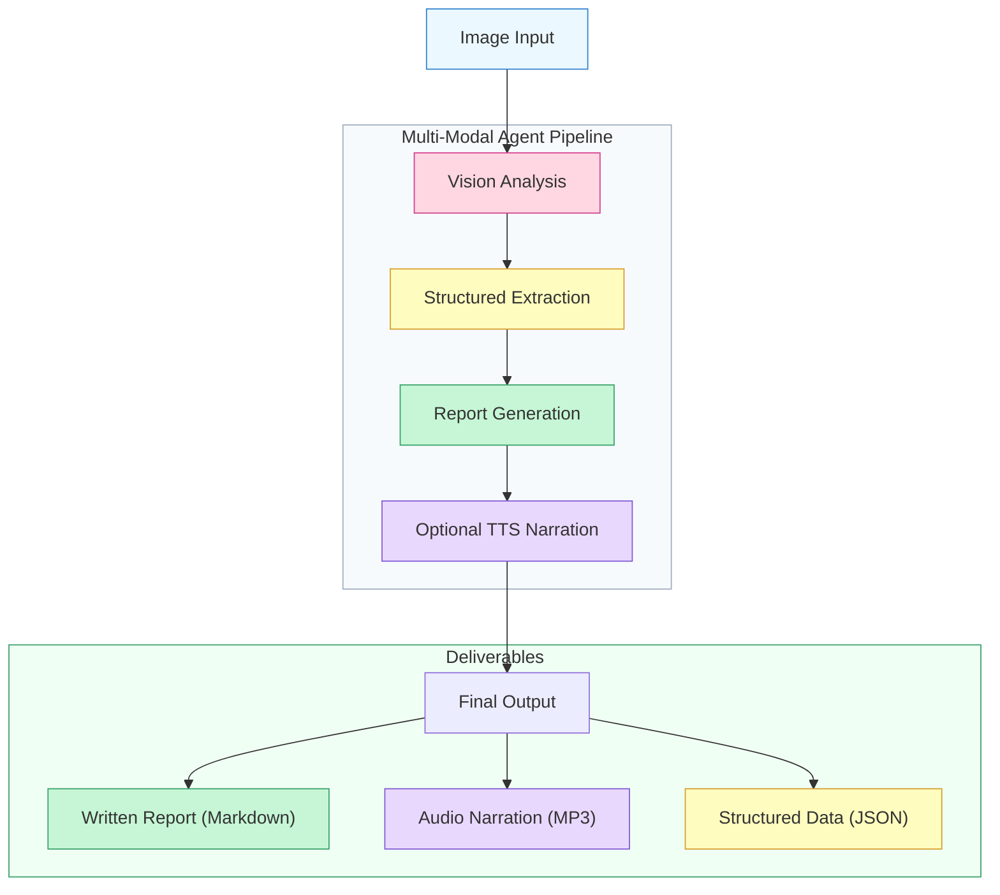

Each stage builds on the previous one. The vision analysis produces a natural language description. The structured extraction converts that description into typed data. The report generator synthesizes both into a polished document. The TTS stage narrates the report for accessibility or convenience. This is a **sequential pipeline** -- each stage needs the output of the previous stage to proceed.

## 8.7 Stage 1: Image Analysis with Claude Vision

The first stage sends an image to Claude's vision API and asks for a detailed analysis. This is the foundation that everything else builds on. If the vision analysis misses something, no downstream stage can recover it.

**stage1_vision.py**

```python
import anthropic
import base64
import json
from pathlib import Path

client = anthropic.Anthropic()
MODEL = "claude-sonnet-4-6"


def load_image(image_path: str) -> tuple[str, str]:
    """Load an image file and return base64 data with media type.

    Supports JPEG, PNG, GIF, and WebP -- the formats Claude's
    vision API accepts.
    """
    path = Path(image_path)
    suffix = path.suffix.lower()

    media_types = {
        ".jpg": "image/jpeg",
        ".jpeg": "image/jpeg",
        ".png": "image/png",
        ".gif": "image/gif",
        ".webp": "image/webp",
    }

    if suffix not in media_types:
        raise ValueError(
            f"Unsupported image format: {suffix}. "
            f"Supported: {list(media_types.keys())}"
        )

    media_type = media_types[suffix]
    image_data = base64.standard_b64encode(
        path.read_bytes()
    ).decode("utf-8")

    return image_data, media_type


def analyze_image(image_path: str) -> str:
    """Stage 1: Send an image to Claude and get a detailed
    visual analysis.

    Returns a natural language description covering:
    - What the image shows (objects, people, text, scenes)
    - Notable details (colors, layout, condition, context)
    - Any text visible in the image (OCR)
    - Overall assessment and key observations
    """
    image_data, media_type = load_image(image_path)

    response = client.messages.create(
        model=MODEL,
        max_tokens=2048,
        messages=[
            {
                "role": "user",
                "content": [
                    {
                        "type": "image",
                        "source": {
                            "type": "base64",
                            "media_type": media_type,
                            "data": image_data,
                        },
                    },
                    {
                        "type": "text",
                        "text": (
                            "Analyze this image in detail. Describe:\n"
                            "1. What the image shows (main subjects, "
                            "objects, scene)\n"
                            "2. Notable visual details (colors, layout, "
                            "condition, spatial relationships)\n"
                            "3. Any text visible in the image "
                            "(read it verbatim)\n"
                            "4. Context clues (setting, time of day, "
                            "purpose)\n"
                            "5. Key observations or anomalies\n\n"
                            "Be thorough but factual. Describe only "
                            "what you can actually see -- do not "
                            "speculate beyond the visual evidence."
                        ),
                    },
                ],
            }
        ],
    )

    return response.content[0].text
```

A few design choices worth calling out:

- **The prompt asks for structured categories.** Rather than saying "describe this image," we request five specific types of information. This mirrors lesson 02's principle: vision-language models produce better output when the prompt defines the expected structure.
- **The factuality constraint** ("describe only what you can actually see") reduces hallucination. Vision models sometimes infer things that are not actually visible. Grounding the analysis in observable evidence produces more reliable downstream data.
- **We return raw text, not JSON.** At this stage, we want the richest possible description. Forcing JSON output here would limit the model's ability to describe nuances. We will extract structure in Stage 2.

## 8.7 Stage 2: Structured Data Extraction

Raw descriptions are useful for humans, but agents need structured data to reason over. This stage takes the natural language analysis from Stage 1 and extracts typed, validated fields. This is the **cross-modal reasoning** pattern from lesson 05: converting one modality (visual description) into another (structured data).

**stage2_extraction.py**

```python
from dataclasses import dataclass, field, asdict


@dataclass
class ImageFindings:
    """Structured representation of image analysis results."""
    category: str              # e.g., "document", "scene", "product"
    primary_subject: str       # Main thing in the image
    detected_objects: list[str] = field(default_factory=list)
    detected_text: list[str] = field(default_factory=list)
    colors: list[str] = field(default_factory=list)
    condition: str = ""        # e.g., "good", "damaged", "unclear"
    confidence: str = "medium" # "high", "medium", "low"
    key_observations: list[str] = field(default_factory=list)
    raw_analysis: str = ""     # Original Stage 1 output


def extract_structured_data(analysis_text: str) -> ImageFindings:
    """Stage 2: Extract structured data from the vision analysis.

    Uses Claude to parse the natural language description into
    typed fields. This is more reliable than regex or keyword
    matching because the model understands context.
    """
    extraction_prompt = f"""You are a data extraction system.
Given the following image analysis, extract structured data.

IMAGE ANALYSIS:
{analysis_text}

Return a JSON object with exactly these fields:
{{
    "category": "one of: document, photograph, screenshot, diagram, product, medical, satellite, other",
    "primary_subject": "one sentence describing the main subject",
    "detected_objects": ["list", "of", "distinct", "objects"],
    "detected_text": ["any", "text", "found", "in", "the", "image"],
    "colors": ["dominant", "colors"],
    "condition": "one of: excellent, good, fair, poor, unclear",
    "confidence": "one of: high, medium, low",
    "key_observations": ["notable", "findings", "or", "anomalies"]
}}

Rules:
- Only include information that was explicitly mentioned
  in the analysis.
- If a field has no data, use an empty list [] or
  empty string "".
- Do NOT invent or infer data not present in the analysis.

Return only valid JSON, no other text."""

    response = client.messages.create(
        model=MODEL,
        max_tokens=1024,
        messages=[
            {"role": "user", "content": extraction_prompt}
        ],
    )

    response_text = response.content[0].text.strip()

    # Handle markdown code fences if the model wraps the JSON
    if response_text.startswith("```"):
        lines = response_text.split("\n")
        # Remove first and last lines (``` markers)
        response_text = "\n".join(lines[1:-1])

    try:
        data = json.loads(response_text)
    except json.JSONDecodeError:
        # Fallback: return findings with raw analysis only
        return ImageFindings(
            category="other",
            primary_subject="Unable to parse structured data",
            raw_analysis=analysis_text,
            confidence="low",
        )

    return ImageFindings(
        category=data.get("category", "other"),
        primary_subject=data.get("primary_subject", ""),
        detected_objects=data.get("detected_objects", []),
        detected_text=data.get("detected_text", []),
        colors=data.get("colors", []),
        condition=data.get("condition", "unclear"),
        confidence=data.get("confidence", "medium"),
        key_observations=data.get("key_observations", []),
        raw_analysis=analysis_text,
    )
```

Two patterns from earlier lessons show up here:

- **Two-pass analysis.** We use Claude twice: once to look at the image (Stage 1), once to structure the text (Stage 2). This is more reliable than asking a single prompt to both analyze an image and return structured JSON. Splitting modalities across passes is a pattern from lesson 05 on cross-modal reasoning.
- **Graceful fallback.** If JSON parsing fails, we do not crash. We return an `ImageFindings` object with `confidence: "low"` and the raw analysis intact. The downstream stages can still produce a report -- it just will not have structured data sections. This is the same error resilience philosophy from Module 3's tool error handling.

## 8.7 Stage 3: Report Generation

Now we combine the raw analysis and the structured data into a polished, human-readable report. This stage is pure text generation, but it is informed by everything the multi-modal pipeline has discovered.

**stage3_report.py**

```python
def generate_report(findings: ImageFindings) -> str:
    """Stage 3: Generate a formatted Markdown report from the
    structured findings.

    The report includes:
    - Executive summary
    - Detailed findings organized by category
    - Extracted text (if any)
    - Key observations and recommendations
    """
    report_prompt = f"""You are a report writer. Generate a
professional Markdown report based on these image analysis findings.

STRUCTURED DATA:
{json.dumps(asdict(findings), indent=2, default=str)}

ORIGINAL ANALYSIS:
{findings.raw_analysis}

Generate a report with these sections:
1. **Executive Summary** -- 2-3 sentences summarizing what was
   found and its significance
2. **Image Classification** -- Category, primary subject,
   confidence level
3. **Detailed Findings** -- Objects detected, spatial
   relationships, visual details
4. **Extracted Text** -- Any text found in the image (verbatim),
   or state "No text detected"
5. **Key Observations** -- Notable findings, anomalies, or
   actionable insights
6. **Metadata** -- Colors, condition assessment, analysis
   confidence

Rules:
- Use ## for section headings (never #)
- Use bullet points for lists
- Bold key terms on first use
- Be factual -- do not add information not in the data
- Write for a professional audience

Return only the Markdown report, no preamble."""

    response = client.messages.create(
        model=MODEL,
        max_tokens=2048,
        messages=[
            {"role": "user", "content": report_prompt}
        ],
    )

    return response.content[0].text
```

The report generator receives both the structured data and the raw analysis. This is intentional. The structured data provides reliable facts for the classification and metadata sections. The raw analysis preserves nuances and descriptions that the structured extraction might have simplified. Combining both sources produces a richer report than either could alone.

## 8.7 Stage 4: Optional TTS Narration

The final stage converts the written report into spoken audio. This is the **text-to-speech** pipeline from lesson 03, applied to a real use case: making analysis reports accessible through audio. Not every use case needs narration, so this stage is optional.

**stage4_tts.py**

```python
from pathlib import Path


def narrate_report(
    report_text: str,
    output_path: str = "report_narration.mp3",
) -> str:
    """Stage 4: Convert the report to speech using a TTS API.

    In production, this would call a real TTS service like:
    - Google Cloud Text-to-Speech
    - Amazon Polly
    - ElevenLabs
    - OpenAI TTS

    Here we demonstrate the integration pattern with a stub
    that shows how the pipeline connects.
    """
    # Clean markdown formatting for better TTS output
    narration_text = prepare_text_for_speech(report_text)

    # --- Production implementation ---
    # Uncomment one of these blocks to use a real TTS service:

    # Option A: Google Cloud TTS
    # from google.cloud import texttospeech
    # tts_client = texttospeech.TextToSpeechClient()
    # synthesis_input = texttospeech.SynthesisInput(
    #     text=narration_text
    # )
    # voice = texttospeech.VoiceSelectionParams(
    #     language_code="en-US",
    #     ssml_gender=texttospeech.SsmlVoiceGender.NEUTRAL,
    # )
    # audio_config = texttospeech.AudioConfig(
    #     audio_encoding=texttospeech.AudioEncoding.MP3,
    # )
    # response = tts_client.synthesize_speech(
    #     input=synthesis_input,
    #     voice=voice,
    #     audio_config=audio_config,
    # )
    # Path(output_path).write_bytes(response.audio_content)

    # Option B: OpenAI TTS
    # from openai import OpenAI
    # openai_client = OpenAI()
    # response = openai_client.audio.speech.create(
    #     model="tts-1",
    #     voice="nova",
    #     input=narration_text,
    # )
    # response.stream_to_file(output_path)

    # --- Stub for this lab ---
    word_count = len(narration_text.split())
    estimated_duration = word_count / 150  # ~150 words per minute
    print(f"  TTS: Would narrate {word_count} words "
          f"(~{estimated_duration:.1f} minutes)")
    print(f"  TTS: Output would be saved to {output_path}")

    return json.dumps({
        "status": "narration_ready",
        "output_path": output_path,
        "word_count": word_count,
        "estimated_duration_minutes": round(estimated_duration, 1),
    })


def prepare_text_for_speech(markdown_text: str) -> str:
    """Strip Markdown formatting to produce clean text for TTS.

    TTS engines read markdown syntax characters aloud (stars,
    hashes, pipes), which sounds terrible. This function strips
    formatting while preserving the content and adding natural
    pauses.
    """
    import re

    text = markdown_text

    # Remove markdown headings but keep the text
    text = re.sub(r"^#{1,6}\s+", "", text, flags=re.MULTILINE)

    # Remove bold/italic markers
    text = re.sub(r"\*\*(.+?)\*\*", r"\1", text)
    text = re.sub(r"\*(.+?)\*", r"\1", text)

    # Remove bullet points but keep content
    text = re.sub(r"^[\-\*]\s+", "", text, flags=re.MULTILINE)

    # Replace multiple newlines with pauses
    text = re.sub(r"\n{3,}", "\n\n", text)

    # Remove any remaining markdown artifacts
    text = re.sub(r"`(.+?)`", r"\1", text)

    return text.strip()
```

The **`prepare_text_for_speech`** function solves a problem that is easy to overlook: Markdown formatting sounds awful when read aloud. A TTS engine will literally say "hash hash Executive Summary, star star Key finding star star" if you feed it raw Markdown. Stripping the formatting while preserving content and adding natural pauses produces audio that actually sounds professional.

## 8.7 Putting It All Together

Now we combine all four stages into a single **pipeline orchestrator** that runs the complete multi-modal workflow:

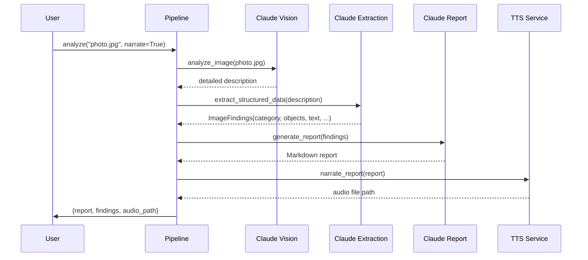

**pipeline.py**

```python
@dataclass
class AnalysisResult:
    """Complete output from the multi-modal analysis pipeline."""
    image_path: str
    findings: ImageFindings
    report: str
    narration_path: str | None = None


def run_analysis_pipeline(
    image_path: str,
    narrate: bool = False,
    narration_output: str = "report_narration.mp3",
) -> AnalysisResult:
    """Run the complete multi-modal image analysis pipeline.

    Stages:
    1. Vision analysis -- describe the image in detail
    2. Structured extraction -- parse description into typed data
    3. Report generation -- synthesize findings into a report
    4. TTS narration (optional) -- convert report to audio

    Args:
        image_path: Path to the image file to analyze
        narrate: If True, generate audio narration of the report
        narration_output: File path for the audio output

    Returns:
        AnalysisResult with findings, report text, and
        optional narration path
    """
    print(f"{'='*60}")
    print(f"Multi-Modal Analysis Pipeline")
    print(f"Image: {image_path}")
    print(f"{'='*60}")

    # Stage 1: Vision analysis
    print("\n[Stage 1/4] Analyzing image with Claude Vision...")
    analysis = analyze_image(image_path)
    print(f"  Vision analysis complete "
          f"({len(analysis)} chars)")

    # Stage 2: Structured extraction
    print("\n[Stage 2/4] Extracting structured data...")
    findings = extract_structured_data(analysis)
    print(f"  Category: {findings.category}")
    print(f"  Subject: {findings.primary_subject}")
    print(f"  Objects found: {len(findings.detected_objects)}")
    print(f"  Text segments: {len(findings.detected_text)}")
    print(f"  Confidence: {findings.confidence}")

    # Stage 3: Report generation
    print("\n[Stage 3/4] Generating report...")
    report = generate_report(findings)
    print(f"  Report complete ({len(report)} chars)")

    # Stage 4: Optional TTS narration
    narration_path = None
    if narrate:
        print("\n[Stage 4/4] Generating audio narration...")
        tts_result = narrate_report(report, narration_output)
        tts_data = json.loads(tts_result)
        narration_path = tts_data.get("output_path")
        print(f"  Narration: {narration_path}")
    else:
        print("\n[Stage 4/4] Skipping narration (narrate=False)")

    print(f"\n{'='*60}")
    print("Pipeline complete!")
    print(f"{'='*60}")

    return AnalysisResult(
        image_path=image_path,
        findings=findings,
        report=report,
        narration_path=narration_path,
    )
```

The orchestrator is deliberately simple: four function calls in sequence, with logging between each stage. There is no agent loop here, no tool calling, no autonomous decision-making. That is intentional. A **sequential pipeline** is the right architecture when the stages are fixed and each stage depends on the previous one. Not every multi-modal system needs to be an autonomous agent -- sometimes a well-structured pipeline is clearer, faster, and easier to debug.

## 8.7 Running the Pipeline

**run_pipeline.py**

```python
if __name__ == "__main__":
    # Example: analyze an image with narration
    result = run_analysis_pipeline(
        image_path="sample_image.jpg",
        narrate=True,
        narration_output="analysis_narration.mp3",
    )

    # Access individual outputs
    print("\n--- Structured Findings ---")
    print(json.dumps(asdict(result.findings), indent=2, default=str))

    print("\n--- Report Preview ---")
    print(result.report[:500])

    if result.narration_path:
        print(f"\n--- Narration saved to: {result.narration_path} ---")
```

Here is what the output looks like when the pipeline runs:

**output**

```text
============================================================
Multi-Modal Analysis Pipeline
Image: sample_image.jpg
============================================================

[Stage 1/4] Analyzing image with Claude Vision...
  Vision analysis complete (1247 chars)

[Stage 2/4] Extracting structured data...
  Category: photograph
  Subject: A modern office workspace with dual monitors
  Objects found: 8
  Text segments: 3
  Confidence: high

[Stage 3/4] Generating report...
  Report complete (1834 chars)

[Stage 4/4] Generating audio narration...
  TTS: Would narrate 287 words (~1.9 minutes)
  TTS: Output would be saved to analysis_narration.mp3

============================================================
Pipeline complete!
============================================================
```

## 8.7 Extending the Pipeline: Batch Processing

In production, you rarely analyze a single image. Insurance adjusters process dozens of claim photos. Quality control systems inspect hundreds of products per hour. Here is how to extend the pipeline for **batch processing** with concurrent execution:

**batch_processing.py**

```python
import asyncio
from concurrent.futures import ThreadPoolExecutor


def run_batch_analysis(
    image_paths: list[str],
    max_concurrent: int = 3,
    narrate: bool = False,
) -> list[AnalysisResult]:
    """Run the analysis pipeline on multiple images with
    controlled concurrency.

    Args:
        image_paths: List of image file paths to analyze
        max_concurrent: Maximum parallel analyses (be mindful
            of API rate limits)
        narrate: Whether to generate audio for each report

    Returns:
        List of AnalysisResult objects, one per image
    """
    results: list[AnalysisResult] = []

    with ThreadPoolExecutor(max_workers=max_concurrent) as pool:
        futures = {
            pool.submit(
                run_analysis_pipeline,
                path,
                narrate,
                f"narration_{i}.mp3",
            ): path
            for i, path in enumerate(image_paths)
        }

        for future in futures:
            path = futures[future]
            try:
                result = future.result()
                results.append(result)
                print(f"Completed: {path}")
            except Exception as e:
                print(f"Failed: {path} -- {e}")

    # Generate a summary across all images
    summary = generate_batch_summary(results)
    print(f"\nBatch Summary:\n{summary}")

    return results


def generate_batch_summary(results: list[AnalysisResult]) -> str:
    """Generate a summary report across all analyzed images."""
    summary_data = []
    for r in results:
        summary_data.append({
            "image": r.image_path,
            "category": r.findings.category,
            "subject": r.findings.primary_subject,
            "confidence": r.findings.confidence,
            "condition": r.findings.condition,
            "object_count": len(r.findings.detected_objects),
        })

    prompt = f"""Summarize these image analysis results into
a brief batch report:

{json.dumps(summary_data, indent=2)}

Include:
- Total images processed
- Breakdown by category
- Any images flagged as low confidence or poor condition
- Overall patterns or notable findings

Return a concise Markdown summary."""

    response = client.messages.create(
        model=MODEL,
        max_tokens=1024,
        messages=[{"role": "user", "content": prompt}],
    )

    return response.content[0].text
```

The **`max_concurrent`** parameter is critical. Each pipeline run makes 3-4 API calls to Claude. Processing 50 images with unlimited concurrency would fire 200 API calls simultaneously, which would hit rate limits and produce errors. Controlled concurrency keeps throughput high without overwhelming the API. This is the same rate-limiting pattern from Module 3's error handling lesson, applied at the pipeline level.

## 8.7 What This Lab Taught You

Trace each piece of the pipeline back to the lesson where you learned it:

- **Vision analysis** with structured prompts that request specific categories of information (lesson 02: vision-language agents)
- **Text-to-speech integration** with Markdown-to-speech preprocessing (lesson 03: audio and speech agents)
- **Structured data extraction** using a two-pass approach -- analyze first, extract second (lesson 05: cross-modal reasoning)
- **Multi-modal tool orchestration** with a sequential pipeline that connects vision, text, and audio (lesson 06: multi-modal tool use)
- **Batch processing** with controlled concurrency for production workloads (lesson 01: why multi-modal agents)
- **Graceful error handling** throughout -- fallbacks for failed JSON parsing, missing TTS services, and API errors (Module 3: tool error handling)

This is the complete multi-modal toolkit. Every stage -- image input, vision analysis, structured extraction, report generation, audio output -- is a building block you can recombine for your own use cases.

## 8.7 Where a Single Agent Hits Its Limits

The pipeline you built works well for its task, but look at what happens when you try to scale it to more complex scenarios:

- **No specialization.** The same Claude model handles vision analysis, data extraction, and report writing. A more complex system might benefit from specialized models for each task -- a vision-optimized model for image analysis, a data extraction model fine-tuned on structured output, a writing model tuned for report quality.

- **No collaboration.** Each stage runs in isolation. The report writer cannot ask the vision analyzer to look at the image again if something is unclear. There is no back-and-forth between stages.

- **No delegation.** If the image contains both a document and a photograph, the pipeline treats everything the same way. A smarter system would route different types of content to different specialist processors.

- **No parallel reasoning.** The pipeline is strictly sequential. But some stages could run in parallel -- you could analyze visual content and extract text simultaneously, then merge the results.

These are not bugs in your code. They are fundamental limitations of a **single-agent architecture**. When a task requires multiple skills, multiple perspectives, or parallel reasoning tracks, you need more than one agent.

## 8.7 What Comes Next

You have built agents that see images, extract data, write reports, and speak. Each of these is a powerful capability. But in **Module 9: Multi-Agent Systems**, you will learn how to make these agents collaborate:

- **Supervisor agents** that delegate image analysis to a vision specialist, data extraction to a parsing specialist, and report writing to a content specialist -- each optimized for its task
- **Pipeline orchestration** where agents hand off work to each other with structured messages, not just function calls
- **Parallel agent execution** where a vision agent and a text-extraction agent analyze the same document simultaneously, then a synthesis agent merges their findings
- **Debate and consensus** where multiple agents review the same analysis and converge on a more accurate conclusion than any single agent could reach

You have built agents that see and hear -- Module 9 teaches them to collaborate with other agents.

## 8.7 Summary

You built a complete multi-modal image analysis pipeline that demonstrates every concept from Module 8 in a single working system. The pipeline accepts an image, analyzes it with Claude's vision capabilities, extracts structured data from the analysis, generates a formatted Markdown report, and optionally narrates that report with text-to-speech. You extended it with batch processing for production workloads. The four-stage architecture -- vision, extraction, reporting, narration -- shows how multi-modal capabilities compose into practical workflows. But the single-agent, sequential pipeline also reveals its own limits: no specialization, no collaboration, no delegation. Module 9 introduces multi-agent systems that overcome these constraints by letting specialized agents work together.

---

