# Multi-Agent Systems

*Orchestrating multiple agents that collaborate, delegate, and communicate*

    Section 9.1: Why Multi-Agent Systems?


## 9.1 Overview

You have spent eight modules building increasingly capable individual agents. They can reason through multi-step problems, wield tools, follow sophisticated design patterns, persist knowledge across sessions, leverage entire frameworks, and even perceive the world through vision and audio. A single well-designed agent can accomplish a remarkable range of tasks.

But some tasks break a single agent. Not because the model is too small or the tools are insufficient, but because the task itself has a structure that one agent cannot serve well. When the scope of responsibility grows too broad, when throughput demands exceed what sequential processing can deliver, or when the problem naturally decomposes into distinct expert domains, a single agent becomes a bottleneck -- no matter how powerful the underlying model is.

Module 9 introduces **multi-agent systems**: architectures where multiple agents collaborate, delegate, and coordinate to solve problems that exceed what any single agent can handle alone. This opening lesson explains *why* multi-agent systems exist, *when* they are the right choice, and *what* architectural shift they represent compared to the single-agent approach you have used so far.

## 9.1 When One Agent Is Not Enough

The limitations of a single agent are not theoretical. They emerge predictably as systems grow in scope and complexity. Understanding these limitations is essential for knowing when to reach for a multi-agent architecture rather than adding more instructions to an already-overloaded single agent.

### The System Prompt Ceiling

Every agent you have built so far operates from a single system prompt that defines its identity, capabilities, constraints, and domain knowledge. This works well when the agent has a focused role. But as you add responsibilities, the system prompt grows, and competing instructions begin to interfere with each other.

Consider an agent tasked with managing a software development workflow. It needs to understand code review practices, CI/CD pipeline semantics, issue tracking conventions, deployment procedures, security policies, and communication norms. Each domain has its own terminology, its own rules, and its own edge cases. Packed into one system prompt, these domains blur together. The agent might apply deployment safety checks to a code review comment, or use issue tracking terminology when drafting a deployment notification. The more responsibilities you add, the worse each one gets.

This is the **system prompt ceiling** -- the point at which adding more context to a single agent degrades rather than improves performance.

### Sequential Bottlenecks

A single agent processes one step at a time. It observes, thinks, acts, observes the result, thinks again, and acts again. This sequential loop is fine when each step depends on the previous one. But many real-world tasks contain independent subtasks that could run concurrently.

A research task might require analyzing ten documents, querying three databases, and checking five APIs. A single agent does these one after another. With ten documents taking two minutes each, the document analysis alone takes twenty minutes. But the documents are independent -- there is no reason one analysis must wait for another to finish. A multi-agent system can dispatch ten document analysis agents in parallel and complete all ten in two minutes.

### Domain Expertise Conflicts

Different subtasks sometimes require different model configurations, different tool sets, or even different models entirely. A coding agent benefits from a model fine-tuned for code generation. A writing agent benefits from a model tuned for natural language fluency. A data analysis agent might need access to SQL tools and visualization libraries, while a customer-facing agent needs access to CRM APIs and communication tools.

A single agent must carry every tool and every persona at once, even when most of them are irrelevant to the current subtask. This wastes context window space and increases the chance of the agent selecting the wrong tool or applying the wrong expertise.

## 9.1 Single Agent vs. Multi-Agent Architecture

The architectural difference between a single agent and a multi-agent system is not merely about running multiple copies of the same agent. It is a fundamentally different way of structuring how work gets done. The following diagram contrasts the two approaches.

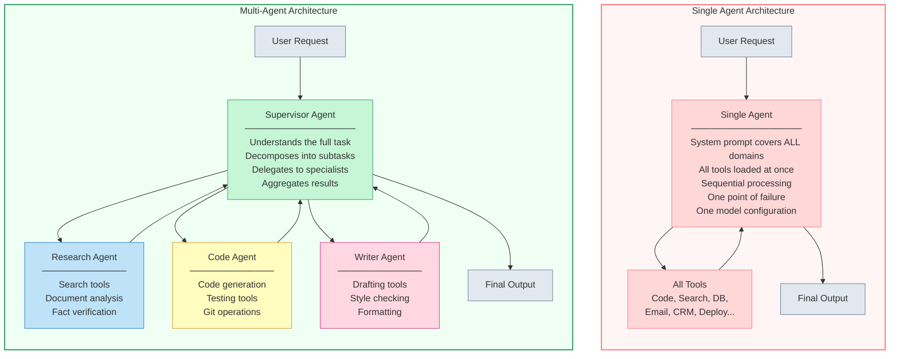
```mermaid
graph TD
    subgraph Single["Single Agent Architecture"]
        direction TB
        USER1["User Request"] --> SOLO["Single Agent<br/>─────────────────<br/>System prompt covers ALL domains<br/>All tools loaded at once<br/>Sequential processing<br/>One point of failure<br/>One model configuration"]
        SOLO --> TOOLS1["All Tools<br/>Code, Search, DB,<br/>Email, CRM, Deploy..."]
        SOLO --> OUT1["Final Output"]
        TOOLS1 --> SOLO
    end
    subgraph Multi["Multi-Agent Architecture"]
        direction TB
        USER2["User Request"] --> SUPERVISOR["Supervisor Agent<br/>─────────────────<br/>Understands the full task<br/>Decomposes into subtasks<br/>Delegates to specialists<br/>Aggregates results"]
        SUPERVISOR --> RESEARCH["Research Agent<br/>─────────────<br/>Search tools<br/>Document analysis<br/>Fact verification"]
        SUPERVISOR --> CODE["Code Agent<br/>─────────────<br/>Code generation<br/>Testing tools<br/>Git operations"]
        SUPERVISOR --> WRITER["Writer Agent<br/>─────────────<br/>Drafting tools<br/>Style checking<br/>Formatting"]
        RESEARCH --> SUPERVISOR
        CODE --> SUPERVISOR
        WRITER --> SUPERVISOR
        SUPERVISOR --> OUT2["Final Output"]
    end
    style Single fill:#fff5f5,stroke:#fc8181,stroke-width:2px
    style Multi fill:#f0fff4,stroke:#38a169,stroke-width:2px
    style USER1 fill:#e2e8f0,stroke:#718096
    style USER2 fill:#e2e8f0,stroke:#718096
    style SOLO fill:#fed7d7,stroke:#fc8181
    style TOOLS1 fill:#fed7d7,stroke:#fc8181
    style OUT1 fill:#e2e8f0,stroke:#718096
    style SUPERVISOR fill:#c6f6d5,stroke:#38a169
    style RESEARCH fill:#bee3f8,stroke:#3182ce
    style CODE fill:#fefcbf,stroke:#d69e2e
    style WRITER fill:#fed7e2,stroke:#d53f8c
    style OUT2 fill:#e2e8f0,stroke:#718096
```

On the left, the single agent receives the full request, holds every tool, carries every domain in its system prompt, and processes everything sequentially. On the right, a **supervisor agent** understands the overall task, breaks it into subtasks, and delegates each subtask to a **specialist agent** that has a focused system prompt, a curated tool set, and potentially a different model optimized for its domain.

The supervisor does not do the detailed work itself. It orchestrates: decomposing, assigning, monitoring progress, handling failures, and assembling the final output from specialist results. This mirrors how effective human organizations work -- a project manager does not write the code, design the UI, and test the product. They coordinate specialists who each excel in their domain.

## 9.1 Five Pillars of Multi-Agent Advantage

Multi-agent systems offer five distinct advantages over single-agent architectures. Not every system needs all five, but understanding each one helps you decide whether a multi-agent approach is warranted for your use case.

### Specialization

Each agent in a multi-agent system has a narrow, well-defined role. Its system prompt focuses on one domain. Its tool set contains only the tools relevant to that domain. Its model can be chosen to match the task -- a fast, cheap model for simple classification, a powerful model for complex reasoning.

**Specialization** means each agent can be optimized independently. You can iterate on the research agent's prompt without risking regressions in the code agent. You can swap the writer agent's model without affecting the rest of the system. You can add a new specialist without changing existing ones.

### Parallelism

Independent subtasks can run concurrently across multiple agents. A single agent analyzing ten documents sequentially takes ten times as long as one document. Ten agents working in parallel complete all ten in the time it takes to process one.

**Parallelism** is not limited to identical tasks. A supervisor can dispatch a research agent, a code agent, and a writer agent simultaneously when their subtasks do not depend on each other. The total completion time is determined by the slowest subtask, not the sum of all subtasks.

### Separation of Concerns

Each agent encapsulates its own domain logic, tools, and error handling. Changes to one agent's implementation do not propagate to others. The research agent can be completely rewritten -- different prompt, different tools, different model -- without the code agent or writer agent knowing or caring.

**Separation of concerns** makes multi-agent systems easier to maintain, test, and evolve than monolithic single-agent systems. You can unit test each agent in isolation, measure its performance on domain-specific benchmarks, and deploy updates incrementally.

### Error Isolation

When a single agent encounters an error -- a tool failure, a hallucination, a timeout -- the entire task fails. The agent's context is corrupted by the error, and recovery requires restarting from scratch or implementing complex rollback logic within a single reasoning chain.

In a multi-agent system, **error isolation** confines failures to the agent that encountered them. If the research agent fails to access a database, the code agent and writer agent continue working. The supervisor can retry the failed subtask, assign it to a backup agent, or proceed with partial results. The blast radius of any single failure is limited to one specialist.

### Scalability

Multi-agent systems scale horizontally. When workload increases, you add more specialist agents rather than making a single agent handle more. If document volume doubles, you double the number of document analysis agents. If a new domain is added to the workflow, you create a new specialist rather than expanding an existing agent's already-long system prompt.

**Scalability** in multi-agent systems follows the same principles as microservice architectures in software engineering. Each agent is an independent unit that can be scaled, deployed, and managed separately.

## 9.1 The Comparison: Limitations vs. Benefits

The following diagram summarizes how each limitation of single-agent architectures maps to a corresponding multi-agent benefit.

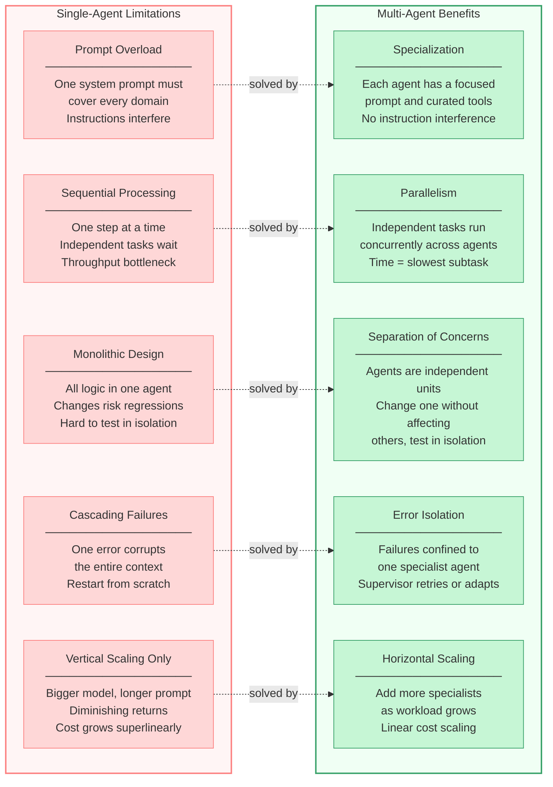
```mermaid
graph LR
    subgraph Limitations["Single-Agent Limitations"]
        direction TB
        L1["Prompt Overload<br/>──────────────────<br/>One system prompt must<br/>cover every domain<br/>Instructions interfere"]
        L2["Sequential Processing<br/>──────────────────<br/>One step at a time<br/>Independent tasks wait<br/>Throughput bottleneck"]
        L3["Monolithic Design<br/>──────────────────<br/>All logic in one agent<br/>Changes risk regressions<br/>Hard to test in isolation"]
        L4["Cascading Failures<br/>──────────────────<br/>One error corrupts<br/>the entire context<br/>Restart from scratch"]
        L5["Vertical Scaling Only<br/>──────────────────<br/>Bigger model, longer prompt<br/>Diminishing returns<br/>Cost grows superlinearly"]
    end
    subgraph Benefits["Multi-Agent Benefits"]
        direction TB
        B1["Specialization<br/>──────────────────<br/>Each agent has a focused<br/>prompt and curated tools<br/>No instruction interference"]
        B2["Parallelism<br/>──────────────────<br/>Independent tasks run<br/>concurrently across agents<br/>Time = slowest subtask"]
        B3["Separation of Concerns<br/>──────────────────<br/>Agents are independent units<br/>Change one without affecting<br/>others, test in isolation"]
        B4["Error Isolation<br/>──────────────────<br/>Failures confined to<br/>one specialist agent<br/>Supervisor retries or adapts"]
        B5["Horizontal Scaling<br/>──────────────────<br/>Add more specialists<br/>as workload grows<br/>Linear cost scaling"]
    end
    L1 -.->|"solved by"| B1
    L2 -.->|"solved by"| B2
    L3 -.->|"solved by"| B3
    L4 -.->|"solved by"| B4
    L5 -.->|"solved by"| B5
    style Limitations fill:#fff5f5,stroke:#fc8181,stroke-width:2px
    style Benefits fill:#f0fff4,stroke:#38a169,stroke-width:2px
    style L1 fill:#fed7d7,stroke:#fc8181
    style L2 fill:#fed7d7,stroke:#fc8181
    style L3 fill:#fed7d7,stroke:#fc8181
    style L4 fill:#fed7d7,stroke:#fc8181
    style L5 fill:#fed7d7,stroke:#fc8181
    style B1 fill:#c6f6d5,stroke:#38a169
    style B2 fill:#c6f6d5,stroke:#38a169
    style B3 fill:#c6f6d5,stroke:#38a169
    style B4 fill:#c6f6d5,stroke:#38a169
    style B5 fill:#c6f6d5,stroke:#38a169
```

The mapping is direct. Every structural limitation of the single-agent approach has a corresponding multi-agent solution. This does not mean multi-agent is always better -- it introduces coordination overhead, communication complexity, and operational cost that a simple single-agent system avoids. The decision depends on whether the task's complexity justifies that overhead.

## 9.1 Real-World Analogies

Multi-agent systems are not a novel concept invented for AI. They mirror organizational structures that humans have refined over centuries. Two analogies make the principles concrete.

### The Hospital Team

A patient arrives at the emergency room with chest pain and a broken wrist. The **triage nurse** (supervisor agent) assesses the situation and determines priorities. She routes the patient to the **cardiologist** (specialist agent) for the chest pain and schedules the **orthopedic surgeon** (specialist agent) for the wrist. A **radiologist** (specialist agent) reads the X-rays and cardiac imaging. A **pharmacist** (specialist agent) prepares medications based on the cardiologist's orders.

No single doctor handles everything. Each specialist has deep expertise in one domain, access to domain-specific tools (EKG machine, X-ray reader, surgical instruments, drug interaction database), and a clear scope of responsibility. The triage nurse coordinates the overall workflow without performing any of the specialized procedures herself. If the radiologist's imaging equipment fails, the cardiologist can still proceed with other diagnostic tools -- **error isolation** in action.

### The Software Development Team

A product manager (supervisor agent) receives a feature request. She breaks it into subtasks and assigns them: the **backend engineer** (specialist agent) designs the API and database schema, the **frontend engineer** (specialist agent) builds the UI components, the **QA engineer** (specialist agent) writes test cases, and the **technical writer** (specialist agent) updates the documentation.

Each engineer has specialized tools (IDE, database console, browser dev tools, documentation platform), specialized knowledge (system architecture, UI patterns, testing strategies, style guides), and a focused scope. They work in **parallel** on independent tasks. The product manager reviews their work, resolves conflicts between the API contract and the UI expectations, and assembles the final deliverable. She can replace the QA engineer with a different one without affecting the other team members -- **separation of concerns** at work.

Both analogies demonstrate the same principle: complex tasks are best handled by coordinated specialists under the guidance of an orchestrator who understands the whole but delegates the parts.

## 9.1 Connection to Module 7: From Frameworks to Principles

In Module 7, you encountered multi-agent capabilities within specific frameworks. **CrewAI** introduced the concept of agent crews with defined roles, and **AutoGen** demonstrated conversational agent groups that collaborate through message passing. Those lessons gave you practical experience with multi-agent tools, but they focused on framework-specific APIs and patterns.

Module 9 takes a different approach. Instead of starting with a framework and learning its multi-agent API, this module starts with the **underlying principles** that all multi-agent systems share, regardless of framework:

- **How do you decompose a task?** (Lesson 05: Task Decomposition)
- **How do agents communicate?** (Lesson 03: Agent Communication)
- **What topologies work best for what problems?** (Lesson 02: Orchestration Patterns)
- **How do agents from different platforms interoperate?** (Lesson 04: A2A Protocol)
- **How do agents resolve disagreements?** (Lesson 06: Debate and Consensus)

Understanding these principles means you can apply them in CrewAI, AutoGen, LangGraph, or a custom implementation. The framework is the vehicle; the principles are what you are driving toward.

## 9.1 When to Use Multi-Agent (and When Not To)

Multi-agent systems are powerful but not universally appropriate. They introduce coordination overhead -- agents must communicate, synchronize, and handle partial failures. This overhead is justified only when the task's complexity demands it.

**Use multi-agent when:**
- The task spans multiple distinct domains that benefit from separate system prompts and tool sets
- Independent subtasks can run in parallel and the sequential bottleneck is unacceptable
- You need different models or configurations for different parts of the task
- Error isolation is critical -- a failure in one subtask must not corrupt the entire workflow
- The system needs to scale horizontally as workload grows

**Stay with a single agent when:**
- The task is focused and fits comfortably in one system prompt
- Steps are strictly sequential and each depends on the previous result
- The overhead of agent coordination would exceed the time saved by specialization
- You are prototyping and need to iterate quickly before committing to an architecture

The decision is pragmatic, not ideological. Many production systems start as single agents and evolve into multi-agent systems as complexity grows and bottlenecks emerge. The key is recognizing the signals -- prompt overload, sequential bottlenecks, domain conflicts, cascading failures -- and knowing that a multi-agent architecture is the proven solution.

## 9.1 What's Ahead in This Module

The remaining lessons in this module take you from understanding why multi-agent systems exist to building them with precision. Each lesson addresses one core dimension of multi-agent design.

- **Lesson 02: Orchestration Patterns** -- The topologies that define how agents relate to each other: supervisor, swarm, pipeline, and hierarchical. You will learn when to use each pattern and how topology choice shapes system behavior.

- **Lesson 03: Agent Communication** -- How agents exchange information: message passing, shared state, blackboard systems, and event-driven coordination. Communication design determines whether your agents collaborate or collide.

- **Lesson 04: Agent-to-Agent (A2A) Protocol** -- Google's open standard for cross-platform agent interoperability. You will learn how agents from different frameworks and organizations can discover each other, negotiate capabilities, and collaborate on tasks.

- **Lesson 05: Task Decomposition and Delegation** -- The art of breaking complex tasks into subtasks and assigning them to the right agents. Decomposition strategy is the single most important design decision in a multi-agent system.

- **Lesson 06: Debate, Voting, and Consensus** -- Agents that argue, critique each other's work, vote on competing solutions, and converge on better answers than any individual agent would produce.

- **Lesson 07: Multi-Agent Lab** -- A hands-on lab where you build a research team with a supervisor, researcher, and writer agent that collaborate to produce a comprehensive research report.

## 9.1 Summary

**Multi-agent systems** are architectures where multiple specialized agents collaborate under coordination to solve problems that exceed what any single agent can handle effectively. They are not about replacing single agents -- they are about knowing when one agent is not enough and having the architectural vocabulary to build something better.

- The **single-agent ceiling** manifests as prompt overload (too many domains in one system prompt), sequential bottlenecks (independent tasks processed one at a time), domain conflicts (different subtasks need different tools and models), cascading failures (one error corrupts the entire workflow), and vertical scaling limits (bigger models yield diminishing returns).
- Multi-agent systems address these limitations through five pillars: **specialization** (focused agents with curated prompts and tools), **parallelism** (concurrent execution of independent subtasks), **separation of concerns** (independent agents that can be changed, tested, and deployed separately), **error isolation** (failures confined to individual specialists), and **horizontal scalability** (add agents as workload grows).
- The **supervisor-specialist pattern** is the most common multi-agent topology: a supervisor agent decomposes the task, delegates subtasks to specialists, monitors progress, handles failures, and assembles the final output. This mirrors real-world organizational structures like hospital teams and software development teams.
- Multi-agent capabilities in frameworks like **CrewAI and AutoGen** (Module 7) gave you practical exposure. Module 9 goes deeper into the **underlying principles** -- orchestration patterns, communication protocols, task decomposition strategies, and consensus mechanisms -- that apply across all frameworks.
- Multi-agent is not always the right choice. The coordination overhead is justified only when the task's complexity, parallelism needs, or reliability requirements demand it. Start simple, recognize the signals of single-agent limitations, and evolve to multi-agent when the evidence warrants it.

In the next lesson, you will learn the **orchestration patterns** that define how agents in a multi-agent system relate to each other -- supervisor, swarm, pipeline, and hierarchical topologies -- and how to choose the right pattern for your problem.

---

    Section 9.2: Orchestration Patterns


## 9.2 Overview

In the previous lesson, we established *why* multi-agent systems exist: specialization, parallelism, and separation of concerns let teams of agents solve problems that overwhelm any single agent. But agreeing that you need multiple agents is only the first decision. The harder question is: **how do those agents relate to each other?** Who decides what work gets done, in what order, and by whom?

The answer lies in **orchestration patterns** -- the structural topologies that define how agents are organized, how control flows between them, and how results are collected. Choosing the right topology is as consequential as choosing the right algorithm: the same set of agents can succeed brilliantly or fail completely depending on how they are wired together.

This lesson introduces the four major orchestration topologies -- **Supervisor**, **Swarm**, **Pipeline**, and **Hierarchical** -- with architecture diagrams for each, a decision flowchart for selecting among them, and a working Python implementation of the supervisor pattern. If you completed Module 4, you will recognize the routing architecture from Lesson 05 as the single-agent precursor to the supervisor pattern we build here. And if you worked through Module 7 Lesson 05, you will see how CrewAI's sequential and hierarchical process types map directly onto two of these topologies.

## 9.2 Topology 1: Supervisor

The **supervisor topology** places a single coordinator agent at the center. The supervisor receives the user's request, breaks it into subtasks, dispatches each subtask to a specialized **worker agent**, collects the results, and synthesizes a final response. Workers never talk to each other -- all communication flows through the supervisor.

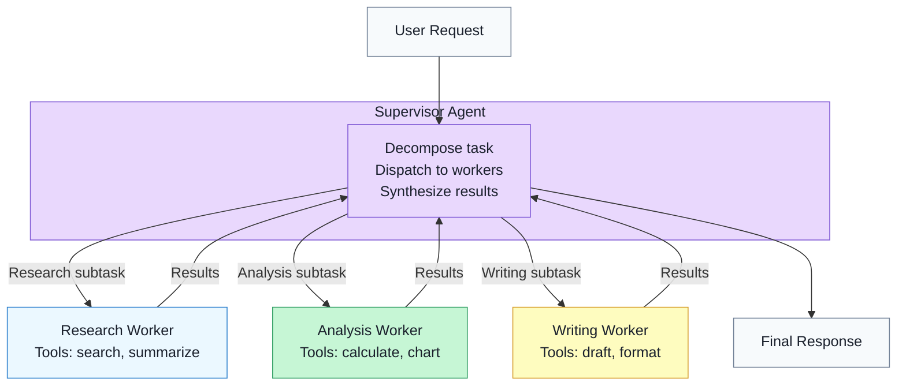
```mermaid
graph TD
    USER[User Request] --> SUP

    subgraph SUPERVISOR_BOX["Supervisor Agent"]
        SUP["Decompose task<br/>Dispatch to workers<br/>Synthesize results"]
    end

    SUP -->|Research subtask| W1["Research Worker<br/>Tools: search, summarize"]
    SUP -->|Analysis subtask| W2["Analysis Worker<br/>Tools: calculate, chart"]
    SUP -->|Writing subtask| W3["Writing Worker<br/>Tools: draft, format"]

    W1 -->|Results| SUP
    W2 -->|Results| SUP
    W3 -->|Results| SUP

    SUP --> OUTPUT[Final Response]

    style SUPERVISOR_BOX fill:#e9d8fd,stroke:#805ad5,color:#1a202c
    style SUP fill:#e9d8fd,stroke:#805ad5,color:#1a202c
    style W1 fill:#ebf8ff,stroke:#3182ce,color:#1a202c
    style W2 fill:#c6f6d5,stroke:#38a169,color:#1a202c
    style W3 fill:#fefcbf,stroke:#d69e2e,color:#1a202c
    style USER fill:#f7fafc,stroke:#718096,color:#1a202c
    style OUTPUT fill:#f7fafc,stroke:#718096,color:#1a202c
```

The supervisor is the natural evolution of the routing pattern you built in Module 4 Lesson 05. A router classifies a request and delegates to *one* specialist. A supervisor goes further: it can delegate to *multiple* workers, run them in parallel, inspect their results, request revisions, and combine outputs into a coherent whole. The router asks "Who should handle this?" while the supervisor asks "How should this work be divided, coordinated, and assembled?"

**Strengths:** Central control makes the system easy to reason about, debug, and monitor. The supervisor can enforce quality by reviewing worker outputs before returning them. Adding a new capability means adding a new worker without changing existing ones.

**Weaknesses:** The supervisor is a single point of failure and a potential bottleneck. Every message passes through it, which limits throughput. If the supervisor's task decomposition is poor, every downstream worker suffers.

## 9.2 Topology 2: Swarm

The **swarm topology** eliminates the central coordinator entirely. Agents operate as peers, handing off control directly to whichever agent is best suited for the next step. There is no boss -- just a network of specialists who know when to pass the baton.

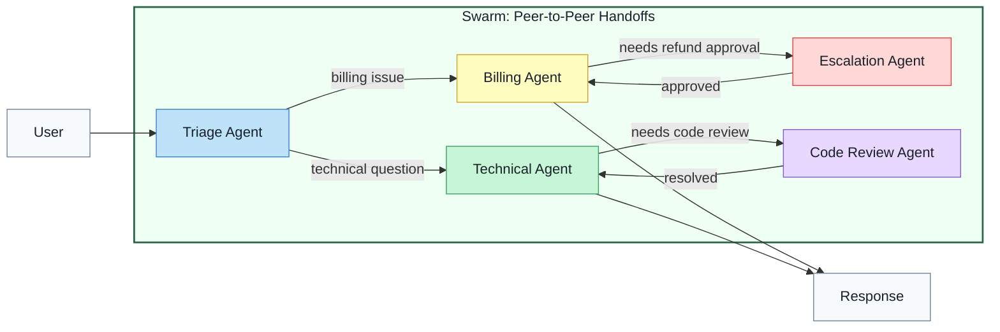
```mermaid
graph LR
    USER[User] --> A1

    subgraph SWARM["Swarm: Peer-to-Peer Handoffs"]
        A1["Triage Agent"] -->|billing issue| A2["Billing Agent"]
        A1 -->|technical question| A3["Technical Agent"]
        A2 -->|needs refund approval| A4["Escalation Agent"]
        A3 -->|needs code review| A5["Code Review Agent"]
        A5 -->|resolved| A3
        A4 -->|approved| A2
    end

    A2 --> RESP[Response]
    A3 --> RESP

    style SWARM fill:#f0fff4,stroke:#276749,stroke-width:2px,color:#1a202c
    style A1 fill:#bee3f8,stroke:#3182ce,color:#1a202c
    style A2 fill:#fefcbf,stroke:#d69e2e,color:#1a202c
    style A3 fill:#c6f6d5,stroke:#38a169,color:#1a202c
    style A4 fill:#fed7d7,stroke:#e53e3e,color:#1a202c
    style A5 fill:#e9d8fd,stroke:#805ad5,color:#1a202c
    style USER fill:#f7fafc,stroke:#718096,color:#1a202c
    style RESP fill:#f7fafc,stroke:#718096,color:#1a202c
```

In a swarm, each agent's tool list includes **handoff functions** -- tools that transfer control (and conversation context) to another agent. The triage agent does not solve the problem; it hands off to billing or technical support. If the billing agent encounters a refund that exceeds its authority, it hands off to an escalation agent. Control flows organically through the network based on the needs of the conversation.

This is the pattern that the OpenAI Agents SDK uses natively (Module 7 Lesson 02). Each agent declares which other agents it can hand off to, and the runtime manages the transitions. The result feels conversational and adaptive -- the system routes itself without a centralized dispatcher.

**Strengths:** No single point of failure. Scales naturally as you add agents. Conversational flow feels organic because handoffs happen in context, not through a dispatcher. Well-suited for customer support, help desks, and advisory systems.

**Weaknesses:** Difficult to debug when handoff chains get long (A handed to B, who handed to C, who handed back to A). No global view of progress. Circular handoffs can create infinite loops without careful guard clauses. Hard to enforce global constraints like "the user should get a response within 3 handoffs."

## 9.2 Topology 3: Pipeline

The **pipeline topology** arranges agents in a fixed, sequential chain. Each agent performs one stage of processing, transforms the data, and passes its output to the next agent. Think of it like an assembly line: raw material enters at one end, and a finished product exits at the other.

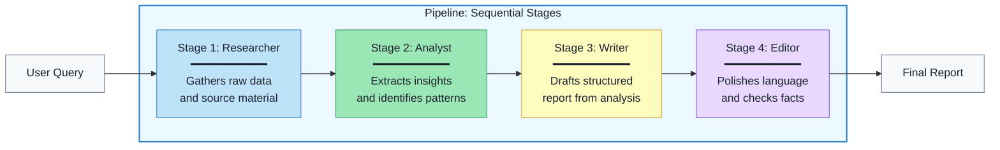
```mermaid
graph LR
    INPUT[User Query] --> S1

    subgraph PIPELINE["Pipeline: Sequential Stages"]
        S1["Stage 1: Researcher<br/>━━━━━━━━━━━<br/>Gathers raw data<br/>and source material"] --> S2["Stage 2: Analyst<br/>━━━━━━━━━━━<br/>Extracts insights<br/>and identifies patterns"]
        S2 --> S3["Stage 3: Writer<br/>━━━━━━━━━━━<br/>Drafts structured<br/>report from analysis"]
        S3 --> S4["Stage 4: Editor<br/>━━━━━━━━━━━<br/>Polishes language<br/>and checks facts"]
    end

    S4 --> OUTPUT[Final Report]

    style PIPELINE fill:#ebf8ff,stroke:#3182ce,stroke-width:2px,color:#1a202c
    style S1 fill:#bee3f8,stroke:#3182ce,color:#1a202c
    style S2 fill:#9ae6b4,stroke:#38a169,color:#1a202c
    style S3 fill:#fefcbf,stroke:#d69e2e,color:#1a202c
    style S4 fill:#e9d8fd,stroke:#805ad5,color:#1a202c
    style INPUT fill:#f7fafc,stroke:#718096,color:#1a202c
    style OUTPUT fill:#f7fafc,stroke:#718096,color:#1a202c
```

If you used CrewAI's **sequential process** in Module 7 Lesson 05, you have already built a pipeline. Each CrewAI `Task` is assigned to an `Agent`, and when the process type is `sequential`, tasks execute in order with each task's output feeding into the next. The pipeline topology formalizes this pattern: the structure is the sequence itself.

**Strengths:** Simple to understand, implement, and debug. Each stage has a clear contract -- what it receives and what it produces. Easy to test stages in isolation. Predictable execution time (sum of all stages).

**Weaknesses:** No parallelism -- every stage must wait for the previous one to finish. A failure in any stage halts the entire pipeline. Not suitable for tasks that require back-and-forth collaboration between stages (the analyst cannot ask the researcher for more data mid-pipeline without adding a feedback loop).

## 9.2 Topology 4: Hierarchical

The **hierarchical topology** nests supervisors within supervisors. A top-level manager delegates to mid-level managers, who in turn coordinate their own teams of worker agents. This mirrors how large organizations operate: a VP sets strategy, directors manage divisions, and individual contributors do the specialized work.

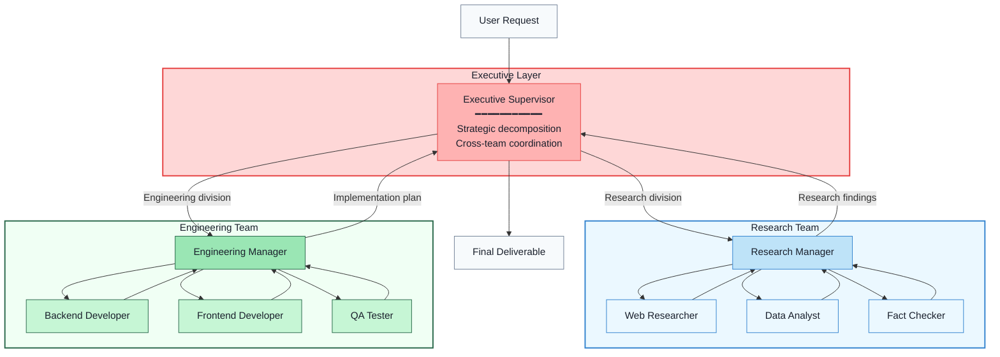
```mermaid
graph TD
    USER[User Request] --> CEO

    subgraph TOP["Executive Layer"]
        CEO["Executive Supervisor<br/>━━━━━━━━━━━<br/>Strategic decomposition<br/>Cross-team coordination"]
    end

    CEO -->|Research division| MGR1
    CEO -->|Engineering division| MGR2

    subgraph RESEARCH["Research Team"]
        MGR1["Research Manager"] --> R1["Web Researcher"]
        MGR1 --> R2["Data Analyst"]
        MGR1 --> R3["Fact Checker"]
    end

    subgraph ENGINEERING["Engineering Team"]
        MGR2["Engineering Manager"] --> E1["Backend Developer"]
        MGR2 --> E2["Frontend Developer"]
        MGR2 --> E3["QA Tester"]
    end

    R1 --> MGR1
    R2 --> MGR1
    R3 --> MGR1
    E1 --> MGR2
    E2 --> MGR2
    E3 --> MGR2

    MGR1 -->|Research findings| CEO
    MGR2 -->|Implementation plan| CEO

    CEO --> OUTPUT[Final Deliverable]

    style TOP fill:#fed7d7,stroke:#e53e3e,stroke-width:2px,color:#1a202c
    style RESEARCH fill:#ebf8ff,stroke:#3182ce,stroke-width:2px,color:#1a202c
    style ENGINEERING fill:#f0fff4,stroke:#276749,stroke-width:2px,color:#1a202c
    style CEO fill:#feb2b2,stroke:#e53e3e,color:#1a202c
    style MGR1 fill:#bee3f8,stroke:#3182ce,color:#1a202c
    style MGR2 fill:#9ae6b4,stroke:#276749,color:#1a202c
    style R1 fill:#ebf8ff,stroke:#3182ce,color:#1a202c
    style R2 fill:#ebf8ff,stroke:#3182ce,color:#1a202c
    style R3 fill:#ebf8ff,stroke:#3182ce,color:#1a202c
    style E1 fill:#c6f6d5,stroke:#276749,color:#1a202c
    style E2 fill:#c6f6d5,stroke:#276749,color:#1a202c
    style E3 fill:#c6f6d5,stroke:#276749,color:#1a202c
    style USER fill:#f7fafc,stroke:#718096,color:#1a202c
    style OUTPUT fill:#f7fafc,stroke:#718096,color:#1a202c
```

CrewAI's **hierarchical process** (Module 7 Lesson 05) is a two-level hierarchy: a manager agent automatically created by the framework coordinates the crew's agents. The topology described here generalizes that to arbitrary depth -- managers managing managers -- for systems complex enough to warrant it.

**Strengths:** Scales to very complex tasks with many agents. Each manager only needs to understand its own team, reducing cognitive load per agent. Natural separation of strategy (top level) from execution (bottom level). Teams can be developed and tested independently.

**Weaknesses:** Communication overhead grows with depth -- a message from a leaf worker to the executive passes through multiple managers. Latency increases with each layer. Over-engineering risk: most problems do not need three levels of management.

## 9.2 Choosing the Right Topology

With four topologies to choose from, how do you decide? The following flowchart guides the decision based on your task's characteristics:

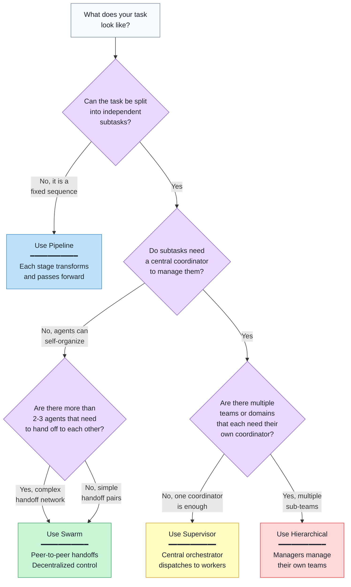
```mermaid
flowchart TD
    START["What does your task<br/>look like?"] --> Q1{Can the task be split<br/>into independent<br/>subtasks?}

    Q1 -->|No, it is a<br/>fixed sequence| PIPELINE["Use Pipeline<br/>━━━━━━━━━━━<br/>Each stage transforms<br/>and passes forward"]

    Q1 -->|Yes| Q2{Do subtasks need<br/>a central coordinator<br/>to manage them?}

    Q2 -->|No, agents can<br/>self-organize| Q3{Are there more than<br/>2-3 agents that need<br/>to hand off to each other?}

    Q3 -->|Yes, complex<br/>handoff network| SWARM["Use Swarm<br/>━━━━━━━━━━━<br/>Peer-to-peer handoffs<br/>Decentralized control"]
    Q3 -->|No, simple<br/>handoff pairs| SWARM

    Q2 -->|Yes| Q4{Are there multiple<br/>teams or domains<br/>that each need their<br/>own coordinator?}

    Q4 -->|No, one coordinator<br/>is enough| SUPERVISOR["Use Supervisor<br/>━━━━━━━━━━━<br/>Central orchestrator<br/>dispatches to workers"]

    Q4 -->|Yes, multiple<br/>sub-teams| HIERARCHICAL["Use Hierarchical<br/>━━━━━━━━━━━<br/>Managers manage<br/>their own teams"]

    style START fill:#f7fafc,stroke:#718096,color:#1a202c
    style Q1 fill:#e9d8fd,stroke:#805ad5,color:#1a202c
    style Q2 fill:#e9d8fd,stroke:#805ad5,color:#1a202c
    style Q3 fill:#e9d8fd,stroke:#805ad5,color:#1a202c
    style Q4 fill:#e9d8fd,stroke:#805ad5,color:#1a202c
    style PIPELINE fill:#bee3f8,stroke:#3182ce,color:#1a202c
    style SWARM fill:#c6f6d5,stroke:#38a169,color:#1a202c
    style SUPERVISOR fill:#fefcbf,stroke:#d69e2e,color:#1a202c
    style HIERARCHICAL fill:#fed7d7,stroke:#e53e3e,color:#1a202c
```

A few rules of thumb to supplement the flowchart:

- **Start with the simplest topology that works.** A pipeline with two stages is easier to debug than a three-level hierarchy. You can always add complexity later.
- **Supervisor is the default.** If you are unsure, start with a supervisor and a few workers. It is the most common topology in production systems because it balances control with flexibility.
- **Use swarm for conversational systems.** When the user is interacting in real-time and the conversation naturally moves between domains (support, billing, technical), swarm handoffs feel more natural than routing through a central dispatcher.
- **Reserve hierarchical for genuine complexity.** If you have fewer than 6-8 agents, a flat supervisor is almost always sufficient. Hierarchy pays off when you have dozens of specialists organized into distinct functional teams.

## 9.2 Implementing a Supervisor Pattern

Let's build a working supervisor that coordinates a research agent and an analysis agent to answer complex questions. The supervisor decomposes the user's query, dispatches subtasks, and synthesizes the results:

**supervisor_agent.py**

```python
import anthropic
import json

client = anthropic.Anthropic()

# --- Worker definitions ---

WORKERS = {
    "researcher": {
        "system_prompt": (
            "You are a research specialist. When given a research question, "
            "provide comprehensive, factual information with specific details, "
            "statistics, and examples. Structure your response with clear sections. "
            "Focus on accuracy over brevity."
        ),
        "model": "claude-sonnet-4-20250514",
    },
    "analyst": {
        "system_prompt": (
            "You are a data analyst. When given information and an analysis task, "
            "identify patterns, draw comparisons, evaluate trade-offs, and produce "
            "structured insights. Use bullet points for key findings. "
            "Be specific and quantitative whenever possible."
        ),
        "model": "claude-sonnet-4-20250514",
    },
}


def call_worker(worker_name: str, task: str) -> str:
    """Send a subtask to a worker agent and return its response."""
    config = WORKERS[worker_name]
    response = client.messages.create(
        model=config["model"],
        max_tokens=2048,
        system=config["system_prompt"],
        messages=[{"role": "user", "content": task}],
    )
    return response.content[0].text


def supervisor(user_query: str) -> str:
    """
    The supervisor agent: decomposes, delegates, and synthesizes.

    This agent uses tool_use to call workers. The tools represent
    the available worker agents, not external APIs.
    """
    # Define workers as tools the supervisor can call
    worker_tools = [
        {
            "name": "dispatch_researcher",
            "description": (
                "Send a research task to the research specialist. "
                "Use this to gather factual information, data, and examples."
            ),
            "input_schema": {
                "type": "object",
                "properties": {
                    "task": {
                        "type": "string",
                        "description": "The specific research question or topic",
                    }
                },
                "required": ["task"],
            },
        },
        {
            "name": "dispatch_analyst",
            "description": (
                "Send an analysis task to the analyst. Use this to evaluate "
                "data, compare options, identify patterns, or draw conclusions."
            ),
            "input_schema": {
                "type": "object",
                "properties": {
                    "task": {
                        "type": "string",
                        "description": "The analysis task, including any data to analyze",
                    }
                },
                "required": ["task"],
            },
        },
    ]

    supervisor_system = (
        "You are a supervisor agent that coordinates a team of specialists. "
        "Your job is to:\\n"
        "1. Analyze the user's request\\n"
        "2. Break it into subtasks for your workers\\n"
        "3. Dispatch tasks using your tools\\n"
        "4. Synthesize worker results into a final, coherent response\\n\\n"
        "Available workers:\\n"
        "- dispatch_researcher: for gathering information and facts\\n"
        "- dispatch_analyst: for analyzing data and drawing conclusions\\n\\n"
        "You may call workers multiple times or in any order. "
        "After collecting all results, provide a final synthesis."
    )

    messages = [{"role": "user", "content": user_query}]
    worker_results = {}

    # Agentic loop: let the supervisor call workers until it is done
    while True:
        response = client.messages.create(
            model="claude-sonnet-4-20250514",
            max_tokens=4096,
            system=supervisor_system,
            tools=worker_tools,
            messages=messages,
        )

        # If the model is done (no more tool calls), return the final text
        if response.stop_reason == "end_turn":
            final_text = ""
            for block in response.content:
                if hasattr(block, "text"):
                    final_text += block.text
            return final_text

        # Process tool calls (worker dispatches)
        assistant_content = response.content
        tool_results = []

        for block in assistant_content:
            if block.type == "tool_use":
                tool_name = block.name
                task = block.input["task"]

                # Map tool names to workers
                worker_map = {
                    "dispatch_researcher": "researcher",
                    "dispatch_analyst": "analyst",
                }
                worker_name = worker_map[tool_name]

                print(f"[Supervisor] Dispatching to {worker_name}: {task[:80]}...")
                result = call_worker(worker_name, task)
                worker_results[worker_name] = result
                print(f"[{worker_name}] Returned {len(result)} chars")

                tool_results.append({
                    "type": "tool_result",
                    "tool_use_id": block.id,
                    "content": result,
                })

        # Feed results back to the supervisor for synthesis
        messages.append({"role": "assistant", "content": assistant_content})
        messages.append({"role": "user", "content": tool_results})


# --- Run it ---
query = "Compare serverless and container-based architectures for a startup building a real-time analytics platform."
print(f"Query: {query}\\n{'='*60}")
result = supervisor(query)
print(f"\\nFinal Response:\\n{result}")
```

Several design choices in this implementation deserve attention:

- **Workers-as-tools.** The supervisor uses Claude's tool_use mechanism to dispatch to workers. Each worker is represented as a tool, which means the supervisor's LLM naturally decides *when* and *how many* workers to call. It might call the researcher once and the analyst twice, or skip the analyst entirely -- the decision is dynamic, not hardcoded.

- **The agentic loop.** The `while True` loop lets the supervisor iterate: dispatch workers, receive results, decide if more work is needed, and dispatch again. This is the same tool-use loop you learned in Module 3, but now the "tools" are other agents rather than external APIs.

- **Synthesis happens last.** After all workers report back, the supervisor produces a final response that weaves together the research and analysis. This synthesis step is what separates a supervisor from a simple router -- the supervisor does not just relay a worker's response, it adds value by combining and contextualizing multiple outputs.

> **Connection to Module 4:** Compare this supervisor implementation with the router from Module 4 Lesson 05. The router classified intent and delegated to *one* specialist. The supervisor decomposes the task and delegates to *multiple* workers, potentially calling the same worker more than once. The structural pattern is the same -- classify, delegate, return -- but the supervisor's expressiveness is far greater because it controls the loop.

## 9.2 Topology Comparison at a Glance

| Characteristic | Supervisor | Swarm | Pipeline | Hierarchical |
|---|---|---|---|---|
| **Control flow** | Centralized | Decentralized | Sequential | Nested centralized |
| **Communication** | Hub-and-spoke | Peer-to-peer | Chain | Tree |
| **Best for** | Task decomposition | Conversational routing | Data transformation | Large-scale systems |
| **Parallelism** | Yes (workers) | Implicit (handoffs) | No (sequential) | Yes (within teams) |
| **Debugging** | Easy (single point) | Hard (trace handoffs) | Easy (linear flow) | Moderate (layered) |
| **Failure mode** | Supervisor bottleneck | Circular handoffs | Stage blockage | Communication overhead |
| **Framework example** | LangGraph supervisor | OpenAI Agents SDK | CrewAI sequential | CrewAI hierarchical |

## 9.2 Hybrid Topologies in Practice

Real-world systems rarely use a single topology in isolation. A production multi-agent system might combine several:

- A **supervisor** at the top level decomposes the user's request into research and implementation subtasks.
- The research subtask is handled by a **pipeline** of agents: search, summarize, fact-check.
- The implementation subtask is managed by a **hierarchical** team: an engineering manager coordinates a backend developer, a frontend developer, and a QA tester.
- Within the implementation team, the QA tester uses **swarm-style handoffs** with the developers -- filing bugs, receiving fixes, and re-testing in a peer-to-peer loop.

The topologies are composable building blocks, not rigid choices. Understanding each one individually gives you the vocabulary to design hybrid architectures that match your problem's actual structure.

## 9.2 Summary

**Orchestration patterns** define how agents in a multi-agent system are organized and how control flows between them. The four major topologies are:

- **Supervisor** -- a central coordinator decomposes tasks, dispatches to workers, and synthesizes results. Best for task decomposition where a single point of control is desirable. This is the direct evolution of the routing pattern from Module 4 Lesson 05.
- **Swarm** -- peer agents hand off control directly to each other without a central coordinator. Best for conversational systems where the interaction naturally flows between domains.
- **Pipeline** -- agents are arranged in a fixed sequence where each stage transforms and passes data forward. Best for workflows with clear, ordered stages. This maps to CrewAI's sequential process (Module 7 Lesson 05).
- **Hierarchical** -- supervisors manage sub-supervisors, who manage workers, forming a tree of delegation. Best for large-scale systems with many agents organized into functional teams. This maps to CrewAI's hierarchical process.

The right topology depends on your task structure: whether subtasks are independent or sequential, whether centralized control helps or hinders, and how many agents you need to coordinate. Start with the simplest topology that works -- usually a supervisor -- and add complexity only when the problem demands it.

In the next lesson, we will explore **Agent Communication** -- the protocols and patterns agents use to exchange information, share state, and coordinate their work within whatever topology you choose.

---

    Section 9.3: Agent Communication


## 9.3 Overview

In the previous two lessons, you explored *why* multi-agent systems exist and *how* to organize agents into topologies like supervisors, pipelines, and swarms. But topology only answers one question: who connects to whom. It does not answer the equally important question: **how do agents actually talk to each other?**

Communication is the nervous system of any multi-agent architecture. A supervisor cannot delegate if it cannot send a task description. A pipeline cannot flow if upstream agents cannot pass results downstream. A swarm cannot converge if agents cannot share discoveries. The communication mechanism you choose shapes everything -- how tightly agents are coupled, how easily you can add new agents, how the system handles failures, and how observable the interactions are.

This lesson covers the four fundamental **communication patterns** for multi-agent systems: direct message passing, shared state (the blackboard pattern), event-driven coordination, and communication protocols. You will implement a working message bus in Python and see how each pattern maps to the orchestration topologies from the previous lesson. By the end, you will know which pattern to reach for based on your system's coupling, scalability, and observability needs.

## 9.3 The Four Communication Patterns

Before diving into each pattern, here is the architectural landscape. These four patterns are not mutually exclusive -- production systems often combine two or more.

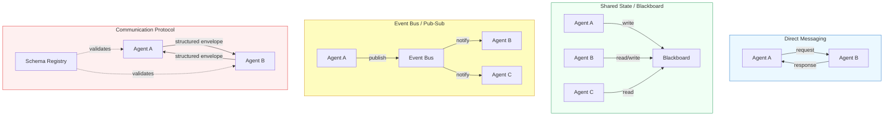
```mermaid
graph TD
    subgraph Direct["Direct Messaging"]
        A1["Agent A"] -->|request| A2["Agent B"]
        A2 -->|response| A1
    end

    subgraph Blackboard["Shared State / Blackboard"]
        B1["Agent A"] -->|write| BB["Blackboard"]
        B2["Agent B"] -->|read/write| BB
        B3["Agent C"] -->|read| BB
    end

    subgraph EventBus["Event Bus / Pub-Sub"]
        C1["Agent A"] -->|publish| BUS["Event Bus"]
        BUS -->|notify| C2["Agent B"]
        BUS -->|notify| C3["Agent C"]
    end

    subgraph Protocol["Communication Protocol"]
        D1["Agent A"] -->|structured envelope| D2["Agent B"]
        D2 -->|structured envelope| D1
        D3["Schema Registry"] -.->|validates| D1
        D3 -.->|validates| D2
    end

    style Direct fill:#ebf8ff,stroke:#3182ce
    style Blackboard fill:#f0fff4,stroke:#38a169
    style EventBus fill:#fefcbf,stroke:#d69e2e
    style Protocol fill:#fef0f0,stroke:#e53e3e
```

Each pattern trades off between coupling, complexity, and flexibility. Direct messaging is the simplest but creates tight coupling. A blackboard decouples timing but introduces shared mutable state. An event bus decouples both identity and timing but adds infrastructure. A formal protocol adds structure and interoperability at the cost of upfront design effort.

## 9.3 Pattern 1: Direct Message Passing

**Direct message passing** is the most intuitive approach: Agent A constructs a message and sends it to Agent B. Agent B processes the message and may send a response back. This is like a function call across agent boundaries.

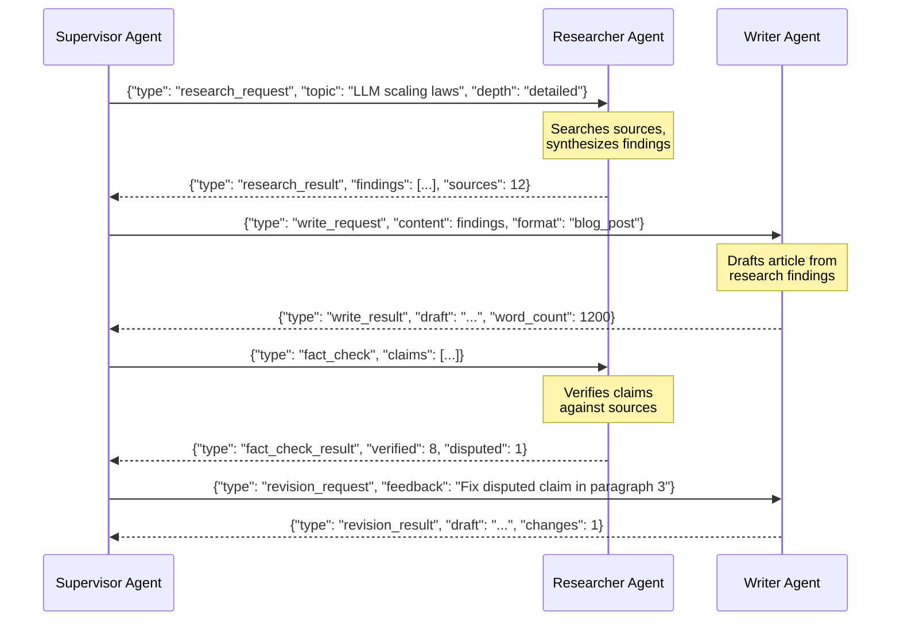
```mermaid
sequenceDiagram
    participant Supervisor as Supervisor Agent
    participant Researcher as Researcher Agent
    participant Writer as Writer Agent

    Supervisor->>Researcher: {"type": "research_request", "topic": "LLM scaling laws", "depth": "detailed"}
    Note over Researcher: Searches sources,<br/>synthesizes findings

    Researcher-->>Supervisor: {"type": "research_result", "findings": [...], "sources": 12}

    Supervisor->>Writer: {"type": "write_request", "content": findings, "format": "blog_post"}
    Note over Writer: Drafts article from<br/>research findings

    Writer-->>Supervisor: {"type": "write_result", "draft": "...", "word_count": 1200}

    Supervisor->>Researcher: {"type": "fact_check", "claims": [...]}
    Note over Researcher: Verifies claims<br/>against sources

    Researcher-->>Supervisor: {"type": "fact_check_result", "verified": 8, "disputed": 1}

    Supervisor->>Writer: {"type": "revision_request", "feedback": "Fix disputed claim in paragraph 3"}
    Writer-->>Supervisor: {"type": "revision_result", "draft": "...", "changes": 1}
```

In this sequence, the supervisor orchestrates a research-and-writing workflow by sending structured messages to specialized agents. Each message has a `type` field that tells the receiver what kind of work is expected. The researcher and writer never communicate directly -- all coordination flows through the supervisor.

**Strengths:** Simple to implement and easy to trace. You can follow the message flow linearly. Works well for supervisor and pipeline topologies.

**Weaknesses:** The sender must know the receiver's identity and interface. Adding a new agent means modifying the sender's code to include it. If Agent B is unavailable, Agent A blocks or fails -- there is no built-in buffering.

## 9.3 Pattern 2: Shared State (The Blackboard Pattern)

The **blackboard pattern** comes from classical AI research. Instead of sending messages to each other, agents read from and write to a shared data structure -- the blackboard. Each agent monitors the blackboard for changes relevant to its expertise, contributes when it can, and steps back when it has nothing to add.

Think of it like a team of specialists gathered around a whiteboard in a conference room. The detective writes clues. The forensic analyst reads the clues, adds lab results. The profiler reads the lab results and clues, adds a suspect profile. Nobody sends messages to anyone directly. They all react to what appears on the board.

**blackboard.py**

```python
from dataclasses import dataclass, field
from typing import Any, Callable
import threading
import copy


@dataclass
class BlackboardEntry:
    """A single piece of data on the blackboard."""
    key: str
    value: Any
    author: str          # which agent wrote this
    version: int = 0     # incremented on each update


class Blackboard:
    """
    Shared state that agents read from and write to.
    Thread-safe with change notifications.
    """

    def __init__(self):
        self._data: dict[str, BlackboardEntry] = {}
        self._subscribers: list[Callable[[str, BlackboardEntry], None]] = []
        self._lock = threading.Lock()

    def write(self, key: str, value: Any, author: str) -> None:
        """Write or update a value on the blackboard."""
        with self._lock:
            existing = self._data.get(key)
            version = (existing.version + 1) if existing else 1
            entry = BlackboardEntry(
                key=key, value=value, author=author, version=version
            )
            self._data[key] = entry

        # Notify subscribers outside the lock to avoid deadlocks
        for callback in self._subscribers:
            callback(key, entry)

    def read(self, key: str) -> Any | None:
        """Read a value from the blackboard. Returns None if not found."""
        with self._lock:
            entry = self._data.get(key)
            return copy.deepcopy(entry.value) if entry else None

    def read_all(self) -> dict[str, Any]:
        """Snapshot of all current blackboard data."""
        with self._lock:
            return {k: copy.deepcopy(e.value) for k, e in self._data.items()}

    def subscribe(self, callback: Callable[[str, BlackboardEntry], None]) -> None:
        """Register a callback that fires whenever any key is written."""
        self._subscribers.append(callback)


# --- Agents that use the blackboard ---

class ResearchAgent:
    def __init__(self, blackboard: Blackboard):
        self.blackboard = blackboard
        self.name = "researcher"

    def run(self, topic: str) -> None:
        # Simulate research
        findings = [
            f"Finding 1 about {topic}",
            f"Finding 2 about {topic}",
            f"Key statistic: 73% of systems use this approach",
        ]
        self.blackboard.write("research_findings", findings, author=self.name)
        self.blackboard.write("research_status", "complete", author=self.name)


class AnalysisAgent:
    def __init__(self, blackboard: Blackboard):
        self.blackboard = blackboard
        self.name = "analyst"
        # React when research findings appear
        blackboard.subscribe(self._on_update)

    def _on_update(self, key: str, entry: BlackboardEntry) -> None:
        if key == "research_status" and entry.value == "complete":
            self.analyze()

    def analyze(self) -> None:
        findings = self.blackboard.read("research_findings")
        if findings is None:
            return
        summary = f"Analysis of {len(findings)} findings: consensus detected"
        self.blackboard.write("analysis_result", summary, author=self.name)
        self.blackboard.write("analysis_status", "complete", author=self.name)


# Usage
board = Blackboard()
researcher = ResearchAgent(board)
analyst = AnalysisAgent(board)

researcher.run("LLM scaling laws")

print(board.read("analysis_result"))
# "Analysis of 3 findings: consensus detected"
```

The `Blackboard` class uses a lock for thread safety and a subscriber mechanism for reactive updates. When the `ResearchAgent` writes its findings, the `AnalysisAgent` is automatically notified through its subscription and runs its analysis without any direct communication between the two agents.

**Strengths:** Agents are fully decoupled -- they only know about the blackboard, not about each other. New agents can be added without modifying existing ones. Agents can work asynchronously and at different speeds. Natural fit for problems where partial results build on each other.

**Weaknesses:** The blackboard is shared mutable state, which introduces all the classic concurrency risks: race conditions, lost updates, and ordering ambiguity. Debugging is harder because there is no linear message trail -- you have to reconstruct the sequence of reads and writes. The blackboard can also become a bottleneck if many agents write frequently.

> **Design tip:** Use versioned entries and copy-on-read (as shown above) to reduce the risk of one agent corrupting another's view of the data. For larger systems, consider partitioning the blackboard into namespaced sections so agents only see the keys relevant to their domain.

## 9.3 Pattern 3: Event-Driven Coordination

**Event-driven coordination** uses a message bus (or event bus) as an intermediary. Agents do not send messages *to* each other. Instead, they **publish** events to named topics, and other agents **subscribe** to the topics they care about. The bus handles routing. This is the **publish-subscribe** (pub/sub) pattern.

This is where the middleware concept from Module 5, Lesson 3 reappears at a new level. In that lesson, middleware intercepted tool calls *within* a single agent. Here, message middleware intercepts messages *between* agents. The same interception principle -- inspect, transform, or block a message as it passes through -- applies at the inter-agent boundary. You can add logging middleware to the bus that records every message, a validation middleware that rejects malformed events, or a rate-limiting middleware that throttles a noisy agent.

**message_bus.py**

```python
from dataclasses import dataclass, field
from typing import Any, Callable
from collections import defaultdict
import json
import time
import logging

logger = logging.getLogger(__name__)


@dataclass
class Message:
    """A structured message passed between agents via the bus."""
    topic: str
    sender: str
    payload: dict[str, Any]
    timestamp: float = field(default_factory=time.time)
    message_id: str = field(default_factory=lambda: f"msg-{int(time.time()*1000)}")

    def to_dict(self) -> dict:
        return {
            "topic": self.topic,
            "sender": self.sender,
            "payload": self.payload,
            "timestamp": self.timestamp,
            "message_id": self.message_id,
        }


class MessageMiddleware:
    """Base class for message bus middleware. Same interception pattern
    as tool-call middleware from Module 5, Lesson 3 -- but applied to
    inter-agent messages instead of tool invocations."""

    def before_deliver(self, message: Message) -> Message | None:
        """Inspect/transform a message before delivery.
        Return the message to proceed, or None to drop it."""
        return message

    def after_deliver(self, message: Message, subscriber_count: int) -> None:
        """Called after a message has been delivered to all subscribers."""
        pass


class LoggingMiddleware(MessageMiddleware):
    """Logs every message that flows through the bus."""

    def before_deliver(self, message: Message) -> Message | None:
        logger.info(
            "BUS [%s] %s -> %s | payload_keys=%s",
            message.message_id,
            message.sender,
            message.topic,
            list(message.payload.keys()),
        )
        return message

    def after_deliver(self, message: Message, subscriber_count: int) -> None:
        logger.info(
            "BUS [%s] delivered to %d subscribers",
            message.message_id,
            subscriber_count,
        )


class MessageBus:
    """
    Pub/sub message bus for agent communication.
    Supports topic-based routing, middleware, and message history.
    """

    def __init__(self):
        self._subscribers: dict[str, list[Callable[[Message], None]]] = defaultdict(list)
        self._middlewares: list[MessageMiddleware] = []
        self._history: list[Message] = []

    def use(self, middleware: MessageMiddleware) -> "MessageBus":
        """Register a middleware component."""
        self._middlewares.append(middleware)
        return self

    def subscribe(self, topic: str, handler: Callable[[Message], None]) -> None:
        """Subscribe a handler to a topic."""
        self._subscribers[topic].append(handler)

    def publish(self, topic: str, sender: str, payload: dict[str, Any]) -> None:
        """Publish a message to a topic."""
        message = Message(topic=topic, sender=sender, payload=payload)

        # Run through middleware before delivery
        for mw in self._middlewares:
            result = mw.before_deliver(message)
            if result is None:
                return  # middleware dropped the message
            message = result

        # Deliver to all subscribers
        handlers = self._subscribers.get(topic, [])
        for handler in handlers:
            handler(message)

        # Record in history
        self._history.append(message)

        # Post-delivery middleware hooks
        for mw in reversed(self._middlewares):
            mw.after_deliver(message, len(handlers))

    def get_history(self, topic: str | None = None) -> list[dict]:
        """Retrieve message history, optionally filtered by topic."""
        messages = self._history
        if topic:
            messages = [m for m in messages if m.topic == topic]
        return [m.to_dict() for m in messages]


# --- Agents wired to the bus ---

class PlannerAgent:
    def __init__(self, bus: MessageBus):
        self.bus = bus
        self.name = "planner"
        bus.subscribe("research.complete", self._on_research_done)

    def create_plan(self, goal: str) -> None:
        tasks = [
            {"id": 1, "action": "research", "query": goal},
            {"id": 2, "action": "analyze", "depends_on": 1},
            {"id": 3, "action": "write_report", "depends_on": 2},
        ]
        self.bus.publish("plan.created", self.name, {"goal": goal, "tasks": tasks})
        # Kick off the first task
        self.bus.publish("task.assigned", self.name, tasks[0])

    def _on_research_done(self, message: Message) -> None:
        # React to research completion by assigning the next task
        self.bus.publish("task.assigned", self.name, {
            "id": 2, "action": "analyze", "input": message.payload
        })


class ResearcherAgent:
    def __init__(self, bus: MessageBus):
        self.bus = bus
        self.name = "researcher"
        bus.subscribe("task.assigned", self._on_task)

    def _on_task(self, message: Message) -> None:
        if message.payload.get("action") != "research":
            return  # not my task
        query = message.payload.get("query", "")
        findings = [f"Key insight about {query}", f"Data point: 42%"]
        self.bus.publish("research.complete", self.name, {
            "query": query, "findings": findings
        })


# --- Run the system ---
bus = MessageBus()
bus.use(LoggingMiddleware())

planner = PlannerAgent(bus)
researcher = ResearcherAgent(bus)

planner.create_plan("benefits of multi-agent systems")

# Check what happened
for entry in bus.get_history():
    print(f"  [{entry['sender']}] -> {entry['topic']}")
# [planner] -> plan.created
# [planner] -> task.assigned
# [researcher] -> research.complete
# [planner] -> task.assigned
```

Notice how the `PlannerAgent` and `ResearcherAgent` never reference each other. The planner publishes to `task.assigned`; the researcher subscribes to `task.assigned`. If you add a third agent that also listens for task assignments, the planner's code does not change. This is the decoupling advantage of pub/sub.

The `MessageBus` also keeps a complete history, which gives you a full audit trail of every interaction in the system. Combined with the `LoggingMiddleware`, you get observability without modifying any agent code.

**Strengths:** Maximum decoupling -- agents know only about topics, not about each other. Adding new agents is purely additive (subscribe to existing topics). The bus provides a natural point for cross-cutting concerns like logging, filtering, and rate limiting. Message history enables replay and debugging.

**Weaknesses:** Event-driven systems are harder to reason about than sequential message passing. The execution order depends on subscription order and timing, which can be surprising. Debugging requires tracing through event chains rather than following a call stack. You also need to handle the case where no agent subscribes to a topic (the message is silently dropped).

## 9.3 Pattern 4: Communication Protocols

The three patterns above describe *mechanisms* -- how messages travel. **Communication protocols** add *structure* -- what messages look like, what fields they must contain, and how agents negotiate capabilities. A protocol is an agreement between agents about the format and semantics of their communication.

Without a protocol, every pair of agents invents its own message format. Agent A sends `{"task": "search", "q": "..."}` while Agent B expects `{"action": "search", "query": "..."}`. This works in small systems where one person writes all the agents, but it breaks down as systems grow or when agents come from different teams or frameworks.

A well-designed protocol defines:

- **Message envelope** -- standard fields every message must have (sender, recipient, timestamp, message type, correlation ID for request-response pairs)
- **Message types** -- an enumeration of valid message types (request, response, broadcast, error, heartbeat)
- **Payload schemas** -- the expected structure of the payload for each message type
- **Conversation patterns** -- valid sequences of message types (a request must be followed by a response or an error, never by another request)

**protocol.py**

```python
from dataclasses import dataclass, field
from enum import Enum
from typing import Any
import uuid
import time


class MessageType(Enum):
    REQUEST = "request"
    RESPONSE = "response"
    BROADCAST = "broadcast"
    ERROR = "error"
    ACK = "ack"


@dataclass
class ProtocolMessage:
    """
    A structured message envelope that enforces a communication protocol.
    Every message has a standard header regardless of payload content.
    """
    sender: str
    recipient: str | None        # None for broadcasts
    message_type: MessageType
    payload: dict[str, Any]
    correlation_id: str = field(default_factory=lambda: str(uuid.uuid4()))
    reply_to: str | None = None  # correlation_id of the message being replied to
    timestamp: float = field(default_factory=time.time)

    def create_reply(
        self, sender: str, payload: dict[str, Any],
        message_type: MessageType = MessageType.RESPONSE
    ) -> "ProtocolMessage":
        """Create a properly correlated reply to this message."""
        return ProtocolMessage(
            sender=sender,
            recipient=self.sender,
            message_type=message_type,
            payload=payload,
            reply_to=self.correlation_id,
        )

    def create_error(self, sender: str, error: str) -> "ProtocolMessage":
        """Create an error reply to this message."""
        return ProtocolMessage(
            sender=sender,
            recipient=self.sender,
            message_type=MessageType.ERROR,
            payload={"error": error, "original_type": self.message_type.value},
            reply_to=self.correlation_id,
        )


class ProtocolRouter:
    """
    Routes protocol messages between agents.
    Validates message structure and enforces conversation rules.
    """

    def __init__(self):
        self._agents: dict[str, Any] = {}
        self._pending: dict[str, ProtocolMessage] = {}  # awaiting replies

    def register(self, agent_id: str, handler) -> None:
        self._agents[agent_id] = handler

    def send(self, message: ProtocolMessage) -> ProtocolMessage | None:
        """Send a message and optionally receive a synchronous reply."""
        # Validate: responses must reference a pending request
        if message.message_type == MessageType.RESPONSE:
            if message.reply_to not in self._pending:
                raise ValueError(
                    f"Response references unknown correlation_id: {message.reply_to}"
                )
            del self._pending[message.reply_to]

        # Route to recipient
        if message.recipient is None:
            # Broadcast to all agents except sender
            for agent_id, handler in self._agents.items():
                if agent_id != message.sender:
                    handler.receive(message)
            return None

        handler = self._agents.get(message.recipient)
        if handler is None:
            return message.create_error(
                "router", f"Unknown recipient: {message.recipient}"
            )

        # Track requests that expect replies
        if message.message_type == MessageType.REQUEST:
            self._pending[message.correlation_id] = message

        return handler.receive(message)
```

The `ProtocolMessage` enforces a standard envelope with sender, recipient, message type, and correlation IDs for request-response matching. The `create_reply` method ensures that responses are properly correlated with their originating requests. The `ProtocolRouter` validates that responses reference valid pending requests, catching protocol violations early.

This structured approach becomes essential when you move to cross-framework or cross-platform agent communication -- which is exactly what the **A2A (Agent-to-Agent) protocol** addresses in the next lesson.

## 9.3 Choosing the Right Pattern

There is no single best communication pattern. The right choice depends on your system's requirements.

| Concern | Direct Messaging | Blackboard | Event Bus | Protocol |
|---------|------------------|------------|-----------|----------|
| Coupling | Tight -- sender knows receiver | Loose -- agents know only the board | Loose -- agents know only topics | Medium -- agents know the schema |
| Adding agents | Modify sender code | No changes needed | No changes needed | Register with schema |
| Debugging | Easy -- follow the call chain | Hard -- reconstruct write order | Medium -- trace event chains | Easy -- structured audit trail |
| Ordering | Explicit in code | Ambiguous | Subscription-order dependent | Protocol-defined sequences |
| Best for | Supervisor, pipeline | Collaborative analysis | Swarm, reactive systems | Cross-team, cross-platform |

In practice, most production multi-agent systems combine patterns. A supervisor might use **direct messaging** to delegate tasks to workers while workers use an **event bus** to broadcast progress updates. A research team might use a **blackboard** for shared findings with a **protocol** envelope for message validation. The key is to pick the simplest pattern that meets your coupling and scalability requirements, and add structure only when you need it.

## 9.3 Summary

**Agent communication** is the mechanism that turns a collection of independent agents into a coordinated system. The four foundational patterns each offer different trade-offs.

- **Direct message passing** is the simplest: Agent A sends a structured message to Agent B and receives a response. It maps naturally to supervisor and pipeline topologies but creates tight coupling between agents.
- **Shared state (blackboard)** decouples agents by letting them read and write to a common data structure. Agents react to changes without knowing who made them. This pattern excels at collaborative problem-solving but introduces shared mutable state risks.
- **Event-driven coordination (pub/sub)** uses a message bus to decouple senders from receivers completely. Agents publish events to topics and subscribe to the topics they care about. This is the most scalable pattern for growing systems but makes execution order harder to reason about.
- **Communication protocols** add structure to any of the above mechanisms by defining message envelopes, types, and conversation rules. They are essential for cross-framework interoperability.
- The middleware interception pattern from Module 5, Lesson 3 applies at the inter-agent level too -- a message bus supports the same logging, validation, and rate-limiting middleware, just applied to messages between agents instead of tool calls within a single agent.

In the next lesson, we move from general communication patterns to a specific, open standard for inter-agent communication: the **Agent-to-Agent (A2A) protocol**. A2A takes the protocol concepts from this lesson and defines a concrete, industry-backed specification for agents built on different frameworks to discover, authenticate, and collaborate with each other.

---

    Section 9.4: Agent-to-Agent (A2A) Protocol


## 9.4 Overview

In the previous lessons, you explored why multi-agent systems exist, learned orchestration patterns for coordinating agents, and studied communication mechanisms like message passing and shared state. All of that assumed your agents live within the same framework -- the same codebase, the same runtime, the same team. But what happens when you need an agent built with LangGraph to collaborate with one built on CrewAI? Or when a travel-planning agent from one company needs to delegate hotel booking to an agent from another?

You hit the same wall that MCP solved for tools -- but at a different level. MCP (which you studied in Module 3) standardizes how agents connect to **tools**. But there was no standard for how agents connect to **other agents**. Every framework had its own internal message format, its own task model, its own discovery mechanism. An agent built in one ecosystem could not talk to an agent in another without custom glue code.

The **Agent-to-Agent (A2A) Protocol** is Google's answer to this problem. Released as an open standard in 2025, A2A defines a universal protocol for agent interoperability -- how agents discover each other, delegate tasks, exchange messages, stream progress updates, and deliver results. If MCP is the USB-C for connecting agents to tools, A2A is the HTTP for connecting agents to each other.

## 9.4 MCP vs. A2A: Complementary Standards

Before diving into A2A's architecture, it is important to understand how it relates to MCP. These two protocols are not competitors -- they solve different problems at different layers of the agent stack.

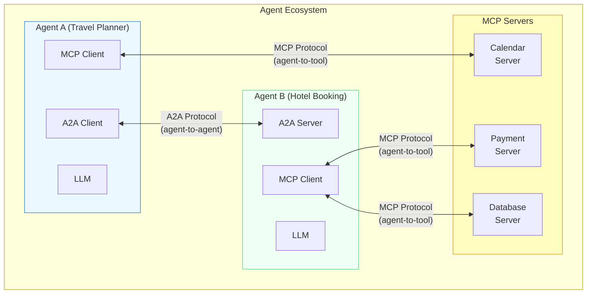
```mermaid
graph TD
    subgraph AgentSystem["Agent Ecosystem"]
        subgraph AgentA["Agent A (Travel Planner)"]
            LLM_A["LLM"]
            MCP_A["MCP Client"]
            A2A_A["A2A Client"]
        end
        subgraph AgentB["Agent B (Hotel Booking)"]
            LLM_B["LLM"]
            MCP_B["MCP Client"]
            A2A_B["A2A Server"]
        end
        subgraph Tools["MCP Servers"]
            T1["Calendar\nServer"]
            T2["Payment\nServer"]
            T3["Database\nServer"]
        end
    end
    A2A_A <-->|"A2A Protocol\n(agent-to-agent)"| A2A_B
    MCP_A <-->|"MCP Protocol\n(agent-to-tool)"| T1
    MCP_B <-->|"MCP Protocol\n(agent-to-tool)"| T2
    MCP_B <-->|"MCP Protocol\n(agent-to-tool)"| T3
    style AgentA fill:#ebf8ff,stroke:#3182ce
    style AgentB fill:#f0fff4,stroke:#68d391
    style Tools fill:#fefcbf,stroke:#d69e2e
```

**MCP** handles the vertical connection -- an agent reaching down to tools, data sources, and services. It answers: "How does my agent use this database? How does it read these files? How does it call this API?"

**A2A** handles the horizontal connection -- an agent reaching across to another agent. It answers: "How does my agent ask that agent for help? How do they exchange progress updates? How does a result come back?"

A single agent can use both protocols simultaneously. It connects to MCP servers for tool access and to other agents via A2A for delegation and collaboration. The two protocols complement each other to create a full interoperability stack.

## 9.4 The A2A Ecosystem Architecture

A2A defines a structured ecosystem with several core concepts that work together. Let's walk through each one.

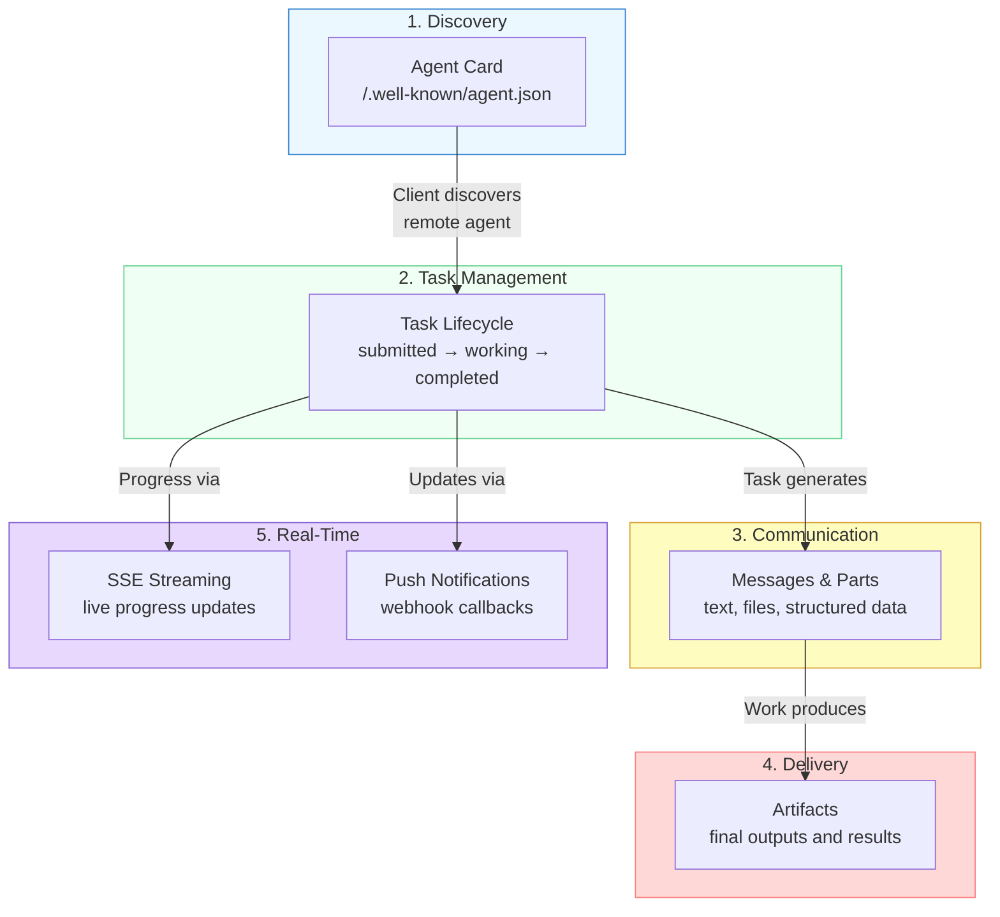
```mermaid
graph TD
    subgraph Discovery["1. Discovery"]
        AC["Agent Card\n/.well-known/agent.json"]
    end
    subgraph TaskMgmt["2. Task Management"]
        TL["Task Lifecycle\nsubmitted → working → completed"]
    end
    subgraph Messaging["3. Communication"]
        MSG["Messages & Parts\ntext, files, structured data"]
    end
    subgraph Delivery["4. Delivery"]
        ART["Artifacts\nfinal outputs and results"]
    end
    subgraph Streaming["5. Real-Time"]
        SSE["SSE Streaming\nlive progress updates"]
        PUSH["Push Notifications\nwebhook callbacks"]
    end
    AC -->|"Client discovers\nremote agent"| TL
    TL -->|"Task generates"| MSG
    MSG -->|"Work produces"| ART
    TL -->|"Progress via"| SSE
    TL -->|"Updates via"| PUSH
    style Discovery fill:#ebf8ff,stroke:#3182ce
    style TaskMgmt fill:#f0fff4,stroke:#68d391
    style Messaging fill:#fefcbf,stroke:#d69e2e
    style Delivery fill:#fed7d7,stroke:#fc8181
    style Streaming fill:#e9d8fd,stroke:#805ad5
```

## 9.4 Agent Cards: Discovery and Self-Description

Every A2A-compatible agent publishes an **Agent Card** -- a JSON metadata document that advertises who the agent is, what it can do, and how to reach it. Agent Cards are hosted at a well-known URL, following the same pattern that `robots.txt` and `openid-configuration` use.

The default location is `https://<agent-host>/.well-known/agent.json`. A client agent looking for collaborators can fetch this URL, parse the card, and decide whether the remote agent is suitable for the task at hand.

**/.well-known/agent.json**

```json
{
  "name": "Hotel Booking Agent",
  "description": "Finds and books hotels based on destination, dates, budget, and preferences",
  "url": "https://hotel-agent.example.com/a2a",
  "version": "1.0.0",
  "capabilities": {
    "streaming": true,
    "pushNotifications": true,
    "stateTransitionHistory": true
  },
  "skills": [
    {
      "id": "search-hotels",
      "name": "Hotel Search",
      "description": "Search for available hotels by location, dates, and budget",
      "tags": ["travel", "hotels", "booking"],
      "examples": [
        "Find hotels in Paris for July 10-15 under $200/night",
        "Search for pet-friendly hotels near downtown Tokyo"
      ]
    },
    {
      "id": "book-hotel",
      "name": "Hotel Reservation",
      "description": "Complete a hotel booking with guest details and payment",
      "tags": ["travel", "hotels", "reservation"],
      "examples": [
        "Book the Marriott for 3 nights starting June 1"
      ]
    }
  ],
  "defaultInputModes": ["text/plain", "application/json"],
  "defaultOutputModes": ["text/plain", "application/json"]
}
```

The key fields in an Agent Card:

- **name** and **description** tell client agents what this agent does in plain language -- an LLM can read these to decide whether to delegate a task here
- **url** is the A2A endpoint where the client sends requests
- **capabilities** advertise what protocol features the agent supports -- streaming, push notifications, state history
- **skills** list the specific things the agent can do, with human-readable examples that help both LLMs and developers understand the agent's scope
- **defaultInputModes** and **defaultOutputModes** declare what content types the agent accepts and produces

Think of the Agent Card as the agent's resume. A client agent reads multiple Agent Cards, evaluates which remote agent best fits the current task, and then initiates a conversation with it. This discovery step is what makes A2A an **open ecosystem** -- agents do not need to be preconfigured to know about each other.

## 9.4 Task Lifecycle: The Unit of Work

In A2A, every interaction between a client and a remote agent is organized around a **Task**. A Task is the fundamental unit of work -- it has an ID, a state, a history of messages, and eventually produces artifacts (results).

The Task lifecycle follows a state machine:

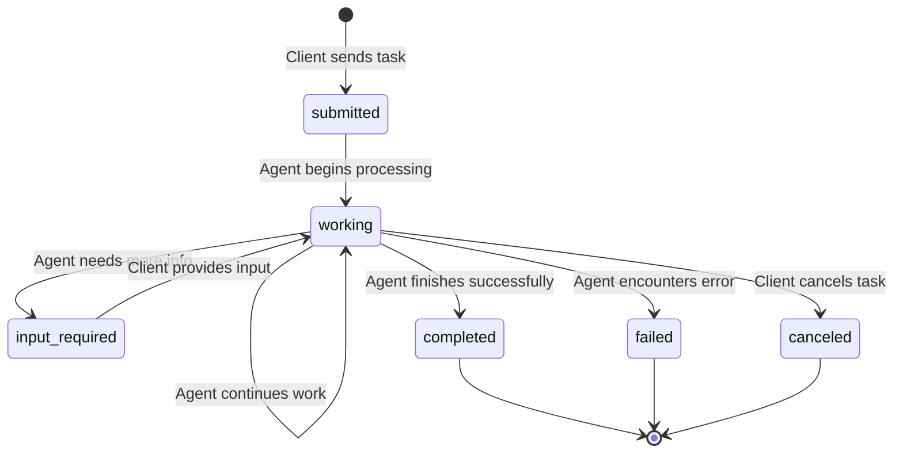
```mermaid
stateDiagram-v2
    [*] --> submitted: Client sends task
    submitted --> working: Agent begins processing
    working --> working: Agent continues work
    working --> input_required: Agent needs more info
    input_required --> working: Client provides input
    working --> completed: Agent finishes successfully
    working --> failed: Agent encounters error
    working --> canceled: Client cancels task
    completed --> [*]
    failed --> [*]
    canceled --> [*]
```

- **submitted** -- the client has sent a task to the remote agent, but the agent has not started processing yet
- **working** -- the agent is actively processing the task; during this state, the agent may send streaming updates to report progress
- **input-required** -- the agent needs additional information from the client before it can continue; this enables multi-turn collaborative workflows where the remote agent asks clarifying questions
- **completed** -- the agent has finished successfully and attached artifacts (results) to the task
- **failed** -- the agent encountered an unrecoverable error
- **canceled** -- the client decided to abort the task

The `input-required` state is particularly important. It means A2A supports **conversational delegation** -- the remote agent is not a fire-and-forget black box. It can ask follow-up questions, request clarification, and negotiate scope, just like a human colleague would.

## 9.4 Messages, Parts, and Artifacts

Communication within a Task happens through **Messages**. Each message has a role (`user` for the client agent, `agent` for the remote agent) and contains one or more **Parts**.

**Parts** are the content units inside a message. A2A defines three types:

- **TextPart** -- plain text or markdown content
- **FilePart** -- binary files (images, PDFs, spreadsheets) sent inline as base64 or referenced by URL
- **DataPart** -- structured JSON data for machine-readable information

This multi-part design means agents can exchange rich content -- not just text strings. A client can send an image for analysis, receive a spreadsheet back, or exchange structured JSON payloads that both sides can parse programmatically.

**Artifacts** are the final outputs of a Task. When the remote agent completes its work, it packages the results as Artifacts attached to the Task. Artifacts also contain Parts, so a completed hotel booking might produce a TextPart with a confirmation summary and a DataPart with structured booking details (confirmation number, dates, price).

## 9.4 The A2A Task Flow

Let's trace a complete A2A interaction from discovery to result delivery. This is the sequence that plays out when one agent delegates work to another.

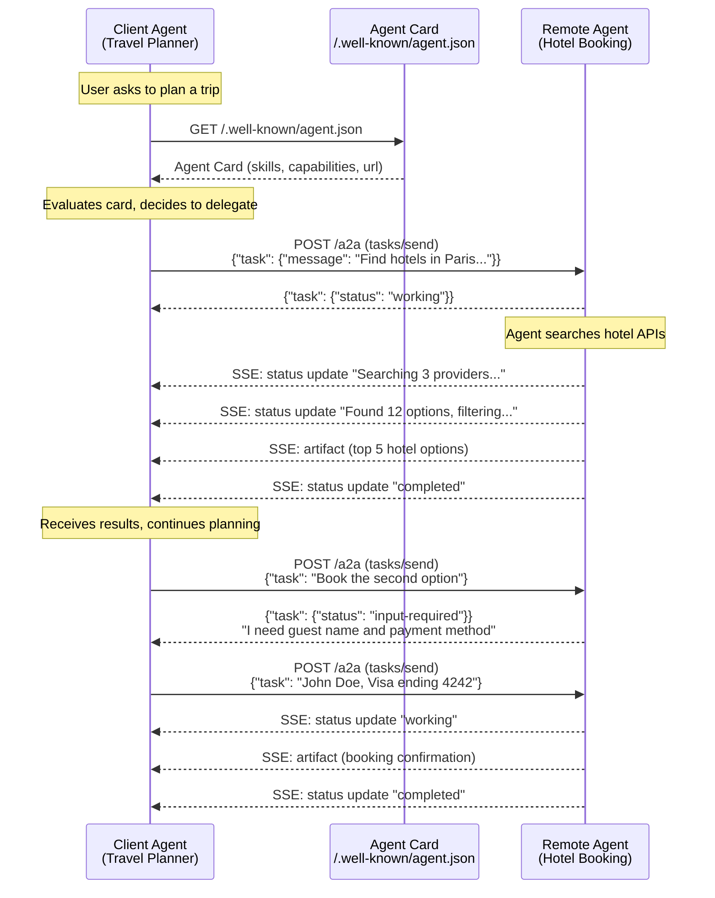
```mermaid
sequenceDiagram
    participant Client as Client Agent<br/>(Travel Planner)
    participant Card as Agent Card<br/>/.well-known/agent.json
    participant Server as Remote Agent<br/>(Hotel Booking)
    Note over Client: User asks to plan a trip
    Client->>Card: GET /.well-known/agent.json
    Card-->>Client: Agent Card (skills, capabilities, url)
    Note over Client: Evaluates card, decides to delegate
    Client->>Server: POST /a2a (tasks/send)<br/>{"task": {"message": "Find hotels in Paris..."}}
    Server-->>Client: {"task": {"status": "working"}}
    Note over Server: Agent searches hotel APIs
    Server-->>Client: SSE: status update "Searching 3 providers..."
    Server-->>Client: SSE: status update "Found 12 options, filtering..."
    Server-->>Client: SSE: artifact (top 5 hotel options)
    Server-->>Client: SSE: status update "completed"
    Note over Client: Receives results, continues planning
    Client->>Server: POST /a2a (tasks/send)<br/>{"task": "Book the second option"}
    Server-->>Client: {"task": {"status": "input-required"}}<br/>"I need guest name and payment method"
    Client->>Server: POST /a2a (tasks/send)<br/>{"task": "John Doe, Visa ending 4242"}
    Server-->>Client: SSE: status update "working"
    Server-->>Client: SSE: artifact (booking confirmation)
    Server-->>Client: SSE: status update "completed"
```

The flow has four stages:

**Discovery.** The client fetches the Agent Card from the well-known URL. It reads the skills, capabilities, and examples to decide whether this agent is the right fit. An LLM can reason over these descriptions just like it reasons over MCP tool descriptions.

**Task initiation.** The client sends a `tasks/send` request with a new Task containing the initial message. The remote agent acknowledges and begins working.

**Streaming updates.** While the agent works, it streams progress through **Server-Sent Events (SSE)**. The client receives real-time status updates, partial results, and eventually the final artifacts. This is critical for long-running tasks -- the client knows the agent is making progress, not hanging.

**Multi-turn interaction.** If the agent needs more information, it transitions to `input-required` and sends a message explaining what it needs. The client provides the missing information, and the agent resumes working. This back-and-forth can happen multiple times within a single Task.

## 9.4 Streaming and Push Notifications

A2A provides two mechanisms for real-time updates, suited to different deployment scenarios.

**SSE (Server-Sent Events)** is used when the client wants to watch a task in real time. The client sends a `tasks/sendSubscribe` request instead of `tasks/send`, and the server keeps the HTTP connection open, streaming `TaskStatusUpdateEvent` and `TaskArtifactUpdateEvent` messages as work progresses. This is ideal when the client agent is actively waiting for results.

**Push Notifications** are used when the client does not want to hold a connection open. The client registers a webhook URL with the remote agent via `tasks/pushNotification/set`. The agent calls that webhook whenever the task status changes. This is better for long-running tasks where the client wants to go do other work and get notified when results are ready -- similar to how CI/CD systems send webhook notifications when a build completes.

> **When to use which?** Use SSE streaming when the client needs results quickly and will use them immediately. Use push notifications for tasks that take minutes or hours, where the client should not block waiting.

## 9.4 Implementing A2A: Server and Client

Let's build a minimal A2A server and client in Python. The server exposes a simple text-summarization agent. The client discovers it and sends a task.

**a2a_server.py**

```python
from fastapi import FastAPI, Request
from fastapi.responses import JSONResponse
import uuid

app = FastAPI()

# Agent Card — describes this agent's capabilities
AGENT_CARD = {
    "name": "Summarization Agent",
    "description": "Summarizes text documents into concise bullet points",
    "url": "http://localhost:8000/a2a",
    "version": "1.0.0",
    "capabilities": {
        "streaming": False,
        "pushNotifications": False,
        "stateTransitionHistory": False,
    },
    "skills": [
        {
            "id": "summarize",
            "name": "Text Summarization",
            "description": "Condense long text into key bullet points",
            "tags": ["nlp", "summarization"],
            "examples": ["Summarize this research paper"],
        }
    ],
    "defaultInputModes": ["text/plain"],
    "defaultOutputModes": ["text/plain"],
}

# In-memory task store
tasks: dict[str, dict] = {}


@app.get("/.well-known/agent.json")
async def get_agent_card():
    """Serve the Agent Card for discovery."""
    return JSONResponse(content=AGENT_CARD)


@app.post("/a2a")
async def handle_a2a(request: Request):
    """Handle incoming A2A JSON-RPC requests."""
    body = await request.json()
    method = body.get("method")

    if method == "tasks/send":
        return await handle_task_send(body)
    elif method == "tasks/get":
        return await handle_task_get(body)
    else:
        return JSONResponse(
            content={"error": f"Unknown method: {method}"},
            status_code=400,
        )


async def handle_task_send(body: dict) -> JSONResponse:
    """Process a new task or continue an existing one."""
    params = body["params"]
    task_id = params.get("id", str(uuid.uuid4()))
    message = params["message"]

    # Extract the text content from the message parts
    user_text = ""
    for part in message.get("parts", []):
        if part.get("type") == "text":
            user_text += part["text"]

    # Simulate summarization (replace with real LLM call)
    summary = summarize_text(user_text)

    # Build the completed task with an artifact
    task = {
        "id": task_id,
        "status": {"state": "completed"},
        "artifacts": [
            {
                "parts": [{"type": "text", "text": summary}],
                "name": "summary",
            }
        ],
    }
    tasks[task_id] = task

    return JSONResponse(content={"id": body["id"], "result": task})


async def handle_task_get(body: dict) -> JSONResponse:
    """Retrieve the current state of a task."""
    task_id = body["params"]["id"]
    task = tasks.get(task_id)
    if not task:
        return JSONResponse(
            content={"error": f"Task {task_id} not found"},
            status_code=404,
        )
    return JSONResponse(content={"id": body["id"], "result": task})


def summarize_text(text: str) -> str:
    """Placeholder summarization — replace with an LLM call."""
    sentences = text.split(". ")
    if len(sentences) <= 3:
        return text
    return "Key points:\\n" + "\\n".join(
        f"- {s.strip()}" for s in sentences[:5]
    )
```

The server implements three things: the Agent Card endpoint for discovery, the `tasks/send` method for receiving work, and the `tasks/get` method for checking task status. In a production implementation, the summarization would call an LLM and might use streaming to report progress, but the protocol structure stays the same.

Now the client side -- an agent that discovers and delegates to the server above:

**a2a_client.py**

```python
import httpx
import asyncio


class A2AClient:
    """Minimal A2A client for discovering and delegating to remote agents."""

    def __init__(self, agent_base_url: str):
        self.base_url = agent_base_url
        self.agent_card = None
        self.client = httpx.AsyncClient()

    async def discover(self) -> dict:
        """Fetch the remote agent's Agent Card."""
        url = f"{self.base_url}/.well-known/agent.json"
        response = await self.client.get(url)
        response.raise_for_status()
        self.agent_card = response.json()
        return self.agent_card

    async def send_task(self, message_text: str, task_id: str | None = None) -> dict:
        """Send a task to the remote agent."""
        if not self.agent_card:
            await self.discover()

        payload = {
            "jsonrpc": "2.0",
            "id": 1,
            "method": "tasks/send",
            "params": {
                "id": task_id or "task-001",
                "message": {
                    "role": "user",
                    "parts": [{"type": "text", "text": message_text}],
                },
            },
        }
        response = await self.client.post(
            self.agent_card["url"], json=payload
        )
        response.raise_for_status()
        return response.json()["result"]

    async def get_task(self, task_id: str) -> dict:
        """Check the status of an existing task."""
        payload = {
            "jsonrpc": "2.0",
            "id": 2,
            "method": "tasks/get",
            "params": {"id": task_id},
        }
        response = await self.client.post(
            self.agent_card["url"], json=payload
        )
        response.raise_for_status()
        return response.json()["result"]

    async def close(self):
        await self.client.aclose()


async def main():
    client = A2AClient("http://localhost:8000")

    # Step 1: Discover the remote agent
    card = await client.discover()
    print(f"Discovered: {card['name']}")
    print(f"Skills: {[s['name'] for s in card['skills']]}")

    # Step 2: Send a task
    article = (
        "Machine learning models require large datasets for training. "
        "Transfer learning reduces data requirements by reusing pretrained weights. "
        "Fine-tuning adapts a general model to a specific domain. "
        "This approach has democratized AI by lowering the barrier to entry. "
        "Small teams can now build competitive models without massive compute budgets."
    )
    result = await client.send_task(article)
    print(f"\\nTask status: {result['status']['state']}")
    print(f"Result: {result['artifacts'][0]['parts'][0]['text']}")

    await client.close()


asyncio.run(main())
```

Notice the pattern: discover the Agent Card, evaluate the skills, send a task with a message, receive artifacts. This mirrors the MCP lifecycle you already know (initialize, discover, invoke) but at the agent level instead of the tool level.

## 9.4 A2A vs. MCP: A Side-by-Side Comparison

Now that you understand both protocols, here is how they compare:

| Dimension | MCP | A2A |
|-----------|-----|-----|
| **Connects** | Agents to tools | Agents to agents |
| **Discovery** | Host configures servers | Agent Cards at well-known URLs |
| **Unit of work** | Tool call (single function) | Task (multi-turn, stateful) |
| **Communication** | Request-response | Messages with Parts (text, files, data) |
| **Lifecycle** | Stateless per call | Stateful (submitted → working → completed) |
| **Streaming** | Server-sent events | SSE + push notifications |
| **Multi-turn** | Not applicable | input-required state enables back-and-forth |
| **Created by** | Anthropic | Google |
| **Relationship** | Complementary | Complementary |

The key difference is the **unit of work**. An MCP tool call is a single function invocation -- call with arguments, get a result. An A2A Task is a potentially long-running, multi-turn collaboration. The remote agent might search multiple sources, ask clarifying questions, iterate on results, and eventually deliver a rich artifact. A2A treats remote agents as intelligent collaborators, not simple functions.

## 9.4 When to Use A2A

A2A shines in scenarios where agents need to collaborate across organizational or framework boundaries:

- **Cross-framework orchestration** -- your LangGraph supervisor needs to delegate to a CrewAI specialist agent. A2A provides the interoperability layer so they speak the same protocol.
- **Enterprise agent ecosystems** -- different teams build different agents. A2A lets them discover and use each other's agents without tight coupling.
- **Agent marketplaces** -- third-party agents can publish Agent Cards and offer their capabilities as services. A client agent discovers and evaluates them dynamically.
- **Long-running collaborative tasks** -- when the delegated work takes minutes or hours, A2A's task lifecycle, streaming, and push notifications provide the infrastructure that simple function calls cannot.

If your agents are all in the same codebase and the same framework, you probably do not need A2A -- direct function calls or the communication patterns from Lesson 03 are simpler. A2A becomes valuable when you cross boundaries: different frameworks, different teams, different organizations, different runtimes.

> **The interoperability stack:** In a mature multi-agent system, MCP handles the agent-to-tool layer, A2A handles the agent-to-agent layer, and your orchestration pattern (from Lesson 02) handles the coordination logic. Each protocol solves one problem well.

## 9.4 Summary

The **Agent-to-Agent (A2A) Protocol** is an open standard that enables agents built on different frameworks to discover each other and collaborate on tasks:

- **The problem:** Without a standard, agents from different frameworks cannot interoperate. A2A provides a universal protocol for agent-to-agent communication, complementing MCP's agent-to-tool protocol.
- **Agent Cards** are JSON metadata documents hosted at `/.well-known/agent.json` that advertise an agent's name, capabilities, skills, and endpoint -- enabling dynamic discovery.
- **Tasks** are the unit of work in A2A, following a lifecycle: **submitted → working → input-required → completed/failed/canceled**. The `input-required` state enables multi-turn conversational delegation.
- **Messages and Parts** carry the content of a conversation within a Task. Parts can be text, files, or structured data, enabling rich multi-modal exchange between agents.
- **Artifacts** are the final outputs attached to a completed Task, packaging the results for the client agent to consume.
- **Streaming (SSE)** and **push notifications** provide real-time progress updates -- SSE for active monitoring, webhooks for fire-and-forget long-running tasks.
- **MCP and A2A are complementary:** MCP connects agents to tools (vertical), A2A connects agents to agents (horizontal). A production agent system often uses both.
- In the next lesson, you will learn how to decompose complex tasks and delegate subtasks to specialized agents -- the orchestration logic that sits on top of protocols like A2A.

---

    Section 9.5: Task Decomposition and Delegation


## 9.5 Overview

In the previous lesson, we explored Google's **Agent-to-Agent (A2A) protocol** -- an open standard that lets agents discover each other and exchange messages across platforms. A2A solves the *interoperability* problem: how agents connect. But connectivity alone does not make a multi-agent system effective. The harder question is: once you have a team of specialized agents, how do you decide what each one should work on?

This is the problem of **task decomposition and delegation** -- taking a complex request that no single agent can handle well and breaking it into subtasks that specialized agents can execute efficiently. If orchestration patterns (Lesson 02) define *who is in charge*, and communication protocols (Lessons 03-04) define *how agents talk*, then task decomposition defines *what each agent actually does*.

The idea is not new. You encountered a single-agent version in Module 4, Lesson 03: the **Plan-and-Execute** architecture, where a planner breaks a task into steps and an executor works through them sequentially. Multi-agent task decomposition extends this idea by distributing the execution phase across *multiple* specialized agents, each handling the subtasks that match their expertise. The planner becomes an orchestrator. The single executor becomes a worker pool. And the simple step list becomes a dependency-aware task graph.

## 9.5 The Decomposition Pipeline

Every multi-agent task decomposition system follows the same core pipeline: receive a complex task, break it into subtasks, assign those subtasks to appropriate agents, execute them (possibly in parallel), and aggregate the results into a final output.

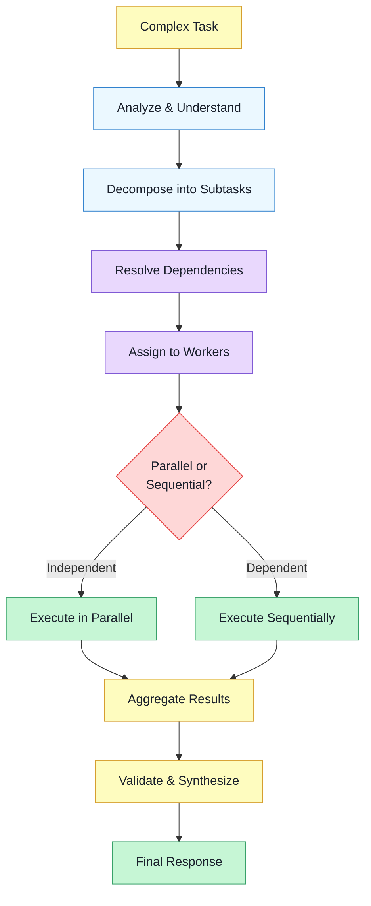
```mermaid
flowchart TD
    INPUT["Complex Task"] --> ANALYZE["Analyze & Understand"]
    ANALYZE --> DECOMPOSE["Decompose into Subtasks"]
    DECOMPOSE --> DEP["Resolve Dependencies"]
    DEP --> ASSIGN["Assign to Workers"]
    ASSIGN --> PAR{"Parallel or<br/>Sequential?"}
    PAR -- "Independent" --> EXEC_P["Execute in Parallel"]
    PAR -- "Dependent" --> EXEC_S["Execute Sequentially"]
    EXEC_P --> AGG["Aggregate Results"]
    EXEC_S --> AGG
    AGG --> VALIDATE["Validate & Synthesize"]
    VALIDATE --> OUTPUT["Final Response"]

    style INPUT fill:#fefcbf,stroke:#d69e2e,color:#1a202c
    style ANALYZE fill:#ebf8ff,stroke:#3182ce,color:#1a202c
    style DECOMPOSE fill:#ebf8ff,stroke:#3182ce,color:#1a202c
    style DEP fill:#e9d8fd,stroke:#805ad5,color:#1a202c
    style ASSIGN fill:#e9d8fd,stroke:#805ad5,color:#1a202c
    style PAR fill:#fed7d7,stroke:#e53e3e,color:#1a202c
    style EXEC_P fill:#c6f6d5,stroke:#38a169,color:#1a202c
    style EXEC_S fill:#c6f6d5,stroke:#38a169,color:#1a202c
    style AGG fill:#fefcbf,stroke:#d69e2e,color:#1a202c
    style VALIDATE fill:#fefcbf,stroke:#d69e2e,color:#1a202c
    style OUTPUT fill:#c6f6d5,stroke:#38a169,color:#1a202c
```

The pipeline has two critical decision points. First, during decomposition, the orchestrator must choose the right **decomposition strategy** -- should it split by function, by data, or by hierarchy? Second, after resolving dependencies, it must decide which subtasks can run in parallel and which must wait for upstream results. Getting these decisions right determines whether your multi-agent system is faster than a single agent or just more complicated.

## 9.5 Decomposition Strategies

Not all tasks decompose the same way. The right strategy depends on the structure of the work itself. There are three fundamental approaches, and most real systems combine them.

### Functional Decomposition

**Functional decomposition** splits a task by capability or role. Each subtask requires a different type of expertise, and you assign it to the agent that specializes in that area.

Consider a request like "Build a market analysis report for launching a SaaS product in Europe." A functional decomposition might produce:

- **Market Research Agent** -- gather market size data, growth trends, and competitor landscape
- **Legal/Compliance Agent** -- analyze GDPR requirements, data residency rules, and licensing
- **Financial Agent** -- model pricing strategies, revenue projections, and cost structures
- **Writing Agent** -- synthesize findings into a cohesive, well-structured report

Each agent brings different knowledge and tools. The market researcher uses web search and data APIs. The legal agent queries regulatory databases. The financial agent runs spreadsheet models. Functional decomposition works best when the subtasks require genuinely different skills.

### Data-Parallel Decomposition

**Data-parallel decomposition** applies the same operation across partitions of data. Every worker does the same type of work, just on a different slice of the input.

Consider: "Analyze customer sentiment across 10,000 support tickets from last quarter." Rather than one agent reading all 10,000 tickets, you partition the data:

- **Worker 1** -- analyze tickets 1-2,500
- **Worker 2** -- analyze tickets 2,501-5,000
- **Worker 3** -- analyze tickets 5,001-7,500
- **Worker 4** -- analyze tickets 7,501-10,000

All four workers run the same sentiment analysis prompt. Their results are aggregated into a final summary. Data-parallel decomposition is straightforward -- the agents are interchangeable -- and it scales linearly. It is the right choice whenever the bottleneck is volume rather than complexity.

### Hierarchical Decomposition

**Hierarchical decomposition** applies decomposition recursively. A top-level orchestrator breaks the task into major subtasks, each of which is assigned to a sub-orchestrator that further decomposes its piece.

Consider: "Migrate our entire infrastructure from AWS to GCP." The top-level orchestrator splits this into major workstreams -- compute, storage, networking, databases, security. Each workstream is assigned to a sub-orchestrator that further decomposes it. The compute sub-orchestrator might split its work into VM migration, container migration, and serverless migration, each handled by a specialist agent.

Hierarchical decomposition is necessary when the task is too large for any single orchestrator to decompose in one pass. It mirrors how large organizations structure work -- executives set strategy, managers define projects, team leads assign tasks. The trade-off is complexity: more layers mean more coordination overhead and more places where communication can break down.

## 9.5 Delegation Patterns: Push vs. Pull

Once you have subtasks, you need to get them to the right agents. There are two fundamental patterns for this, and they have very different characteristics.

### Push-Based Delegation

In **push-based delegation**, the orchestrator decides which worker receives each subtask and sends it directly. The orchestrator maintains a registry of available agents, their capabilities, and their current load. When a new subtask is created, the orchestrator selects the best-fit agent and pushes the task to it.

Push-based delegation gives the orchestrator full control over assignment. It can implement sophisticated routing -- considering agent specialization, current workload, past performance, and even cost. The downside is that the orchestrator becomes a bottleneck: it must know about every agent and make every routing decision.

### Pull-Based Delegation

In **pull-based delegation**, subtasks are placed on a shared **task queue**, and worker agents pull tasks when they are ready. Each worker monitors the queue and claims tasks that match its capabilities. The orchestrator's job is simply to decompose the task and enqueue the subtasks -- it does not need to know which specific agent will handle each one.

Pull-based delegation is more scalable and resilient. Workers self-balance their load. New workers can join without reconfiguring the orchestrator. If a worker crashes, its unclaimed tasks remain on the queue for others to pick up. The trade-off is less control: the orchestrator cannot guarantee which agent handles which task or in what order.

> **In practice**, most production systems use a hybrid. The orchestrator pushes tasks to specific queues based on capability (e.g., "research-queue", "code-queue"), and workers pull from the queue that matches their specialization. This gives you capability-based routing with self-balancing load distribution.

## 9.5 The Delegation Architecture

The following diagram shows a complete delegation system with a task decomposer, task queue, worker pool, and result aggregator. This is the architecture you would build for a production multi-agent system.

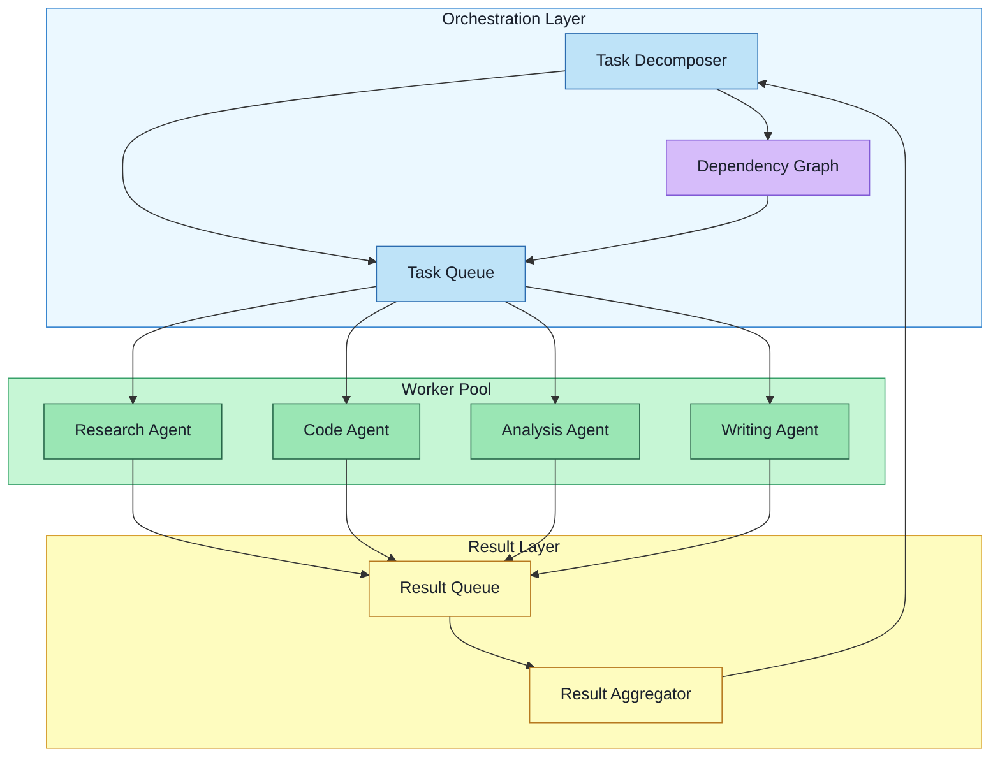
```mermaid
graph TD
    subgraph Orchestration["Orchestration Layer"]
        TD["Task Decomposer"] --> TQ["Task Queue"]
        TD --> DG["Dependency Graph"]
        DG --> TQ
    end

    subgraph Workers["Worker Pool"]
        W1["Research Agent"]
        W2["Code Agent"]
        W3["Analysis Agent"]
        W4["Writing Agent"]
    end

    subgraph Results["Result Layer"]
        RQ["Result Queue"]
        AGG["Result Aggregator"]
        RQ --> AGG
    end

    TQ --> W1
    TQ --> W2
    TQ --> W3
    TQ --> W4
    W1 --> RQ
    W2 --> RQ
    W3 --> RQ
    W4 --> RQ
    AGG --> TD

    style Orchestration fill:#ebf8ff,stroke:#3182ce,color:#1a202c
    style Workers fill:#c6f6d5,stroke:#38a169,color:#1a202c
    style Results fill:#fefcbf,stroke:#d69e2e,color:#1a202c
    style TD fill:#bee3f8,stroke:#2b6cb0,color:#1a202c
    style TQ fill:#bee3f8,stroke:#2b6cb0,color:#1a202c
    style DG fill:#d6bcfa,stroke:#805ad5,color:#1a202c
    style W1 fill:#9ae6b4,stroke:#276749,color:#1a202c
    style W2 fill:#9ae6b4,stroke:#276749,color:#1a202c
    style W3 fill:#9ae6b4,stroke:#276749,color:#1a202c
    style W4 fill:#9ae6b4,stroke:#276749,color:#1a202c
    style RQ fill:#fefcbf,stroke:#b7791f,color:#1a202c
    style AGG fill:#fefcbf,stroke:#b7791f,color:#1a202c
```

Notice the feedback loop from the **Result Aggregator** back to the **Task Decomposer**. This is essential for adaptive decomposition. When a worker returns an unexpected result -- maybe the research agent discovers that the topic is much broader than expected -- the decomposer can generate additional subtasks or re-decompose the remaining work. This mirrors the replanning capability of Plan-and-Execute agents from Module 4, but now operating across a distributed team.

The **Dependency Graph** is what makes the system smart about execution order. It tracks which subtasks depend on the output of other subtasks, ensuring that a subtask is only released to the queue when all its prerequisites are complete.

## 9.5 Handling Dependencies Between Subtasks

Real tasks are rarely a flat list of independent items. Subtasks have dependencies -- the writing agent cannot draft a report section until the research agent has gathered the data for it. Managing these dependencies correctly is what separates a working multi-agent system from a chaotic one.

A **dependency graph** represents subtasks as nodes and dependencies as directed edges. Before enqueueing a subtask, the orchestrator checks whether all upstream dependencies have completed. Subtasks with no unresolved dependencies are released immediately, allowing maximum parallelism.

Consider a task: "Write a technical blog post comparing three database solutions." The dependency structure looks like this:

- **Subtask A** (Research DB 1), **Subtask B** (Research DB 2), **Subtask C** (Research DB 3) -- these are independent and can run in parallel
- **Subtask D** (Create comparison table) -- depends on A, B, and C
- **Subtask E** (Write introduction) -- independent of all others
- **Subtask F** (Write conclusion and recommendations) -- depends on D
- **Subtask G** (Assemble and edit final post) -- depends on D, E, and F

The optimal execution schedule runs A, B, C, and E in parallel. Once A, B, and C complete, D starts. Once D completes, F starts. Once D, E, and F all complete, G starts. This dependency-aware scheduling minimizes total execution time compared to running everything sequentially.

## 9.5 Implementing a Task Decomposer

Let's build a practical task decomposer that analyzes a complex request, breaks it into subtasks with dependency information, and delegates them to specialized worker agents. This implementation uses an LLM to perform the decomposition and a simple execution engine to manage dependencies.

**task_decomposer.py**

```python
import anthropic
import json
import asyncio
from dataclasses import dataclass, field
from enum import Enum

client = anthropic.Anthropic()

class TaskStatus(Enum):
    PENDING = "pending"
    READY = "ready"
    RUNNING = "running"
    COMPLETED = "completed"
    FAILED = "failed"

@dataclass
class Subtask:
    id: str
    description: str
    agent_type: str          # Which specialist handles this
    dependencies: list[str]  # IDs of subtasks this depends on
    status: TaskStatus = TaskStatus.PENDING
    result: str | None = None

DECOMPOSITION_PROMPT = """You are a task decomposition engine for a multi-agent system.

Given a complex task, break it into subtasks. For each subtask, specify:
- id: a short unique identifier (e.g., "research_1", "code_1")
- description: what the subtask should accomplish
- agent_type: one of "research", "code", "analysis", "writing"
- dependencies: list of subtask IDs that must complete first (empty if independent)

Return valid JSON with a "subtasks" array. Maximize parallelism:
only add a dependency if the subtask truly needs another's output.

Task: {task}"""

def decompose_task(task: str) -> list[Subtask]:
    """Use an LLM to decompose a complex task into subtasks."""

    response = client.messages.create(
        model="claude-sonnet-4-20250514",
        max_tokens=2048,
        messages=[{
            "role": "user",
            "content": DECOMPOSITION_PROMPT.format(task=task)
        }]
    )

    # Parse the JSON from the LLM response
    text = response.content[0].text
    # Extract JSON block if wrapped in markdown fences
    if "\`\`\`json" in text:
        text = text.split("\`\`\`json")[1].split("\`\`\`")[0]
    elif "\`\`\`" in text:
        text = text.split("\`\`\`")[1].split("\`\`\`")[0]

    data = json.loads(text)

    return [
        Subtask(
            id=s["id"],
            description=s["description"],
            agent_type=s["agent_type"],
            dependencies=s.get("dependencies", []),
        )
        for s in data["subtasks"]
    ]

# ---------- Worker agents ----------

WORKER_PROMPTS = {
    "research": "You are a research specialist. Gather key facts and data. Be concise.",
    "code": "You are a coding specialist. Write clean, working code. Explain briefly.",
    "analysis": "You are an analysis specialist. Compare, evaluate, and draw conclusions.",
    "writing": "You are a writing specialist. Produce clear, well-structured prose.",
}

def execute_subtask(subtask: Subtask, context: dict[str, str]) -> str:
    """Execute a single subtask using the appropriate worker agent."""

    # Build context from completed dependencies
    dep_context = ""
    for dep_id in subtask.dependencies:
        if dep_id in context:
            dep_context += f"\\n--- Result from [{dep_id}] ---\\n{context[dep_id]}\\n"

    system = WORKER_PROMPTS.get(subtask.agent_type, "You are a helpful assistant.")

    messages = [{
        "role": "user",
        "content": (
            f"Task: {subtask.description}"
            + (f"\\n\\nContext from prior subtasks:{dep_context}" if dep_context else "")
        ),
    }]

    response = client.messages.create(
        model="claude-sonnet-4-20250514",
        max_tokens=1024,
        system=system,
        messages=messages,
    )
    return response.content[0].text

# ---------- Orchestration engine ----------

def get_ready_tasks(subtasks: list[Subtask]) -> list[Subtask]:
    """Find subtasks whose dependencies are all completed."""
    completed_ids = {s.id for s in subtasks if s.status == TaskStatus.COMPLETED}
    return [
        s for s in subtasks
        if s.status == TaskStatus.PENDING
        and all(dep in completed_ids for dep in s.dependencies)
    ]

def run_pipeline(task: str) -> str:
    """Decompose a task, resolve dependencies, and execute with workers."""

    print(f"Decomposing task: {task}\\n")
    subtasks = decompose_task(task)

    for s in subtasks:
        deps = ", ".join(s.dependencies) if s.dependencies else "none"
        print(f"  [{s.id}] ({s.agent_type}) deps=[{deps}] {s.description}")

    print(f"\\n{'='*60}")
    print(f"Executing {len(subtasks)} subtasks...\\n")

    results: dict[str, str] = {}
    iteration = 0

    while any(s.status != TaskStatus.COMPLETED for s in subtasks):
        ready = get_ready_tasks(subtasks)
        if not ready:
            failed = [s for s in subtasks if s.status == TaskStatus.FAILED]
            if failed:
                raise RuntimeError(f"Deadlock: failed subtasks {[s.id for s in failed]}")
            raise RuntimeError("Deadlock: no tasks ready but not all completed")

        iteration += 1
        print(f"--- Wave {iteration}: running {[s.id for s in ready]} in parallel ---")

        # In production, you would use asyncio.gather() here.
        # Sequential execution shown for clarity.
        for subtask in ready:
            subtask.status = TaskStatus.RUNNING
            try:
                result = execute_subtask(subtask, results)
                subtask.result = result
                subtask.status = TaskStatus.COMPLETED
                results[subtask.id] = result
                print(f"  Completed [{subtask.id}]")
            except Exception as e:
                subtask.status = TaskStatus.FAILED
                print(f"  FAILED [{subtask.id}]: {e}")

    print(f"\\n{'='*60}")
    print(f"All subtasks completed in {iteration} waves.\\n")

    # Aggregate: return the result of the final subtask
    # (the one with no downstream dependents)
    all_deps = {dep for s in subtasks for dep in s.dependencies}
    final_tasks = [s for s in subtasks if s.id not in all_deps]

    return "\\n\\n".join(
        f"[{s.id}] {s.result}" for s in final_tasks if s.result
    )

# ---------- Run it ----------
if __name__ == "__main__":
    result = run_pipeline(
        "Write a technical comparison of PostgreSQL vs MongoDB for "
        "a startup building a SaaS analytics platform. Include "
        "performance benchmarks, cost analysis, and a recommendation."
    )
    print("FINAL OUTPUT:")
    print(result)
```

Let's walk through the key design decisions in this implementation:

**The `decompose_task` function** uses an LLM to perform the decomposition itself. This is a common pattern -- rather than hardcoding decomposition rules, you let the language model analyze the task and decide how to split it. The structured JSON output ensures the decomposition is machine-readable.

**The `get_ready_tasks` function** implements dependency resolution. It scans all pending subtasks and returns only those whose dependencies have all completed. This is the core of the execution scheduler -- it determines the "waves" of parallel execution.

**The `execute_subtask` function** demonstrates context passing. When a subtask has dependencies, the results from those upstream tasks are injected into the worker's prompt as context. This is how information flows through the dependency graph -- each worker sees exactly the upstream results it needs, and nothing more.

**The `run_pipeline` function** ties everything together in a wave-based execution loop. Each wave runs all currently-ready tasks (in production, you would use `asyncio.gather()` for true parallelism). After each wave, newly unblocked tasks become ready for the next wave. The loop continues until all tasks are completed.

## 9.5 From Plan-and-Execute to Multi-Agent Decomposition

If this architecture looks familiar, it should. In Module 4, Lesson 03, you learned how **Plan-and-Execute** agents separate planning from execution within a single agent. Multi-agent task decomposition is the natural evolution of that pattern:

| | Plan-and-Execute (Module 4) | Multi-Agent Decomposition |
|---|---|---|
| **Planner** | Single LLM call creates step list | Orchestrator LLM creates subtask graph |
| **Executor** | Same agent executes all steps | Specialized workers execute their subtasks |
| **Parallelism** | Sequential by default | Dependency-aware parallel execution |
| **Replanning** | Replanner updates remaining steps | Aggregator feeds results back to decomposer |
| **Scalability** | Limited by single agent's context | Scales with worker pool size |

The key insight is that Plan-and-Execute is essentially multi-agent decomposition with a worker pool of size one. When you add specialized workers and dependency-aware scheduling, you get both speed (parallelism) and quality (specialization).

## 9.5 Result Aggregation Strategies

Decomposition is only half the problem. Once workers complete their subtasks, you need to combine their outputs into a coherent final result. The right **aggregation strategy** depends on the nature of the subtasks.

**Sequential assembly** works when subtasks produce parts of an ordered output -- like sections of a document. The aggregator concatenates results in the correct order, possibly with an editing pass for consistency.

**Reduction** works when subtasks produce comparable outputs -- like sentiment scores from data-parallel analysis. The aggregator computes a summary statistic (average, majority vote, distribution) across all worker results.

**Synthesis** works when subtasks produce complementary information that needs to be woven together -- like research findings from different domains. The aggregator uses an LLM to read all results and produce a unified narrative that incorporates insights from every subtask.

**Hierarchical rollup** works with hierarchical decomposition. Each sub-orchestrator aggregates its workers' results into a summary, then passes that summary up to its parent orchestrator. The top-level aggregator combines summaries from all workstreams.

> **Design rule of thumb:** if a human would copy-paste the results together, use sequential assembly. If a human would calculate a statistic, use reduction. If a human would read everything and write a new summary, use synthesis.

## 9.5 Common Pitfalls

Building task decomposition systems exposes several failure modes that are not obvious until you encounter them:

**Over-decomposition** -- breaking a simple task into too many subtasks creates coordination overhead that exceeds the benefit. A task like "summarize this article" does not need three agents. Use multi-agent decomposition for genuinely complex tasks with multiple dimensions.

**Missing dependencies** -- if the decomposer fails to declare a dependency between two subtasks, the downstream task will run without the context it needs. Validate the dependency graph before execution: check that no subtask references inputs that are not produced by a declared dependency.

**Result incompatibility** -- workers may produce results in different formats, levels of detail, or even contradictory conclusions. The aggregator must handle normalization and conflict resolution, not just concatenation.

**Fan-out explosion** -- hierarchical decomposition can generate exponentially many subtasks if each level splits aggressively. Set maximum depth and breadth limits, and monitor total subtask count.

## 9.5 Summary

**Task decomposition and delegation** is the mechanism that turns a collection of specialized agents into a coordinated team. The decomposition pipeline -- analyze, decompose, resolve dependencies, assign, execute, aggregate -- provides a repeatable framework for breaking complex requests into manageable pieces.

The three decomposition strategies -- **functional** (split by expertise), **data-parallel** (split by data partition), and **hierarchical** (recursive decomposition) -- match different task structures. **Push-based delegation** gives the orchestrator control over assignment, while **pull-based delegation** lets workers self-balance load from a shared queue. Most production systems use a hybrid of both.

Managing **dependencies between subtasks** is critical for correctness. A dependency graph determines execution order and enables maximum parallelism by releasing independent subtasks simultaneously. **Result aggregation** -- whether assembly, reduction, synthesis, or hierarchical rollup -- must match the structure of the decomposed work.

This lesson extends the Plan-and-Execute pattern from Module 4 into the multi-agent domain: the single planner becomes a task decomposer, the single executor becomes a worker pool, and the sequential step list becomes a dependency-aware task graph. In the next lesson, we will explore a different collaboration pattern -- **debate and consensus** -- where agents improve each other's outputs through structured argumentation rather than task division.

---

    Section 9.6: Debate, Voting, and Consensus


## 9.6 Overview

In the previous lessons, you built the machinery of multi-agent systems: orchestration topologies, communication protocols, the A2A standard, and task decomposition. All of those patterns assume that agents *cooperate* -- they divide work, share results, and trust each other's outputs. But what if an agent is wrong? What if the first answer is plausible but subtly flawed? Cooperation alone cannot catch errors that every cooperating agent shares.

This is where **disagreement** becomes a feature, not a bug. By deliberately structuring agents to *argue*, *vote*, and *critique* each other, you can extract higher-quality answers than any single agent would produce alone. The core insight is borrowed from human institutions: courts use adversarial proceedings, democracies use voting, and scientific peer review uses structured critique -- all because **contested ideas are stress-tested ideas**.

In Module 4, Lesson 04, you saw **self-reflection** as a single agent critiquing its own work. Think of debate and consensus as the multi-agent generalization of that idea: instead of one agent wearing both the generator and critic hats, you assign those roles to *separate agents* with independent perspectives, eliminating the blind-spot problem where the same model repeats its own errors.

## 9.6 The Adversarial Debate Protocol

**Adversarial debate** structures two or more agents into opposing roles -- one proposes, the other attacks -- while a judge evaluates the exchange and renders a verdict. This is sometimes called the **red team / blue team** pattern, borrowed from cybersecurity, where one team defends a position and another tries to break it.

The protocol unfolds in rounds. The **proposer** (blue team) presents an answer with supporting reasoning. The **challenger** (red team) identifies weaknesses, counterarguments, or errors. The proposer responds to the critique, and the cycle continues until the **judge** has enough information to decide. The judge is not simply picking a winner -- it synthesizes the strongest arguments from both sides into a final answer that is better than either agent's initial position.

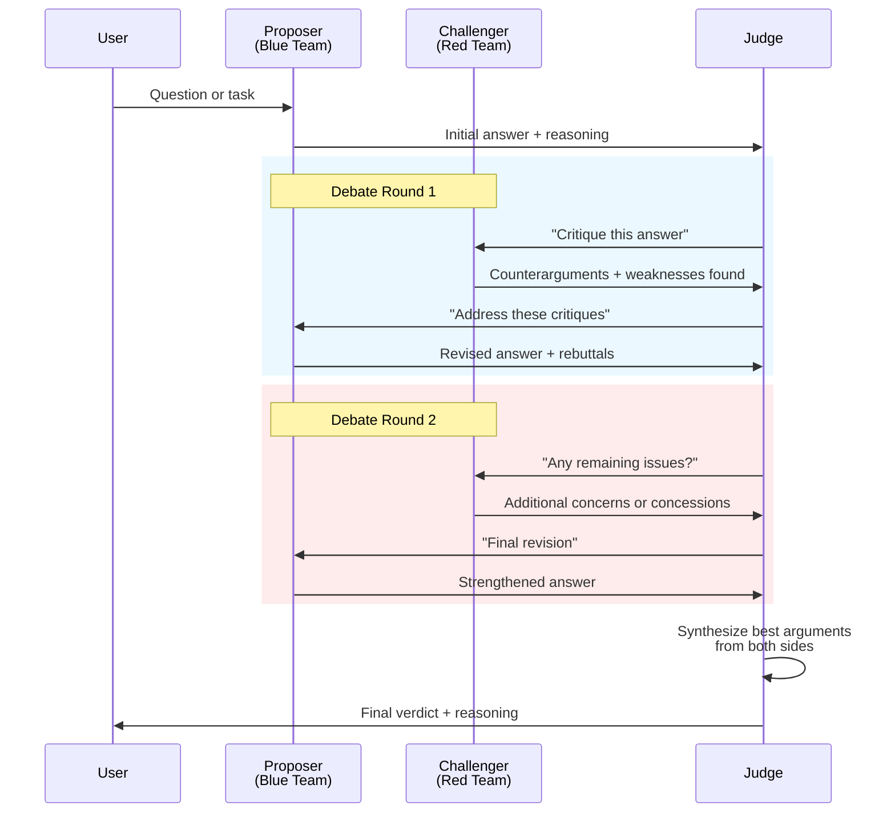
```mermaid
sequenceDiagram
    participant U as User
    participant P as Proposer<br/>(Blue Team)
    participant C as Challenger<br/>(Red Team)
    participant J as Judge

    U->>P: Question or task
    P->>J: Initial answer + reasoning

    rect rgb(235, 248, 255)
    Note over P,C: Debate Round 1
    J->>C: "Critique this answer"
    C->>J: Counterarguments + weaknesses found
    J->>P: "Address these critiques"
    P->>J: Revised answer + rebuttals
    end

    rect rgb(254, 235, 235)
    Note over P,C: Debate Round 2
    J->>C: "Any remaining issues?"
    C->>J: Additional concerns or concessions
    J->>P: "Final revision"
    P->>J: Strengthened answer
    end

    J->>J: Synthesize best arguments<br/>from both sides
    J->>U: Final verdict + reasoning
```

Notice that the judge orchestrates the conversation, deciding when to pass the floor to each agent and when the debate has reached sufficient depth. This is a key difference from self-reflection: the judge is a *third* perspective, independent of both the proposer and the challenger, which reduces the risk of systematic bias.

> **Why not just ask a better model?** You might wonder why you would run three agents instead of one stronger one. The answer is that debate extracts *reasoning* that a single call does not. When challenged, the proposer must articulate *why* its answer is correct, exposing assumptions that were implicit. The challenger must find *specific* flaws, not vague doubts. This structured argumentation surfaces information that a single-pass response leaves buried.

## 9.6 Voting and Consensus Mechanisms

Debate works well for complex reasoning tasks, but sometimes you need a lighter-weight mechanism. **Voting** and **consensus** patterns let multiple agents independently produce answers and then aggregate them, without the overhead of multi-round argumentation.

The following diagram shows the three most common consensus mechanisms, from simplest to most sophisticated:

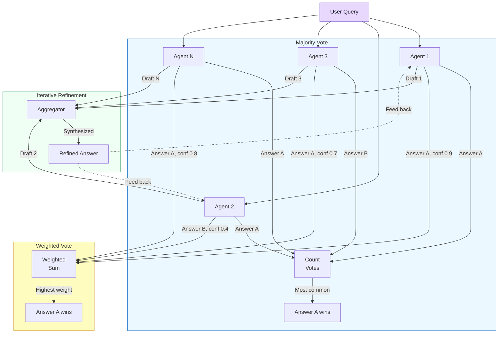
```mermaid
flowchart TD
    Q[User Query] --> A1[Agent 1]
    Q --> A2[Agent 2]
    Q --> A3[Agent 3]
    Q --> AN[Agent N]

    subgraph MV["Majority Vote"]
        A1 -->|Answer A| V1[Count<br/>Votes]
        A2 -->|Answer A| V1
        A3 -->|Answer B| V1
        AN -->|Answer A| V1
        V1 -->|Most common| R1[Answer A wins]
    end

    subgraph WV["Weighted Vote"]
        A1 -->|Answer A, conf 0.9| V2[Weighted<br/>Sum]
        A2 -->|Answer B, conf 0.4| V2
        A3 -->|Answer A, conf 0.7| V2
        AN -->|Answer A, conf 0.8| V2
        V2 -->|Highest weight| R2[Answer A wins]
    end

    subgraph IR["Iterative Refinement"]
        A1 -->|Draft 1| AGG[Aggregator]
        A2 -->|Draft 2| AGG
        A3 -->|Draft 3| AGG
        AN -->|Draft N| AGG
        AGG -->|Synthesized| R3[Refined Answer]
        R3 -.->|Feed back| A1
        R3 -.->|Feed back| A2
    end

    style MV fill:#ebf8ff,stroke:#3182ce
    style WV fill:#fefcbf,stroke:#d69e2e
    style IR fill:#f0fff4,stroke:#38a169
    style Q fill:#e9d8fd,stroke:#805ad5,color:#1a202c
```

### Majority Voting (Self-Consistency)

**Majority voting** is the simplest consensus mechanism. You sample multiple independent responses from the same model (typically at a higher temperature to encourage diversity), extract the final answer from each, and pick the answer that appears most frequently. The research paper that formalized this approach calls it **self-consistency** (Wang et al., 2022).

The mathematical intuition is straightforward: if a model has a 60% chance of reaching the correct answer on any single attempt, then sampling 5 times and taking the majority vote pushes accuracy well above 60%. Correct reasoning paths tend to converge on the same answer, while incorrect paths scatter across different wrong answers. Voting amplifies the signal.

Self-consistency works best for tasks with **discrete, verifiable answers** -- math problems, multiple-choice questions, classification tasks. It is less effective for open-ended generation where there is no single "correct" answer to converge on.

### Weighted Voting

**Weighted voting** extends majority voting by assigning different weights to different agents or responses. The weight might reflect the agent's **confidence score**, its **domain expertise**, or its **historical accuracy** on similar tasks.

For example, if you have three specialist agents -- one trained on legal reasoning, one on medical knowledge, and one general-purpose -- you would weight the legal agent's vote higher on a contract analysis question. Weighted voting lets you combine specialists without needing a complex routing layer.

### Iterative Refinement (Mixture-of-Agents)

**Iterative refinement** is the most sophisticated consensus mechanism. Multiple agents independently generate responses, and then an **aggregator** agent synthesizes them into a single refined output. In the **Mixture-of-Agents (MoA)** architecture (Wang et al., 2024), this process can repeat for multiple layers: the aggregator's output becomes the input for another round of independent generation and aggregation.

The MoA insight is that LLMs exhibit a **collaborativeness** property -- they tend to produce better outputs when given reference answers from other models, even if those references are imperfect. Each layer of aggregation improves quality, similar to how ensemble methods work in traditional machine learning.

## 9.6 Constitutional AI Patterns

A related approach is the **Constitutional AI (CAI)** pattern, where instead of free-form debate, agents evaluate outputs against a fixed set of principles -- a "constitution." One agent generates a response, and a second agent (or the same agent in a separate call) checks whether the response violates any constitutional principle (e.g., "Is this response harmful?", "Does it reveal private information?", "Is it factually grounded?").

This is not open-ended debate but **structured critique against a known standard**. The constitution serves as the judge's rubric, making the process more predictable and auditable than free-form adversarial debate. You can think of it as a middle ground between self-reflection (one agent, one perspective) and full debate (multiple agents, open argumentation).

## 9.6 Implementing a Debate System

Let's build a debate system where two agents argue over a question and a judge synthesizes the final answer. This implementation uses three distinct agent roles with different system prompts:

**debate_system.py**

```python
import anthropic
import json

client = anthropic.Anthropic()
MODEL = "claude-sonnet-4-20250514"
MAX_ROUNDS = 2


def call_agent(system: str, messages: list[dict]) -> str:
    """Call an LLM agent with the given system prompt and messages."""
    response = client.messages.create(
        model=MODEL,
        max_tokens=1024,
        system=system,
        messages=messages,
    )
    return response.content[0].text


# --- Agent Prompts ---

PROPOSER_PROMPT = """You are a thoughtful analyst who provides well-reasoned
answers. When presenting an answer, explain your reasoning step by step.
When responding to critiques, address each point directly -- concede
where the critique is valid and defend where you have evidence."""

CHALLENGER_PROMPT = """You are a rigorous critic and devil's advocate. Your job
is to find weaknesses, unstated assumptions, logical gaps, and potential
errors in the proposed answer. Be specific -- don't just say "this could
be wrong," explain exactly what might be wrong and why. If the answer is
actually strong, acknowledge its strengths before noting minor issues."""

JUDGE_PROMPT = """You are an impartial judge evaluating a structured debate.
You will see an initial answer, critiques, and rebuttals. Your job is to:

1. Identify which arguments from BOTH sides are strongest
2. Note where the proposer successfully addressed critiques
3. Note where critiques revealed genuine weaknesses
4. Synthesize the best reasoning into a final, authoritative answer

Output your verdict as JSON:
{
  "final_answer": "Your synthesized answer incorporating the strongest arguments",
  "proposer_strengths": ["What the proposer got right"],
  "challenger_contributions": ["Valid critiques that improved the answer"],
  "confidence": "high/medium/low"
}"""


def run_debate(question: str) -> dict:
    """Run a multi-round debate between a proposer and challenger,
    with a judge synthesizing the final answer."""

    print(f"Question: {question}\\n")

    # Step 1: Proposer gives initial answer
    proposal = call_agent(
        PROPOSER_PROMPT,
        [{"role": "user", "content": f"Please answer this question:\\n{question}"}],
    )
    print(f"--- Proposer (Initial) ---\\n{proposal}\\n")

    debate_history = [{"round": 0, "proposer": proposal}]

    for round_num in range(1, MAX_ROUNDS + 1):
        # Step 2: Challenger critiques the current answer
        critique_context = f"""Here is the question and the proposed answer.
Find weaknesses and challenge the reasoning.

Question: {question}

Proposed answer:
{proposal}"""

        if round_num > 1:
            critique_context += f"""

The proposer's rebuttal to your previous critique:
{proposal}"""

        critique = call_agent(
            CHALLENGER_PROMPT,
            [{"role": "user", "content": critique_context}],
        )
        print(f"--- Challenger (Round {round_num}) ---\\n{critique}\\n")

        # Step 3: Proposer addresses the critique
        rebuttal_context = f"""Your previous answer to the question "{question}":

{proposal}

A critic has raised these concerns:
{critique}

Address each critique directly. Concede where valid and strengthen
your answer. Provide your revised, improved answer."""

        proposal = call_agent(
            PROPOSER_PROMPT,
            [{"role": "user", "content": rebuttal_context}],
        )
        print(f"--- Proposer (Round {round_num} Rebuttal) ---\\n{proposal}\\n")

        debate_history.append({
            "round": round_num,
            "critique": critique,
            "rebuttal": proposal,
        })

    # Step 4: Judge synthesizes the final verdict
    transcript = f"Question: {question}\\n\\n"
    transcript += f"Initial proposal:\\n{debate_history[0]['proposer']}\\n\\n"
    for entry in debate_history[1:]:
        transcript += f"Round {entry['round']} critique:\\n{entry['critique']}\\n\\n"
        transcript += f"Round {entry['round']} rebuttal:\\n{entry['rebuttal']}\\n\\n"

    verdict_text = call_agent(
        JUDGE_PROMPT,
        [{"role": "user", "content": f"Evaluate this debate:\\n\\n{transcript}"}],
    )
    print(f"--- Judge Verdict ---\\n{verdict_text}\\n")

    verdict = json.loads(verdict_text)
    return verdict


# --- Run it ---
result = run_debate(
    "Should a startup use a microservices architecture from day one, "
    "or start with a monolith and split later?"
)
print(f"\\nFinal answer: {result['final_answer']}")
print(f"Confidence: {result['confidence']}")
```

Several design decisions in this implementation are worth examining. The **proposer** and **challenger** have symmetric but opposing system prompts -- one builds arguments, the other tears them down. The **judge** is deliberately isolated from the debate itself; it only sees the transcript after the rounds are complete, preventing it from steering the debate toward a predetermined conclusion. The debate runs for a fixed number of rounds (`MAX_ROUNDS = 2`), which in practice captures most of the value -- the first critique surfaces the biggest issues, and the first rebuttal addresses the most important ones.

Notice how this mirrors the self-reflection pattern from Module 4 but with a crucial difference: the critic is a *separate agent* with a different system prompt, not the same model re-evaluating its own work. This structural independence is what gives debate its power over single-agent reflection.

## 9.6 Choosing the Right Consensus Mechanism

Not every task benefits from every consensus approach. The right mechanism depends on the nature of the task, the cost budget, and the quality requirements:

| Mechanism | Best For | Cost | Latency | Quality Gain |
|-----------|----------|------|---------|--------------|
| Majority voting | Math, classification, discrete answers | Low (parallel sampling) | Low (parallel) | Moderate |
| Weighted voting | Multi-domain queries, specialist ensembles | Low-Medium | Low (parallel) | Moderate-High |
| Adversarial debate | Complex reasoning, ambiguous questions, high-stakes decisions | High (sequential rounds) | High (sequential) | High |
| Mixture-of-Agents | Open-ended generation, writing, summarization | Medium-High | Medium | High |
| Constitutional critique | Safety-critical outputs, compliance checking | Medium | Medium | Targeted |

A practical production system often **combines** these mechanisms. For example, you might use majority voting for quick factual queries, constitutional critique as a safety filter on all outputs, and full adversarial debate only for complex, high-stakes reasoning tasks. The routing patterns from Module 4 (Lesson 05) let you direct each query to the appropriate consensus mechanism based on its complexity.

## 9.6 When Consensus Fails

Consensus mechanisms have failure modes you should watch for.

**Herding** occurs when agents converge on the same wrong answer because they share the same training data and biases. If all agents are instances of the same model, majority voting amplifies systematic biases rather than correcting them. Mitigation: use diverse models or vary system prompts to encourage genuinely independent perspectives.

**Debate theater** happens when the challenger generates superficially impressive but ultimately hollow critiques, and the proposer concedes unnecessarily. This is especially common when both agents are people-pleasing models that prefer agreement over genuine argumentation. Mitigation: strengthen the challenger's prompt to require *specific, falsifiable* objections with evidence.

**Aggregation collapse** is a risk in Mixture-of-Agents: the aggregator may ignore minority viewpoints and simply echo the majority, losing the diversity that made the ensemble valuable in the first place. Mitigation: explicitly instruct the aggregator to note and address dissenting positions.

> **Forward look -- Module 10:** How do you know whether your debate system is actually producing better answers? You need evaluation. Module 10 introduces **LLM-as-judge** scoring, **pairwise comparison**, and **benchmark-driven evaluation** -- the tools you need to measure whether your consensus mechanism is worth the extra compute.

## 9.6 Summary

**Debate and consensus** mechanisms use structured disagreement to improve answer quality beyond what any single agent achieves alone. **Adversarial debate** assigns proposer, challenger, and judge roles to separate agents, forcing arguments to be explicitly defended and critiqued -- the multi-agent generalization of the self-reflection pattern from Module 4. **Majority voting** (self-consistency) samples multiple independent responses and picks the most common answer, exploiting the fact that correct reasoning paths converge while incorrect ones scatter. **Mixture-of-Agents** uses iterative refinement, where multiple agents generate responses and an aggregator synthesizes the best elements. **Constitutional AI patterns** evaluate outputs against a fixed set of principles rather than open-ended debate.

The choice of mechanism depends on your task: voting for discrete answers, debate for complex reasoning, MoA for open-ended generation, and constitutional critique for safety-critical outputs. Watch for failure modes like herding (shared biases amplified by voting), debate theater (superficial critiques), and aggregation collapse (ignoring minority viewpoints).

In the next lesson, you will put these multi-agent concepts into practice in the **Multi-Agent Lab**, building a research team with a supervisor, researcher, and writer agent that collaborate to produce a complete deliverable.

---

    Section 9.7: Multi-Agent Lab


## 9.7 Overview

Throughout Module 9, you learned why multi-agent systems exist, how to orchestrate them, how they communicate, and how they reach consensus. Each lesson introduced a pattern in isolation. But real multi-agent systems combine all of these patterns into a cohesive whole -- a team of agents that coordinate, delegate, and produce results no single agent could achieve alone.

In this hands-on lab, you will build a **research team** from scratch: a Supervisor agent that decomposes research questions, a Researcher agent that gathers and analyzes information, and a Writer agent that synthesizes findings into a polished report. You will build this system progressively, adding one component at a time, so you can see how the pieces fit together.

By the end of this lab, you will have a working multi-agent system that takes a research question and produces a structured report -- and you will understand every moving part.

## 9.7 Architecture

Here is the complete system you will build. Study this diagram before diving into code -- it shows every agent, how they communicate, and what data flows between them.

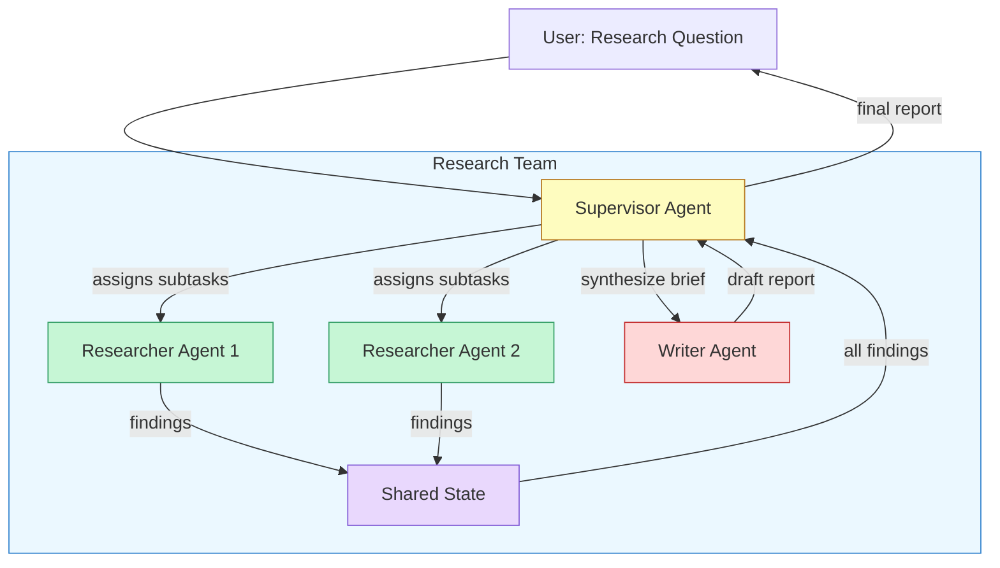
```mermaid
graph TD
    User["User: Research Question"] --> Sup["Supervisor Agent"]
    subgraph ResearchTeam["Research Team"]
        Sup -->|"assigns subtasks"| R1["Researcher Agent 1"]
        Sup -->|"assigns subtasks"| R2["Researcher Agent 2"]
        R1 -->|"findings"| State["Shared State"]
        R2 -->|"findings"| State
        State -->|"all findings"| Sup
        Sup -->|"synthesize brief"| Writer["Writer Agent"]
        Writer -->|"draft report"| Sup
    end
    Sup -->|"final report"| User
    style ResearchTeam fill:#ebf8ff,stroke:#3182ce
    style Sup fill:#fefcbf,stroke:#b7791f
    style R1 fill:#c6f6d5,stroke:#38a169
    style R2 fill:#c6f6d5,stroke:#38a169
    style Writer fill:#fed7d7,stroke:#c53030
    style State fill:#e9d8fd,stroke:#805ad5
```

The **Supervisor** is the orchestrator. It receives the user's question, breaks it into subtasks, dispatches those subtasks to **Researcher** agents, collects findings into **shared state**, and then hands everything to the **Writer** agent for synthesis. This is the supervisor pattern from lesson 02 combined with the shared-state communication model from lesson 03.

## 9.7 Step 1: Define the Shared State and Message Types

Before writing any agent logic, you need the data structures that agents use to communicate. In a multi-agent system, clear message contracts are the foundation that everything else builds on. Without them, agents cannot understand each other's output.

The **shared state** is a central data store that all agents can read from and write to. It holds the research question, the subtasks, each researcher's findings, and the final report. This is the **blackboard pattern** from lesson 03 -- a shared memory that agents coordinate through.

**state.py**

```python
from dataclasses import dataclass, field
from enum import Enum


class TaskStatus(Enum):
    PENDING = "pending"
    IN_PROGRESS = "in_progress"
    COMPLETED = "completed"
    FAILED = "failed"


class AgentRole(Enum):
    SUPERVISOR = "supervisor"
    RESEARCHER = "researcher"
    WRITER = "writer"


@dataclass
class ResearchSubtask:
    """A single subtask assigned by the Supervisor to a Researcher."""
    id: str
    question: str
    assigned_to: str
    status: TaskStatus = TaskStatus.PENDING
    findings: str = ""


@dataclass
class AgentMessage:
    """A message passed between agents."""
    sender: AgentRole
    receiver: AgentRole
    content: str
    metadata: dict = field(default_factory=dict)


@dataclass
class ResearchState:
    """Shared state: the blackboard that all agents read and write."""
    original_question: str
    subtasks: list[ResearchSubtask] = field(default_factory=list)
    findings: dict[str, str] = field(default_factory=dict)
    draft_report: str = ""
    final_report: str = ""
    message_log: list[AgentMessage] = field(default_factory=list)
    status: TaskStatus = TaskStatus.PENDING

    def log_message(self, sender: AgentRole, receiver: AgentRole, content: str, **metadata):
        """Record a message in the shared log for observability."""
        msg = AgentMessage(sender=sender, receiver=receiver, content=content, metadata=metadata)
        self.message_log.append(msg)
        print(f"  [{sender.value} -> {receiver.value}] {content[:80]}...")
```

A few design decisions to notice:

- **`ResearchState`** is a single object that gets passed to every agent. This is simpler than point-to-point messaging for a small team.
- **`message_log`** records every inter-agent message. This is critical for debugging -- when something goes wrong in a multi-agent system, the message log is your primary diagnostic tool.
- **`log_message`** prints a summary to the console so you can watch the agents communicate in real time.

## 9.7 Step 2: Build the Base Agent

All three agents share common behavior: they each have a role, a system prompt, and the ability to call the LLM. Rather than duplicating this logic, define a **base agent class** that encapsulates the shared functionality. Each specialized agent will extend this base.

**base_agent.py**

```python
import anthropic
import json

client = anthropic.Anthropic()


class BaseAgent:
    """Base class for all agents in the research team."""

    def __init__(self, role: AgentRole, system_prompt: str, model: str = "claude-sonnet-4-6"):
        self.role = role
        self.system_prompt = system_prompt
        self.model = model

    def call_llm(self, user_message: str, response_format: str = "text") -> str:
        """Send a message to the LLM and return the response text."""
        response = client.messages.create(
            model=self.model,
            max_tokens=4096,
            system=self.system_prompt,
            messages=[{"role": "user", "content": user_message}]
        )
        return response.content[0].text

    def call_llm_json(self, user_message: str) -> dict:
        """Send a message and parse the response as JSON."""
        text = self.call_llm(user_message)
        # Strip markdown code fences if present
        text = text.strip()
        if text.startswith("\\u0060\\u0060\\u0060"):
            text = text.split("\\n", 1)[1].rsplit("\\u0060\\u0060\\u0060", 1)[0].strip()
        return json.loads(text)
```

The `call_llm_json` method handles a common pattern in multi-agent systems: agents that need to return structured data rather than free-form text. The Supervisor uses JSON to define subtasks, the Researcher uses JSON to structure findings, and only the Writer returns prose.

## 9.7 Step 3: Implement the Researcher Agent

The **Researcher agent** is a specialist. It receives a focused subtask question, analyzes it thoroughly, and returns structured findings. It does not decide what to research -- that is the Supervisor's job. This separation of concerns is what makes multi-agent systems powerful: each agent does one thing well.

**researcher_agent.py**

```python
class ResearcherAgent(BaseAgent):
    """Researches a specific subtask and returns structured findings."""

    def __init__(self, agent_id: str):
        super().__init__(
            role=AgentRole.RESEARCHER,
            system_prompt="""You are a thorough research analyst. Your job is to
analyze a specific research question and provide detailed, well-organized findings.

## 9.7 Your Process
1. Break the question into key aspects to investigate
2. Analyze each aspect with specific facts, data, and examples
3. Note any uncertainties or areas needing further research
4. Provide a confidence level for your findings

## 9.7 Output Format
Always respond with a JSON object:
{
  "key_findings": ["finding 1", "finding 2", ...],
  "details": "Detailed analysis in 2-3 paragraphs",
  "confidence": 0.0 to 1.0,
  "gaps": ["things you could not determine"],
  "sources_needed": ["types of sources that would strengthen these findings"]
}

Respond with ONLY the JSON object. No other text."""
        )
        self.agent_id = agent_id

    def research(self, subtask: ResearchSubtask, state: ResearchState) -> dict:
        """Execute a research subtask and update the shared state."""
        subtask.status = TaskStatus.IN_PROGRESS
        state.log_message(
            AgentRole.SUPERVISOR, self.role,
            f"Assigned subtask: {subtask.question}"
        )

        prompt = (
            f"Research this question thoroughly:\\n\\n"
            f"'{subtask.question}'\\n\\n"
            f"Context: This is part of a larger research project investigating: "
            f"'{state.original_question}'\\n\\n"
            f"Provide detailed findings as JSON."
        )

        try:
            findings = self.call_llm_json(prompt)
            subtask.status = TaskStatus.COMPLETED
            subtask.findings = json.dumps(findings)
            state.findings[subtask.id] = json.dumps(findings, indent=2)
            state.log_message(
                self.role, AgentRole.SUPERVISOR,
                f"Completed subtask '{subtask.id}' with {len(findings.get('key_findings', []))} findings"
            )
            return findings
        except Exception as e:
            subtask.status = TaskStatus.FAILED
            state.log_message(
                self.role, AgentRole.SUPERVISOR,
                f"Failed subtask '{subtask.id}': {str(e)}"
            )
            return {"error": str(e), "key_findings": [], "details": "", "confidence": 0.0}
```

Notice how the Researcher writes its findings into the shared state (`state.findings[subtask.id]`). It also logs messages back to the Supervisor so the Supervisor knows when a subtask completes or fails. This is the blackboard pattern in action -- agents communicate by writing to shared state rather than sending direct messages.

## 9.7 Step 4: Implement the Writer Agent

The **Writer agent** has a completely different skill set from the Researcher. It does not analyze questions -- it takes raw findings and transforms them into a coherent, well-structured report. In multi-agent terminology, this is a **pipeline handoff**: the Researcher's output becomes the Writer's input.

**writer_agent.py**

```python
class WriterAgent(BaseAgent):
    """Synthesizes research findings into a polished report."""

    def __init__(self):
        super().__init__(
            role=AgentRole.WRITER,
            system_prompt="""You are an expert technical writer. You receive raw
research findings from multiple analysts and synthesize them into a clear,
well-organized report.

## 9.7 Your Principles
- Lead with the most important conclusions
- Organize information logically, not chronologically
- Highlight areas of agreement and disagreement between sources
- Flag uncertainties honestly rather than papering over them
- Use clear section headings and bullet points for scannability
- Write for a knowledgeable but non-specialist audience

## 9.7 Report Structure
1. Executive Summary (2-3 sentences)
2. Key Findings (organized by theme, not by source)
3. Detailed Analysis (synthesized narrative)
4. Uncertainties and Gaps
5. Recommendations for Further Research

Write in a professional, direct style. Avoid hedging language where the
evidence is clear. Use hedging only when genuinely uncertain."""
        )

    def synthesize(self, state: ResearchState) -> str:
        """Read all findings from shared state and produce a report."""
        state.log_message(
            AgentRole.SUPERVISOR, self.role,
            f"Synthesize {len(state.findings)} research finding sets into a report"
        )

        # Build a brief for the Writer from all collected findings
        findings_brief = []
        for subtask_id, findings_json in state.findings.items():
            findings_brief.append(
                f"## Research on: {subtask_id}\\n{findings_json}"
            )

        prompt = (
            f"You are writing a report to answer this question:\\n\\n"
            f"'{state.original_question}'\\n\\n"
            f"Below are the raw findings from multiple research analysts. "
            f"Synthesize them into a single coherent report.\\n\\n"
            f"{'\\n\\n'.join(findings_brief)}\\n\\n"
            f"Write a comprehensive report with clear sections. "
            f"Do not simply summarize each analyst -- integrate and synthesize."
        )

        report = self.call_llm(prompt)
        state.draft_report = report
        state.log_message(
            self.role, AgentRole.SUPERVISOR,
            f"Draft report complete ({len(report)} characters)"
        )
        return report
```

The Writer receives a **brief** constructed from all the Researcher findings in the shared state. It does not know which Researcher produced which finding -- it sees them as a unified body of research to synthesize. This loose coupling means you can add more Researchers without changing the Writer at all.

## 9.7 Step 5: Build the Supervisor Loop

The **Supervisor** is the brain of the system. It implements the orchestration loop you studied in lesson 02: decompose the task, dispatch subtasks to workers, monitor progress, and aggregate results. This is where all the patterns from this module converge.

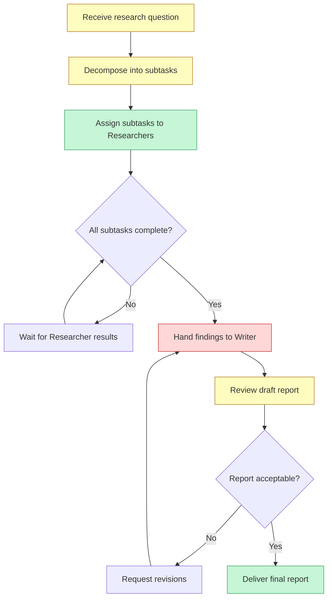
```mermaid
flowchart TD
    A["Receive research question"] --> B["Decompose into subtasks"]
    B --> C["Assign subtasks to Researchers"]
    C --> D{"All subtasks complete?"}
    D -->|"No"| E["Wait for Researcher results"]
    E --> D
    D -->|"Yes"| F["Hand findings to Writer"]
    F --> G["Review draft report"]
    G --> H{"Report acceptable?"}
    H -->|"No"| I["Request revisions"]
    I --> F
    H -->|"Yes"| J["Deliver final report"]
    style A fill:#fefcbf,stroke:#b7791f
    style B fill:#fefcbf,stroke:#b7791f
    style C fill:#c6f6d5,stroke:#38a169
    style F fill:#fed7d7,stroke:#c53030
    style G fill:#fefcbf,stroke:#b7791f
    style J fill:#c6f6d5,stroke:#38a169
```

**supervisor_agent.py**

```python
class SupervisorAgent(BaseAgent):
    """Orchestrates the research team: decomposes, delegates, and aggregates."""

    def __init__(self):
        super().__init__(
            role=AgentRole.SUPERVISOR,
            system_prompt="""You are a research team supervisor. You manage a team
of research analysts and a technical writer.

## 9.7 Your Responsibilities
1. Break research questions into 2-4 focused subtasks
2. Assign subtasks to researchers
3. Review findings for completeness
4. Direct the writer to synthesize findings

## 9.7 Decomposition Rules
- Each subtask should be independently researchable
- Subtasks should cover different aspects (don't duplicate)
- 2-4 subtasks is ideal -- more creates coordination overhead
- Frame each subtask as a specific, answerable question

When decomposing, respond with ONLY a JSON array:
[
  {"id": "subtask-1", "question": "Specific research question"},
  {"id": "subtask-2", "question": "Another specific question"}
]"""
        )
        self.researchers = [ResearcherAgent(f"researcher-{i}") for i in range(2)]
        self.writer = WriterAgent()

    def decompose(self, question: str) -> list[dict]:
        """Break the research question into subtasks."""
        prompt = (
            f"Break this research question into 2-4 focused subtasks:\\n\\n"
            f"'{question}'\\n\\n"
            f"Respond with a JSON array of subtasks."
        )
        return self.call_llm_json(prompt)

    def run(self, question: str) -> str:
        """Execute the full research pipeline."""
        state = ResearchState(original_question=question, status=TaskStatus.IN_PROGRESS)
        print(f"\\n{'='*60}")
        print(f"Research question: {question}")
        print(f"{'='*60}\\n")

        # Phase 1: Decompose the question into subtasks
        print("[Phase 1] Decomposing question into subtasks...")
        subtask_defs = self.decompose(question)
        for sd in subtask_defs:
            subtask = ResearchSubtask(
                id=sd["id"],
                question=sd["question"],
                assigned_to=""
            )
            state.subtasks.append(subtask)
        print(f"  Created {len(state.subtasks)} subtasks\\n")

        # Phase 2: Assign subtasks to researchers (round-robin)
        print("[Phase 2] Dispatching subtasks to researchers...")
        for i, subtask in enumerate(state.subtasks):
            researcher = self.researchers[i % len(self.researchers)]
            subtask.assigned_to = researcher.agent_id
            researcher.research(subtask, state)
        print()

        # Phase 3: Check completion
        completed = sum(1 for st in state.subtasks if st.status == TaskStatus.COMPLETED)
        failed = sum(1 for st in state.subtasks if st.status == TaskStatus.FAILED)
        print(f"[Phase 3] Results: {completed} completed, {failed} failed\\n")

        if completed == 0:
            state.status = TaskStatus.FAILED
            return "All research subtasks failed. Cannot produce a report."

        # Phase 4: Send findings to the Writer for synthesis
        print("[Phase 4] Sending findings to writer for synthesis...")
        report = self.writer.synthesize(state)
        state.final_report = report
        state.status = TaskStatus.COMPLETED
        print(f"\\n{'='*60}")
        print("FINAL REPORT")
        print(f"{'='*60}\\n")
        print(report)

        # Print communication log
        print(f"\\n{'='*60}")
        print(f"MESSAGE LOG ({len(state.message_log)} messages)")
        print(f"{'='*60}")
        for msg in state.message_log:
            print(f"  {msg.sender.value:12s} -> {msg.receiver.value:12s} | {msg.content[:60]}")

        return report
```

The Supervisor's `run` method implements a four-phase pipeline:

1. **Decompose** -- the Supervisor uses its own LLM call to break the question into subtasks
2. **Dispatch** -- subtasks are assigned to Researchers in a round-robin pattern
3. **Monitor** -- the Supervisor checks how many subtasks completed versus failed
4. **Synthesize** -- all findings are handed to the Writer for report generation

This is a simplified version of the orchestration loop. In production, Phase 2 would run Researchers in parallel (using `asyncio`), and Phase 3 would include retry logic for failed subtasks. But the sequential version here makes the flow easier to follow and debug.

## 9.7 Step 6: Run the System

With all the pieces in place, running the multi-agent team is a single function call.

**run_research_team.py**

```python
# Assemble and run the research team
supervisor = SupervisorAgent()

report = supervisor.run(
    "What are the main approaches to reducing LLM hallucinations, "
    "and how effective is each approach in practice?"
)
```

When you run this, you will see the console output trace every inter-agent message:

**output.txt**

```text
============================================================
Research question: What are the main approaches to reducing LLM hallucinations...
============================================================

[Phase 1] Decomposing question into subtasks...
  Created 3 subtasks

[Phase 2] Dispatching subtasks to researchers...
  [supervisor -> researcher] Assigned subtask: What retrieval-augmented generation ...
  [researcher -> supervisor] Completed subtask 'subtask-1' with 5 findings
  [supervisor -> researcher] Assigned subtask: How do fine-tuning and RLHF approac...
  [researcher -> supervisor] Completed subtask 'subtask-2' with 4 findings
  [supervisor -> researcher] Assigned subtask: What inference-time techniques like ...
  [researcher -> supervisor] Completed subtask 'subtask-3' with 6 findings

[Phase 3] Results: 3 completed, 0 failed

[Phase 4] Sending findings to writer for synthesis...
  [supervisor -> writer   ] Synthesize 3 research finding sets into a report
  [writer    -> supervisor] Draft report complete (2847 characters)

============================================================
FINAL REPORT
============================================================
...
```

The message log at the bottom gives you full **observability** into the agent interactions. This is not just useful for debugging -- it is essential for understanding how information flows through the system and where bottlenecks or failures occur.

## 9.7 Making It Production-Ready

The system you just built works, but a production multi-agent system needs several additional capabilities. Here is a map of what to add and where each concern fits.

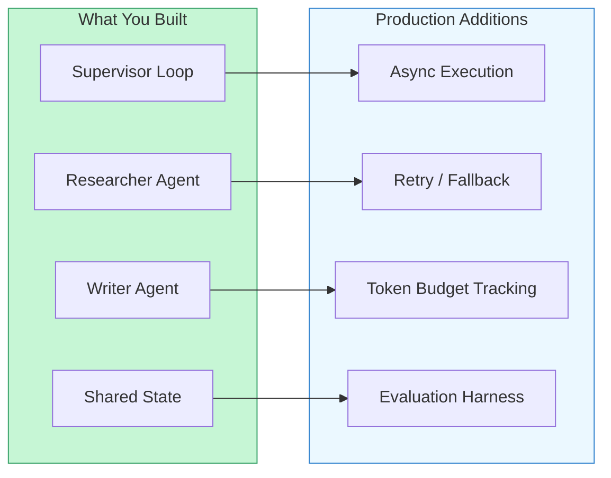
```mermaid
graph LR
    subgraph Core["What You Built"]
        A["Supervisor Loop"]
        B["Researcher Agent"]
        C["Writer Agent"]
        D["Shared State"]
    end
    subgraph Production["Production Additions"]
        E["Async Execution"]
        F["Retry / Fallback"]
        G["Token Budget Tracking"]
        H["Evaluation Harness"]
    end
    A --> E
    B --> F
    C --> G
    D --> H
    style Core fill:#c6f6d5,stroke:#38a169
    style Production fill:#ebf8ff,stroke:#3182ce
```

**Async execution** is the most impactful improvement. In the current system, Researchers run sequentially -- each one waits for the previous to finish. With `asyncio` and the Anthropic async client, all Researchers can run in parallel, cutting total latency dramatically.

**async_research.py**

```python
import asyncio
from anthropic import AsyncAnthropic

async_client = AsyncAnthropic()


async def research_parallel(subtasks: list[ResearchSubtask], state: ResearchState):
    """Run all research subtasks in parallel."""

    async def run_one(subtask: ResearchSubtask) -> dict:
        response = await async_client.messages.create(
            model="claude-sonnet-4-6",
            max_tokens=4096,
            system="You are a thorough research analyst. Respond with JSON.",
            messages=[{"role": "user", "content": f"Research: {subtask.question}"}]
        )
        text = response.content[0].text.strip()
        if text.startswith("\\u0060\\u0060\\u0060"):
            text = text.split("\\n", 1)[1].rsplit("\\u0060\\u0060\\u0060", 1)[0].strip()
        findings = json.loads(text)
        subtask.status = TaskStatus.COMPLETED
        state.findings[subtask.id] = json.dumps(findings, indent=2)
        return findings

    results = await asyncio.gather(
        *[run_one(st) for st in subtasks],
        return_exceptions=True
    )

    # Handle any failures
    for subtask, result in zip(subtasks, results):
        if isinstance(result, Exception):
            subtask.status = TaskStatus.FAILED
            state.log_message(
                AgentRole.RESEARCHER, AgentRole.SUPERVISOR,
                f"Failed: {result}"
            )

    return results
```

**Retry and fallback** logic handles the reality that LLM calls sometimes fail -- rate limits, malformed JSON, network errors. Wrap each agent call in a retry loop with exponential backoff.

**Token budget tracking** prevents runaway costs. Each LLM call returns `usage.input_tokens` and `usage.output_tokens`. Track these across all agents and enforce a budget ceiling on the entire research run.

**Evaluation harness** is the topic of Module 10. Once your multi-agent system produces reports, you need systematic ways to measure whether those reports are accurate, complete, and well-written.

## 9.7 Key Takeaways

This lab brought together every pattern from Module 9 into a working system:

- **Supervisor pattern** (lesson 02): the Supervisor decomposes tasks, dispatches them, and aggregates results
- **Shared state** (lesson 03): agents communicate through a central `ResearchState` object rather than direct point-to-point messaging
- **Task decomposition** (lesson 05): the Supervisor uses the LLM to break questions into independently researchable subtasks
- **Separation of concerns**: Researchers analyze, the Writer synthesizes, and the Supervisor coordinates -- no agent tries to do everything

The most important lesson is not any single pattern -- it is how the patterns compose. A multi-agent system is not a collection of independent agents. It is a carefully designed pipeline where each agent's output feeds the next agent's input, and the Supervisor ensures the whole process moves toward a useful result.

## 9.7 What Comes Next

You have built a multi-agent research team that decomposes questions, distributes work, and synthesizes findings into a report. It coordinates agents, passes messages, and produces results. But how do you know the results are any good?

Right now, you are evaluating the system by reading its output and making a judgment call. That works for a demo, but it does not scale. What if the Researcher hallucinates a finding? What if the Writer drops an important detail? What if the Supervisor decomposes the question poorly? You need systematic, repeatable ways to measure quality.

> You have built complex agent systems -- but how do you know they work correctly? **Module 10: Evaluation and Testing** covers exactly this: metrics, benchmarks, test harnesses, and evaluation pipelines that tell you whether your agents are actually doing their job.

## 9.7 Summary

In this lab, you built a complete multi-agent research system with three specialized agents working together:

- **Shared state and message types** provide the communication foundation that all agents build on -- without clear contracts, agents cannot coordinate
- **A base agent class** encapsulates the common LLM interaction logic so specialized agents focus only on their unique behavior
- **The Researcher agent** takes focused subtask questions and returns structured findings to the shared state
- **The Writer agent** reads all findings from shared state and synthesizes them into a coherent report, demonstrating pipeline handoff
- **The Supervisor loop** ties everything together -- decomposing questions, dispatching to Researchers round-robin, monitoring completion, and triggering synthesis
- **Production readiness** requires async execution, retry logic, token budget tracking, and the evaluation techniques covered in Module 10

---

