# Evaluation & Testing

*Measuring agent quality, building test suites, and establishing confidence in agent behavior*

    Section 10.1: Why Evaluation Matters


## 10.1 Overview

You have spent nine modules building increasingly sophisticated agent systems. You can design single agents with tools, wire them into multi-step reasoning loops, give them memory, connect them across frameworks, and orchestrate entire teams of specialist agents. In the Multi-Agent Lab, you assembled a research team that decomposes tasks, delegates work, and synthesizes results.

But here is an uncomfortable question: **how do you know any of it actually works?**

Not whether it runs without errors -- whether it produces *correct*, *reliable*, *safe* outputs across the full range of inputs your users will throw at it. Whether the agent that scored well on your five test cases will hold up against five thousand. Whether the prompt change you made yesterday improved refund handling without quietly breaking cancellation handling. Whether your multi-agent research team produces accurate synthesis or confidently assembled hallucinations.

Module 10 introduces **evaluation and testing** for LLM agents -- the discipline of systematically measuring agent quality, detecting regressions, and building justified confidence that your agents behave as intended. This opening lesson explains why evaluation is uniquely challenging for agent systems, what an evaluation stack looks like, and how evaluation-driven development changes the way you build agents.

## 10.1 The Gap Between "It Works" and "It Works Reliably"

Every agent builder has experienced the same progression. You write a prompt, test it with a few examples, see good results, and declare it ready. Then users find edge cases you never imagined. The agent hallucinates a policy that does not exist. It calls the wrong tool in a sequence that looked right during development. It produces a beautiful answer to a question it fundamentally misunderstood.

The gap between "it worked on my examples" and "it works reliably in production" is the evaluation gap. Traditional software engineering closed this gap with decades of testing methodology -- unit tests, integration tests, end-to-end tests, CI/CD pipelines, code coverage metrics. But agents break the assumptions that make those methods work.

## 10.1 Why Agents Break Traditional Testing

Traditional software testing rests on a foundational assumption: **given the same input, the system produces the same output**. This assumption enables exact-match assertions, regression test suites, and deterministic CI pipelines. Agent systems violate this assumption in multiple ways, and each violation creates a distinct evaluation challenge.

### Non-Determinism: Same Input, Different Output

The most fundamental challenge is **non-determinism**. When you call an LLM, the response is sampled from a probability distribution over tokens. Even with the same prompt, the same model, and the same temperature setting, the output varies between runs. The agent might phrase the same correct answer differently, choose a different but equally valid tool sequence, or occasionally produce an incorrect response that it gets right ninety-five percent of the time.

This means you cannot write a test that asserts `output == expected_string`. The test would fail on correct responses that happen to be worded differently, and it would pass on incorrect responses that happen to match the expected phrasing. Evaluation must shift from **exact match** to **semantic correctness** -- does the output convey the right information, regardless of how it is phrased?

### Multi-Step Evaluation: Trajectory vs. Outcome

A traditional function call has one input and one output. An agent might take fifteen steps -- reasoning, calling tools, interpreting results, reasoning again -- before producing a final answer. Two distinct evaluation questions emerge:

- **Outcome evaluation**: Is the final answer correct?
- **Trajectory evaluation**: Did the agent take a reasonable path to get there?

These can diverge. An agent might arrive at the correct answer through flawed reasoning -- it hallucinated an intermediate fact but happened to reach the right conclusion anyway. Or it might follow a perfect reasoning chain but make an error in the final synthesis step. Evaluating only the outcome misses dangerous fragility in the reasoning. Evaluating only the trajectory misses whether the agent actually solved the user's problem.

Robust evaluation requires assessing **both** the destination and the journey.

### The Eval Paradox: Using AI to Evaluate AI

Here is the uncomfortable truth: evaluating agent outputs at scale requires capabilities that only AI can provide. A human can judge whether an agent's response is helpful, accurate, and safe -- but a human cannot judge ten thousand responses per day. You need automated evaluation. And the most capable automated evaluator available is... another LLM.

This creates the **eval paradox**: you are using AI to judge AI. The judge model has its own biases, its own failure modes, its own blind spots. It might consistently rate verbose responses higher than concise ones, or fail to detect subtle factual errors that a domain expert would catch. If the judge model shares training data with the agent being evaluated, it might mistake familiar-sounding nonsense for correctness.

The eval paradox does not make LLM-as-judge invalid -- it makes it a tool that requires careful calibration. You need rubrics, scoring guidelines, human validation samples, and awareness of systematic biases. Lesson 04 in this module covers LLM-as-judge evaluation in depth.

### Compound Error Accumulation

In traditional software, a function either works or it does not. In agent systems, small errors compound across steps. If each individual step has a 95% success rate, a ten-step agent trajectory has a combined success rate of roughly 60% (0.95^10 = 0.599). A twenty-step trajectory drops to about 36%.

This **compound error accumulation** means that agents which look reliable on simple tasks can fail dramatically on complex multi-step workflows. Evaluation must test not just individual capabilities but complete end-to-end trajectories at realistic complexity levels.

## 10.1 The Evaluation Stack

Evaluating agents is not a single activity -- it is a layered system where each layer addresses a different aspect of quality. The following diagram shows the complete evaluation stack, from low-level metrics up to high-level human judgment.

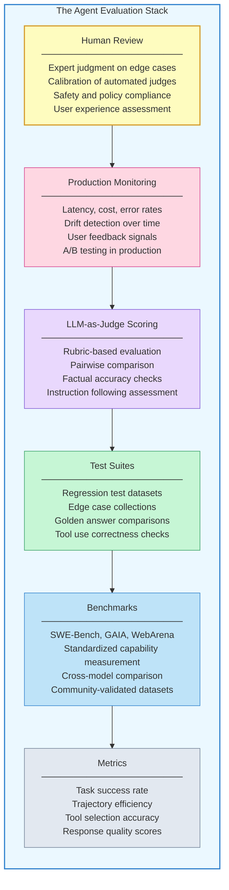

Each layer builds on the ones below it:

**Metrics** are the atomic measurements -- task success rate, average trajectory length, tool selection accuracy, response quality scores. They are numbers you can track over time and compare across agent versions.

**Benchmarks** are standardized evaluation datasets that the community has validated. SWE-Bench measures an agent's ability to solve real GitHub issues. GAIA tests general AI assistant capabilities. WebArena evaluates web navigation tasks. Benchmarks let you compare your agent against published baselines and track progress against well-understood challenges. Lesson 02 covers the major agent benchmarks in detail.

**Test suites** are your custom evaluation datasets -- collections of inputs, expected behaviors, and scoring criteria tailored to your agent's specific domain and use cases. Unlike benchmarks, test suites are private and reflect your production scenarios. They form the backbone of regression testing: before deploying a prompt change, you run the test suite and verify that the change improves target metrics without degrading others. Lesson 03 covers testing strategies.

**LLM-as-judge scoring** uses a separate LLM to evaluate agent outputs against rubrics you define. This enables evaluation at a scale that human review cannot match. A judge model can score thousands of agent responses per hour, checking for factual accuracy, instruction following, helpfulness, and safety. Lesson 04 covers LLM-as-judge patterns.

**Production monitoring** tracks agent behavior in the real world -- latency, cost, error rates, user feedback, and quality drift over time. An agent that scores well on your test suite might degrade in production as user behavior shifts or upstream APIs change. Monitoring closes the feedback loop between evaluation and deployment. Lesson 05 covers tracing and debugging.

**Human review** sits at the top because it remains the gold standard for quality judgment. Humans catch failure modes that automated systems miss -- subtle toxicity, cultural insensitivity, technically correct but unhelpful responses. Human review also calibrates the automated layers: you use human judgments to validate that your LLM-as-judge rubrics actually measure what you intend.

## 10.1 Traditional Testing vs. Agent Testing

The differences between evaluating traditional software and evaluating agent systems are structural, not superficial. Understanding these differences prevents you from applying the wrong evaluation methodology and drawing false conclusions from your results.

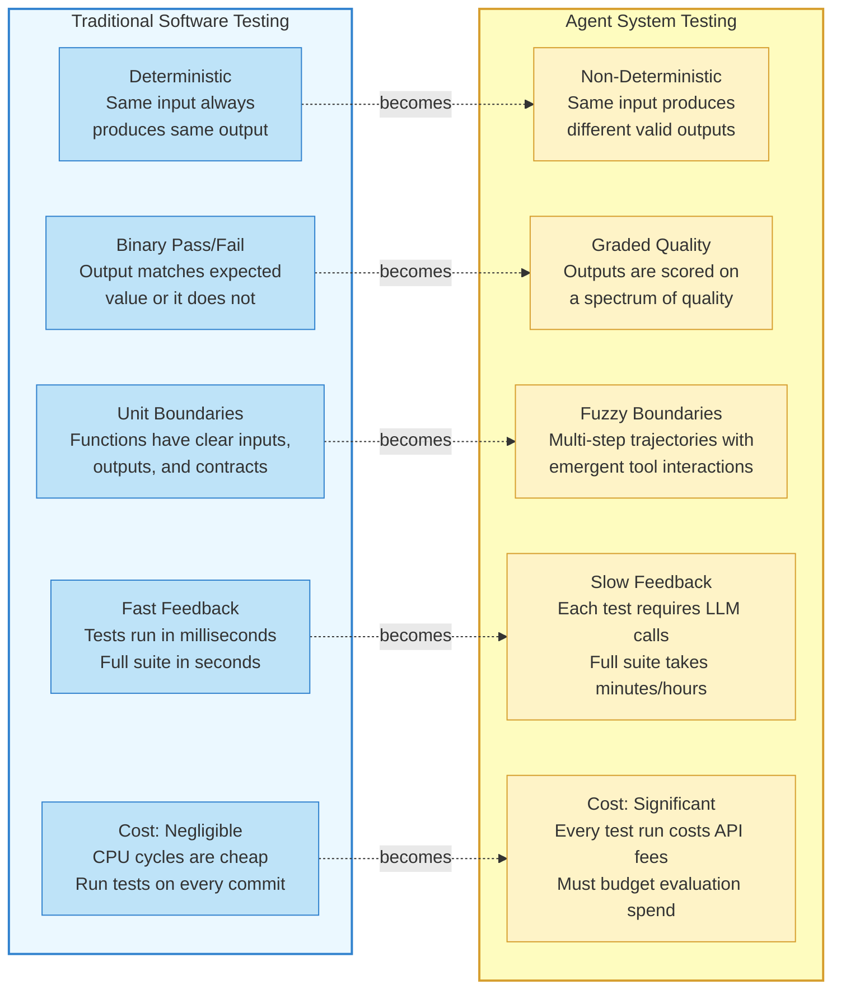

Five shifts define the transition:

**Deterministic to non-deterministic.** You cannot assert that the output equals a specific string. You must define what *correct* means semantically and measure whether outputs meet that definition across multiple runs.

**Binary pass/fail to graded quality.** A traditional test either passes or fails. An agent response exists on a spectrum -- it might be partially correct, mostly helpful but slightly misleading, or factually accurate but poorly structured. Evaluation must produce quality scores, not just boolean verdicts.

**Clear unit boundaries to fuzzy trajectories.** A function has a defined signature: specific inputs, specific outputs, a testable contract. An agent trajectory is an emergent sequence of reasoning steps and tool calls whose structure varies between runs. There is no fixed contract to test against, only behavioral expectations.

**Fast feedback to slow feedback.** A traditional unit test runs in milliseconds. An agent evaluation test requires one or more LLM API calls, each taking hundreds of milliseconds to seconds. A test suite of five hundred cases might take thirty minutes and cost real money. This changes how often you can run evaluations and how you design your testing pipeline.

**Negligible cost to significant cost.** Traditional tests consume CPU cycles that cost fractions of a cent. Agent tests consume API calls that cost dollars. A comprehensive evaluation run against a large test suite can cost hundreds of dollars. This means you must be strategic about *when* you run full evaluations and *how* you design cost-efficient evaluation tiers.

## 10.1 Eval-Driven Development

Given these challenges, how should evaluation fit into your agent development workflow? The answer is **eval-driven development** -- a discipline where you build your evaluation harness *before* you iterate on your agent, and every change is measured against that harness.

The workflow follows a cycle:

**Step 1: Define evaluation criteria.** Before writing a single prompt, decide what "good" means for your agent. What tasks should it handle? What quality level is acceptable? What failure modes are unacceptable? Express these criteria as measurable metrics -- task success rate above 85%, no hallucinated policy references, average response time under five seconds.

**Step 2: Build an evaluation dataset.** Create a collection of representative inputs paired with expected behaviors. Not expected exact outputs -- expected behaviors. "The agent should identify this as a refund request and check the order status" is a behavioral expectation. "The agent should respond with 'I'd be happy to help with your refund'" is a brittle exact-match expectation. Start with twenty to fifty cases covering the most common and most critical scenarios.

**Step 3: Baseline your current agent.** Run your evaluation dataset against your current agent and record the scores. This is your baseline. If you are starting from scratch, your baseline might be zero -- that is fine. The point is to have a number to improve against.

**Step 4: Iterate with measurement.** Make a change -- adjust the prompt, add a tool, modify the system instructions -- and re-run the evaluation. Compare the new scores to the baseline. Did the change improve the target metric? Did it cause regressions in other metrics? If the change improved refund handling from 62% to 78% but dropped cancellation handling from 90% to 72%, you have a regression that needs attention.

**Step 5: Expand the evaluation dataset.** As you discover new failure modes in production or from user feedback, add them to your evaluation dataset. The dataset grows over time, becoming an increasingly comprehensive representation of real-world agent behavior. Yesterday's production failure becomes tomorrow's regression test.

This cycle mirrors **test-driven development** in traditional software engineering, adapted for the unique challenges of non-deterministic, multi-step agent systems. The evaluation harness is your source of truth. Without it, you are navigating by intuition. With it, you have a compass.

## 10.1 The Cost of Skipping Evaluation

Teams that skip systematic evaluation pay the cost in other ways:

- **Silent regressions.** A prompt change that improves one capability quietly breaks another. Without a test suite, you discover the regression when a user complains -- or when the broken behavior causes real harm.

- **Anecdote-driven development.** Without quantitative metrics, team discussions devolve into competing anecdotes. "I tested it with this example and it worked great" versus "I tested it with a different example and it failed." Neither anecdote tells you the actual success rate across representative inputs.

- **Unearned confidence.** A handful of cherry-picked successful examples creates the illusion of reliability. The agent enters production with unknown failure rates on the long tail of inputs that real users will submit.

- **Inability to compare approaches.** Should you use a ReAct loop or a plan-then-execute pattern? Should you use Claude or GPT-4 as your base model? Without evaluation data, you cannot make these decisions empirically. You are guessing.

- **Regulatory and safety risk.** In domains like healthcare, finance, and legal, deploying an agent without systematic evaluation creates liability. Regulators increasingly expect documented evidence that AI systems have been tested against representative scenarios.

## 10.1 What's Ahead in This Module

The remaining lessons in this module build out each layer of the evaluation stack, moving from standardized measurement to hands-on practice.

- **Lesson 02: Agent Benchmarks** -- The major benchmarks for measuring agent capability: SWE-Bench for software engineering, GAIA for general assistance, WebArena for web navigation, and others. You will learn what each benchmark measures, how to interpret scores, and how to use benchmarks to compare models and architectures.

- **Lesson 03: Testing Strategies for Agents** -- How to build test suites for your specific agent, from unit testing individual tools to integration testing agent loops to end-to-end trajectory evaluation. Covers deterministic testing of tool calls, statistical testing of LLM outputs, and regression testing workflows.

- **Lesson 04: LLM-as-Judge Evaluation** -- Using LLMs to evaluate agent outputs at scale. Covers rubric design, pairwise comparison, calibration against human judgments, and the pitfalls of judge model bias.

- **Lesson 05: Tracing and Debugging Agents** -- Tracing multi-step agent runs to understand what happened and why. Covers tracing tools, structured logging, failure mode taxonomy, and debugging strategies for common agent failures.

- **Lesson 06: Evaluation Lab** -- A hands-on lab where you build a complete evaluation harness with automated scoring, regression detection, and a dashboard for tracking agent quality over time.

## 10.1 Summary

**Evaluation and testing** is what separates agent prototypes from production-ready agent systems. The challenges are real -- non-determinism, multi-step trajectories, the eval paradox, compound error accumulation, and significant cost -- but they are manageable with the right methodology and tools.

- **Non-determinism** means evaluation must shift from exact-match assertions to semantic quality measurement across multiple runs. The same input will produce different outputs, and evaluation must distinguish between acceptable variation and actual errors.

- **Trajectory evaluation** matters as much as outcome evaluation. An agent that arrives at the correct answer through flawed reasoning is fragile. An agent that follows a sound trajectory but stumbles at the final step is fixable. Evaluating both the journey and the destination gives you a complete picture.

- **The eval paradox** -- using AI to evaluate AI -- is a pragmatic necessity, not a logical flaw. LLM-as-judge evaluation works when calibrated with rubrics, validated against human judgments, and monitored for systematic biases.

- **The evaluation stack** has six layers: metrics, benchmarks, test suites, LLM-as-judge scoring, production monitoring, and human review. Each layer addresses a different aspect of quality, and a mature evaluation practice uses all six.

- **Eval-driven development** is the discipline of building your evaluation harness before iterating on your agent. Define criteria, build a dataset, baseline your agent, iterate with measurement, and expand the dataset over time. Every change is measured, every regression is caught, and every improvement is quantified.

- **Skipping evaluation** costs more than doing it. Silent regressions, anecdote-driven development, unearned confidence, inability to compare approaches, and regulatory risk are the predictable consequences of building agents without systematic measurement.

In the next lesson, you will explore the **major agent benchmarks** -- SWE-Bench, GAIA, WebArena, and others -- that provide standardized, community-validated datasets for measuring what your agents can actually do.

---

    Section 10.2: Agent Benchmarks


## 10.2 Overview

In the previous lesson, we explored why evaluating agents is fundamentally harder than evaluating static LLM calls. But acknowledging the difficulty is only the first step -- we also need concrete yardsticks. That is where **benchmarks** come in.

A benchmark is a standardized set of tasks with known correct answers (or grading criteria) that lets you measure how well a system performs a specific capability. For agents, benchmarks serve three critical purposes: comparing models and architectures, detecting regressions when you change prompts or tools, and understanding which capabilities your agent actually has versus which ones you assume it has.

This lesson surveys the major benchmarks used to evaluate LLM agents today, explains what each one measures and how scoring works, and -- just as importantly -- discusses the pitfalls of relying on benchmarks too heavily.

> Benchmarks tell you how well your agent performs on **their** tasks. Your job is to determine how much that correlates with **your** tasks.

## 10.2 The Benchmark Landscape

Agent benchmarks can be organized by the primary capability they test. Some focus on a single skill (code generation, knowledge recall), while others demand multi-step, multi-tool reasoning that more closely resembles real agent workflows.

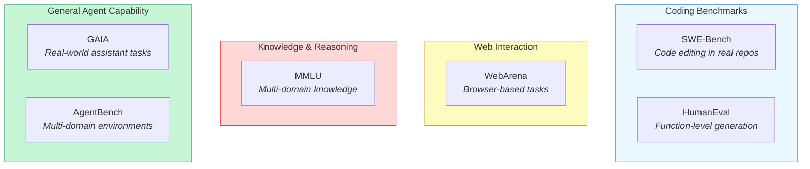

The diagram above groups benchmarks into four categories. Notice that the "General Agent Capability" benchmarks on the right are the most demanding -- they require the agent to combine multiple skills (browsing, coding, reasoning, tool use) within a single evaluation. Let us walk through each benchmark in detail.

## 10.2 SWE-Bench: Real-World Code Editing

**SWE-Bench** evaluates an agent's ability to resolve real GitHub issues by editing code in actual open-source repositories. Unlike toy coding problems, SWE-Bench tasks require the agent to navigate large codebases, understand existing architecture, locate the relevant files, and produce a patch that fixes the issue and passes the project's test suite.

**What it tests:** End-to-end software engineering -- reading issue descriptions, exploring repository structure, understanding existing code, writing a correct fix, and ensuring tests pass.

**How scoring works:** A task is scored as **resolved** (1) or **unresolved** (0). The agent's patch is applied to the repository and the project's test suite is run. If the previously-failing tests now pass (and no previously-passing tests break), the task is resolved. The benchmark reports a **resolve rate** -- the percentage of issues successfully fixed.

**The task set:** The original SWE-Bench contains 2,294 tasks from 12 popular Python repositories (Django, Flask, scikit-learn, sympy, and others). **SWE-Bench Verified** is a human-validated subset of 500 tasks that filters out ambiguous or under-specified issues.

**Current SOTA results:** As of early 2025, top agentic systems achieve resolve rates around 50-60% on SWE-Bench Verified. This is a dramatic improvement from the initial baselines of under 5%, but it also means nearly half of real software engineering tasks remain unsolved.

**Limitations:**
- Restricted to Python repositories, so results may not generalize to other languages
- Tasks are drawn from a fixed set of repositories, so agents can potentially memorize patterns
- Does not test the broader software engineering workflow (design decisions, code review, deployment)
- Binary pass/fail scoring misses partial credit for nearly-correct solutions

## 10.2 HumanEval: Function-Level Code Generation

**HumanEval** is one of the earliest and most widely-cited code benchmarks. It consists of 164 hand-written Python programming problems, each with a function signature, docstring, and a set of unit tests.

**What it tests:** The ability to generate a correct function body given a specification. This is **code generation** in isolation -- no repository navigation, no debugging, no multi-file editing.

**How scoring works:** The standard metric is **pass@k** -- the probability that at least one of *k* generated samples passes all unit tests. **Pass@1** (a single attempt) is the most commonly reported figure.

**Current SOTA results:** Top models now exceed 90% pass@1 on HumanEval, effectively saturating the benchmark. This has led to successors like **HumanEval+** (with more rigorous test cases) and **MBPP** (Mostly Basic Python Problems) for additional coverage.

**Limitations:**
- Tasks are short, self-contained functions -- far simpler than real software engineering
- The benchmark is effectively saturated, limiting its ability to differentiate between top models
- Only tests Python
- Does not assess whether the agent can use tools, read documentation, or reason about existing code

> HumanEval is useful for measuring raw code generation ability, but an agent that scores 95% on HumanEval may still fail at real coding tasks that require navigation, context gathering, and multi-step reasoning.

## 10.2 GAIA: General AI Assistants

**GAIA** (General AI Assistants) is designed to test whether an AI system can act as a capable general-purpose assistant. Tasks are real-world questions that a human could answer using a web browser, a calculator, and common sense -- but that require combining multiple steps and tools.

**What it tests:** Multi-step reasoning, web browsing, file handling (PDFs, spreadsheets, images), arithmetic, and the ability to synthesize information from multiple sources.

**How scoring works:** Each task has a single, unambiguous correct answer (a number, a name, a date). Scoring is **exact match** -- the agent either produces the correct answer or it does not. Tasks are divided into three difficulty levels:
- **Level 1:** Straightforward questions requiring 1-2 steps
- **Level 2:** Questions requiring 3-5 steps and multiple tools
- **Level 3:** Questions requiring complex multi-step reasoning chains

**Current SOTA results:** Top agentic systems score around 70-75% on Level 1 tasks but drop to 30-40% on Level 3 tasks. Human performance is above 90% at all levels, highlighting the gap that remains.

**Limitations:**
- Some tasks depend on web content that may change over time, creating reproducibility challenges
- The exact-match scoring is brittle -- a correct answer phrased differently may be marked wrong
- The task set is relatively small (around 450 questions), limiting statistical power

## 10.2 WebArena: Browser-Based Agent Tasks

**WebArena** evaluates agents that interact with realistic web applications through a browser. The benchmark provides self-hosted instances of real web applications (an e-commerce site, a forum, a content management system, a code repository, and a map application) and asks the agent to complete tasks by navigating, clicking, filling forms, and extracting information.

**What it tests:** Web navigation, form interaction, information extraction from dynamic web pages, and multi-step task completion in realistic web environments.

**How scoring works:** Each task has a programmatic **success check** -- a function that verifies whether the desired state change occurred (e.g., "Was the item added to the cart?", "Was the forum post created with the correct title?"). The metric is **task success rate**.

**Current SOTA results:** Top agents achieve around 35-40% success rate, making WebArena one of the most challenging benchmarks. The low scores reflect the difficulty of reliable web interaction -- agents struggle with dynamic page layouts, pop-ups, authentication flows, and multi-tab navigation.

**Limitations:**
- Self-hosting the environments requires significant infrastructure
- Web UIs change frequently, so the benchmark can become stale
- Does not test interaction with real production websites (with CAPTCHAs, rate limits, etc.)
- Binary success/fail does not capture partial task completion

## 10.2 MMLU: Multi-Domain Knowledge

**MMLU** (Massive Multitask Language Understanding) is not an agent benchmark per se, but it is widely used to assess the foundational knowledge that underpins agent reasoning. It covers 57 subjects spanning STEM, humanities, social sciences, and professional domains.

**What it tests:** Breadth and depth of knowledge across academic and professional domains, using multiple-choice questions at varying difficulty levels (elementary through advanced professional).

**How scoring works:** Standard multiple-choice accuracy -- the percentage of questions answered correctly. Scores are typically reported per-subject and as an overall average.

**Current SOTA results:** Top models now score above 90% overall, with some subjects approaching ceiling performance. This has prompted successors like **MMLU-Pro** (harder questions with 10 answer choices instead of 4) and **GPQA** (graduate-level questions written by domain experts).

**Limitations:**
- Multiple-choice format is far removed from how agents actually use knowledge
- High scores do not guarantee the model can *apply* knowledge in multi-step reasoning
- Does not test tool use, planning, or action-taking
- Subject coverage reflects academic curricula, not necessarily the knowledge agents need in practice

## 10.2 AgentBench: Multi-Domain Agent Evaluation

**AgentBench** is one of the first benchmarks designed specifically to evaluate LLM agents across multiple interactive environments. It includes eight distinct environments: operating system interaction, database querying, knowledge graph reasoning, digital card games, lateral thinking puzzles, web shopping, web browsing, and household tasks.

**What it tests:** The ability of an LLM to act as an agent across diverse domains, each requiring different skills -- from shell commands to SQL queries to strategic reasoning.

**How scoring works:** Each environment has its own scoring metric (success rate, reward score, or accuracy), and results are reported per-environment. An overall score aggregates across all domains.

**Current SOTA results:** Performance varies dramatically by environment. Agents perform well on structured tasks (database queries, simple OS commands) but struggle with open-ended environments (web shopping, household tasks). The benchmark reveals that no single model dominates across all domains.

**Limitations:**
- The breadth of environments makes it expensive and complex to run
- Some environments are simplified simulations, not real-world systems
- Aggregating scores across very different domains can obscure important patterns
- The benchmark has not been as widely adopted as SWE-Bench or GAIA

## 10.2 Comparing the Benchmarks

The following diagram summarizes how these benchmarks compare along two axes: **task complexity** (single-step versus multi-step) and **domain specificity** (narrow versus broad).

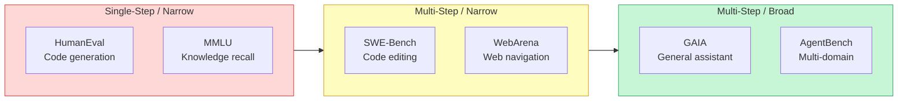

As you move from left to right, the benchmarks become more representative of real agent workloads -- but also harder to run, harder to score, and harder to interpret. There is no single "best" benchmark; the right choice depends on what capability you are trying to measure.

## 10.2 Using Benchmarks Effectively

Benchmarks are tools, not goals. Here is how to use them well:

**For model selection:** Run your candidate models on the benchmarks most relevant to your use case. If your agent primarily writes code, SWE-Bench and HumanEval matter most. If it browses the web, WebArena is essential. Do not pick a model just because it tops a leaderboard on an irrelevant benchmark.

**For regression testing:** After changing prompts, tools, or model versions, re-run your benchmark suite to check for regressions. A 5% drop on SWE-Bench after a prompt change is a signal worth investigating, even if the change improved other behaviors.

**For capability assessment:** Use benchmarks to identify capability gaps. If your agent scores well on HumanEval but poorly on SWE-Bench, the bottleneck is not code generation -- it is repository navigation and contextual understanding. This diagnosis tells you where to focus your engineering effort.

**For setting expectations:** Benchmark scores help you communicate realistic expectations to stakeholders. If the best systems achieve 55% on SWE-Bench Verified, promising 95% issue resolution for your coding agent is not credible.

## 10.2 Anti-Patterns: How Benchmarks Mislead

Benchmarks are indispensable, but they come with well-documented failure modes. Being aware of these anti-patterns is just as important as knowing the benchmarks themselves.

**Benchmark overfitting** occurs when you tune your agent's prompts, tools, or architecture specifically to maximize a benchmark score rather than to improve real-world performance. The agent learns to exploit patterns in the benchmark tasks that do not generalize. For example, a SWE-Bench-optimized agent might learn repository-specific patterns (like Django's testing conventions) that fail on repositories outside the benchmark.

**Leaderboard chasing** is the organizational version of overfitting. Teams focus engineering effort on climbing a public leaderboard rather than solving their users' actual problems. A model that ranks #1 on MMLU may still be the wrong choice for your agent if your tasks require tool use and multi-step reasoning.

**Narrow evaluation** means relying on a single benchmark as a proxy for overall agent quality. An agent can score well on HumanEval while being unable to navigate a real codebase, or excel at WebArena while struggling with arithmetic. Always evaluate across multiple benchmarks covering different capabilities.

**Ignoring task distribution mismatch** happens when you assume benchmark tasks represent your production workload. SWE-Bench tasks are drawn from popular open-source Python projects -- if your agent fixes bugs in proprietary Java codebases, the benchmark results may not transfer. Build **custom evaluation sets** drawn from your actual task distribution to complement public benchmarks.

> The best evaluation strategy combines public benchmarks (for comparability) with private, domain-specific test sets (for relevance). Neither alone is sufficient.

## 10.2 The Road Ahead

The benchmark landscape is evolving rapidly. Several trends are worth watching:

- **Dynamic benchmarks** that generate new tasks continuously, preventing memorization (e.g., **SWE-Bench Live**, which draws from newly-created GitHub issues)
- **Process-oriented evaluation** that scores not just the final answer but the quality of the agent's intermediate reasoning and actions
- **Multi-agent benchmarks** that evaluate teams of agents collaborating on shared tasks
- **Safety-focused benchmarks** that test whether agents refuse harmful instructions, avoid unintended side effects, and operate within their authorized scope

As agents become more capable, benchmarks must keep pace -- measuring not just *what* agents can do, but *how safely and reliably* they do it.

## 10.2 Summary

**Agent benchmarks** provide standardized yardsticks for measuring agent capabilities across coding, web interaction, knowledge, and general reasoning. The major benchmarks -- **SWE-Bench**, **HumanEval**, **GAIA**, **WebArena**, **MMLU**, and **AgentBench** -- each test different skills and use different scoring methodologies. No single benchmark captures the full range of agent behavior.

Used well, benchmarks enable informed model selection, regression detection, and capability gap analysis. Used poorly, they lead to overfitting, leaderboard chasing, and false confidence. The most effective evaluation strategies combine public benchmarks for comparability with custom, domain-specific test sets that reflect your agent's actual workload.

In the next lesson, we will move from measuring agents against fixed benchmarks to building your own **testing strategies** -- unit tests for tools, integration tests for agent loops, and end-to-end evaluations that catch failures before they reach production.

---

    Section 10.3: Testing Strategies for Agents


## 10.3 Overview

In the previous two lessons, you explored *why* evaluation matters for non-deterministic systems and *how* benchmarks like SWE-Bench and GAIA measure agent capabilities at scale. But benchmarks answer a different question than testing. Benchmarks tell you how your agent compares to others on standardized tasks. **Testing** tells you whether *your specific agent* still works correctly after you changed something.

Traditional software has well-established testing practices: unit tests, integration tests, end-to-end tests. Agent systems need the same layers, but each one requires adaptation. You cannot assert that an LLM produces an exact string. You cannot replay a conversation and expect identical tool calls. You cannot run a full agent loop in milliseconds. These constraints demand new strategies.

This lesson introduces a **testing pyramid for agents** -- a layered approach where each level trades speed for realism. You will learn how to unit test tools with mocked LLM responses, integration test the agent loop with deterministic scenarios, run end-to-end evaluations against golden datasets, catch regressions with snapshot testing, and explore properties your agent should always satisfy. By the end, you will have a practical pytest test suite for an agent system.

## 10.3 The Agent Testing Pyramid

The classic testing pyramid applies to agents, but the layers map differently. At the base, fast and cheap **unit tests** verify that individual tools behave correctly in isolation. In the middle, **integration tests** exercise the agent loop -- the cycle of LLM reasoning, tool selection, and response assembly -- with deterministic (mocked) LLM responses. At the top, slower **end-to-end tests** run the full agent against real or near-real LLM calls and compare outputs to **golden datasets**.

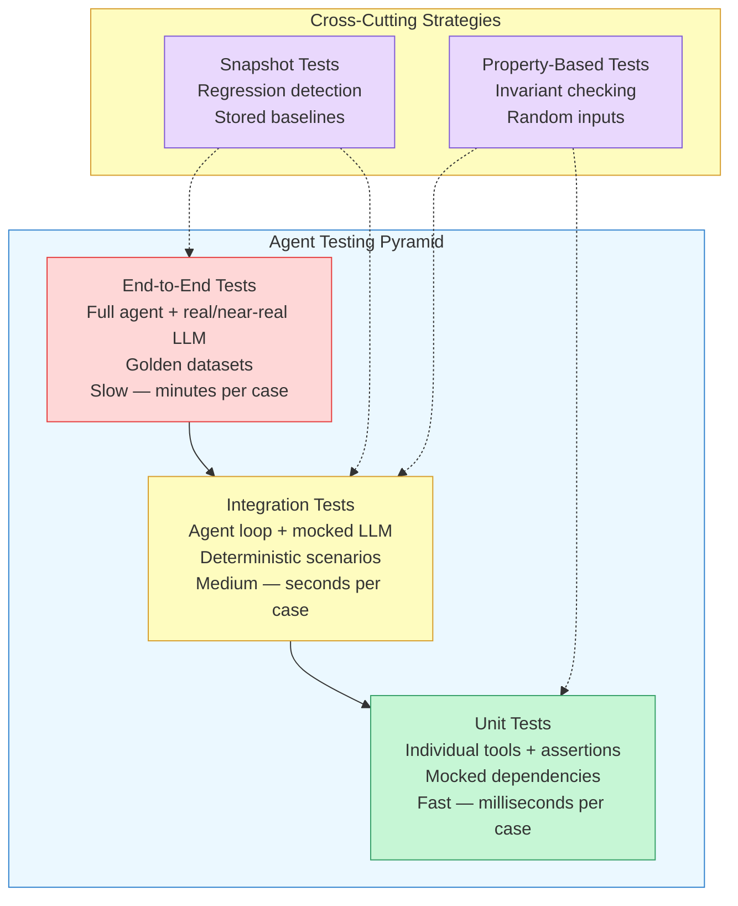

The pyramid shape is intentional: you should have *many* unit tests, *some* integration tests, and *few* end-to-end tests. Unit tests run in milliseconds and catch most bugs. End-to-end tests take minutes and cost real money (LLM API calls), so you run them less frequently -- typically in CI before a release, not on every code change.

Two **cross-cutting strategies** span multiple layers. **Snapshot testing** can apply at any level: store an approved output, and fail the test if the current output diverges. **Property-based testing** generates random inputs and checks that your agent satisfies invariants -- properties that should *always* hold regardless of input.

## 10.3 Test Execution Pipeline

Before diving into each layer, let's see how these tests fit into a development workflow. The following flowchart shows a typical **test execution pipeline** for an agent system.

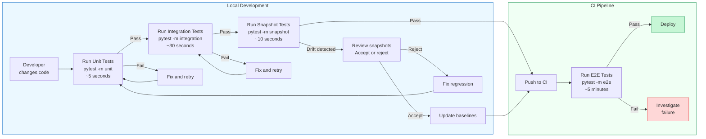

Developers run unit, integration, and snapshot tests locally -- they are fast enough to run on every save. End-to-end tests run in CI because they require LLM API calls and take minutes. Snapshot drift triggers a human review step: you decide whether the change is intentional (update the baseline) or a regression (fix the code).

## 10.3 Layer 1: Unit Testing Tools

The base of the pyramid is **unit testing** individual tools. A tool is just a function: given inputs, it produces outputs. You test it the same way you test any function -- call it with known arguments, assert on the result.

The challenge with agent tools is that they often depend on external services (APIs, databases, file systems) and on the LLM itself. The solution is **mocking**: replace the real dependencies with controlled substitutes that return predetermined responses.

**test_tools_unit.py**

```python
import pytest
from unittest.mock import patch, MagicMock
from dataclasses import dataclass
from typing import Any, Optional


# ── The agent's tools (production code) ──────────────────────────

def search_documents(query: str, top_k: int = 3) -> list[dict]:
    """Search a vector database for relevant documents."""
    # In production, this calls a real vector DB
    from vector_db import client  # noqa: F401
    results = client.search(query, top_k=top_k)
    return [{"title": r.title, "score": r.score} for r in results]


def calculate(expression: str) -> dict:
    """Safely evaluate a mathematical expression."""
    allowed_chars = set("0123456789+-*/.(). ")
    if not all(c in allowed_chars for c in expression):
        return {"error": "Invalid characters in expression"}
    try:
        result = eval(expression)  # safe due to character whitelist
        return {"result": round(result, 6)}
    except Exception as e:
        return {"error": str(e)}


def send_notification(user_id: str, message: str) -> dict:
    """Send a notification to a user via an external API."""
    from notification_service import api  # noqa: F401
    response = api.send(user_id=user_id, message=message)
    return {"status": response.status, "notification_id": response.id}


# ── Unit tests ───────────────────────────────────────────────────

class TestCalculateTool:
    """Unit tests for the calculate tool -- no mocking needed."""

    def test_basic_addition(self):
        result = calculate("2 + 3")
        assert result == {"result": 5}

    def test_floating_point(self):
        result = calculate("10 / 3")
        assert result["result"] == pytest.approx(3.333333, rel=1e-5)

    def test_invalid_characters_rejected(self):
        result = calculate("import os; os.system('rm -rf /')")
        assert "error" in result
        assert "Invalid characters" in result["error"]

    def test_division_by_zero(self):
        result = calculate("1 / 0")
        assert "error" in result


class TestSearchDocumentsTool:
    """Unit tests with mocked vector DB dependency."""

    @patch("vector_db.client")
    def test_returns_formatted_results(self, mock_client):
        # Arrange: mock the vector DB to return controlled results
        mock_result = MagicMock()
        mock_result.title = "Agent Design Patterns"
        mock_result.score = 0.92
        mock_client.search.return_value = [mock_result]

        # Act
        results = search_documents("design patterns", top_k=1)

        # Assert
        assert len(results) == 1
        assert results[0]["title"] == "Agent Design Patterns"
        assert results[0]["score"] == 0.92
        mock_client.search.assert_called_once_with("design patterns", top_k=1)

    @patch("vector_db.client")
    def test_empty_results(self, mock_client):
        mock_client.search.return_value = []
        results = search_documents("nonexistent topic")
        assert results == []


class TestSendNotificationTool:
    """Unit tests with mocked external API."""

    @patch("notification_service.api")
    def test_successful_send(self, mock_api):
        mock_response = MagicMock()
        mock_response.status = "delivered"
        mock_response.id = "notif-123"
        mock_api.send.return_value = mock_response

        result = send_notification("user-42", "Task complete")

        assert result == {"status": "delivered", "notification_id": "notif-123"}
        mock_api.send.assert_called_once_with(
            user_id="user-42", message="Task complete"
        )
```

Notice the pattern: tools that have no external dependencies (like `calculate`) need no mocking at all. Tools that call external services get their dependencies replaced with `MagicMock` objects that return predetermined data. The tests are fast (milliseconds), deterministic (same result every run), and isolated (no network calls, no database).

> **Key insight:** If you designed your tools using the middleware pattern from Module 5, Lesson 3, your tools are already decoupled from cross-cutting concerns. This makes them inherently easier to test -- you can test the tool logic without the middleware, and test the middleware without the tools.

## 10.3 Layer 2: Integration Testing the Agent Loop

Unit tests verify tools in isolation, but they do not tell you whether the agent *uses* tools correctly. **Integration tests** exercise the full agent loop -- the cycle where the LLM reasons about a task, selects a tool, processes the result, and decides what to do next.

The key technique is **mocking the LLM** itself. Instead of calling a real model, you replace the LLM with a function that returns predetermined responses. This makes the test deterministic: you know exactly what the agent will "think" and can assert on the tool calls it makes and the final answer it produces.

**test_agent_integration.py**

```python
from dataclasses import dataclass, field
from typing import Any, Callable, Optional
import json


# ── Minimal agent framework for testing ──────────────────────────

@dataclass
class ToolCall:
    name: str
    arguments: dict[str, Any]

@dataclass
class AgentMessage:
    role: str  # "assistant", "tool"
    content: Optional[str] = None
    tool_calls: list[ToolCall] = field(default_factory=list)
    tool_call_id: Optional[str] = None

@dataclass
class AgentState:
    messages: list[AgentMessage] = field(default_factory=list)
    max_steps: int = 10
    step_count: int = 0


class Agent:
    """Simplified agent that runs an LLM-tool loop."""

    def __init__(self, llm_fn: Callable, tools: dict[str, Callable]):
        self.llm_fn = llm_fn  # function(messages) -> AgentMessage
        self.tools = tools

    def run(self, user_query: str) -> str:
        state = AgentState()
        state.messages.append(AgentMessage(role="user", content=user_query))

        while state.step_count < state.max_steps:
            # Step 1: Ask the LLM what to do
            response = self.llm_fn(state.messages)
            state.messages.append(response)
            state.step_count += 1

            # Step 2: If no tool calls, return the final answer
            if not response.tool_calls:
                return response.content

            # Step 3: Execute each tool call
            for tc in response.tool_calls:
                tool_fn = self.tools.get(tc.name)
                if tool_fn:
                    result = tool_fn(**tc.arguments)
                else:
                    result = {"error": f"Unknown tool: {tc.name}"}
                state.messages.append(AgentMessage(
                    role="tool",
                    content=json.dumps(result),
                    tool_call_id=tc.name,
                ))

        return "Max steps reached without a final answer."


# ── Integration tests with mocked LLM ───────────────────────────

class TestAgentLoop:
    """Integration tests that verify the agent loop with a mocked LLM."""

    def test_single_tool_call_and_answer(self):
        """Agent should call calculate, then produce a final answer."""
        call_sequence = iter([
            # Step 1: LLM decides to call the calculate tool
            AgentMessage(
                role="assistant",
                tool_calls=[ToolCall(name="calculate", arguments={"expression": "42 * 3"})],
            ),
            # Step 2: LLM sees the result and gives a final answer
            AgentMessage(
                role="assistant",
                content="The result of 42 * 3 is 126.",
            ),
        ])
        mock_llm = lambda messages: next(call_sequence)

        agent = Agent(
            llm_fn=mock_llm,
            tools={"calculate": calculate},
        )

        answer = agent.run("What is 42 times 3?")

        assert "126" in answer
        # The mock LLM was called exactly twice
        # (once to decide tool call, once to produce answer)

    def test_multi_step_tool_usage(self):
        """Agent should chain two tool calls before answering."""
        call_sequence = iter([
            AgentMessage(
                role="assistant",
                tool_calls=[ToolCall(name="calculate", arguments={"expression": "100 / 4"})],
            ),
            AgentMessage(
                role="assistant",
                tool_calls=[ToolCall(name="calculate", arguments={"expression": "25 * 2"})],
            ),
            AgentMessage(
                role="assistant",
                content="100 / 4 = 25, and 25 * 2 = 50.",
            ),
        ])
        mock_llm = lambda messages: next(call_sequence)

        agent = Agent(
            llm_fn=mock_llm,
            tools={"calculate": calculate},
        )

        answer = agent.run("Divide 100 by 4, then double it.")

        assert "50" in answer

    def test_unknown_tool_handled_gracefully(self):
        """Agent should not crash when the LLM calls a non-existent tool."""
        call_sequence = iter([
            AgentMessage(
                role="assistant",
                tool_calls=[ToolCall(name="fly_to_moon", arguments={})],
            ),
            AgentMessage(
                role="assistant",
                content="I don't have the ability to fly to the moon.",
            ),
        ])
        mock_llm = lambda messages: next(call_sequence)

        agent = Agent(
            llm_fn=mock_llm,
            tools={"calculate": calculate},
        )

        answer = agent.run("Fly me to the moon.")

        assert "don't" in answer.lower() or "cannot" in answer.lower() or "moon" in answer.lower()

    def test_max_steps_prevents_infinite_loop(self):
        """Agent should stop after max_steps even if LLM keeps calling tools."""
        # LLM always calls a tool, never gives a final answer
        mock_llm = lambda messages: AgentMessage(
            role="assistant",
            tool_calls=[ToolCall(name="calculate", arguments={"expression": "1+1"})],
        )

        agent = Agent(
            llm_fn=mock_llm,
            tools={"calculate": calculate},
        )

        answer = agent.run("Loop forever please.")

        assert "Max steps" in answer
```

These tests verify *behavior*, not exact outputs. The assertions check that the agent called the right tools, handled errors gracefully, and terminated within bounds. This is the right level of specificity for integration tests -- precise enough to catch real bugs, loose enough to survive minor prompt changes.

## 10.3 Layer 3: End-to-End Evaluation with Golden Datasets

At the top of the pyramid, **end-to-end tests** run the full agent with a real (or near-real) LLM and compare outputs against a **golden dataset** -- a curated set of inputs and their expected outputs, reviewed and approved by humans.

**test_agent_e2e.py**

```python
import json
from pathlib import Path
from typing import Callable


# ── Golden dataset structure ─────────────────────────────────────

GOLDEN_DATASET = [
    {
        "id": "math-001",
        "input": "What is 15% of 200?",
        "expected_answer": "30",
        "expected_tools": ["calculate"],
        "tags": ["math", "percentage"],
    },
    {
        "id": "math-002",
        "input": "If I have 3 apples and buy 5 more, how many do I have?",
        "expected_answer": "8",
        "expected_tools": ["calculate"],
        "tags": ["math", "arithmetic"],
    },
    {
        "id": "search-001",
        "input": "Find documents about prompt engineering techniques.",
        "expected_answer_contains": ["prompt", "engineering"],
        "expected_tools": ["search_documents"],
        "tags": ["search", "retrieval"],
    },
]


# ── E2E test runner ──────────────────────────────────────────────

@dataclass
class EvalResult:
    case_id: str
    passed: bool
    actual_answer: str
    expected: str
    tools_used: list[str]
    expected_tools: list[str]
    tool_match: bool


def run_e2e_evaluation(
    agent: Agent,
    dataset: list[dict],
    tool_tracker: dict,
) -> list[EvalResult]:
    """Run the agent against every case in the golden dataset."""
    results = []
    for case in dataset:
        # Reset tool tracking
        tool_tracker["calls"] = []

        answer = agent.run(case["input"])
        tools_used = tool_tracker["calls"]

        # Check answer correctness
        if "expected_answer" in case:
            passed = case["expected_answer"].lower() in answer.lower()
            expected = case["expected_answer"]
        elif "expected_answer_contains" in case:
            passed = all(
                keyword.lower() in answer.lower()
                for keyword in case["expected_answer_contains"]
            )
            expected = str(case["expected_answer_contains"])
        else:
            passed = True  # no assertion on answer
            expected = "(none)"

        # Check tool usage
        tool_match = set(case.get("expected_tools", [])) == set(tools_used)

        results.append(EvalResult(
            case_id=case["id"],
            passed=passed and tool_match,
            actual_answer=answer[:200],
            expected=expected,
            tools_used=tools_used,
            expected_tools=case.get("expected_tools", []),
            tool_match=tool_match,
        ))

    return results


# ── Pytest integration for golden dataset tests ─────────────────

@pytest.mark.e2e
@pytest.mark.parametrize(
    "case",
    GOLDEN_DATASET,
    ids=[c["id"] for c in GOLDEN_DATASET],
)
def test_golden_dataset(case, live_agent, tool_tracker):
    """Each golden dataset case runs as a separate parametrized test."""
    tool_tracker["calls"] = []

    answer = live_agent.run(case["input"])

    if "expected_answer" in case:
        assert case["expected_answer"].lower() in answer.lower(), (
            f"Expected '{case['expected_answer']}' in answer, got: {answer[:200]}"
        )

    if "expected_answer_contains" in case:
        for keyword in case["expected_answer_contains"]:
            assert keyword.lower() in answer.lower(), (
                f"Expected keyword '{keyword}' in answer, got: {answer[:200]}"
            )

    expected_tools = set(case.get("expected_tools", []))
    actual_tools = set(tool_tracker["calls"])
    assert expected_tools == actual_tools, (
        f"Expected tools {expected_tools}, got {actual_tools}"
    )
```

Golden dataset tests are expensive -- each case calls a real LLM and may take seconds. Mark them with `@pytest.mark.e2e` so you can skip them during local development (`pytest -m "not e2e"`) and run them only in CI. Build your dataset incrementally: every time you find a bug in production, add the failing case to the golden dataset so it never regresses.

## 10.3 Snapshot Testing for Regression Detection

**Snapshot testing** captures the agent's output for a given input and stores it as a baseline. On subsequent runs, the test compares the current output to the stored snapshot. If they differ, the test fails -- forcing you to either fix the regression or explicitly approve the new behavior.

This is especially valuable for agents because small changes to prompts, tool descriptions, or model versions can subtly alter behavior. Snapshot tests make these changes visible.

**test_snapshots.py**

```python
import hashlib
import json
from pathlib import Path

SNAPSHOT_DIR = Path("tests/snapshots")


def normalize_output(output: str) -> str:
    """Normalize agent output for stable comparison.

    Strips whitespace variations and standardizes number formats
    so that semantically identical outputs match.
    """
    output = " ".join(output.split())  # collapse whitespace
    output = output.lower().strip()
    return output


def get_snapshot_path(test_id: str) -> Path:
    """Generate a deterministic file path for a snapshot."""
    return SNAPSHOT_DIR / f"{test_id}.snapshot.json"


def assert_matches_snapshot(
    test_id: str,
    actual_output: str,
    tools_used: list[str],
    update: bool = False,
) -> None:
    """Compare actual output against stored snapshot.

    If no snapshot exists or update=True, writes the current output
    as the new baseline.

    Args:
        test_id: Unique identifier for this test case.
        actual_output: The agent's current output.
        tools_used: List of tools the agent called.
        update: If True, overwrite the existing snapshot.
    """
    snapshot_path = get_snapshot_path(test_id)
    current = {
        "output": normalize_output(actual_output),
        "tools_used": sorted(tools_used),
        "output_hash": hashlib.sha256(
            normalize_output(actual_output).encode()
        ).hexdigest()[:16],
    }

    if not snapshot_path.exists() or update:
        SNAPSHOT_DIR.mkdir(parents=True, exist_ok=True)
        snapshot_path.write_text(json.dumps(current, indent=2))
        return  # first run or explicit update -- snapshot written

    stored = json.loads(snapshot_path.read_text())

    assert current["tools_used"] == stored["tools_used"], (
        f"Tool usage changed for {test_id}:\n"
        f"  Stored:  {stored['tools_used']}\n"
        f"  Current: {current['tools_used']}"
    )

    assert current["output_hash"] == stored["output_hash"], (
        f"Output changed for {test_id}:\n"
        f"  Stored:  {stored['output'][:100]}\n"
        f"  Current: {current['output'][:100]}\n"
        f"Run with --update-snapshots to accept the new baseline."
    )


# ── Usage in tests ───────────────────────────────────────────────

@pytest.mark.snapshot
def test_math_agent_snapshot(agent, tool_tracker):
    tool_tracker["calls"] = []
    answer = agent.run("What is the square root of 144?")

    assert_matches_snapshot(
        test_id="math-sqrt-144",
        actual_output=answer,
        tools_used=tool_tracker["calls"],
        update=False,  # set True once to create initial baseline
    )
```

The `normalize_output` function is critical. Without normalization, trivial differences in whitespace or capitalization would cause false failures. The hash-based comparison catches meaningful content changes while ignoring formatting noise. When a snapshot test fails, you review the diff, decide whether the change is intentional, and either fix the code or run with `update=True` to accept the new baseline.

## 10.3 Property-Based Testing for Agents

Traditional tests check specific cases: "given this input, expect that output." **Property-based testing** takes a different approach: define *properties* (invariants) that should hold for *all* inputs, then let a testing framework generate hundreds of random inputs to find violations.

For agents, useful properties include:

- **Termination** -- the agent always finishes within `max_steps`, regardless of input
- **Tool safety** -- the agent never calls a tool with arguments that violate the tool's schema
- **Consistency** -- semantically equivalent inputs produce semantically equivalent outputs
- **Monotonic progress** -- each agent step moves closer to a solution (no infinite loops)

**test_properties.py**

```python
from hypothesis import given, strategies as st, settings


# ── Properties of the calculate tool ─────────────────────────────

@given(a=st.integers(min_value=-1000, max_value=1000),
       b=st.integers(min_value=-1000, max_value=1000))
def test_addition_is_commutative(a, b):
    """calculate(a + b) should equal calculate(b + a)."""
    result_ab = calculate(f"{a} + {b}")
    result_ba = calculate(f"{b} + {a}")
    assert result_ab == result_ba


@given(expr=st.from_regex(r"[0-9]{1,3}( [+\-*/] [0-9]{1,3}){0,3}", fullmatch=True))
def test_calculate_never_crashes(expr):
    """calculate should return a dict with 'result' or 'error', never raise."""
    result = calculate(expr)
    assert isinstance(result, dict)
    assert "result" in result or "error" in result


# ── Properties of the agent loop ─────────────────────────────────

@given(query=st.text(min_size=1, max_size=200))
@settings(max_examples=50, deadline=None)
def test_agent_always_terminates(query):
    """The agent must always return a string, never hang or crash."""
    # Use a mock LLM that gives a direct answer after one tool call
    responses = iter([
        AgentMessage(
            role="assistant",
            tool_calls=[ToolCall(name="calculate", arguments={"expression": "1+1"})],
        ),
        AgentMessage(role="assistant", content="Done."),
    ])
    mock_llm = lambda msgs: next(responses, AgentMessage(role="assistant", content="Fallback."))

    agent = Agent(llm_fn=mock_llm, tools={"calculate": calculate})
    result = agent.run(query)

    assert isinstance(result, str)
    assert len(result) > 0


@given(query=st.text(min_size=1, max_size=100))
@settings(max_examples=30, deadline=None)
def test_agent_respects_max_steps(query):
    """No matter the input, the agent must not exceed max_steps."""
    step_counter = {"count": 0}

    def counting_llm(messages):
        step_counter["count"] += 1
        # Always request a tool call to stress-test the step limit
        return AgentMessage(
            role="assistant",
            tool_calls=[ToolCall(name="calculate", arguments={"expression": "1"})],
        )

    agent = Agent(llm_fn=counting_llm, tools={"calculate": calculate})
    agent.run(query)

    # The agent framework has max_steps=10 by default
    assert step_counter["count"] <= 10
```

Property-based tests with the **Hypothesis** library are powerful for finding edge cases you would never think to write manually. The `test_calculate_never_crashes` test generates random arithmetic expressions and verifies the tool always returns structured data rather than raising an exception. The `test_agent_always_terminates` test sends random text as queries and verifies the agent always produces an answer -- catching potential infinite loops or crash-on-input bugs.

## 10.3 Connecting Middleware to Testing

In Module 5, Lesson 3, you learned how the **middleware and hooks pattern** creates an interception layer around every tool call. That pattern is not just useful in production -- it is a powerful **testing enabler**.

Middleware hooks give you natural injection points for test instrumentation:

- **Tool call recording** -- A test-only middleware can record every tool call the agent makes during a test, building the `tool_tracker` dictionary used in the examples above. In production, you remove this middleware. In tests, you add it.
- **Deterministic stubbing** -- Instead of mocking the LLM globally, a middleware can intercept specific tool calls and return canned responses, letting the rest of the pipeline run normally.
- **Latency simulation** -- A middleware can add artificial delays to tool calls during integration tests, verifying that your agent handles timeouts correctly.
- **Fault injection** -- A middleware can randomly fail tool calls with configurable probability, stress-testing the agent's error recovery.

**test_middleware_hooks.py**

```python
class TestInstrumentationMiddleware(Middleware):
    """Middleware that records tool calls for test assertions.

    Add this to your executor during tests to capture what tools
    the agent called, with what arguments, and what results came back.
    This is the bridge between the middleware pattern and your test suite.
    """

    def __init__(self):
        self.calls: list[dict] = []

    def before_tool(self, call: ToolCall) -> Optional[ToolResult]:
        self.calls.append({
            "tool": call.tool_name,
            "args": call.arguments,
            "phase": "before",
        })
        return None  # always proceed

    def after_tool(self, call: ToolCall, result: ToolResult) -> ToolResult:
        self.calls[-1]["result"] = result.output
        self.calls[-1]["error"] = result.error
        self.calls[-1]["phase"] = "after"
        return result

    def reset(self):
        self.calls = []

    def assert_tool_called(self, tool_name: str, times: int = 1):
        actual = sum(1 for c in self.calls if c["tool"] == tool_name)
        assert actual == times, (
            f"Expected {tool_name} to be called {times} time(s), "
            f"but it was called {actual} time(s)"
        )

    def assert_tool_not_called(self, tool_name: str):
        self.assert_tool_called(tool_name, times=0)


# ── Using it in a test ───────────────────────────────────────────

def test_agent_uses_correct_tools():
    tracker = TestInstrumentationMiddleware()
    executor = MiddlewareExecutor()
    executor.use(tracker)
    executor.register_tool("calculate", calculate)

    executor.execute("calculate", {"expression": "7 * 8"})

    tracker.assert_tool_called("calculate", times=1)
    assert tracker.calls[0]["result"] == {"result": 56}
```

This is the payoff of investing in middleware architecture early. Systems that use middleware are inherently more testable because the interception points already exist. You do not need to refactor your tools to accept mock dependencies -- you add a test middleware and the pipeline handles the rest.

## 10.3 Practical Testing Checklist

When building a test suite for your agent, work through these levels in order:

**Unit tests (write first, run fastest):**
- Every tool function has at least one happy-path and one error-path test
- External dependencies are mocked -- tests make zero network calls
- Edge cases: empty inputs, maximum-length inputs, special characters

**Integration tests (write second, run on every commit):**
- The agent loop completes within `max_steps` for representative queries
- The agent calls the expected tool(s) for each query type
- Error recovery works: agent handles tool failures without crashing
- Unknown tool calls are caught and reported gracefully

**Snapshot tests (add incrementally):**
- Capture baselines for your most important use cases
- Normalize outputs before comparison to avoid false failures
- Review snapshot diffs on every model upgrade or prompt change

**End-to-end tests (write selectively, run in CI):**
- Golden dataset covers your top 10-20 most critical scenarios
- Each production bug becomes a new golden dataset case
- Assertions check for key facts in the output, not exact string matches

**Property-based tests (add for invariants):**
- Agent always terminates (never hangs)
- Tools never crash on valid inputs
- Mathematical properties hold (commutativity, idempotency where expected)

## 10.3 Summary

Testing agents requires adapting traditional strategies to handle non-determinism, multi-step reasoning, and external dependencies. The **agent testing pyramid** provides a framework: many fast **unit tests** at the base, fewer **integration tests** in the middle with mocked LLMs for deterministic scenarios, and selective **end-to-end tests** at the top using golden datasets with real model calls.

Two cross-cutting strategies complement the pyramid. **Snapshot testing** catches regressions by comparing current outputs against approved baselines -- essential when prompt changes or model upgrades silently alter behavior. **Property-based testing** with tools like Hypothesis generates random inputs to verify invariants your agent should always satisfy, finding edge cases you would never write by hand.

The **middleware pattern** from Module 5 is a natural testing enabler. The same hooks that provide logging and validation in production can record tool calls, inject faults, and simulate latency in tests -- no refactoring needed.

In the next lesson, you will learn about **LLM-as-Judge evaluation** -- using one LLM to evaluate the outputs of another. This technique unlocks scalable evaluation for open-ended tasks where there is no single correct answer, such as summarization quality, instruction following, and conversational coherence.

---

    Section 10.4: LLM-as-Judge Evaluation


## 10.4 Overview

In Lesson 01, you saw why evaluating agents is fundamentally harder than evaluating traditional software -- non-deterministic outputs, multi-step reasoning, and subjective quality make simple pass/fail testing insufficient. Lessons 02 and 03 covered benchmarks and testing strategies that work well for tasks with verifiable answers. But what about the vast majority of agent outputs -- summaries, explanations, code reviews, plans -- where there is no single correct answer to check against?

This is where **LLM-as-judge** evaluation enters the picture. Instead of writing brittle heuristics or relying solely on expensive human review, you use a language model itself as an automated evaluator. The judge LLM reads the agent's output, applies a structured **rubric**, and produces a score with reasoning. This approach scales to thousands of evaluations per hour while maintaining quality that correlates strongly with human judgment -- when done correctly.

The idea connects directly to the debate and consensus patterns from Module 9, Lesson 06. In that lesson, a judge agent synthesized the strongest arguments from a structured debate. Here, you formalize that judge role into a reusable evaluation framework: the judge no longer mediates a live debate but instead scores recorded outputs against explicit criteria. Think of it as moving from a courtroom trial (live, interactive) to a grading rubric (systematic, repeatable).

## 10.4 The LLM-as-Judge Pipeline

The core pipeline is straightforward: an agent produces output, you pair it with a scoring rubric, a judge LLM evaluates the output against that rubric, and you collect structured scores. The power lies in the rubric design and the calibration techniques you apply around this basic loop.

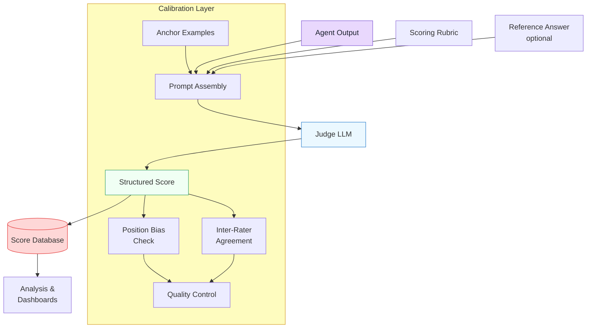

The rubric is the most critical component. A vague rubric ("rate quality from 1-5") produces inconsistent, meaningless scores. A well-designed rubric specifies exactly what each score level means, with concrete indicators that leave minimal room for interpretation.

## 10.4 Pointwise Scoring

**Pointwise scoring** is the simplest LLM-as-judge approach. The judge evaluates a single output against a rubric and assigns a score on a defined scale. Each output is scored independently -- the judge does not compare it to other outputs.

A rubric for pointwise scoring typically defines discrete levels with explicit criteria:

- **Score 5 (Excellent):** Fully addresses the question with accurate, complete information. Reasoning is clear and well-structured. No factual errors.
- **Score 4 (Good):** Addresses the question with mostly accurate information. Minor gaps or slightly unclear reasoning.
- **Score 3 (Adequate):** Partially addresses the question. Some inaccuracies or significant gaps in reasoning.
- **Score 2 (Poor):** Misses key aspects of the question. Multiple factual errors or confused reasoning.
- **Score 1 (Failing):** Does not address the question meaningfully. Major errors or incoherent response.

The advantage of pointwise scoring is its **scalability**: adding new outputs to your evaluation set does not require re-evaluating existing ones. If you have 1,000 agent outputs to evaluate, you make 1,000 independent judge calls. The disadvantage is that absolute scores are **harder to calibrate** than relative comparisons -- different judges (or the same judge on different days) may drift in how strictly they apply the rubric.

## 10.4 Pairwise Comparison

**Pairwise comparison** sidesteps the calibration problem by asking the judge a simpler question: "Which of these two outputs is better?" Instead of assigning absolute scores, the judge compares two outputs head-to-head and picks a winner.

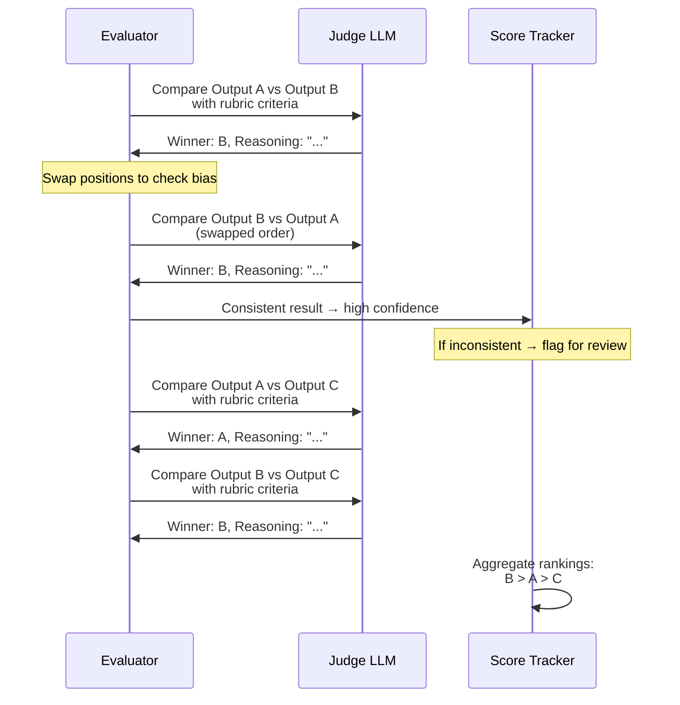

Humans find it easier to say "this is better than that" than to assign a number on an abstract scale, and LLMs exhibit the same pattern. Pairwise comparison typically achieves **higher agreement with human evaluators** than pointwise scoring. The trade-off is cost: comparing N outputs requires O(N^2) judge calls, whereas pointwise scoring requires only O(N).

> **When to use which:** Use pointwise scoring when you need to evaluate large volumes of outputs independently -- monitoring production agents, running nightly regression suites, or grading thousands of test cases. Use pairwise comparison when you need high-confidence rankings of a smaller set -- comparing two model versions, selecting the best prompt variant, or validating that a new agent beats the baseline.

## 10.4 Reference-Based Grading

**Reference-based grading** gives the judge a "gold standard" answer to compare against. Instead of evaluating the output in isolation (pointwise) or against another output (pairwise), the judge measures how well the agent's output aligns with a known-good reference.

This approach works well when reference answers exist -- for example, expert-written solutions, curated documentation, or ground-truth datasets. The judge does not simply check for string matching; it evaluates semantic equivalence, completeness, and whether the agent's output conveys the same key information as the reference, even if phrased differently.

Reference-based grading is particularly effective for **factual tasks** (question answering, information extraction, summarization) where you can define what a correct answer looks like. It is less useful for **creative or open-ended tasks** where multiple valid approaches exist and a single reference would unfairly penalize legitimate alternatives.

The rubric for reference-based grading typically evaluates:

- **Factual alignment:** Does the output contain the same key facts as the reference?
- **Completeness:** Does the output cover all important points from the reference?
- **Accuracy:** Does the output avoid introducing information not present in the reference?
- **Coherence:** Is the output well-organized, regardless of how it compares to the reference?

## 10.4 Calibration Techniques

Raw LLM judge scores are only useful if they are **calibrated** -- meaning a score of 4 today means the same thing as a score of 4 next week, and a score of 4 from Judge A means roughly the same as a score of 4 from Judge B. Several techniques improve calibration.

**Anchor examples** are the most effective calibration tool. You include 2-3 pre-scored examples directly in the judge's prompt, showing what a score of 5, 3, and 1 look like for your specific task. These **grounding examples** give the judge concrete reference points that anchor the abstract scoring scale to real outputs. Without anchors, the judge must invent its own interpretation of "what does a 4 look like?" -- and that interpretation drifts across calls.

**Chain-of-thought scoring** requires the judge to explain its reasoning before producing a score. This is not just for transparency; it measurably improves consistency. When the judge must articulate *why* an output deserves a certain score, it is forced to check its reasoning against the rubric criteria rather than producing a gut-feeling number. Always extract the score from the structured output, not from the reasoning text.

**Multi-judge ensembling** runs the same evaluation through multiple judge calls (either the same model with different temperatures or different models entirely) and aggregates the scores. This reduces variance and catches cases where a single judge call produces an outlier score. A median of three judge scores is more reliable than any single score.

## 10.4 Position Bias Mitigation

**Position bias** is the most well-documented failure mode of LLM-as-judge systems. When performing pairwise comparison, the judge LLM systematically favors whichever response appears in a particular position -- typically the first response or the last response, depending on the model. This bias can be strong enough to override genuine quality differences.

The standard mitigation is **position swapping**: evaluate each pair twice, once with Output A first and once with Output B first. If the judge picks the same winner regardless of position, the result is trustworthy. If the winner changes when you swap positions, the comparison is inconclusive and should be flagged for human review or additional evaluation.

A more sophisticated approach uses **randomized presentation order** across your entire evaluation set. Instead of always presenting outputs in the same order, randomly shuffle which appears first. Over many evaluations, position bias cancels out in the aggregate statistics even if individual comparisons are affected.

For pointwise scoring, position bias is less of a concern since there is only one output. However, **verbosity bias** is a related issue: judges tend to give higher scores to longer, more detailed responses even when the additional length adds no value. Mitigate this by explicitly instructing the judge to evaluate conciseness as a positive quality and to penalize padding.

## 10.4 Inter-Rater Agreement

**Inter-rater agreement** measures how consistently multiple judges score the same output. In human evaluation research, this is typically measured using **Cohen's kappa** (for two raters) or **Fleiss' kappa** (for multiple raters). For LLM judges, you can compute the same statistics by running the same evaluation multiple times and measuring score consistency.

A kappa score above 0.8 indicates strong agreement -- your judge is producing reliable, reproducible scores. A kappa between 0.6 and 0.8 suggests moderate agreement -- acceptable for directional insights but not for fine-grained comparisons. Below 0.6, the judge is too inconsistent to be useful, and you need to revise the rubric, add anchor examples, or switch to a more capable judge model.

In practice, you should compute inter-rater agreement as part of your **evaluation validation** workflow: before trusting a judge's scores in production, run it on a calibration set where you have human ground-truth scores and verify that the judge agrees with humans at an acceptable level.

## 10.4 Implementing an LLM Judge

The following implementation builds a reusable LLM judge with structured rubrics, anchor examples, and position bias detection. It supports both pointwise scoring and pairwise comparison:

**llm_judge.py**

```python
import anthropic
import json
import random
from dataclasses import dataclass

client = anthropic.Anthropic()
JUDGE_MODEL = "claude-sonnet-4-20250514"


@dataclass
class JudgeResult:
    score: int | None          # Pointwise score (1-5)
    winner: str | None         # Pairwise winner ("A" or "B")
    reasoning: str             # Judge's chain-of-thought
    confidence: str            # "high", "medium", or "low"
    bias_flag: bool = False    # True if position swap was inconsistent


# --- Rubric Definition ---

RUBRIC = """Evaluate the response on a 1-5 scale using these criteria:

**Correctness (40%):** Are the facts accurate? Is the reasoning sound?
**Completeness (30%):** Does the response address all parts of the question?
**Clarity (20%):** Is the response well-organized and easy to follow?
**Conciseness (10%):** Does the response avoid unnecessary padding or repetition?

Scoring guide:
- 5: Exceptional on all criteria. Could be used as a reference answer.
- 4: Strong on all criteria with minor gaps.
- 3: Adequate but with notable weaknesses in one or more criteria.
- 2: Significant issues in correctness, completeness, or clarity.
- 1: Fails to meaningfully address the question.
"""

ANCHOR_EXAMPLES = """
## 10.4 Anchor Examples

### Example: Score 5
Question: "What is a race condition?"
Response: "A race condition occurs when two or more threads access shared
data concurrently, and the outcome depends on the timing of their
execution. For example, if two threads both read a counter, increment it,
and write it back, the final value depends on which thread writes last.
The fix is synchronization: mutexes, locks, or atomic operations ensure
only one thread modifies the data at a time."
Reasoning: Accurate definition, concrete example, and solution. Concise.

### Example: Score 3
Question: "What is a race condition?"
Response: "A race condition is a bug in concurrent programming. It happens
when threads interfere with each other. You should use locks to fix it."
Reasoning: Correct direction but vague. No example. "Interfere" is imprecise.

### Example: Score 1
Question: "What is a race condition?"
Response: "A race condition is when your code runs too slowly because
of too many function calls competing for CPU time."
Reasoning: Fundamentally incorrect. Confuses concurrency bugs with
performance issues.
"""


def pointwise_score(question: str, response: str) -> JudgeResult:
    """Score a single response against the rubric."""
    prompt = f"""{RUBRIC}

{ANCHOR_EXAMPLES}

Now evaluate this response:

**Question:** {question}

**Response:** {response}

Provide your evaluation as JSON:
{{
  "reasoning": "Step-by-step evaluation against each criterion",
  "score": <1-5>,
  "confidence": "high|medium|low"
}}"""

    result = client.messages.create(
        model=JUDGE_MODEL,
        max_tokens=1024,
        messages=[{"role": "user", "content": prompt}],
    )
    verdict = json.loads(result.content[0].text)

    return JudgeResult(
        score=verdict["score"],
        winner=None,
        reasoning=verdict["reasoning"],
        confidence=verdict["confidence"],
    )


def pairwise_compare(
    question: str,
    response_a: str,
    response_b: str,
    swap: bool = False,
) -> dict:
    """Compare two responses, optionally swapping their positions."""
    if swap:
        first, second = response_b, response_a
        label_first, label_second = "B", "A"
    else:
        first, second = response_a, response_b
        label_first, label_second = "A", "B"

    prompt = f"""{RUBRIC}

Compare these two responses to the question and determine which is better.

**Question:** {question}

**Response 1:**
{first}

**Response 2:**
{second}

Evaluate BOTH responses against each rubric criterion, then pick a winner.
Do NOT let response length influence your judgment.

Provide your evaluation as JSON:
{{
  "reasoning": "Criterion-by-criterion comparison",
  "winner": "Response 1" or "Response 2",
  "confidence": "high|medium|low"
}}"""

    result = client.messages.create(
        model=JUDGE_MODEL,
        max_tokens=1024,
        messages=[{"role": "user", "content": prompt}],
    )
    verdict = json.loads(result.content[0].text)

    # Map back to original labels
    if verdict["winner"] == "Response 1":
        mapped_winner = label_first
    else:
        mapped_winner = label_second

    return {"winner": mapped_winner, **verdict}


def pairwise_with_bias_check(
    question: str,
    response_a: str,
    response_b: str,
) -> JudgeResult:
    """Run pairwise comparison with position-swap bias detection."""

    # Evaluate in both orderings
    result_normal = pairwise_compare(question, response_a, response_b, swap=False)
    result_swapped = pairwise_compare(question, response_a, response_b, swap=True)

    consistent = result_normal["winner"] == result_swapped["winner"]

    return JudgeResult(
        score=None,
        winner=result_normal["winner"] if consistent else None,
        reasoning=(
            f"Normal: {result_normal['reasoning']}\\n\\n"
            f"Swapped: {result_swapped['reasoning']}"
        ),
        confidence="high" if consistent else "low",
        bias_flag=not consistent,
    )


# --- Usage ---

question = "Explain the CAP theorem and its implications for distributed systems."

response_a = (
    "The CAP theorem states that a distributed system can provide at most "
    "two of three guarantees: Consistency (all nodes see the same data), "
    "Availability (every request gets a response), and Partition tolerance "
    "(the system works despite network splits). Since network partitions "
    "are unavoidable in practice, the real choice is between CP (consistent "
    "but may reject requests during partitions) and AP (always available "
    "but may return stale data). Modern systems like DynamoDB choose AP "
    "with tunable consistency, while systems like Spanner choose CP with "
    "high availability through engineering."
)

response_b = (
    "CAP theorem is about databases. You can only pick two of consistency, "
    "availability, and partition tolerance. Most systems pick availability."
)

# Pointwise scoring
print("=== Pointwise Scoring ===")
score_a = pointwise_score(question, response_a)
score_b = pointwise_score(question, response_b)
print(f"Response A: {score_a.score}/5 ({score_a.confidence} confidence)")
print(f"Response B: {score_b.score}/5 ({score_b.confidence} confidence)")

# Pairwise comparison with bias check
print("\\n=== Pairwise Comparison ===")
comparison = pairwise_with_bias_check(question, response_a, response_b)
if comparison.bias_flag:
    print("Position bias detected -- result inconclusive")
else:
    print(f"Winner: Response {comparison.winner} ({comparison.confidence} confidence)")
```

Several design choices in this implementation deserve attention. The rubric breaks evaluation into **weighted criteria** (correctness, completeness, clarity, conciseness) rather than asking for a single holistic score -- this forces the judge to evaluate each dimension and produces more consistent results. The **anchor examples** are embedded directly in the prompt, grounding the abstract 1-5 scale with concrete reference points. The `pairwise_with_bias_check` function runs every comparison twice with swapped positions, automatically flagging cases where the winner changes -- these are unreliable and should be escalated to human review or a stronger judge model.

Notice that the judge uses `claude-sonnet-4-20250514` rather than a larger model. In practice, the judge model should be **at least as capable** as the agent being evaluated. Using a weaker model to judge a stronger model's output produces unreliable scores -- the judge cannot recognize quality it cannot itself produce. When evaluating outputs from a frontier model, use the same frontier model (or a different one) as the judge.

## 10.4 Connecting to Debate-as-Evaluation

In Module 9, Lesson 06, you built adversarial debate systems where a proposer, challenger, and judge collaborate to improve answer quality. That same debate structure can be repurposed as an **evaluation technique**. Instead of using debate to generate better answers, you use it to generate better *evaluations*.

The approach works like this: two judge agents independently score an output, and if they disagree, they debate their reasoning. A meta-judge reads the debate transcript and renders a final verdict. This **judge debate** pattern is particularly useful for ambiguous cases where reasonable evaluators might disagree -- the debate forces each judge to articulate *why* it assigned a particular score, surfacing criteria that a single judge might apply inconsistently.

This is more expensive than a single judge call, but it produces evaluation scores that are more trustworthy for high-stakes decisions -- choosing between model versions, deciding whether an agent is ready for production, or evaluating safety-critical outputs where a wrong evaluation could have real consequences.

## 10.4 Summary

**LLM-as-judge** evaluation uses language models to score agent outputs at scale, bridging the gap between cheap-but-brittle automated metrics and expensive-but-accurate human review. **Pointwise scoring** evaluates individual outputs against a structured rubric, scaling linearly with the number of outputs. **Pairwise comparison** asks which of two outputs is better, achieving higher agreement with human evaluators at the cost of quadratic scaling. **Reference-based grading** measures outputs against known-good answers, working best for factual tasks.

**Calibration** is essential: without **anchor examples**, **chain-of-thought scoring**, and **multi-judge ensembling**, raw judge scores drift and lose meaning. **Position bias** -- the tendency to favor responses based on their presentation order -- must be actively mitigated through position swapping or randomized ordering. **Inter-rater agreement** (measured by Cohen's or Fleiss' kappa) tells you whether your judge is reliable enough to trust.

The debate patterns from Module 9, Lesson 06 connect naturally to evaluation: structured disagreement between judges produces more trustworthy scores for ambiguous cases, just as debate between agents produces more trustworthy answers.

In the next lesson, you will explore **tracing and debugging** -- the complementary skill of understanding *why* an agent produced a particular output, so you know what to fix when the judge identifies a problem.

---

    Section 10.5: Tracing and Debugging Agents


## 10.5 Overview

In Module 5, Lesson 3, you built **middleware and hooks** that intercept every tool call -- logging inputs, outputs, and latency in a composable pipeline. That middleware gives you *local* visibility into individual tool invocations. But when an agent chains together ten LLM calls, five tool executions, and three reasoning steps to answer a single question, you need something more: a way to see the *entire execution* as a connected story, with each step nested inside the one that triggered it.

This is the problem that **observability** solves for agent systems. In traditional software, observability means logs, metrics, and traces. For agents, tracing is by far the most important of the three. A single log line telling you "tool X returned Y" is nearly useless without knowing *why* the agent called that tool, *what* it planned to do with the result, and *what happened next*. Traces give you that full picture.

This lesson introduces distributed tracing for agents, the tooling ecosystem that supports it, common failure patterns you will encounter, and a systematic debugging workflow. By the end, you will be able to instrument an agent so that every run produces a queryable, visual trace -- and you will know how to read that trace to diagnose failures in minutes instead of hours.

## 10.5 What Is an Agent Trace?

An **agent trace** is a structured record of everything that happened during a single agent run, organized as a tree of **spans**. Each span represents one unit of work: an LLM call, a tool execution, a reasoning step, or an orchestration decision. Spans are nested -- a "plan-and-execute" span might contain child spans for each step, and each step span might contain child spans for the LLM call and the tool call within it.

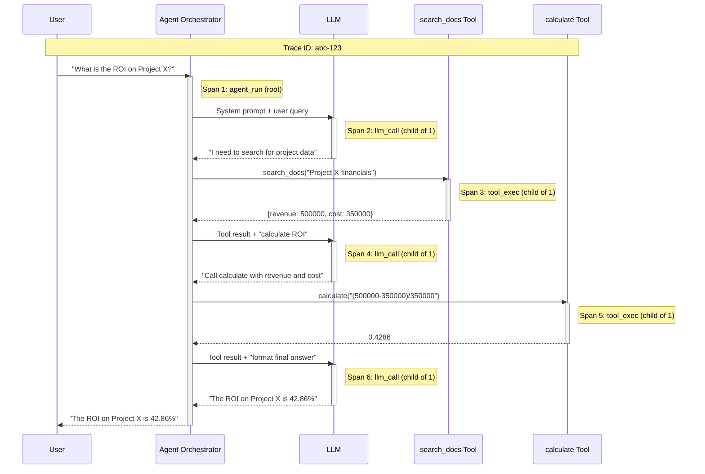

Every span records the same core data: a **span name** (what happened), a **start and end timestamp** (how long it took), **attributes** (key-value metadata like model name, token count, or tool arguments), and a **status** (success or error). The spans share a single **trace ID** so they can be stitched together into one tree, no matter how many services or processes they pass through.

This is the same model used by **OpenTelemetry**, the industry standard for distributed tracing. OpenTelemetry was built for microservices -- tracing an HTTP request as it flows through ten backend services. Agent tracing applies the same idea to a different kind of distributed system: one where the "services" are LLM calls, tool executions, and reasoning steps, and the "request" is a user query being processed through a multi-step agent loop.

## 10.5 The Tracing Stack

Agent tracing builds on three layers:

- **Instrumentation** -- the code in your agent that creates spans, records attributes, and propagates trace context. This is what you write (or what a framework provides automatically).
- **Collection** -- a backend that receives spans and stores them. OpenTelemetry collectors, Jaeger, or managed services like Datadog and Honeycomb.
- **Visualization** -- a UI that renders traces as flame charts or waterfall diagrams, lets you search by attributes, and alerts on anomalies.

For agent-specific tracing, a new category of tools has emerged that combines all three layers with LLM-aware features:

| Tool | Strength | How It Works |
|------|----------|--------------|
| **LangSmith** | Deep LangChain integration, dataset management | Auto-instruments LangChain; manual SDK for other frameworks |
| **Arize Phoenix** | Open-source, local-first, evaluation integration | OpenTelemetry-native; runs locally or hosted |
| **Braintrust** | Eval-first, prompt playground, scoring | SDK wraps LLM calls; ties traces to eval scores |
| **OpenTelemetry + Jaeger** | Vendor-neutral, full control, existing infra | Manual instrumentation; works with any agent framework |
| **Langfuse** | Open-source, self-hostable, cost tracking | SDK or OpenTelemetry bridge; strong cost analytics |

The choice depends on your constraints. If you use LangChain or LangGraph, LangSmith gives you zero-config tracing. If you want vendor neutrality and already run OpenTelemetry in production, instrument with the OpenTelemetry SDK. If you want a local, open-source option, Arize Phoenix runs as a standalone server with no cloud dependency.

## 10.5 Implementing a Tracing Decorator

Let us build a tracing decorator that captures agent execution traces using OpenTelemetry. This connects directly to the middleware pattern from Module 5 -- but instead of intercepting tool calls at the middleware layer, we are creating spans that nest the entire agent lifecycle.

**agent_tracing.py**

```python
import time
import json
import functools
from dataclasses import dataclass, field
from typing import Any, Optional
from contextvars import ContextVar

# --- Span and Trace Data Structures ---

@dataclass
class Span:
    """A single unit of work in an agent trace."""
    name: str
    span_type: str  # "llm_call", "tool_exec", "reasoning", "agent_run"
    trace_id: str
    span_id: str
    parent_span_id: Optional[str]
    start_time: float
    end_time: Optional[float] = None
    status: str = "ok"
    attributes: dict = field(default_factory=dict)
    events: list = field(default_factory=list)
    children: list = field(default_factory=list)

    @property
    def duration_ms(self) -> float:
        if self.end_time is None:
            return 0.0
        return (self.end_time - self.start_time) * 1000


@dataclass
class Trace:
    """A complete agent execution trace."""
    trace_id: str
    root_span: Optional[Span] = None
    spans: list = field(default_factory=list)

    def summary(self) -> dict:
        llm_calls = [s for s in self.spans if s.span_type == "llm_call"]
        tool_execs = [s for s in self.spans if s.span_type == "tool_exec"]
        errors = [s for s in self.spans if s.status == "error"]
        total_tokens = sum(
            s.attributes.get("total_tokens", 0) for s in llm_calls
        )
        return {
            "trace_id": self.trace_id,
            "total_spans": len(self.spans),
            "llm_calls": len(llm_calls),
            "tool_executions": len(tool_execs),
            "errors": len(errors),
            "total_tokens": total_tokens,
            "total_duration_ms": (
                self.root_span.duration_ms if self.root_span else 0
            ),
        }
```

This defines the core data structures. A `Span` records one unit of work, and a `Trace` collects all spans from a single agent run. The `summary()` method gives you the high-level metrics you need for monitoring: how many LLM calls, how many tool executions, how many errors, total tokens, and total duration.

Now the tracing context manager and decorators:

**agent_tracing.py (continued)**

```python
import uuid
from contextlib import contextmanager

# Context variable tracks the current active span
_current_span: ContextVar[Optional[Span]] = ContextVar(
    "_current_span", default=None
)
_current_trace: ContextVar[Optional[Trace]] = ContextVar(
    "_current_trace", default=None
)


@contextmanager
def start_trace(name: str = "agent_run"):
    """Start a new trace context for an agent run."""
    trace_id = uuid.uuid4().hex[:16]
    trace = Trace(trace_id=trace_id)
    token = _current_trace.set(trace)
    try:
        with start_span(name, span_type="agent_run") as root_span:
            trace.root_span = root_span
            yield trace
    finally:
        _current_trace.reset(token)


@contextmanager
def start_span(name: str, span_type: str = "generic", **attrs):
    """Create a child span under the current active span."""
    trace = _current_trace.get()
    parent = _current_span.get()
    span = Span(
        name=name,
        span_type=span_type,
        trace_id=trace.trace_id if trace else "no-trace",
        span_id=uuid.uuid4().hex[:12],
        parent_span_id=parent.span_id if parent else None,
        start_time=time.time(),
        attributes=dict(attrs),
    )
    if parent:
        parent.children.append(span)
    if trace:
        trace.spans.append(span)

    token = _current_span.set(span)
    try:
        yield span
        span.status = "ok"
    except Exception as e:
        span.status = "error"
        span.events.append({
            "name": "exception",
            "timestamp": time.time(),
            "attributes": {
                "exception.type": type(e).__name__,
                "exception.message": str(e),
            },
        })
        raise
    finally:
        span.end_time = time.time()
        _current_span.reset(token)


def trace_llm_call(func):
    """Decorator that wraps an LLM call in a tracing span."""
    @functools.wraps(func)
    def wrapper(*args, **kwargs):
        model = kwargs.get("model", "unknown")
        with start_span(
            f"llm_call:{func.__name__}",
            span_type="llm_call",
            model=model,
        ) as span:
            result = func(*args, **kwargs)
            # Record token usage if returned
            if isinstance(result, dict):
                span.attributes["total_tokens"] = result.get(
                    "total_tokens", 0
                )
                span.attributes["prompt_tokens"] = result.get(
                    "prompt_tokens", 0
                )
            return result
    return wrapper


def trace_tool(func):
    """Decorator that wraps a tool execution in a tracing span."""
    @functools.wraps(func)
    def wrapper(*args, **kwargs):
        with start_span(
            f"tool:{func.__name__}",
            span_type="tool_exec",
            tool_name=func.__name__,
            tool_args=json.dumps(kwargs, default=str)[:500],
        ) as span:
            result = func(*args, **kwargs)
            span.attributes["result_preview"] = str(result)[:200]
            return result
    return wrapper
```

Notice how `ContextVar` handles the parent-child nesting automatically. When you enter a `start_span` context, the new span becomes the "current" span. Any span created inside that context gets the outer span as its parent. This is exactly how OpenTelemetry's context propagation works -- `ContextVar` ensures it is thread-safe and async-safe.

Here is how you use it in an actual agent:

**run_agent.py**

```python
# --- Using the Tracer in an Agent ---

@trace_tool
def search_docs(query: str) -> dict:
    """Search the document store."""
    # Simulate a document search
    return {"results": [f"Doc about {query}"], "count": 1}


@trace_tool
def calculate(expression: str) -> float:
    """Evaluate a math expression."""
    return eval(expression)  # In production, use a safe parser


@trace_llm_call
def call_llm(messages: list, model: str = "claude-sonnet") -> dict:
    """Call the LLM with messages."""
    # Simulated -- replace with actual API call
    return {
        "content": "I'll search for the data first.",
        "total_tokens": 150,
        "prompt_tokens": 100,
    }


def run_agent(user_query: str):
    with start_trace("research_agent") as trace:
        # Step 1: Initial LLM reasoning
        response = call_llm(
            messages=[{"role": "user", "content": user_query}],
            model="claude-sonnet",
        )

        # Step 2: Tool execution
        with start_span("planning", span_type="reasoning"):
            docs = search_docs(query=user_query)

        # Step 3: Follow-up LLM call with tool results
        final = call_llm(
            messages=[
                {"role": "user", "content": user_query},
                {"role": "assistant", "content": str(docs)},
            ],
            model="claude-sonnet",
        )

        # Print the trace summary
        summary = trace.summary()
        print(f"Trace {summary['trace_id']}:")
        print(f"  Spans: {summary['total_spans']}")
        print(f"  LLM calls: {summary['llm_calls']}")
        print(f"  Tool executions: {summary['tool_executions']}")
        print(f"  Total tokens: {summary['total_tokens']}")
        print(f"  Duration: {summary['total_duration_ms']:.1f}ms")
        return trace


# Run it
trace = run_agent("What is the ROI on Project X?")
```

This produces a trace with five spans: the root `agent_run`, two `llm_call` spans, one `reasoning` span, and one `tool_exec` span nested inside the reasoning span. Every span records its duration, parent, and attributes. In production, you would export these spans to an OpenTelemetry collector or a tool like LangSmith instead of printing them.

## 10.5 Common Agent Failure Patterns

Traces are only useful if you know what to look for. After debugging hundreds of agent runs, certain failure patterns appear again and again. Knowing these patterns lets you jump straight to the relevant spans instead of reading every line of a trace.

**Infinite loops** -- The agent repeats the same action endlessly. In the trace, you see a repeating pattern of identical spans: the same tool called with the same arguments, or the same LLM producing the same reasoning. The root cause is usually a loop exit condition that depends on tool output that never changes, or a reasoning pattern where the LLM cannot recognize it is stuck.

**Tool misuse** -- The agent calls a tool with wrong arguments, calls a tool that does not exist (hallucinated tool names), or calls the right tool but misinterprets the result. In the trace, look for `tool_exec` spans with error status or with arguments that do not match the tool's expected schema.

**Reasoning errors** -- The LLM's chain of thought leads to a wrong conclusion even though all the data was correct. The trace shows correct tool outputs but incorrect reasoning in the subsequent LLM call. This is the hardest failure to catch automatically because the spans all show "ok" status.

**Context overflow** -- The conversation grows so long that the LLM starts losing early context. The trace shows increasing token counts across LLM calls, and the quality of responses degrades in later spans. Look for `prompt_tokens` attributes that approach the model's context window limit.

**Cascading failures** -- One tool fails, and the agent's attempt to recover makes things worse. The trace shows an error span followed by increasingly confused LLM reasoning as the agent tries to work around the missing data. This is where the **fallback and escalation patterns** from Module 5 come in -- without them, one failure poisons the entire run.

## 10.5 The Debugging Decision Tree

When an agent produces a wrong answer, you need a systematic approach. Do not guess -- follow the trace.

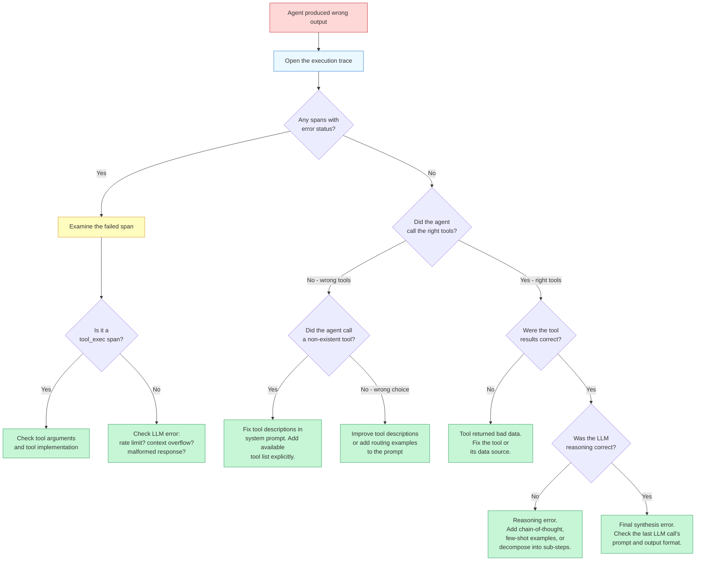

This decision tree encodes a key principle: **always start with the trace, never with the prompt**. Most developers instinctively reach for the system prompt when an agent fails. But the trace tells you *where* the failure happened, and that determines *what* to fix. A tool returning stale data will not be fixed by rewriting the prompt. A reasoning error will not be fixed by changing the tool implementation. The trace directs your attention to the right layer.

## 10.5 Debugging Strategies in Practice

Beyond the decision tree, several strategies make agent debugging significantly more productive:

**Trace comparison** -- When an agent sometimes succeeds and sometimes fails on similar inputs, export a passing trace and a failing trace, then diff them. The divergence point tells you exactly which step behaves differently. Most tracing tools support side-by-side trace comparison for this purpose.

**Span filtering** -- In a complex agent with dozens of spans, filter by `span_type` to focus on one layer at a time. Start with `tool_exec` spans to verify all tool calls succeeded. Then check `llm_call` spans to verify the reasoning. This layered approach prevents information overload.

**Replay and time-travel** -- Some tracing tools (LangSmith, Braintrust) let you replay a traced run with modified inputs. If you suspect a tool returned bad data, you can edit the tool's return value in the trace and re-run the downstream LLM calls to confirm that fixing the data fixes the output. This is dramatically faster than re-running the entire agent.

**Cost attribution** -- Each `llm_call` span records token counts. Aggregating these by span type or by step tells you where your agent spends money. A common finding: agents waste 60-80% of their tokens on retries and recovery from earlier failures. Fixing the root cause of the first failure cuts costs more than optimizing the prompts.

> **Key takeaway:** Tracing is not just for debugging failures. It is also how you discover that your agent takes twelve steps to do something that should take four, that it calls the same tool three times with identical arguments, or that 90% of your token budget goes to a single reasoning step. The traces reveal optimization opportunities that are invisible without instrumentation.

## 10.5 From Middleware to Traces: Connecting the Layers

In Module 5, Lesson 3, you built logging middleware that records every tool call's inputs, outputs, and latency. That middleware is the *instrumentation layer* of your tracing stack. The connection is direct: each `before_tool` and `after_tool` hook in your middleware creates a `tool_exec` span in the trace.

The key difference is **context propagation**. Middleware sees individual tool calls in isolation. Tracing connects those calls into a tree by passing a trace ID and parent span ID through the entire execution. The `ContextVar` approach in the code above achieves this within a single process. For **distributed tracing** -- where your agent calls tools that run in separate services, or where multiple agents collaborate -- you propagate the trace context through HTTP headers (the W3C `traceparent` header) or message metadata.

This is where OpenTelemetry shines. If your tools are microservices that already use OpenTelemetry, your agent traces automatically connect to your tool traces. You see the full picture: the agent decided to call the search API, the search API processed the query, the database executed the SQL, and the result flowed back through every layer. One trace, one view, complete visibility.

## 10.5 Summary

Tracing is the foundation of agent observability. A single agent run becomes a tree of spans -- LLM calls, tool executions, reasoning steps -- that you can visualize, search, and analyze. The tracing decorator pattern gives you instrumentation with minimal code changes, and tools like LangSmith, Arize Phoenix, and OpenTelemetry provide the collection and visualization layers.

The debugging decision tree gives you a systematic workflow: start with the trace, check for errors, verify tool calls, verify tool results, then check reasoning. This layered approach prevents the most common debugging mistake -- guessing that the problem is in the prompt when it is actually in the data.

Common failure patterns -- infinite loops, tool misuse, reasoning errors, context overflow, and cascading failures -- each leave a distinct signature in the trace. Learning to recognize these signatures is the difference between spending five minutes and five hours on a bug.

In the next lesson, you will put these ideas into practice in the **Evaluation Lab**, building an evaluation harness that uses traces to score agent runs automatically. And looking ahead to Module 11: the traces you build here become your **production monitoring backbone**. The same instrumentation that helps you debug in development becomes the telemetry that keeps your agents healthy in production -- alerting on error rates, tracking latency trends, and catching regressions before your users do.

---

    Section 10.6: Evaluation Lab


## 10.6 Overview

You have spent five lessons building a conceptual toolkit for agent evaluation. You understand why evaluation matters, how public benchmarks measure capability, what testing strategies apply at each level, how LLM-as-judge scoring works, and how tracing reveals what happens inside a running agent. Each of those lessons gave you a piece of the puzzle. This lesson assembles them into a single, working system.

The **evaluation harness** you will build in this lesson is the engine that ties everything together. It takes a set of test cases with expected outcomes, runs your agent against each one, scores the results using an LLM judge, aggregates those scores into a report, and compares them against a saved baseline to detect regressions. When you change your agent's prompts, swap models, update tools, or refactor orchestration logic, the harness tells you whether the change helped, hurt, or had no effect -- before that change reaches users.

This is a hands-on lesson. You will build the harness incrementally across four stages, with each stage producing working code that feeds into the next.

## 10.6 Architecture of the Evaluation Harness

Before writing any code, look at the full system you are building. The architecture has five components connected in a pipeline. Test cases flow in one end, and a regression report comes out the other.

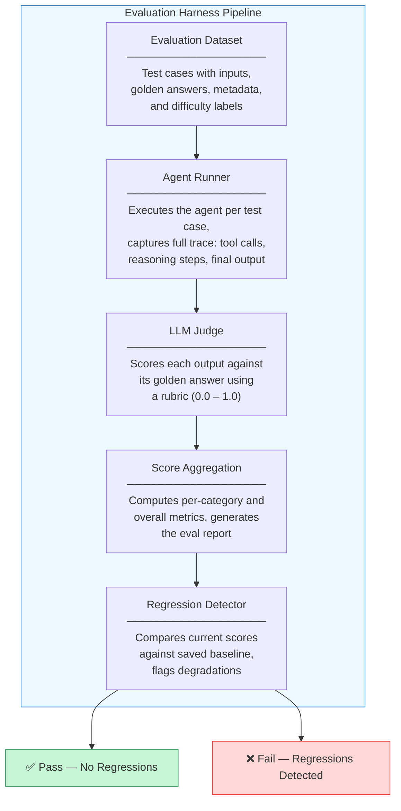

Each component is deliberately simple. The power comes from their composition: the dataset defines what to test, the runner executes it, the judge scores it, the aggregator summarizes it, and the regression detector decides whether you should merge the change or investigate further.

## 10.6 Stage 1: Define the Evaluation Dataset

Every evaluation starts with data. An **evaluation dataset** is a collection of test cases, where each test case specifies an input to give the agent and the expected output you want back. Without golden answers, you have no ground truth. Without ground truth, you have no measurement.

A well-structured test case includes more than just input and output. It carries metadata -- a category label for grouping, a difficulty rating for stratified analysis, and a unique identifier for tracking results across runs.

**eval_dataset.py**

```python
import json
from dataclasses import dataclass, field, asdict
from typing import Optional


@dataclass
class EvalTestCase:
    """A single evaluation test case with input, expected output, and metadata."""

    id: str
    input_text: str
    golden_answer: str
    category: str
    difficulty: str = "medium"  # easy, medium, hard
    metadata: dict = field(default_factory=dict)


@dataclass
class EvalDataset:
    """A collection of test cases that can be saved and loaded."""

    name: str
    version: str
    test_cases: list[EvalTestCase] = field(default_factory=list)

    def add_case(self, case: EvalTestCase) -> None:
        self.test_cases.append(case)

    def filter_by_category(self, category: str) -> list[EvalTestCase]:
        return [tc for tc in self.test_cases if tc.category == category]

    def save(self, path: str) -> None:
        with open(path, "w") as f:
            json.dump(asdict(self), f, indent=2)

    @classmethod
    def load(cls, path: str) -> "EvalDataset":
        with open(path) as f:
            data = json.load(f)
        cases = [EvalTestCase(**tc) for tc in data["test_cases"]]
        return cls(name=data["name"], version=data["version"], test_cases=cases)


# Build a dataset for a research agent
dataset = EvalDataset(name="research-agent-eval", version="1.0")

dataset.add_case(EvalTestCase(
    id="fact-001",
    input_text="What is the capital of France and what is its population?",
    golden_answer="Paris, with a population of approximately 2.1 million in the city proper.",
    category="factual",
    difficulty="easy",
))

dataset.add_case(EvalTestCase(
    id="reason-001",
    input_text="Compare the trade-offs between microservices and monolithic architecture for a startup with 5 engineers.",
    golden_answer="For a 5-person startup, a monolith is typically preferable: simpler deployment, less operational overhead, easier debugging, and faster iteration. Microservices add network complexity, require service discovery, and demand DevOps maturity that small teams rarely have. Start monolithic, extract services only when specific scaling bottlenecks emerge.",
    category="reasoning",
    difficulty="hard",
))

dataset.add_case(EvalTestCase(
    id="tool-001",
    input_text="Find the current weather in Tokyo and convert the temperature from Celsius to Fahrenheit.",
    golden_answer="The agent should call a weather API tool for Tokyo, retrieve the temperature in Celsius, and compute the Fahrenheit equivalent using F = C * 9/5 + 32.",
    category="tool_use",
    difficulty="medium",
))

dataset.save("research_agent_eval_v1.json")
print(f"Dataset saved: {len(dataset.test_cases)} test cases")
```

Notice that the golden answers are not rigid templates. For factual questions, the golden answer states the expected fact. For reasoning questions, it captures the key points the response should cover. For tool-use questions, it describes the expected behavior sequence. The LLM judge you build in Stage 3 will compare agent output against these references using semantic understanding, not string matching.

**Versioning your datasets** is critical. When you add new test cases or refine golden answers, bump the version string. This lets you correlate evaluation results with the exact dataset that produced them. Without versioning, you cannot tell whether a score change came from a better agent or a harder dataset.

## 10.6 Stage 2: Build the Agent Runner

The **agent runner** is the component that executes your agent on each test case and captures the results. It needs to record not just the final output, but the full execution trace -- every tool call, every reasoning step, every intermediate decision. The trace is what lets you debug failures after the evaluation finishes.

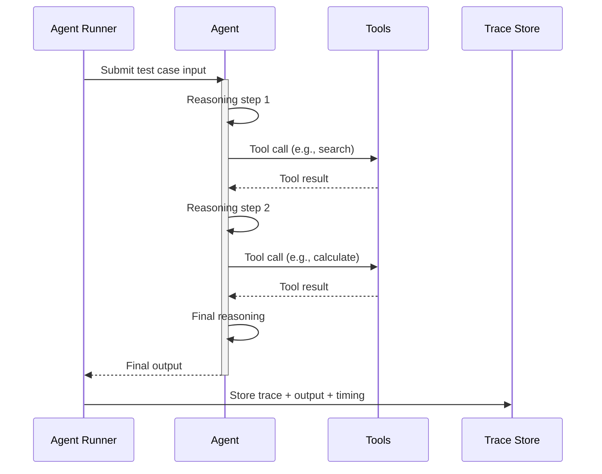

**agent_runner.py**

```python
import time
from dataclasses import dataclass, field
from typing import Callable, Any


@dataclass
class ToolCall:
    """A single tool invocation recorded during agent execution."""

    tool_name: str
    tool_input: dict
    tool_output: str
    duration_ms: float


@dataclass
class AgentTrace:
    """Complete execution trace for one test case."""

    test_case_id: str
    final_output: str
    tool_calls: list[ToolCall] = field(default_factory=list)
    reasoning_steps: list[str] = field(default_factory=list)
    total_duration_ms: float = 0.0
    error: str | None = None


@dataclass
class EvalResult:
    """Pairs a trace with its test case for downstream scoring."""

    test_case: "EvalTestCase"
    trace: AgentTrace


class AgentRunner:
    """Executes an agent function against every test case in a dataset."""

    def __init__(self, agent_fn: Callable[[str], dict], concurrency: int = 1):
        self.agent_fn = agent_fn
        self.concurrency = concurrency

    def run_single(self, test_case: "EvalTestCase") -> EvalResult:
        """Run the agent on a single test case and capture the trace."""
        start = time.time()
        try:
            result = self.agent_fn(test_case.input_text)
            duration = (time.time() - start) * 1000

            trace = AgentTrace(
                test_case_id=test_case.id,
                final_output=result.get("output", ""),
                tool_calls=[
                    ToolCall(**tc) for tc in result.get("tool_calls", [])
                ],
                reasoning_steps=result.get("reasoning_steps", []),
                total_duration_ms=duration,
            )
        except Exception as e:
            duration = (time.time() - start) * 1000
            trace = AgentTrace(
                test_case_id=test_case.id,
                final_output="",
                total_duration_ms=duration,
                error=str(e),
            )

        return EvalResult(test_case=test_case, trace=trace)

    def run_dataset(self, dataset: "EvalDataset") -> list[EvalResult]:
        """Run the agent on every test case in the dataset."""
        results = []
        for i, test_case in enumerate(dataset.test_cases):
            print(f"Running [{i+1}/{len(dataset.test_cases)}]: {test_case.id}")
            result = self.run_single(test_case)
            if result.trace.error:
                print(f"  ERROR: {result.trace.error}")
            else:
                print(f"  Done in {result.trace.total_duration_ms:.0f}ms "
                      f"({len(result.trace.tool_calls)} tool calls)")
            results.append(result)
        return results


# Example: wrap your agent as a callable
def my_research_agent(input_text: str) -> dict:
    """
    Replace this with your actual agent invocation.
    Must return a dict with 'output' and optionally 'tool_calls'
    and 'reasoning_steps'.
    """
    # In practice, this calls your LLM agent
    return {
        "output": "Paris is the capital of France with ~2.1 million people.",
        "tool_calls": [],
        "reasoning_steps": ["Identified factual question", "Retrieved answer"],
    }


runner = AgentRunner(agent_fn=my_research_agent)
# results = runner.run_dataset(dataset)
```

Two design decisions deserve explanation. First, the runner wraps every execution in a try/except block. Agents fail -- they hit rate limits, produce malformed tool calls, or enter infinite loops. A crashed evaluation is worse than a low score because it produces no data at all. Catching errors and recording them as failed traces lets the rest of the pipeline continue.

Second, the runner captures timing data. **Latency** is an evaluation dimension that purely accuracy-focused systems overlook. An agent that produces perfect answers in thirty seconds may be worse for your users than one that produces good answers in two seconds. Recording duration per test case lets you track performance regressions alongside quality regressions.

## 10.6 Stage 3: Implement LLM-as-Judge Scoring

You built the conceptual foundation for LLM-as-judge evaluation in Lesson 04. Now you implement it. The **scoring function** takes each evaluation result -- the agent's output paired with the golden answer -- and asks a judge LLM to rate it on a 0.0 to 1.0 scale using a structured rubric.

**llm_judge.py**

```python
import json
from dataclasses import dataclass


@dataclass
class JudgeScore:
    """Score assigned by the LLM judge for one test case."""

    test_case_id: str
    score: float          # 0.0 to 1.0
    reasoning: str        # Judge's explanation
    category: str
    difficulty: str


JUDGE_PROMPT = """You are an evaluation judge. Compare the agent's output against
the golden answer and assign a score from 0.0 to 1.0.

## 10.6 Scoring Rubric

- **1.0**: The output fully addresses the question with correct, complete information
  that covers all key points in the golden answer.
- **0.75**: The output is mostly correct and covers the main points, with minor
  omissions or imprecisions that do not mislead.
- **0.5**: The output is partially correct. It addresses the question but misses
  significant points or includes some inaccuracies.
- **0.25**: The output attempts to answer but is mostly incorrect or misses the
  core point of the golden answer.
- **0.0**: The output is completely wrong, irrelevant, empty, or the agent errored.

## 10.6 Input

**Question:** {question}

**Golden Answer:** {golden_answer}

**Agent Output:** {agent_output}

## 10.6 Instructions

Evaluate the agent output against the golden answer. Consider semantic equivalence,
not exact wording. The agent may phrase things differently and still be correct.
Respond with ONLY a JSON object:

{{"score": <float>, "reasoning": "<one paragraph explanation>"}}
"""


def judge_single(
    eval_result: "EvalResult",
    llm_call: callable,
) -> JudgeScore:
    """Score a single evaluation result using the LLM judge."""

    test_case = eval_result.test_case
    agent_output = eval_result.trace.final_output

    # Handle agent errors as automatic zero
    if eval_result.trace.error:
        return JudgeScore(
            test_case_id=test_case.id,
            score=0.0,
            reasoning=f"Agent errored: {eval_result.trace.error}",
            category=test_case.category,
            difficulty=test_case.difficulty,
        )

    prompt = JUDGE_PROMPT.format(
        question=test_case.input_text,
        golden_answer=test_case.golden_answer,
        agent_output=agent_output,
    )

    # Call the judge LLM
    response = llm_call(prompt)

    try:
        parsed = json.loads(response)
        score = max(0.0, min(1.0, float(parsed["score"])))
        reasoning = parsed["reasoning"]
    except (json.JSONDecodeError, KeyError, ValueError):
        score = 0.0
        reasoning = f"Judge response could not be parsed: {response[:200]}"

    return JudgeScore(
        test_case_id=test_case.id,
        score=score,
        reasoning=reasoning,
        category=test_case.category,
        difficulty=test_case.difficulty,
    )


def judge_all(
    eval_results: list["EvalResult"],
    llm_call: callable,
) -> list[JudgeScore]:
    """Score all evaluation results."""
    scores = []
    for i, result in enumerate(eval_results):
        print(f"Judging [{i+1}/{len(eval_results)}]: {result.test_case.id}")
        score = judge_single(result, llm_call)
        print(f"  Score: {score.score:.2f} — {score.reasoning[:80]}...")
        scores.append(score)
    return scores
```

The rubric is the most important part of this code. A vague rubric produces noisy scores. A specific rubric produces consistent ones. Notice how each score level has concrete criteria: "fully addresses," "mostly correct with minor omissions," "partially correct with significant gaps." These criteria give the judge LLM clear decision boundaries.

Three defensive measures protect against judge failures. First, agent errors bypass the judge entirely and receive an automatic zero -- there is no point asking a judge to evaluate an empty output. Second, the score is clamped to the 0.0-1.0 range in case the judge returns an out-of-bounds value. Third, JSON parsing failures produce a zero with an explanatory message rather than crashing the pipeline.

> **Key insight from Lesson 04:** Use a different model for the judge than for the agent under evaluation. If your agent runs on Claude Sonnet, judge with Claude Opus. This avoids the self-evaluation bias where a model rates its own outputs too favorably.

## 10.6 Stage 4: Add Regression Detection

Scores from a single run are useful, but the real value of an evaluation harness is **regression detection** -- the ability to compare the current run against a known baseline and flag any degradation. Without regression detection, you are flying blind every time you change your agent.

The regression detector loads a saved baseline (the scores from your last known-good run), compares it category-by-category against the current run, and flags any category where the score dropped by more than a configurable threshold.

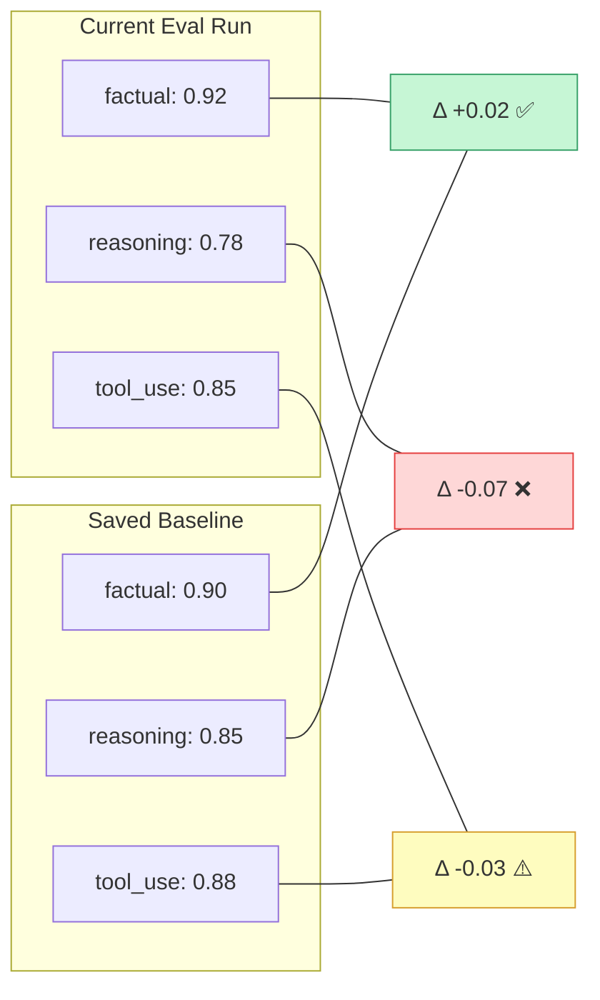

**regression_detector.py**

```python
import json
from dataclasses import dataclass, asdict
from collections import defaultdict


@dataclass
class CategoryMetrics:
    """Aggregated metrics for one category."""

    category: str
    mean_score: float
    num_cases: int
    scores_by_difficulty: dict[str, float]


@dataclass
class EvalReport:
    """Full evaluation report with per-category and overall metrics."""

    overall_score: float
    categories: list[CategoryMetrics]
    total_cases: int
    total_errors: int

    def save_as_baseline(self, path: str) -> None:
        """Save this report as the baseline for future comparisons."""
        data = {
            "overall_score": self.overall_score,
            "total_cases": self.total_cases,
            "categories": {
                cat.category: {
                    "mean_score": cat.mean_score,
                    "num_cases": cat.num_cases,
                    "by_difficulty": cat.scores_by_difficulty,
                }
                for cat in self.categories
            },
        }
        with open(path, "w") as f:
            json.dump(data, f, indent=2)
        print(f"Baseline saved to {path}")


@dataclass
class RegressionResult:
    """Result of comparing current scores against a baseline."""

    category: str
    baseline_score: float
    current_score: float
    delta: float
    status: str  # "pass", "warn", "fail"


def aggregate_scores(scores: list["JudgeScore"]) -> EvalReport:
    """Aggregate individual scores into a structured report."""

    by_category = defaultdict(list)
    by_cat_difficulty = defaultdict(lambda: defaultdict(list))
    errors = sum(1 for s in scores if s.score == 0.0 and "errored" in s.reasoning)

    for s in scores:
        by_category[s.category].append(s.score)
        by_cat_difficulty[s.category][s.difficulty].append(s.score)

    categories = []
    for cat, cat_scores in sorted(by_category.items()):
        difficulty_means = {
            diff: sum(diff_scores) / len(diff_scores)
            for diff, diff_scores in by_cat_difficulty[cat].items()
        }
        categories.append(CategoryMetrics(
            category=cat,
            mean_score=sum(cat_scores) / len(cat_scores),
            num_cases=len(cat_scores),
            scores_by_difficulty=difficulty_means,
        ))

    all_scores = [s.score for s in scores]
    overall = sum(all_scores) / len(all_scores) if all_scores else 0.0

    return EvalReport(
        overall_score=overall,
        categories=categories,
        total_cases=len(scores),
        total_errors=errors,
    )


def detect_regressions(
    current: EvalReport,
    baseline_path: str,
    fail_threshold: float = 0.05,
    warn_threshold: float = 0.02,
) -> list[RegressionResult]:
    """Compare current scores against a saved baseline."""

    with open(baseline_path) as f:
        baseline = json.load(f)

    results = []
    baseline_cats = baseline.get("categories", {})

    for cat_metrics in current.categories:
        cat = cat_metrics.category
        if cat not in baseline_cats:
            # New category, no baseline to compare
            results.append(RegressionResult(
                category=cat,
                baseline_score=0.0,
                current_score=cat_metrics.mean_score,
                delta=cat_metrics.mean_score,
                status="pass",
            ))
            continue

        baseline_score = baseline_cats[cat]["mean_score"]
        delta = cat_metrics.mean_score - baseline_score

        if delta < -fail_threshold:
            status = "fail"
        elif delta < -warn_threshold:
            status = "warn"
        else:
            status = "pass"

        results.append(RegressionResult(
            category=cat,
            baseline_score=baseline_score,
            current_score=cat_metrics.mean_score,
            delta=delta,
            status=status,
        ))

    return results


def print_regression_report(regressions: list[RegressionResult]) -> bool:
    """Print a formatted regression report. Returns True if all passed."""

    status_symbols = {"pass": "✅", "warn": "⚠️", "fail": "❌"}

    print("\n" + "=" * 60)
    print("REGRESSION REPORT")
    print("=" * 60)

    all_passed = True
    for r in regressions:
        symbol = status_symbols[r.status]
        print(f"  {symbol} {r.category:15s}  "
              f"baseline={r.baseline_score:.3f}  "
              f"current={r.current_score:.3f}  "
              f"Δ={r.delta:+.3f}")
        if r.status == "fail":
            all_passed = False

    print("=" * 60)
    if all_passed:
        print("Result: PASS — No regressions detected.")
    else:
        print("Result: FAIL — Regressions detected. Investigate before merging.")
    print("=" * 60 + "\n")

    return all_passed
```

The **two-threshold system** is intentional. A drop of 0.02 earns a warning -- it might be noise or it might be a real degradation that needs watching. A drop of 0.05 earns a failure -- it almost certainly reflects a meaningful quality loss. You should calibrate these thresholds for your domain. An agent handling medical queries might use a fail threshold of 0.01. A casual chatbot might tolerate 0.10.

## 10.6 Putting It All Together

With all four stages built, you can assemble them into a single evaluation pipeline that runs end-to-end. This is the script you would invoke in CI/CD, triggered by every pull request that changes agent prompts, model configuration, or tool definitions.

**run_eval.py**

```python
import sys


def run_evaluation(
    dataset_path: str,
    agent_fn: callable,
    llm_judge_fn: callable,
    baseline_path: str | None = None,
    save_baseline: bool = False,
    baseline_output_path: str = "baseline.json",
) -> bool:
    """
    Run the full evaluation pipeline.
    Returns True if no regressions were detected (or no baseline exists).
    """

    # Stage 1: Load the dataset
    print("\\n📋 Loading evaluation dataset...")
    dataset = EvalDataset.load(dataset_path)
    print(f"   Loaded {len(dataset.test_cases)} test cases "
          f"from '{dataset.name}' v{dataset.version}")

    # Stage 2: Run the agent
    print("\\n🤖 Running agent on test cases...")
    runner = AgentRunner(agent_fn=agent_fn)
    eval_results = runner.run_dataset(dataset)

    # Stage 3: Score with LLM judge
    print("\\n⚖️  Scoring outputs with LLM judge...")
    scores = judge_all(eval_results, llm_judge_fn)

    # Stage 4: Aggregate and check regressions
    print("\\n📊 Aggregating scores...")
    report = aggregate_scores(scores)
    print(f"   Overall score: {report.overall_score:.3f}")
    print(f"   Total cases: {report.total_cases}")
    print(f"   Errors: {report.total_errors}")

    for cat in report.categories:
        print(f"   {cat.category}: {cat.mean_score:.3f} ({cat.num_cases} cases)")

    # Save as new baseline if requested
    if save_baseline:
        report.save_as_baseline(baseline_output_path)

    # Check regressions against existing baseline
    if baseline_path:
        print("\\n🔍 Checking for regressions...")
        regressions = detect_regressions(report, baseline_path)
        passed = print_regression_report(regressions)
        return passed

    print("\\nNo baseline provided — skipping regression check.")
    return True


# Usage:
# First run — establish baseline:
#   run_evaluation("eval_v1.json", my_agent, my_judge, save_baseline=True)
#
# Subsequent runs — check for regressions:
#   passed = run_evaluation("eval_v1.json", my_agent, my_judge, baseline_path="baseline.json")
#   if not passed:
#       sys.exit(1)  # Fail the CI pipeline
```

The `run_evaluation` function supports two modes. In **baseline mode** (`save_baseline=True`), it runs the full pipeline and saves the resulting scores as the baseline for future comparisons. You do this once when your agent reaches a quality level you are satisfied with. In **regression mode** (`baseline_path="baseline.json"`), it runs the pipeline, compares against the saved baseline, and returns `False` if any category dropped below the failure threshold. In CI/CD, a `False` return triggers `sys.exit(1)`, blocking the merge.

## 10.6 Integrating the Harness Into Your Workflow

Building the harness is the first step. Making it part of your development workflow is what makes it valuable. The following diagram shows where the evaluation harness fits in a typical agent development cycle.

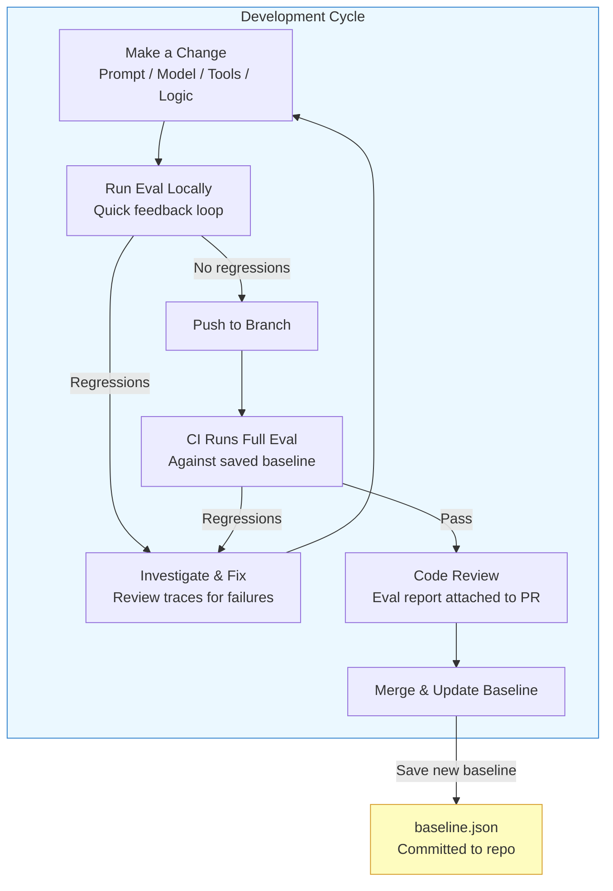

Three practices make this workflow effective:

**Run locally before pushing.** The full evaluation suite might take minutes, but a subset of critical test cases can run in seconds. Create a "smoke" dataset with your five most important test cases and run it after every prompt change. Save the full suite for CI.

**Commit your baseline.** The `baseline.json` file belongs in version control alongside your agent code. When you merge a change that improves scores, update the baseline in the same commit. This ensures every developer compares against the same known-good state.

**Grow your dataset continuously.** Every bug report is a potential test case. When a user reports that the agent gave a wrong answer, add that input and the correct answer to your evaluation dataset. Over time, your dataset becomes a comprehensive record of every failure mode your agent has encountered -- and a guarantee that each one stays fixed.

## 10.6 Summary

You built a complete evaluation harness across four stages. The **evaluation dataset** defines what to test and what correctness looks like. The **agent runner** executes each test case and captures traces for debugging. The **LLM judge** scores each output against its golden answer using a structured rubric. The **regression detector** compares current scores to a saved baseline and flags any degradation.

This harness turns agent development from guesswork into engineering. Instead of wondering whether a prompt change helped, you measure it. Instead of discovering regressions from user complaints, you catch them before merge. Instead of debating quality subjectively, you point to a number and a trend.

This lesson also concludes Module 10. You now have the full evaluation toolkit: the theory from Lessons 01 through 05, and the working code from this lab. Your agents are tested and evaluated -- Module 11 takes them to production with deployment, monitoring, and safety.

---

